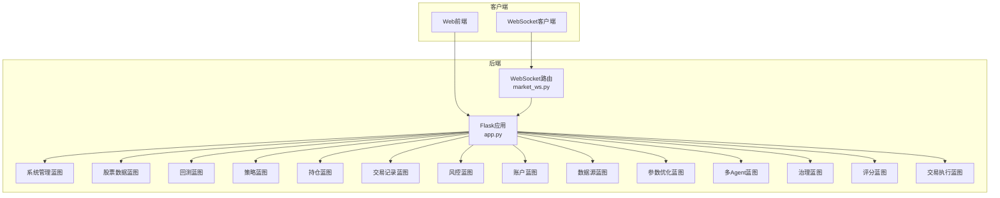
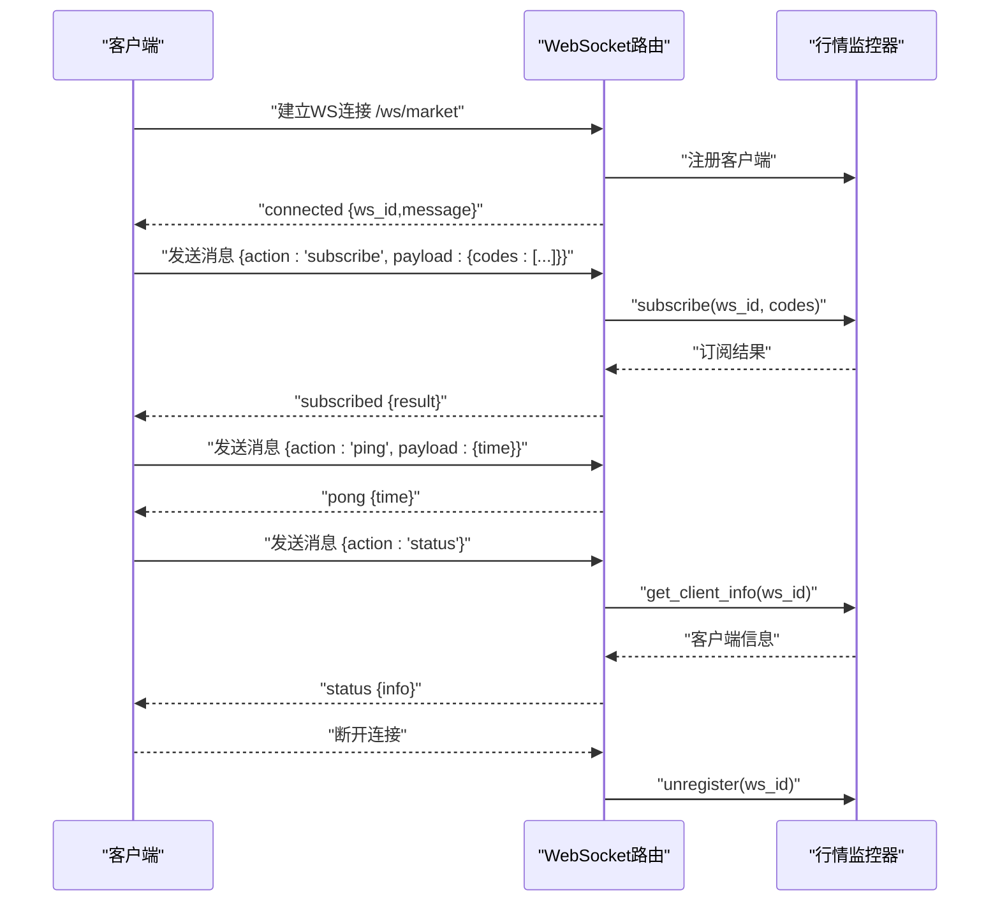
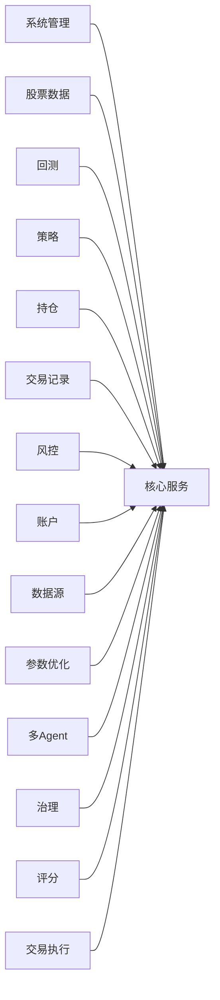

# API接口文档

<cite>
**本文档引用的文件**
- [app.py](file://app.py)
- [routes/__init__.py](file://routes/__init__.py)
- [routes/system.py](file://routes/system.py)
- [routes/stock.py](file://routes/stock.py)
- [routes/backtest.py](file://routes/backtest.py)
- [routes/strategy.py](file://routes/strategy.py)
- [routes/market_ws.py](file://routes/market_ws.py)
- [routes/position.py](file://routes/position.py)
- [routes/trade.py](file://routes/trade.py)
- [routes/risk.py](file://routes/risk.py)
- [routes/account.py](file://routes/account.py)
- [routes/data_source.py](file://routes/data_source.py)
- [routes/optimizer.py](file://routes/optimizer.py)
- [routes/agents.py](file://routes/agents.py)
- [routes/governance.py](file://routes/governance.py)
- [routes/scoring.py](file://routes/scoring.py)
- [routes/trade_execution.py](file://routes/trade_execution.py)
</cite>

## 目录
1. [简介](#简介)
2. [项目结构](#项目结构)
3. [核心组件](#核心组件)
4. [架构总览](#架构总览)
5. [详细组件分析](#详细组件分析)
6. [依赖关系分析](#依赖关系分析)
7. [性能考量](#性能考量)
8. [故障排查指南](#故障排查指南)
9. [结论](#结论)
10. [附录](#附录)

## 简介
本文件为AIQuant系统的完整API接口文档，覆盖RESTful HTTP接口与WebSocket接口，面向系统管理、策略、风险控制、回测、交易执行、数据源管理、多因子评分、三省六部治理等模块。文档提供端点清单、请求/响应模式、认证方式、错误处理策略、安全与速率限制建议、版本信息、常见用例、客户端实现指南、性能优化建议以及调试与监控方法。

## 项目结构
后端采用Flask + Blueprint组织路由，统一注册于应用入口；WebSocket通过flask_sock提供行情推送能力。各模块按功能域划分蓝图，便于扩展与维护。

```mermaid
graph TB
A["应用入口<br/>app.py"] --> B["蓝图注册<br/>routes/__init__.py"]
A --> C["系统管理<br/>routes/system.py"]
A --> D["股票数据<br/>routes/stock.py"]
A --> E["回测<br/>routes/backtest.py"]
A --> F["策略<br/>routes/strategy.py"]
A --> G["持仓<br/>routes/position.py"]
A --> H["交易记录<br/>routes/trade.py"]
A --> I["风控<br/>routes/risk.py"]
A --> J["账户快照<br/>routes/account.py"]
A --> K["数据源<br/>routes/data_source.py"]
A --> L["参数优化<br/>routes/optimizer.py"]
A --> M["多Agent流水线<br/>routes/agents.py"]
A --> N["治理架构<br/>routes/governance.py"]
A --> O["多因子评分<br/>routes/scoring.py"]
A --> P["交易执行<br/>routes/trade_execution.py"]
A --> Q["WebSocket行情<br/>routes/market_ws.py"]
```

图表来源
- [app.py:1-164](file://app.py#L1-L164)
- [routes/__init__.py:1-16](file://routes/__init__.py#L1-L16)

章节来源
- [app.py:1-164](file://app.py#L1-L164)
- [routes/__init__.py:1-16](file://routes/__init__.py#L1-L16)

## 核心组件
- 应用入口与蓝图注册：集中注册所有蓝图，并启动全局错误处理器与静态资源路由。
- WebSocket行情：提供实时行情订阅、取消订阅、心跳与状态查询。
- 业务模块蓝图：系统管理、股票数据、回测、策略、持仓、交易记录、风控、账户、数据源、参数优化、多Agent流水线、治理、多因子评分、交易执行等。

章节来源
- [app.py:1-164](file://app.py#L1-L164)
- [routes/market_ws.py:1-142](file://routes/market_ws.py#L1-L142)

## 架构总览
系统采用“HTTP REST API + WebSocket”的混合架构，HTTP负责数据查询与状态变更，WebSocket负责实时行情推送。蓝图按领域拆分，降低耦合度，便于独立演进。

图表来源
- [app.py:1-164](file://app.py#L1-L164)
- [routes/market_ws.py:1-142](file://routes/market_ws.py#L1-L142)

## 详细组件分析

### 系统管理API
- 触发数据同步
  - 方法：POST
  - 路径：/api/system/sync
  - 请求体：无
  - 响应：{"status":"started","message":"数据同步已启动"}
  - 并发控制：若正在运行则返回409
- 触发策略扫描
  - 方法：POST
  - 路径：/api/system/scan
  - 查询参数：force_recalc(bool，默认false)，use_v4(bool，默认true)
  - 响应：{"status":"started","message": "...","force_recalc":...,"use_v4":...}
  - 并发控制：若正在运行则返回409
- 获取系统状态
  - 方法：GET
  - 路径：/api/system/status
  - 响应：包含同步、扫描、调度器状态
- 启停定时任务调度
  - 方法：POST
  - 路径：/api/system/scheduler
  - 请求体：{"enable": true|false}
  - 响应：{"status":"enabled|disabled","message":"..."}
- 页面自动检查
  - 方法：GET
  - 路径：/api/system/auto_check
  - 响应：{"should_scan":bool,"reason":str,...}

章节来源
- [routes/system.py:12-152](file://routes/system.py#L12-L152)

### 股票数据API
- 搜索股票
  - 方法：GET
  - 路径：/api/stock/search?q=关键词
  - 响应：{"results":[...]}
- 热门股票
  - 方法：GET
  - 路径：/api/stock/hot
  - 响应：{"stocks":[...]}
- 股票列表
  - 方法：GET
  - 路径：/api/stock/list?with_score=true|false
  - 响应：{"results": [...]}
- K线数据
  - 方法：GET
  - 路径：/api/stock/kline?code=&start_date=&end_date=
  - 响应：{"klines": [...]}
- 股票分析
  - 方法：GET
  - 路径：/api/stock/analyze?symbol=&start_date=&strategy=composite
  - 响应：{"analysis": {...}}
- 股票信息
  - 方法：GET
  - 路径：/api/stock/info?symbol=
  - 响应：{"info": {...}}
- 单股回测
  - 方法：GET
  - 路径：/api/stock/backtest?symbol=&start_date=&strategy=&capital=
  - 响应：{"backtest": {...}}

章节来源
- [routes/stock.py:13-88](file://routes/stock.py#L13-L88)

### 回测API
- 批量回测
  - 方法：GET
  - 路径：/api/backtest/batch
  - 查询参数：
    - start_date(str, YYYY-MM-DD)
    - end_date(str, YYYY-MM-DD)
    - min_score(float)
    - capital(float)
    - max_positions(int)
    - max_position_size(float)
    - stop_loss(float)
    - take_profit(float)
    - use_market_timing(bool)
    - use_dynamic_position(bool)
    - weights(list of 5 floats)
  - 响应：回测结果对象
  - 错误：weights长度不为5或格式错误返回400

章节来源
- [routes/backtest.py:12-45](file://routes/backtest.py#L12-L45)

### 策略API
- 运行全部策略
  - 方法：GET
  - 路径：/api/strategies/run?symbol=&s1_*=...
  - 响应：策略结果对象
- 股票筛选（SSE流）
  - 方法：GET
  - 路径：/api/strategies/screen?symbols=&use_v4=true|false&min_score=&limit=
  - 响应：text/event-stream，逐条推送筛选进度
- 多策略回测
  - 方法：GET
  - 路径：/api/strategies/backtest?symbol=&start_date=&capital=
  - 响应：回测结果对象
- 策略对比
  - 方法：GET
  - 路径：/api/strategies/compare?symbols=&start_date=&strategy=
  - 响应：对比结果对象

章节来源
- [routes/strategy.py:14-87](file://routes/strategy.py#L14-L87)

### 持仓API
- 持仓列表
  - 方法：GET
  - 路径：/api/position/list?status=holding
  - 响应：{"positions":[...]}
- 新增持仓
  - 方法：POST
  - 路径：/api/position/add
  - 请求体：持仓字段
  - 响应：{"success":true,"position_id":...}
- 平仓
  - 方法：POST
  - 路径：/api/position/close
  - 请求体：{"position_id":...,"exit_price":...,"reason":"manual"|...}
  - 响应：{"success":true,"result":...}
- 部分平仓
  - 方法：POST
  - 路径：/api/position/partial_close
  - 请求体：{"position_id":...,"exit_price":...,"shares":...,"reason":"manual"|...}
  - 响应：{"success":true,"result":...}
- 更新持仓价格
  - 方法：POST
  - 路径：/api/position/update_price
  - 请求体：{"position_id":...,"current_price":...}
  - 响应：{"success":true}
- 持仓汇总
  - 方法：GET
  - 路径：/api/position/summary
  - 响应：{"summary": {...}}
- 删除持仓
  - 方法：POST
  - 路径：/api/position/delete
  - 请求体：{"position_id":...}
  - 响应：{"success":true}
- 刷新持仓价格
  - 方法：POST
  - 路径：/api/position/refresh_prices
  - 响应：刷新结果

章节来源
- [routes/position.py:15-116](file://routes/position.py#L15-L116)

### 交易记录API
- 交易列表
  - 方法：GET
  - 路径：/api/trades?code=&limit=100
  - 响应：{"trades":[...]}
- 新增交易
  - 方法：POST
  - 路径：/api/trades/add
  - 请求体：交易字段
  - 响应：{"success":true,"trade_id":...}

章节来源
- [routes/trade.py:12-43](file://routes/trade.py#L12-L43)

### 风控API
- 风控状态
  - 方法：GET
  - 路径：/api/risk/status
  - 响应：{"status":{"overall_level","blocked","current_drawdown",...}}
- 最近风控事件
  - 方法：GET
  - 路径：/api/risk/events?limit=50&level=
  - 响应：{"events":[...]}
- 手动风控检查
  - 方法：POST
  - 路径：/api/risk/check
  - 请求体：{"account_state": {...}}
  - 响应：{"overall_level","blocked","results":[...]}
- 风控配置
  - 方法：GET
  - 路径：/api/risk/config
  - 响应：{"config": {...},"config_path": "..."}
- 热加载配置
  - 方法：POST
  - 路径：/api/risk/config/reload
  - 响应：{"success":true,"config": {...}}
- 黑名单
  - 获取：GET /api/risk/blacklist
  - 新增：POST /api/risk/blacklist
  - 删除：DELETE /api/risk/blacklist/<code>
- 风控豁免
  - 申请：POST /api/risk/override
  - 记录：GET /api/risk/overrides?status=
  - 审批：POST /api/risk/override/<id>/approve
- 资产回撤
  - 方法：GET
  - 路径：/api/risk/drawdown?days=30
  - 响应：{"dates":[],"drawdowns":[],"max_drawdown",...}

章节来源
- [routes/risk.py:31-298](file://routes/risk.py#L31-L298)

### 账户快照API
- 账户快照列表
  - 方法：GET
  - 路径：/api/account/snapshots?days=30
  - 响应：{"snapshots":[...]}
- 最新快照
  - 方法：GET
  - 路径：/api/account/snapshot/latest
  - 响应：{"snapshot": {...}}
- 保存快照
  - 方法：POST
  - 路径：/api/account/snapshot/save
  - 请求体：快照数据
  - 响应：{"success":true}

章节来源
- [routes/account.py:11-38](file://routes/account.py#L11-L38)

### 数据源管理API
- 数据源列表
  - 方法：GET
  - 路径：/api/data/sources
  - 响应：{"primary","sources":[{"type","name","available","quality",...}]}
- 健康检查
  - 方法：GET
  - 路径：/api/data/health
  - 响应：{"results":[{...}]}
- 切换主数据源
  - 方法：POST
  - 路径：/api/data/switch
  - 请求体：{"source":"local|akshare|tushare"}
  - 响应：{"primary","message": "..."}
- 获取行情
  - 方法：GET
  - 路径：/api/data/price/<code>?start_date=&end_date=&source=
  - 响应：{"code","count","data": [...]}

章节来源
- [routes/data_source.py:25-112](file://routes/data_source.py#L25-L112)

### 参数优化API
- 优化运行
  - 方法：GET
  - 路径：/api/optimizer/run?symbol=&start_date=&strategy=&method=&metric=
  - 响应：优化结果对象
- 步进验证
  - 方法：GET
  - 路径：/api/optimizer/walkforward?symbol=&start_date=&strategy=&n_folds=
  - 响应：验证结果对象

章节来源
- [routes/optimizer.py:11-48](file://routes/optimizer.py#L11-L48)

### 多Agent流水线API
- 流水线状态
  - 方法：GET
  - 路径：/api/agents/status
  - 响应：{"pipeline_running","pipeline_status","current": {...}}
- 手动运行流水线
  - 方法：POST
  - 路径：/api/agents/run
  - 响应：{"message":"流水线已启动"}
- 运行单个Agent
  - 方法：POST
  - 路径：/api/agents/run/<agent_name>
  - 支持：["DataAgent","SignalAgent","BacktestAgent","RiskAgent","ReportAgent"]
  - 响应：{"message":"Agent ... 已启动"}
- 执行历史
  - 方法：GET
  - 路径：/api/agents/history?limit=10
  - 响应：{"history":[...]}
- 查看最新报告
  - 方法：GET
  - 路径：/api/agents/report
  - 响应：{"data": {...}} 或错误提示
- 三省六部架构信息
  - 方法：GET
  - 路径：/api/agents/governance
  - 响应：{"governance":{"flow","agents":[{...}],"provinces","ministries"}}

章节来源
- [routes/agents.py:22-128](file://routes/agents.py#L22-L128)

### 治理架构API
- 整体状态
  - 方法：GET
  - 路径：/api/governance/status
  - 响应：{"governance":{"crown_prince","chancellery","secretariat"},"ministries": {...}}
- 太子院决策
  - 获取：GET /api/governance/decision
  - 设置：POST /api/governance/decision（{"stance","risk_appetite","notes"}）
- 中书省策略
  - 获取：GET /api/governance/strategy
- 尚书省执行
  - 获取：GET /api/governance/execution
- 六部状态
  - 方法：GET
  - 路径：/api/governance/ministries
  - 响应：{"ministries":{"rites","war","works"}}

章节来源
- [routes/governance.py:25-151](file://routes/governance.py#L25-L151)

### 多因子评分API
- 单股评分
  - 方法：POST
  - 路径：/api/scoring/evaluate
  - 请求体：{"code","name","days":120}
  - 响应：{"total_score","grade","recommendation","signals","factors":[{...}]}
- 批量评分
  - 方法：POST
  - 路径：/api/scoring/batch
  - 请求体：{"stocks":[{"code","name"}],"days":120,"top_n":20}
  - 响应：{"evaluated","top_n","results":[{...}]}
- 可用因子
  - 方法：GET
  - 路径：/api/scoring/factors
  - 响应：{"factors":[...]}
- 权重设置
  - 获取：GET /api/scoring/weights
  - 设置：POST /api/scoring/weights（{"weights":{...}}，要求总和≈1.0）

章节来源
- [routes/scoring.py:30-179](file://routes/scoring.py#L30-L179)

### 交易执行API
- 创建订单
  - 方法：POST
  - 路径：/api/trade/order
  - 请求体：{"code","name","direction":"buy|sell","price","shares","reason","simulate":true|false}
  - 响应：{"order": {...},"mode":"simulate|live"}
- 订单列表
  - 方法：GET
  - 路径：/api/trade/orders?status=&limit=100
  - 响应：{"orders":[{...}]}
- 撤销订单
  - 方法：POST
  - 路径：/api/trade/order/<id>/cancel
  - 响应：{"message": "..."}
- 持仓列表
  - 方法：GET
  - 路径：/api/trade/positions
  - 响应：{"positions":[{...}]}
- 批量更新持仓价格
  - 方法：POST
  - 路径：/api/trade/position/update
  - 请求体：{"prices":{code:price}}
  - 响应：{"updated":[...]}
- 账户概览
  - 方法：GET
  - 路径：/api/trade/account
  - 响应：{"account": {...}}
- 模拟成交
  - 方法：POST
  - 路径：/api/trade/simulate/fill
  - 请求体：{"order_id","filled_price","filled_shares"}
  - 响应：{"message": "已成交|成交失败"}

章节来源
- [routes/trade_execution.py:23-217](file://routes/trade_execution.py#L23-L217)

### WebSocket行情接口
- 连接地址
  - ws://host:port/ws/market
- 服务端点
  - GET /api/market/status：监控状态
  - GET /api/market/clients：客户端列表
  - POST /api/market/start：手动启动推送
  - POST /api/market/stop：手动停止推送
- 消息格式
  - 客户端发送：{"action":"subscribe|unsubscribe|ping|status","payload":{...}}
  - 服务端发送：{"type":"connected|subscribed|unsubscribed|pong|status|error","data":{...},"timestamp":"ISO8601"}
- 事件类型
  - connected：连接确认
  - subscribed/unsubscribed：订阅/退订结果
  - pong：心跳响应
  - status：客户端状态
  - error：错误通知

图表来源
- [routes/market_ws.py:72-123](file://routes/market_ws.py#L72-L123)

章节来源
- [routes/market_ws.py:26-142](file://routes/market_ws.py#L26-L142)

## 依赖关系分析
- 组件内聚：每个蓝图聚焦单一领域，职责清晰。
- 组件耦合：HTTP路由层仅做协议转换，业务逻辑位于service与engine层，便于替换与测试。
- 外部依赖：数据源管理、订单管理、风控引擎、评分引擎等通过模块化封装对外暴露稳定接口。
- 循环依赖：蓝图间无直接循环导入，通过模块导入顺序与延迟调用避免。

图表来源
- [app.py:44-72](file://app.py#L44-L72)

章节来源
- [app.py:44-72](file://app.py#L44-L72)

## 性能考量
- SSE流式输出：策略筛选使用SSE，避免一次性返回大量数据，提升前端体验。
- 异步执行：系统扫描与同步通过后台线程执行，避免阻塞主线程。
- 缓存与预计算：行情监控器内部维护客户端与订阅状态，减少重复计算。
- 分页与限制：交易与Agent历史默认限制数量，防止超大数据集传输。
- WebSocket批量推送：行情推送按订阅集合广播，减少网络开销。

## 故障排查指南
- 通用错误
  - 404：路径不存在，检查URL拼写与蓝图前缀
  - 500：服务器内部错误，查看后端日志
- 参数校验
  - 缺少必要参数：返回400，检查必填字段
  - weights格式错误：返回400，确保为5个数值且逗号分隔
- 并发冲突
  - 同步/扫描已在运行：返回409，等待完成后重试
- WebSocket异常
  - 未知动作：服务端返回error消息
  - 连接异常：服务端打印异常并清理客户端

章节来源
- [routes/backtest.py:20-22](file://routes/backtest.py#L20-L22)
- [routes/system.py:15-16](file://routes/system.py#L15-L16)
- [routes/market_ws.py:116-122](file://routes/market_ws.py#L116-L122)

## 结论
本API文档覆盖了AIQuant系统的主要REST与WebSocket接口，提供了清晰的端点定义、请求/响应模式与错误处理策略。通过蓝图化设计与模块化封装，系统具备良好的可扩展性与可维护性。建议在生产环境中结合Nginx限流、HTTPS与鉴权机制进一步强化安全与稳定性。

## 附录
- 版本信息
  - 当前版本：未在代码中显式声明版本号，建议在后续迭代中引入语义化版本并在API中体现
- 认证与安全
  - 当前实现未包含认证与授权逻辑，建议在网关或中间件层增加鉴权与CORS策略
- 速率限制
  - 未内置速率限制，建议在网关或应用层增加限流策略（如令牌桶/滑动窗口）
- 常见用例
  - 实时行情监控：建立WS连接，订阅所需股票代码，接收推送
  - 策略筛选：发起SSE流式筛选，逐步获取候选股票
  - 风控检查：手动触发风控检查，评估整体风险等级
- 客户端实现要点
  - HTTP客户端：遵循查询参数与请求体规范，处理4xx/5xx错误码
  - WebSocket客户端：实现订阅/退订、心跳与断线重连
- 调试与监控
  - 健康检查：GET /api/health
  - 路由调试：GET /api/debug/routes
  - WebSocket状态：GET /api/market/status 与 /api/market/clients
- 已弃用与兼容性
  - 未发现明确的弃用接口或版本迁移说明，建议在后续版本中通过API版本头或路径前缀进行兼容管理