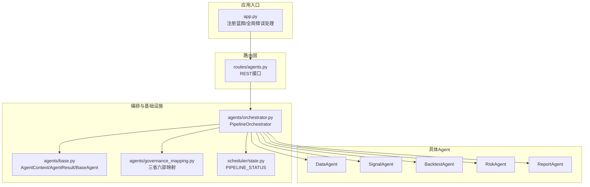
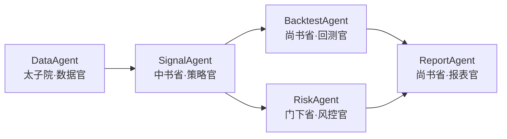
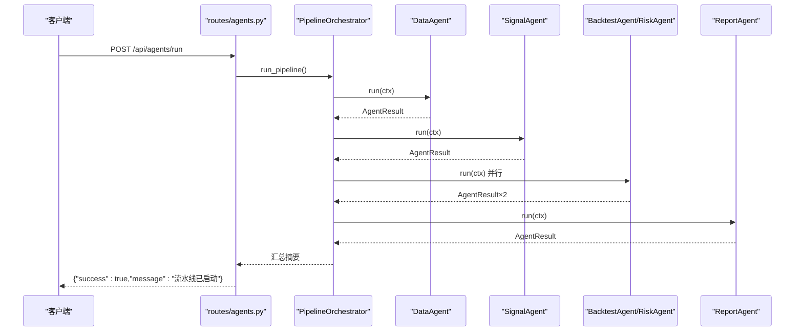
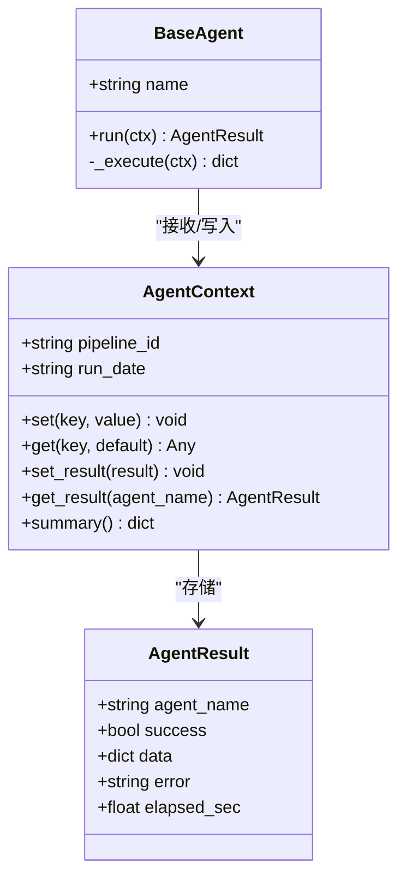
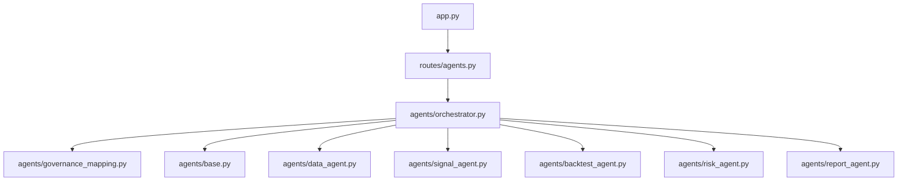
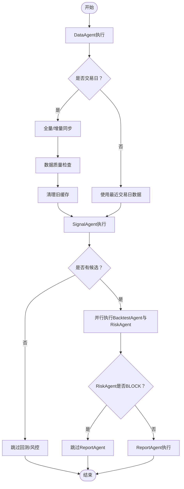

# Agent流水线API

<cite>
**本文档引用的文件**
- [routes/agents.py](file://routes/agents.py)
- [agents/orchestrator.py](file://agents/orchestrator.py)
- [agents/base.py](file://agents/base.py)
- [agents/data_agent.py](file://agents/data_agent.py)
- [agents/signal_agent.py](file://agents/signal_agent.py)
- [agents/backtest_agent.py](file://agents/backtest_agent.py)
- [agents/risk_agent.py](file://agents/risk_agent.py)
- [agents/report_agent.py](file://agents/report_agent.py)
- [agents/governance_mapping.py](file://agents/governance_mapping.py)
- [scheduler/state.py](file://scheduler/state.py)
- [app.py](file://app.py)
</cite>

## 目录
1. [简介](#简介)
2. [项目结构](#项目结构)
3. [核心组件](#核心组件)
4. [架构总览](#架构总览)
5. [详细组件分析](#详细组件分析)
6. [依赖分析](#依赖分析)
7. [性能考虑](#性能考虑)
8. [故障排查指南](#故障排查指南)
9. [结论](#结论)
10. [附录](#附录)

## 简介
本文件为AIQuant项目的“多Agent流水线API”提供全面、系统的文档。重点覆盖：
- 多Agent编排、任务调度、状态查询、错误处理等Agent系统相关接口
- Agent启动/停止、状态监控、任务分配、结果收集等功能的API规范
- Agent类型管理、优先级设置、负载均衡、故障转移等高级特性接口说明
- Agent间通信、数据传递、同步/异步处理等技术细节
- Agent生命周期管理、性能监控、资源控制、安全隔离等系统级考虑

## 项目结构
围绕Agent流水线API的关键目录与文件如下：
- 路由层：routes/agents.py 提供REST接口
- 编排器：agents/orchestrator.py 负责流水线调度与状态持久化
- 基础设施：agents/base.py 定义Agent基类、上下文、结果模型
- 具体Agent：agents/data_agent.py、agents/signal_agent.py、agents/backtest_agent.py、agents/risk_agent.py、agents/report_agent.py
- 三省六部映射：agents/governance_mapping.py
- 进程内状态：scheduler/state.py
- 应用入口：app.py 注册蓝图与全局错误处理

图表来源
- [routes/agents.py:1-128](file://routes/agents.py#L1-L128)
- [agents/orchestrator.py:1-263](file://agents/orchestrator.py#L1-L263)
- [agents/base.py:1-120](file://agents/base.py#L1-L120)
- [agents/governance_mapping.py:1-155](file://agents/governance_mapping.py#L1-L155)
- [scheduler/state.py:1-45](file://scheduler/state.py#L1-L45)
- [app.py:1-164](file://app.py#L1-L164)

章节来源
- [routes/agents.py:1-128](file://routes/agents.py#L1-L128)
- [agents/orchestrator.py:1-263](file://agents/orchestrator.py#L1-L263)
- [agents/base.py:1-120](file://agents/base.py#L1-L120)
- [agents/governance_mapping.py:1-155](file://agents/governance_mapping.py#L1-L155)
- [scheduler/state.py:1-45](file://scheduler/state.py#L1-L45)
- [app.py:1-164](file://app.py#L1-L164)

## 核心组件
- REST接口层：提供状态查询、手动触发流水线、单Agent触发、历史查询、报告查看、三省六部架构信息等接口
- 编排器：负责串行/并行执行、错误处理、状态持久化、流水线摘要生成
- 上下文与结果：统一的数据通道与结果封装，支持跨Agent共享与汇总
- 三省六部映射：定义Agent与古代官职的对应关系，便于理解职责与依赖
- 进程内状态：维护流水线运行状态、最后执行结果、各Agent实时状态

章节来源
- [routes/agents.py:22-128](file://routes/agents.py#L22-L128)
- [agents/orchestrator.py:36-263](file://agents/orchestrator.py#L36-L263)
- [agents/base.py:20-120](file://agents/base.py#L20-L120)
- [agents/governance_mapping.py:21-155](file://agents/governance_mapping.py#L21-L155)
- [scheduler/state.py:15-45](file://scheduler/state.py#L15-L45)

## 架构总览
Agent流水线采用“三省六部制”组织，严格定义了执行顺序与依赖关系：
- 太子院·数据官（串行，必须先完成）
- 中书省·策略官（依赖太子院）
- 门下省·风控官 + 尚书省·回测官（并行）
- 尚书省·报表官（依赖前面所有）

图表来源
- [agents/orchestrator.py:11-16](file://agents/orchestrator.py#L11-L16)
- [agents/governance_mapping.py:10-14](file://agents/governance_mapping.py#L10-L14)

章节来源
- [agents/orchestrator.py:11-16](file://agents/orchestrator.py#L11-L16)
- [agents/governance_mapping.py:10-14](file://agents/governance_mapping.py#L10-L14)

## 详细组件分析

### REST接口规范
- GET /api/agents/status
  - 功能：获取当前流水线状态
  - 返回：pipeline_running、pipeline_status、current
- POST /api/agents/run
  - 功能：手动触发完整流水线
  - 返回：success/message 或错误码409（已在运行）
- POST /api/agents/run/<agent_name>
  - 功能：手动触发单个Agent
  - 参数：agent_name ∈ {"DataAgent","SignalAgent","BacktestAgent","RiskAgent","ReportAgent"}
  - 返回：success/message 或错误码400/409
- GET /api/agents/history?limit=N
  - 功能：获取最近N条执行历史
  - 返回：history数组
- GET /api/agents/report
  - 功能：查看今日生成的报告（HTML/JSON）
  - 返回：报告数据或错误信息
- GET /api/agents/governance
  - 功能：获取三省六部架构信息与各Agent角色

章节来源
- [routes/agents.py:22-128](file://routes/agents.py#L22-L128)

### 编排器PipelineOrchestrator
- 职责
  - 管理三省六部执行顺序与依赖关系
  - 支持串行与并行执行
  - 错误处理与重试机制（当前未实现自动重试，异常会传播）
  - 状态持久化（供API查询）
  - 定时触发集成（当前通过API触发）
- 关键方法
  - run_pipeline：执行完整流水线，生成摘要并记录历史
  - run_single：单Agent快捷执行（调试/手动触发）
  - _run_agent/_run_parallel：执行单个或并行多个Agent
  - get_current_status/get_history：状态查询
- 非交易日处理
  - 若DataAgent判定非交易日，尝试使用最近交易日数据继续执行
- 门下省一票否决
  - 若RiskAgent风控级别为BLOCK，则跳过ReportAgent

图表来源
- [routes/agents.py:34-48](file://routes/agents.py#L34-L48)
- [agents/orchestrator.py:81-175](file://agents/orchestrator.py#L81-L175)

章节来源
- [agents/orchestrator.py:36-263](file://agents/orchestrator.py#L36-L263)

### Agent基类与上下文
- BaseAgent
  - run(ctx)：自动计时、异常捕获、结果封装
  - _execute(ctx)：子类实现具体逻辑
- AgentContext
  - set/get：跨Agent共享数据
  - set_result/get_result：存储各Agent结果
  - summary：生成流水线执行摘要
- AgentResult
  - 统一的结果结构：agent_name、success、data、error、耗时等

图表来源
- [agents/base.py:88-120](file://agents/base.py#L88-L120)
- [agents/base.py:38-86](file://agents/base.py#L38-L86)
- [agents/base.py:20-36](file://agents/base.py#L20-L36)

章节来源
- [agents/base.py:20-120](file://agents/base.py#L20-L120)

### DataAgent（太子院·数据官）
- 职责
  - 交易日判断
  - 全市场行情同步（收盘后全量/盘中增量）
  - 数据质量检查（缺失率、异常值检测）
  - 清理旧缓存
- 非交易日处理
  - 若非交易日，返回跳过原因与最近交易日数据

章节来源
- [agents/data_agent.py:25-167](file://agents/data_agent.py#L25-L167)

### SignalAgent（中书省·策略官）
- 职责
  - 运行5策略融合与v4超跌反弹扫描
  - 生成候选股票列表（按评分排序）
  - 保存到stock_signal表供面板展示
- 策略参数
  - START_CAPITAL、POSITION_PER_STOCK、STOP_LOSS、TAKE_PROFIT、阈值等

章节来源
- [agents/signal_agent.py:41-213](file://agents/signal_agent.py#L41-L213)

### BacktestAgent（尚书省·回测官）
- 职责
  - 对候选股做快速历史回测验证
  - 计算胜率、平均收益、最大回撤等指标
- 数据来源
  - fusion_candidates与v4_candidates来自SignalAgent

章节来源
- [agents/backtest_agent.py:31-181](file://agents/backtest_agent.py#L31-L181)

### RiskAgent（门下省·风控官）
- 职责
  - 大盘趋势与波动率评估
  - 个股风险筛查（ST、退市、停牌、连续涨停、放量大跌等）
  - 仓位建议（基于市场环境）
  - 系统化风控检查（接入risk/模块）
  - 若被BLOCK，在上下文中标记拦截
- 风控拦截
  - 门下省一票否决：若overall_level为BLOCK，则跳过ReportAgent

章节来源
- [agents/risk_agent.py:25-262](file://agents/risk_agent.py#L25-L262)

### ReportAgent（尚书省·报表官）
- 职责
  - 整合上游Agent输出
  - 生成每日交易计划HTML报告与微信推送文本
  - 保存报告到reports/目录
- 数据整合
  - 合并融合与v4候选，去重并补充回测与风险信息
  - 生成推荐列表与风险摘要

章节来源
- [agents/report_agent.py:20-393](file://agents/report_agent.py#L20-L393)

### 三省六部映射
- 定义Agent与古代官职的对应关系，提供统一命名转换与流程描述
- 提供流程图：阶段、省份、角色、Agent、是否并行

章节来源
- [agents/governance_mapping.py:21-155](file://agents/governance_mapping.py#L21-L155)

### 进程内状态
- PIPELINE_STATUS：维护流水线运行状态、最后执行ID、时间、结果、各Agent实时状态
- update_pipeline_status：更新状态（线程安全由调用方保证）

章节来源
- [scheduler/state.py:15-45](file://scheduler/state.py#L15-L45)

## 依赖分析
- 路由层依赖编排器与治理映射
- 编排器依赖各Agent模块与上下文
- 各Agent依赖基础框架与业务模块（数据、回测、风控等）
- 应用入口注册所有蓝图并提供全局错误处理

图表来源
- [routes/agents.py:13-19](file://routes/agents.py#L13-L19)
- [agents/orchestrator.py:29-31](file://agents/orchestrator.py#L29-L31)
- [app.py:19-72](file://app.py#L19-L72)

章节来源
- [routes/agents.py:13-19](file://routes/agents.py#L13-L19)
- [agents/orchestrator.py:29-31](file://agents/orchestrator.py#L29-L31)
- [app.py:19-72](file://app.py#L19-L72)

## 性能考虑
- 并行执行
  - 门下省与尚书省的回测与风控并行，提升吞吐
- 线程模型
  - 编排器内部使用线程池与线程Join，注意GIL与CPU密集型任务的并发效果
- I/O与网络
  - 数据同步、回测、风控等操作可能涉及数据库与外部数据源，建议在Agent内部进行限流与重试
- 状态持久化
  - 历史记录限制为最近30条，避免内存膨胀
- 非交易日处理
  - 使用最近交易日数据减少无效计算

[本节为通用性能讨论，无需特定文件引用]

## 故障排查指南
- 常见错误码
  - 409：流水线已在运行中
  - 400：未知Agent名称
- 常见问题定位
  - 检查DataAgent是否成功（非交易日会提前终止）
  - 检查SignalAgent是否返回候选（空列表时ReportAgent不会生成有效推荐）
  - 检查RiskAgent是否触发BLOCK（风控拦截将跳过ReportAgent）
  - 检查报告目录是否存在今日JSON/HTML
- 日志与追踪
  - 编排器打印每个Agent的执行状态与耗时
  - AgentResult包含error字段，可用于定位异常

章节来源
- [routes/agents.py:38-60](file://routes/agents.py#L38-L60)
- [agents/orchestrator.py:111-175](file://agents/orchestrator.py#L111-L175)
- [agents/base.py:107-114](file://agents/base.py#L107-L114)

## 结论
本Agent流水线API以“三省六部制”为组织形态，实现了清晰的职责划分与严格的依赖顺序。通过统一的上下文与结果模型，实现了Agent间的高效数据传递与状态监控。接口设计简洁明确，支持手动触发、状态查询、历史追溯与报告查看。未来可在自动重试、优先级调度、负载均衡与故障转移等方面进一步增强。

[本节为总结性内容，无需特定文件引用]

## 附录

### API清单与示例
- GET /api/agents/status
  - 返回：pipeline_running、pipeline_status、current
- POST /api/agents/run
  - 返回：{"success":true,"message":"流水线已启动"}
- POST /api/agents/run/<agent_name>
  - 返回：{"success":true,"message":"Agent {name} 已启动"}
- GET /api/agents/history?limit=10
  - 返回：{"success":true,"history":[...]}
- GET /api/agents/report
  - 返回：{"success":true,"date":"YYYY-MM-DD","data":{...}} 或错误信息
- GET /api/agents/governance
  - 返回：{"success":true,"governance":{"flow":[...],"agents":[...]}}

章节来源
- [routes/agents.py:22-128](file://routes/agents.py#L22-L128)

### Agent间数据传递流程

图表来源
- [agents/orchestrator.py:111-175](file://agents/orchestrator.py#L111-L175)
- [agents/data_agent.py:35-86](file://agents/data_agent.py#L35-L86)
- [agents/signal_agent.py:95-108](file://agents/signal_agent.py#L95-L108)
- [agents/risk_agent.py:60-81](file://agents/risk_agent.py#L60-L81)
- [agents/report_agent.py:63-90](file://agents/report_agent.py#L63-L90)