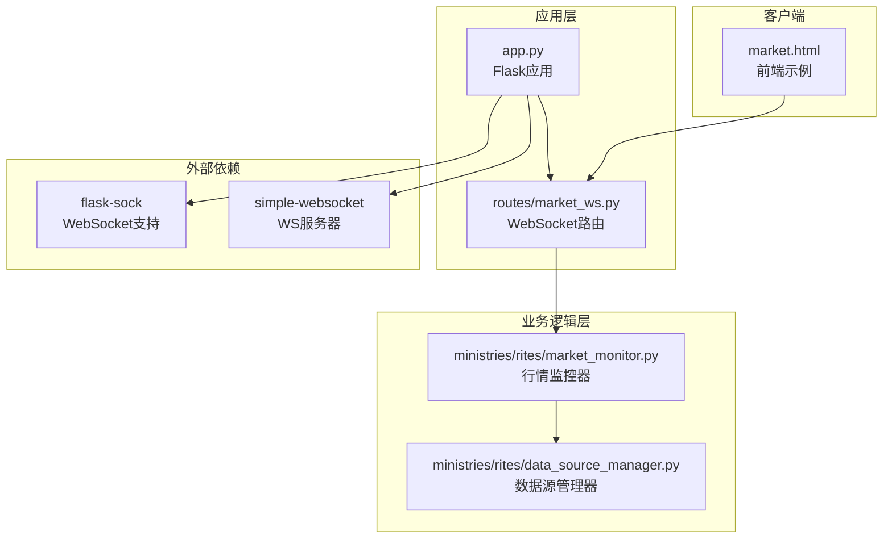
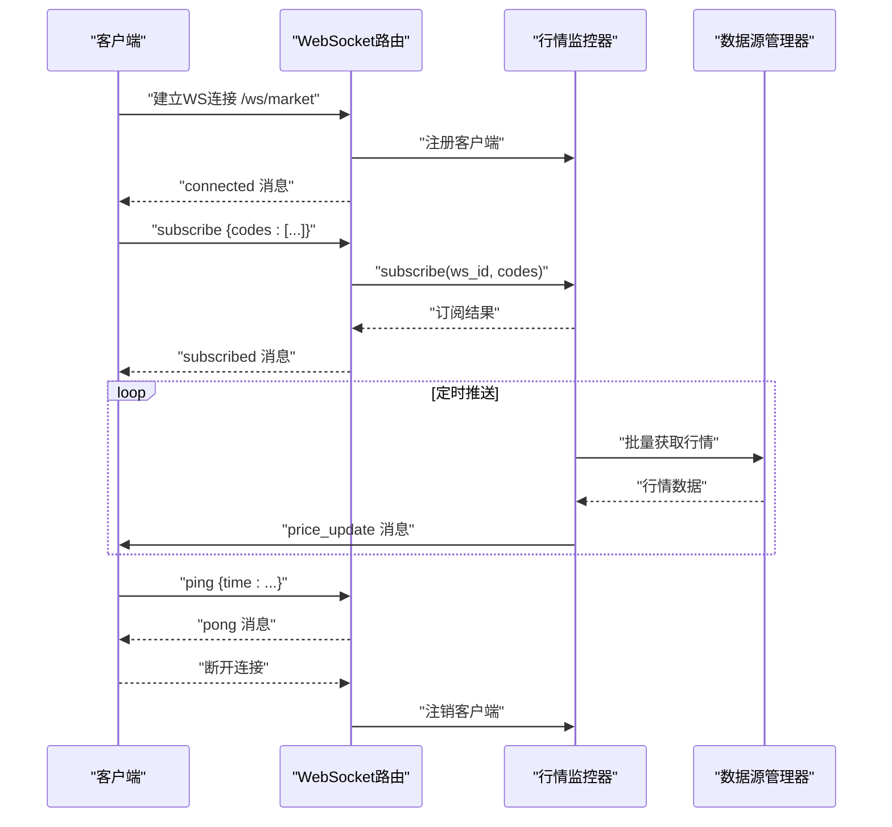
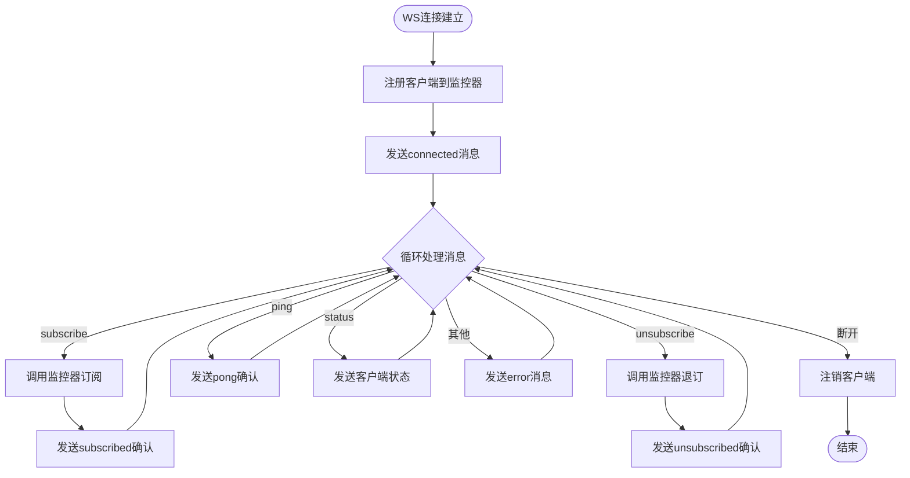
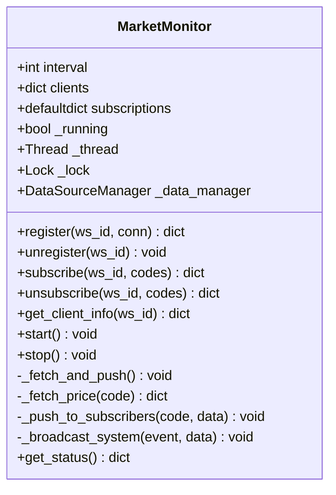
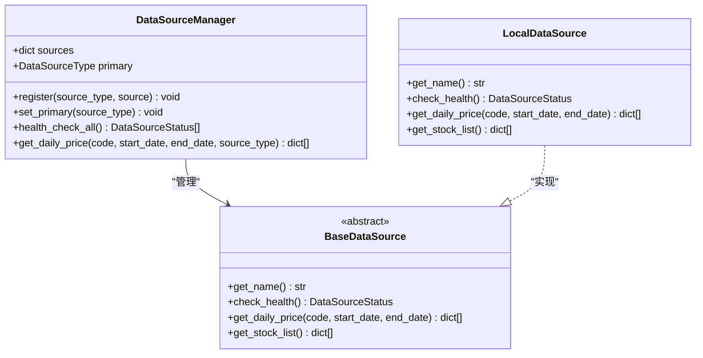
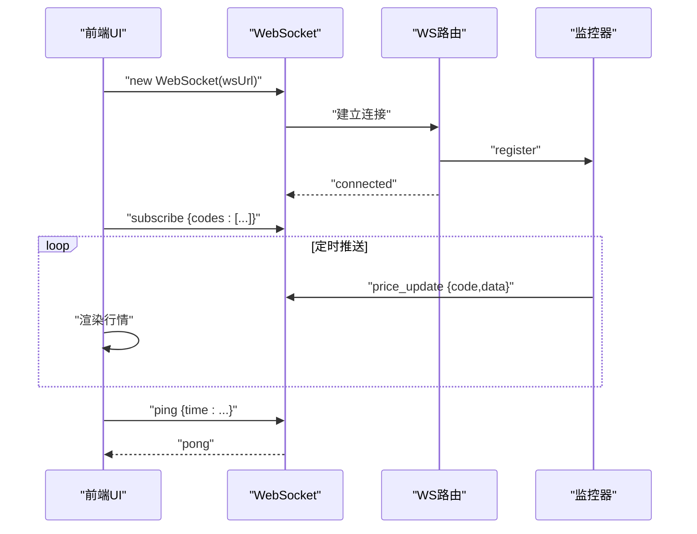

# WebSocket实时数据API

<cite>
**本文档引用的文件**
- [app.py](file://app.py)
- [routes/market_ws.py](file://routes/market_ws.py)
- [ministries/rites/market_monitor.py](file://ministries/rites/market_monitor.py)
- [ministries/rites/data_source_manager.py](file://ministries/rites/data_source_manager.py)
- [market.html](file://market.html)
- [requirements.txt](file://requirements.txt)
</cite>

## 目录
1. [简介](#简介)
2. [项目结构](#项目结构)
3. [核心组件](#核心组件)
4. [架构概览](#架构概览)
5. [详细组件分析](#详细组件分析)
6. [消息协议规范](#消息协议规范)
7. [客户端集成指南](#客户端集成指南)
8. [性能与并发](#性能与并发)
9. [故障排除](#故障排除)
10. [结论](#结论)

## 简介
本文件为AIQuant项目的WebSocket实时数据API技术文档，详细说明了实时行情推送、订阅管理、连接生命周期管理、错误处理与重连机制等技术规范。系统基于Flask-Sock实现WebSocket服务，通过MarketMonitor进行行情数据的定时拉取与推送，并支持客户端的订阅/退订操作和心跳检测。

## 项目结构
AIQuant的WebSocket相关代码主要分布在以下模块：
- 应用入口与路由注册：app.py
- WebSocket路由与消息处理：routes/market_ws.py
- 实时行情监控与推送：ministries/rites/market_monitor.py
- 数据源管理：ministries/rites/data_source_manager.py
- 前端示例客户端：market.html
- 依赖声明：requirements.txt

**图表来源**
- [app.py:1-164](file://app.py#L1-L164)
- [routes/market_ws.py:1-142](file://routes/market_ws.py#L1-L142)
- [ministries/rites/market_monitor.py:1-244](file://ministries/rites/market_monitor.py#L1-L244)
- [ministries/rites/data_source_manager.py:1-190](file://ministries/rites/data_source_manager.py#L1-L190)

**章节来源**
- [app.py:1-164](file://app.py#L1-L164)
- [routes/market_ws.py:1-142](file://routes/market_ws.py#L1-L142)
- [ministries/rites/market_monitor.py:1-244](file://ministries/rites/market_monitor.py#L1-L244)
- [ministries/rites/data_source_manager.py:1-190](file://ministries/rites/data_source_manager.py#L1-L190)

## 核心组件
- WebSocket路由与消息处理：负责建立连接、接收客户端指令、分发系统消息、发送行情推送。
- 行情监控器：维护客户端连接与订阅关系、定时拉取行情数据、向订阅者推送行情更新。
- 数据源管理器：抽象不同数据源接口，提供主备切换与健康检查能力。
- 前端示例：展示如何建立连接、订阅股票、处理消息与心跳。

**章节来源**
- [routes/market_ws.py:67-123](file://routes/market_ws.py#L67-L123)
- [ministries/rites/market_monitor.py:21-244](file://ministries/rites/market_monitor.py#L21-L244)
- [ministries/rites/data_source_manager.py:111-190](file://ministries/rites/data_source_manager.py#L111-L190)

## 架构概览
WebSocket实时数据API采用请求-响应与事件驱动相结合的架构：
- 客户端通过WebSocket连接到/ws/market
- 服务端在收到订阅请求后，将客户端加入订阅关系
- 后台线程按固定间隔拉取行情数据，推送至所有订阅该股票的客户端
- 支持系统事件广播（如客户端连接/断开）

**图表来源**
- [routes/market_ws.py:72-122](file://routes/market_ws.py#L72-L122)
- [ministries/rites/market_monitor.py:108-152](file://ministries/rites/market_monitor.py#L108-L152)
- [ministries/rites/data_source_manager.py:153-177](file://ministries/rites/data_source_manager.py#L153-L177)

## 详细组件分析

### WebSocket路由与消息处理
- 路由定义：/ws/market（WebSocket）、/api/market/status（状态查询）、/api/market/clients（客户端列表）、/api/market/start、/api/market/stop（手动启停推送）
- 连接建立：生成ws_id，注册到监控器，发送connected消息
- 消息类型：
  - 订阅：subscribe {codes:[...]}
  - 退订：unsubscribe {codes:[...]}
  - 心跳：ping {time:...}
  - 状态：status
  - 系统事件：由监控器广播（如client_connected/disconnected）
- 错误处理：捕获解析与处理异常，发送error消息；连接异常打印日志并注销客户端

**图表来源**
- [routes/market_ws.py:72-122](file://routes/market_ws.py#L72-L122)

**章节来源**
- [routes/market_ws.py:26-64](file://routes/market_ws.py#L26-L64)
- [routes/market_ws.py:72-122](file://routes/market_ws.py#L72-L122)
- [routes/market_ws.py:125-141](file://routes/market_ws.py#L125-L141)

### 行情监控器
- 角色：管理客户端连接、维护订阅关系、定时拉取行情并推送
- 关键数据结构：
  - clients：ws_id -> {conn, subscriptions, connected_at}
  - subscriptions：code -> set(ws_id)
- 核心方法：
  - register/unregister：客户端生命周期管理
  - subscribe/unsubscribe：订阅管理（大小写标准化、去重）
  - start/stop：后台推送线程启停
  - _fetch_and_push/_fetch_price：批量获取行情并推送
  - _push_to_subscribers：向订阅者发送price_update
  - _broadcast_system：广播系统事件
- 线程安全：使用锁保护共享状态
- 性能特性：批量获取（每批最多10只），避免一次性请求过多导致阻塞

**图表来源**
- [ministries/rites/market_monitor.py:21-244](file://ministries/rites/market_monitor.py#L21-L244)

**章节来源**
- [ministries/rites/market_monitor.py:21-244](file://ministries/rites/market_monitor.py#L21-L244)

### 数据源管理器
- 抽象基类BaseDataSource定义统一接口：check_health、get_daily_price、get_stock_list
- LocalDataSource实现本地数据库数据源，提供健康检查与数据获取
- DataSourceManager负责注册默认数据源、设置主数据源、健康检查与自动切换
- get_daily_price支持主备数据源自动切换，提升可用性

**图表来源**
- [ministries/rites/data_source_manager.py:48-190](file://ministries/rites/data_source_manager.py#L48-L190)

**章节来源**
- [ministries/rites/data_source_manager.py:111-190](file://ministries/rites/data_source_manager.py#L111-L190)

## 消息协议规范

### 连接参数与认证
- 连接URL：ws://host:port/ws/market
- 认证方式：本系统未实现专门的鉴权机制，客户端需自行管理访问控制
- 心跳机制：客户端定期发送ping消息，服务端返回pong确认

### 消息格式
所有消息均为JSON对象，包含以下字段：
- type：消息类型
- data：消息体内容
- timestamp：ISO格式时间戳

### 事件类型
- connected：连接成功，data包含ws_id与提示信息
- subscribed：订阅成功，data包含订阅列表与总数
- unsubscribed：退订成功，data包含退订列表与剩余总数
- error：错误消息，data包含错误描述
- price_update：行情推送，data包含股票代码、时间戳与OHLCV等字段
- system：系统事件，data包含事件类型与统计信息
- pong：心跳响应，data包含客户端发送的时间戳

### 请求与响应
- 订阅请求：{action:"subscribe", payload:{codes:[...]}}
- 退订请求：{action:"unsubscribe", payload:{codes:[...]}}
- 心跳请求：{action:"ping", payload:{time:...}}
- 状态请求：{action:"status"}

**章节来源**
- [routes/market_ws.py:125-141](file://routes/market_ws.py#L125-L141)
- [ministries/rites/market_monitor.py:180-184](file://ministries/rites/market_monitor.py#L180-L184)
- [ministries/rites/market_monitor.py:194-210](file://ministries/rites/market_monitor.py#L194-L210)

## 客户端集成指南

### 前端示例（JavaScript）
- 连接建立：使用WebSocket构造函数连接wsUrl
- 重连策略：断开后5秒自动重连
- 订阅管理：维护subscribed集合，增删时同步发送subscribe/unsubscribe
- 消息处理：根据type分支处理connected、subscribed、price_update、system、pong
- 心跳：每30秒发送一次ping消息

**图表来源**
- [market.html:161-188](file://market.html#L161-L188)
- [market.html:196-214](file://market.html#L196-L214)
- [routes/market_ws.py:72-122](file://routes/market_ws.py#L72-L122)

**章节来源**
- [market.html:147-301](file://market.html#L147-L301)

### Python客户端示例
- 使用websockets库或标准websocket-client库
- 建议实现指数回退重连策略
- 订阅前先发送ping验证连接
- 对price_update消息进行缓存与去重处理

## 性能与并发

### 并发模型
- 后台线程：MarketMonitor使用独立线程执行推送循环，避免阻塞主线程
- 线程安全：通过锁保护clients与subscriptions等共享状态
- 异步I/O：Flask-Sock基于gevent，支持高并发连接

### 批量处理
- 每次批量获取最多10只股票的行情，减少单次请求压力
- _push_to_subscribers逐个发送，遇到异常继续下一个客户端

### 内存与资源
- clients字典存储每个连接的引用，断开时及时清理
- subscriptions字典按股票维护订阅者集合，便于快速推送

**章节来源**
- [ministries/rites/market_monitor.py:108-152](file://ministries/rites/market_monitor.py#L108-L152)
- [ministries/rites/market_monitor.py:175-192](file://ministries/rites/market_monitor.py#L175-L192)

## 故障排除

### 常见问题
- 连接失败：检查服务端是否启动，端口是否正确开放
- 订阅无效：确认codes格式正确且不重复，注意大小写标准化
- 心跳超时：客户端应保持每30秒发送一次ping
- 推送延迟：检查数据源可用性与网络状况

### 错误处理策略
- 服务端：捕获异常并返回error消息，记录日志
- 客户端：断线自动重连，重连后重新订阅
- 监控器：推送失败不影响整体流程，继续处理其他订阅者

### 调试接口
- /api/market/status：获取监控器状态（运行状态、客户端数量、订阅数量等）
- /api/market/clients：获取当前连接的客户端列表
- /api/market/start、/api/market/stop：手动启停行情推送

**章节来源**
- [routes/market_ws.py:26-64](file://routes/market_ws.py#L26-L64)
- [ministries/rites/market_monitor.py:214-231](file://ministries/rites/market_monitor.py#L214-L231)

## 结论
AIQuant的WebSocket实时数据API提供了简洁高效的行情推送服务，具备完善的订阅管理、系统事件广播与错误处理机制。通过Flask-Sock与gevent实现高并发连接，配合批量数据拉取与线程安全设计，能够满足中小规模的实时行情需求。建议在生产环境中结合业务场景增加鉴权、限流与更健壮的重连策略。