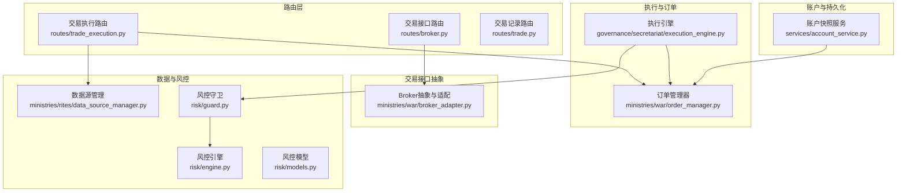
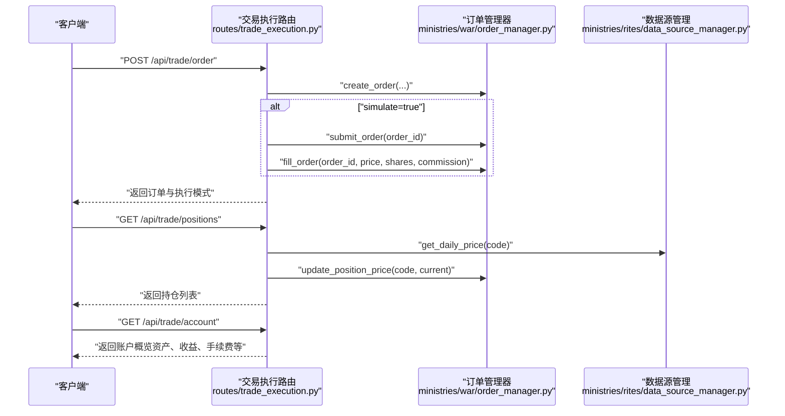
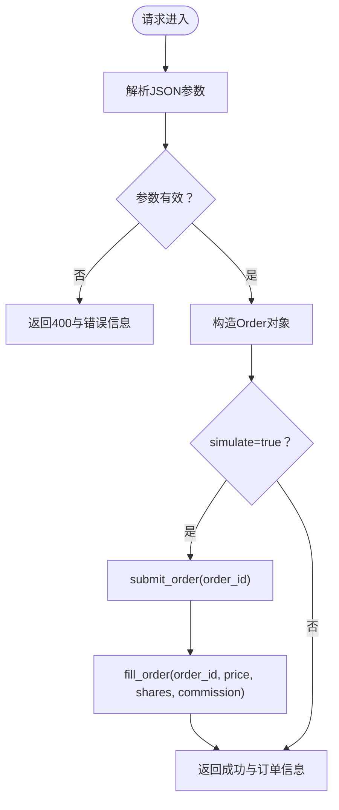
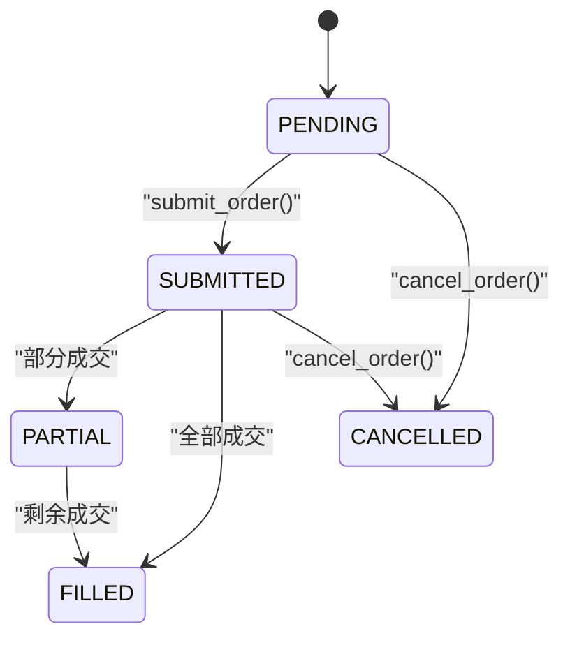
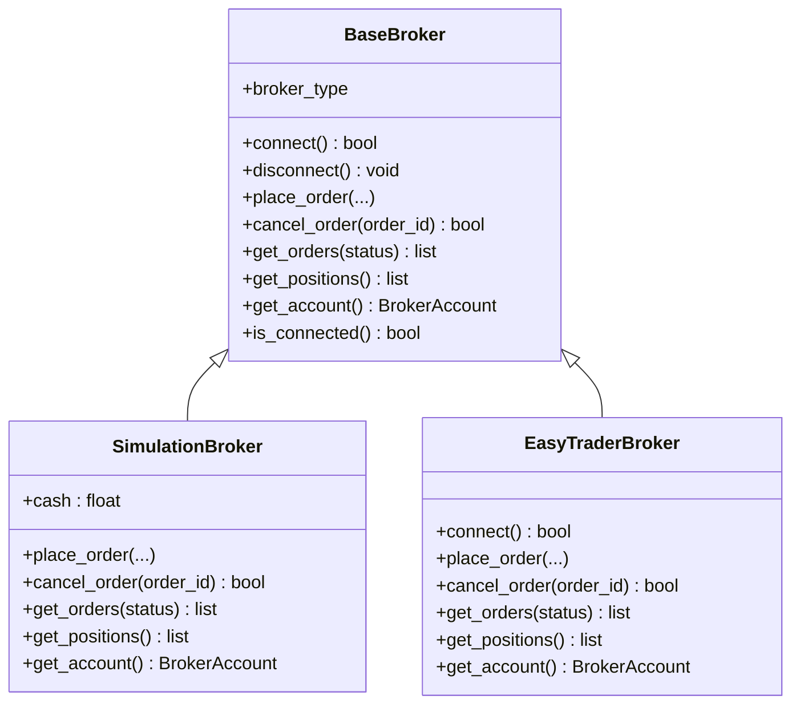
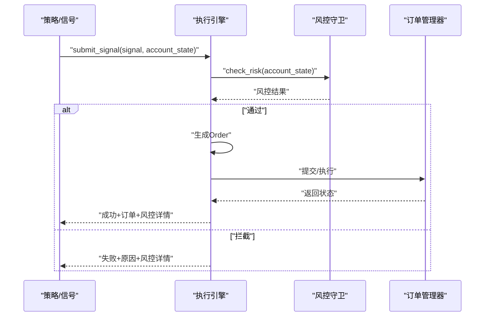
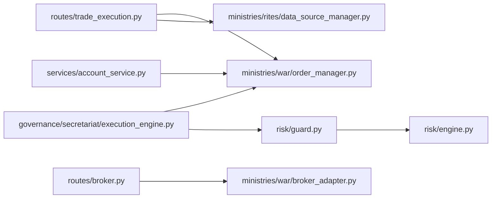

# 交易执行API

<cite>
**本文引用的文件**
- [routes/trade_execution.py](file://routes/trade_execution.py)
- [ministries/war/order_manager.py](file://ministries/war/order_manager.py)
- [ministries/war/broker_adapter.py](file://ministries/war/broker_adapter.py)
- [governance/secretariat/execution_engine.py](file://governance/secretariat/execution_engine.py)
- [routes/broker.py](file://routes/broker.py)
- [ministries/rites/data_source_manager.py](file://ministries/rites/data_source_manager.py)
- [risk/guard.py](file://risk/guard.py)
- [risk/engine.py](file://risk/engine.py)
- [risk/models.py](file://risk/models.py)
- [routes/trade.py](file://routes/trade.py)
- [services/account_service.py](file://services/account_service.py)
- [app.py](file://app.py)
- [config/settings.py](file://config/settings.py)
</cite>

## 目录
1. [简介](#简介)
2. [项目结构](#项目结构)
3. [核心组件](#核心组件)
4. [架构总览](#架构总览)
5. [详细组件分析](#详细组件分析)
6. [依赖关系分析](#依赖关系分析)
7. [性能考量](#性能考量)
8. [故障排查指南](#故障排查指南)
9. [结论](#结论)
10. [附录](#附录)

## 简介
本文件面向AIQuant的交易执行API，覆盖订单提交、订单查询、成交回报、撤单处理等交易相关接口，并对市价单、限价单、止损单等不同订单类型的API规范进行说明；同时补充批量下单、条件单、智能路由、滑点控制等高级功能的接口设计建议与实现路径；最后涵盖交易费用计算、资金管理、风险控制、交易监控等全流程交易API的使用指南。

## 项目结构
围绕交易执行API的关键模块包括：
- 路由层：提供REST接口，统一入口在蓝图中定义
- 订单管理层：负责订单生命周期与持仓管理
- 交易接口抽象层：支持模拟/实盘切换与扩展
- 执行引擎：接收信号、风控检查、生成订单并调度执行
- 数据源管理：提供行情与基础数据
- 风控模块：提供风控检查与状态记录
- 账户与交易记录：提供账户快照与交易记录接口

图表来源
- [routes/trade_execution.py:1-217](file://routes/trade_execution.py#L1-L217)
- [ministries/war/order_manager.py:1-211](file://ministries/war/order_manager.py#L1-L211)
- [ministries/war/broker_adapter.py:1-413](file://ministries/war/broker_adapter.py#L1-L413)
- [governance/secretariat/execution_engine.py:1-183](file://governance/secretariat/execution_engine.py#L1-L183)
- [routes/broker.py:1-223](file://routes/broker.py#L1-L223)
- [ministries/rites/data_source_manager.py:1-190](file://ministries/rites/data_source_manager.py#L1-L190)
- [risk/guard.py:1-92](file://risk/guard.py#L1-L92)
- [risk/engine.py:1-168](file://risk/engine.py#L1-L168)
- [risk/models.py:1-78](file://risk/models.py#L1-L78)
- [services/account_service.py:1-31](file://services/account_service.py#L1-L31)

章节来源
- [routes/trade_execution.py:1-217](file://routes/trade_execution.py#L1-L217)
- [routes/broker.py:1-223](file://routes/broker.py#L1-L223)
- [ministries/war/order_manager.py:1-211](file://ministries/war/order_manager.py#L1-L211)
- [ministries/war/broker_adapter.py:1-413](file://ministries/war/broker_adapter.py#L1-L413)
- [governance/secretariat/execution_engine.py:1-183](file://governance/secretariat/execution_engine.py#L1-L183)
- [ministries/rites/data_source_manager.py:1-190](file://ministries/rites/data_source_manager.py#L1-L190)
- [risk/guard.py:1-92](file://risk/guard.py#L1-L92)
- [risk/engine.py:1-168](file://risk/engine.py#L1-L168)
- [risk/models.py:1-78](file://risk/models.py#L1-L78)
- [services/account_service.py:1-31](file://services/account_service.py#L1-L31)

## 核心组件
- 交易执行路由：提供订单提交、订单查询、撤单、持仓查询、账户概览、模拟成交等接口
- 订单管理器：维护订单与持仓的内存状态，支持提交、成交、撤单、查询
- 交易接口抽象层：统一下单、撤单、查询接口，支持模拟/实盘/API三种模式
- 执行引擎：接收策略信号，进行风控检查，生成订单并调度执行
- 数据源管理：提供日线数据与股票列表等基础数据
- 风控模块：提供风控检查、状态记录与装饰器式集成
- 账户与交易记录：提供账户快照与交易记录的读写

章节来源
- [routes/trade_execution.py:23-178](file://routes/trade_execution.py#L23-L178)
- [ministries/war/order_manager.py:69-210](file://ministries/war/order_manager.py#L69-L210)
- [ministries/war/broker_adapter.py:84-412](file://ministries/war/broker_adapter.py#L84-L412)
- [governance/secretariat/execution_engine.py:57-182](file://governance/secretariat/execution_engine.py#L57-L182)
- [ministries/rites/data_source_manager.py:111-190](file://ministries/rites/data_source_manager.py#L111-L190)
- [risk/guard.py:15-91](file://risk/guard.py#L15-L91)
- [risk/engine.py:13-168](file://risk/engine.py#L13-L168)
- [services/account_service.py:10-31](file://services/account_service.py#L10-L31)

## 架构总览
交易执行API采用“路由层-执行层-接口抽象层-风控-数据源”的分层设计，既支持模拟交易快速验证，也预留实盘对接能力。

图表来源
- [routes/trade_execution.py:23-160](file://routes/trade_execution.py#L23-L160)
- [ministries/war/order_manager.py:76-154](file://ministries/war/order_manager.py#L76-L154)
- [ministries/rites/data_source_manager.py:153-177](file://ministries/rites/data_source_manager.py#L153-L177)

## 详细组件分析

### 交易执行路由（订单提交/查询/撤单/持仓/账户）
- 接口清单
  - POST /api/trade/order：提交订单（支持模拟/实盘）
  - GET /api/trade/orders：查询订单列表（可按状态过滤）
  - POST /api/trade/order/<id>/cancel：撤单
  - GET /api/trade/positions：查询持仓（自动更新当前价）
  - POST /api/trade/position/update：批量更新持仓价格
  - GET /api/trade/account：账户概览（资产、收益、手续费等）
  - POST /api/trade/simulate/fill：手动模拟成交（测试用）

- 参数与约束
  - 订单参数：code、name、direction（buy/sell）、price、shares、reason、simulate（默认true）
  - 撤单：仅允许PENDING/SUBMITTED状态撤单
  - 持仓更新：支持按{code: price}批量更新
  - 账户概览：基于持仓与已成交订单统计

- 成交回报与费用
  - 模拟成交时自动填充commission（示例：price × shares × 0.0003）
  - 实盘成交通过接口抽象层回调更新

- 关键流程图（订单提交）

图表来源
- [routes/trade_execution.py:23-58](file://routes/trade_execution.py#L23-L58)
- [ministries/war/order_manager.py:76-125](file://ministries/war/order_manager.py#L76-L125)

章节来源
- [routes/trade_execution.py:23-178](file://routes/trade_execution.py#L23-L178)
- [ministries/war/order_manager.py:76-154](file://ministries/war/order_manager.py#L76-L154)

### 订单管理器（内存状态机）
- 订单状态：PENDING → SUBMITTED → PARTIAL/FILLED 或 CANCELLED/REJECTED
- 持仓管理：BUY加仓/累成本；SELL减仓；清仓后状态置为closed
- 查询接口：按状态过滤、限制返回数量

图表来源
- [ministries/war/order_manager.py:16-23](file://ministries/war/order_manager.py#L16-L23)
- [ministries/war/order_manager.py:93-133](file://ministries/war/order_manager.py#L93-L133)

章节来源
- [ministries/war/order_manager.py:69-210](file://ministries/war/order_manager.py#L69-L210)

### 交易接口抽象层（Broker抽象）
- 抽象接口：连接、断开、下单、撤单、查询订单/持仓/账户、连接状态
- 模式支持：SIMULATION（默认）、EASYTRADER（预留）、API（预留）
- 模拟交易：立即成交、资金冻结/解冻、即时更新持仓
- 实盘适配：预留EasyTrader接入，便于扩展

图表来源
- [ministries/war/broker_adapter.py:84-412](file://ministries/war/broker_adapter.py#L84-L412)

章节来源
- [ministries/war/broker_adapter.py:134-250](file://ministries/war/broker_adapter.py#L134-L250)
- [ministries/war/broker_adapter.py:252-354](file://ministries/war/broker_adapter.py#L252-L354)

### 执行引擎（信号→风控→订单→执行）
- 输入：交易信号（code/name/price/shares/reason），账户状态
- 步骤：风控检查→生成订单→执行（模拟/实盘）
- 输出：执行结果（含风控检查详情）

图表来源
- [governance/secretariat/execution_engine.py:64-101](file://governance/secretariat/execution_engine.py#L64-L101)
- [risk/guard.py:77-91](file://risk/guard.py#L77-L91)

章节来源
- [governance/secretariat/execution_engine.py:57-182](file://governance/secretariat/execution_engine.py#L57-L182)
- [risk/guard.py:36-91](file://risk/guard.py#L36-L91)

### 数据源管理（行情与基础数据）
- 支持多数据源：LOCAL（默认）、AKSHARE、TUSHARE、BAOSTOCK、YFINANCE
- 主备切换：优先主数据源，失败自动切换备用
- 接口：健康检查、日线数据、股票列表

章节来源
- [ministries/rites/data_source_manager.py:111-190](file://ministries/rites/data_source_manager.py#L111-L190)

### 风控模块（检查与记录）
- 风控守卫：装饰器与直接调用两种方式
- 引擎：聚合规则，取最严格等级，记录到数据库
- 模型：风险等级、分类、检查结果与状态快照

章节来源
- [risk/guard.py:15-91](file://risk/guard.py#L15-L91)
- [risk/engine.py:19-168](file://risk/engine.py#L19-L168)
- [risk/models.py:11-78](file://risk/models.py#L11-L78)

### 账户与交易记录
- 账户快照服务：读取/保存账户快照（资产、现金、持仓价值、总成本、总盈亏、收益率等）
- 交易记录：查询与新增交易记录

章节来源
- [services/account_service.py:10-31](file://services/account_service.py#L10-L31)
- [routes/trade.py:12-43](file://routes/trade.py#L12-L43)

## 依赖关系分析
- 路由层依赖订单管理器与数据源管理器
- 执行引擎依赖风控模块与订单管理器
- 交易接口路由依赖Broker抽象层
- 风控模块依赖规则与配置加载

图表来源
- [routes/trade_execution.py:14-20](file://routes/trade_execution.py#L14-L20)
- [governance/secretariat/execution_engine.py:18-19](file://governance/secretariat/execution_engine.py#L18-L19)
- [routes/broker.py:18-20](file://routes/broker.py#L18-L20)
- [risk/guard.py:11-12](file://risk/guard.py#L11-L12)

章节来源
- [routes/trade_execution.py:14-20](file://routes/trade_execution.py#L14-L20)
- [governance/secretariat/execution_engine.py:18-19](file://governance/secretariat/execution_engine.py#L18-L19)
- [routes/broker.py:18-20](file://routes/broker.py#L18-L20)
- [risk/guard.py:11-12](file://risk/guard.py#L11-L12)

## 性能考量
- 内存状态：订单与持仓存储于内存，适合中小规模并发；如需高并发，建议引入持久化与缓存
- 模拟交易：无需网络I/O，延迟低；实盘交易受券商API与网络影响
- 数据源切换：主备切换逻辑简单，建议结合健康检查与熔断策略
- 风控检查：规则聚合与数据库写入可能成为瓶颈，建议异步落库与限流

## 故障排查指南
- 订单提交失败
  - 检查参数：code、direction、price、shares是否合法
  - 检查模拟/实盘模式与资金是否充足（模拟/实盘逻辑不同）
- 撤单失败
  - 订单状态必须为PENDING或SUBMITTED
- 持仓更新无效
  - 确认code正确且存在holding状态的持仓
- 风控拦截
  - 查看风控详情与阻断原因，调整账户状态或策略参数
- 实盘接口未初始化
  - 确认已连接交易终端，或切换到simulation模式进行调试

章节来源
- [routes/trade_execution.py:35-42](file://routes/trade_execution.py#L35-L42)
- [ministries/war/order_manager.py:127-133](file://ministries/war/order_manager.py#L127-L133)
- [routes/broker.py:112-118](file://routes/broker.py#L112-L118)
- [risk/guard.py:77-91](file://risk/guard.py#L77-L91)

## 结论
AIQuant的交易执行API以清晰的分层设计实现了从信号到执行的闭环：路由层提供统一接口，订单管理器与交易接口抽象层分别承担状态管理与通道适配，风控模块贯穿始终，数据源与账户服务提供支撑。当前版本重点覆盖了模拟交易与基础风控，实盘通道通过抽象层预留扩展点，便于后续接入真实券商API。

## 附录

### API规范与参数说明

- 订单提交（POST /api/trade/order）
  - 请求体字段
    - code：标的代码（必填）
    - name：标的名称（可选，默认取code）
    - direction：方向（buy/sell，必填）
    - price：价格（>0，必填）
    - shares：数量（>0，必填）
    - reason：备注（可选）
    - simulate：是否模拟（默认true）
  - 返回字段
    - success：布尔
    - order：订单对象（包含order_id、code、name、direction、price、shares、status、filled_price、filled_shares、commission、reason、created_at、filled_at等）
    - mode：simulate/live
  - 状态流转
    - simulate=true：自动submit→fill→FILLED
    - simulate=false：仅创建PENDING，等待外部执行

- 订单查询（GET /api/trade/orders）
  - 查询参数
    - status：过滤状态（可选）
    - limit：返回数量上限（默认100）
  - 返回字段
    - success：布尔
    - count：数量
    - orders：订单数组

- 撤单（POST /api/trade/order/<id>/cancel）
  - 返回字段
    - success：布尔
    - message：提示信息

- 持仓查询（GET /api/trade/positions）
  - 返回字段
    - success：布尔
    - count：数量
    - positions：持仓数组（包含entry_price、shares、current_price、market_value、unrealized_pnl、unrealized_pnl_pct、status、entry_date、stop_loss、take_profit等）

- 批量更新持仓价格（POST /api/trade/position/update）
  - 请求体字段
    - prices：{code: price}
  - 返回字段
    - success：布尔
    - updated：更新成功的code列表

- 账户概览（GET /api/trade/account）
  - 返回字段
    - success：布尔
    - account：包含initial_capital、cash、market_value、total_assets、total_return、unrealized_pnl、total_commission、position_count、order_count

- 手动模拟成交（POST /api/trade/simulate/fill）
  - 请求体字段
    - order_id：订单ID（必填）
    - filled_price：成交价（>0，必填）
    - filled_shares：成交量（>0，必填）
  - 返回字段
    - success：布尔
    - message：提示信息

- 交易接口管理（routes/broker.py）
  - 获取状态：GET /api/broker/status
  - 连接/断开：POST /api/broker/connect、POST /api/broker/disconnect
  - 切换模式：POST /api/broker/switch（mode=simulation/easytrader/api）
  - 下单：POST /api/broker/order（side、order_type、price、shares）
  - 撤单：POST /api/broker/order/<id>/cancel
  - 查询：GET /api/broker/orders、GET /api/broker/positions、GET /api/broker/account

章节来源
- [routes/trade_execution.py:23-178](file://routes/trade_execution.py#L23-L178)
- [routes/broker.py:26-189](file://routes/broker.py#L26-L189)

### 不同订单类型与参数约束
- 限价单（LIMIT）
  - order_type=limit（broker接口）
  - price必须为有效数值
- 市价单（MARKET）
  - order_type=market（broker接口）
  - 市价单通常用于快速成交，注意滑点与流动性风险
- 止损单/止盈单
  - 当前路由未直接暴露止损/止盈参数；可通过策略侧在订单成交后设置Position的stop_loss/take_profit字段，或在执行引擎中扩展订单结构以携带止损止盈参数
- 时间有效性
  - 当前路由未提供有效期参数；可在订单结构中扩展valid_until字段，或在执行引擎中加入定时检查与自动撤单逻辑

章节来源
- [ministries/war/broker_adapter.py:35-39](file://ministries/war/broker_adapter.py#L35-L39)
- [ministries/war/order_manager.py:51-67](file://ministries/war/order_manager.py#L51-L67)

### 高级功能与扩展建议
- 批量下单
  - 在路由层增加批量提交接口，循环调用单笔下单并聚合结果
- 条件单
  - 在订单结构中增加条件字段（如价格条件、时间条件），在执行引擎中加入条件检查与触发机制
- 智能路由
  - 在broker适配层增加多通道选择策略（如按流动性、滑点、费用排序），动态选择最优通道
- 滑点控制
  - 在模拟/实盘成交时引入滑点模型（固定点数或百分比），并在风控中纳入最大滑点阈值检查

[本节为概念性内容，不直接分析具体文件]

### 交易费用与资金管理
- 模拟交易费用
  - 示例：commission = price × shares × 0.0003
- 实盘费用
  - 通过broker接口返回的成交回报更新commission
- 资金管理
  - 账户概览汇总总资金、可用资金、持仓市值、未实现盈亏、总手续费等指标
  - 建议在风控中加入最大回撤、可用资金比例等约束

章节来源
- [routes/trade_execution.py:51](file://routes/trade_execution.py#L51)
- [routes/trade_execution.py:134-145](file://routes/trade_execution.py#L134-L145)

### 风险控制与交易监控
- 风控检查
  - 通过装饰器或直接调用check_risk(account_state)，返回整体等级与明细
- 交易监控
  - 使用WebSocket行情监控（已在应用启动时注册），结合交易执行API进行联动
- 数据库记录
  - 风控事件与状态写入数据库，便于回溯与报表

章节来源
- [risk/guard.py:36-91](file://risk/guard.py#L36-L91)
- [risk/engine.py:51-127](file://risk/engine.py#L51-L127)
- [app.py:154-161](file://app.py#L154-L161)