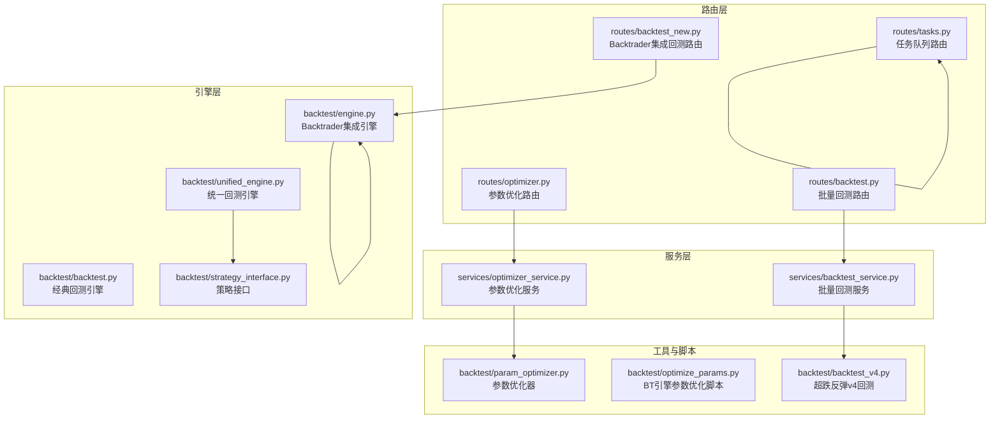
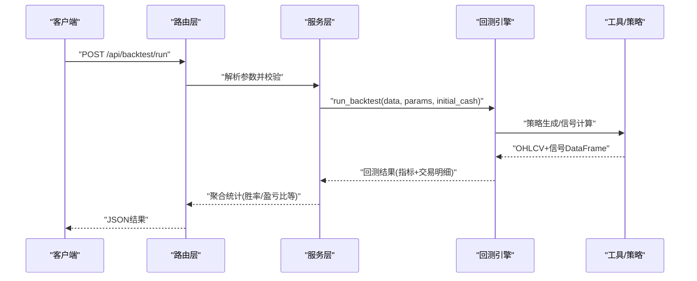
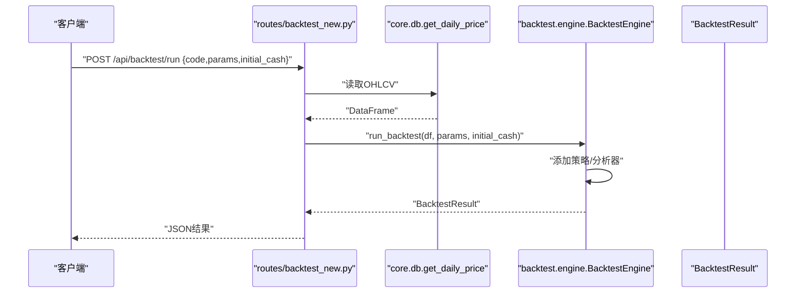
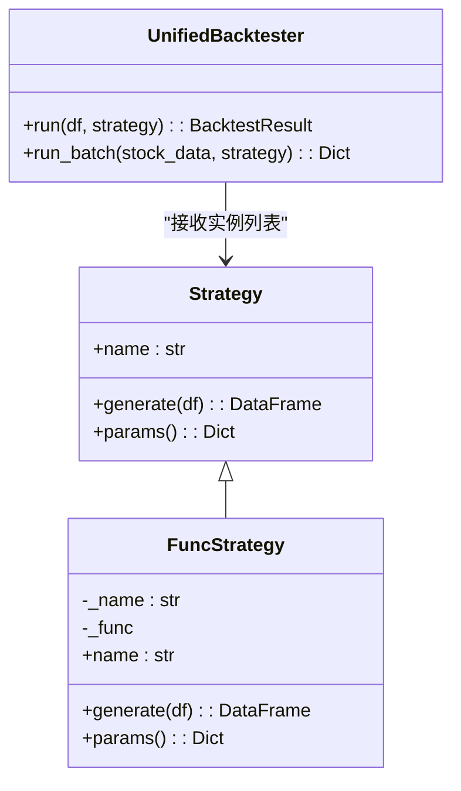
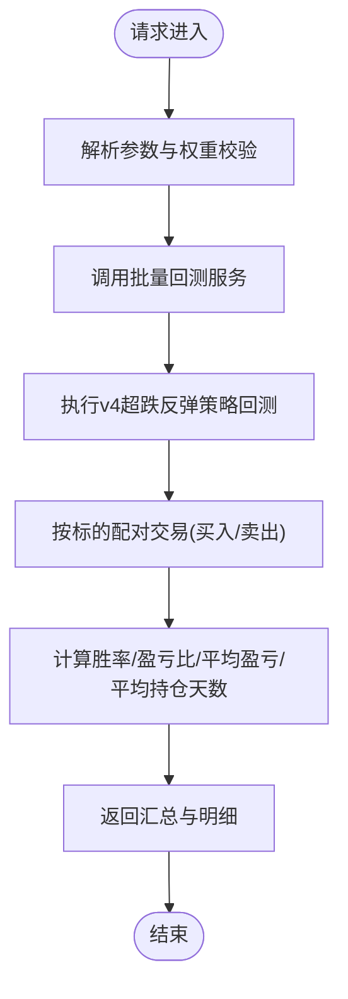
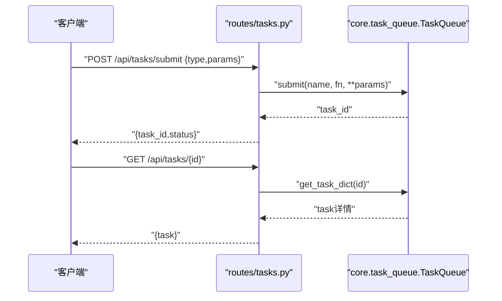
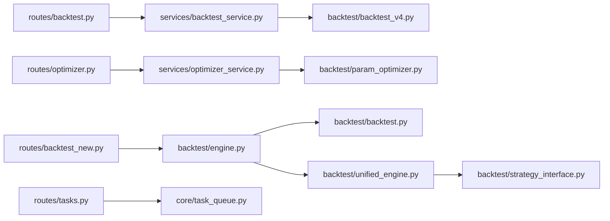

# 回测管理API

<cite>
**本文引用的文件**
- [routes/backtest.py](file://routes/backtest.py)
- [routes/backtest_new.py](file://routes/backtest_new.py)
- [routes/optimizer.py](file://routes/optimizer.py)
- [routes/tasks.py](file://routes/tasks.py)
- [services/backtest_service.py](file://services/backtest_service.py)
- [services/optimizer_service.py](file://services/optimizer_service.py)
- [backtest/backtest.py](file://backtest/backtest.py)
- [backtest/engine.py](file://backtest/engine.py)
- [backtest/unified_engine.py](file://backtest/unified_engine.py)
- [backtest/param_optimizer.py](file://backtest/param_optimizer.py)
- [backtest/optimize_params.py](file://backtest/optimize_params.py)
- [backtest/backtest_v4.py](file://backtest/backtest_v4.py)
- [backtest/strategy_interface.py](file://backtest/strategy_interface.py)
- [core/task_queue.py](file://core/task_queue.py)
- [scheduler/state.py](file://scheduler/state.py)
- [app.py](file://app.py)
</cite>

## 目录
1. [简介](#简介)
2. [项目结构](#项目结构)
3. [核心组件](#核心组件)
4. [架构总览](#架构总览)
5. [详细组件分析](#详细组件分析)
6. [依赖分析](#依赖分析)
7. [性能考虑](#性能考虑)
8. [故障排查指南](#故障排查指南)
9. [结论](#结论)
10. [附录](#附录)

## 简介
本文件系统化梳理 AIQuant 的回测管理API，覆盖单策略回测、多策略对比、参数优化、结果查询、任务提交与进度查询、结果统计与可视化等能力。文档面向开发者与策略工程师，既提供接口规范，也给出架构设计、数据流、性能与资源管理建议。

## 项目结构
围绕回测的路由、服务、引擎与工具模块分布如下：
- 路由层：提供 HTTP 接口，封装业务调用
- 服务层：组织参数校验、数据准备与调用引擎
- 引擎层：封装回测与优化逻辑，支持多种策略与Backtrader集成
- 工具与策略：参数优化、策略接口、统一引擎等



图表来源
- [routes/backtest.py:1-45](file://routes/backtest.py#L1-L45)
- [routes/backtest_new.py:1-100](file://routes/backtest_new.py#L1-L100)
- [routes/optimizer.py:1-48](file://routes/optimizer.py#L1-L48)
- [routes/tasks.py:1-178](file://routes/tasks.py#L1-L178)
- [services/backtest_service.py:1-135](file://services/backtest_service.py#L1-L135)
- [services/optimizer_service.py:1-92](file://services/optimizer_service.py#L1-L92)
- [backtest/backtest.py:1-517](file://backtest/backtest.py#L1-L517)
- [backtest/engine.py:1-174](file://backtest/engine.py#L1-L174)
- [backtest/unified_engine.py:1-143](file://backtest/unified_engine.py#L1-L143)
- [backtest/param_optimizer.py:1-369](file://backtest/param_optimizer.py#L1-L369)
- [backtest/optimize_params.py:1-462](file://backtest/optimize_params.py#L1-L462)
- [backtest/backtest_v4.py:1-624](file://backtest/backtest_v4.py#L1-L624)
- [backtest/strategy_interface.py:1-86](file://backtest/strategy_interface.py#L1-L86)

章节来源
- [routes/backtest.py:1-45](file://routes/backtest.py#L1-L45)
- [routes/backtest_new.py:1-100](file://routes/backtest_new.py#L1-L100)
- [routes/optimizer.py:1-48](file://routes/optimizer.py#L1-L48)
- [routes/tasks.py:1-178](file://routes/tasks.py#L1-L178)
- [services/backtest_service.py:1-135](file://services/backtest_service.py#L1-L135)
- [services/optimizer_service.py:1-92](file://services/optimizer_service.py#L1-L92)
- [backtest/backtest.py:1-517](file://backtest/backtest.py#L1-L517)
- [backtest/engine.py:1-174](file://backtest/engine.py#L1-L174)
- [backtest/unified_engine.py:1-143](file://backtest/unified_engine.py#L1-L143)
- [backtest/param_optimizer.py:1-369](file://backtest/param_optimizer.py#L1-L369)
- [backtest/optimize_params.py:1-462](file://backtest/optimize_params.py#L1-L462)
- [backtest/backtest_v4.py:1-624](file://backtest/backtest_v4.py#L1-L624)
- [backtest/strategy_interface.py:1-86](file://backtest/strategy_interface.py#L1-L86)

## 核心组件
- 路由层：提供批量回测、单策略回测、参数优化、任务队列等HTTP接口
- 服务层：负责参数校验、数据准备、调用引擎并聚合结果
- 引擎层：封装回测与优化逻辑，支持经典引擎、Backtrader集成与统一引擎
- 工具与策略：参数优化器、策略接口、v4超跌反弹回测脚本

章节来源
- [routes/backtest.py:12-45](file://routes/backtest.py#L12-L45)
- [routes/backtest_new.py:17-100](file://routes/backtest_new.py#L17-L100)
- [routes/optimizer.py:11-48](file://routes/optimizer.py#L11-L48)
- [routes/tasks.py:93-178](file://routes/tasks.py#L93-L178)
- [services/backtest_service.py:10-135](file://services/backtest_service.py#L10-L135)
- [services/optimizer_service.py:9-92](file://services/optimizer_service.py#L9-L92)
- [backtest/backtest.py:56-494](file://backtest/backtest.py#L56-L494)
- [backtest/engine.py:72-174](file://backtest/engine.py#L72-L174)
- [backtest/unified_engine.py:59-143](file://backtest/unified_engine.py#L59-L143)
- [backtest/param_optimizer.py:19-369](file://backtest/param_optimizer.py#L19-L369)
- [backtest/optimize_params.py:94-462](file://backtest/optimize_params.py#L94-L462)
- [backtest/backtest_v4.py:218-624](file://backtest/backtest_v4.py#L218-L624)
- [backtest/strategy_interface.py:23-86](file://backtest/strategy_interface.py#L23-L86)

## 架构总览
回测API采用“路由-服务-引擎-工具”的分层架构，支持：
- 单策略回测：经典引擎与Backtrader集成引擎
- 多策略对比：统一引擎与策略接口
- 参数优化：网格搜索、遗传算法、步行优化
- 任务管理：异步任务提交、状态查询、统计与清理
- 结果聚合：批量回测服务对交易对账与统计



图表来源
- [routes/backtest_new.py:17-61](file://routes/backtest_new.py#L17-L61)
- [services/backtest_service.py:10-74](file://services/backtest_service.py#L10-L74)
- [backtest/engine.py:79-140](file://backtest/engine.py#L79-L140)
- [backtest/backtest.py:121-410](file://backtest/backtest.py#L121-L410)

## 详细组件分析

### 单策略回测API
- 路由：POST /api/backtest/run
- 请求体字段
  - code：标的代码
  - start_date / end_date：回测区间
  - params：策略参数字典
  - initial_cash：初始资金
- 返回字段
  - 成功：success=true，result包含策略名、起止日期、初始/最终资金、总收益、年化收益、夏普比率、最大回撤、最大回撤持续、总交易数、胜率等
  - 失败：success=false，error描述



图表来源
- [routes/backtest_new.py:17-61](file://routes/backtest_new.py#L17-L61)
- [backtest/engine.py:79-140](file://backtest/engine.py#L79-L140)

章节来源
- [routes/backtest_new.py:17-61](file://routes/backtest_new.py#L17-L61)
- [backtest/engine.py:72-140](file://backtest/engine.py#L72-L140)

### 多策略对比API
- 统一引擎：接收 Strategy 实例列表，支持多策略同时运行与资金曲线统一管理
- 策略接口：Strategy 抽象定义 name 与 generate 方法；FuncStrategy 适配函数式策略
- 关键参数：初始资金、手续费、滑点、止损止盈、最大持仓天数、回撤熔断、大盘择时、动态仓位等



图表来源
- [backtest/strategy_interface.py:23-86](file://backtest/strategy_interface.py#L23-L86)
- [backtest/unified_engine.py:59-143](file://backtest/unified_engine.py#L59-L143)

章节来源
- [backtest/strategy_interface.py:23-86](file://backtest/strategy_interface.py#L23-L86)
- [backtest/unified_engine.py:59-143](file://backtest/unified_engine.py#L59-L143)

### 参数优化API
- 路由：GET /optimizer/run、GET /optimizer/walkforward
- 支持方法：网格搜索(grid)、遗传算法(genetic)、步行优化(walkforward)
- 返回字段：最佳参数、最佳评分、Top结果、折返结果与平均指标

```mermaid
sequenceDiagram
participant Client as "客户端"
participant Route as "routes/optimizer.py"
participant Service as "services/optimizer_service.py"
participant Opt as "backtest/param_optimizer.py"
Client->>Route : "GET /optimizer/run?symbol&strategy&method&metric"
Route->>Service : "run_optimizer(...)"
Service->>Opt : "ParameterOptimizer/Grid/Genetic/WFO"
Opt-->>Service : "优化结果"
Service-->>Route : "最佳参数/评分"
Route-->>Client : "JSON结果"
```

图表来源
- [routes/optimizer.py:11-48](file://routes/optimizer.py#L11-L48)
- [services/optimizer_service.py:9-92](file://services/optimizer_service.py#L9-L92)
- [backtest/param_optimizer.py:19-369](file://backtest/param_optimizer.py#L19-L369)

章节来源
- [routes/optimizer.py:11-48](file://routes/optimizer.py#L11-L48)
- [services/optimizer_service.py:9-92](file://services/optimizer_service.py#L9-L92)
- [backtest/param_optimizer.py:19-369](file://backtest/param_optimizer.py#L19-L369)

### 批量回测API
- 路由：GET /backtest/batch
- 参数：start_date、end_date、min_score、capital、max_positions、max_position_size、stop_loss、take_profit、use_market_timing、use_dynamic_position、weights(5个权重)、use_v4
- 返回：起止日期、初始/最终资金、总收益、年化收益、最大回撤、胜率、盈亏比、总交易数、胜/负交易数、平均盈/亏百分比、平均持仓天数、总手续费、交易对账后的配对明细等



图表来源
- [routes/backtest.py:12-45](file://routes/backtest.py#L12-L45)
- [services/backtest_service.py:10-135](file://services/backtest_service.py#L10-L135)
- [backtest/backtest_v4.py:218-582](file://backtest/backtest_v4.py#L218-L582)

章节来源
- [routes/backtest.py:12-45](file://routes/backtest.py#L12-L45)
- [services/backtest_service.py:10-135](file://services/backtest_service.py#L10-L135)
- [backtest/backtest_v4.py:218-582](file://backtest/backtest_v4.py#L218-L582)

### 任务队列API
- 提交任务：POST /api/tasks/submit，type/backtest/batch_score，params
- 查询任务：GET /api/tasks/{id}
- 任务列表：GET /api/tasks，支持status与limit
- 取消任务：POST /api/tasks/{id}/cancel
- 清理完成任务：POST /api/tasks/clear
- 队列统计：GET /api/tasks/stats
- 支持任务类型：demo、backtest、batch_score



图表来源
- [routes/tasks.py:93-178](file://routes/tasks.py#L93-L178)
- [core/task_queue.py:51-120](file://core/task_queue.py#L51-L120)

章节来源
- [routes/tasks.py:93-178](file://routes/tasks.py#L93-L178)
- [core/task_queue.py:51-120](file://core/task_queue.py#L51-L120)

### 回测配置参数与交易成本
- 经典回测引擎参数
  - 初始资金、手续费率(双向)、印花税率(卖出)、每笔建仓资金比例、最大持仓天数
  - 止损/止盈开关、滑点率、回撤熔断阈值与连续亏损限制、大盘择时(MA周期与字段)、动态仓位(基于ATR波动率)
- 交易成本
  - 计算公式：买入/卖出按成交金额×费率，最低收费限制；卖出加收印花税
- 风险指标
  - 总收益、年化收益、最大回撤、夏普比率、胜率、盈亏比、平均持仓天数、基准收益与Alpha

章节来源
- [backtest/backtest.py:66-119](file://backtest/backtest.py#L66-L119)
- [backtest/backtest.py:411-471](file://backtest/backtest.py#L411-L471)

### 历史数据选择与信号生成
- 数据来源：core.db.get_daily_price 或策略模块提供的信号生成函数
- 信号生成：策略接口 generate 返回含 BUY_SIGNAL/SELL_SIGNAL/SCORE 的DataFrame
- T+1 执行：信号日触发，次日开盘价执行，避免未来数据泄露

章节来源
- [routes/backtest_new.py:30-40](file://routes/backtest_new.py#L30-L40)
- [backtest/strategy_interface.py:38-53](file://backtest/strategy_interface.py#L38-L53)
- [backtest/backtest.py:121-131](file://backtest/backtest.py#L121-L131)

### 结果查询与可视化
- 单策略回测：返回指标与交易明细，便于前端展示
- 批量回测：返回配对后的交易明细与统计摘要
- 可视化建议：前端可基于返回的等时序净值曲线与交易明细绘制K线叠加买卖点、收益曲线与回撤图

章节来源
- [routes/backtest_new.py:42-60](file://routes/backtest_new.py#L42-L60)
- [services/backtest_service.py:52-74](file://services/backtest_service.py#L52-L74)

### 高级API：参数扫描与步行优化
- 参数扫描：optimize_params.py 提供BT引擎参数网格搜索，支持约束条件与结果筛选
- 步行优化：walkforward 将时间序列滚动切分为训练/测试集，在训练集上优化参数并在测试集上验证

章节来源
- [backtest/optimize_params.py:120-177](file://backtest/optimize_params.py#L120-L177)
- [backtest/param_optimizer.py:213-297](file://backtest/param_optimizer.py#L213-L297)

## 依赖分析
- 路由依赖服务：backtest.py 依赖 services.backtest_service，optimizer.py 依赖 services.optimizer_service
- 服务依赖引擎：backtest_service 调用 backtest_v4 回测脚本；optimizer_service 调用 param_optimizer
- 引擎依赖策略：Backtrader引擎依赖策略适配器；统一引擎依赖 Strategy 接口
- 任务队列：routes/tasks.py 依赖 core.task_queue



图表来源
- [routes/backtest.py:9](file://routes/backtest.py#L9)
- [routes/backtest_new.py:12](file://routes/backtest_new.py#L12)
- [routes/optimizer.py:8](file://routes/optimizer.py#L8)
- [routes/tasks.py:15](file://routes/tasks.py#L15)
- [services/backtest_service.py:20](file://services/backtest_service.py#L20)
- [services/optimizer_service.py:34](file://services/optimizer_service.py#L34)
- [backtest/engine.py:72](file://backtest/engine.py#L72)
- [backtest/unified_engine.py:59](file://backtest/unified_engine.py#L59)
- [backtest/strategy_interface.py:16](file://backtest/strategy_interface.py#L16)

章节来源
- [routes/backtest.py:9](file://routes/backtest.py#L9)
- [routes/backtest_new.py:12](file://routes/backtest_new.py#L12)
- [routes/optimizer.py:8](file://routes/optimizer.py#L8)
- [routes/tasks.py:15](file://routes/tasks.py#L15)
- [services/backtest_service.py:20](file://services/backtest_service.py#L20)
- [services/optimizer_service.py:34](file://services/optimizer_service.py#L34)
- [backtest/engine.py:72](file://backtest/engine.py#L72)
- [backtest/unified_engine.py:59](file://backtest/unified_engine.py#L59)
- [backtest/strategy_interface.py:16](file://backtest/strategy_interface.py#L16)

## 性能考虑
- 并行与批处理
  - 批量回测：backtest_v4 支持多标的并行扫描与信号生成，注意数据库与网络I/O瓶颈
  - 任务队列：core.task_queue 使用线程池执行器，合理设置 max_workers
- 数据预取与缓存
  - 预加载OHLCV与指数MA，减少重复查询
  - 基本面过滤结果缓存至本地缓存表，降低外部接口压力
- 交易成本与滑点
  - 合理设置手续费与滑点，避免过度拟合
- 指标计算
  - 使用向量化计算与滚动窗口，避免Python循环
- 内存与资源
  - 控制最大持仓数量与单股上限，防止资金过度集中
  - 回撤熔断与连续亏损限制，降低系统性风险

[本节为通用指导，不直接分析具体文件]

## 故障排查指南
- 参数校验错误
  - 批量回测 weights 数量或格式错误会返回400
- 数据缺失
  - 单策略回测若无数据返回404
- 引擎异常
  - 统一捕获异常并返回错误信息
- 任务队列
  - 查询不存在任务返回404；取消失败可能因任务已开始或不存在

章节来源
- [routes/backtest.py:14-44](file://routes/backtest.py#L14-L44)
- [routes/backtest_new.py:35-60](file://routes/backtest_new.py#L35-L60)
- [routes/tasks.py:118-145](file://routes/tasks.py#L118-L145)

## 结论
AIQuant 的回测管理API以清晰的分层架构支撑从单策略到多策略、从参数优化到批量回测的完整工作流。通过统一的策略接口与Backtrader集成，既能满足快速验证，也能进行深度优化与风险控制。配合任务队列与状态监控，可实现稳定高效的回测平台。

[本节为总结性内容，不直接分析具体文件]

## 附录

### API一览与示例路径
- 单策略回测
  - 路由：POST /api/backtest/run
  - 示例路径：[routes/backtest_new.py:17-61](file://routes/backtest_new.py#L17-L61)
- 多策略对比
  - 统一引擎：backtest/unified_engine.py
  - 策略接口：backtest/strategy_interface.py
  - 示例路径：[backtest/unified_engine.py:108-143](file://backtest/unified_engine.py#L108-L143)，[backtest/strategy_interface.py:38-53](file://backtest/strategy_interface.py#L38-L53)
- 参数优化
  - 路由：GET /optimizer/run、GET /optimizer/walkforward
  - 示例路径：[routes/optimizer.py:11-48](file://routes/optimizer.py#L11-L48)，[services/optimizer_service.py:9-92](file://services/optimizer_service.py#L9-L92)
- 批量回测
  - 路由：GET /backtest/batch
  - 示例路径：[routes/backtest.py:12-45](file://routes/backtest.py#L12-L45)，[services/backtest_service.py:10-135](file://services/backtest_service.py#L10-L135)
- 任务队列
  - 路由：POST /api/tasks/submit、GET /api/tasks/{id}、GET /api/tasks、POST /api/tasks/{id}/cancel、POST /api/tasks/clear、GET /api/tasks/stats
  - 示例路径：[routes/tasks.py:93-178](file://routes/tasks.py#L93-L178)，[core/task_queue.py:51-120](file://core/task_queue.py#L51-L120)

### 回测引擎状态监控
- 进程内调度状态：scheduler/state.py 提供流水线运行状态与各Agent状态更新
- 任务队列统计：routes/tasks.py 提供队列统计接口

章节来源
- [scheduler/state.py:24-45](file://scheduler/state.py#L24-L45)
- [routes/tasks.py:158-164](file://routes/tasks.py#L158-L164)