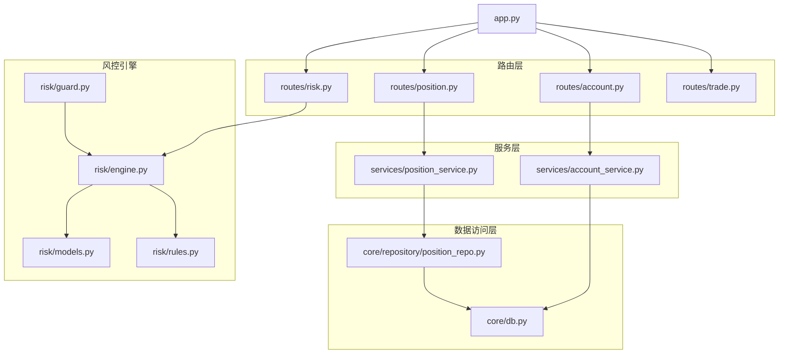
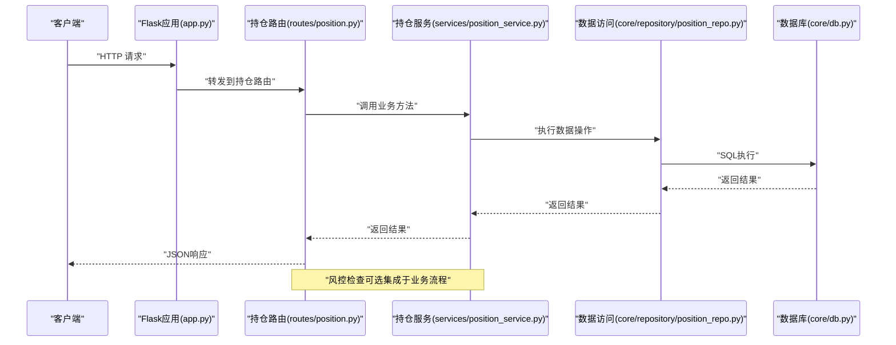
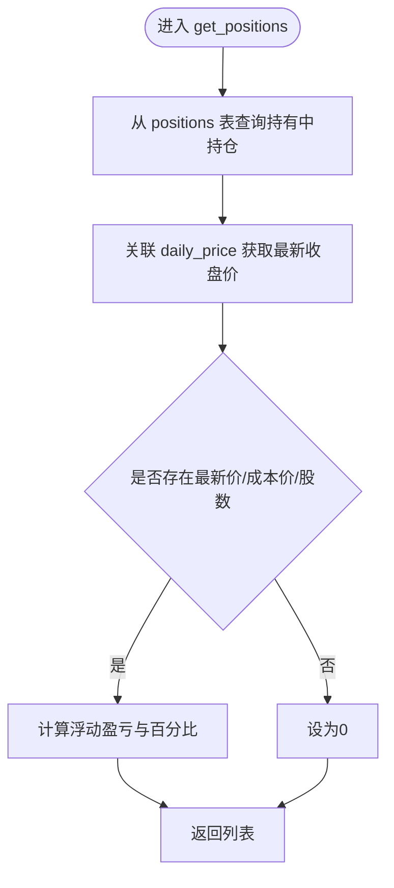
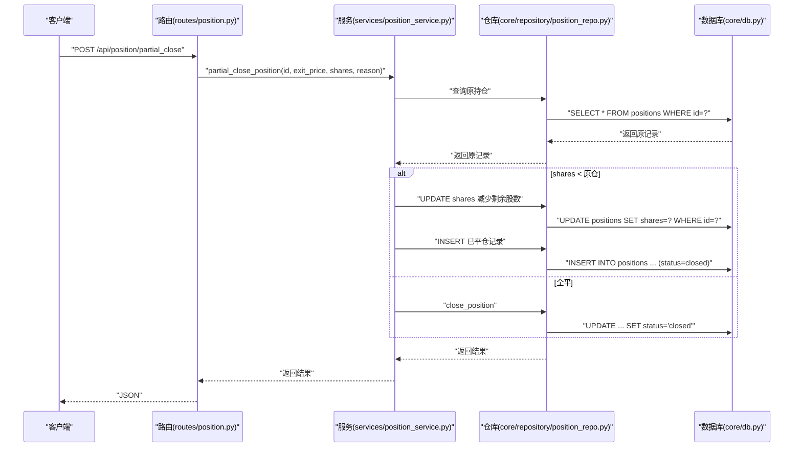
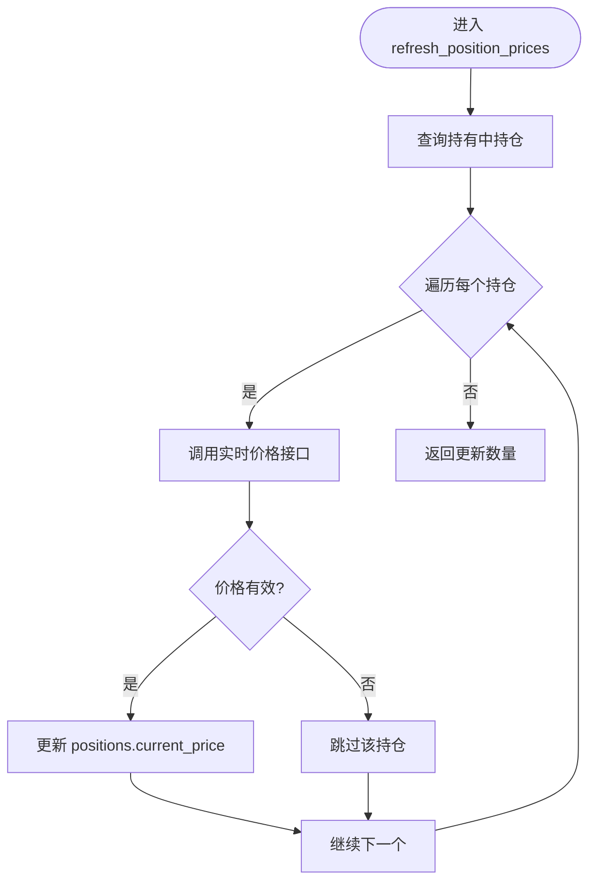
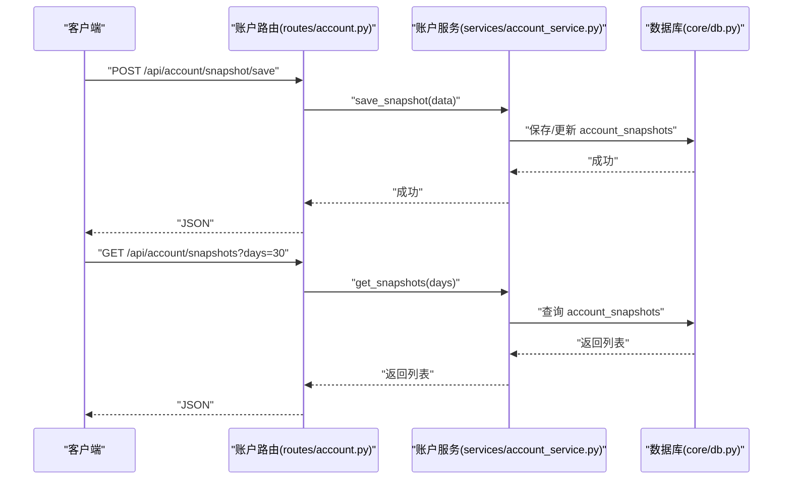
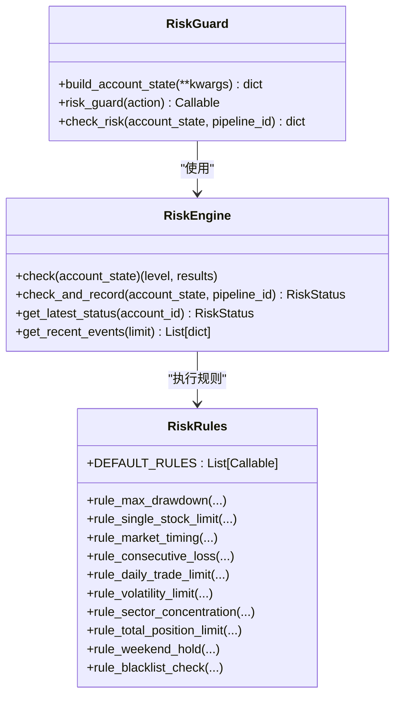
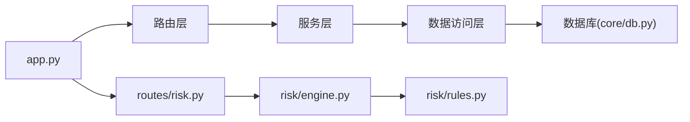

# 持仓管理API

<cite>
**本文档引用的文件**
- [routes/position.py](file://routes/position.py)
- [services/position_service.py](file://services/position_service.py)
- [core/repository/position_repo.py](file://core/repository/position_repo.py)
- [core/db.py](file://core/db.py)
- [risk/engine.py](file://risk/engine.py)
- [risk/guard.py](file://risk/guard.py)
- [risk/models.py](file://risk/models.py)
- [risk/rules.py](file://risk/rules.py)
- [routes/risk.py](file://routes/risk.py)
- [routes/account.py](file://routes/account.py)
- [services/account_service.py](file://services/account_service.py)
- [routes/trade.py](file://routes/trade.py)
- [app.py](file://app.py)
</cite>

## 目录
1. [简介](#简介)
2. [项目结构](#项目结构)
3. [核心组件](#核心组件)
4. [架构总览](#架构总览)
5. [详细组件分析](#详细组件分析)
6. [依赖关系分析](#依赖关系分析)
7. [性能考虑](#性能考虑)
8. [故障排查指南](#故障排查指南)
9. [结论](#结论)
10. [附录](#附录)

## 简介
本文件面向AIQuant系统的持仓管理API，覆盖持仓查询、持仓调整、持仓统计、风控检查等能力。重点说明以下功能：
- 实时持仓查询与汇总
- 持仓增减与平仓（全平/部分平仓）
- 持仓价格刷新与估值计算
- 账户快照与历史回撤
- 风控规则检查与状态查询
- 交易记录管理
- 支持多账户、跨市场、资产配置等复杂场景的扩展点

## 项目结构
围绕持仓管理的关键文件组织如下：
- 路由层：routes/position.py、routes/risk.py、routes/account.py、routes/trade.py
- 服务层：services/position_service.py、services/account_service.py
- 数据访问层：core/repository/position_repo.py、core/db.py
- 风控引擎：risk/engine.py、risk/guard.py、risk/models.py、risk/rules.py
- 应用入口：app.py

**图表来源**
- [app.py:1-164](file://app.py#L1-L164)
- [routes/position.py:1-116](file://routes/position.py#L1-L116)
- [routes/risk.py:1-298](file://routes/risk.py#L1-L298)
- [routes/account.py:1-38](file://routes/account.py#L1-L38)
- [routes/trade.py:1-43](file://routes/trade.py#L1-L43)
- [services/position_service.py:1-80](file://services/position_service.py#L1-L80)
- [services/account_service.py:1-31](file://services/account_service.py#L1-L31)
- [core/repository/position_repo.py:1-138](file://core/repository/position_repo.py#L1-L138)
- [core/db.py:1-1213](file://core/db.py#L1-L1213)
- [risk/engine.py:1-168](file://risk/engine.py#L1-L168)
- [risk/guard.py:1-92](file://risk/guard.py#L1-L92)
- [risk/models.py:1-78](file://risk/models.py#L1-L78)
- [risk/rules.py:1-388](file://risk/rules.py#L1-L388)

**章节来源**
- [app.py:1-164](file://app.py#L1-L164)

## 核心组件
- 持仓路由与服务
  - 持仓列表、新增、平仓、部分平仓、价格更新、汇总、删除、批量刷新
  - 服务层负责参数校验、调用数据访问层并返回结果
- 数据访问层
  - positions表的增删改查、汇总统计、价格更新
  - 与daily_price表关联获取最新市价，支持实时估值
- 风控引擎与守卫
  - 统一风控检查、状态持久化、事件记录、黑名单与豁免管理
  - 提供装饰器与直接调用两种风控接入方式
- 账户快照与交易记录
  - 账户资产快照保存与查询、历史回撤计算
  - 交易记录的新增与查询

**章节来源**
- [routes/position.py:15-116](file://routes/position.py#L15-L116)
- [services/position_service.py:12-80](file://services/position_service.py#L12-L80)
- [core/repository/position_repo.py:12-138](file://core/repository/position_repo.py#L12-L138)
- [core/db.py:942-1154](file://core/db.py#L942-L1154)
- [risk/engine.py:13-168](file://risk/engine.py#L13-L168)
- [risk/guard.py:36-92](file://risk/guard.py#L36-L92)
- [routes/account.py:11-38](file://routes/account.py#L11-L38)
- [services/account_service.py:10-31](file://services/account_service.py#L10-L31)
- [routes/trade.py:12-43](file://routes/trade.py#L12-L43)

## 架构总览
下图展示从HTTP请求到数据库的完整调用链路，以及风控检查的集成方式。

**图表来源**
- [app.py:44-72](file://app.py#L44-L72)
- [routes/position.py:15-116](file://routes/position.py#L15-L116)
- [services/position_service.py:12-80](file://services/position_service.py#L12-L80)
- [core/repository/position_repo.py:12-138](file://core/repository/position_repo.py#L12-L138)
- [core/db.py:942-1154](file://core/db.py#L942-L1154)

## 详细组件分析

### 持仓查询与统计
- 接口清单
  - GET /api/position/list：按状态（默认持有）查询持仓列表，自动计算浮动盈亏
  - GET /api/position/summary：获取组合汇总（总市值、总成本、总盈亏、百分比）
  - GET /api/position/delete：删除指定持仓记录
  - POST /api/position/refresh_prices：批量刷新所有持有中的持仓当前价
- 关键逻辑
  - 服务层对每个持仓计算浮动盈亏（当前价-成本价）*股数与百分比
  - 数据访问层通过positions表与daily_price表关联，优先使用最新收盘价作为当前价
  - 汇总统计实时从daily_price表聚合最新市值，避免陈旧价格影响

**图表来源**
- [services/position_service.py:12-22](file://services/position_service.py#L12-L22)
- [core/db.py:952-984](file://core/db.py#L952-L984)

**章节来源**
- [routes/position.py:15-91](file://routes/position.py#L15-L91)
- [services/position_service.py:12-22](file://services/position_service.py#L12-L22)
- [core/repository/position_repo.py:85-92](file://core/repository/position_repo.py#L85-L92)
- [core/db.py:952-984](file://core/db.py#L952-L984)

### 持仓调整与平仓
- 接口清单
  - POST /api/position/add：新增持仓（支持止损、止盈、策略备注）
  - POST /api/position/close：全平仓（设置平仓价、原因）
  - POST /api/position/partial_close：部分平仓（按股数卖出）
  - POST /api/position/update_price：手动更新当前价
- 平仓机制
  - 全平：更新原记录为已平仓状态，并计算盈亏
  - 部分平：减少原仓剩余股数，并新增一条已平仓记录

**图表来源**
- [routes/position.py:51-67](file://routes/position.py#L51-L67)
- [services/position_service.py:46-48](file://services/position_service.py#L46-L48)
- [core/repository/position_repo.py:42-74](file://core/repository/position_repo.py#L42-L74)

**章节来源**
- [routes/position.py:25-67](file://routes/position.py#L25-L67)
- [services/position_service.py:25-48](file://services/position_service.py#L25-L48)
- [core/repository/position_repo.py:12-74](file://core/repository/position_repo.py#L12-L74)

### 实时价格刷新与估值
- 批量刷新
  - 调用服务层批量拉取持有中持仓，逐个通过实时接口获取最新价并更新
  - 返回成功更新的数量
- 估值计算
  - 持仓列表优先使用最新价，否则回退到记录中的current_price
  - 汇总统计从daily_price表获取最新收盘价，保证实时市值

**图表来源**
- [services/position_service.py:66-80](file://services/position_service.py#L66-L80)
- [core/db.py:942-950](file://core/db.py#L942-L950)

**章节来源**
- [routes/position.py:108-116](file://routes/position.py#L108-L116)
- [services/position_service.py:66-80](file://services/position_service.py#L66-L80)
- [core/db.py:942-950](file://core/db.py#L942-L950)

### 账户快照与历史回撤
- 账户快照
  - 保存/更新当日资产快照（总资产、现金、持仓市值、持仓数量、总成本、总盈亏、百分比）
  - 查询历史快照与最新快照
- 回撤计算
  - 基于account_snapshots表的历史总资产序列，计算滚动最大值与回撤百分比

**图表来源**
- [routes/account.py:11-38](file://routes/account.py#L11-L38)
- [services/account_service.py:20-31](file://services/account_service.py#L20-L31)
- [core/db.py:1051-1101](file://core/db.py#L1051-L1101)
- [routes/risk.py:246-298](file://routes/risk.py#L246-L298)

**章节来源**
- [routes/account.py:11-38](file://routes/account.py#L11-L38)
- [services/account_service.py:10-31](file://services/account_service.py#L10-L31)
- [core/db.py:1051-1101](file://core/db.py#L1051-L1101)
- [routes/risk.py:246-298](file://routes/risk.py#L246-L298)

### 风控接口与规则
- 风控状态与事件
  - GET /api/risk/status：获取最新风控状态（整体等级、活跃规则、回撤、持仓数、总敞口、可用资金）
  - GET /api/risk/events：获取最近风控事件（支持按等级过滤）
  - POST /api/risk/check：手动触发风控检查
- 配置与豁免
  - GET /api/risk/config：获取风控配置
  - POST /api/risk/config/reload：热加载配置
  - 黑名单：GET/POST/DELETE /api/risk/blacklist
  - 豁免：POST /api/risk/override、GET /api/risk/overrides、审批接口
- 风控规则
  - 默认规则集合：最大回撤、单股集中度、大盘择时、连续亏损、日开仓频率、波动率、行业集中度、总仓位、节假日持仓、黑名单检查
  - 规则结果与状态持久化至risk_events、risk_status表

**图表来源**
- [risk/engine.py:13-168](file://risk/engine.py#L13-L168)
- [risk/guard.py:36-92](file://risk/guard.py#L36-L92)
- [risk/rules.py:376-388](file://risk/rules.py#L376-L388)

**章节来源**
- [routes/risk.py:31-298](file://routes/risk.py#L31-L298)
- [risk/engine.py:13-168](file://risk/engine.py#L13-L168)
- [risk/guard.py:15-92](file://risk/guard.py#L15-L92)
- [risk/rules.py:34-388](file://risk/rules.py#L34-L388)

### 交易记录管理
- 接口
  - GET /api/trade：按股票代码查询交易记录（支持limit）
  - POST /api/trade/add：新增交易记录（方向、价格、数量、手续费、原因、备注）
- 数据模型
  - trades表包含交易方向、成交金额、手续费、滑点、原因、备注等字段

**章节来源**
- [routes/trade.py:12-43](file://routes/trade.py#L12-L43)
- [core/db.py:1015-1044](file://core/db.py#L1015-L1044)

## 依赖关系分析
- 路由到服务：routes/* -> services/*
- 服务到仓库：services/* -> core/repository/*
- 仓库到数据库：core/repository/* -> core/db.py
- 风控：routes/risk.py -> risk/engine.py -> risk/rules.py
- 应用入口：app.py 注册所有蓝图

**图表来源**
- [app.py:44-72](file://app.py#L44-L72)
- [routes/position.py:15-116](file://routes/position.py#L15-L116)
- [services/position_service.py:12-80](file://services/position_service.py#L12-L80)
- [core/repository/position_repo.py:12-138](file://core/repository/position_repo.py#L12-L138)
- [core/db.py:942-1154](file://core/db.py#L942-L1154)
- [routes/risk.py:31-298](file://routes/risk.py#L31-L298)
- [risk/engine.py:13-168](file://risk/engine.py#L13-L168)
- [risk/rules.py:376-388](file://risk/rules.py#L376-L388)

**章节来源**
- [app.py:44-72](file://app.py#L44-L72)

## 性能考虑
- 数据库连接与事务
  - 使用上下文管理器确保连接正确提交/回滚，避免资源泄漏
  - WAL模式与NORMAL同步策略平衡并发与可靠性
- 查询优化
  - positions表建立索引（code、status），降低查询成本
  - 汇总统计通过子查询一次性获取最新价，减少多次往返
- 批量操作
  - 批量刷新价格时逐条更新，异常不影响整体流程
  - 交易与信号写入采用批量插入/替换，减少IO次数

[本节为通用性能建议，不直接分析具体文件]

## 故障排查指南
- 常见错误
  - 缺少必要参数：如平仓/部分平仓缺少position_id、exit_price、shares
  - 参数非法：部分平仓shares必须大于0
  - 数据库异常：检查表结构、索引是否存在；确认数据库路径与权限
- 排查步骤
  - 检查路由层参数解析与校验
  - 查看服务层调用栈与异常捕获
  - 核对数据访问层SQL与表结构
  - 验证风控配置与规则启用状态
- 建议
  - 对外统一返回JSON错误格式
  - 记录关键操作的日志（如批量刷新、风控检查）

**章节来源**
- [routes/position.py:35-67](file://routes/position.py#L35-L67)
- [services/position_service.py:41-48](file://services/position_service.py#L41-L48)
- [core/db.py:26-40](file://core/db.py#L26-L40)
- [routes/risk.py:129-153](file://routes/risk.py#L129-L153)

## 结论
AIQuant的持仓管理API以清晰的分层设计实现了从路由、服务到数据访问与风控的完整闭环。通过positions表与daily_price表的关联，系统能够实时计算持仓估值与汇总统计；通过风控引擎与规则集，提供了可配置、可扩展的风险控制能力。配合账户快照与交易记录管理，满足多账户、跨市场、资产配置等复杂场景的扩展需求。

[本节为总结性内容，不直接分析具体文件]

## 附录

### API一览与使用要点
- 持仓管理
  - GET /api/position/list：查询持有中（可按status过滤）持仓，自动计算浮动盈亏
  - POST /api/position/add：新增持仓（支持止损、止盈、策略、备注、佣金）
  - POST /api/position/close：全平仓（exit_price、reason）
  - POST /api/position/partial_close：部分平仓（position_id、exit_price、shares、reason）
  - POST /api/position/update_price：更新当前价
  - GET /api/position/summary：获取组合汇总（总市值、总成本、总盈亏、百分比、数量）
  - POST /api/position/delete：删除指定持仓
  - POST /api/position/refresh_prices：批量刷新当前价
- 风控
  - GET /api/risk/status：获取最新风控状态
  - GET /api/risk/events：获取最近风控事件（支持limit与level过滤）
  - POST /api/risk/check：手动触发风控检查
  - GET/POST/DELETE /api/risk/blacklist：黑名单管理
  - POST /api/risk/override、GET /api/risk/overrides：风控豁免
  - GET /api/risk/drawdown：账户回撤曲线（基于account_snapshots）
- 账户快照
  - GET /api/account/snapshots?days=30：历史快照
  - GET /api/account/snapshot/latest：最新快照
  - POST /api/account/snapshot/save：保存快照
- 交易记录
  - GET /api/trade?code=...&limit=...：查询交易记录
  - POST /api/trade/add：新增交易记录

**章节来源**
- [routes/position.py:15-116](file://routes/position.py#L15-L116)
- [routes/risk.py:31-298](file://routes/risk.py#L31-L298)
- [routes/account.py:11-38](file://routes/account.py#L11-L38)
- [routes/trade.py:12-43](file://routes/trade.py#L12-L43)