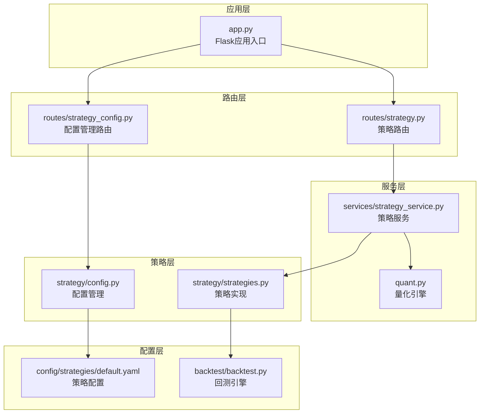
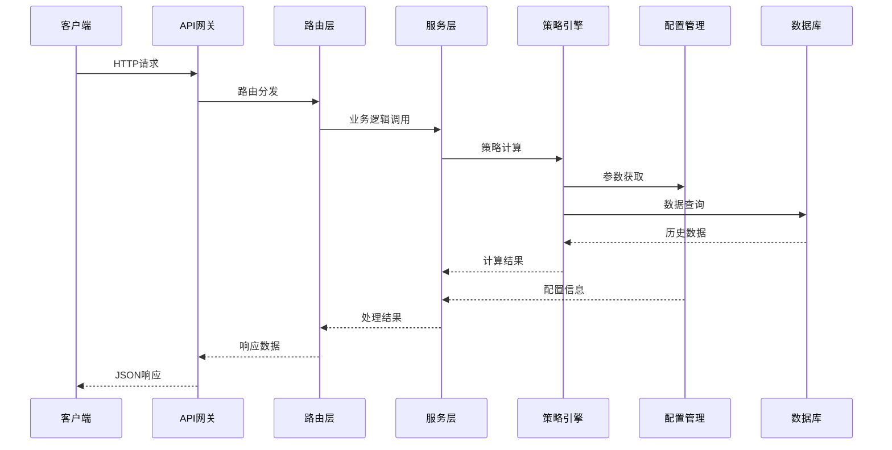
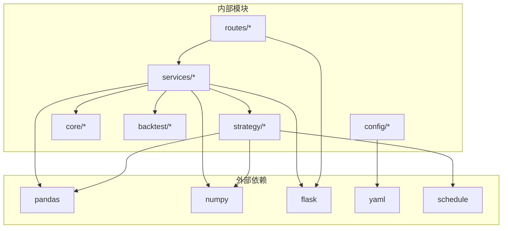

# 策略管理API

<cite>
**本文档引用的文件**
- [app.py](file://app.py)
- [routes/strategy.py](file://routes/strategy.py)
- [routes/strategy_config.py](file://routes/strategy_config.py)
- [services/strategy_service.py](file://services/strategy_service.py)
- [strategy/strategies.py](file://strategy/strategies.py)
- [strategy/config.py](file://strategy/config.py)
- [config/strategies/default.yaml](file://config/strategies/default.yaml)
- [quant.py](file://quant.py)
- [backtest/backtest.py](file://backtest/backtest.py)
</cite>

## 目录
1. [简介](#简介)
2. [项目结构](#项目结构)
3. [核心组件](#核心组件)
4. [架构概览](#架构概览)
5. [详细组件分析](#详细组件分析)
6. [依赖关系分析](#依赖关系分析)
7. [性能考虑](#性能考虑)
8. [故障排除指南](#故障排除指南)
9. [结论](#结论)
10. [附录](#附录)

## 简介
AIQuant策略管理API提供了完整的策略生命周期管理能力，包括策略创建、配置、启用/禁用、删除等操作。该系统支持多种量化策略（放量突破、均线粘合、量价背离、抄底、主力建仓、超跌反弹v4），提供策略参数设置、策略组合、策略评分、策略回测等功能。系统采用热加载机制，支持策略配置的动态更新，无需重启服务即可生效。

## 项目结构
AIQuant采用模块化设计，策略管理相关的核心文件分布如下：



**图表来源**
- [app.py:1-164](file://app.py#L1-L164)
- [routes/strategy.py:1-87](file://routes/strategy.py#L1-L87)
- [routes/strategy_config.py:1-72](file://routes/strategy_config.py#L1-L72)

**章节来源**
- [app.py:1-164](file://app.py#L1-L164)
- [routes/strategy.py:1-87](file://routes/strategy.py#L1-L87)
- [routes/strategy_config.py:1-72](file://routes/strategy_config.py#L1-L72)

## 核心组件
AIQuant策略管理API的核心组件包括：

### 1. 策略路由层
- 提供RESTful API接口
- 支持GET、POST等HTTP方法
- 实现参数验证和错误处理
- 支持SSE（Server-Sent Events）流式响应

### 2. 策略服务层
- 实现策略运行逻辑
- 提供批量筛选功能
- 支持多策略并联回测
- 实现策略比较分析

### 3. 策略实现层
- 包含5种核心策略算法
- 支持策略融合
- 提供超跌反弹v4策略
- 实现统一的信号输出格式

### 4. 配置管理层
- 支持YAML配置文件热加载
- 提供策略启用/禁用控制
- 支持参数权重配置
- 实现配置导入导出功能

**章节来源**
- [services/strategy_service.py:1-325](file://services/strategy_service.py#L1-L325)
- [strategy/strategies.py:1-431](file://strategy/strategies.py#L1-L431)
- [strategy/config.py:1-132](file://strategy/config.py#L1-L132)

## 架构概览
AIQuant采用分层架构设计，确保各层职责清晰分离：



**图表来源**
- [app.py:44-72](file://app.py#L44-L72)
- [routes/strategy.py:14-87](file://routes/strategy.py#L14-L87)
- [services/strategy_service.py:46-107](file://services/strategy_service.py#L46-L107)

## 详细组件分析

### 策略路由API规范

#### 1. 策略运行接口
**接口定义**
- 方法: GET
- URL: `/api/strategy/run`
- 功能: 运行所有策略并返回融合信号

**请求参数**
| 参数名 | 类型 | 必填 | 默认值 | 描述 |
|--------|------|------|--------|------|
| symbol | string | 是 | 无 | 股票代码 |
| start_date | string | 否 | 空 | 开始日期 |
| s1_vol_factor | float | 否 | 1.5 | 放量倍数 |
| s1_rise_3d | float | 否 | 0.02 | 3日涨幅阈值 |
| s1_score_min | int | 否 | 2 | 触发条件数 |
| s2_ma_narrow | float | 否 | 0.02 | 均线粘合阈值 |
| s4_drop_threshold | float | 否 | -0.05 | 抄底跌幅阈值 |
| s5_vol_ratio | float | 否 | 3.0 | 主力建仓量比 |

**响应格式**
```json
{
  "symbol": "string",
  "price": number,
  "strategies": {
    "s1_volume_breakout": {
      "name": "string",
      "signal": "BUY|SELL|HOLD",
      "score": number,
      "strength": number,
      "reasons": ["string"]
    },
    "s2_ma_convergence": {...},
    "s3_price_volume_divergence": {...},
    "s4_bottom_fishing": {...},
    "s5_whale_accumulation": {...}
  },
  "fused": {
    "buy_signal": boolean,
    "confidence": number,
    "num_triggered": number,
    "final_score": number,
    "reason": "string"
  }
}
```

**章节来源**
- [routes/strategy.py:14-32](file://routes/strategy.py#L14-L32)
- [services/strategy_service.py:46-107](file://services/strategy_service.py#L46-L107)

#### 2. 股票筛选接口
**接口定义**
- 方法: GET
- URL: `/api/strategy/screen`
- 功能: 批量策略筛选，支持SSE流式响应

**请求参数**
| 参数名 | 类型 | 必填 | 默认值 | 描述 |
|--------|------|------|--------|------|
| symbols | string | 否 | 空 | 股票代码列表 |
| use_v4 | boolean | 否 | true | 是否使用v4策略 |
| min_score | float | 否 | 0 | 最低评分阈值 |
| limit | int | 否 | 50 | 返回数量限制 |

**响应格式**
SSE流式响应，包含progress和done事件：
- progress事件: 进度更新
- done事件: 最终结果

**章节来源**
- [routes/strategy.py:35-54](file://routes/strategy.py#L35-L54)
- [services/strategy_service.py:110-213](file://services/strategy_service.py#L110-L213)

#### 3. 多策略回测接口
**接口定义**
- 方法: GET
- URL: `/api/strategy/backtest`
- 功能: 对单一股票进行多策略并联回测

**请求参数**
| 参数名 | 类型 | 必填 | 默认值 | 描述 |
|--------|------|------|--------|------|
| symbol | string | 是 | 无 | 股票代码 |
| start_date | string | 否 | "20220101" | 开始日期 |
| capital | float | 否 | 100000 | 初始资金 |

**响应格式**
```json
{
  "symbol": "string",
  "start_date": "string",
  "initial_capital": number,
  "results": {
    "放量突破": {
      "total_return": number,
      "annual_return": number,
      "max_drawdown": number,
      "sharpe_ratio": number,
      "win_rate": number,
      "total_trades": number,
      "equity_curve": [[string, number]]
    },
    "均线粘合": {...},
    "量价背离": {...},
    "抄底型": {...},
    "主力建仓": {...},
    "融合策略": {...}
  }
}
```

**章节来源**
- [routes/strategy.py:57-70](file://routes/strategy.py#L57-L70)
- [services/strategy_service.py:216-268](file://services/strategy_service.py#L216-L268)

#### 4. 策略比较接口
**接口定义**
- 方法: GET
- URL: `/api/strategy/compare`
- 功能: 比较多个股票的策略表现

**请求参数**
| 参数名 | 类型 | 必填 | 默认值 | 描述 |
|--------|------|------|--------|------|
| symbols | string | 是 | 无 | 股票代码列表 |
| start_date | string | 否 | "20220101" | 开始日期 |
| strategy | string | 否 | "fused" | 策略名称 |

**响应格式**
```json
{
  "strategy": "string",
  "stocks": [
    {
      "symbol": "string",
      "price": number,
      "buy_signal": boolean,
      "confidence": number
    }
  ],
  "count": number
}
```

**章节来源**
- [routes/strategy.py:73-86](file://routes/strategy.py#L73-L86)
- [services/strategy_service.py:271-324](file://services/strategy_service.py#L271-L324)

### 策略配置管理API

#### 1. 获取策略配置
**接口定义**
- 方法: GET
- URL: `/api/strategy/config`
- 功能: 获取当前策略配置

**响应格式**
```json
{
  "success": true,
  "config": {
    "version": "string",
    "last_modified": "string",
    "fusion_weights": {
      "default": [number],
      "pure_bottom": [number],
      "conservative": [number],
      "aggressive": [number]
    },
    "volume_breakout": {
      "enabled": boolean,
      "name": "string",
      "description": "string",
      "params": {
        "vol_factor": number,
        "rise_3d": number,
        "score_min": number
      }
    }
  }
}
```

**章节来源**
- [routes/strategy_config.py:18-24](file://routes/strategy_config.py#L18-L24)
- [strategy/config.py:116-119](file://strategy/config.py#L116-L119)

#### 2. 热加载配置
**接口定义**
- 方法: POST
- URL: `/api/strategy/config/reload`
- 功能: 热加载策略配置

**响应格式**
```json
{
  "success": true,
  "message": "string",
  "config": object
}
```

**章节来源**
- [routes/strategy_config.py:27-38](file://routes/strategy_config.py#L27-L38)
- [strategy/config.py:58-61](file://strategy/config.py#L58-L61)

#### 3. 获取策略列表
**接口定义**
- 方法: GET
- URL: `/api/strategy/list`
- 功能: 获取策略列表

**响应格式**
```json
{
  "success": true,
  "count": number,
  "strategies": [
    {
      "id": "string",
      "name": "string",
      "description": "string",
      "enabled": boolean,
      "params": object
    }
  ]
}
```

**章节来源**
- [routes/strategy_config.py:41-58](file://routes/strategy_config.py#L41-L58)
- [strategy/config.py:107-114](file://strategy/config.py#L107-L114)

#### 4. 获取融合权重
**接口定义**
- 方法: GET
- URL: `/api/strategy/weights`
- 功能: 获取融合权重配置

**响应格式**
```json
{
  "success": true,
  "weights": {
    "default": [number],
    "pure_bottom": [number],
    "conservative": [number],
    "aggressive": [number]
  }
}
```

**章节来源**
- [routes/strategy_config.py:61-71](file://routes/strategy_config.py#L61-L71)
- [strategy/config.py:103-105](file://strategy/config.py#L103-L105)

### 核心策略算法

#### 1. 放量突破策略
实现成交量显著放大、价格突破的技术分析策略，支持自定义放量倍数、涨幅阈值等参数。

#### 2. 均线粘合策略
检测MA5/MA10/MA20均线相互靠拢后向上突破的形态识别策略。

#### 3. 量价背离策略
通过价格创新低但成交量萎缩来识别潜在反转信号的策略。

#### 4. 抄底策略
在短期大幅下跌后出现反弹信号的超跌反弹策略。

#### 5. 主力建仓策略
通过成交量温和放大、价格小幅上涨来识别主力吸筹迹象的策略。

#### 6. 超跌反弹v4策略
基于连续打分系统的超跌反弹策略，包含7个严格条件。

**章节来源**
- [strategy/strategies.py:36-255](file://strategy/strategies.py#L36-L255)
- [strategy/strategies.py:281-360](file://strategy/strategies.py#L281-L360)

## 依赖关系分析



**图表来源**
- [services/strategy_service.py:9-22](file://services/strategy_service.py#L9-L22)
- [strategy/strategies.py:28-30](file://strategy/strategies.py#L28-L30)
- [strategy/config.py:7-10](file://strategy/config.py#L7-L10)

### 关键依赖关系
1. **策略服务依赖**：依赖策略实现模块和回测引擎
2. **路由依赖**：依赖服务层提供业务逻辑
3. **配置依赖**：依赖YAML配置文件进行参数管理
4. **数据依赖**：依赖核心模块提供的数据访问接口

**章节来源**
- [services/strategy_service.py:14-22](file://services/strategy_service.py#L14-L22)
- [strategy/config.py:45-51](file://strategy/config.py#L45-L51)

## 性能考虑
AIQuant策略管理API在设计时充分考虑了性能优化：

### 1. 缓存策略
- 配置文件热加载机制，避免频繁磁盘IO
- 策略结果缓存，减少重复计算
- 数据库连接池管理

### 2. 流式处理
- SSE流式响应，支持大数据量的渐进式传输
- 分批处理大量股票的筛选任务

### 3. 并行计算
- 多策略并行回测
- 批量数据处理优化

### 4. 内存管理
- 分页处理大量数据
- 及时释放临时变量

## 故障排除指南

### 常见问题及解决方案

#### 1. 配置文件加载失败
**症状**：策略配置无法加载
**原因**：YAML文件格式错误或权限问题
**解决**：检查YAML语法，确保文件编码为UTF-8

#### 2. 策略运行异常
**症状**：策略计算返回空结果
**原因**：数据不足或参数设置不当
**解决**：检查数据完整性，调整策略参数

#### 3. 回测结果异常
**症状**：回测指标异常
**原因**：参数设置错误或数据质量问题
**解决**：验证参数范围，检查数据质量

#### 4. API响应超时
**症状**：接口响应缓慢
**原因**：数据量过大或网络延迟
**解决**：优化查询条件，增加分页

**章节来源**
- [strategy/config.py:52-57](file://strategy/config.py#L52-L57)
- [services/strategy_service.py:54-55](file://services/strategy_service.py#L54-L55)

## 结论
AIQuant策略管理API提供了完整的量化策略生命周期管理能力，具有以下特点：

1. **模块化设计**：清晰的分层架构，职责分离明确
2. **热加载机制**：支持配置动态更新，无需重启服务
3. **多策略支持**：包含6种核心策略，支持策略融合
4. **完整API覆盖**：从策略创建到回测的全流程接口
5. **高性能设计**：流式处理、缓存优化、并行计算

该系统为企业级量化交易提供了坚实的技术基础，支持策略的快速迭代和优化。

## 附录

### API接口汇总表

| 接口名称 | 方法 | URL | 功能描述 |
|----------|------|-----|----------|
| 策略运行 | GET | `/api/strategy/run` | 运行所有策略并返回融合信号 |
| 股票筛选 | GET | `/api/strategy/screen` | 批量策略筛选，SSE流式响应 |
| 多策略回测 | GET | `/api/strategy/backtest` | 单一股票多策略并联回测 |
| 策略比较 | GET | `/api/strategy/compare` | 比较多个股票的策略表现 |
| 获取配置 | GET | `/api/strategy/config` | 获取当前策略配置 |
| 热加载配置 | POST | `/api/strategy/config/reload` | 热加载策略配置 |
| 获取策略列表 | GET | `/api/strategy/list` | 获取策略列表 |
| 获取融合权重 | GET | `/api/strategy/weights` | 获取融合权重配置 |

### 配置文件格式
策略配置采用YAML格式，支持热加载，主要包含：
- 策略启用状态控制
- 参数权重配置
- 策略评分阈值
- 回测参数设置
- v4策略参数网格