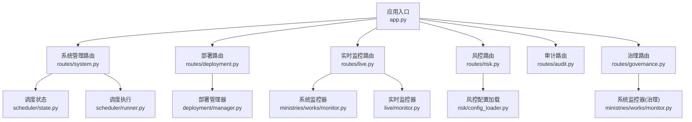
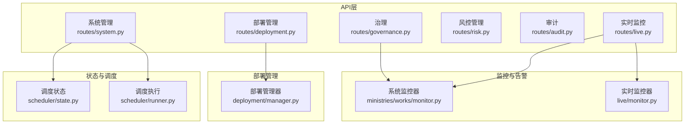
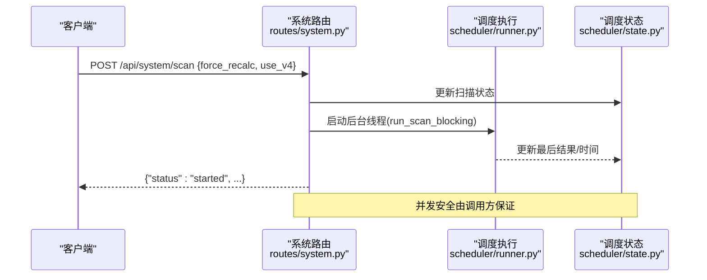
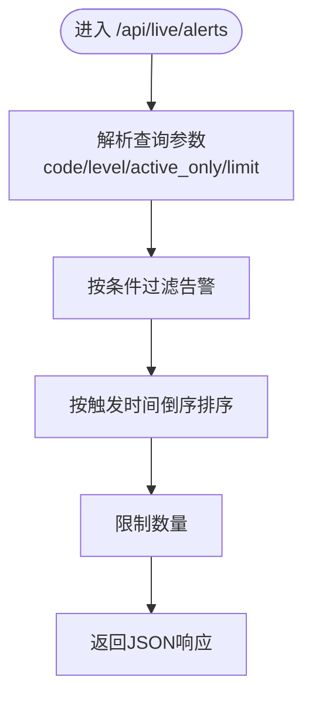
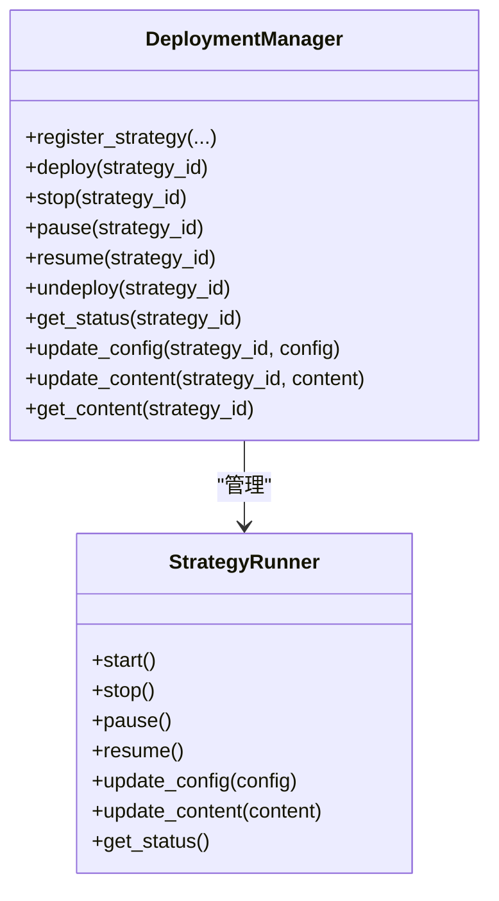
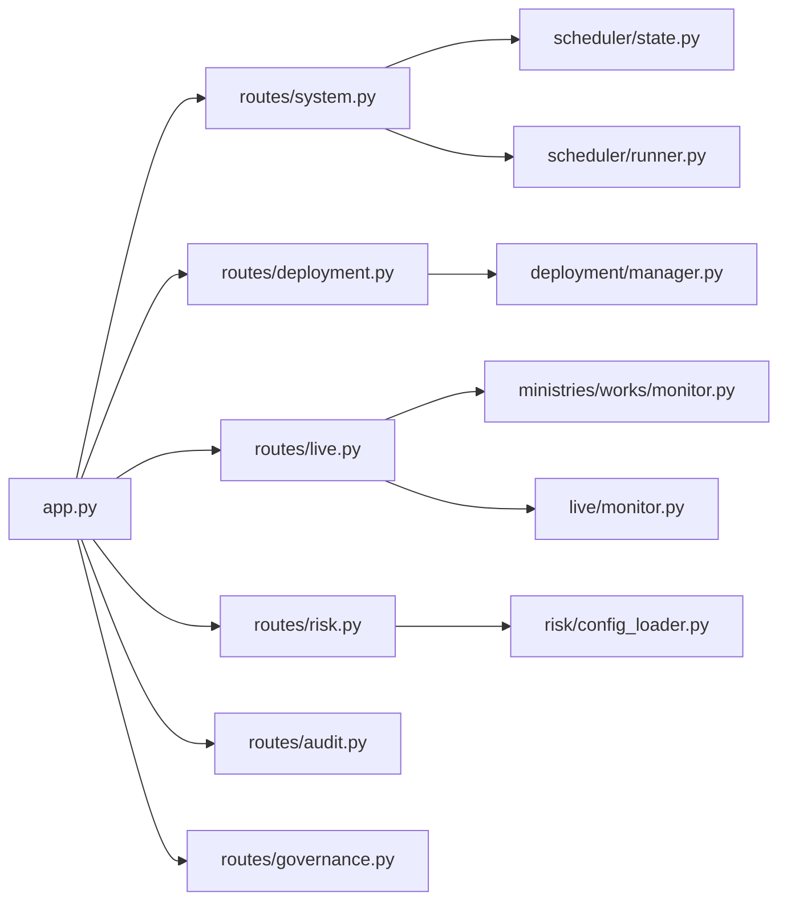

# 系统管理API

<cite>
**本文档引用的文件**
- [app.py](file://app.py)
- [routes/system.py](file://routes/system.py)
- [scheduler/state.py](file://scheduler/state.py)
- [scheduler/runner.py](file://scheduler/runner.py)
- [ministries/works/monitor.py](file://ministries/works/monitor.py)
- [routes/live.py](file://routes/live.py)
- [live/monitor.py](file://live/monitor.py)
- [routes/deployment.py](file://routes/deployment.py)
- [deployment/manager.py](file://deployment/manager.py)
- [routes/risk.py](file://routes/risk.py)
- [risk/config_loader.py](file://risk/config_loader.py)
- [config/settings.py](file://config/settings.py)
- [routes/audit.py](file://routes/audit.py)
- [core/audit.py](file://core/audit.py)
- [routes/governance.py](file://routes/governance.py)
</cite>

## 目录
1. [简介](#简介)
2. [项目结构](#项目结构)
3. [核心组件](#核心组件)
4. [架构概览](#架构概览)
5. [详细组件分析](#详细组件分析)
6. [依赖关系分析](#依赖关系分析)
7. [性能考虑](#性能考虑)
8. [故障排查指南](#故障排查指南)
9. [结论](#结论)

## 简介
本文件为AIQuant系统的系统管理API详细文档，覆盖系统健康检查、配置管理、状态查询、日志审计、风控管理、部署运维等核心能力。文档提供HTTP方法、URL路径、请求参数、响应格式、错误码及认证授权说明，并给出关键流程的时序图与类图，帮助开发者与运维人员快速理解与集成。

## 项目结构
系统管理相关功能主要分布在以下模块：
- 应用入口与全局路由注册：app.py
- 系统状态与调度：routes/system.py、scheduler/state.py、scheduler/runner.py
- 实时监控与告警：ministries/works/monitor.py、routes/live.py、live/monitor.py
- 部署与运维：routes/deployment.py、deployment/manager.py
- 风控与配置：routes/risk.py、risk/config_loader.py
- 审计与治理：routes/audit.py、core/audit.py、routes/governance.py
- 基础配置：config/settings.py

图表来源
- [app.py:1-164](file://app.py#L1-L164)
- [routes/system.py:1-152](file://routes/system.py#L1-L152)
- [scheduler/state.py:1-45](file://scheduler/state.py#L1-L45)
- [scheduler/runner.py:1-212](file://scheduler/runner.py#L1-L212)
- [ministries/works/monitor.py:1-114](file://ministries/works/monitor.py#L1-L114)
- [routes/live.py:53-97](file://routes/live.py#L53-L97)
- [live/monitor.py:218-254](file://live/monitor.py#L218-L254)
- [routes/deployment.py:1-147](file://routes/deployment.py#L1-L147)
- [deployment/manager.py:1-216](file://deployment/manager.py#L1-L216)
- [routes/risk.py:1-232](file://routes/risk.py#L1-L232)
- [risk/config_loader.py:45-130](file://risk/config_loader.py#L45-L130)
- [routes/audit.py:52-78](file://routes/audit.py#L52-L78)
- [routes/governance.py:1-31](file://routes/governance.py#L1-L31)

章节来源
- [app.py:1-164](file://app.py#L1-L164)

## 核心组件
- 系统状态与调度：提供数据同步、策略扫描、调度启停、自动检查等接口，状态通过进程内字典共享。
- 实时监控与告警：采集CPU/内存/磁盘/数据库大小等指标，支持告警查询与解决。
- 部署与运维：策略注册、部署、启停、暂停/恢复、注销、状态查询、热更新配置与内容管理。
- 风控与配置：风控状态查询、手动检查、配置热加载、黑名单管理、豁免申请与审批。
- 审计与治理：审计日志查询、治理状态总览。
- 基础配置：数据库路径、API主机端口、定时任务时间、日志级别等。

章节来源
- [routes/system.py:12-152](file://routes/system.py#L12-L152)
- [scheduler/state.py:1-45](file://scheduler/state.py#L1-L45)
- [scheduler/runner.py:1-212](file://scheduler/runner.py#L1-L212)
- [ministries/works/monitor.py:16-114](file://ministries/works/monitor.py#L16-L114)
- [routes/live.py:53-97](file://routes/live.py#L53-L97)
- [live/monitor.py:218-254](file://live/monitor.py#L218-L254)
- [routes/deployment.py:22-147](file://routes/deployment.py#L22-L147)
- [deployment/manager.py:24-216](file://deployment/manager.py#L24-L216)
- [routes/risk.py:1-232](file://routes/risk.py#L1-L232)
- [risk/config_loader.py:45-130](file://risk/config_loader.py#L45-L130)
- [routes/audit.py:52-78](file://routes/audit.py#L52-L78)
- [routes/governance.py:25-31](file://routes/governance.py#L25-L31)
- [config/settings.py:1-25](file://config/settings.py#L1-L25)

## 架构概览
系统管理API采用Flask Blueprint组织，核心状态通过进程内共享对象维护，调度器基于schedule库与线程实现。监控模块独立于业务，提供指标采集与告警能力。部署管理器负责策略生命周期管理与持久化记录。

图表来源
- [routes/system.py:12-152](file://routes/system.py#L12-L152)
- [scheduler/state.py:1-45](file://scheduler/state.py#L1-L45)
- [scheduler/runner.py:158-212](file://scheduler/runner.py#L158-L212)
- [ministries/works/monitor.py:29-114](file://ministries/works/monitor.py#L29-L114)
- [routes/live.py:53-97](file://routes/live.py#L53-L97)
- [live/monitor.py:218-254](file://live/monitor.py#L218-L254)
- [routes/deployment.py:22-147](file://routes/deployment.py#L22-L147)
- [deployment/manager.py:24-216](file://deployment/manager.py#L24-L216)
- [routes/governance.py:25-31](file://routes/governance.py#L25-L31)

## 详细组件分析

### 系统健康检查与状态查询
- 健康检查
  - 方法：GET
  - 路径：/api/health
  - 请求：无
  - 响应：包含状态与提示信息的JSON
  - 错误码：200
  - 示例响应：{"status":"ok","message":"A股量化系统运行中"}

- 系统状态
  - 方法：GET
  - 路径：/api/system/status
  - 请求：无
  - 响应字段：
    - sync.running, sync.last_time, sync.last_result
    - scan.running, scan.last_time, scan.last_result
    - scheduler.enabled
  - 错误码：200

- 自动检查策略扫描
  - 方法：GET
  - 路径：/api/system/auto_check
  - 请求：无
  - 响应字段：
    - should_scan, reason, latest_date, check_date, scan_done, scan_running
  - 错误码：200

- 触发数据同步（异步）
  - 方法：POST
  - 路径：/api/system/sync
  - 请求体：无
  - 响应：{"status":"started","message":"数据同步已启动"}
  - 错误码：200 或 409（正在运行）

- 触发策略扫描（异步）
  - 方法：POST
  - 路径：/api/system/scan
  - 请求体JSON：
    - force_recalc: bool（可选，默认False）
    - use_v4: bool（可选，默认True）
  - 响应：包含启动状态、模式与重算标记
  - 错误码：200 或 400/409

- 调度器启停
  - 方法：POST
  - 路径：/api/system/scheduler
  - 请求体JSON：{"enable": bool}
  - 响应：{"status":"enabled/disabled","message":"..."}
  - 错误码：200 或 400

图表来源
- [routes/system.py:24-43](file://routes/system.py#L24-L43)
- [scheduler/runner.py:90-101](file://scheduler/runner.py#L90-L101)
- [scheduler/state.py:6-11](file://scheduler/state.py#L6-L11)

章节来源
- [app.py:131-133](file://app.py#L131-L133)
- [routes/system.py:46-152](file://routes/system.py#L46-L152)
- [scheduler/state.py:1-45](file://scheduler/state.py#L1-L45)
- [scheduler/runner.py:29-101](file://scheduler/runner.py#L29-L101)

### 实时监控与告警
- 系统状态摘要
  - 方法：GET
  - 路径：/api/live/status
  - 响应字段：status、metrics(cpu_percent,memory_percent,disk_usage_percent,db_size_mb)、alert_count
  - 错误码：200

- 告警列表
  - 方法：GET
  - 路径：/api/live/alerts
  - 查询参数：
    - code: 股票代码过滤
    - level: 告警级别过滤
    - active_only: 是否仅显示未解决
    - limit: 结果数量限制
  - 响应：success、count、alerts数组
  - 错误码：200

- 解决告警
  - 方法：POST
  - 路径：/api/live/alerts/{alert_id}/resolve
  - 响应：success与消息
  - 错误码：200

- 清空告警
  - 方法：POST
  - 路径：/api/live/alerts/clear
  - 响应：success与消息
  - 错误码：200

- 监控配置更新
  - 方法：POST
  - 路径：/api/live/config
  - 请求体：监控相关配置键值对
  - 响应：success与消息
  - 错误码：200

图表来源
- [routes/live.py:53-97](file://routes/live.py#L53-L97)
- [live/monitor.py:218-254](file://live/monitor.py#L218-L254)

章节来源
- [ministries/works/monitor.py:86-101](file://ministries/works/monitor.py#L86-L101)
- [routes/live.py:53-97](file://routes/live.py#L53-L97)
- [live/monitor.py:218-254](file://live/monitor.py#L218-L254)

### 部署与运维
- 注册策略
  - 方法：POST
  - 路径：/api/deployment/register
  - 请求体JSON：{"strategy_id","strategy_name","interval",config,"strategy_content"}
  - 响应：注册结果
  - 错误码：200 或 400

- 部署启动
  - 方法：POST
  - 路径：/api/deployment/deploy
  - 请求体JSON：{"strategy_id"}
  - 响应：部署结果
  - 错误码：200 或 400

- 停止策略
  - 方法：POST
  - 路径：/api/deployment/stop
  - 请求体JSON：{"strategy_id"}
  - 响应：停止结果
  - 错误码：200 或 400

- 暂停策略
  - 方法：POST
  - 路径：/api/deployment/pause
  - 请求体JSON：{"strategy_id"}
  - 响应：暂停结果
  - 错误码：200 或 400

- 恢复策略
  - 方法：POST
  - 路径：/api/deployment/resume
  - 请求体JSON：{"strategy_id"}
  - 响应：恢复结果
  - 错误码：200 或 400

- 注销策略
  - 方法：POST
  - 路径：/api/deployment/undeploy
  - 请求体JSON：{"strategy_id"}
  - 响应：注销结果
  - 错误码：200 或 400

- 查询状态
  - 方法：GET
  - 路径：/api/deployment/status
  - 查询参数：strategy_id（可选）
  - 响应：状态详情或全部状态
  - 错误码：200

- 热更新配置
  - 方法：POST
  - 路径：/api/deployment/config
  - 请求体JSON：{"strategy_id","config"}
  - 响应：更新结果
  - 错误码：200 或 400

- 获取/更新策略内容
  - 方法：GET/POST
  - 路径：/api/deployment/content
  - 查询参数：GET时传strategy_id
  - 响应：内容或更新结果
  - 错误码：200 或 400

图表来源
- [deployment/manager.py:24-216](file://deployment/manager.py#L24-L216)

章节来源
- [routes/deployment.py:22-147](file://routes/deployment.py#L22-L147)
- [deployment/manager.py:24-216](file://deployment/manager.py#L24-L216)

### 风控与配置
- 风控状态
  - 方法：GET
  - 路径：/api/risk/status
  - 响应：当前风控状态与规则概要
  - 错误码：200

- 最近风控事件
  - 方法：GET
  - 路径：/api/risk/events
  - 查询参数：limit、level等
  - 响应：事件列表
  - 错误码：200

- 手动触发风控检查
  - 方法：POST
  - 路径：/api/risk/check
  - 请求体：账户状态等上下文
  - 响应：检查结果
  - 错误码：200

- 风控配置
  - 方法：GET
  - 路径：/api/risk/config
  - 响应：配置字典
  - 错误码：200

- 热加载配置
  - 方法：POST
  - 路径：/api/risk/config/reload
  - 响应：加载结果
  - 错误码：200

- 黑名单
  - 添加：POST /api/risk/blacklist
  - 删除：DELETE /api/risk/blacklist/{code}
  - 列表：GET /api/risk/blacklist

- 豁免
  - 申请：POST /api/risk/override
  - 记录：GET /api/risk/overrides
  - 审批：POST /api/risk/override/{id}/approve

章节来源
- [routes/risk.py:1-232](file://routes/risk.py#L1-L232)
- [risk/config_loader.py:45-130](file://risk/config_loader.py#L45-L130)

### 审计与治理
- 审计统计
  - 方法：GET
  - 路径：/api/audit/stats
  - 响应：今日总数、操作类型统计、最近7天趋势
  - 错误码：200

- 审计日志
  - 方法：GET
  - 路径：/api/audit/logs
  - 查询参数：action、user_id、limit、offset
  - 响应：日志列表与总数
  - 错误码：200

- 治理状态总览
  - 方法：GET
  - 路径：/api/governance/status
  - 响应：三省状态与监控摘要
  - 错误码：200

章节来源
- [routes/audit.py:52-78](file://routes/audit.py#L52-L78)
- [core/audit.py:71-110](file://core/audit.py#L71-L110)
- [routes/governance.py:25-31](file://routes/governance.py#L25-L31)

### 基础配置
- 数据库路径：DB_PATH
- API主机与端口：API_HOST, API_PORT
- 定时任务时间：SCHEDULE_SYNC_TIME, SCHEDULE_SCAN_TIME
- 数据同步批次与日志级别：SYNC_BATCH_SIZE, LOG_LEVEL

章节来源
- [config/settings.py:1-25](file://config/settings.py#L1-L25)

## 依赖关系分析
- 路由依赖：app.py注册各Blueprint，routes/system.py依赖scheduler/state与scheduler/runner。
- 监控依赖：routes/live.py与live/monitor.py共同提供告警能力，ministries/works/monitor.py提供系统指标采集。
- 部署依赖：routes/deployment.py依赖deployment/manager.py，后者管理StrategyRunner生命周期。
- 风控依赖：routes/risk.py依赖risk/engine、risk/models、risk/config_loader。
- 审计依赖：routes/audit.py依赖core/audit进行日志记录与查询。
- 治理依赖：routes/governance.py依赖各引擎与监控器。

图表来源
- [app.py:9-72](file://app.py#L9-L72)
- [routes/system.py:8-9](file://routes/system.py#L8-L9)
- [scheduler/state.py:6-11](file://scheduler/state.py#L6-L11)
- [scheduler/runner.py:17-20](file://scheduler/runner.py#L17-L20)
- [routes/live.py:53-97](file://routes/live.py#L53-L97)
- [ministries/works/monitor.py:108-113](file://ministries/works/monitor.py#L108-L113)
- [live/monitor.py:218-254](file://live/monitor.py#L218-L254)
- [routes/deployment.py:17](file://routes/deployment.py#L17)
- [deployment/manager.py:20-21](file://deployment/manager.py#L20-L21)
- [routes/risk.py:21-24](file://routes/risk.py#L21-L24)
- [risk/config_loader.py:45-130](file://risk/config_loader.py#L45-L130)

## 性能考虑
- 异步执行：系统同步与扫描通过后台线程执行，避免阻塞主请求。
- 状态共享：调度状态使用进程内字典，注意并发访问需加锁保护。
- 指标缓存：监控器保留最近24小时指标，避免频繁IO。
- 配置热加载：风控配置自动检测文件变更并热加载，减少停机时间。
- 日志级别：生产环境建议调整日志级别以降低I/O开销。

## 故障排查指南
- 健康检查失败
  - 现象：/api/health返回非200
  - 排查：确认服务进程运行、端口占用情况
  - 参考：[app.py:131-133](file://app.py#L131-L133)

- 同步/扫描冲突
  - 现象：409 Conflict
  - 原因：已有任务在运行
  - 处理：等待当前任务结束或检查状态接口
  - 参考：[routes/system.py:15-16](file://routes/system.py#L15-L16)、[routes/system.py:27-28](file://routes/system.py#L27-L28)

- 部署失败
  - 现象：部署/启停返回错误
  - 排查：确认策略已注册、Runner状态、记录文件可写
  - 参考：[routes/deployment.py:44-101](file://routes/deployment.py#L44-L101)、[deployment/manager.py:67-95](file://deployment/manager.py#L67-L95)

- 风控拦截
  - 现象：风控检查返回BLOCK
  - 处理：查看风险详情，必要时申请豁免
  - 参考：[routes/risk.py:172-204](file://routes/risk.py#L172-L204)

- 审计日志异常
  - 现象：审计统计或日志查询报错
  - 排查：检查数据库连接、表结构
  - 参考：[routes/audit.py:52-78](file://routes/audit.py#L52-L78)、[core/audit.py:71-110](file://core/audit.py#L71-L110)

章节来源
- [app.py:131-133](file://app.py#L131-L133)
- [routes/system.py:15-16](file://routes/system.py#L15-L16)
- [routes/system.py:27-28](file://routes/system.py#L27-L28)
- [routes/deployment.py:44-101](file://routes/deployment.py#L44-L101)
- [deployment/manager.py:67-95](file://deployment/manager.py#L67-L95)
- [routes/risk.py:172-204](file://routes/risk.py#L172-L204)
- [routes/audit.py:52-78](file://routes/audit.py#L52-L78)
- [core/audit.py:71-110](file://core/audit.py#L71-L110)

## 结论
本系统管理API围绕“状态查询、健康检查、调度控制、监控告警、部署运维、风控配置、审计治理”构建，具备良好的扩展性与运维友好性。建议在生产环境中结合认证授权、限流与日志审计完善安全体系，并根据业务负载调整调度策略与监控阈值。