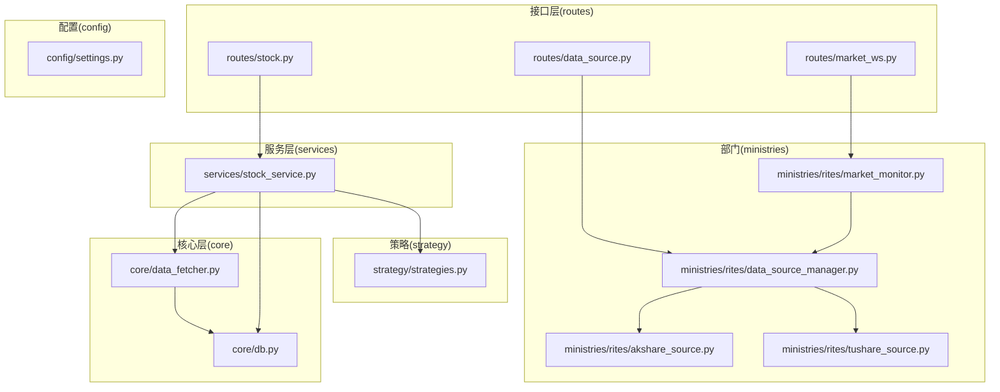
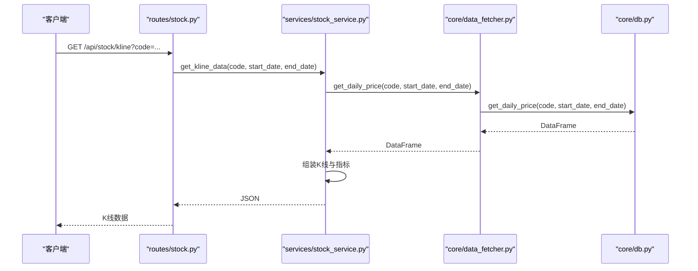
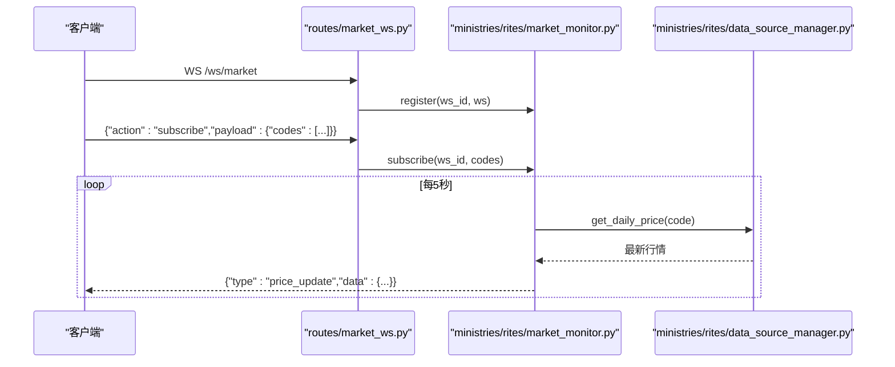
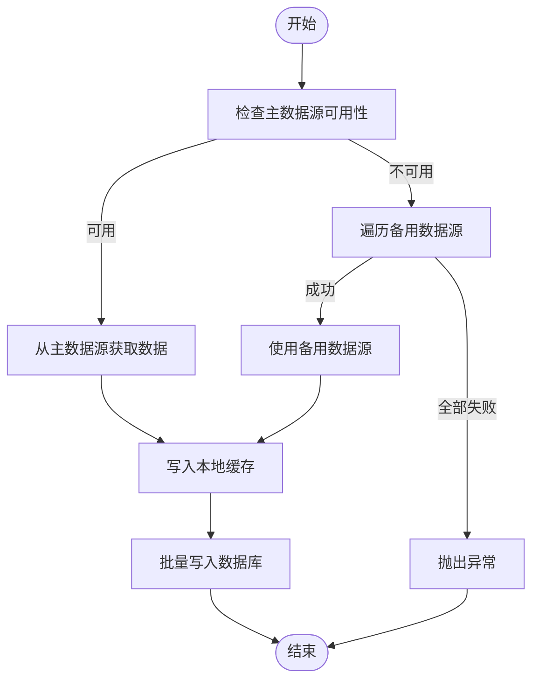
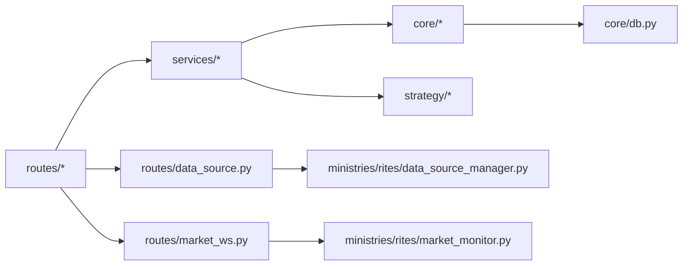

# 股票数据API

<cite>
**本文档引用的文件**
- [app.py](file://app.py)
- [routes/stock.py](file://routes/stock.py)
- [services/stock_service.py](file://services/stock_service.py)
- [routes/data_source.py](file://routes/data_source.py)
- [ministries/rites/data_source_manager.py](file://ministries/rites/data_source_manager.py)
- [ministries/rites/akshare_source.py](file://ministries/rites/akshare_source.py)
- [ministries/rites/tushare_source.py](file://ministries/rites/tushare_source.py)
- [core/data_fetcher.py](file://core/data_fetcher.py)
- [core/db.py](file://core/db.py)
- [routes/market_ws.py](file://routes/market_ws.py)
- [ministries/rites/market_monitor.py](file://ministries/rites/market_monitor.py)
- [routes/common.py](file://routes/common.py)
- [strategy/strategies.py](file://strategy/strategies.py)
- [config/settings.py](file://config/settings.py)
</cite>

## 目录
1. [简介](#简介)
2. [项目结构](#项目结构)
3. [核心组件](#核心组件)
4. [架构总览](#架构总览)
5. [详细组件分析](#详细组件分析)
6. [依赖关系分析](#依赖关系分析)
7. [性能考虑](#性能考虑)
8. [故障排查指南](#故障排查指南)
9. [结论](#结论)
10. [附录](#附录)

## 简介
本文件面向AIQuant项目的股票数据API，系统性梳理RESTful接口、实时行情订阅、数据格式规范、分页与时间范围过滤、数据精度、数据质量保障、缓存策略、限流与异常处理、数据源切换与同步等关键能力。读者可据此快速集成与扩展股票数据能力，支撑策略研究、回测与实时监控。

## 项目结构
AIQuant采用“蓝图+服务层+核心数据层”的分层设计：
- 蓝图层(routes)：定义HTTP接口与WebSocket路由，负责协议转换与参数校验
- 服务层(services)：封装业务逻辑，协调数据获取与策略分析
- 核心层(core)：提供数据获取、数据库访问、缓存与基础工具
- 部门(ministries)：组织跨模块协作，如数据源管理、市场监控
- 配置(config)：集中管理数据库路径、定时任务、日志级别等

**图表来源**
- [routes/stock.py:1-88](file://routes/stock.py#L1-L88)
- [routes/data_source.py:1-112](file://routes/data_source.py#L1-L112)
- [routes/market_ws.py:1-142](file://routes/market_ws.py#L1-L142)
- [services/stock_service.py:1-194](file://services/stock_service.py#L1-L194)
- [core/data_fetcher.py:1-578](file://core/data_fetcher.py#L1-L578)
- [core/db.py:1-800](file://core/db.py#L1-L800)
- [ministries/rites/data_source_manager.py:1-190](file://ministries/rites/data_source_manager.py#L1-L190)
- [ministries/rites/akshare_source.py:1-135](file://ministries/rites/akshare_source.py#L1-L135)
- [ministries/rites/tushare_source.py:1-167](file://ministries/rites/tushare_source.py#L1-L167)
- [ministries/rites/market_monitor.py:1-244](file://ministries/rites/market_monitor.py#L1-L244)
- [strategy/strategies.py:1-431](file://strategy/strategies.py#L1-L431)
- [config/settings.py:1-25](file://config/settings.py#L1-L25)

**章节来源**
- [app.py:1-164](file://app.py#L1-L164)
- [routes/stock.py:1-88](file://routes/stock.py#L1-L88)
- [routes/data_source.py:1-112](file://routes/data_source.py#L1-L112)
- [routes/market_ws.py:1-142](file://routes/market_ws.py#L1-L142)
- [services/stock_service.py:1-194](file://services/stock_service.py#L1-L194)
- [core/data_fetcher.py:1-578](file://core/data_fetcher.py#L1-L578)
- [core/db.py:1-800](file://core/db.py#L1-L800)
- [ministries/rites/data_source_manager.py:1-190](file://ministries/rites/data_source_manager.py#L1-L190)
- [ministries/rites/akshare_source.py:1-135](file://ministries/rites/akshare_source.py#L1-L135)
- [ministries/rites/tushare_source.py:1-167](file://ministries/rites/tushare_source.py#L1-L167)
- [ministries/rites/market_monitor.py:1-244](file://ministries/rites/market_monitor.py#L1-L244)
- [strategy/strategies.py:1-431](file://strategy/strategies.py#L1-L431)
- [config/settings.py:1-25](file://config/settings.py#L1-L25)

## 核心组件
- RESTful接口层：提供股票基本信息、历史K线、热门股票、分析与回测等接口
- 数据源管理层：统一抽象与切换多数据源（本地/akshare/tushare），内置健康检查与自动降级
- 实时行情WebSocket：订阅指定股票，周期性推送最新行情
- 服务层：封装策略分析、回测、K线组装与JSON安全转换
- 数据层：SQLite本地数据库，提供行情与指标的持久化与查询
- 策略框架：多策略信号生成与融合，支持回测引擎

**章节来源**
- [routes/stock.py:13-88](file://routes/stock.py#L13-L88)
- [services/stock_service.py:23-194](file://services/stock_service.py#L23-L194)
- [ministries/rites/data_source_manager.py:111-190](file://ministries/rites/data_source_manager.py#L111-L190)
- [routes/market_ws.py:72-142](file://routes/market_ws.py#L72-L142)
- [core/db.py:631-775](file://core/db.py#L631-L775)
- [strategy/strategies.py:367-431](file://strategy/strategies.py#L367-L431)

## 架构总览
AIQuant的股票数据API采用“接口层-服务层-核心层-部门-策略-配置”的分层架构，数据流自上而下，职责清晰：
- 接口层接收请求，进行参数校验与错误处理
- 服务层编排数据获取与策略分析
- 核心层负责数据获取与数据库访问
- 部门负责跨模块协作（数据源管理、市场监控）
- 策略层提供多策略与融合算法
- 配置层集中管理运行参数

**图表来源**
- [routes/stock.py:37-51](file://routes/stock.py#L37-L51)
- [services/stock_service.py:48-67](file://services/stock_service.py#L48-L67)
- [core/data_fetcher.py:631-665](file://core/data_fetcher.py#L631-L665)
- [core/db.py:631-665](file://core/db.py#L631-L665)

## 详细组件分析

### RESTful接口清单与使用说明
- 股票搜索
  - 方法与路径：GET /api/stock/search
  - 参数：q（关键词，必填）
  - 返回：匹配的股票列表
  - 错误：缺少关键词返回400
  - 示例：/api/stock/search?q=贵州茅台
  - 章节来源
    - [routes/stock.py:13-18](file://routes/stock.py#L13-L18)
    - [core/data_fetcher.py:301-331](file://core/data_fetcher.py#L301-L331)

- 热门股票
  - 方法与路径：GET /api/stock/hot
  - 返回：热门股票列表（默认前20）
  - 章节来源
    - [routes/stock.py:21-24](file://routes/stock.py#L21-L24)
    - [core/data_fetcher.py:334-368](file://core/data_fetcher.py#L334-L368)

- 股票列表
  - 方法与路径：GET /api/stock/list
  - 参数：with_score（布尔，默认true）
  - 返回：按成交量排序的股票列表，包含最新行情与可选融合评分
  - 章节来源
    - [routes/stock.py:27-34](file://routes/stock.py#L27-L34)
    - [services/stock_service.py:23-45](file://services/stock_service.py#L23-L45)
    - [core/db.py:519-527](file://core/db.py#L519-L527)

- K线数据
  - 方法与路径：GET /api/stock/kline
  - 参数：code（股票代码，必填）、start_date（开始日期，YYYYMMDD或YYYY-MM-DD）、end_date（结束日期）
  - 返回：K线数据（OHLCV及pct_change、turnover等）
  - 章节来源
    - [routes/stock.py:37-51](file://routes/stock.py#L37-L51)
    - [services/stock_service.py:48-67](file://services/stock_service.py#L48-L67)
    - [core/data_fetcher.py:631-665](file://core/data_fetcher.py#L631-L665)

- 股票分析
  - 方法与路径：GET /api/stock/analyze
  - 参数：symbol（股票代码，必填）、start_date（开始日期）、strategy（策略名，默认composite）
  - 返回：K线、指标（MA/EMA/RSI/KDJ/BOLL）、买卖信号、融合评分序列
  - 章节来源
    - [routes/stock.py:53-64](file://routes/stock.py#L53-L64)
    - [services/stock_service.py:70-126](file://services/stock_service.py#L70-L126)
    - [strategy/strategies.py:367-431](file://strategy/strategies.py#L367-L431)

- 股票信息
  - 方法与路径：GET /api/stock/info
  - 参数：symbol（股票代码，必填）
  - 返回：股票基本信息（名称、上市日期、状态等）
  - 章节来源
    - [routes/stock.py:67-72](file://routes/stock.py#L67-L72)
    - [core/data_fetcher.py:225-257](file://core/data_fetcher.py#L225-L257)

- 单股回测
  - 方法与路径：GET /api/stock/backtest
  - 参数：symbol（股票代码，必填）、start_date（默认20220101）、strategy（策略名，默认composite）、capital（初始资金，默认100000）
  - 返回：回测摘要、指标、净值曲线、交易列表
  - 章节来源
    - [routes/stock.py:75-87](file://routes/stock.py#L75-L87)
    - [services/stock_service.py:146-193](file://services/stock_service.py#L146-L193)

### 数据格式规范
- 时间格式
  - 请求参数：支持YYYYMMDD或YYYY-MM-DD两种格式
  - 章节来源
    - [core/data_fetcher.py:184-192](file://core/data_fetcher.py#L184-L192)
    - [core/db.py:637-643](file://core/db.py#L637-L643)

- K线字段
  - 字段：date、open、close、high、low、volume、pct_change、turnover
  - 精度：价格保留2位小数，成交量与金额不做舍入
  - 章节来源
    - [services/stock_service.py:55-66](file://services/stock_service.py#L55-L66)
    - [routes/common.py:9-19](file://routes/common.py#L9-L19)

- 指标字段
  - MA系列：MA5、MA10、MA20、MA60
  - MACD：DIF、DEA、HIST
  - RSI：RSI6、RSI14、RSI24
  - KDJ：KDJ_K、KDJ_D、KDJ_J
  - 布林：BOLL_UPPER、BOLL_MID、BOLL_LOWER
  - 章节来源
    - [services/stock_service.py:114-126](file://services/stock_service.py#L114-L126)

- 融合评分
  - FUSION_SCORE：0-50区间，用于综合信号判定
  - 章节来源
    - [strategy/strategies.py:420-428](file://strategy/strategies.py#L420-L428)

### 分页与时间范围过滤
- 分页：接口层未提供分页参数，建议前端自行截取或在服务层增加分页逻辑
- 时间范围：通过start_date与end_date过滤，支持空值表示默认范围
- 章节来源
  - [routes/stock.py:39-41](file://routes/stock.py#L39-L41)
  - [services/stock_service.py:48-53](file://services/stock_service.py#L48-L53)
  - [core/data_fetcher.py:184-192](file://core/data_fetcher.py#L184-L192)

### 数据质量保证与缓存策略
- 缓存策略
  - 本地缓存：核心数据获取模块对历史行情进行CSV缓存，命中即直接返回
  - 章节来源
    - [core/data_fetcher.py:194-222](file://core/data_fetcher.py#L194-L222)

- 数据质量
  - 多数据源：优先本地/BAOSTOCK，失败自动降级AKSHARE/TUSHARE
  - 健康检查：数据源管理器对各数据源进行可用性与质量评估
  - 章节来源
    - [ministries/rites/data_source_manager.py:136-151](file://ministries/rites/data_source_manager.py#L136-L151)
    - [ministries/rites/akshare_source.py:21-43](file://ministries/rites/akshare_source.py#L21-L43)
    - [ministries/rites/tushare_source.py:33-63](file://ministries/rites/tushare_source.py#L33-L63)

- 数据清洗
  - 过滤NaN/无效close、统一列名、标准化日期索引
  - 章节来源
    - [core/data_fetcher.py:113-133](file://core/data_fetcher.py#L113-L133)

### 实时数据订阅（WebSocket）
- 订阅流程
  - 建立WS连接：/ws/market
  - 发送订阅消息：{"action":"subscribe","payload":{"codes":["000001","600036"]}}
  - 推送消息：{"type":"price_update","code":"000001","data":{...}}
- 章节来源
  - [routes/market_ws.py:72-123](file://routes/market_ws.py#L72-L123)
  - [ministries/rites/market_monitor.py:141-173](file://ministries/rites/market_monitor.py#L141-L173)

**图表来源**
- [routes/market_ws.py:72-123](file://routes/market_ws.py#L72-L123)
- [ministries/rites/market_monitor.py:124-173](file://ministries/rites/market_monitor.py#L124-L173)
- [ministries/rites/data_source_manager.py:153-177](file://ministries/rites/data_source_manager.py#L153-L177)

### 数据源切换与同步
- 数据源管理
  - 支持本地、AKSHARE、TUSHARE三种数据源
  - 提供健康检查、主数据源切换、自动降级
  - 章节来源
    - [routes/data_source.py:25-86](file://routes/data_source.py#L25-L86)
    - [ministries/rites/data_source_manager.py:111-190](file://ministries/rites/data_source_manager.py#L111-L190)

- 同步与入库
  - 本地数据库：daily_price表存储OHLCV与策略评分
  - 批量写入与冲突更新，支持策略评分单独批量更新
  - 章节来源
    - [core/db.py:543-578](file://core/db.py#L543-L578)
    - [core/db.py:581-628](file://core/db.py#L581-L628)

**图表来源**
- [ministries/rites/data_source_manager.py:153-177](file://ministries/rites/data_source_manager.py#L153-L177)
- [core/data_fetcher.py:194-222](file://core/data_fetcher.py#L194-L222)
- [core/db.py:543-578](file://core/db.py#L543-L578)

## 依赖关系分析
- 组件耦合
  - routes依赖services与core，services依赖core与strategy，core依赖db
  - 数据源管理器解耦具体数据源实现，便于扩展
- 外部依赖
  - baostock、akshare、tushare、sqlite3、flask、flask_sock
- 章节来源
  - [app.py:9-72](file://app.py#L9-L72)
  - [ministries/rites/data_source_manager.py:48-71](file://ministries/rites/data_source_manager.py#L48-L71)

**图表来源**
- [app.py:9-72](file://app.py#L9-L72)
- [routes/data_source.py:17-22](file://routes/data_source.py#L17-L22)
- [routes/market_ws.py:17-23](file://routes/market_ws.py#L17-L23)
- [ministries/rites/market_monitor.py:21-36](file://ministries/rites/market_monitor.py#L21-L36)

## 性能考虑
- 数据缓存：历史行情CSV缓存减少重复抓取
- 批量写入：数据库批量插入与ON CONFLICT更新，降低IO开销
- 策略评分：策略评分单独批量更新，避免重复写入行情数据
- WebSocket推送：批量拉取、固定间隔推送，避免过载
- 章节来源
  - [core/data_fetcher.py:194-222](file://core/data_fetcher.py#L194-L222)
  - [core/db.py:543-578](file://core/db.py#L543-L578)
  - [core/db.py:581-628](file://core/db.py#L581-L628)
  - [ministries/rites/market_monitor.py:141-151](file://ministries/rites/market_monitor.py#L141-L151)

## 故障排查指南
- 常见错误
  - 缺少参数：返回400，提示缺少必要参数
  - 数据缺失：返回404或空数据，检查代码与时间范围
  - 服务器异常：返回500，查看服务端日志
- 健康检查
  - 数据源健康：GET /api/data/health
  - 主数据源切换：POST /api/data/switch
  - 章节来源
    - [routes/stock.py:46-50](file://routes/stock.py#L46-L50)
    - [routes/data_source.py:46-86](file://routes/data_source.py#L46-L86)
    - [app.py:137-144](file://app.py#L137-L144)

- 实时行情
  - 连接状态：GET /api/market/status
  - 客户端列表：GET /api/market/clients
  - 章节来源
    - [routes/market_ws.py:26-42](file://routes/market_ws.py#L26-L42)

## 结论
AIQuant的股票数据API通过清晰的分层设计与多数据源容灾机制，提供了稳定的历史数据查询、实时行情订阅与策略分析能力。结合本地缓存与批量写入，可在保证数据质量的同时兼顾性能。建议在生产环境中启用健康检查与主备切换，并根据业务需求扩展更多数据源与指标。

## 附录
- 配置项
  - 数据库路径：config/settings.py中的DB_PATH
  - API主机与端口：API_HOST/API_PORT
  - 同步批次大小：SYNC_BATCH_SIZE
  - 章节来源
    - [config/settings.py:6-24](file://config/settings.py#L6-L24)