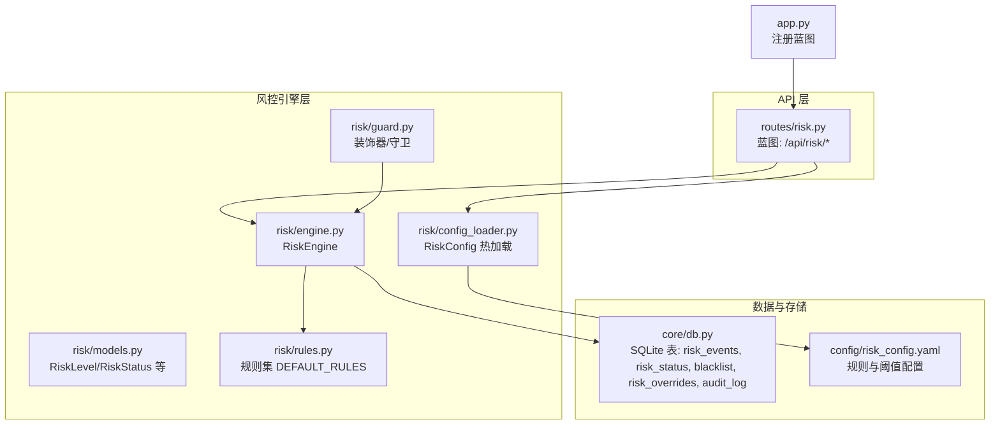
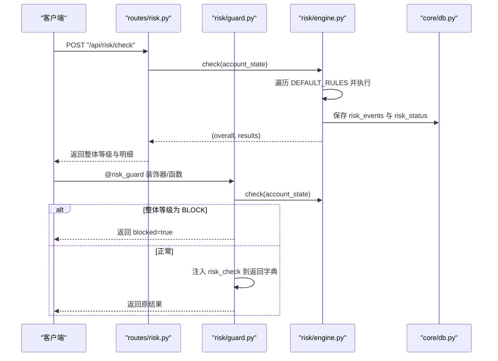
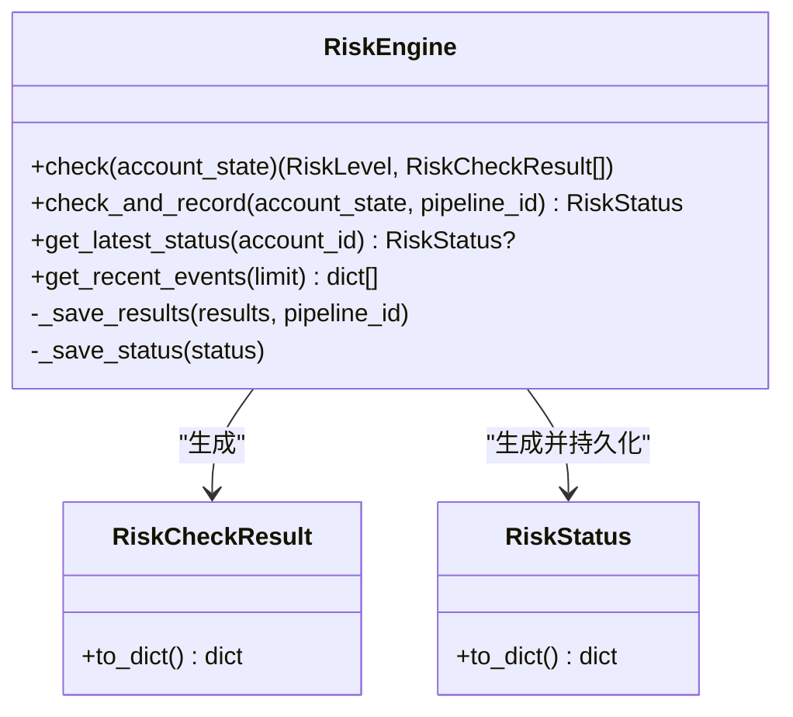
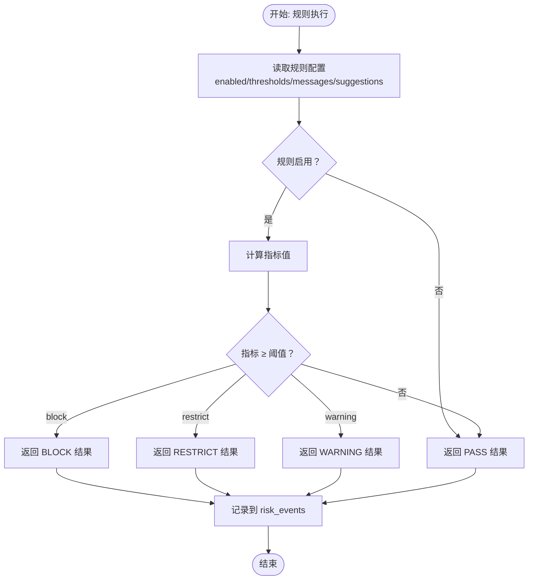
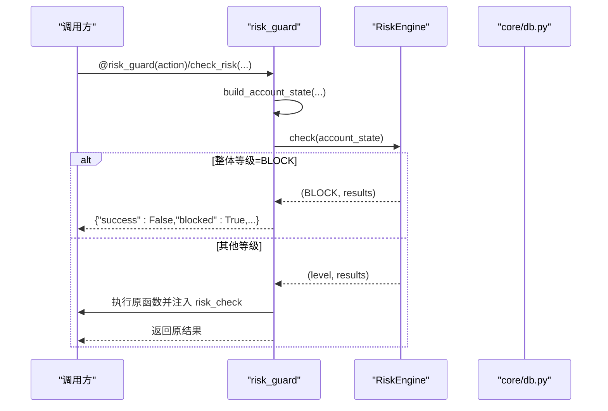
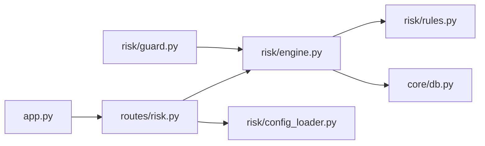

# 风控API

<cite>
**本文引用的文件**
- [risk/__init__.py](file://risk/__init__.py)
- [risk/engine.py](file://risk/engine.py)
- [risk/guard.py](file://risk/guard.py)
- [risk/models.py](file://risk/models.py)
- [risk/rules.py](file://risk/rules.py)
- [risk/config_loader.py](file://risk/config_loader.py)
- [routes/risk.py](file://routes/risk.py)
- [core/db.py](file://core/db.py)
- [config/risk_config.yaml](file://config/risk_config.yaml)
- [app.py](file://app.py)
- [core/audit.py](file://core/audit.py)
</cite>

## 目录
1. [简介](#简介)
2. [项目结构](#项目结构)
3. [核心组件](#核心组件)
4. [架构总览](#架构总览)
5. [详细组件分析](#详细组件分析)
6. [依赖分析](#依赖分析)
7. [性能考量](#性能考量)
8. [故障排查指南](#故障排查指南)
9. [结论](#结论)
10. [附录](#附录)

## 简介
本文件为 AIQuant 风控模块的 API 文档，覆盖风控规则配置、风控状态查询、风控事件处理、实时风控检查、风控拦截处理、风险阈值与策略配置、实时风控检查、风控拦截处理、风险指标计算与评估、风险预警机制、风控规则动态调整、风险敞口监控、风险报告生成、风控系统集成、异常处理与审计日志等安全考虑。文档以“接口规范 + 技术实现 + 使用示例路径”的形式组织，便于开发者快速上手与扩展。

## 项目结构
风控相关代码主要位于 risk 子模块，并通过 routes/risk.py 对外暴露 REST API；配置由 config/risk_config.yaml 提供，支持热加载；风控事件与状态持久化于 core/db.py 中的 SQLite 表 risk_events、risk_status、blacklist、risk_overrides、audit_log 等。

图表来源
- [routes/risk.py:1-298](file://routes/risk.py#L1-L298)
- [risk/engine.py:1-168](file://risk/engine.py#L1-L168)
- [risk/guard.py:1-92](file://risk/guard.py#L1-L92)
- [risk/models.py:1-78](file://risk/models.py#L1-L78)
- [risk/rules.py:1-388](file://risk/rules.py#L1-L388)
- [risk/config_loader.py:1-131](file://risk/config_loader.py#L1-L131)
- [core/db.py:358-426](file://core/db.py#L358-L426)
- [config/risk_config.yaml:1-170](file://config/risk_config.yaml#L1-L170)
- [app.py:19-72](file://app.py#L19-L72)

章节来源
- [routes/risk.py:1-298](file://routes/risk.py#L1-L298)
- [risk/engine.py:1-168](file://risk/engine.py#L1-L168)
- [risk/guard.py:1-92](file://risk/guard.py#L1-L92)
- [risk/models.py:1-78](file://risk/models.py#L1-L78)
- [risk/rules.py:1-388](file://risk/rules.py#L1-L388)
- [risk/config_loader.py:1-131](file://risk/config_loader.py#L1-L131)
- [core/db.py:358-426](file://core/db.py#L358-L426)
- [config/risk_config.yaml:1-170](file://config/risk_config.yaml#L1-L170)
- [app.py:19-72](file://app.py#L19-L72)

## 核心组件
- 风控引擎 RiskEngine：负责执行规则集、聚合结果、持久化状态与事件、查询最新状态与事件。
- 风控规则集 DEFAULT_RULES：内置多条风控规则，均从 RiskConfig 动态读取阈值与消息模板。
- 风控配置 RiskConfig：YAML 配置热加载，支持按规则名读取 enabled、thresholds、messages、suggestions 等。
- 风控守卫 risk_guard：装饰器/函数式入口，用于在业务流程中进行实时风控拦截与结果注入。
- 数据模型：RiskLevel、RiskCategory、RiskCheckResult、RiskStatus。
- API 蓝图 routes/risk.py：对外提供状态查询、事件查询、手动检查、配置读取与热加载、黑名单管理、风控豁免、回撤曲线等接口。

章节来源
- [risk/engine.py:13-168](file://risk/engine.py#L13-L168)
- [risk/rules.py:376-388](file://risk/rules.py#L376-L388)
- [risk/config_loader.py:20-131](file://risk/config_loader.py#L20-L131)
- [risk/guard.py:36-92](file://risk/guard.py#L36-L92)
- [risk/models.py:11-78](file://risk/models.py#L11-L78)
- [routes/risk.py:26-298](file://routes/risk.py#L26-L298)

## 架构总览
风控系统采用“配置驱动 + 规则引擎 + API 蓝图 + 持久化”的分层设计。业务侧通过装饰器或直接调用风控守卫进行实时检查；API 层提供统一的查询与管理接口；配置中心支持热加载；数据库持久化风控事件与状态，支撑审计与报表。

图表来源
- [routes/risk.py:67-82](file://routes/risk.py#L67-L82)
- [risk/guard.py:36-92](file://risk/guard.py#L36-L92)
- [risk/engine.py:19-71](file://risk/engine.py#L19-L71)
- [core/db.py:358-426](file://core/db.py#L358-L426)

## 详细组件分析

### 风控引擎 RiskEngine
- 职责
  - 执行规则集，聚合为整体风险等级与明细。
  - 将检查结果与状态写入数据库，支持查询最新状态与最近事件。
- 关键能力
  - check(account_state): 返回 (overall, results)，按严重级别取最大值。
  - check_and_record(account_state, pipeline_id): 执行检查并持久化。
  - get_latest_status(account_id): 查询最新风控状态。
  - get_recent_events(limit): 查询最近风控事件。
- 数据持久化
  - risk_events：规则名、类别、等级、消息、指标值、阈值、建议、时间戳。
  - risk_status：账户ID、整体等级、活跃规则、当前回撤、持仓数、总敞口、可用资金、最后检查时间、阻断原因。

图表来源
- [risk/engine.py:13-168](file://risk/engine.py#L13-L168)
- [risk/models.py:28-78](file://risk/models.py#L28-L78)

章节来源
- [risk/engine.py:13-168](file://risk/engine.py#L13-L168)
- [risk/models.py:28-78](file://risk/models.py#L28-L78)
- [core/db.py:358-426](file://core/db.py#L358-L426)

### 风控规则集与配置
- 规则集 DEFAULT_RULES：包含最大回撤、单股集中度、大盘择时、连续亏损、日交易频率、个股波动率、行业集中度、总仓位、节假日持仓提醒、黑名单检查等。
- 配置 RiskConfig：从 config/risk_config.yaml 读取，支持 enabled、thresholds、messages、suggestions 等字段；提供 get_rule_config、is_rule_enabled、get_threshold、get_message、get_suggestion 等便捷方法；支持热加载与自动检测。
- 风险等级与类别
  - RiskLevel：pass、warning、restrict、block。
  - RiskCategory：drawdown、concentration、volatility、market_timing、position_limit、cooldown、blacklist。

图表来源
- [risk/rules.py:34-61](file://risk/rules.py#L34-L61)
- [risk/rules.py:68-99](file://risk/rules.py#L68-L99)
- [risk/rules.py:106-129](file://risk/rules.py#L106-L129)
- [risk/rules.py:136-158](file://risk/rules.py#L136-L158)
- [risk/rules.py:165-187](file://risk/rules.py#L165-L187)
- [risk/rules.py:194-225](file://risk/rules.py#L194-L225)
- [risk/rules.py:232-269](file://risk/rules.py#L232-L269)
- [risk/rules.py:276-303](file://risk/rules.py#L276-L303)
- [risk/rules.py:310-327](file://risk/rules.py#L310-L327)
- [risk/rules.py:334-369](file://risk/rules.py#L334-L369)
- [risk/config_loader.py:88-116](file://risk/config_loader.py#L88-L116)

章节来源
- [risk/rules.py:34-387](file://risk/rules.py#L34-L387)
- [risk/config_loader.py:20-131](file://risk/config_loader.py#L20-L131)
- [config/risk_config.yaml:1-170](file://config/risk_config.yaml#L1-L170)

### 风控守卫 risk_guard
- 作用
  - 装饰器：对被装饰函数进行风控前置检查，若整体等级为 BLOCK 则直接拦截并返回阻断信息；否则执行原函数并在返回字典中注入 risk_check。
  - 函数式：直接传入 account_state 执行风控检查并返回结构化结果。
- 账户状态构建：build_account_state 从多源聚合关键风控指标，包括账户ID、当前回撤、持仓列表、总资产、总敞口、可用资金、连续亏损次数、日开仓次数、大盘 MA5/MA20、交易目标、即将到来的假期天数等。

图表来源
- [risk/guard.py:36-92](file://risk/guard.py#L36-L92)
- [risk/engine.py:19-71](file://risk/engine.py#L19-L71)
- [core/db.py:358-426](file://core/db.py#L358-L426)

章节来源
- [risk/guard.py:15-92](file://risk/guard.py#L15-L92)
- [risk/engine.py:19-71](file://risk/engine.py#L19-L71)

### API 接口规范（routes/risk.py）
- 基础查询
  - GET /api/risk/status：获取当前风控状态（整体等级、阻断标志、当前回撤、持仓数、活跃规则、阻断原因、最后检查时间）。
  - GET /api/risk/events：获取最近风控事件，支持 limit 与 level 过滤。
  - POST /api/risk/check：手动触发风控检查，传入 account_state，返回整体等级与明细。
- 配置管理
  - GET /api/risk/config：获取当前风控配置与配置文件路径。
  - POST /api/risk/config/reload：热加载风控配置。
- 黑名单管理
  - GET /api/risk/blacklist：获取有效黑名单列表。
  - POST /api/risk/blacklist：添加黑名单（stock_code、reason、expiry_days）。
  - DELETE /api/risk/blacklist/<code>：移除黑名单。
- 风控豁免
  - POST /api/risk/override：申请风控豁免（rule_name、reason、duration_hours、operator），支持自动生效或需审批。
  - GET /api/risk/overrides：查询豁免记录，支持 status 过滤。
  - POST /api/risk/override/<id>/approve：审批通过豁免申请。
- 风险指标与报告
  - GET /api/risk/drawdown：获取账户资产回撤曲线（基于 account_snapshots 表），返回日期序列、回撤序列、最大回撤、当前回撤。

章节来源
- [routes/risk.py:31-298](file://routes/risk.py#L31-L298)

### 数据模型与持久化
- 风控事件表 risk_events：记录每次规则检查的详细信息，便于审计与回溯。
- 风控状态表 risk_status：账户级快照，支持快速查询最新状态。
- 黑名单表 blacklist：股票代码、原因、有效期、创建者等。
- 风控豁免表 risk_overrides：规则名、原因、操作员、审批状态、到期时间等。
- 审计日志表 audit_log：统一审计入口，记录操作、资源、详情、IP、时间等。

章节来源
- [core/db.py:358-426](file://core/db.py#L358-L426)

## 依赖分析
- 组件耦合
  - routes/risk.py 依赖 RiskEngine、RiskConfig、数据库接口。
  - RiskEngine 依赖 DEFAULT_RULES、RiskConfig、数据库接口。
  - RiskConfig 依赖 YAML 配置文件与自动检测逻辑。
  - risk/guard 依赖 RiskEngine。
- 外部依赖
  - Flask 蓝图注册与路由定义。
  - SQLite 数据库连接与事务管理。
  - 配置文件热加载与线程锁保护。

图表来源
- [routes/risk.py:21-26](file://routes/risk.py#L21-L26)
- [risk/engine.py:8-10](file://risk/engine.py#L8-L10)
- [risk/guard.py:11](file://risk/guard.py#L11)
- [app.py:19-72](file://app.py#L19-L72)

章节来源
- [routes/risk.py:21-26](file://routes/risk.py#L21-L26)
- [risk/engine.py:8-10](file://risk/engine.py#L8-L10)
- [risk/guard.py:11](file://risk/guard.py#L11)
- [app.py:19-72](file://app.py#L19-L72)

## 性能考量
- 配置热加载
  - RiskConfig 通过文件修改时间检测实现自动热加载，避免重启服务即可生效。
- 数据库写入
  - 使用上下文管理器与 WAL 模式、NORMAL 同步策略，兼顾并发与可靠性。
- 规则执行
  - DEFAULT_RULES 顺序执行，异常规则不影响整体流程，且结果入库便于后续分析。
- API 查询
  - 支持 limit 与过滤参数，避免一次性返回大量事件导致性能问题。

章节来源
- [risk/config_loader.py:58-72](file://risk/config_loader.py#L58-L72)
- [core/db.py:26-40](file://core/db.py#L26-L40)
- [routes/risk.py:55-64](file://routes/risk.py#L55-L64)

## 故障排查指南
- 配置热加载失败
  - 检查配置文件路径与权限；确认 YAML 格式正确；查看控制台输出的加载日志。
- 数据库写入失败
  - 检查数据库初始化是否完成、表是否存在、连接是否超时；关注异常打印。
- 风控拦截误判
  - 检查对应规则的 enabled 与 thresholds 设置；核对 account_state 指标是否正确；必要时临时禁用规则验证。
- 审计日志缺失
  - 确认审计日志表是否存在；检查 log_audit 调用链；核对 IP 与用户 ID 提取逻辑。

章节来源
- [risk/config_loader.py:45-57](file://risk/config_loader.py#L45-L57)
- [core/db.py:358-426](file://core/db.py#L358-L426)
- [core/audit.py:16-92](file://core/audit.py#L16-L92)

## 结论
AIQuant 风控模块以“配置驱动 + 规则引擎 + API 蓝图 + 持久化”为核心，提供了完善的风控规则配置、实时风控检查、事件与状态管理、黑名单与豁免、回撤曲线等能力。通过热加载与装饰器守卫，系统在保证灵活性的同时具备良好的可运维性与可观测性。建议在生产环境中结合审计日志与告警机制，持续优化阈值与规则集，确保风控策略与市场环境相匹配。

## 附录

### API 使用示例路径
- 实时风控检查（装饰器）
  - [risk/guard.py:36-74](file://risk/guard.py#L36-L74)
- 实时风控检查（函数式）
  - [risk/guard.py:77-92](file://risk/guard.py#L77-L92)
- 手动触发风控检查
  - [routes/risk.py:67-82](file://routes/risk.py#L67-L82)
- 查询风控状态
  - [routes/risk.py:31-49](file://routes/risk.py#L31-L49)
- 查询风控事件
  - [routes/risk.py:52-64](file://routes/risk.py#L52-L64)
- 获取/热加载风控配置
  - [routes/risk.py:86-108](file://routes/risk.py#L86-L108)
- 黑名单管理
  - [routes/risk.py:112-167](file://routes/risk.py#L112-L167)
- 风控豁免
  - [routes/risk.py:172-225](file://routes/risk.py#L172-L225)
- 回撤曲线
  - [routes/risk.py:246-297](file://routes/risk.py#L246-L297)

### 风控规则与阈值参考
- 配置文件位置与字段
  - [config/risk_config.yaml:1-170](file://config/risk_config.yaml#L1-L170)
- 规则函数与阈值读取
  - [risk/rules.py:34-387](file://risk/rules.py#L34-L387)
- 配置读取与热加载
  - [risk/config_loader.py:73-126](file://risk/config_loader.py#L73-L126)