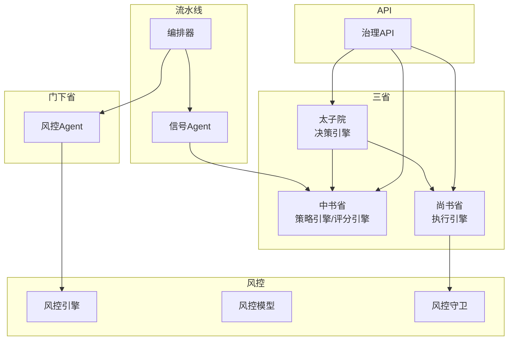
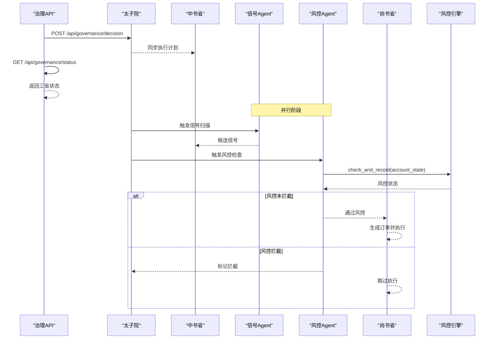
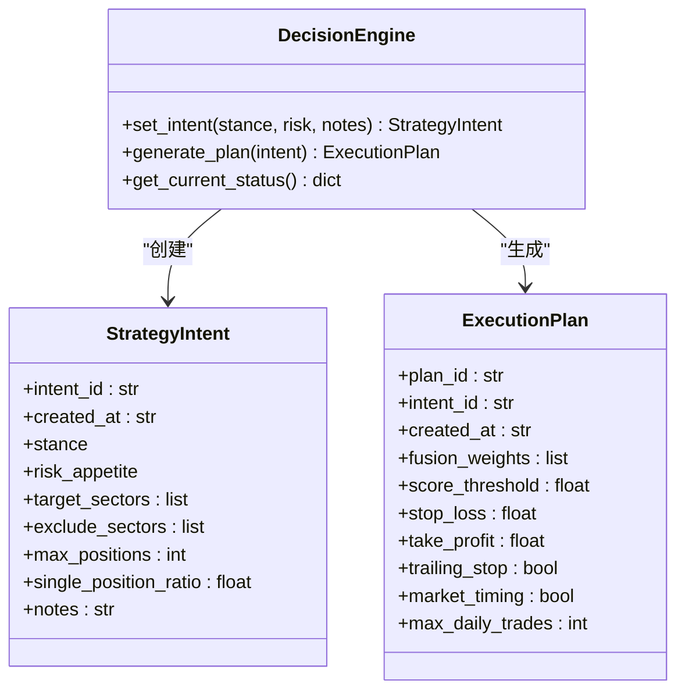
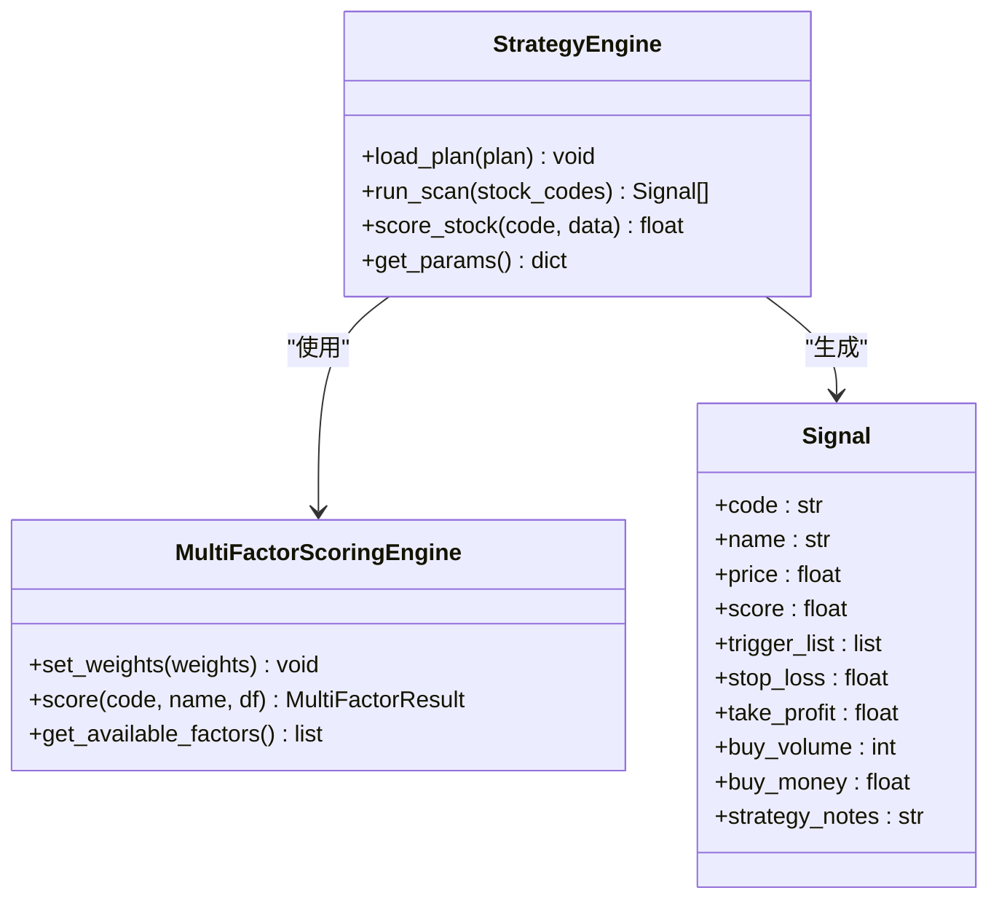
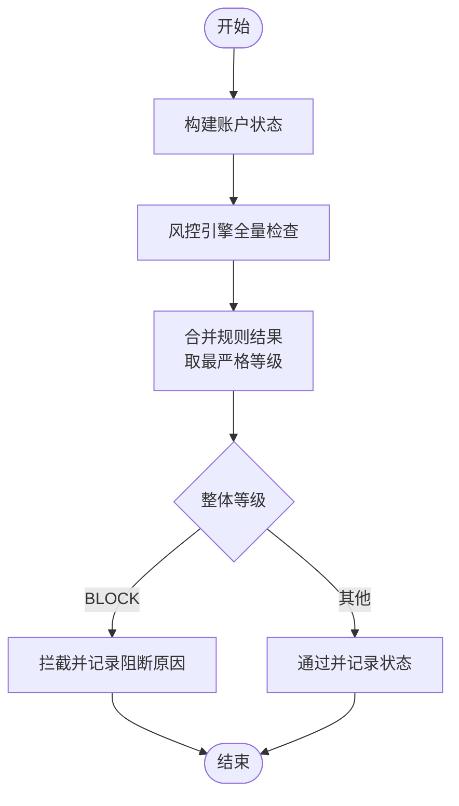
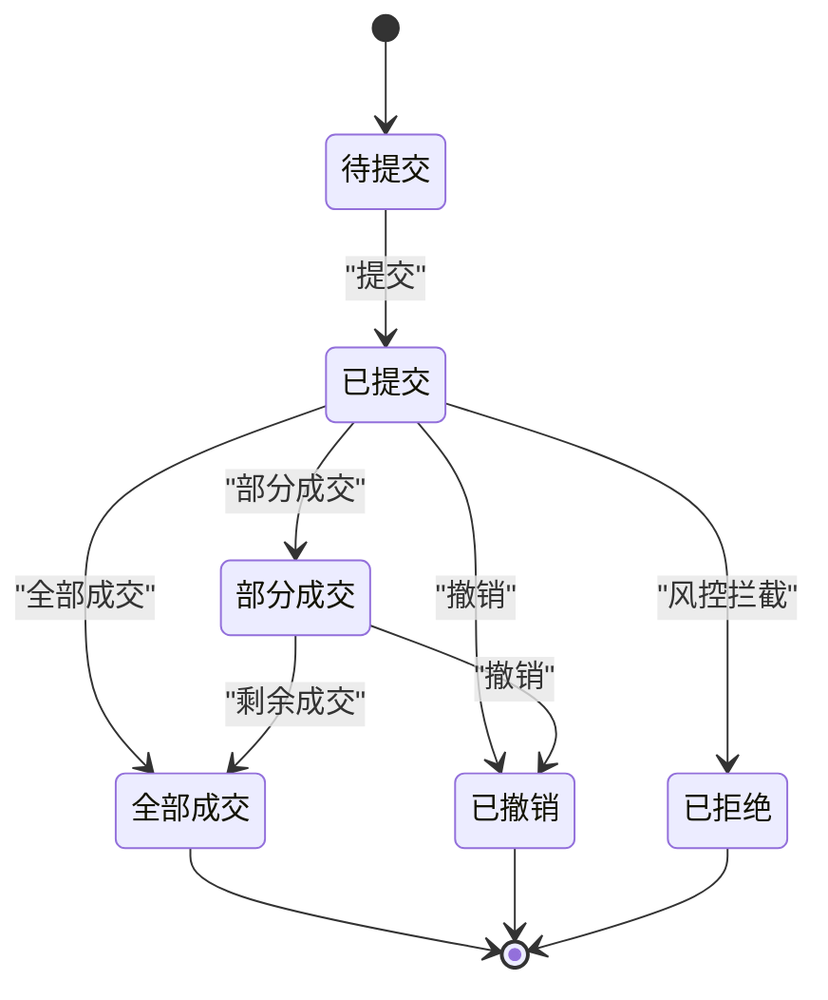
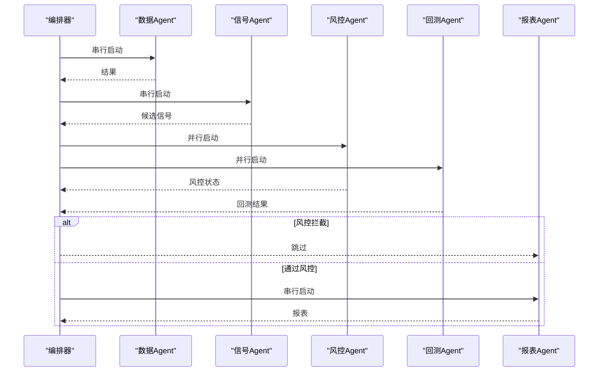
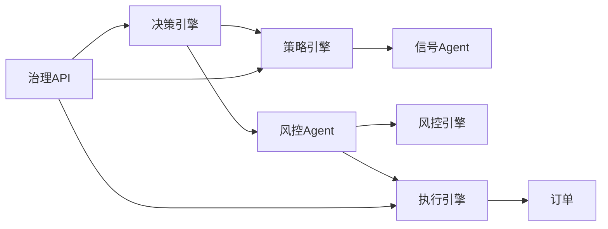

# 三省决策架构

<cite>
**本文引用的文件**
- [governance/__init__.py](file://governance/__init__.py)
- [governance/crown_prince/decision_engine.py](file://governance/crown_prince/decision_engine.py)
- [governance/chancellery/strategy_engine.py](file://governance/chancellery/strategy_engine.py)
- [governance/chancellery/scoring_engine.py](file://governance/chancellery/scoring_engine.py)
- [governance/secretariat/execution_engine.py](file://governance/secretariat/execution_engine.py)
- [agents/orchestrator.py](file://agents/orchestrator.py)
- [agents/base.py](file://agents/base.py)
- [agents/signal_agent.py](file://agents/signal_agent.py)
- [agents/risk_agent.py](file://agents/risk_agent.py)
- [risk/engine.py](file://risk/engine.py)
- [risk/models.py](file://risk/models.py)
- [risk/guard.py](file://risk/guard.py)
- [routes/governance.py](file://routes/governance.py)
- [scheduler/state.py](file://scheduler/state.py)
- [app.py](file://app.py)
</cite>

## 目录
1. [引言](#引言)
2. [项目结构](#项目结构)
3. [核心组件](#核心组件)
4. [架构总览](#架构总览)
5. [详细组件分析](#详细组件分析)
6. [依赖分析](#依赖分析)
7. [性能考虑](#性能考虑)
8. [故障排查指南](#故障排查指南)
9. [结论](#结论)
10. [附录](#附录)

## 引言
本文件面向AIQuant的“三省六部”决策与执行架构，系统化阐述太子院（决策层）、中书省（策略层）、门下省（风控层）、尚书省（执行层）的职责分工与协作机制，以及多Agent流水线的编排执行模式（状态管理、持久化、错误处理）。文档覆盖从策略意图到信号生成、风控检查、执行调度与报表输出的完整生命周期，并提供Agent实现示例、配置方法、状态转换图与流程图，帮助系统管理员与开发者进行运维与扩展。

## 项目结构
围绕“三省六部”组织的核心目录与文件如下：
- governance：三省决策与执行的领域引擎
  - crown_prince：决策层（策略意图、执行计划）
  - chancellery：策略层（多因子评分、策略参数）
  - secretariat：执行层（订单生成、执行、状态）
- agents：多Agent流水线编排与具体Agent实现
  - orchestrator：流水线编排器
  - signal_agent：信号生成Agent
  - risk_agent：风控Agent
  - base：Agent基类与上下文
- risk：风控引擎与模型
- routes：三省状态API
- scheduler：调度状态（进程内）
- app：Flask应用入口

图表来源
- [governance/crown_prince/decision_engine.py:61-157](file://governance/crown_prince/decision_engine.py#L61-L157)
- [governance/chancellery/strategy_engine.py:32-103](file://governance/chancellery/strategy_engine.py#L32-L103)
- [governance/chancellery/scoring_engine.py:246-370](file://governance/chancellery/scoring_engine.py#L246-L370)
- [governance/secretariat/execution_engine.py:57-183](file://governance/secretariat/execution_engine.py#L57-L183)
- [agents/orchestrator.py:36-263](file://agents/orchestrator.py#L36-L263)
- [agents/signal_agent.py:41-213](file://agents/signal_agent.py#L41-L213)
- [agents/risk_agent.py:25-262](file://agents/risk_agent.py#L25-L262)
- [risk/engine.py:13-168](file://risk/engine.py#L13-L168)
- [risk/models.py:11-78](file://risk/models.py#L11-L78)
- [risk/guard.py:36-92](file://risk/guard.py#L36-L92)
- [routes/governance.py:25-151](file://routes/governance.py#L25-L151)

章节来源
- [governance/__init__.py:1-10](file://governance/__init__.py#L1-L10)
- [app.py:39-76](file://app.py#L39-L76)

## 核心组件
- 太子院（决策层）：负责接收策略意图、结合市场环境生成执行计划，并动态调整权重与风险偏好，供中书省与尚书省使用。
- 中书省（策略层）：加载执行计划，执行多策略融合评分，输出交易信号与参数。
- 门下省（风控层）：进行大盘风险评估、波动率评估、个股筛查、系统化风控检查，并支持“一票否决”拦截。
- 尚书省（执行层）：接收信号，进行风控检查，生成订单并调度执行，记录执行结果。
- 多Agent流水线：以编排器为核心，串行/并行组合Agent，统一状态管理、持久化与错误处理。
- 风控引擎与模型：集中式规则检查、状态持久化与查询接口。
- API路由：提供三省状态查询与决策意图设置等REST接口。

章节来源
- [governance/crown_prince/decision_engine.py:61-157](file://governance/crown_prince/decision_engine.py#L61-L157)
- [governance/chancellery/strategy_engine.py:32-103](file://governance/chancellery/strategy_engine.py#L32-L103)
- [governance/chancellery/scoring_engine.py:246-370](file://governance/chancellery/scoring_engine.py#L246-L370)
- [governance/secretariat/execution_engine.py:57-183](file://governance/secretariat/execution_engine.py#L57-L183)
- [agents/orchestrator.py:36-263](file://agents/orchestrator.py#L36-L263)
- [agents/base.py:20-120](file://agents/base.py#L20-L120)
- [agents/signal_agent.py:41-213](file://agents/signal_agent.py#L41-L213)
- [agents/risk_agent.py:25-262](file://agents/risk_agent.py#L25-L262)
- [risk/engine.py:13-168](file://risk/engine.py#L13-L168)
- [risk/models.py:11-78](file://risk/models.py#L11-L78)
- [risk/guard.py:36-92](file://risk/guard.py#L36-L92)
- [routes/governance.py:25-151](file://routes/governance.py#L25-L151)

## 架构总览
三省六部的职责与协作关系如下：
- 太子院生成执行计划，同步至中书省策略引擎。
- 中书省执行策略扫描与多因子评分，产出候选信号。
- 门下省并行进行回测与风控检查；若风控拦截则中止后续流程。
- 尚书省在通过风控后生成订单并执行，记录结果。
- API提供状态查询与意图设置，便于前端与自动化调度。

图表来源
- [routes/governance.py:70-101](file://routes/governance.py#L70-L101)
- [governance/crown_price/decision_engine.py:68-122](file://governance/crown_prince/decision_engine.py#L68-L122)
- [agents/orchestrator.py:112-153](file://agents/orchestrator.py#L112-L153)
- [agents/risk_agent.py:52-96](file://agents/risk_agent.py#L52-L96)
- [risk/engine.py:51-71](file://risk/engine.py#L51-L71)
- [governance/secretariat/execution_engine.py:64-101](file://governance/secretariat/execution_engine.py#L64-L101)

## 详细组件分析

### 太子院（决策层）：决策引擎
- 职责
  - 接收策略意图（市场立场、风险偏好、目标/排除行业等）
  - 结合市场环境生成执行计划（融合权重、阈值、止损止盈、交易频率等）
  - 动态调整策略权重与风险偏好
  - 输出给中书省与尚书省
- 关键数据结构
  - 市场立场与风险偏好枚举
  - 策略意图与执行计划数据类
- 交互
  - 通过API设置意图并生成计划
  - 同步到中书省策略引擎

图表来源
- [governance/crown_prince/decision_engine.py:61-157](file://governance/crown_prince/decision_engine.py#L61-L157)

章节来源
- [governance/crown_prince/decision_engine.py:61-157](file://governance/crown_prince/decision_engine.py#L61-L157)
- [routes/governance.py:70-101](file://routes/governance.py#L70-L101)

### 中书省（策略层）：策略与评分引擎
- 职责
  - 加载执行计划
  - 多策略融合评分（趋势、动量、波动率、成交量、质量）
  - 输出交易信号与参数
- 多因子评分引擎
  - 因子注册表与内置因子计算
  - 加权融合评分与等级/建议输出
- 与策略层协作
  - 依据执行计划中的权重与阈值进行评分与筛选

图表来源
- [governance/chancellery/strategy_engine.py:32-103](file://governance/chancellery/strategy_engine.py#L32-L103)
- [governance/chancellery/scoring_engine.py:246-370](file://governance/chancellery/scoring_engine.py#L246-L370)

章节来源
- [governance/chancellery/strategy_engine.py:32-103](file://governance/chancellery/strategy_engine.py#L32-L103)
- [governance/chancellery/scoring_engine.py:246-370](file://governance/chancellery/scoring_engine.py#L246-L370)

### 门下省（风控层）：风控Agent与引擎
- 职责
  - 大盘风险评估（指数趋势、回撤）
  - 波动率评估（年化波动）
  - 个股风险筛查（连续涨停、天量杀跌、接近底部、RSI超买等）
  - 系统化风控检查（接入风控引擎）
  - “一票否决”拦截
- 风控引擎
  - 规则集合与最严格等级聚合
  - 结果持久化（事件与状态）
  - 查询接口

图表来源
- [agents/risk_agent.py:52-96](file://agents/risk_agent.py#L52-L96)
- [risk/engine.py:19-71](file://risk/engine.py#L19-L71)
- [risk/models.py:11-78](file://risk/models.py#L11-L78)

章节来源
- [agents/risk_agent.py:25-262](file://agents/risk_agent.py#L25-L262)
- [risk/engine.py:13-168](file://risk/engine.py#L13-L168)
- [risk/models.py:11-78](file://risk/models.py#L11-L78)
- [risk/guard.py:36-92](file://risk/guard.py#L36-L92)

### 尚书省（执行层）：执行引擎
- 职责
  - 接收交易信号
  - 风控检查（调用门下省/风控模块）
  - 生成订单并调度执行（模拟/实盘预留）
  - 记录执行结果
- 数据结构
  - 订单状态与方向枚举
  - 订单数据类

图表来源
- [governance/secretariat/execution_engine.py:22-55](file://governance/secretariat/execution_engine.py#L22-L55)

章节来源
- [governance/secretariat/execution_engine.py:57-183](file://governance/secretariat/execution_engine.py#L57-L183)

### 多Agent流水线：编排器与上下文
- 职责
  - 管理三省六部执行顺序与依赖关系
  - 支持串行与并行执行
  - 错误处理与重试机制
  - 状态持久化（供API查询）
  - 定时触发集成
- Agent上下文
  - 流水线共享存储
  - 统一结果记录与摘要

图表来源
- [agents/orchestrator.py:81-175](file://agents/orchestrator.py#L81-L175)
- [agents/base.py:38-120](file://agents/base.py#L38-L120)

章节来源
- [agents/orchestrator.py:36-263](file://agents/orchestrator.py#L36-L263)
- [agents/base.py:20-120](file://agents/base.py#L20-L120)

### Agent实现示例与配置方法
- 信号Agent（中书省·策略官）
  - 功能：运行5策略融合与v4超跌反弹扫描，生成候选列表并保存至数据库
  - 关键路径：[agents/signal_agent.py:41-213](file://agents/signal_agent.py#L41-L213)
- 风控Agent（门下省·风控官）
  - 功能：大盘趋势/波动率评估、个股筛查、系统化风控检查
  - 关键路径：[agents/risk_agent.py:25-262](file://agents/risk_agent.py#L25-L262)
- 执行引擎（尚书省·执行官）
  - 功能：风控检查、订单生成、模拟/实盘执行
  - 关键路径：[governance/secretariat/execution_engine.py:57-183](file://governance/secretariat/execution_engine.py#L57-L183)
- 策略与评分引擎
  - 关键路径：[governance/chancellery/strategy_engine.py:32-103](file://governance/chancellery/strategy_engine.py#L32-L103)、[governance/chancellery/scoring_engine.py:246-370](file://governance/chancellery/scoring_engine.py#L246-L370)
- 决策引擎
  - 关键路径：[governance/crown_prince/decision_engine.py:61-157](file://governance/crown_prince/decision_engine.py#L61-L157)

章节来源
- [agents/signal_agent.py:41-213](file://agents/signal_agent.py#L41-L213)
- [agents/risk_agent.py:25-262](file://agents/risk_agent.py#L25-L262)
- [governance/secretariat/execution_engine.py:57-183](file://governance/secretariat/execution_engine.py#L57-L183)
- [governance/chancellery/strategy_engine.py:32-103](file://governance/chancellery/strategy_engine.py#L32-L103)
- [governance/chancellery/scoring_engine.py:246-370](file://governance/chancellery/scoring_engine.py#L246-L370)
- [governance/crown_prince/decision_engine.py:61-157](file://governance/crown_prince/decision_engine.py#L61-L157)

## 依赖分析
- 组件耦合
  - 太子院与中书省：通过执行计划耦合
  - 中书省与门下省：通过候选信号与风控状态耦合
  - 门下省与尚书省：通过风控拦截与订单生成耦合
- 外部依赖
  - 数据源管理、订单管理、系统监控等模块通过API暴露状态
  - 风控引擎依赖规则集与数据库持久化

图表来源
- [routes/governance.py:25-57](file://routes/governance.py#L25-L57)
- [agents/orchestrator.py:112-153](file://agents/orchestrator.py#L112-L153)
- [risk/engine.py:51-71](file://risk/engine.py#L51-L71)

章节来源
- [routes/governance.py:25-151](file://routes/governance.py#L25-L151)
- [agents/orchestrator.py:36-263](file://agents/orchestrator.py#L36-L263)
- [risk/engine.py:13-168](file://risk/engine.py#L13-L168)

## 性能考虑
- 并行化
  - 回测与风控并行执行，缩短整体时延
- 扫描优化
  - 分批扫描、限制Top N输出、数据库落库减少重复计算
- 风控检查
  - 使用最严格等级聚合，避免冗余检查
- 状态持久化
  - 风控事件与状态入库，降低内存压力
- 监控与告警
  - API提供状态查询，结合调度状态模块进行进程内状态跟踪

## 故障排查指南
- API健康检查
  - 路由：GET /api/health
  - 返回系统健康状态
- 三省状态查询
  - 路由：GET /api/governance/status
  - 查看决策、策略、执行与六部状态
- 风控拦截定位
  - 在风控Agent中查看阻断原因与激活规则
  - 通过风控引擎查询最近事件与状态
- 订单状态核对
  - 通过执行引擎查询待执行与已执行订单
- 调度状态
  - 使用调度状态模块更新流水线状态，便于前端或外部系统观测

章节来源
- [app.py:131-134](file://app.py#L131-L134)
- [routes/governance.py:25-57](file://routes/governance.py#L25-L57)
- [agents/risk_agent.py:60-96](file://agents/risk_agent.py#L60-L96)
- [risk/engine.py:129-168](file://risk/engine.py#L129-L168)
- [governance/secretariat/execution_engine.py:157-164](file://governance/secretariat/execution_engine.py#L157-L164)
- [scheduler/state.py:24-45](file://scheduler/state.py#L24-L45)

## 结论
AIQuant的三省六部架构以清晰的职责划分与严格的风控拦截机制，实现了从策略意图到信号生成、风控检查与执行落地的闭环。多Agent流水线编排器提供了灵活的串行/并行执行能力与完善的错误处理与状态持久化，适合在生产环境中稳定运行。通过API与前端仪表板，系统具备良好的可观测性与可运维性。

## 附录
- 扩展与自定义建议
  - 新增因子：在评分引擎中注册新因子，调整权重
  - 新增Agent：遵循Agent基类规范，接入编排器
  - 自定义风控规则：在风控规则集中新增规则并接入引擎
  - 配置管理：通过策略配置与API设置意图，动态调整执行计划
- 运维与监控
  - 使用治理API定期拉取状态
  - 结合调度状态模块与日志，建立告警与恢复机制
  - 实盘执行前务必验证风控拦截策略与订单状态