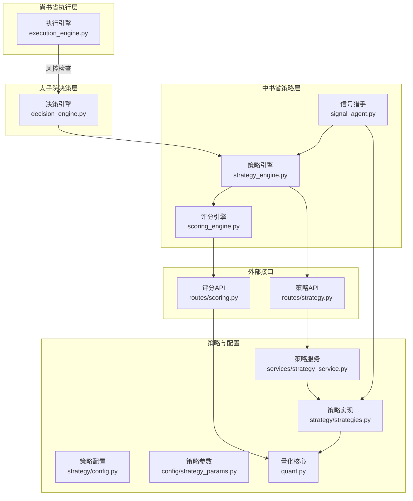
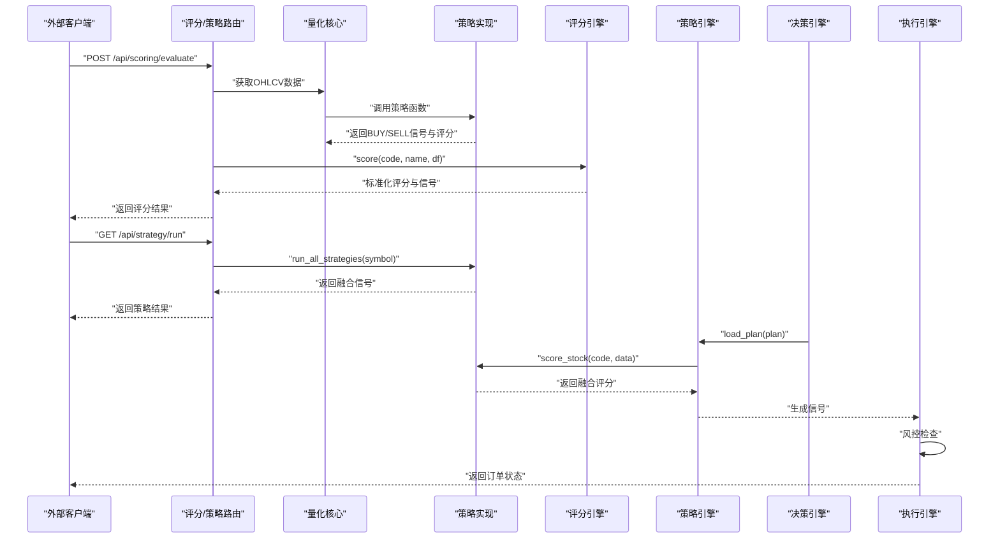
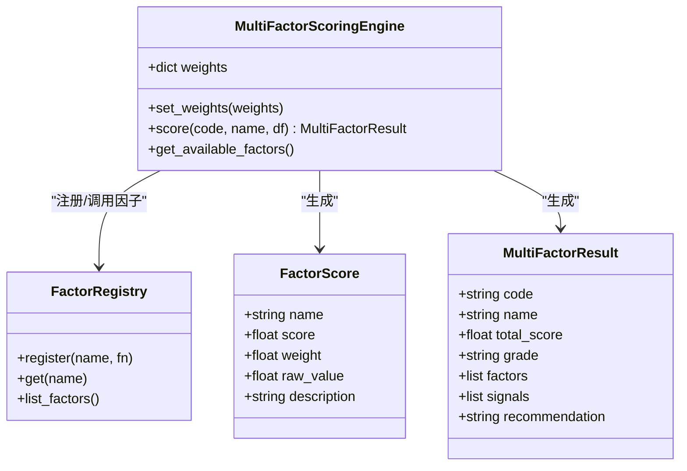
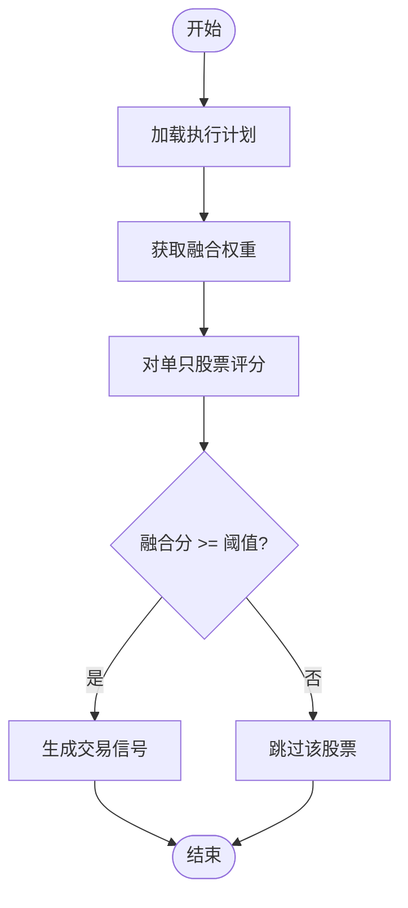
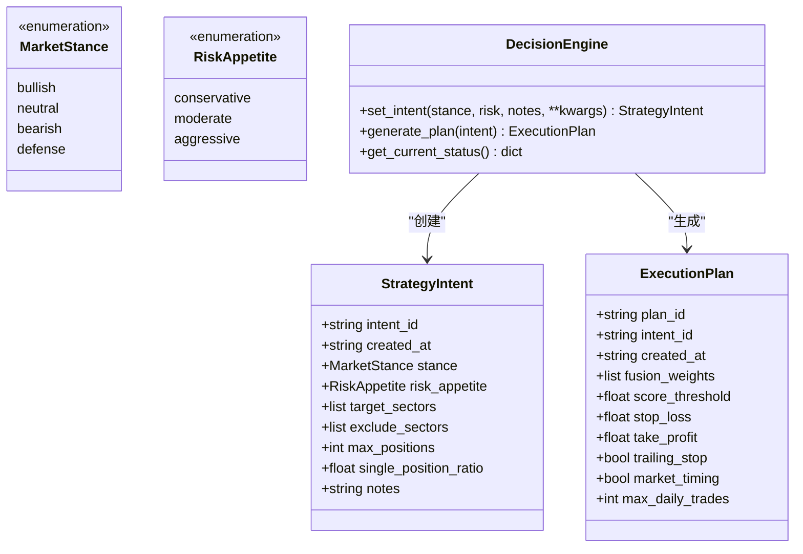
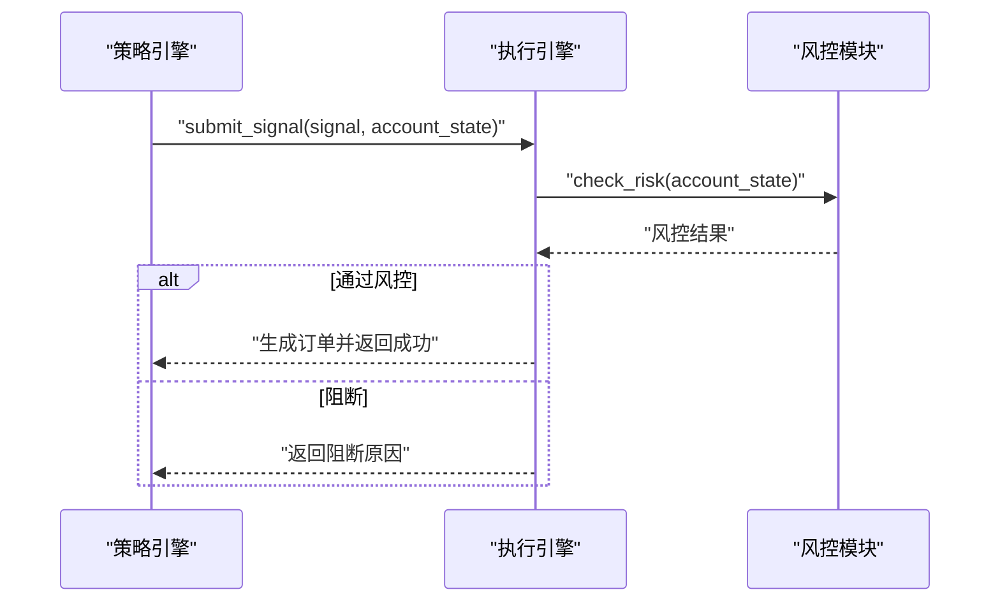
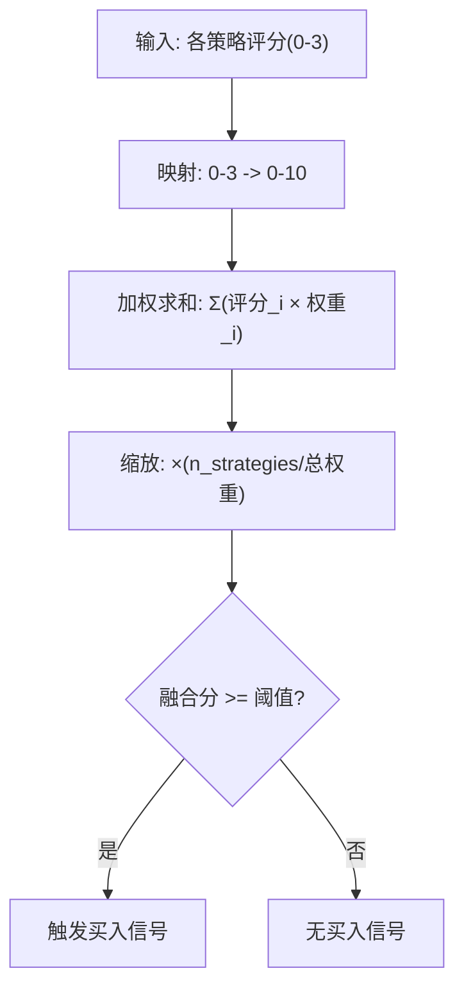
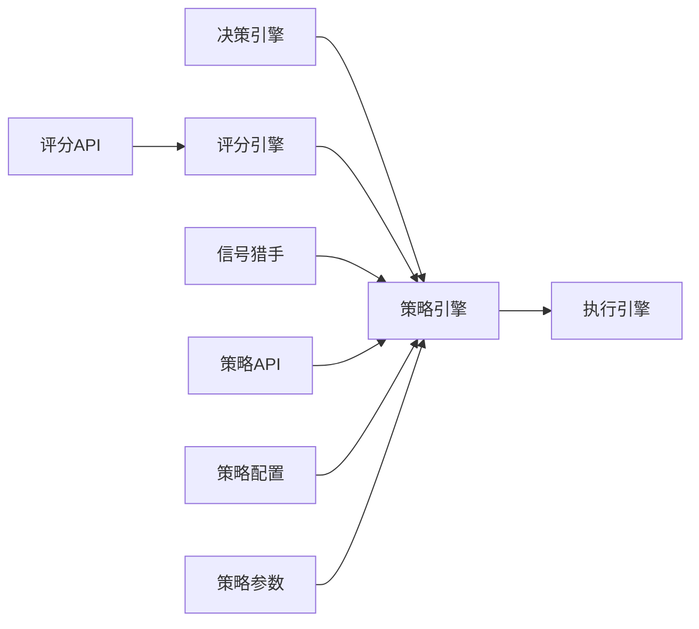

# 中书省 - 策略层

<cite>
**本文引用的文件**
- [scoring_engine.py](file://governance/chancellery/scoring_engine.py)
- [strategy_engine.py](file://governance/chancellery/strategy_engine.py)
- [decision_engine.py](file://governance/crown_prince/decision_engine.py)
- [execution_engine.py](file://governance/secretariat/execution_engine.py)
- [scoring.py](file://routes/scoring.py)
- [strategy.py](file://routes/strategy.py)
- [config.py](file://strategy/config.py)
- [strategy_params.py](file://config/strategy_params.py)
- [strategies.py](file://strategy/strategies.py)
- [quant.py](file://quant.py)
- [signal_agent.py](file://agents/signal_agent.py)
- [strategy_interface.py](file://backtest/strategy_interface.py)
- [strategy_service.py](file://services/strategy_service.py)
</cite>

## 目录
1. [简介](#简介)
2. [项目结构](#项目结构)
3. [核心组件](#核心组件)
4. [架构总览](#架构总览)
5. [详细组件分析](#详细组件分析)
6. [依赖关系分析](#依赖关系分析)
7. [性能考量](#性能考量)
8. [故障排查指南](#故障排查指南)
9. [结论](#结论)
10. [附录](#附录)

## 简介
中书省是AIQuant的“策略层”，承担两大核心职责：
- 策略评分与信号发现：通过多因子评分引擎对单只股票进行多维度评分，并输出标准化等级与推荐语；同时通过策略引擎融合多策略信号，形成交易信号。
- 与上下游协同：与太子院（决策层）对接，接收执行计划；与尚书省（执行层）协作，将信号转化为可执行的交易订单。

中书省的关键能力包括：
- 多因子评分：趋势、动量、波动率、成交量、质量五因子，输出0-100标准化评分与信号清单。
- 多策略融合：将放量突破、均线粘合、量价背离、抄底、主力建仓等策略进行加权融合，形成统一融合分（0-50）。
- 信号强度与组合优化：通过权重调节、阈值设定、止盈止损等参数，实现风险与收益的平衡。
- 与太子院的决策对接：根据市场立场与风险偏好动态生成执行计划，驱动策略参数与阈值。
- 与尚书省的风险传递：将信号交由执行引擎进行风控检查与订单生成。

## 项目结构
中书省相关模块主要分布在以下目录：
- governance/chancellery：策略评分与策略引擎
- governance/crown_prince：决策引擎（生成执行计划）
- governance/secretariat：执行引擎（风控与订单）
- routes：对外API路由（评分、策略）
- strategy：策略实现与融合
- services：策略服务（批量筛选、回测、比较）
- agents：信号猎手（全市场扫描与候选生成）
- backtest：策略接口与回测支撑
- config：策略配置与参数

**图示来源**
- [scoring_engine.py:1-370](file://governance/chancellery/scoring_engine.py#L1-L370)
- [strategy_engine.py:1-103](file://governance/chancellery/strategy_engine.py#L1-L103)
- [decision_engine.py:1-157](file://governance/crown_prince/decision_engine.py#L1-L157)
- [execution_engine.py:1-183](file://governance/secretariat/execution_engine.py#L1-L183)
- [scoring.py:1-179](file://routes/scoring.py#L1-L179)
- [strategy.py:1-87](file://routes/strategy.py#L1-L87)
- [strategies.py:1-431](file://strategy/strategies.py#L1-L431)
- [config.py:1-132](file://strategy/config.py#L1-L132)
- [strategy_params.py:1-76](file://config/strategy_params.py#L1-L76)
- [signal_agent.py:1-213](file://agents/signal_agent.py#L1-L213)
- [strategy_service.py:1-325](file://services/strategy_service.py#L1-L325)
- [quant.py:1-631](file://quant.py#L1-L631)

**章节来源**
- [scoring_engine.py:1-370](file://governance/chancellery/scoring_engine.py#L1-L370)
- [strategy_engine.py:1-103](file://governance/chancellery/strategy_engine.py#L1-L103)
- [decision_engine.py:1-157](file://governance/crown_prince/decision_engine.py#L1-L157)
- [execution_engine.py:1-183](file://governance/secretariat/execution_engine.py#L1-L183)
- [scoring.py:1-179](file://routes/scoring.py#L1-L179)
- [strategy.py:1-87](file://routes/strategy.py#L1-L87)
- [strategies.py:1-431](file://strategy/strategies.py#L1-L431)
- [config.py:1-132](file://strategy/config.py#L1-L132)
- [strategy_params.py:1-76](file://config/strategy_params.py#L1-L76)
- [signal_agent.py:1-213](file://agents/signal_agent.py#L1-L213)
- [strategy_service.py:1-325](file://services/strategy_service.py#L1-L325)
- [quant.py:1-631](file://quant.py#L1-L631)

## 核心组件
- 多因子评分引擎：对单只股票进行趋势、动量、波动率、成交量、质量五因子评分，输出标准化总分与等级、信号清单与推荐语。
- 策略引擎：融合多策略信号，依据执行计划中的权重与阈值生成交易信号。
- 决策引擎：根据市场立场与风险偏好生成执行计划，动态调整权重与阈值。
- 执行引擎：接收信号，进行风控检查，生成订单并调度执行。
- 策略实现与融合：提供五类策略函数与融合函数，统一输出BUY/SELL信号与强度评分。
- 策略配置与参数：支持YAML热加载与默认参数网格，便于策略参数调优与A/B测试。

**章节来源**
- [scoring_engine.py:246-370](file://governance/chancellery/scoring_engine.py#L246-L370)
- [strategy_engine.py:32-103](file://governance/chancellery/strategy_engine.py#L32-L103)
- [decision_engine.py:61-157](file://governance/crown_prince/decision_engine.py#L61-L157)
- [execution_engine.py:57-183](file://governance/secretariat/execution_engine.py#L57-L183)
- [strategies.py:36-431](file://strategy/strategies.py#L36-L431)
- [config.py:20-132](file://strategy/config.py#L20-L132)
- [strategy_params.py:1-76](file://config/strategy_params.py#L1-L76)

## 架构总览
中书省的策略流程从“数据输入”到“信号输出”的关键步骤如下：
- 数据获取：通过路由API或内部量化核心获取OHLCV数据。
- 多因子评分：评分引擎对单只股票进行五因子评分与标准化。
- 多策略扫描：信号猎手或策略服务对全市场进行策略扫描与融合。
- 决策对接：策略引擎读取太子院的执行计划，进行融合评分与信号生成。
- 风控与执行：执行引擎进行风控检查，生成订单并执行。

**图示来源**
- [scoring.py:30-179](file://routes/scoring.py#L30-L179)
- [strategy.py:14-87](file://routes/strategy.py#L14-L87)
- [quant.py:46-143](file://quant.py#L46-L143)
- [strategies.py:36-431](file://strategy/strategies.py#L36-L431)
- [scoring_engine.py:264-314](file://governance/chancellery/scoring_engine.py#L264-L314)
- [strategy_engine.py:39-91](file://governance/chancellery/strategy_engine.py#L39-L91)
- [decision_engine.py:87-122](file://governance/crown_prince/decision_engine.py#L87-L122)
- [execution_engine.py:64-101](file://governance/secretariat/execution_engine.py#L64-L101)

## 详细组件分析

### 多因子评分引擎
- 职责：对单只股票进行多因子评分，输出标准化评分（0-100）、等级、信号清单与推荐语。
- 因子体系：趋势、动量、波动率、成交量、质量五因子，每个因子输出0-10分与原始值、描述。
- 权重管理：支持全局权重设置与校验，权重总和需为1.0。
- 错误处理：因子计算异常时以默认分填充并记录错误信息。

**图示来源**
- [scoring_engine.py:24-370](file://governance/chancellery/scoring_engine.py#L24-L370)

**章节来源**
- [scoring_engine.py:246-370](file://governance/chancellery/scoring_engine.py#L246-L370)

### 策略引擎
- 职责：加载太子院的执行计划，执行多策略融合评分，输出交易信号。
- 融合策略：对五个子策略评分进行加权融合，权重来自执行计划或配置。
- 参数获取：支持从执行计划或配置中读取融合权重、阈值、止盈止损等参数。

**图示来源**
- [strategy_engine.py:39-91](file://governance/chancellery/strategy_engine.py#L39-L91)

**章节来源**
- [strategy_engine.py:32-103](file://governance/chancellery/strategy_engine.py#L32-L103)

### 决策引擎（太子院）
- 职责：根据市场立场与风险偏好生成执行计划，动态调整权重与阈值。
- 市场立场：看多、中性、看空、防守。
- 风险偏好：保守、稳健、激进。
- 执行计划：包含融合权重、阈值、止损止盈、移动止盈开关、择时开关、日交易次数等。

**图示来源**
- [decision_engine.py:17-157](file://governance/crown_prince/decision_engine.py#L17-L157)

**章节来源**
- [decision_engine.py:61-157](file://governance/crown_prince/decision_engine.py#L61-L157)

### 执行引擎（尚书省）
- 职责：接收交易信号，进行风控检查，生成订单并执行。
- 风控检查：基于账户状态进行风控拦截与原因记录。
- 订单状态：支持待提交、已提交、部分成交、全部成交、已撤销、已拒绝。
- 执行模式：模拟执行（立即全部成交）与实盘执行（预留接口）。

**图示来源**
- [execution_engine.py:64-101](file://governance/secretariat/execution_engine.py#L64-L101)

**章节来源**
- [execution_engine.py:57-183](file://governance/secretariat/execution_engine.py#L57-L183)

### 策略实现与融合
- 策略函数：放量突破、均线粘合、量价背离、抄底、主力建仓，均输出BUY/SELL信号与强度评分。
- 融合函数：将各策略评分映射到0-10后按权重加权，得到0-50的融合分，达到阈值触发买入。
- v4超跌反弹策略：独立策略，条件更严格，适合特定市场环境。

**图示来源**
- [strategies.py:368-431](file://strategy/strategies.py#L368-L431)

**章节来源**
- [strategies.py:36-431](file://strategy/strategies.py#L36-L431)

### 策略配置与参数
- 配置加载：支持YAML热加载，无需重启即可生效。
- 默认权重：五策略默认权重为[0.30, 0.15, 0.20, 0.20, 0.15]。
- 参数网格：提供v4参数扫描网格，便于A/B测试与参数寻优。

**章节来源**
- [config.py:20-132](file://strategy/config.py#L20-L132)
- [strategy_params.py:1-76](file://config/strategy_params.py#L1-L76)

### 信号猎手（全市场扫描）
- 职责：对全市场股票进行5策略融合与v4超跌反弹扫描，生成候选列表并保存至数据库。
- 过滤阈值：融合阈值28.0，v4阈值1.8。
- 保存策略：将候选信号保存至stock_signal表，供面板展示。

**章节来源**
- [signal_agent.py:41-213](file://agents/signal_agent.py#L41-L213)

### 策略服务与API
- 评分API：支持单股评分、批量评分、因子列表查询、权重设置与获取。
- 策略API：支持运行所有策略、全市场筛选（SSE流）、多策略并联回测、策略比较。

**章节来源**
- [scoring.py:30-179](file://routes/scoring.py#L30-L179)
- [strategy.py:14-87](file://routes/strategy.py#L14-L87)
- [strategy_service.py:46-325](file://services/strategy_service.py#L46-L325)

## 依赖关系分析
- 中书省内部耦合：策略引擎依赖决策引擎提供的执行计划；评分引擎独立于策略引擎，但两者共同产出信号。
- 与上游数据：量化核心与策略服务负责数据获取与策略计算。
- 与下游执行：执行引擎依赖风控模块进行风控检查。
- 配置与参数：策略配置与参数文件为策略层提供可热加载的参数源。

**图示来源**
- [decision_engine.py:87-122](file://governance/crown_prince/decision_engine.py#L87-L122)
- [strategy_engine.py:39-91](file://governance/chancellery/strategy_engine.py#L39-L91)
- [scoring_engine.py:264-314](file://governance/chancellery/scoring_engine.py#L264-L314)
- [execution_engine.py:64-101](file://governance/secretariat/execution_engine.py#L64-L101)
- [scoring.py:30-179](file://routes/scoring.py#L30-L179)
- [strategy.py:14-87](file://routes/strategy.py#L14-L87)
- [config.py:103-105](file://strategy/config.py#L103-L105)
- [strategy_params.py:56-62](file://config/strategy_params.py#L56-L62)

**章节来源**
- [decision_engine.py:61-157](file://governance/crown_prince/decision_engine.py#L61-L157)
- [strategy_engine.py:32-103](file://governance/chancellery/strategy_engine.py#L32-L103)
- [scoring_engine.py:246-370](file://governance/chancellery/scoring_engine.py#L246-L370)
- [execution_engine.py:57-183](file://governance/secretariat/execution_engine.py#L57-L183)
- [scoring.py:19-179](file://routes/scoring.py#L19-L179)
- [strategy.py:14-87](file://routes/strategy.py#L14-L87)
- [config.py:103-105](file://strategy/config.py#L103-L105)
- [strategy_params.py:56-62](file://config/strategy_params.py#L56-L62)

## 性能考量
- 批量评分与筛选：评分API支持批量评分与Top-N排序，减少重复计算。
- 策略扫描：信号猎手与策略服务采用分批处理与SSE流，提升用户体验与资源利用。
- 融合评分：融合函数对各策略评分进行映射与加权，复杂度线性于策略数量。
- 配置热加载：策略配置支持热加载，避免频繁重启带来的性能损耗。
- 回测与比较：策略服务提供并联回测与策略比较，便于快速评估策略表现。

[本节为通用性能讨论，不直接分析具体文件]

## 故障排查指南
- 评分失败：检查数据源是否可用、数据长度是否满足因子计算要求、权重总和是否为1.0。
- 策略扫描无命中：确认阈值设置是否合理、排除科创板与创业板过滤条件、检查策略函数输出列是否正确。
- 执行被拒：查看风控检查返回的原因，调整账户状态或风控规则。
- 配置不生效：确认YAML文件路径与命名、热加载是否正常、键名是否匹配。

**章节来源**
- [scoring.py:46-50](file://routes/scoring.py#L46-L50)
- [scoring.py:165-178](file://routes/scoring.py#L165-L178)
- [signal_agent.py:110-213](file://agents/signal_agent.py#L110-L213)
- [execution_engine.py:72-80](file://governance/secretariat/execution_engine.py#L72-L80)
- [config.py:58-72](file://strategy/config.py#L58-L72)

## 结论
中书省通过多因子评分与多策略融合，构建了从信号发现到交易执行的完整闭环。结合太子院的动态决策与尚书省的风控执行，实现了策略层的灵活性与稳健性。通过配置热加载与参数网格，中书省能够快速响应市场变化并进行A/B测试与参数优化。

[本节为总结性内容，不直接分析具体文件]

## 附录

### 策略评估指标与性能监控
- 回测指标：总收益、年化收益、最大回撤、夏普比率、胜率、总交易次数、净值曲线。
- 实时监控：信号命中数、Top候选数量、扫描进度、执行成功率与拒绝原因分布。
- 风险监控：风控拦截率、账户状态变化、订单状态分布。

**章节来源**
- [strategy_service.py:216-268](file://services/strategy_service.py#L216-L268)
- [execution_engine.py:157-163](file://governance/secretariat/execution_engine.py#L157-L163)

### 策略配置示例与参数调优指南
- 默认权重：五策略默认权重为[0.30, 0.15, 0.20, 0.20, 0.15]，可根据回测结果微调。
- v4参数网格：提供多种参数组合，便于A/B测试与参数寻优。
- 阈值设置：融合阈值建议在20-30之间，v4阈值建议在1.8左右，结合胜率与回撤进行调整。

**章节来源**
- [strategy_params.py:56-62](file://config/strategy_params.py#L56-L62)
- [quant.py:43-51](file://quant.py#L43-L51)

### 与太子院的决策对接与与尚书省的风险传递
- 决策对接：策略引擎从执行计划中读取融合权重、阈值、止盈止损等参数，驱动信号生成。
- 风险传递：执行引擎在生成订单前进行风控检查，确保交易合规与风险可控。

**章节来源**
- [strategy_engine.py:39-91](file://governance/chancellery/strategy_engine.py#L39-L91)
- [execution_engine.py:64-101](file://governance/secretariat/execution_engine.py#L64-L101)

### 策略版本管理与A/B测试
- 版本管理：策略配置采用YAML文件，支持热加载与版本控制。
- A/B测试：通过参数网格与多策略比较API，快速评估不同参数组合与策略版本的表现。

**章节来源**
- [config.py:58-72](file://strategy/config.py#L58-L72)
- [strategy_service.py:271-324](file://services/strategy_service.py#L271-L324)