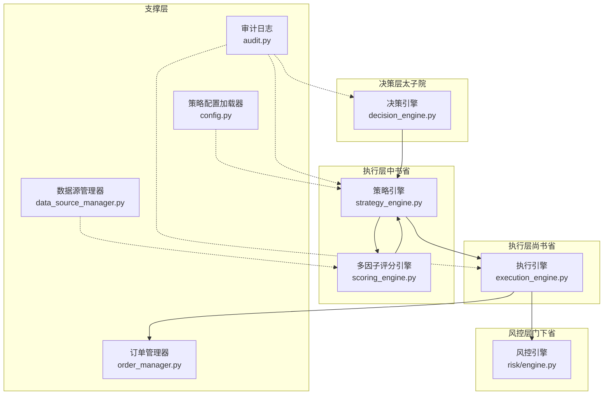
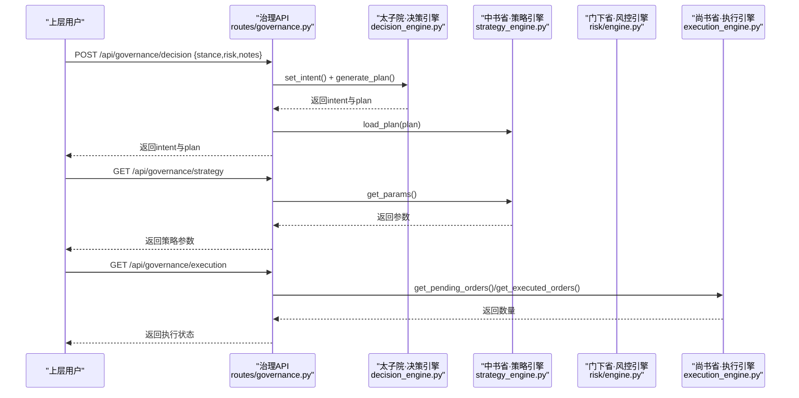
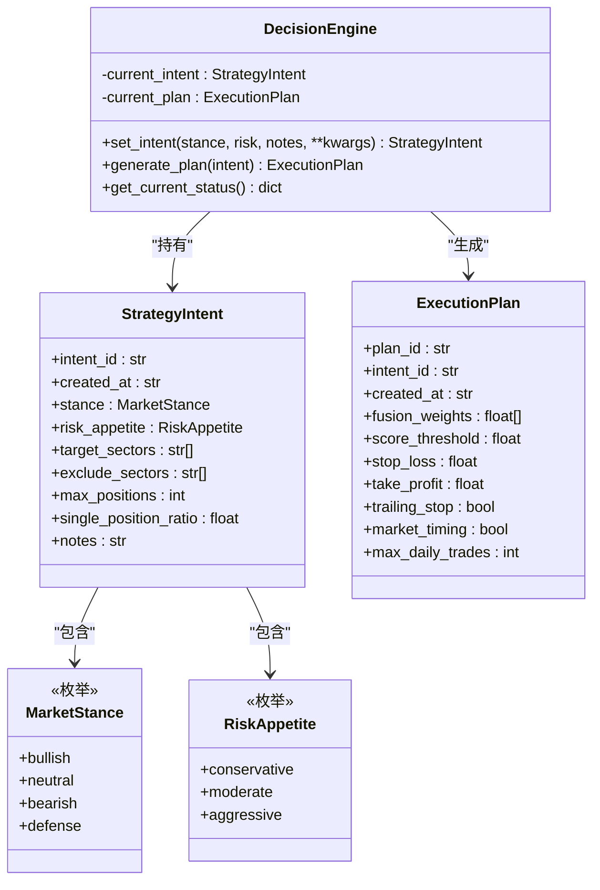
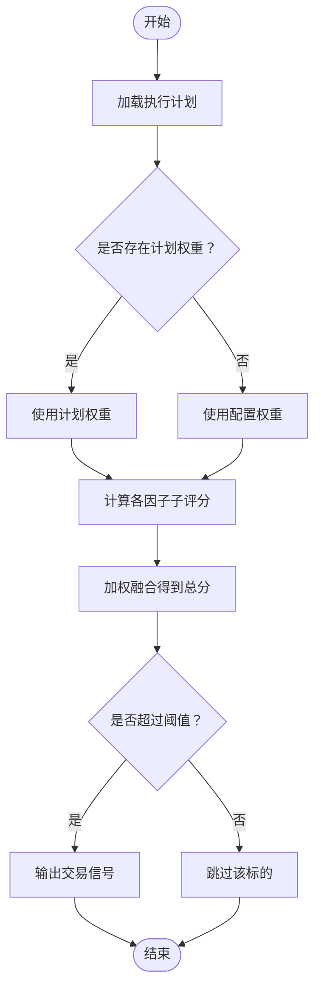
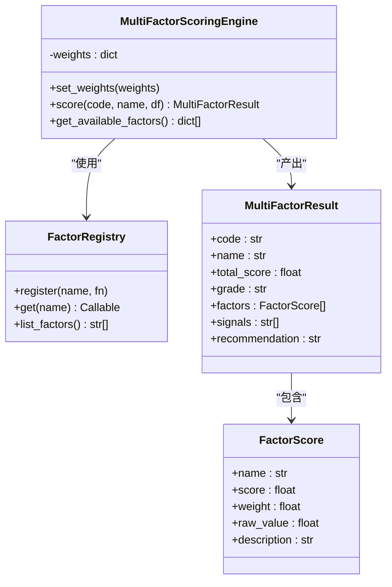
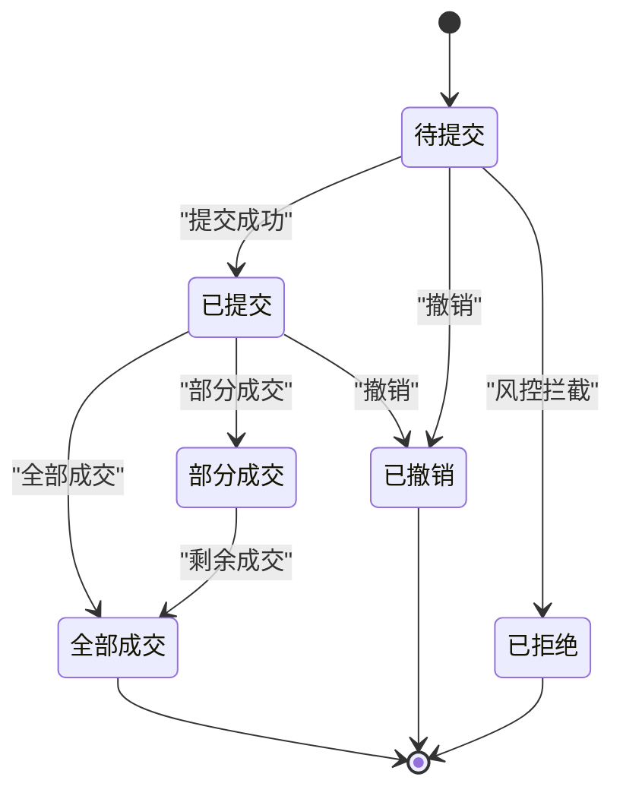
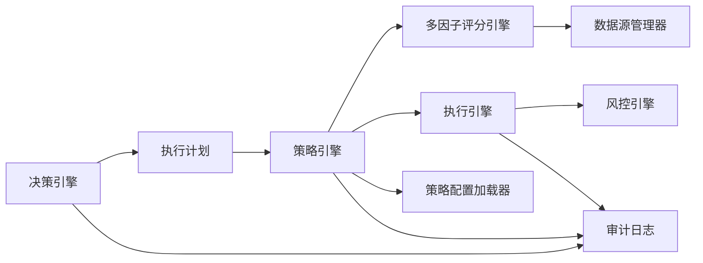
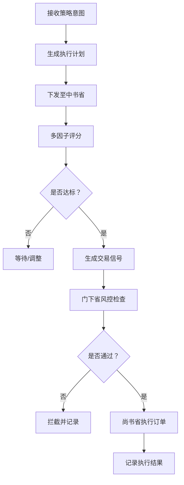

# 太子院 - 决策层

<cite>
**本文引用的文件**   
- [decision_engine.py](file://governance/crown_prince/decision_engine.py)
- [strategy_engine.py](file://governance/chancellery/strategy_engine.py)
- [scoring_engine.py](file://governance/chancellery/scoring_engine.py)
- [execution_engine.py](file://governance/secretariat/execution_engine.py)
- [parser.py](file://strategy/intent/parser.py)
- [config.py](file://strategy/config.py)
- [governance.py](file://routes/governance.py)
- [orchestrator.py](file://agents/orchestrator.py)
- [governance_mapping.py](file://agents/governance_mapping.py)
- [audit.py](file://core/audit.py)
- [engine.py](file://risk/engine.py)
- [data_source_manager.py](file://ministries/rites/data_source_manager.py)
- [order_manager.py](file://ministries/war/order_manager.py)
- [settings.py](file://config/settings.py)
</cite>

## 目录
1. [引言](#引言)
2. [项目结构](#项目结构)
3. [核心组件](#核心组件)
4. [架构总览](#架构总览)
5. [详细组件分析](#详细组件分析)
6. [依赖分析](#依赖分析)
7. [性能考虑](#性能考虑)
8. [故障排查指南](#故障排查指南)
9. [结论](#结论)
10. [附录](#附录)

## 引言
本文件面向“AIQuant”的“太子院（决策层）”角色，系统性阐述其作为最高决策机构的职责边界与工作原理，包括：
- 策略意图解析与落地
- 投资决策制定与动态调整
- 风险偏好设定与执行计划生成
- 决策算法、权重计算与优先级排序机制
- 与中书省、尚书省、门下省等省部的接口与数据流转
- 决策质量评估与审计追踪能力

目标是帮助非技术读者快速理解“太子院”的职责与运作方式，同时为技术读者提供深入的实现细节、流程图与扩展指引。

## 项目结构
围绕“三省六部制”的组织形态，AIQuant将系统划分为：
- 太子院：负责策略意图设定与执行计划生成
- 中书省：负责策略扫描、多因子评分与信号输出
- 门下省：负责风控检查与一票否决
- 尚书省：负责回测验证与报表生成
- 礼部：负责数据源管理与数据质量保障
- 兵部：负责订单生命周期与持仓管理

**图表来源**
- [decision_engine.py:61-157](file://governance/crown_prince/decision_engine.py#L61-L157)
- [strategy_engine.py:32-103](file://governance/chancellery/strategy_engine.py#L32-L103)
- [scoring_engine.py:246-370](file://governance/chancellery/scoring_engine.py#L246-L370)
- [execution_engine.py:57-183](file://governance/secretariat/execution_engine.py#L57-L183)
- [engine.py:13-168](file://risk/engine.py#L13-L168)
- [data_source_manager.py:111-190](file://ministries/rites/data_source_manager.py#L111-L190)
- [order_manager.py:69-211](file://ministries/war/order_manager.py#L69-L211)
- [config.py:20-132](file://strategy/config.py#L20-L132)
- [audit.py:16-147](file://core/audit.py#L16-L147)

**章节来源**
- [governance.py:1-151](file://routes/governance.py#L1-L151)
- [orchestrator.py:36-263](file://agents/orchestrator.py#L36-L263)
- [governance_mapping.py:31-155](file://agents/governance_mapping.py#L31-L155)

## 核心组件
- 决策引擎（太子院）
  - 职责：接收策略意图，结合市场立场与风险偏好生成执行计划，输出至中书省
  - 关键数据结构：市场立场、风险偏好、策略意图、执行计划
  - 关键方法：设置意图、生成计划、获取当前状态
- 策略引擎（中书省）
  - 职责：加载执行计划，执行多策略融合评分，输出交易信号
  - 关键方法：加载计划、评分、参数获取
- 多因子评分引擎（中书省）
  - 职责：计算趋势、动量、波动率、成交量、质量等因子得分，加权融合
  - 关键方法：设置权重、评分、因子清单
- 执行引擎（尚书省）
  - 职责：接收信号，风控检查，生成订单，调度执行
  - 关键方法：提交信号、执行订单、撤销订单、查询状态
- 风控引擎（门下省）
  - 职责：全量风控检查，记录状态与事件，支持“一票否决”
  - 关键方法：检查、保存状态与事件、查询最新状态
- 数据源管理器（礼部）
  - 职责：多数据源接入、健康检查、主备切换
  - 关键方法：注册数据源、健康检查、获取日线数据
- 订单管理器（兵部）
  - 职责：订单生命周期、持仓管理
  - 关键方法：创建/提交/成交/撤销订单，查询订单与持仓
- 策略配置加载器
  - 职责：YAML热加载，提供权重与交易参数
- 审计日志
  - 职责：统一记录操作、用户、结果与耗时，支持查询

**章节来源**
- [decision_engine.py:61-157](file://governance/crown_prince/decision_engine.py#L61-L157)
- [strategy_engine.py:32-103](file://governance/chancellery/strategy_engine.py#L32-L103)
- [scoring_engine.py:246-370](file://governance/chancellery/scoring_engine.py#L246-L370)
- [execution_engine.py:57-183](file://governance/secretariat/execution_engine.py#L57-L183)
- [engine.py:13-168](file://risk/engine.py#L13-L168)
- [data_source_manager.py:111-190](file://ministries/rites/data_source_manager.py#L111-L190)
- [order_manager.py:69-211](file://ministries/war/order_manager.py#L69-L211)
- [config.py:20-132](file://strategy/config.py#L20-L132)
- [audit.py:16-147](file://core/audit.py#L16-L147)

## 架构总览
“太子院”通过API接收上层策略指令，生成执行计划并下发至“中书省”。中书省基于计划进行多因子评分，形成信号；“尚书省”在“门下省”风控检查通过后执行订单，并将结果反馈。系统通过审计日志与配置加载器保证可追溯与可配置。

**图表来源**
- [governance.py:70-101](file://routes/governance.py#L70-L101)
- [decision_engine.py:68-122](file://governance/crown_prince/decision_engine.py#L68-L122)
- [strategy_engine.py:39-91](file://governance/chancellery/strategy_engine.py#L39-L91)
- [execution_engine.py:103-164](file://governance/secretariat/execution_engine.py#L103-L164)

## 详细组件分析

### 太子院·决策引擎
- 职责
  - 接收策略意图（市场立场、风险偏好、备注等）
  - 依据立场与偏好生成执行计划（权重、阈值、止损止盈、交易频率等）
  - 提供当前状态查询，便于API与仪表盘展示
- 关键设计
  - 使用枚举定义市场立场与风险偏好，确保输入规范化
  - 通过映射表将立场映射到不同权重组合，将风险偏好映射到阈值与风控参数
  - 默认计划兜底，避免无意图时的空转
- 数据结构
  - StrategyIntent：意图标识、时间戳、立场、偏好、行业过滤、仓位限制等
  - ExecutionPlan：计划标识、关联意图、融合权重、阈值、止损止盈、是否跟踪止损、是否择时、日交易次数等
- 方法
  - set_intent：创建并缓存当前意图
  - generate_plan：生成或返回默认计划
  - get_current_status：返回当前意图与计划

**图表来源**
- [decision_engine.py:17-157](file://governance/crown_prince/decision_engine.py#L17-L157)

**章节来源**
- [decision_engine.py:61-157](file://governance/crown_prince/decision_engine.py#L61-L157)

### 中书省·策略引擎
- 职责
  - 加载“太子院”的执行计划
  - 基于计划中的权重与阈值，对单只股票进行多因子融合评分
  - 输出交易信号（含价格、分数、止盈止损、买卖金额等）
- 关键设计
  - 评分采用加权融合，权重来源于计划或配置
  - 参数获取优先使用计划，其次使用配置文件
- 数据结构
  - Signal：信号载体，包含代码、名称、价格、分数、触发列表、止盈止损、买卖金额等
- 方法
  - load_plan：加载执行计划
  - score_stock：对单只股票进行评分
  - get_params：获取当前策略参数

**图表来源**
- [strategy_engine.py:53-91](file://governance/chancellery/strategy_engine.py#L53-L91)

**章节来源**
- [strategy_engine.py:32-103](file://governance/chancellery/strategy_engine.py#L32-L103)

### 中书省·多因子评分引擎
- 职责
  - 计算趋势、动量、波动率、成交量、质量等因子得分
  - 支持权重注册与自定义因子扩展
  - 输出标准化评分与等级、建议
- 关键设计
  - 因子注册表支持动态扩展
  - 默认权重集合可被策略配置覆盖
  - 评分过程包含异常保护，避免单因子异常导致整体崩溃
- 方法
  - set_weights：设置因子权重
  - score：对单只股票进行评分
  - get_available_factors：列出可用因子及其描述
- 因子说明
  - 趋势：均线多头排列与价格相对位置
  - 动量：RSI与价格变化率
  - 波动率：ATR与布林带宽度
  - 成交量：量比与价量配合
  - 质量：趋势稳定性与收益风险比

**图表来源**
- [scoring_engine.py:46-370](file://governance/chancellery/scoring_engine.py#L46-L370)

**章节来源**
- [scoring_engine.py:246-370](file://governance/chancellery/scoring_engine.py#L246-L370)

### 尚书省·执行引擎
- 职责
  - 接收交易信号，进行风控检查
  - 生成订单并调度执行（模拟/实盘预留）
  - 记录执行结果，支持撤销与查询
- 关键设计
  - 订单状态机：待提交、已提交、部分成交、全部成交、已撤销、已拒绝
  - 风控拦截即“一票否决”，阻止后续流程
- 方法
  - submit_signal：提交信号并生成订单
  - execute_order：执行订单（模拟/实盘）
  - cancel_order：撤销订单
  - get_pending_orders/get_executed_orders：查询状态

**图表来源**
- [execution_engine.py:22-171](file://governance/secretariat/execution_engine.py#L22-L171)

**章节来源**
- [execution_engine.py:57-183](file://governance/secretariat/execution_engine.py#L57-L183)

### 门下省·风控引擎
- 职责
  - 对账户状态进行全量风控检查
  - 记录风险事件与当前状态，支持“一票否决”
- 关键设计
  - 规则集合统一执行，取最严格等级
  - 结果持久化，便于审计与查询
- 方法
  - check：执行检查并返回等级与明细
  - check_and_record：记录到数据库
  - get_latest_status/get_recent_events：查询状态与事件

**章节来源**
- [engine.py:13-168](file://risk/engine.py#L13-L168)

### 策略意图解析器
- 职责
  - 将自然语言策略描述解析为结构化条件配置
  - 支持常见策略模式识别与参数抽取
- 关键设计
  - 正则模式匹配策略类型与参数
  - 构建条件列表与解释文本
  - 置信度计算用于质量评估
- 方法
  - parse：解析并返回结构化意图
  - _detect_intent_type/_extract_params/_build_conditions：内部解析流程

**章节来源**
- [parser.py:34-298](file://strategy/intent/parser.py#L34-L298)

### 策略配置加载器
- 职责
  - YAML热加载，支持权重、交易参数、回测参数等
  - 提供统一的键路径访问与策略开关
- 方法
  - get/get_strategy/is_strategy_enabled/get_strategy_params/get_fusion_weights：读取配置

**章节来源**
- [config.py:20-132](file://strategy/config.py#L20-L132)

### 审计日志系统
- 职责
  - 统一记录操作、用户、结果与耗时
  - 支持查询与统计
- 方法
  - log_audit：记录审计日志
  - audit_log：装饰器自动记录API调用
  - get_audit_logs：查询日志

**章节来源**
- [audit.py:16-147](file://core/audit.py#L16-L147)

## 依赖分析
- 组件耦合
  - 太子院与中书省：通过执行计划解耦，降低耦合度
  - 中书省与门下省：风控检查作为关键依赖点，实现“一票否决”
  - 中书省与尚书省：信号驱动执行，执行引擎依赖风控结果
  - 数据与配置：评分引擎依赖数据源管理器与策略配置加载器
- 外部依赖
  - 数据源：本地数据库、第三方数据源（akshare/tushare等）
  - 风控：规则集与状态存储
  - 审计：数据库持久化

**图表来源**
- [decision_engine.py:87-122](file://governance/crown_prince/decision_engine.py#L87-L122)
- [strategy_engine.py:39-91](file://governance/chancellery/strategy_engine.py#L39-L91)
- [scoring_engine.py:264-314](file://governance/chancellery/scoring_engine.py#L264-L314)
- [execution_engine.py:64-101](file://governance/secretariat/execution_engine.py#L64-L101)
- [engine.py:19-72](file://risk/engine.py#L19-L72)
- [data_source_manager.py:153-177](file://ministries/rites/data_source_manager.py#L153-L177)
- [config.py:73-128](file://strategy/config.py#L73-L128)
- [audit.py:16-92](file://core/audit.py#L16-L92)

**章节来源**
- [orchestrator.py:36-263](file://agents/orchestrator.py#L36-L263)
- [governance_mapping.py:31-155](file://agents/governance_mapping.py#L31-L155)

## 性能考虑
- 评分复杂度
  - 多因子评分对每只股票进行线性扫描，时间复杂度与因子数量和数据长度线性相关
  - 建议：合理设置因子权重与阈值，控制扫描范围（行业过滤、时间窗口）
- 并行执行
  - 回测与风控可并行执行，缩短端到端时延
- 热加载配置
  - 策略配置热加载避免重启，提升运维效率
- 数据源切换
  - 主备切换与健康检查减少数据不可用带来的阻塞

[本节为通用指导，无需特定文件引用]

## 故障排查指南
- 决策层无计划
  - 现象：策略引擎参数为空或默认值
  - 排查：确认是否已调用设置意图并生成计划；检查API返回
- 信号未产生
  - 现象：评分未达阈值
  - 排查：调整阈值或权重；检查因子计算是否异常
- 执行被拦截
  - 现象：订单未提交
  - 排查：查看风控状态与事件记录；调整账户状态或风控规则
- 数据不可用
  - 现象：评分失败或空数据
  - 排查：检查数据源健康状态与主备切换
- 审计日志缺失
  - 现象：无法追踪操作
  - 排查：确认审计装饰器使用与数据库连接

**章节来源**
- [governance.py:25-57](file://routes/governance.py#L25-L57)
- [engine.py:51-72](file://risk/engine.py#L51-L72)
- [data_source_manager.py:136-177](file://ministries/rites/data_source_manager.py#L136-L177)
- [audit.py:16-92](file://core/audit.py#L16-L92)

## 结论
“太子院（决策层）”以“策略意图—执行计划—信号—执行”的闭环为核心，通过清晰的职责划分与强约束的风控机制，确保策略在不同市场环境下稳健落地。配合中书省的多因子评分与尚书省的执行调度，以及门下省的“一票否决”，形成了高可靠、可追溯、可扩展的智能交易决策体系。

[本节为总结性内容，无需特定文件引用]

## 附录

### 决策流程图（概念）

[本图为概念流程，无需图表来源]

### 配置示例与扩展方法
- 执行计划权重与阈值
  - 通过“太子院”的生成逻辑映射不同市场立场与风险偏好
  - 可在策略配置中预设权重集，供默认计划或策略回测使用
- 因子扩展
  - 在多因子评分引擎中注册新因子，设置权重并纳入融合
- 风控规则扩展
  - 在风控引擎规则集中新增规则，实现更细粒度的风险控制
- 审计与监控
  - 使用审计日志装饰器记录关键操作；通过治理API查询系统状态

**章节来源**
- [decision_engine.py:94-122](file://governance/crown_prince/decision_engine.py#L94-L122)
- [scoring_engine.py:237-242](file://governance/chancellery/scoring_engine.py#L237-L242)
- [engine.py:19-49](file://risk/engine.py#L19-L49)
- [audit.py:41-92](file://core/audit.py#L41-L92)
- [config.py:103-105](file://strategy/config.py#L103-L105)