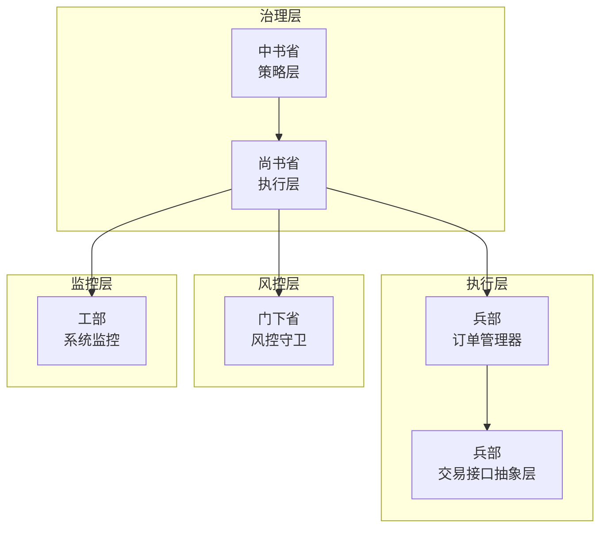
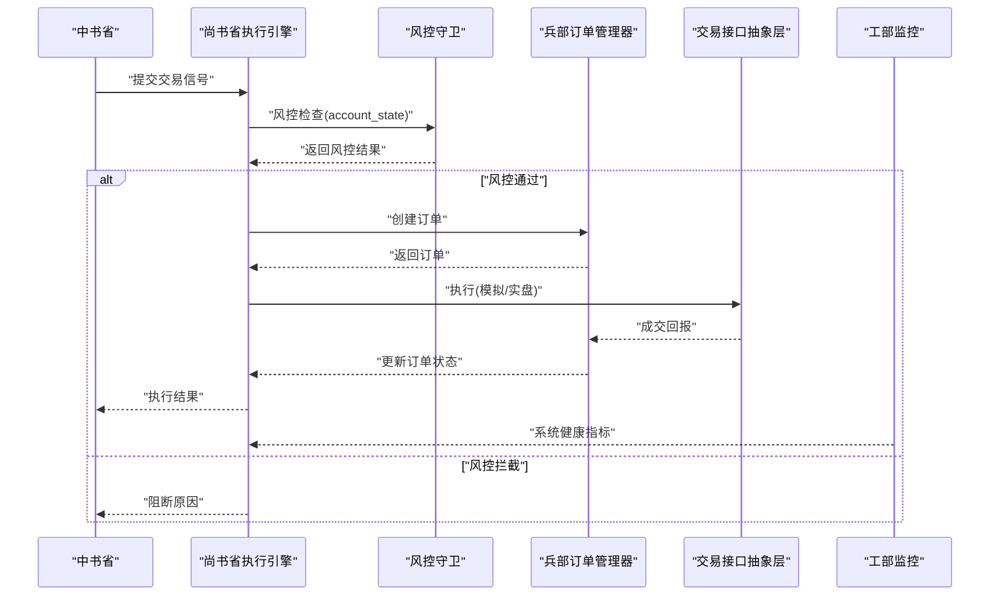
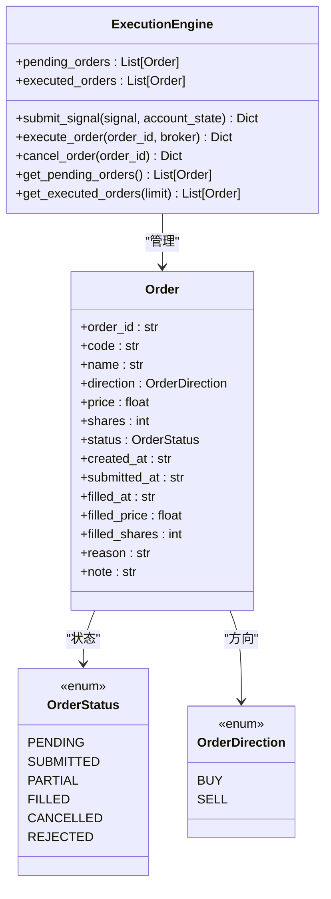
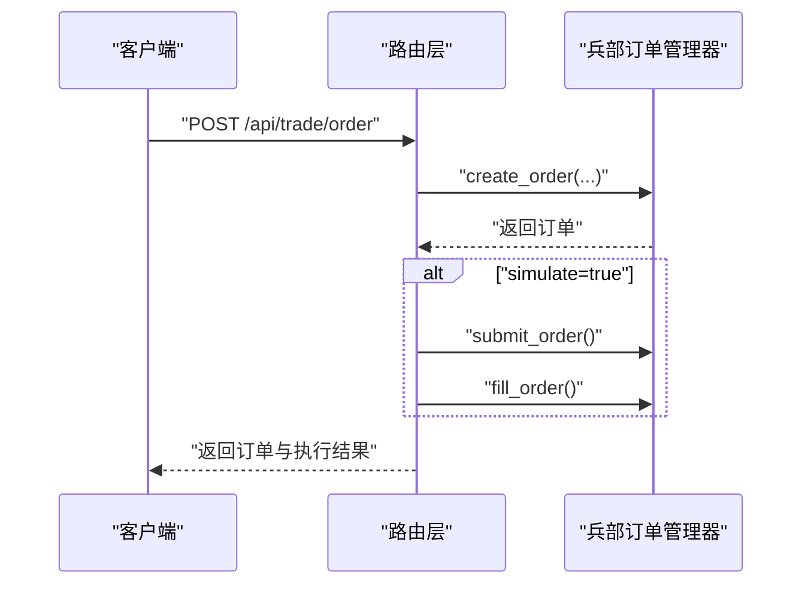
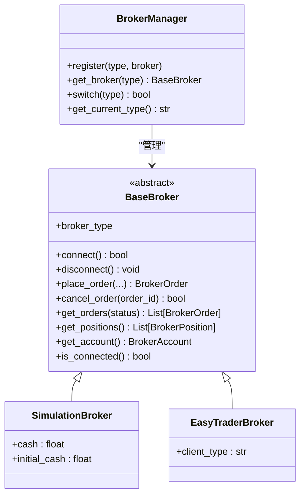
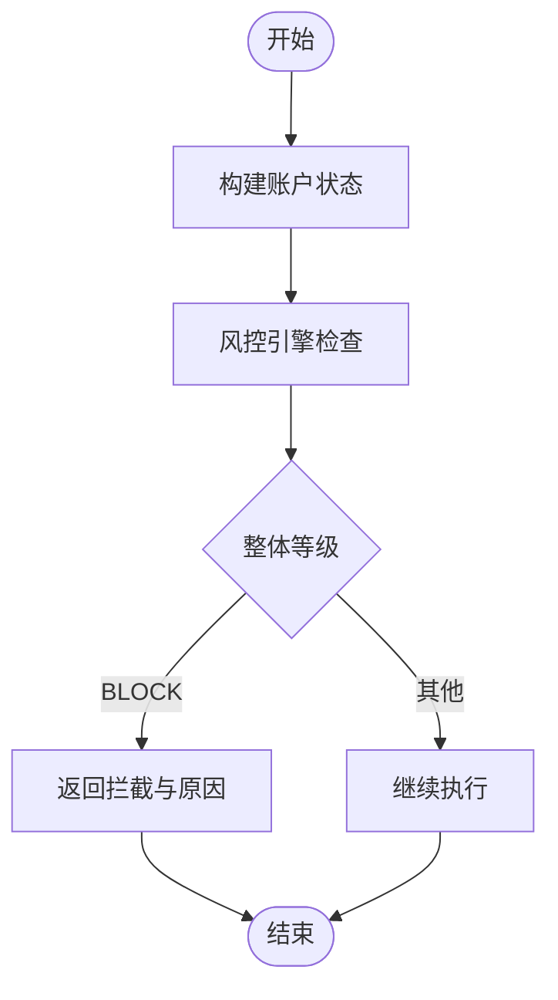
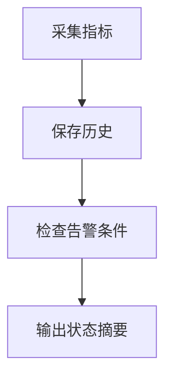
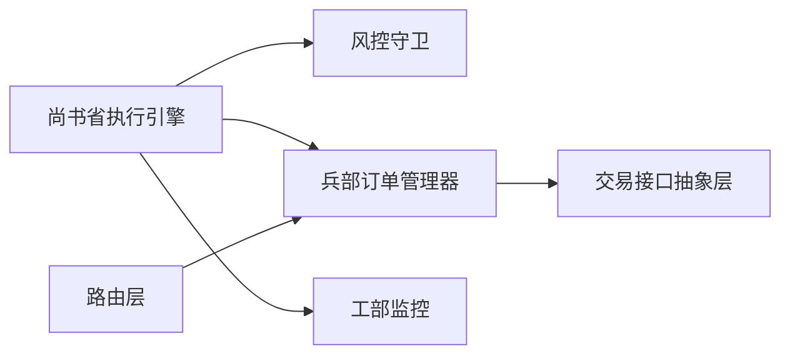

# 尚书省 - 执行层

<cite>
**本文引用的文件**
- [governance/secretariat/execution_engine.py](file://governance/secretariat/execution_engine.py)
- [governance/secretariat/__init__.py](file://governance/secretariat/__init__.py)
- [routes/trade_execution.py](file://routes/trade_execution.py)
- [ministries/war/order_manager.py](file://ministries/war/order_manager.py)
- [ministries/war/broker_adapter.py](file://ministries/war/broker_adapter.py)
- [risk/guard.py](file://risk/guard.py)
- [risk/models.py](file://risk/models.py)
- [ministries/works/monitor.py](file://ministries/works/monitor.py)
- [config/strategy_params.py](file://config/strategy_params.py)
- [strategy/config.py](file://strategy/config.py)
- [routes/intent.py](file://routes/intent.py)
</cite>

## 目录
1. [引言](#引言)
2. [项目结构](#项目结构)
3. [核心组件](#核心组件)
4. [架构总览](#架构总览)
5. [详细组件分析](#详细组件分析)
6. [依赖分析](#依赖分析)
7. [性能考虑](#性能考虑)
8. [故障排查指南](#故障排查指南)
9. [结论](#结论)
10. [附录](#附录)

## 引言
本文件面向“尚书省（执行层）”的实现与使用，系统性阐述其在AIQuant中的职责边界、执行引擎工作原理、订单生命周期管理、与兵部（交易执行）的数据对接、与各部（风控、工部等）的协调机制，以及执行质量评估、延迟监控与成本分析方法。同时提供策略配置与参数优化建议、故障处理与重试机制的实现要点，帮助读者快速理解并高效运维该执行层。

## 项目结构
尚书省位于治理层（governance）之下，承担接收信号、风控校验、订单生成与执行调度的职责；与之协作的兵部负责订单全生命周期与持仓管理，风控模块提供运行时风控守卫，工部提供系统监控能力。策略层（中书省）产出交易信号，经尚书省进入执行链路。

图表来源
- [governance/secretariat/execution_engine.py:1-183](file://governance/secretariat/execution_engine.py#L1-L183)
- [ministries/war/order_manager.py:1-211](file://ministries/war/order_manager.py#L1-L211)
- [ministries/war/broker_adapter.py:1-413](file://ministries/war/broker_adapter.py#L1-L413)
- [risk/guard.py:1-92](file://risk/guard.py#L1-L92)
- [ministries/works/monitor.py:1-114](file://ministries/works/monitor.py#L1-L114)

章节来源
- [governance/secretariat/__init__.py:1-11](file://governance/secretariat/__init__.py#L1-L11)

## 核心组件
- 尚书省执行引擎：负责接收交易信号、风控检查、订单生成、执行调度（模拟/实盘）、订单状态维护与查询。
- 兵部订单管理器：负责订单全生命周期（创建、提交、成交、撤销）、持仓管理与价格更新。
- 交易接口抽象层：统一下单/撤单/查询接口，支持模拟与实盘适配器。
- 风控守卫：对账户状态进行实时风控检查，决定是否允许执行。
- 系统监控：采集CPU/内存/磁盘/数据库大小等指标，提供健康检查与告警。
- 策略配置：提供策略参数与融合权重的集中管理与热加载能力。

章节来源
- [governance/secretariat/execution_engine.py:57-183](file://governance/secretariat/execution_engine.py#L57-L183)
- [ministries/war/order_manager.py:69-211](file://ministries/war/order_manager.py#L69-L211)
- [ministries/war/broker_adapter.py:84-413](file://ministries/war/broker_adapter.py#L84-L413)
- [risk/guard.py:36-92](file://risk/guard.py#L36-L92)
- [ministries/works/monitor.py:29-114](file://ministries/works/monitor.py#L29-L114)
- [strategy/config.py:20-132](file://strategy/config.py#L20-L132)

## 架构总览
尚书省执行引擎作为“执行调度中枢”，在收到中书省的交易信号后，首先通过风控守卫进行账户状态检查；通过后生成内部订单并进入待执行队列；随后由路由层或业务流程触发执行，执行分为模拟成交与实盘成交两种路径；成交后更新订单状态并联动兵部完成持仓管理；工部监控模块持续采集系统指标，保障执行层稳定运行。

图表来源
- [governance/secretariat/execution_engine.py:64-101](file://governance/secretariat/execution_engine.py#L64-L101)
- [risk/guard.py:77-92](file://risk/guard.py#L77-L92)
- [ministries/war/order_manager.py:76-126](file://ministries/war/order_manager.py#L76-L126)
- [ministries/war/broker_adapter.py:134-250](file://ministries/war/broker_adapter.py#L134-L250)
- [ministries/works/monitor.py:36-101](file://ministries/works/monitor.py#L36-L101)

## 详细组件分析

### 尚书省执行引擎（ExecutionEngine）
- 职责与边界
  - 接收交易信号，进行风控检查，生成内部订单并入队。
  - 支持模拟执行（立即全部成交）与实盘执行（预留接口）。
  - 提供订单查询、撤销、状态统计等能力。
- 关键数据结构
  - 订单状态枚举：PENDING/SUBMITTED/PARTIAL/FILLED/CANCELLED/REJECTED。
  - 订单方向枚举：BUY/SELL。
  - 订单实体：包含订单ID、标的、方向、价格、数量、状态、时间戳、成交信息等。
- 核心流程
  - 提交信号：风控检查通过后生成订单并加入待执行队列。
  - 执行订单：根据broker类型选择模拟或实盘执行，更新状态并迁移至已执行队列。
  - 撤销订单：仅对未成交订单生效。
  - 查询接口：提供待执行与已执行订单列表。
- 并发与一致性
  - 当前实现为内存队列，适合单进程场景；如需分布式部署，建议引入消息队列与持久化存储。

图表来源
- [governance/secretariat/execution_engine.py:22-183](file://governance/secretariat/execution_engine.py#L22-L183)

章节来源
- [governance/secretariat/execution_engine.py:57-183](file://governance/secretariat/execution_engine.py#L57-L183)

### 订单生命周期与交易调度（路由层）
- 路由层提供对外API，封装兵部订单管理器的订单创建、提交、成交、撤销、查询等功能，并支持模拟成交用于测试。
- 关键接口
  - 创建订单：校验参数，创建订单，可选模拟成交。
  - 订单列表：按状态与限制查询。
  - 撤销订单：仅对未成交订单有效。
  - 持仓列表：获取持有仓位并动态更新当前价格。
  - 账户概览：汇总资产、持仓、费用等。
  - 手动模拟成交：便于测试与调试。
- 与兵部协作
  - 路由层直接依赖兵部的订单管理器，统一暴露REST接口，屏蔽底层实现细节。

图表来源
- [routes/trade_execution.py:23-58](file://routes/trade_execution.py#L23-L58)
- [ministries/war/order_manager.py:76-126](file://ministries/war/order_manager.py#L76-L126)

章节来源
- [routes/trade_execution.py:1-217](file://routes/trade_execution.py#L1-L217)
- [ministries/war/order_manager.py:69-211](file://ministries/war/order_manager.py#L69-L211)

### 交易接口抽象层（Broker Adapter）
- 设计目标
  - 统一下单、撤单、查询、资金与持仓查询接口，支持模拟与实盘切换。
  - 通过抽象基类约束实现，便于扩展不同券商适配器。
- 关键抽象
  - BaseBroker：定义连接、下单、撤单、查询、账户查询等接口。
  - SimulationBroker：内置模拟交易实现，支持资金检查、即时成交与持仓更新。
  - EasyTraderBroker：预留实盘适配器（需安装第三方库）。
  - BrokerManager：统一注册与切换交易接口。
- 使用建议
  - 开发阶段使用模拟交易，上线前完成实盘适配器联调与压力测试。

图表来源
- [ministries/war/broker_adapter.py:84-413](file://ministries/war/broker_adapter.py#L84-L413)

章节来源
- [ministries/war/broker_adapter.py:1-413](file://ministries/war/broker_adapter.py#L1-L413)

### 风控守卫与账户状态
- 风控守卫
  - 提供装饰器与直接调用两种方式，对账户状态进行风控检查。
  - 返回整体等级与明细，支持拦截级直接阻断。
- 账户状态构建
  - 从各模块聚合关键指标（如最大回撤、持仓数量、总敞口、可用资金等）形成风控输入。
- 风控等级
  - PASS/WARNING/RESTRICT/BLOCK，分别对应放行、警告、限制与拦截。

图表来源
- [risk/guard.py:15-92](file://risk/guard.py#L15-L92)
- [risk/models.py:11-78](file://risk/models.py#L11-L78)

章节来源
- [risk/guard.py:1-92](file://risk/guard.py#L1-L92)
- [risk/models.py:1-78](file://risk/models.py#L1-L78)

### 系统监控与健康检查
- 监控内容
  - CPU/内存/磁盘使用率、数据库大小、活动连接数、待执行订单数、1小时内错误计数。
- 告警策略
  - CPU>80%、内存>85%、磁盘>90%触发告警。
- 状态摘要
  - 基于最新指标判断系统健康状态并输出摘要。

图表来源
- [ministries/works/monitor.py:36-101](file://ministries/works/monitor.py#L36-L101)

章节来源
- [ministries/works/monitor.py:1-114](file://ministries/works/monitor.py#L1-L114)

### 策略配置与参数优化
- 配置来源
  - 策略配置采用YAML热加载，支持运行时调整，无需重启服务。
  - 提供默认权重与参数网格，便于策略融合与参数扫描。
- 关键能力
  - 获取融合权重、策略参数、交易参数（止损止盈等）。
  - 支持启用/禁用策略与导出完整配置字典。
- 优化建议
  - 结合回测结果与实盘表现，动态调整融合权重与阈值。
  - 使用参数网格进行系统性扫描，定位最优参数组合。

章节来源
- [strategy/config.py:20-132](file://strategy/config.py#L20-L132)
- [config/strategy_params.py:1-76](file://config/strategy_params.py#L1-L76)

## 依赖分析
- 组件耦合
  - 尚书省执行引擎依赖风控守卫与订单管理器；路由层依赖订单管理器；交易接口抽象层被路由层间接使用。
- 外部依赖
  - 交易接口抽象层预留实盘适配器依赖第三方库；监控模块依赖系统资源采集库。
- 循环依赖
  - 当前实现未见循环依赖，建议后续扩展仍保持单向依赖。

图表来源
- [governance/secretariat/execution_engine.py:18-20](file://governance/secretariat/execution_engine.py#L18-L20)
- [routes/trade_execution.py:16-21](file://routes/trade_execution.py#L16-L21)
- [ministries/war/order_manager.py:1-14](file://ministries/war/order_manager.py#L1-L14)
- [ministries/war/broker_adapter.py:15-27](file://ministries/war/broker_adapter.py#L15-L27)
- [ministries/works/monitor.py:10-13](file://ministries/works/monitor.py#L10-L13)

## 性能考虑
- 执行路径优化
  - 模拟执行路径短平快，适合高频测试与压测；实盘路径需关注网络延迟与接口响应时间。
- 队列与并发
  - 当前为内存队列，建议在高并发场景引入消息队列与异步执行，避免阻塞主线程。
- 监控与告警
  - 建议将系统指标接入统一监控平台，设置阈值告警与自动扩容策略。
- 成本控制
  - 通过模拟交易验证策略与参数，降低实盘试错成本；合理设置止损止盈与仓位比例，控制最大回撤。

## 故障排查指南
- 常见问题
  - 订单不存在：检查订单ID与状态，确认是否已被撤销或成交。
  - 风控拦截：检查账户状态字段（最大回撤、持仓数量、可用资金等），调整策略参数或风控阈值。
  - 实盘未接入：确认交易接口类型与适配器是否正确注册与切换。
- 诊断步骤
  - 查看路由层返回的错误信息与状态码。
  - 检查订单管理器中的订单状态流转。
  - 采集系统监控指标，定位资源瓶颈。
- 重试机制
  - 对于临时性异常（网络抖动），可在路由层或业务层增加指数退避重试；对永久性错误（参数非法、风控拦截）应快速失败并记录日志。

章节来源
- [routes/trade_execution.py:35-43](file://routes/trade_execution.py#L35-L43)
- [governance/secretariat/execution_engine.py:143-155](file://governance/secretariat/execution_engine.py#L143-L155)
- [ministries/war/order_manager.py:127-133](file://ministries/war/order_manager.py#L127-L133)
- [risk/guard.py:77-92](file://risk/guard.py#L77-L92)

## 结论
尚书省执行层以“信号-风控-订单-执行-监控”为主线，构建了清晰的执行调度闭环。通过路由层与兵部的紧密协作，实现了订单生命周期的全栈管理；通过风控守卫与系统监控，保障了执行安全与系统稳定。结合策略配置的热加载与参数网格扫描，可实现策略的持续优化与迭代。

## 附录
- 执行质量评估
  - 指标：胜率、盈亏比、最大回撤、年化收益、夏普比率等；建议在回测与实盘并行评估。
- 延迟监控
  - 记录从信号到达至成交完成的端到端耗时，区分模拟与实盘路径。
- 成本分析
  - 统计佣金、滑点、机会成本等，结合参数优化降低总体成本。