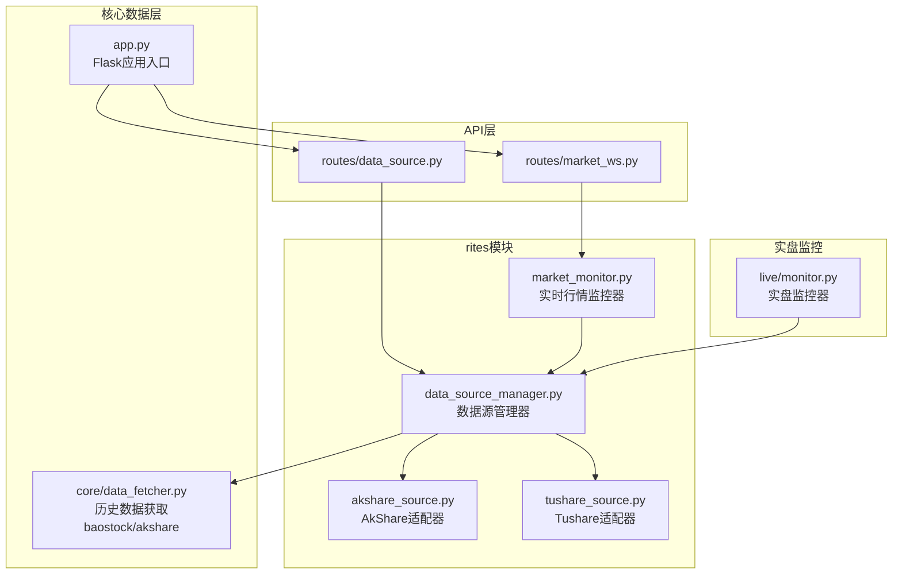
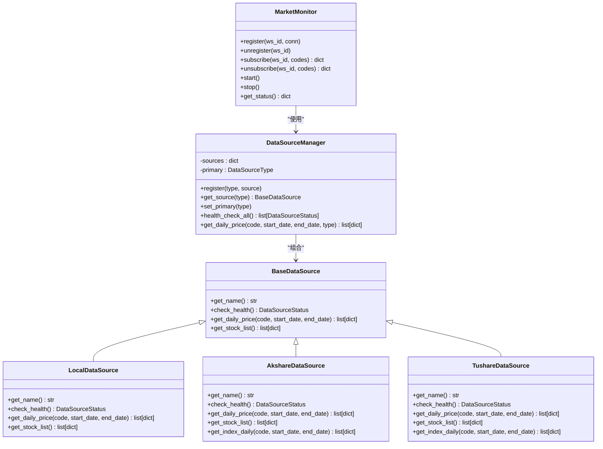
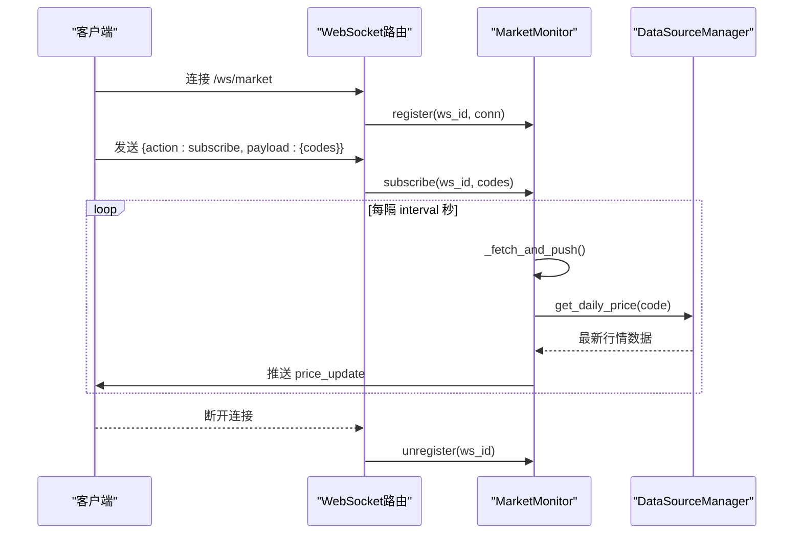
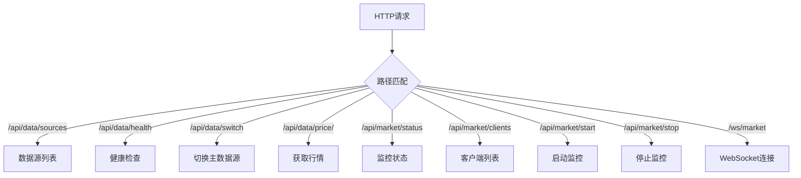
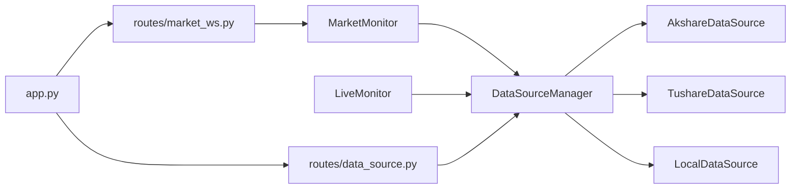

# rites（礼仪服务）

<cite>
**本文引用的文件列表**
- [ministries/rites/__init__.py](file://ministries/rites/__init__.py)
- [ministries/rites/data_source_manager.py](file://ministries/rites/data_source_manager.py)
- [ministries/rites/akshare_source.py](file://ministries/rites/akshare_source.py)
- [ministries/rites/tushare_source.py](file://ministries/rites/tushare_source.py)
- [ministries/rites/market_monitor.py](file://ministries/rites/market_monitor.py)
- [routes/data_source.py](file://routes/data_source.py)
- [routes/market_ws.py](file://routes/market_ws.py)
- [app.py](file://app.py)
- [core/data_fetcher.py](file://core/data_fetcher.py)
- [live/monitor.py](file://live/monitor.py)
- [config/settings.py](file://config/settings.py)
- [tests/test_data_source.py](file://tests/test_data_source.py)
</cite>

## 目录
1. [简介](#简介)
2. [项目结构](#项目结构)
3. [核心组件](#核心组件)
4. [架构总览](#架构总览)
5. [详细组件分析](#详细组件分析)
6. [依赖关系分析](#依赖关系分析)
7. [性能考量](#性能考量)
8. [故障排查指南](#故障排查指南)
9. [结论](#结论)
10. [附录](#附录)

## 简介
rites（礼仪服务）模块是AIQuant量化系统中的“数据服务中枢”，负责多数据源接入与管理、数据质量监控、数据标准化与缓存、以及实时行情监控与推送。其核心目标是在保证数据可用性与一致性的前提下，为系统其他子模块提供稳定、可切换、可扩展的数据服务能力，并支撑实时行情监控与告警体系。

本模块的关键职责包括：
- 多数据源接入与管理：支持本地数据库、AkShare、Tushare、Baostock、YFinance等数据源，具备主备切换与健康检查能力。
- 数据清洗与标准化：统一不同来源的数据字段与时间格式，输出一致化的行情数据。
- 数据质量监控：对各数据源进行可用性、延迟与质量评估。
- 实时行情监控与推送：通过WebSocket向订阅者推送增量行情，支持批量拉取与订阅管理。
- 与数据采集、实时行情、数据质量的数据流协同：为回测引擎、信号生成、风控与实盘执行提供高质量数据基础。

## 项目结构
rites模块位于ministries/rites目录，配合routes层的HTTP/WebSocket路由，以及core层的底层数据获取逻辑，形成从API到数据源再到实时监控的完整链路。



图表来源
- [routes/data_source.py:1-112](file://routes/data_source.py#L1-L112)
- [routes/market_ws.py:1-142](file://routes/market_ws.py#L1-L142)
- [ministries/rites/data_source_manager.py:111-190](file://ministries/rites/data_source_manager.py#L111-L190)
- [ministries/rites/akshare_source.py:15-135](file://ministries/rites/akshare_source.py#L15-L135)
- [ministries/rites/tushare_source.py:16-167](file://ministries/rites/tushare_source.py#L16-L167)
- [ministries/rites/market_monitor.py:21-244](file://ministries/rites/market_monitor.py#L21-L244)
- [core/data_fetcher.py:1-578](file://core/data_fetcher.py#L1-L578)
- [app.py:148-164](file://app.py#L148-L164)
- [live/monitor.py:55-286](file://live/monitor.py#L55-L286)

章节来源
- [ministries/rites/__init__.py:1-10](file://ministries/rites/__init__.py#L1-L10)
- [routes/data_source.py:1-112](file://routes/data_source.py#L1-L112)
- [routes/market_ws.py:1-142](file://routes/market_ws.py#L1-L142)
- [app.py:148-164](file://app.py#L148-L164)

## 核心组件
- 数据源管理器：统一注册、健康检查、主备切换与数据获取，支持多种数据源类型。
- AkShare/Tushare适配器：封装第三方数据源接口，完成数据标准化与错误处理。
- 实时行情监控器：维护WebSocket连接、订阅管理、定时拉取与推送。
- API路由：对外暴露数据源管理、健康检查、主数据源切换、行情查询与WebSocket接入。
- 应用入口：注册蓝图、启动监控服务、提供健康检查与静态页面。

章节来源
- [ministries/rites/data_source_manager.py:111-190](file://ministries/rites/data_source_manager.py#L111-L190)
- [ministries/rites/akshare_source.py:15-135](file://ministries/rites/akshare_source.py#L15-L135)
- [ministries/rites/tushare_source.py:16-167](file://ministries/rites/tushare_source.py#L16-L167)
- [ministries/rites/market_monitor.py:21-244](file://ministries/rites/market_monitor.py#L21-L244)
- [routes/data_source.py:1-112](file://routes/data_source.py#L1-L112)
- [routes/market_ws.py:1-142](file://routes/market_ws.py#L1-L142)
- [app.py:148-164](file://app.py#L148-L164)

## 架构总览
rites模块采用“抽象接口 + 多实现 + 管理器”的设计模式，通过BaseDataSource抽象出统一接口，再由Local/AkShare/Tushare等具体实现对接不同数据源；DataSourceManager负责注册、健康检查、主备切换与统一数据获取；MarketMonitor负责实时行情的订阅与推送。



图表来源
- [ministries/rites/data_source_manager.py:48-190](file://ministries/rites/data_source_manager.py#L48-L190)
- [ministries/rites/akshare_source.py:15-135](file://ministries/rites/akshare_source.py#L15-L135)
- [ministries/rites/tushare_source.py:16-167](file://ministries/rites/tushare_source.py#L16-L167)
- [ministries/rites/market_monitor.py:21-244](file://ministries/rites/market_monitor.py#L21-L244)

## 详细组件分析

### 数据源管理器（DataSourceManager）
- 职责：注册数据源、设置主数据源、健康检查、统一数据获取与主备切换。
- 关键流程：get_daily_price在主数据源失败时自动尝试其他可用数据源，确保高可用。
- 数据质量：通过DataSourceStatus与DataQuality枚举记录可用性与质量等级。
- 单例：全局唯一实例，避免重复初始化。

```mermaid
sequenceDiagram
participant API as "API层"
participant DSC as "DataSourceManager"
participant PRI as "主数据源"
participant ALT as "备用数据源"
API->>DSC : get_daily_price(code, start_date, end_date)
DSC->>PRI : get_daily_price(...)
alt 主数据源成功
PRI-->>DSC : 数据
DSC-->>API : 返回数据
else 主数据源失败
DSC->>ALT : get_daily_price(...)
ALT-->>DSC : 数据或空
DSC-->>API : 返回数据或空
end
```

图表来源
- [ministries/rites/data_source_manager.py:153-177](file://ministries/rites/data_source_manager.py#L153-L177)

章节来源
- [ministries/rites/data_source_manager.py:111-190](file://ministries/rites/data_source_manager.py#L111-L190)

### AkShare数据源适配器（AkshareDataSource）
- 职责：通过AkShare获取A股日线、指数与股票列表，标准化字段与时间格式。
- 健康检查：尝试拉取少量数据验证可用性。
- 错误处理：捕获异常并返回空结果，避免中断主流程。
- 字段标准化：统一日期、开盘、最高、最低、收盘、成交量、成交额、涨跌幅、换手率等字段。

章节来源
- [ministries/rites/akshare_source.py:15-135](file://ministries/rites/akshare_source.py#L15-L135)

### Tushare数据源适配器（TushareDataSource）
- 职责：通过Tushare获取A股日线、指数与股票列表，标准化字段与时间格式。
- 认证：从环境变量读取Token并初始化Pro API。
- 健康检查：尝试拉取少量数据验证可用性。
- 错误处理：捕获异常并返回空结果，避免中断主流程。
- 代码格式：根据代码前缀自动补全交易所后缀。

章节来源
- [ministries/rites/tushare_source.py:16-167](file://ministries/rites/tushare_source.py#L16-L167)

### 实时行情监控器（MarketMonitor）
- 职责：管理WebSocket客户端连接、维护订阅列表、定时拉取行情并推送、状态查询。
- 订阅管理：支持批量订阅/取消订阅，按股票维度维护订阅者集合。
- 推送策略：每批次最多10只股票，避免瞬时压力过大；异常捕获不影响整体循环。
- 系统事件：连接/断开广播，便于前端感知系统状态。
- 单例：全局唯一实例，支持手动启停。



图表来源
- [routes/market_ws.py:72-123](file://routes/market_ws.py#L72-L123)
- [ministries/rites/market_monitor.py:124-193](file://ministries/rites/market_monitor.py#L124-L193)
- [ministries/rites/data_source_manager.py:153-177](file://ministries/rites/data_source_manager.py#L153-L177)

章节来源
- [ministries/rites/market_monitor.py:21-244](file://ministries/rites/market_monitor.py#L21-L244)
- [routes/market_ws.py:1-142](file://routes/market_ws.py#L1-L142)

### API路由与集成
- 数据源管理API：提供数据源列表、健康检查、主数据源切换、按股票获取行情。
- WebSocket路由：提供行情WebSocket接入、状态查询、客户端列表、手动启停。
- 应用入口：注册所有蓝图，启动实时行情监控器与实盘监控器，提供健康检查与静态页面。



图表来源
- [routes/data_source.py:25-112](file://routes/data_source.py#L25-L112)
- [routes/market_ws.py:26-142](file://routes/market_ws.py#L26-L142)
- [app.py:148-164](file://app.py#L148-L164)

章节来源
- [routes/data_source.py:1-112](file://routes/data_source.py#L1-L112)
- [routes/market_ws.py:1-142](file://routes/market_ws.py#L1-L142)
- [app.py:148-164](file://app.py#L148-L164)

## 依赖关系分析
- DataSourceManager依赖于各数据源实现（Local/AkShare/Tushare），并通过统一接口提供数据。
- MarketMonitor依赖DataSourceManager进行数据获取，并通过WebSocket路由与客户端交互。
- 实盘监控器（live/monitor.py）同样依赖DataSourceManager进行实时价格扫描与告警。
- API层（routes/*）仅依赖rites模块提供的管理器与监控器单例，保持低耦合。



图表来源
- [ministries/rites/data_source_manager.py:111-190](file://ministries/rites/data_source_manager.py#L111-L190)
- [ministries/rites/market_monitor.py:21-244](file://ministries/rites/market_monitor.py#L21-L244)
- [live/monitor.py:55-286](file://live/monitor.py#L55-L286)
- [routes/data_source.py:1-112](file://routes/data_source.py#L1-L112)
- [routes/market_ws.py:1-142](file://routes/market_ws.py#L1-L142)
- [app.py:148-164](file://app.py#L148-L164)

章节来源
- [ministries/rites/data_source_manager.py:111-190](file://ministries/rites/data_source_manager.py#L111-L190)
- [ministries/rites/market_monitor.py:21-244](file://ministries/rites/market_monitor.py#L21-L244)
- [live/monitor.py:55-286](file://live/monitor.py#L55-L286)
- [routes/data_source.py:1-112](file://routes/data_source.py#L1-L112)
- [routes/market_ws.py:1-142](file://routes/market_ws.py#L1-L142)
- [app.py:148-164](file://app.py#L148-L164)

## 性能考量
- 批量拉取与限流：MarketMonitor按批处理订阅股票，避免瞬时压力过大。
- 健康检查与质量评估：DataSourceManager对各数据源进行健康检查与质量分级，保障数据可用性。
- 缓存与降级：底层core/data_fetcher.py对baostock为主、akshare为备的降级策略，减少外部依赖波动影响。
- 并发与线程：MarketMonitor使用守护线程与锁保护，避免阻塞主线程。
- 资源释放：WebSocket断开时及时清理订阅关系，防止内存泄漏。

章节来源
- [ministries/rites/market_monitor.py:141-152](file://ministries/rites/market_monitor.py#L141-L152)
- [ministries/rites/data_source_manager.py:136-151](file://ministries/rites/data_source_manager.py#L136-L151)
- [core/data_fetcher.py:204-222](file://core/data_fetcher.py#L204-L222)

## 故障排查指南
- 数据源不可用
  - 使用健康检查接口查看各数据源可用性与质量等级。
  - 若AkShare/Tushare失败，确认Token与网络连通性。
- WebSocket推送异常
  - 检查MarketMonitor状态与客户端数量，确认推送线程是否运行。
  - 客户端断开后需重新订阅，确认订阅列表是否正确。
- 实盘告警频繁
  - 调整LiveMonitor阈值（止损、止盈、异动幅度）与检查间隔。
  - 检查数据源质量，避免因数据异常导致误报。
- API返回空数据
  - 确认主数据源是否切换正确，必要时回切至本地数据库。
  - 检查日期参数格式与范围，确保符合数据源要求。

章节来源
- [routes/data_source.py:46-62](file://routes/data_source.py#L46-L62)
- [routes/market_ws.py:26-64](file://routes/market_ws.py#L26-L64)
- [live/monitor.py:204-216](file://live/monitor.py#L204-L216)
- [ministries/rites/data_source_manager.py:153-177](file://ministries/rites/data_source_manager.py#L153-L177)

## 结论
rites模块通过抽象接口与多数据源适配，实现了高可用、可扩展的数据服务；结合实时行情监控与告警机制，为AIQuant系统提供了坚实的数据基础设施。建议在生产环境中：
- 明确主数据源与备用策略，定期健康检查与质量评估。
- 对WebSocket推送进行限流与重连策略，提升稳定性。
- 结合实盘监控器阈值与回调机制，完善告警闭环。
- 持续优化数据缓存与降级策略，降低外部依赖波动影响。

## 附录

### 数据源管理API接口定义
- GET /api/data/sources
  - 功能：获取数据源列表与健康状态
  - 返回：主数据源类型、各数据源可用性与质量等级
- GET /api/data/health
  - 功能：全量健康检查
  - 返回：各数据源可用性、质量等级与延迟
- POST /api/data/switch
  - 功能：切换主数据源
  - 请求体：{"source": "local|akshare|tushare"}
  - 返回：切换结果与当前主数据源
- GET /api/data/price/<code>
  - 功能：按股票获取行情（自动选择数据源）
  - 参数：start_date、end_date、source（可选）
  - 返回：行情数据（最多返回前10条）

章节来源
- [routes/data_source.py:25-112](file://routes/data_source.py#L25-L112)

### 行情订阅示例（WebSocket）
- 连接：ws://host/ws/market
- 订阅：发送 {"action": "subscribe", "payload": {"codes": ["000001", "600519"]}}
- 取消订阅：发送 {"action": "unsubscribe", "payload": {"codes": ["000001"]}}
- 心跳：发送 {"action": "ping", "payload": {"time": "..."}}
- 状态：发送 {"action": "status"}

章节来源
- [routes/market_ws.py:72-123](file://routes/market_ws.py#L72-L123)

### 监控告警机制
- 实时监控：LiveMonitor周期扫描持仓，检查止损、止盈与价格异动。
- 告警等级：info/warning/critical，支持回调与Webhook推送。
- 配置项：止损阈值、止盈阈值、异动阈值、检查间隔、最大告警次数、Webhook地址。

章节来源
- [live/monitor.py:24-286](file://live/monitor.py#L24-L286)

### 数据源健康检查与异常处理
- 健康检查：各数据源实现check_health，返回可用性与质量等级。
- 异常处理：捕获第三方接口异常，避免中断主流程，返回空数据或降级方案。
- 质量评估：根据响应数据完整性与延迟进行质量分级。

章节来源
- [ministries/rites/akshare_source.py:21-43](file://ministries/rites/akshare_source.py#L21-L43)
- [ministries/rites/tushare_source.py:33-63](file://ministries/rites/tushare_source.py#L33-L63)
- [ministries/rites/data_source_manager.py:136-151](file://ministries/rites/data_source_manager.py#L136-L151)

### 负载均衡与性能优化策略
- 负载均衡：DataSourceManager在主数据源失败时自动切换备用数据源。
- 性能优化：MarketMonitor按批处理订阅股票，避免瞬时压力；WebSocket守护线程与锁保护。
- 缓存策略：底层core/data_fetcher.py对历史数据进行本地缓存，减少重复拉取。

章节来源
- [ministries/rites/data_source_manager.py:153-177](file://ministries/rites/data_source_manager.py#L153-L177)
- [ministries/rites/market_monitor.py:141-152](file://ministries/rites/market_monitor.py#L141-L152)
- [core/data_fetcher.py:194-222](file://core/data_fetcher.py#L194-L222)