# 六部职能模块

<cite>
**本文引用的文件**
- [ministries/rites/__init__.py](file://ministries/rites/__init__.py)
- [ministries/rites/data_source_manager.py](file://ministries/rites/data_source_manager.py)
- [ministries/rites/market_monitor.py](file://ministries/rites/market_monitor.py)
- [ministries/rites/akshare_source.py](file://ministries/rites/akshare_source.py)
- [ministries/rites/tushare_source.py](file://ministries/rites/tushare_source.py)
- [ministries/libu/report_generator.py](file://ministries/libu/report_generator.py)
- [ministries/war/__init__.py](file://ministries/war/__init__.py)
- [ministries/war/broker_adapter.py](file://ministries/war/broker_adapter.py)
- [ministries/war/order_manager.py](file://ministries/war/order_manager.py)
- [ministries/works/__init__.py](file://ministries/works/__init__.py)
- [ministries/works/monitor.py](file://ministries/works/monitor.py)
- [ministries/personnel/](file://ministries/personnel/)
- [ministries/revenue/](file://ministries/revenue/)
- [ministries/justice/](file://ministries/justice/)
- [risk/__init__.py](file://risk/__init__.py)
- [risk/engine.py](file://risk/engine.py)
- [risk/guard.py](file://risk/guard.py)
- [risk/models.py](file://risk/models.py)
- [risk/rules.py](file://risk/rules.py)
- [core/audit.py](file://core/audit.py)
- [routes/account.py](file://routes/account.py)
- [routes/position.py](file://routes/position.py)
- [routes/trade.py](file://routes/trade.py)
- [routes/risk.py](file://routes/risk.py)
- [routes/system.py](file://routes/system.py)
- [routes/reports.py](file://routes/reports.py)
- [routes/broker.py](file://routes/broker.py)
- [routes/trade_execution.py](file://routes/trade_execution.py)
- [services/account_service.py](file://services/account_service.py)
- [services/position_service.py](file://services/position_service.py)
- [services/strategy_service.py](file://services/strategy_service.py)
- [services/backtest_service.py](file://services/backtest_service.py)
- [core/db.py](file://core/db.py)
- [core/sync.py](file://core/sync.py)
- [core/task_queue.py](file://core/task_queue.py)
- [governance/chancellery/scoring_engine.py](file://governance/chancellery/scoring_engine.py)
- [governance/chancellery/strategy_engine.py](file://governance/chancellery/strategy_engine.py)
- [governance/crown_prince/decision_engine.py](file://governance/crown_prince/decision_engine.py)
- [governance/secretariat/execution_engine.py](file://governance/secretariat/execution_engine.py)
- [app.py](file://app.py)
- [quant.py](file://quant.py)
</cite>

## 更新摘要
**所做更改**
- 新增风险部（风控）详细说明，包括三级风控体系和风控引擎实现
- 新增审计部（审计日志）功能说明，包括统一审计日志记录和查询
- 更新兵部（交易执行）为完整的交易执行模块，包含订单管理和交易接口抽象
- 更新工部（基础设施）为完整的系统监控模块
- 更新礼部（数据服务）为完整的数据服务模块，包含多数据源管理
- 新增各部间协作关系和数据流转图
- 完善配置选项、接口规范和使用示例

## 目录
1. [引言](#引言)
2. [项目结构](#项目结构)
3. [核心组件](#核心组件)
4. [架构总览](#架构总览)
5. [详细组件分析](#详细组件分析)
6. [依赖分析](#依赖分析)
7. [性能考虑](#性能考虑)
8. [故障排查指南](#故障排查指南)
9. [结论](#结论)
10. [附录](#附录)

## 引言
本文件面向AIQuant量化交易系统的"六部"组织模型：吏部（人员管理）、户部（财务管理）、礼部（数据服务）、兵部（交易执行）、刑部（风险控制）、工部（基础设施）。文档从系统架构、数据流、业务流程、职责边界、配置与接口、扩展方法、性能与监控、运维管理等维度，全面阐述各部在系统中的角色与协作方式，并提供可操作的实践建议。

**更新** 新增风险部和审计部的详细说明，完善各部职责分工和协作关系。

## 项目结构
AIQuant采用模块化分部设计，围绕"六部"职责划分代码目录，同时通过路由层、服务层、核心层与治理层协同工作，形成从数据采集、策略决策、交易执行到风控与监控的闭环。

```mermaid
graph TB
subgraph "应用入口"
APP["app.py"]
QUANT["quant.py"]
end
subgraph "路由层"
RT_ACC["routes/account.py"]
RT_POS["routes/position.py"]
RT_TRADE["routes/trade.py"]
RT_RISK["routes/risk.py"]
RT_SYS["routes/system.py"]
RT_REP["routes/reports.py"]
RT_BROKER["routes/broker.py"]
RT_EXEC["routes/trade_execution.py"]
end
subgraph "服务层"
SVC_ACC["services/account_service.py"]
SVC_POS["services/position_service.py"]
SVC_STRAT["services/strategy_service.py"]
SVC_BT["services/backtest_service.py"]
end
subgraph "核心层"
CORE_DB["core/db.py"]
CORE_SYNC["core/sync.py"]
CORE_TASK["core/task_queue.py"]
CORE_AUDIT["core/audit.py"]
end
subgraph "治理层"
GOV_CHANC["governance/chancellery/*"]
GOV_PRINCE["governance/crown_prince/decision_engine.py"]
GOV_SECRET["governance/secretariat/execution_engine.py"]
end
subgraph "六部"
MIN_RITES["ministries/rites/*"]
MIN_WAR["ministries/war/*"]
MIN_WORKS["ministries/works/*"]
MIN_JUSTICE["ministries/justice/"]
MIN_PERSONNEL["ministries/personnel/"]
MIN_REVENUE["ministries/revenue/"]
MIN_LIBU["ministries/libu/*"]
MIN_RISK["risk/*"]
MIN_AUDIT["core/audit.py"]
end
subgraph "风控引擎"
RISK_ENG["risk/engine.py"]
RISK_GUARD["risk/guard.py"]
RISK_MODELS["risk/models.py"]
RISK_RULES["risk/rules.py"]
end
APP --> RT_ACC --> SVC_ACC --> CORE_DB
APP --> RT_POS --> SVC_POS --> CORE_DB
APP --> RT_TRADE --> SVC_STRAT --> MIN_WAR
APP --> RT_RISK --> RISK_ENG --> RISK_GUARD
APP --> RT_SYS --> MIN_WORKS
APP --> RT_REP --> MIN_LIBU
APP --> RT_BROKER --> MIN_WAR
APP --> RT_EXEC --> MIN_WAR
MIN_RITES --> CORE_DB
MIN_WAR --> CORE_DB
MIN_WORKS --> CORE_DB
MIN_JUSTICE --> RISK_ENG
MIN_PERSONNEL --> GOV_CHANC
MIN_REVENUE --> SVC_ACC
MIN_LIBU --> CORE_DB
MIN_RISK --> CORE_DB
MIN_AUDIT --> CORE_DB
GOV_CHANC --> SVC_STRAT
GOV_PRINCE --> MIN_WAR
GOV_SECRET --> MIN_WAR
```

**图表来源**
- [app.py](file://app.py)
- [routes/account.py](file://routes/account.py)
- [routes/position.py](file://routes/position.py)
- [routes/trade.py](file://routes/trade.py)
- [routes/risk.py](file://routes/risk.py)
- [routes/system.py](file://routes/system.py)
- [routes/reports.py](file://routes/reports.py)
- [routes/broker.py](file://routes/broker.py)
- [routes/trade_execution.py](file://routes/trade_execution.py)
- [services/account_service.py](file://services/account_service.py)
- [services/position_service.py](file://services/position_service.py)
- [services/strategy_service.py](file://services/strategy_service.py)
- [services/backtest_service.py](file://services/backtest_service.py)
- [core/db.py](file://core/db.py)
- [core/sync.py](file://core/sync.py)
- [core/task_queue.py](file://core/task_queue.py)
- [core/audit.py](file://core/audit.py)
- [governance/chancellery/scoring_engine.py](file://governance/chancellery/scoring_engine.py)
- [governance/crown_prince/decision_engine.py](file://governance/crown_prince/decision_engine.py)
- [governance/secretariat/execution_engine.py](file://governance/secretariat/execution_engine.py)
- [ministries/rites/data_source_manager.py](file://ministries/rites/data_source_manager.py)
- [ministries/rites/market_monitor.py](file://ministries/rites/market_monitor.py)
- [ministries/war/broker_adapter.py](file://ministries/war/broker_adapter.py)
- [ministries/war/order_manager.py](file://ministries/war/order_manager.py)
- [ministries/works/monitor.py](file://ministries/works/monitor.py)
- [ministries/libu/report_generator.py](file://ministries/libu/report_generator.py)
- [risk/engine.py](file://risk/engine.py)
- [risk/guard.py](file://risk/guard.py)
- [risk/models.py](file://risk/models.py)
- [risk/rules.py](file://risk/rules.py)

**章节来源**
- [app.py](file://app.py)
- [quant.py](file://quant.py)

## 核心组件
- **礼部（数据服务）**
  - 数据源管理：统一抽象与多源接入、健康检查、主备切换与质量评估。
  - 实时行情监控：WebSocket客户端管理、订阅/退订、定时批量拉取与推送。
  - 报表生成：持仓、交易、风控、综合日报的HTML模板渲染与输出。
- **兵部（交易执行）**
  - 交易接口抽象：模拟/实盘统一接口，预留EasyTrader适配。
  - 订单管理：订单生命周期、成交回写、持仓更新与查询。
- **工部（基础设施）**
  - 系统监控：CPU/内存/磁盘/数据库大小、错误计数、健康度与告警。
- **风险部（风控）**
  - 风控引擎：三级风控体系（通过/警告/限制/拦截）、规则加载、风控守卫、策略拦截与放行。
- **审计部（审计日志）**
  - 统一日志记录：操作类型、资源、详情、用户ID、IP地址、结果记录。
  - 审计装饰器：自动记录API调用和操作行为。
- **吏部（人员管理）**
  - 职责边界：用户认证、权限校验、审计日志；当前仓库中以目录形式存在，具体实现需按规划落地。
- **户部（财务管理）**
  - 职责边界：资金账户、费用与收益核算、对账与结算；当前仓库中以目录形式存在，具体实现需按规划落地。

**章节来源**
- [ministries/rites/data_source_manager.py](file://ministries/rites/data_source_manager.py)
- [ministries/rites/market_monitor.py](file://ministries/rites/market_monitor.py)
- [ministries/libu/report_generator.py](file://ministries/libu/report_generator.py)
- [ministries/war/broker_adapter.py](file://ministries/war/broker_adapter.py)
- [ministries/war/order_manager.py](file://ministries/war/order_manager.py)
- [ministries/works/monitor.py](file://ministries/works/monitor.py)
- [risk/engine.py](file://risk/engine.py)
- [risk/guard.py](file://risk/guard.py)
- [risk/models.py](file://risk/models.py)
- [core/audit.py](file://core/audit.py)
- [ministries/personnel/](file://ministries/personnel/)
- [ministries/revenue/](file://ministries/revenue/)

## 架构总览
六部围绕"数据-策略-执行-风控-监控"的主线协作：
- 礼部负责数据采集与分发，保障策略与交易的输入质量。
- 兵部承接策略指令，完成下单、撤单与成交回写。
- 风险部在交易前/后进行风控拦截与放行，确保合规与安全。
- 工部提供系统健康度与告警能力，保障运行稳定。
- 审计部提供统一审计日志记录，确保操作可追溯。
- 吏部与户部作为支撑域，分别负责人员与财务相关能力（当前以目录存在，后续补充）。

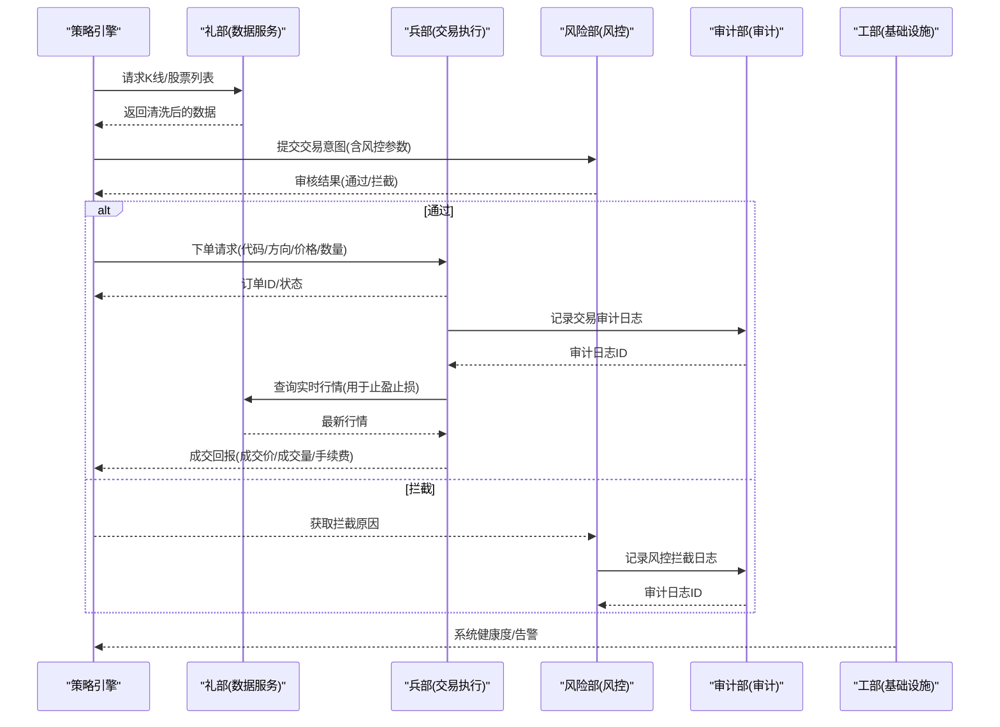

**图表来源**
- [ministries/rites/data_source_manager.py](file://ministries/rites/data_source_manager.py)
- [ministries/war/broker_adapter.py](file://ministries/war/broker_adapter.py)
- [ministries/war/order_manager.py](file://ministries/war/order_manager.py)
- [ministries/works/monitor.py](file://ministries/works/monitor.py)
- [risk/engine.py](file://risk/engine.py)
- [risk/guard.py](file://risk/guard.py)
- [core/audit.py](file://core/audit.py)

## 详细组件分析

### 礼部（数据服务）
- **数据源管理器**
  - 职责：注册/切换数据源、健康检查、主备自动切换、统一接口。
  - 关键点：支持本地数据库、可扩展第三方数据源；健康检查返回质量等级；自动在主数据源失败时回退备用。
- **实时行情监控**
  - 职责：WebSocket客户端生命周期、订阅管理、定时批量拉取与推送。
  - 关键点：批量化拉取避免过载；锁保护并发；系统事件广播。
- **报表生成**
  - 职责：HTML报表模板渲染，支持持仓、交易、风控、综合日报。
  - 关键点：主题变量注入；响应式布局；打印友好样式。

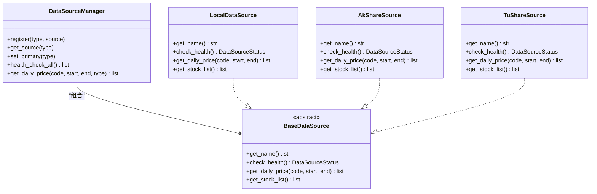

**图表来源**
- [ministries/rites/data_source_manager.py](file://ministries/rites/data_source_manager.py)
- [ministries/rites/akshare_source.py](file://ministries/rites/akshare_source.py)
- [ministries/rites/tushare_source.py](file://ministries/rites/tushare_source.py)

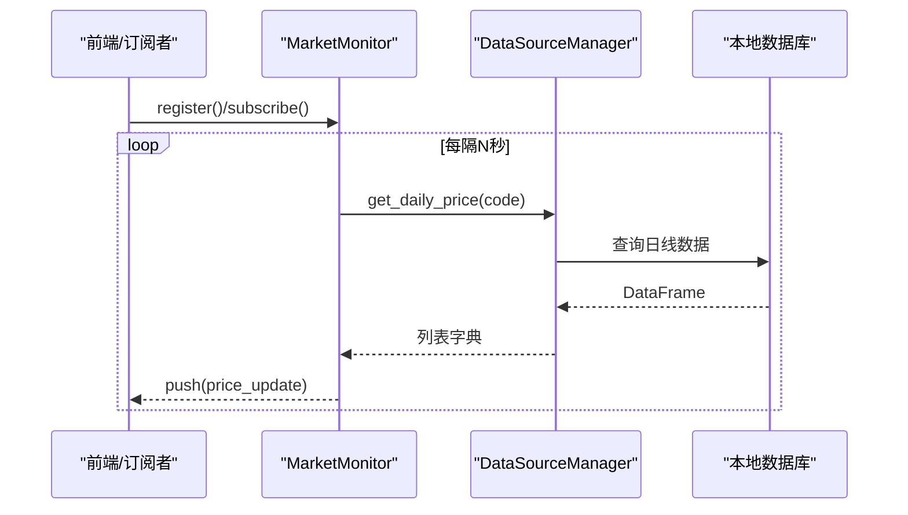

**图表来源**
- [ministries/rites/market_monitor.py](file://ministries/rites/market_monitor.py)
- [ministries/rites/data_source_manager.py](file://ministries/rites/data_source_manager.py)
- [core/db.py](file://core/db.py)

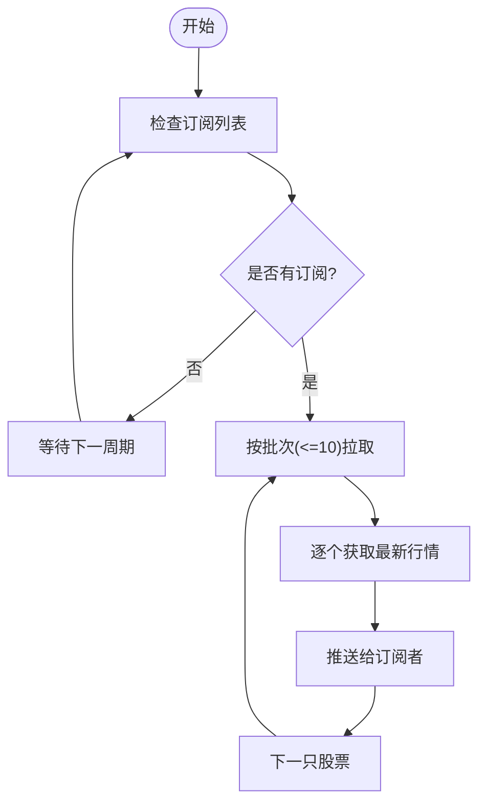

**图表来源**
- [ministries/rites/market_monitor.py](file://ministries/rites/market_monitor.py)

**章节来源**
- [ministries/rites/__init__.py](file://ministries/rites/__init__.py)
- [ministries/rites/data_source_manager.py](file://ministries/rites/data_source_manager.py)
- [ministries/rites/market_monitor.py](file://ministries/rites/market_monitor.py)
- [ministries/libu/report_generator.py](file://ministries/libu/report_generator.py)

### 兵部（交易执行）
- **交易接口抽象**
  - 职责：统一下单、撤单、查询订单/持仓/账户接口；支持模拟/实盘切换。
  - 关键点：枚举化方向/类型；统一数据结构；模拟器内置资金与成交逻辑。
- **订单管理**
  - 职责：订单生命周期管理、成交回写、持仓增减与更新。
  - 关键点：状态机（待提交/部分/已成交/已撤销/已拒绝）；加仓/减仓成本重算；实时更新未实现盈亏。

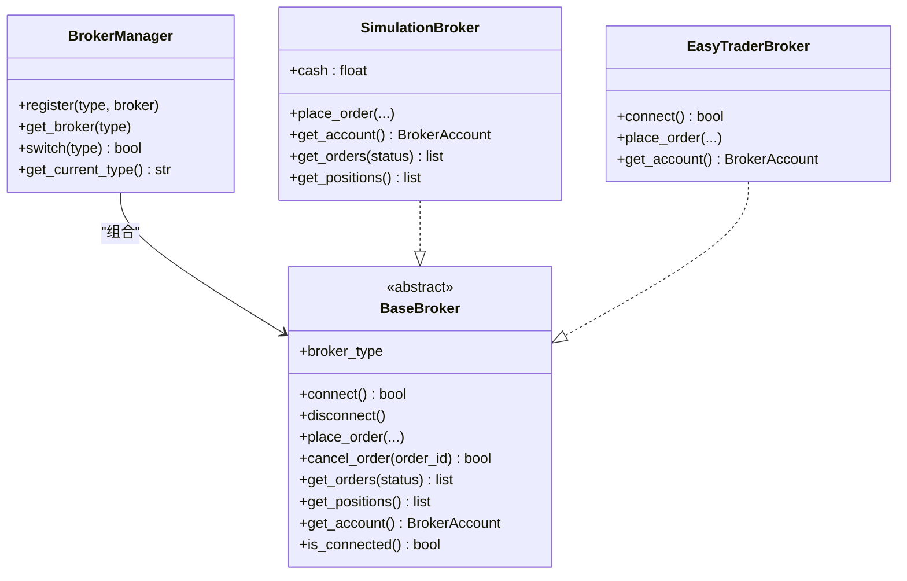

**图表来源**
- [ministries/war/broker_adapter.py](file://ministries/war/broker_adapter.py)

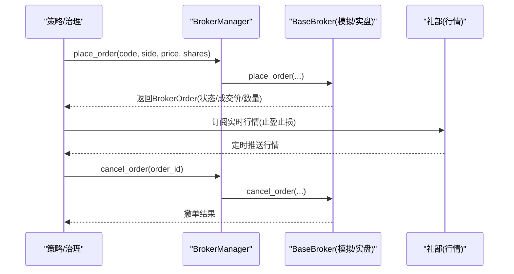

**图表来源**
- [ministries/war/broker_adapter.py](file://ministries/war/broker_adapter.py)
- [ministries/rites/market_monitor.py](file://ministries/rites/market_monitor.py)

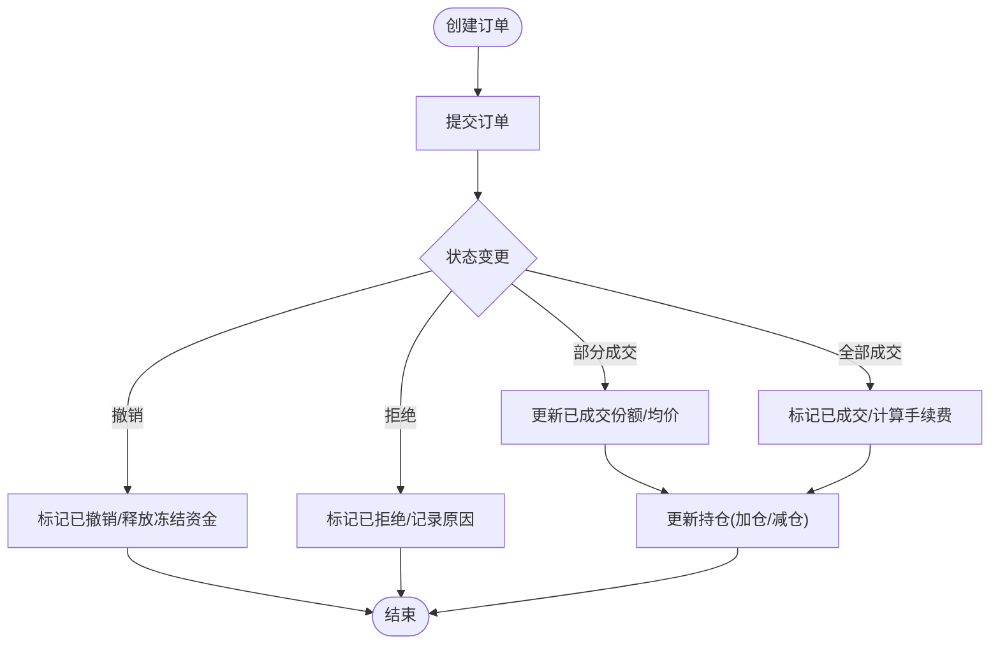

**图表来源**
- [ministries/war/order_manager.py](file://ministries/war/order_manager.py)

**章节来源**
- [ministries/war/__init__.py](file://ministries/war/__init__.py)
- [ministries/war/broker_adapter.py](file://ministries/war/broker_adapter.py)
- [ministries/war/order_manager.py](file://ministries/war/order_manager.py)

### 工部（基础设施）
- **系统监控**
  - 职责：采集CPU/内存/磁盘/数据库大小/活动连接/挂起订单/1小时错误数；健康度判断与告警。
  - 关键点：历史指标滚动窗口；阈值驱动告警；状态摘要便于前端展示。

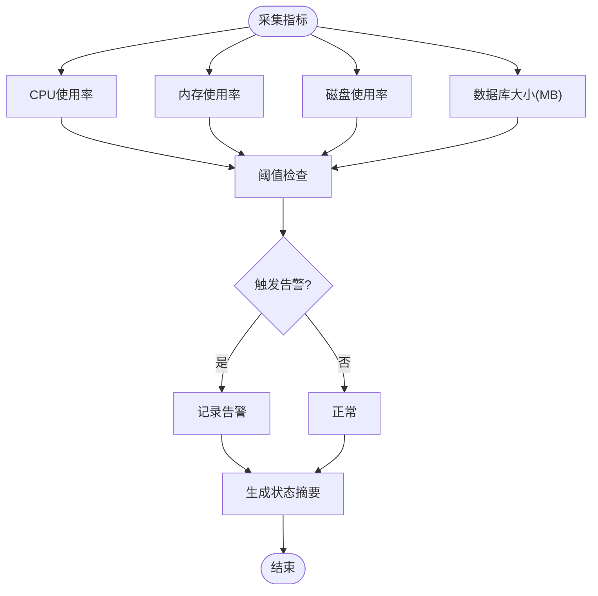

**图表来源**
- [ministries/works/monitor.py](file://ministries/works/monitor.py)

**章节来源**
- [ministries/works/__init__.py](file://ministries/works/__init__.py)
- [ministries/works/monitor.py](file://ministries/works/monitor.py)

### 风险部（风控）
- **三级风控体系**
  - PASS（通过）：满足所有风控规则
  - WARNING（警告）：触发预警但允许执行
  - RESTRICT（限制）：限制部分交易权限
  - BLOCK（拦截）：完全阻止交易执行
- **风控引擎与守卫**
  - 职责：加载规则、执行拦截/放行、记录事件；与策略/交易环节集成。
  - 关键点：规则可配置、事件可追溯、与订单/账户/行情联动。

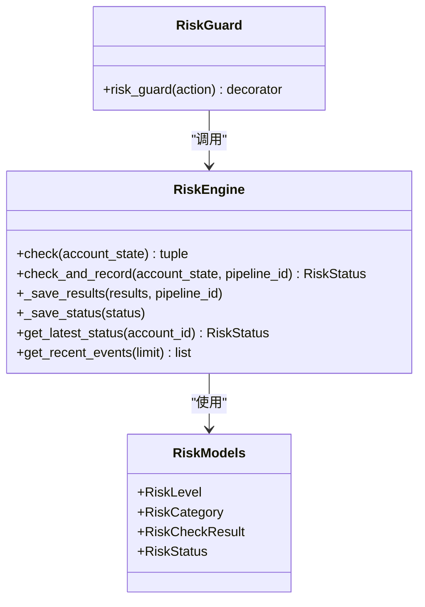

**图表来源**
- [risk/engine.py](file://risk/engine.py)
- [risk/guard.py](file://risk/guard.py)
- [risk/models.py](file://risk/models.py)

**章节来源**
- [risk/__init__.py](file://risk/__init__.py)
- [risk/engine.py](file://risk/engine.py)
- [risk/guard.py](file://risk/guard.py)
- [risk/models.py](file://risk/models.py)
- [risk/rules.py](file://risk/rules.py)

### 审计部（审计日志）
- **统一审计日志系统**
  - 职责：记录操作类型、资源、详情、用户ID、IP地址、结果。
  - 关键点：自动记录API调用；支持装饰器模式；数据库持久化。
- **审计装饰器**
  - 职责：自动包装函数，记录调用前后的审计信息。
  - 关键点：支持选择性记录结果；异常处理不影响业务流程。

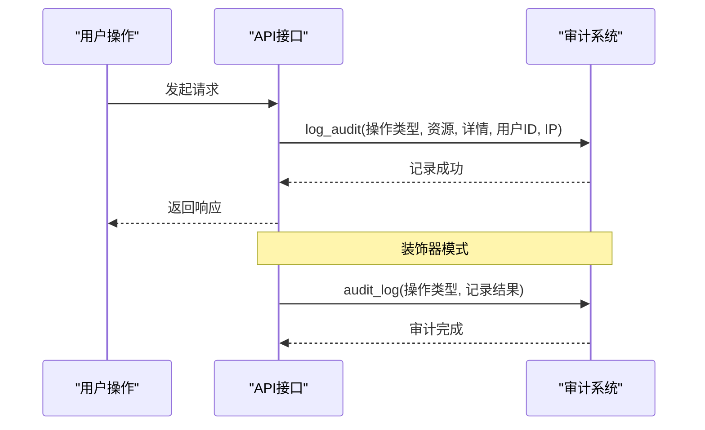

**图表来源**
- [core/audit.py](file://core/audit.py)

**章节来源**
- [core/audit.py](file://core/audit.py)

### 吏部（人员管理）与户部（财务管理）
- 当前仓库中以目录形式存在，尚未包含具体实现文件。后续应在此目录内实现：
  - 吏部：用户认证、权限校验、审计日志、会话管理。
  - 户部：账户资金、费用与收益核算、对账与结算、报表导出。

**章节来源**
- [ministries/personnel/](file://ministries/personnel/)
- [ministries/revenue/](file://ministries/revenue/)

## 依赖分析
- **组件耦合**
  - 礼部与核心数据库紧密耦合，承担数据输入职责；与兵部通过统一数据结构交互。
  - 兵部与礼部双向依赖：下单需要账户/资金信息，行情用于止盈止损。
  - 风险部与策略/兵部强耦合，贯穿交易前后。
  - 审计部与各部弱耦合，提供统一审计日志记录。
  - 工部与各部弱耦合，提供通用监控与告警。
- **外部依赖**
  - 数据源：本地数据库、第三方数据源（可插拔）。
  - 交易：模拟交易、EasyTrader（可选）。
  - 监控：psutil系统指标采集。
  - 审计：数据库持久化存储。

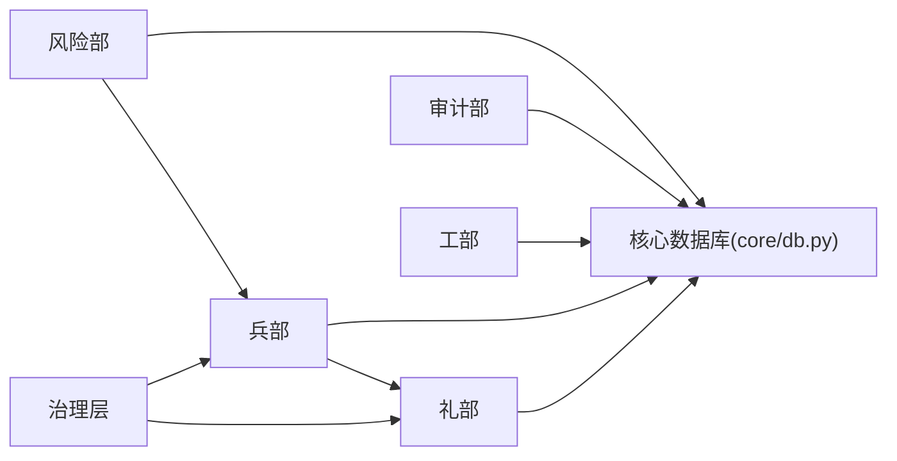

**图表来源**
- [ministries/rites/data_source_manager.py](file://ministries/rites/data_source_manager.py)
- [ministries/war/broker_adapter.py](file://ministries/war/broker_adapter.py)
- [ministries/works/monitor.py](file://ministries/works/monitor.py)
- [risk/engine.py](file://risk/engine.py)
- [core/db.py](file://core/db.py)
- [core/audit.py](file://core/audit.py)
- [governance/chancellery/scoring_engine.py](file://governance/chancellery/scoring_engine.py)
- [governance/crown_prince/decision_engine.py](file://governance/crown_prince/decision_engine.py)
- [governance/secretariat/execution_engine.py](file://governance/secretariat/execution_engine.py)

## 性能考虑
- **数据服务**
  - 批量拉取：行情监控按批处理，避免瞬时压力过大。
  - 缓存与降级：在主数据源不可用时快速切换备用源。
- **交易执行**
  - 模拟交易适合高频回测与低延迟验证；实盘需关注网络与接口延迟。
  - 订单状态机与持仓更新需原子性，避免并发写冲突。
- **基础设施**
  - 监控指标采样间隔与历史窗口平衡；告警阈值需结合业务峰值调优。
- **风险控制**
  - 规则复杂度与匹配成本权衡；事件日志异步落盘，避免阻塞主流程。
- **审计日志**
  - 审计日志异步写入，避免影响业务响应时间。
  - 审计装饰器仅在需要时启用，减少性能开销。

## 故障排查指南
- **数据问题**
  - 症状：行情缺失或延迟。
  - 排查：确认数据源健康检查结果；检查主备切换是否生效；查看批处理日志。
- **交易问题**
  - 症状：下单失败/撤单无效。
  - 排查：检查BrokerManager当前类型；模拟资金是否充足；实盘客户端是否连接成功。
- **风险问题**
  - 症状：频繁拦截或漏放行。
  - 排查：核对规则配置；查看风控事件日志；比对订单要素与规则条件。
- **监控告警**
  - 症状：CPU/内存/磁盘持续高位。
  - 排查：检查指标趋势图；定位热点模块；清理数据库或优化查询。
- **审计问题**
  - 症状：审计日志缺失或重复。
  - 排查：检查数据库连接；验证审计装饰器使用；查看异常日志。

**章节来源**
- [ministries/rites/market_monitor.py](file://ministries/rites/market_monitor.py)
- [ministries/war/broker_adapter.py](file://ministries/war/broker_adapter.py)
- [ministries/works/monitor.py](file://ministries/works/monitor.py)
- [risk/engine.py](file://risk/engine.py)
- [risk/guard.py](file://risk/guard.py)
- [core/audit.py](file://core/audit.py)

## 结论
AIQuant的"六部"体系以清晰的职责边界与模块化设计，实现了从数据采集、策略决策、交易执行到风控与监控的完整闭环。通过抽象层与单例管理，系统具备良好的扩展性与可维护性。新增的风险部和审计部进一步完善了系统的合规性和可追溯性。建议后续尽快补齐吏部与户部的实现，并完善治理层的编撰与执行流程，以形成更完整的组织化运作体系。

## 附录

### 各部职责与边界
- **礼部**：数据接入、清洗、标准化、缓存与分发；实时行情推送；报表模板渲染。
- **兵部**：统一交易接口；订单生命周期管理；持仓与成交回写。
- **工部**：系统健康检查、性能指标采集、告警触发与状态摘要。
- **风险部**：三级风控体系、规则加载、拦截/放行、事件记录与审计。
- **审计部**：统一审计日志记录、API调用追踪、操作行为审计。
- **吏部**：用户与权限、审计日志（待实现）。
- **户部**：资金与财务核算、对账与结算（待实现）。

**章节来源**
- [ministries/rites/__init__.py](file://ministries/rites/__init__.py)
- [ministries/war/__init__.py](file://ministries/war/__init__.py)
- [ministries/works/__init__.py](file://ministries/works/__init__.py)
- [risk/__init__.py](file://risk/__init__.py)
- [core/audit.py](file://core/audit.py)
- [ministries/personnel/](file://ministries/personnel/)
- [ministries/revenue/](file://ministries/revenue/)

### 配置选项与接口规范（概要）
- **数据服务**
  - 数据源类型：本地/akshare/tushare/baostock/yfinance。
  - 主备切换：通过管理器设置主数据源；失败自动回退。
  - 接口：统一get_daily_price/get_stock_list；健康检查返回质量等级。
- **交易执行**
  - 接口类型：simulation/easytrader/api。
  - 统一数据结构：BrokerOrder/BrokerPosition/BrokerAccount。
  - 订单状态：pending/submitted/partial/filled/cancelled/rejected。
- **基础设施**
  - 指标项：CPU/内存/磁盘/数据库大小/活动连接/挂起订单/1小时错误数。
  - 告警阈值：CPU>80%/内存>85%/磁盘>90%。
- **风险控制**
  - 风控等级：pass/warning/restrict/block。
  - 规则加载与执行；事件记录；与策略/交易联动。
- **审计日志**
  - 操作类型：trade.buy/risk.override/config.update等。
  - 记录字段：用户ID、操作类型、资源、详情、IP地址、时间戳。

**章节来源**
- [ministries/rites/data_source_manager.py](file://ministries/rites/data_source_manager.py)
- [ministries/war/broker_adapter.py](file://ministries/war/broker_adapter.py)
- [ministries/works/monitor.py](file://ministries/works/monitor.py)
- [risk/engine.py](file://risk/engine.py)
- [risk/guard.py](file://risk/guard.py)
- [risk/models.py](file://risk/models.py)
- [core/audit.py](file://core/audit.py)

### 使用示例（路径指引）
- 获取行情并订阅推送
  - 参考路径：[ministries/rites/market_monitor.py](file://ministries/rites/market_monitor.py)
- 创建并提交订单
  - 参考路径：[ministries/war/broker_adapter.py](file://ministries/war/broker_adapter.py)
- 生成综合日报
  - 参考路径：[ministries/libu/report_generator.py](file://ministries/libu/report_generator.py)
- 查看系统健康度
  - 参考路径：[ministries/works/monitor.py](file://ministries/works/monitor.py)
- 风控检查与拦截
  - 参考路径：[risk/guard.py](file://risk/guard.py)
- 审计日志记录
  - 参考路径：[core/audit.py](file://core/audit.py)

### 扩展新部门与自定义流程
- **新增部门步骤**
  - 在ministries目录下创建新部门子目录与模块文件。
  - 定义职责与对外接口；实现单例管理器；在路由层新增对应接口。
  - 在核心层或服务层引入依赖，确保数据与业务流程贯通。
- **自定义业务流程**
  - 在治理层（如chancellery/secretariat）定义策略与执行引擎。
  - 将新部门能力纳入流程编排，通过路由与服务层对接。
- **集成风险控制**
  - 使用@risk_guard装饰器保护关键操作。
  - 在风险引擎中添加自定义规则。
- **集成审计日志**
  - 使用@audit_log装饰器记录重要操作。
  - 在核心业务逻辑中手动调用log_audit函数。

**章节来源**
- [governance/chancellery/scoring_engine.py](file://governance/chancellery/scoring_engine.py)
- [governance/chancellery/strategy_engine.py](file://governance/chancellery/strategy_engine.py)
- [governance/secretariat/execution_engine.py](file://governance/secretariat/execution_engine.py)
- [routes/system.py](file://routes/system.py)
- [risk/guard.py](file://risk/guard.py)
- [core/audit.py](file://core/audit.py)

### 运维管理手册（要点）
- **启动与部署**
  - 使用入口脚本启动应用；确保数据库初始化与数据源可用。
- **监控与告警**
  - 定期检查系统指标与告警；关注数据库大小增长与磁盘空间。
  - 监控风险拦截频率，及时调整风控规则。
- **数据备份与恢复**
  - 定期备份数据库；验证恢复流程。
  - 审计日志定期归档，确保长期保存。
- **安全与审计**
  - 启用审计日志；限制敏感接口访问；定期轮换密钥与配置。
  - 风控规则定期审查，确保符合业务需求。
- **性能优化**
  - 监控各部负载情况，合理分配资源。
  - 优化数据源访问频率，避免过度请求。
  - 审计日志异步处理，减少对主业务的影响。

**章节来源**
- [app.py](file://app.py)
- [quant.py](file://quant.py)
- [ministries/works/monitor.py](file://ministries/works/monitor.py)
- [core/db.py](file://core/db.py)
- [risk/engine.py](file://risk/engine.py)
- [core/audit.py](file://core/audit.py)