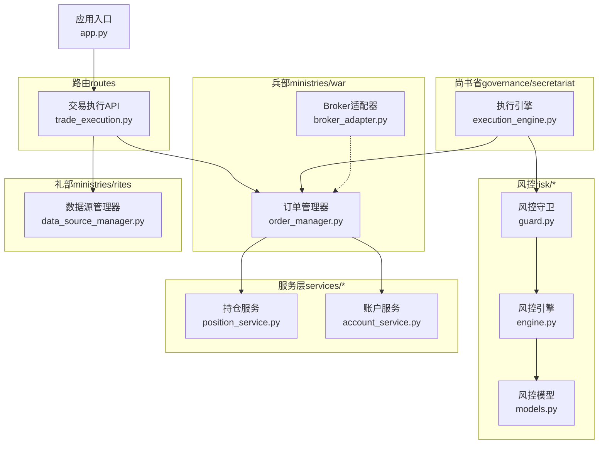
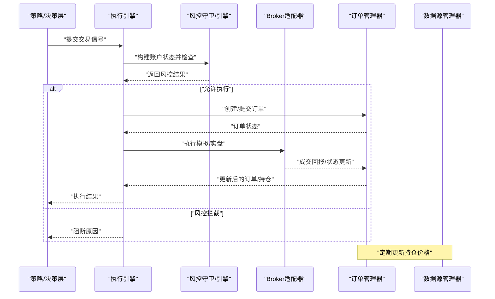
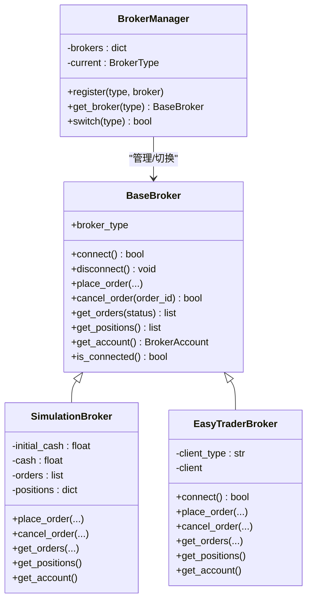
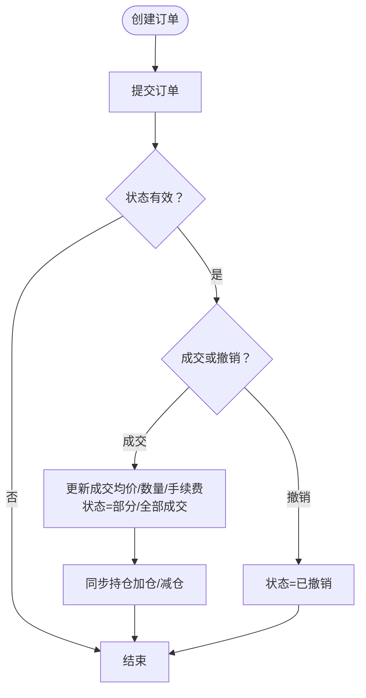
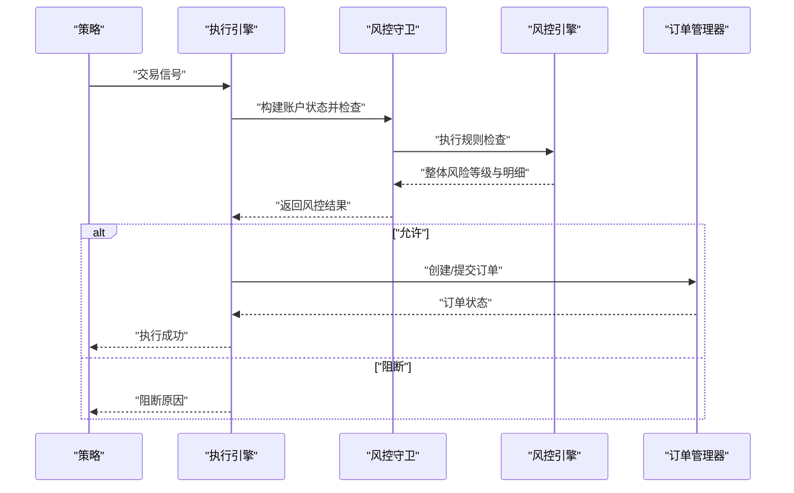
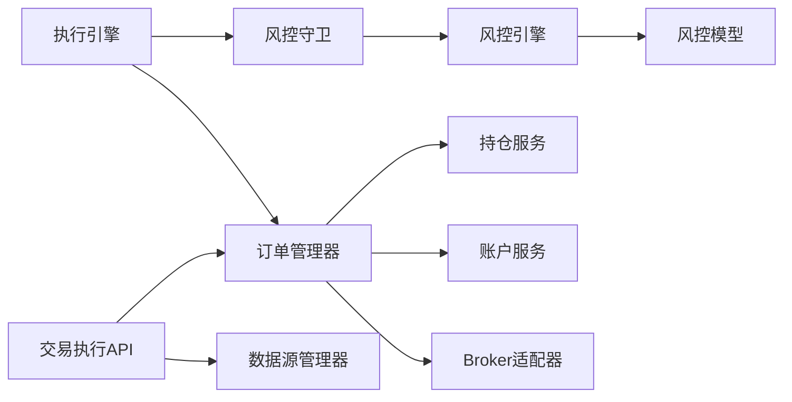

# 兵部（交易执行）

<cite>
**本文引用的文件**
- [ministries/war/broker_adapter.py](file://ministries/war/broker_adapter.py)
- [ministries/war/order_manager.py](file://ministries/war/order_manager.py)
- [routes/trade_execution.py](file://routes/trade_execution.py)
- [governance/secretariat/execution_engine.py](file://governance/secretariat/execution_engine.py)
- [risk/guard.py](file://risk/guard.py)
- [risk/engine.py](file://risk/engine.py)
- [risk/models.py](file://risk/models.py)
- [ministries/rites/data_source_manager.py](file://ministries/rites/data_source_manager.py)
- [services/position_service.py](file://services/position_service.py)
- [services/account_service.py](file://services/account_service.py)
- [app.py](file://app.py)
</cite>

## 目录
1. [引言](#引言)
2. [项目结构](#项目结构)
3. [核心组件](#核心组件)
4. [架构总览](#架构总览)
5. [详细组件分析](#详细组件分析)
6. [依赖关系分析](#依赖关系分析)
7. [性能考量](#性能考量)
8. [故障排查指南](#故障排查指南)
9. [结论](#结论)
10. [附录](#附录)

## 引言
本文件面向AIQuant系统的“兵部（交易执行）”模块，系统化阐述交易执行、订单管理、委托回报与风控联动的关键能力。内容覆盖：
- Broker适配器：统一交易接口抽象、模拟/实盘切换、扩展EasyTrader等通道
- 订单生命周期：创建、提交、成交、撤销、状态管理与持仓同步
- 执行算法与委托回报：模拟成交、滑点与交易成本建模、委托回报处理
- 与策略引擎、风控、资金管理的集成关系
- 交易执行API接口、订单管理示例与执行策略配置要点
- 订单排队、滑点处理、成交回报、撤单机制与交易成本优化

## 项目结构
兵部相关代码主要分布在以下模块：
- 兵部（ministries/war）：Broker适配器与订单管理
- 尚书省（governance/secretariat）：执行引擎对接风控与兵部
- 风控（risk/*）：风控引擎、守卫与数据模型
- 礼部（ministries/rites）：数据源管理器，用于行情与价格更新
- 服务层（services/*）：账户与持仓服务
- 路由（routes）：交易执行API入口
- 应用入口（app.py）：注册蓝图与全局路由

图表来源
- [ministries/war/broker_adapter.py:1-413](file://ministries/war/broker_adapter.py#L1-L413)
- [ministries/war/order_manager.py:1-211](file://ministries/war/order_manager.py#L1-L211)
- [governance/secretariat/execution_engine.py:1-183](file://governance/secretariat/execution_engine.py#L1-L183)
- [risk/guard.py:1-92](file://risk/guard.py#L1-L92)
- [risk/engine.py:1-168](file://risk/engine.py#L1-L168)
- [risk/models.py:1-78](file://risk/models.py#L1-L78)
- [ministries/rites/data_source_manager.py:1-190](file://ministries/rites/data_source_manager.py#L1-L190)
- [services/position_service.py:1-80](file://services/position_service.py#L1-L80)
- [services/account_service.py:1-31](file://services/account_service.py#L1-L31)
- [routes/trade_execution.py:1-217](file://routes/trade_execution.py#L1-L217)
- [app.py:1-164](file://app.py#L1-L164)

章节来源
- [app.py:1-164](file://app.py#L1-L164)

## 核心组件
- Broker适配器：定义统一的BaseBroker接口，提供模拟Broker与预留的实盘适配器；支持连接、下单、撤单、查询订单/持仓/账户等能力，并通过BrokerManager进行统一管理与切换。
- 订单管理器：封装订单生命周期（创建、提交、成交、撤销），维护订单与持仓集合，提供查询与价格更新能力。
- 执行引擎：接收交易信号，经风控检查后生成订单，调度兵部执行（模拟/实盘），并记录执行结果。
- 风控体系：风控守卫与引擎协同工作，构建账户状态并执行规则检查，支持阻断与记录。
- 数据源管理器：提供统一的数据源接口，支持主备切换与健康检查，用于行情与价格更新。
- 交易执行API：提供REST接口，支撑订单创建、查询、撤单、持仓与账户概览等。

章节来源
- [ministries/war/broker_adapter.py:84-413](file://ministries/war/broker_adapter.py#L84-L413)
- [ministries/war/order_manager.py:69-211](file://ministries/war/order_manager.py#L69-L211)
- [governance/secretariat/execution_engine.py:57-183](file://governance/secretariat/execution_engine.py#L57-L183)
- [risk/guard.py:36-92](file://risk/guard.py#L36-L92)
- [risk/engine.py:13-168](file://risk/engine.py#L13-L168)
- [ministries/rites/data_source_manager.py:111-190](file://ministries/rites/data_source_manager.py#L111-L190)
- [routes/trade_execution.py:14-217](file://routes/trade_execution.py#L14-L217)

## 架构总览
兵部在系统中的定位是“交易执行”的具体落地层，负责：
- 与策略/决策层（尚书省）对接，接收交易信号并生成订单
- 与风控层（门下省）协作，完成风控检查与拦截
- 与数据层（礼部）协作，获取实时/历史行情用于价格更新
- 与服务层（账户/持仓）协作，维护资金与头寸状态
- 对外提供API，支撑前端与外部系统调用

图表来源
- [governance/secretariat/execution_engine.py:64-101](file://governance/secretariat/execution_engine.py#L64-L101)
- [risk/guard.py:77-92](file://risk/guard.py#L77-L92)
- [ministries/war/order_manager.py:76-126](file://ministries/war/order_manager.py#L76-L126)
- [ministries/war/broker_adapter.py:134-250](file://ministries/war/broker_adapter.py#L134-L250)
- [ministries/rites/data_source_manager.py:153-177](file://ministries/rites/data_source_manager.py#L153-L177)

## 详细组件分析

### Broker适配器与交易通道
- 抽象接口：BaseBroker定义统一方法族，包括连接、下单、撤单、查询订单/持仓/账户等。
- 模拟通道：SimulationBroker提供完全内存化的交易仿真，支持资金冻结、立即成交、即时持仓更新与撤单退款。
- 实盘通道：预留EasyTrader适配器，支持连接、下单、撤单与账户查询（需安装依赖）。
- 管理器：BrokerManager负责注册与切换不同Broker类型，支持运行时切换模拟/实盘。

图表来源
- [ministries/war/broker_adapter.py:84-413](file://ministries/war/broker_adapter.py#L84-L413)

章节来源
- [ministries/war/broker_adapter.py:84-413](file://ministries/war/broker_adapter.py#L84-L413)

### 订单生命周期管理
- 订单实体：包含订单ID、标的、方向、价格、数量、状态、时间戳、成交均价与手续费等字段。
- 生命周期：
  - 创建：生成唯一订单ID，记录创建时间与原因
  - 提交：状态从PENDING转SUBMITTED
  - 成交：按部分或全部成交更新filled_price/shares/commission，状态变为PARTIAL/FILLED
  - 撤销：仅PENDING/SUBMITTED可撤销，状态置CANCELLED
- 持仓同步：买入加仓/更新成本，卖出减仓，清仓后状态置CLOSED

图表来源
- [ministries/war/order_manager.py:76-134](file://ministries/war/order_manager.py#L76-L134)
- [ministries/war/order_manager.py:162-198](file://ministries/war/order_manager.py#L162-L198)

章节来源
- [ministries/war/order_manager.py:69-211](file://ministries/war/order_manager.py#L69-L211)

### 执行引擎与风控联动
- 信号处理：接收策略信号，构建订单，记录创建时间与原因
- 风控检查：通过风控守卫/引擎构建账户状态并执行规则，支持阻断与记录
- 执行路径：模拟执行（立即全部成交）与实盘执行（预留）
- 订单管理：维护待执行与已执行订单列表，支持撤销与查询

图表来源
- [governance/secretariat/execution_engine.py:64-101](file://governance/secretariat/execution_engine.py#L64-L101)
- [risk/guard.py:77-92](file://risk/guard.py#L77-L92)
- [risk/engine.py:19-49](file://risk/engine.py#L19-L49)

章节来源
- [governance/secretariat/execution_engine.py:57-183](file://governance/secretariat/execution_engine.py#L57-L183)
- [risk/guard.py:36-92](file://risk/guard.py#L36-L92)
- [risk/engine.py:13-168](file://risk/engine.py#L13-L168)

### 委托回报与成交处理
- 委托回报：Broker适配器在下单后返回BrokerOrder，包含状态、成交均价与数量等
- 成交处理：订单管理器fill_order根据成交回报更新订单与持仓，计算手续费
- 模拟成交：交易执行API在simulate=true时自动提交并立即成交，便于测试与演示

章节来源
- [ministries/war/broker_adapter.py:158-194](file://ministries/war/broker_adapter.py#L158-L194)
- [ministries/war/order_manager.py:102-126](file://ministries/war/order_manager.py#L102-L126)
- [routes/trade_execution.py:47-58](file://routes/trade_execution.py#L47-L58)

### 交易执行API接口
- 创建订单：POST /api/trade/order（支持simulate参数）
- 订单列表：GET /api/trade/orders
- 撤销订单：POST /api/trade/order/{id}/cancel
- 持仓列表：GET /api/trade/positions（自动更新当前价格）
- 批量更新持仓价格：POST /api/trade/position/update
- 账户概览：GET /api/trade/account
- 模拟成交（测试）：POST /api/trade/simulate/fill

章节来源
- [routes/trade_execution.py:23-217](file://routes/trade_execution.py#L23-L217)

### 与策略引擎、风控、资金管理的集成
- 策略引擎：通过尚书省执行引擎提交信号，经风控检查后生成订单并调度兵部执行
- 风控：风控守卫/引擎对账户状态进行检查，支持阻断与记录，影响订单生成与执行
- 资金管理：订单成交时计算手续费，账户概览聚合持仓市值、未实现盈亏与总资金

章节来源
- [governance/secretariat/execution_engine.py:64-101](file://governance/secretariat/execution_engine.py#L64-L101)
- [risk/guard.py:77-92](file://risk/guard.py#L77-L92)
- [routes/trade_execution.py:128-160](file://routes/trade_execution.py#L128-L160)

## 依赖关系分析
- 组件耦合：
  - 执行引擎依赖风控守卫/引擎与订单管理器
  - 订单管理器与服务层（账户/持仓）交互
  - 交易执行API依赖订单管理器与数据源管理器
  - Broker适配器独立于订单管理器，通过管理器解耦
- 外部依赖：
  - 实盘通道依赖第三方库（如EasyTrader）
  - 风控引擎依赖数据库存储风险事件与状态

图表来源
- [governance/secretariat/execution_engine.py:64-101](file://governance/secretariat/execution_engine.py#L64-L101)
- [risk/guard.py:77-92](file://risk/guard.py#L77-L92)
- [risk/engine.py:19-49](file://risk/engine.py#L19-L49)
- [routes/trade_execution.py:16-17](file://routes/trade_execution.py#L16-L17)
- [ministries/rites/data_source_manager.py:153-177](file://ministries/rites/data_source_manager.py#L153-L177)
- [ministries/war/broker_adapter.py:371-413](file://ministries/war/broker_adapter.py#L371-L413)

章节来源
- [risk/models.py:11-78](file://risk/models.py#L11-L78)
- [services/position_service.py:12-38](file://services/position_service.py#L12-L38)
- [services/account_service.py:10-31](file://services/account_service.py#L10-L31)

## 性能考量
- 模拟交易：SimulationBroker在内存中完成下单、成交与持仓更新，适合快速验证与回测
- 实盘通道：需考虑网络延迟与第三方接口限制，建议异步化与重试机制
- 数据更新：持仓价格更新可按需触发或定时批量刷新，避免频繁查询行情接口
- 订单查询：对订单/持仓列表提供分页与过滤，降低前端渲染压力

## 故障排查指南
- Broker连接失败：检查BrokerManager注册与Broker类型切换；实盘通道需确认依赖安装与配置
- 订单状态异常：核对订单生命周期方法调用顺序，确保仅在PENDING/SUBMITTED状态下撤销
- 风控阻断：查看风控守卫返回的阻断原因与规则明细，调整账户状态参数或风控阈值
- API调用错误：确认请求参数格式与必填项，参考交易执行API的参数校验逻辑

章节来源
- [ministries/war/broker_adapter.py:264-278](file://ministries/war/broker_adapter.py#L264-L278)
- [ministries/war/order_manager.py:127-133](file://ministries/war/order_manager.py#L127-L133)
- [risk/guard.py:50-59](file://risk/guard.py#L50-L59)
- [routes/trade_execution.py:35-42](file://routes/trade_execution.py#L35-L42)

## 结论
兵部模块通过Broker适配器与订单管理器实现了统一的交易执行与订单生命周期管理，配合尚书省的执行引擎与风控体系，形成从信号到执行再到风控拦截的闭环。交易执行API为前端与外部系统提供了清晰的接口，支持模拟与实盘两种模式。通过合理的滑点与交易成本建模、委托回报处理与风控联动，系统在保证安全性的同时兼顾了灵活性与可扩展性。

## 附录

### 订单排队与滑点处理
- 订单排队：通过订单状态队列（待执行/已执行）与Broker通道排队机制实现
- 滑点处理：可在下单前对价格进行微幅调整或在成交后对成交均价进行修正（示例：模拟成交时的手续费计入）

章节来源
- [ministries/war/order_manager.py:102-126](file://ministries/war/order_manager.py#L102-L126)
- [ministries/war/broker_adapter.py:176-183](file://ministries/war/broker_adapter.py#L176-L183)

### 成交回报与撤单机制
- 成交回报：Broker适配器返回成交状态与均价，订单管理器据此更新订单与持仓
- 撤单机制：仅在PENDING/SUBMITTED阶段允许撤销，撤销后资金/持仓恢复

章节来源
- [ministries/war/broker_adapter.py:196-205](file://ministries/war/broker_adapter.py#L196-L205)
- [ministries/war/order_manager.py:127-133](file://ministries/war/order_manager.py#L127-L133)

### 交易成本优化
- 手续费建模：模拟成交时计入手续费，账户概览聚合总手续费
- 仓位与限额：结合风控规则与资金管理策略，控制单笔与总敞口

章节来源
- [routes/trade_execution.py:50-52](file://routes/trade_execution.py#L50-L52)
- [routes/trade_execution.py:139-140](file://routes/trade_execution.py#L139-L140)