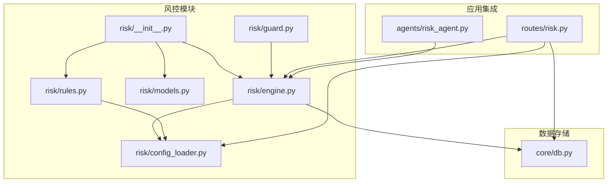
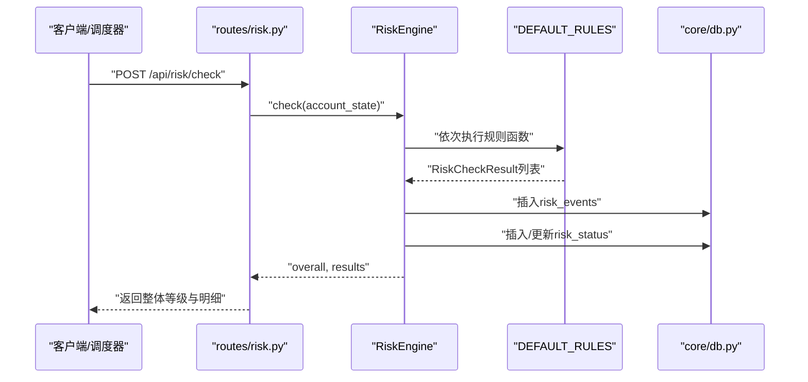
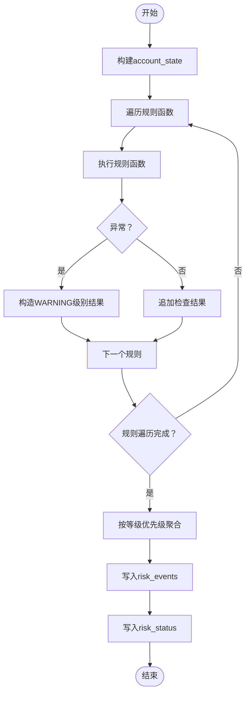
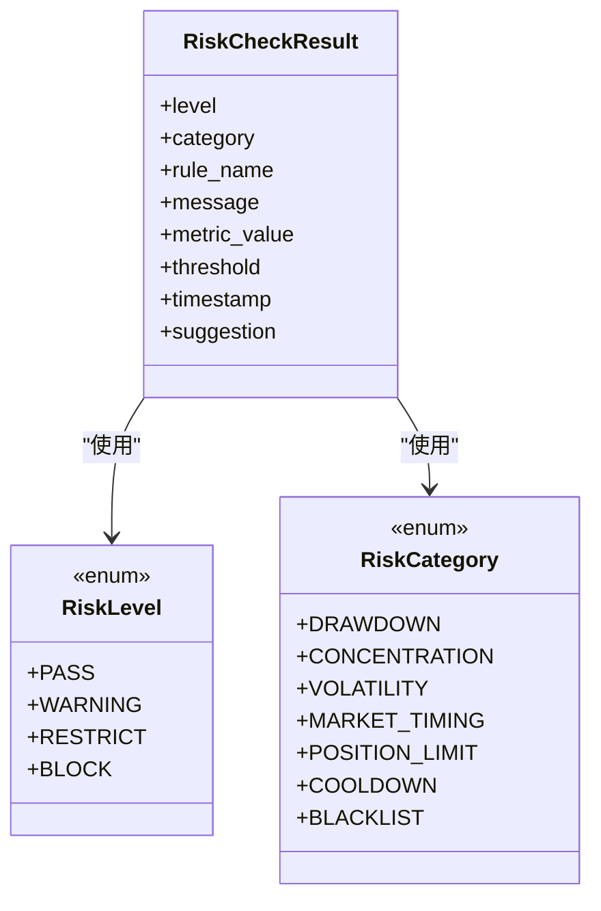
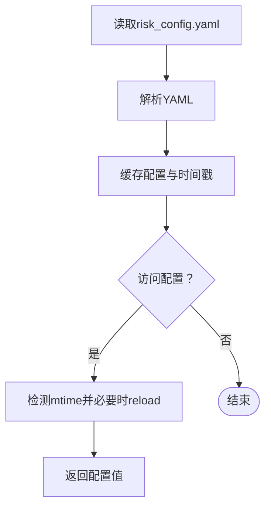
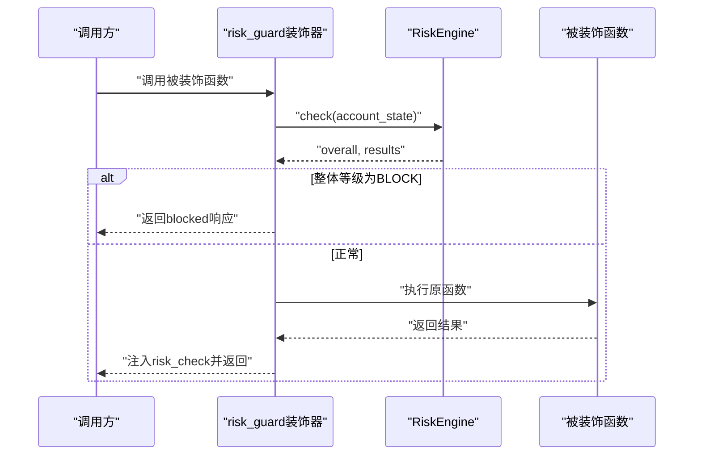
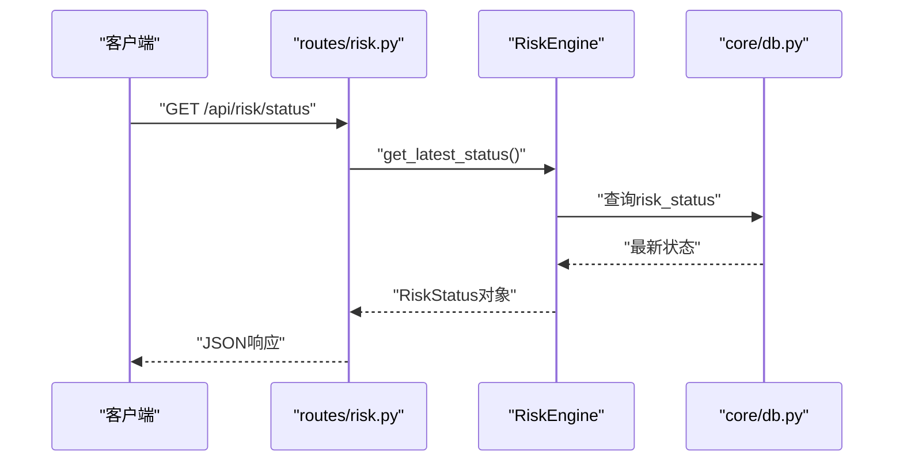
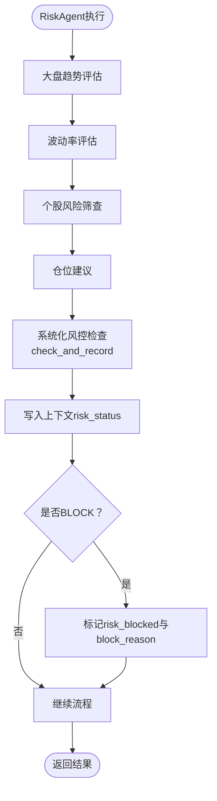
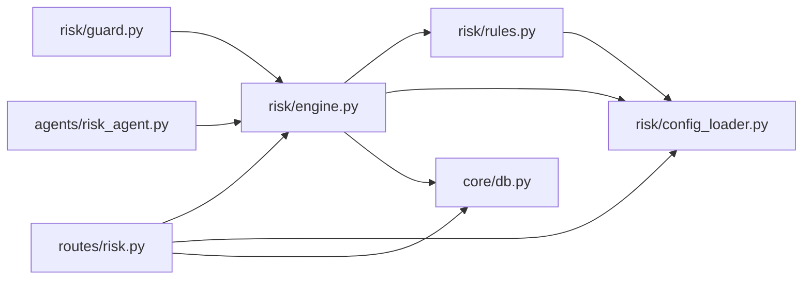

# 刑部（风险控制）

<cite>
**本文引用的文件**
- [risk/__init__.py](file://risk/__init__.py)
- [risk/engine.py](file://risk/engine.py)
- [risk/guard.py](file://risk/guard.py)
- [risk/models.py](file://risk/models.py)
- [risk/rules.py](file://risk/rules.py)
- [risk/config_loader.py](file://risk/config_loader.py)
- [routes/risk.py](file://routes/risk.py)
- [agents/risk_agent.py](file://agents/risk_agent.py)
- [config/risk_config.yaml](file://config/risk_config.yaml)
- [core/db.py](file://core/db.py)
</cite>

## 目录
1. [简介](#简介)
2. [项目结构](#项目结构)
3. [核心组件](#核心组件)
4. [架构总览](#架构总览)
5. [详细组件分析](#详细组件分析)
6. [依赖关系分析](#依赖关系分析)
7. [性能考量](#性能考量)
8. [故障排查指南](#故障排查指南)
9. [结论](#结论)
10. [附录](#附录)

## 简介
本文件面向AIQuant系统的“刑部”（风险控制）模块，系统性阐述其在量化交易中的风控规则、审计日志、合规检查与实时监控能力。文档覆盖风控规则引擎、风险指标计算、违规检测、审计日志记录、与策略执行/交易执行/资金管理的关系，并提供风控配置API、规则定义示例与合规报告生成思路。同时包含实时风控监控、风险预警、违规处理与监管报告功能说明。

## 项目结构
刑部模块位于risk目录，围绕规则引擎、规则库、配置加载器与API路由展开；同时与agents/risk_agent.py集成，形成端到端的风控闭环。数据库层通过core/db.py提供风险事件、风控状态、黑名单等表的持久化能力。

**图表来源**
- [risk/__init__.py:1-20](file://risk/__init__.py#L1-L20)
- [risk/engine.py:1-168](file://risk/engine.py#L1-L168)
- [risk/guard.py:1-92](file://risk/guard.py#L1-L92)
- [risk/models.py:1-78](file://risk/models.py#L1-L78)
- [risk/rules.py:1-388](file://risk/rules.py#L1-L388)
- [risk/config_loader.py:1-131](file://risk/config_loader.py#L1-L131)
- [routes/risk.py:1-298](file://routes/risk.py#L1-L298)
- [agents/risk_agent.py:1-262](file://agents/risk_agent.py#L1-L262)
- [core/db.py:358-400](file://core/db.py#L358-L400)

**章节来源**
- [risk/__init__.py:1-20](file://risk/__init__.py#L1-L20)
- [routes/risk.py:1-298](file://routes/risk.py#L1-L298)
- [agents/risk_agent.py:1-262](file://agents/risk_agent.py#L1-L262)
- [core/db.py:358-400](file://core/db.py#L358-L400)

## 核心组件
- 风控引擎（RiskEngine）：负责执行规则集、聚合结果、写入审计日志与风控状态、查询最新状态与事件。
- 规则库（DEFAULT_RULES）：内置多条风控规则，涵盖最大回撤、集中度、择时、连续亏损、日交易频率、波动率、行业集中度、总仓位、节假日提醒、黑名单等。
- 配置加载器（RiskConfig）：支持YAML配置热加载，按规则名读取阈值、消息模板与建议。
- 运行时守卫（risk_guard装饰器与check_risk函数）：在策略/信号生成等关键流程中注入风控检查与拦截。
- API路由（routes/risk.py）：提供风控状态、事件、手动检查、配置管理、黑名单、豁免等REST接口。
- Agent集成（agents/risk_agent.py）：在门下省·风控官角色中，结合大盘趋势、波动率、个股筛查与系统化风控检查，形成闭环。
- 数据模型（models.RiskLevel/RiskCategory/RiskCheckResult/RiskStatus）：统一风险等级、分类、检查结果与状态快照的数据结构。
- 数据库表：risk_events、risk_status、blacklist等，支撑审计与状态持久化。

**章节来源**
- [risk/engine.py:13-168](file://risk/engine.py#L13-L168)
- [risk/rules.py:376-388](file://risk/rules.py#L376-L388)
- [risk/config_loader.py:20-131](file://risk/config_loader.py#L20-L131)
- [risk/guard.py:36-92](file://risk/guard.py#L36-L92)
- [routes/risk.py:29-298](file://routes/risk.py#L29-L298)
- [agents/risk_agent.py:25-262](file://agents/risk_agent.py#L25-L262)
- [risk/models.py:11-78](file://risk/models.py#L11-L78)
- [core/db.py:358-400](file://core/db.py#L358-L400)

## 架构总览
刑部模块采用“规则引擎 + 配置驱动 + API路由 + Agent集成”的架构。规则以函数形式定义，统一由引擎调度；配置通过RiskConfig热加载；API提供外部可观测与可操作入口；Agent在业务流中注入风控检查；数据库持久化审计与状态。

**图表来源**
- [routes/risk.py:67-82](file://routes/risk.py#L67-L82)
- [risk/engine.py:19-72](file://risk/engine.py#L19-L72)
- [risk/rules.py:376-388](file://risk/rules.py#L376-L388)
- [core/db.py:358-400](file://core/db.py#L358-L400)

## 详细组件分析

### 风控引擎（RiskEngine）
- 职责
  - 执行规则集，聚合最严格等级作为整体风险等级。
  - 将检查结果与风控状态写入数据库，支持查询最新状态与最近事件。
- 关键流程
  - check：遍历规则，捕获异常并记录警告级别结果；按等级优先级取最大值。
  - check_and_record：在check基础上封装RiskStatus并写入risk_status。
  - _save_results/_save_status：将每条规则结果与整体状态写入对应表。
  - get_latest_status/get_recent_events：查询风控状态与事件。
- 错误处理
  - 规则执行异常被捕获并记录为WARNING级别，避免中断主流程。
- 复杂度
  - 规则数量为N，check复杂度O(N)，写入为O(N)；查询为O(1)或受限于LIMIT。

**图表来源**
- [risk/engine.py:19-72](file://risk/engine.py#L19-L72)
- [core/db.py:358-400](file://core/db.py#L358-L400)

**章节来源**
- [risk/engine.py:13-168](file://risk/engine.py#L13-L168)

### 规则库（DEFAULT_RULES）
- 规则类型与覆盖范围
  - 最大回撤限制、单股集中度限制、大盘择时（MA5/MA20）、连续亏损冷却、日交易频率限制、个股波动率限制、行业集中度限制、总仓位限制、节假日/周末持仓提醒、黑名单检查。
- 规则执行
  - 每条规则读取risk_config配置，比较指标与阈值，返回RiskCheckResult。
  - 黑名单规则动态查询数据库有效黑名单。
- 配置驱动
  - 阈值、消息模板、建议均来自risk_config.yaml，支持热加载。

**图表来源**
- [risk/models.py:11-78](file://risk/models.py#L11-L78)

**章节来源**
- [risk/rules.py:34-387](file://risk/rules.py#L34-L387)
- [config/risk_config.yaml:1-170](file://config/risk_config.yaml#L1-L170)

### 配置加载器（RiskConfig）
- 功能
  - 单例模式，支持热加载与自动检测文件变更。
  - 提供is_rule_enabled、get_threshold、get_message、get_suggestion等便捷方法。
- 使用场景
  - 规则函数读取阈值与消息模板，API路由读取配置用于返回与热加载。

**图表来源**
- [risk/config_loader.py:45-126](file://risk/config_loader.py#L45-L126)

**章节来源**
- [risk/config_loader.py:20-131](file://risk/config_loader.py#L20-L131)

### 运行时守卫（risk_guard装饰器与check_risk）
- 装饰器用法
  - @risk_guard(action="scan")：对被装饰函数进行风控前置检查；若整体等级为BLOCK，则直接返回拦截结果。
  - 自动注入risk_check字段到函数返回字典。
- 直接调用
  - check_risk(account_state, pipeline_id)：直接执行风控并记录，返回结构化结果。

**图表来源**
- [risk/guard.py:36-92](file://risk/guard.py#L36-L92)
- [risk/engine.py:19-72](file://risk/engine.py#L19-L72)

**章节来源**
- [risk/guard.py:36-92](file://risk/guard.py#L36-L92)

### API路由（routes/risk.py）
- 路由概览
  - GET /api/risk/status：获取当前风控状态。
  - GET /api/risk/events：获取最近风控事件（支持limit与level过滤）。
  - POST /api/risk/check：手动触发风控检查。
  - GET /api/risk/config：获取当前风控配置。
  - POST /api/risk/config/reload：热加载风控配置。
  - GET/POST /api/risk/blacklist：黑名单列表与增删。
  - POST /api/risk/override：申请风控豁免。
  - GET /api/risk/overrides：豁免记录。
  - GET /api/risk/drawdown：账户回撤曲线（基于account_snapshots）。
- 数据来源
  - 风控状态与事件来自数据库表risk_status与risk_events。
  - 黑名单来自blacklist表。
  - 回撤曲线来自account_snapshots表。

**图表来源**
- [routes/risk.py:31-49](file://routes/risk.py#L31-L49)
- [risk/engine.py:129-154](file://risk/engine.py#L129-L154)
- [core/db.py:374-387](file://core/db.py#L374-L387)

**章节来源**
- [routes/risk.py:29-298](file://routes/risk.py#L29-L298)

### Agent集成（agents/risk_agent.py）
- 职责
  - 大盘风险评估（MA5/MA20/MA60趋势、回撤）。
  - 波动率评估（基于指数收益的标准差）。
  - 个股风险筛查（ST/退市/停牌等）。
  - 仓位建议（基于市场环境）。
  - 系统化风控检查：构建account_state并调用RiskEngine.check_and_record，将结果写入上下文，若BLOCK则标记拦截。
- 输出
  - 返回综合风险评估与系统化风控结果，供Orchestrator与其他流程使用。

**图表来源**
- [agents/risk_agent.py:31-96](file://agents/risk_agent.py#L31-L96)
- [risk/engine.py:51-72](file://risk/engine.py#L51-L72)

**章节来源**
- [agents/risk_agent.py:25-262](file://agents/risk_agent.py#L25-L262)

## 依赖关系分析
- 模块内聚与耦合
  - RiskEngine依赖DEFAULT_RULES与RiskConfig；规则函数依赖RiskConfig；guard依赖RiskEngine；API路由依赖RiskEngine与RiskConfig；Agent依赖RiskEngine。
- 外部依赖
  - 数据库：SQLite，表包括risk_events、risk_status、blacklist、account_snapshots等。
  - 配置：risk_config.yaml，支持热加载。
- 循环依赖
  - 未发现循环导入；规则函数与配置加载器通过RiskConfig解耦。

**图表来源**
- [risk/rules.py:1-388](file://risk/rules.py#L1-L388)
- [risk/config_loader.py:1-131](file://risk/config_loader.py#L1-L131)
- [risk/engine.py:1-168](file://risk/engine.py#L1-L168)
- [risk/guard.py:1-92](file://risk/guard.py#L1-L92)
- [routes/risk.py:1-298](file://routes/risk.py#L1-L298)
- [agents/risk_agent.py:1-262](file://agents/risk_agent.py#L1-L262)
- [core/db.py:358-400](file://core/db.py#L358-L400)

**章节来源**
- [risk/engine.py:1-168](file://risk/engine.py#L1-L168)
- [routes/risk.py:1-298](file://routes/risk.py#L1-L298)
- [agents/risk_agent.py:1-262](file://agents/risk_agent.py#L1-L262)
- [core/db.py:358-400](file://core/db.py#L358-L400)

## 性能考量
- 规则执行
  - 规则数量固定且轻量，check复杂度线性；建议保持规则函数无阻塞I/O。
- 数据库写入
  - 写入采用事务与连接池式管理，注意批量写入与索引查询（如按created_at排序）。
- 热加载
  - RiskConfig通过mtime检测热加载，避免频繁磁盘IO；建议合理设置刷新周期。
- 并发
  - API与Agent并发调用时，确保数据库连接正确释放与事务一致性。

[本节为通用性能建议，不直接分析具体文件]

## 故障排查指南
- 风控规则异常
  - 现象：某规则抛出异常导致整体为WARNING。
  - 排查：查看risk_events中对应rule_name的异常记录；检查规则函数逻辑与阈值配置。
- 配置未生效
  - 现象：修改risk_config.yaml后规则阈值不变。
  - 排查：确认文件路径与权限；调用POST /api/risk/config/reload触发热加载；检查RiskConfig日志输出。
- 黑名单未命中
  - 现象：持仓或交易目标在黑名单中但未触发BLOCK。
  - 排查：确认blacklist表中记录未过期；核对stock_code是否一致；检查规则函数逻辑。
- API返回错误
  - 现象：查询状态或事件报错。
  - 排查：检查core/db.py连接与表是否存在；确认SQL语句与索引；查看服务端异常堆栈。

**章节来源**
- [risk/engine.py:73-128](file://risk/engine.py#L73-L128)
- [routes/risk.py:96-108](file://routes/risk.py#L96-L108)
- [risk/rules.py:340-370](file://risk/rules.py#L340-L370)
- [core/db.py:26-40](file://core/db.py#L26-L40)

## 结论
刑部模块通过“规则引擎 + 配置驱动 + API路由 + Agent集成”的设计，实现了可配置、可观测、可扩展的风控体系。规则覆盖回撤、集中度、择时、波动率、行业与总仓位等关键维度，配合黑名单与豁免机制，满足实时风控监控、风险预警与合规报告需求。建议持续完善规则阈值与消息模板，强化异常监控与热加载验证，确保在生产环境中稳定可靠。

[本节为总结性内容，不直接分析具体文件]

## 附录

### 风控配置API接口清单
- 获取当前风控状态
  - 方法：GET
  - 路径：/api/risk/status
  - 返回：overall_level、blocked、current_drawdown、current_positions、active_rules、block_reason、last_check
- 获取最近风控事件
  - 方法：GET
  - 路径：/api/risk/events?limit=&level=
  - 返回：count、events（含rule_name、category、level、message、metric_value、threshold、suggestion、created_at）
- 手动触发风控检查
  - 方法：POST
  - 路径：/api/risk/check
  - 请求体：account_state（可选）
  - 返回：overall_level、blocked、results（每条规则的详细结果）
- 获取风控配置
  - 方法：GET
  - 路径：/api/risk/config
  - 返回：config、config_path
- 热加载风控配置
  - 方法：POST
  - 路径：/api/risk/config/reload
  - 返回：success、message、config
- 获取黑名单列表
  - 方法：GET
  - 路径：/api/risk/blacklist
  - 返回：count、items（id、stock_code、reason、created_by、created_at、expiry_date）
- 添加黑名单
  - 方法：POST
  - 路径：/api/risk/blacklist
  - 请求体：stock_code、reason、expiry_days（可选）
  - 返回：success、message
- 移除黑名单
  - 方法：DELETE
  - 路径：/api/risk/blacklist/<stock_code>
  - 返回：success、message
- 申请风控豁免
  - 方法：POST
  - 路径：/api/risk/override
  - 请求体：rule_name、reason（可选，视require_reason）、duration_hours（可选）、operator
  - 返回：success、message、rule_name、duration_hours
- 获取豁免记录
  - 方法：GET
  - 路径：/api/risk/overrides?status=
  - 返回：count、items（id、rule_name、reason、operator、status、created_at、expires_at）
- 审批豁免
  - 方法：POST
  - 路径：/api/risk/override/<int:override_id>/approve
  - 请求体：approver
  - 返回：success、message
- 获取账户回撤曲线
  - 方法：GET
  - 路径：/api/risk/drawdown?days=
  - 返回：dates、drawdowns、max_drawdown、current_drawdown

**章节来源**
- [routes/risk.py:31-298](file://routes/risk.py#L31-L298)

### 风控规则定义示例（基于配置）
- 最大回撤限制
  - 配置键：max_drawdown.enabled/thresholds.warning/restrict/block/messages/suggestions
  - 规则函数：rule_max_drawdown
- 单股集中度限制
  - 配置键：single_stock_limit.enabled/thresholds.warning/block/messages/suggestions
  - 规则函数：rule_single_stock_limit
- 大盘择时（MA5/MA20）
  - 配置键：market_timing.enabled/index_code/ma_short/ma_long/threshold/level_when_bear/messages/suggestions
  - 规则函数：rule_market_timing
- 连续亏损冷却
  - 配置键：consecutive_loss.enabled/thresholds.restrict/block/messages/suggestions
  - 规则函数：rule_consecutive_loss
- 日交易频率限制
  - 配置键：daily_trade_limit.enabled/thresholds.warning/block/messages/suggestions
  - 规则函数：rule_daily_trade_limit
- 个股波动率限制
  - 配置键：volatility_limit.enabled/thresholds.warning/block/messages/suggestions
  - 规则函数：rule_volatility_limit
- 行业集中度限制
  - 配置键：sector_concentration.enabled/thresholds.warning/block/messages/suggestions
  - 规则函数：rule_sector_concentration
- 总仓位限制
  - 配置键：total_position_limit.enabled/thresholds.warning/block/messages/suggestions
  - 规则函数：rule_total_position_limit
- 节假日/周末持仓提醒
  - 配置键：weekend_hold.enabled/threshold_days/messages/suggestions
  - 规则函数：rule_weekend_hold
- 黑名单检查
  - 配置键：blacklist.enabled/default_expiry_days
  - 规则函数：rule_blacklist_check

**章节来源**
- [config/risk_config.yaml:1-170](file://config/risk_config.yaml#L1-L170)
- [risk/rules.py:34-387](file://risk/rules.py#L34-L387)

### 合规报告生成思路
- 报告维度
  - 时间范围、账户ID、整体风险等级分布、活跃规则TOP N、事件统计（按等级/类别/规则）。
- 数据来源
  - risk_events（事件明细）、risk_status（状态快照）、blacklist（黑名单命中）。
- 生成步骤
  - 选择时间窗口，查询risk_events与risk_status；
  - 按规则与等级聚合统计；
  - 导出CSV/Excel或生成PDF报告。
- 注意事项
  - 确保数据完整性与一致性；对敏感字段脱敏；遵循监管要求的留存期限。

[本节为概念性内容，不直接分析具体文件]