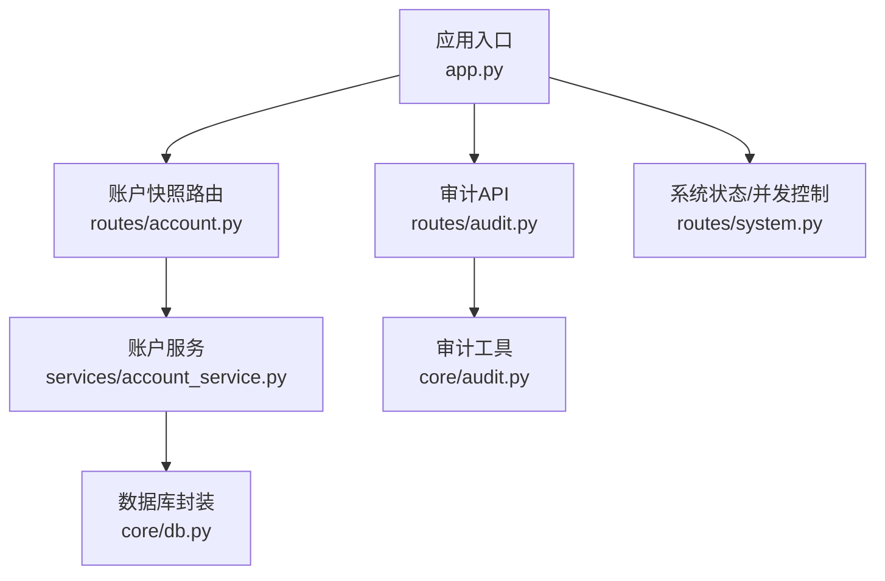
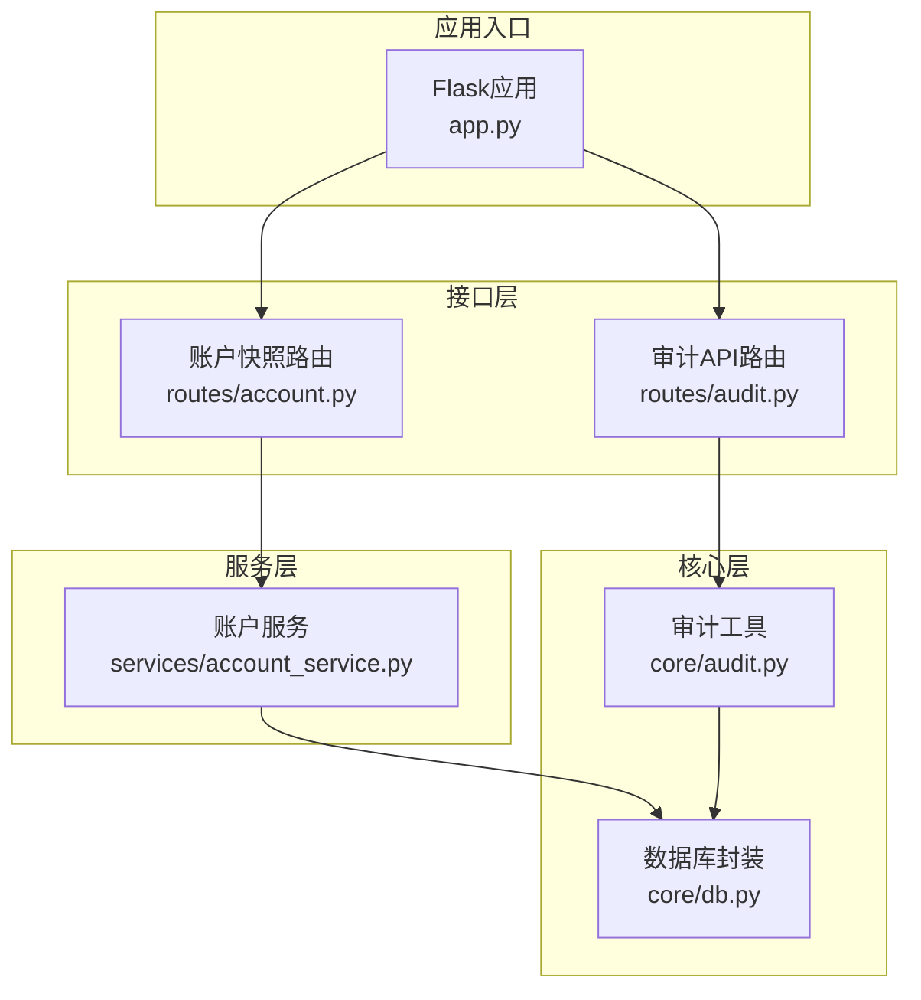
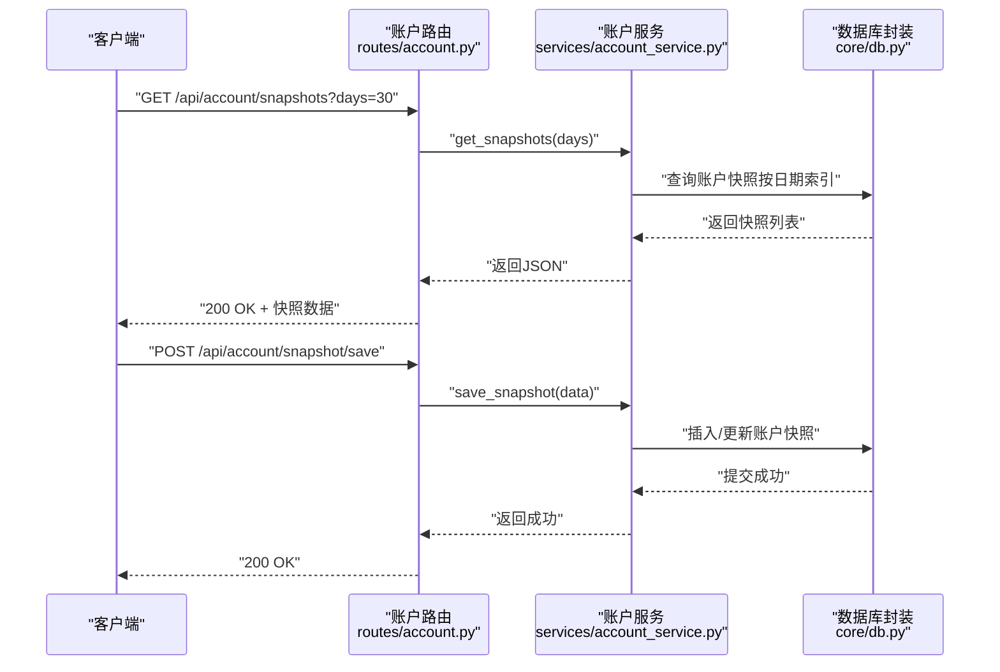
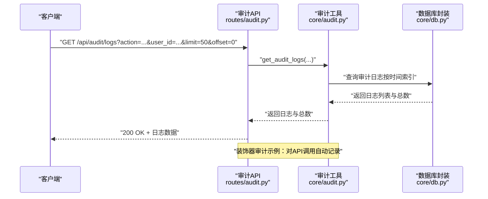
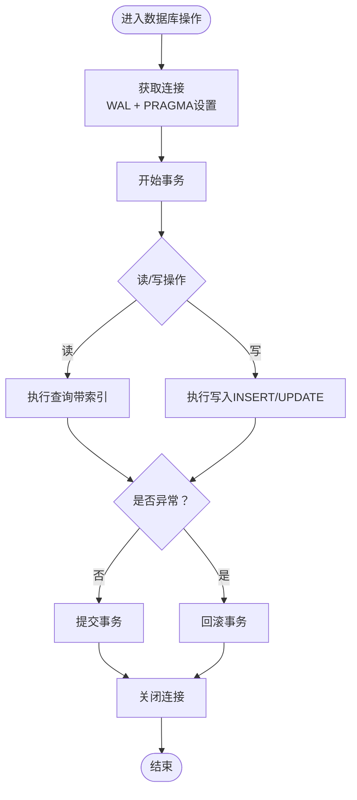
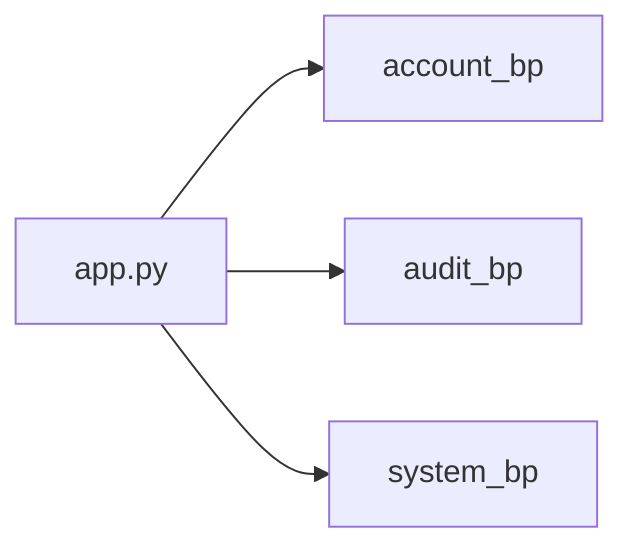
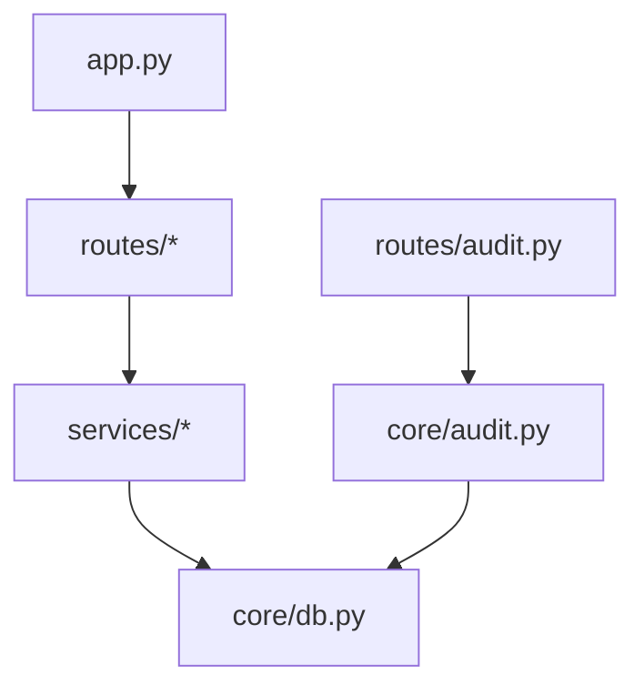

# 吏部（人员管理）

<cite>
**本文引用的文件**
- [app.py](file://app.py)
- [routes/account.py](file://routes/account.py)
- [services/account_service.py](file://services/account_service.py)
- [core/db.py](file://core/db.py)
- [core/audit.py](file://core/audit.py)
- [routes/audit.py](file://routes/audit.py)
- [ministries/__init__.py](file://ministries/__init__.py)
- [routes/system.py](file://routes/system.py)
</cite>

## 目录
1. [简介](#简介)
2. [项目结构](#项目结构)
3. [核心组件](#核心组件)
4. [架构总览](#架构总览)
5. [详细组件分析](#详细组件分析)
6. [依赖分析](#依赖分析)
7. [性能考虑](#性能考虑)
8. [故障排查指南](#故障排查指南)
9. [结论](#结论)
10. [附录](#附录)

## 简介
本文件面向AIQuant系统的“吏部（人员管理）”模块，聚焦于账户管理与用户权限控制两大职能。当前仓库中与“吏部”职责最直接相关的实现集中在账户快照服务与审计日志系统，分别对应“账户管理”和“审计与合规”。本文将基于现有代码，梳理其架构、数据流、关键流程与集成点，并给出API接口说明、最佳实践建议以及在多用户并发场景下的数据一致性保障思路。

## 项目结构
围绕吏部职责的关键文件组织如下：
- 应用入口与蓝图注册：app.py
- 账户快照路由与服务：routes/account.py、services/account_service.py
- 数据持久化与表结构：core/db.py
- 审计日志系统与审计API：core/audit.py、routes/audit.py
- 组织架构注释（含“吏部”职责说明）：ministries/__init__.py
- 系统状态与调度（与并发控制相关）：routes/system.py

图表来源
- [app.py:39-72](file://app.py#L39-L72)
- [routes/account.py:1-37](file://routes/account.py#L1-L37)
- [services/account_service.py:1-30](file://services/account_service.py#L1-L30)
- [core/db.py:26-39](file://core/db.py#L26-L39)
- [core/audit.py:16-39](file://core/audit.py#L16-L39)
- [routes/audit.py:16-78](file://routes/audit.py#L16-L78)
- [routes/system.py:12-83](file://routes/system.py#L12-L83)

章节来源
- [app.py:39-72](file://app.py#L39-L72)
- [ministries/__init__.py:1-11](file://ministries/__init__.py#L1-L11)

## 核心组件
- 账户快照服务：提供账户资产快照的历史查询、最新值查询与保存能力，支撑账户管理与风险监控。
- 审计日志系统：提供统一的审计日志记录与查询能力，支持按操作类型、用户ID、分页与过滤查询。
- 数据库封装：提供SQLite连接管理、事务控制、WAL模式与索引优化，保障并发与一致性。
- 应用入口与蓝图：集中注册各模块蓝图，形成清晰的路由边界。

章节来源
- [services/account_service.py:10-30](file://services/account_service.py#L10-L30)
- [core/audit.py:16-146](file://core/audit.py#L16-L146)
- [core/db.py:26-39](file://core/db.py#L26-L39)
- [app.py:39-72](file://app.py#L39-L72)

## 架构总览
吏部模块在系统中的位置与交互如下：

图表来源
- [app.py:39-72](file://app.py#L39-L72)
- [routes/account.py:1-37](file://routes/account.py#L1-L37)
- [routes/audit.py:16-78](file://routes/audit.py#L16-L78)
- [services/account_service.py:10-30](file://services/account_service.py#L10-L30)
- [core/audit.py:16-39](file://core/audit.py#L16-L39)
- [core/db.py:26-39](file://core/db.py#L26-L39)

## 详细组件分析

### 账户快照服务（账户管理）
- 功能要点
  - 获取历史快照：按天数参数查询账户资产快照集合。
  - 获取最新快照：返回最近一次账户快照。
  - 保存快照：接收JSON数据并写入数据库。
- 数据模型
  - 快照表包含资产总额、现金、持仓价值、持仓数量、成本、盈亏与收益率等字段，并按日期建立索引以支持高效查询。
- 并发与一致性
  - 服务层调用数据库封装的上下文管理器，自动提交或回滚事务，保证写入一致性。
  - 数据库使用WAL模式与合理的PRAGMA设置，提升并发写入性能与可靠性。

图表来源
- [routes/account.py:11-37](file://routes/account.py#L11-L37)
- [services/account_service.py:10-30](file://services/account_service.py#L10-L30)
- [core/db.py:210-224](file://core/db.py#L210-L224)

章节来源
- [routes/account.py:11-37](file://routes/account.py#L11-L37)
- [services/account_service.py:10-30](file://services/account_service.py#L10-L30)
- [core/db.py:210-224](file://core/db.py#L210-L224)

### 审计日志系统（审计与合规）
- 功能要点
  - 记录审计日志：支持传入操作类型、资源、详情、用户ID、IP地址与时间戳。
  - 查询审计日志：支持按操作类型与用户ID过滤、分页查询与总数统计。
  - 装饰器审计：对API进行自动审计，记录请求耗时、结果状态与资源标识。
- 数据模型
  - 审计日志表包含用户ID、操作动作、资源、详情、IP地址与创建时间，并按时间倒序建立索引。
- 并发与一致性
  - 写入审计日志同样通过数据库上下文管理器进行事务控制，避免部分写入导致的数据不一致。

图表来源
- [routes/audit.py:16-78](file://routes/audit.py#L16-L78)
- [core/audit.py:16-146](file://core/audit.py#L16-L146)
- [core/db.py:416-427](file://core/db.py#L416-L427)

章节来源
- [routes/audit.py:16-78](file://routes/audit.py#L16-L78)
- [core/audit.py:16-146](file://core/audit.py#L16-L146)
- [core/db.py:416-427](file://core/db.py#L416-L427)

### 数据库封装（并发与一致性）
- 连接管理
  - 使用上下文管理器确保连接正确关闭与事务提交/回滚。
  - 设置WAL模式与同步级别，兼顾性能与可靠性。
- 表结构与索引
  - 账户快照表与审计日志表均建立时间/日期相关索引，提高查询效率。
- 并发控制
  - WAL模式降低写入阻塞概率；事务控制保证写入原子性。

图表来源
- [core/db.py:26-39](file://core/db.py#L26-L39)
- [core/db.py:210-224](file://core/db.py#L210-L224)
- [core/db.py:416-427](file://core/db.py#L416-L427)

章节来源
- [core/db.py:26-39](file://core/db.py#L26-L39)
- [core/db.py:210-224](file://core/db.py#L210-L224)
- [core/db.py:416-427](file://core/db.py#L416-L427)

### 应用入口与蓝图注册
- 蓝图注册：app.py集中注册所有模块蓝图，包括账户与审计模块，形成清晰的路由边界。
- 并发控制：系统状态路由提供同步与扫描的并发状态管理，避免重复执行与竞态条件。

图表来源
- [app.py:39-72](file://app.py#L39-L72)
- [routes/system.py:12-83](file://routes/system.py#L12-L83)

章节来源
- [app.py:39-72](file://app.py#L39-L72)
- [routes/system.py:12-83](file://routes/system.py#L12-L83)

## 依赖分析
- 路由到服务：账户路由依赖账户服务；审计路由依赖审计工具。
- 服务到数据库：账户服务与审计工具均通过数据库封装进行数据存取。
- 应用入口：app.py统一注册蓝图，形成模块化依赖关系。

图表来源
- [app.py:39-72](file://app.py#L39-L72)
- [routes/account.py:1-37](file://routes/account.py#L1-L37)
- [services/account_service.py:1-30](file://services/account_service.py#L1-L30)
- [core/db.py:26-39](file://core/db.py#L26-L39)
- [routes/audit.py:16-78](file://routes/audit.py#L16-L78)
- [core/audit.py:16-39](file://core/audit.py#L16-L39)

章节来源
- [app.py:39-72](file://app.py#L39-L72)
- [routes/account.py:1-37](file://routes/account.py#L1-L37)
- [services/account_service.py:1-30](file://services/account_service.py#L1-L30)
- [core/db.py:26-39](file://core/db.py#L26-L39)
- [routes/audit.py:16-78](file://routes/audit.py#L16-L78)
- [core/audit.py:16-39](file://core/audit.py#L16-L39)

## 性能考虑
- 数据库层面
  - 使用WAL模式与合适的PRAGMA设置，减少写入阻塞，提升并发写入吞吐。
  - 对高频查询字段建立索引（如账户快照的日期索引、审计日志的时间索引）。
- 服务层面
  - 采用上下文管理器与事务控制，避免长事务占用连接资源。
  - 控制审计日志查询的分页上限，防止一次性返回过多数据。
- 并发控制
  - 在系统状态路由中对同步/扫描等长时间任务进行状态标记与并发限制，避免重复执行。

章节来源
- [core/db.py:26-39](file://core/db.py#L26-L39)
- [core/db.py:210-224](file://core/db.py#L210-L224)
- [core/db.py:416-427](file://core/db.py#L416-L427)
- [routes/system.py:12-83](file://routes/system.py#L12-L83)
- [routes/audit.py:24-29](file://routes/audit.py#L24-L29)

## 故障排查指南
- 账户快照接口
  - 若查询失败，检查服务层调用数据库封装是否抛出异常；确认数据库连接与事务是否正常提交/回滚。
  - 若保存失败，检查请求体格式与字段类型是否符合服务层期望。
- 审计日志接口
  - 若查询为空或总数为0，确认过滤条件与分页参数是否合理；检查审计日志表是否存在数据。
  - 若审计记录异常，检查审计工具的异常捕获与日志输出。
- 数据库问题
  - 若出现锁等待或写入阻塞，检查WAL模式与PRAGMA设置；必要时调整查询索引或分页大小。

章节来源
- [services/account_service.py:10-30](file://services/account_service.py#L10-L30)
- [routes/account.py:14-18](file://routes/account.py#L14-L18)
- [routes/account.py:32-37](file://routes/account.py#L32-L37)
- [core/audit.py:16-39](file://core/audit.py#L16-L39)
- [routes/audit.py:16-78](file://routes/audit.py#L16-L78)

## 结论
吏部模块在当前代码库中主要体现为“账户快照服务”与“审计日志系统”，二者共同支撑了账户管理与合规审计需求。通过数据库封装提供的事务控制与WAL模式，系统在多用户并发场景下具备较好的一致性与性能表现。未来可在吏部模块中进一步扩展用户注册、登录认证、权限分配与角色管理等能力，并与审计系统深度集成，形成完整的人员管理闭环。

## 附录

### 用户管理与权限控制（概念性说明）
- 用户注册与登录认证
  - 建议引入用户实体表与会话/令牌机制，结合审计日志记录登录与登出事件。
- 权限分配与角色管理
  - 引入角色与权限映射表，结合API级权限校验与审计日志追踪权限变更。
- 与账户服务、权限系统、审计日志的集成
  - 在关键业务操作前后记录审计日志，确保可追溯性与合规性。
- 最佳实践
  - 使用最小权限原则；定期轮换密钥与令牌；对敏感操作增加二次确认与审批流程。
- 并发控制与数据一致性
  - 对关键写入操作使用事务与乐观/悲观锁；对高频查询使用缓存与分页；对审计日志写入进行异步化以降低主流程延迟。

[本节为概念性内容，不直接分析具体文件，故无章节来源]