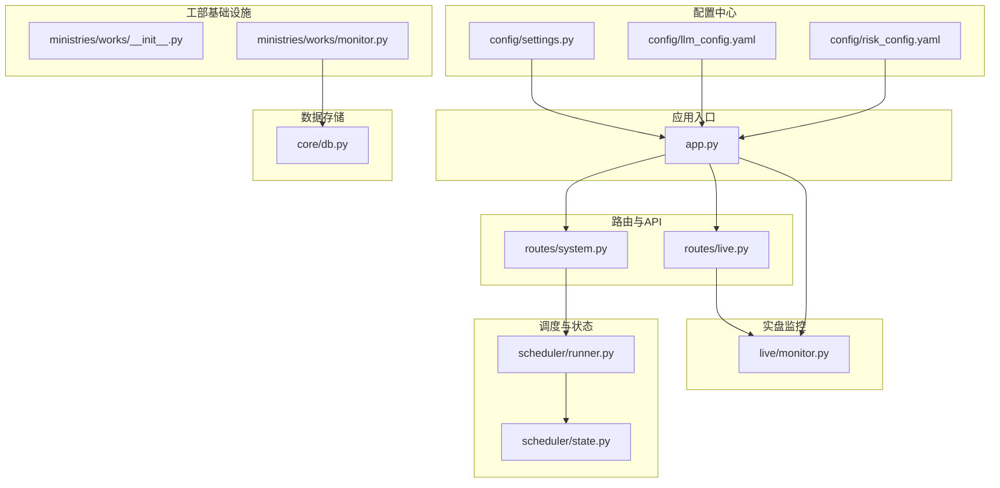
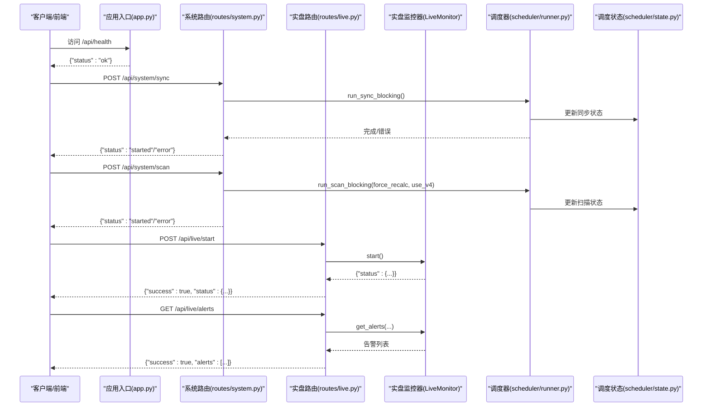
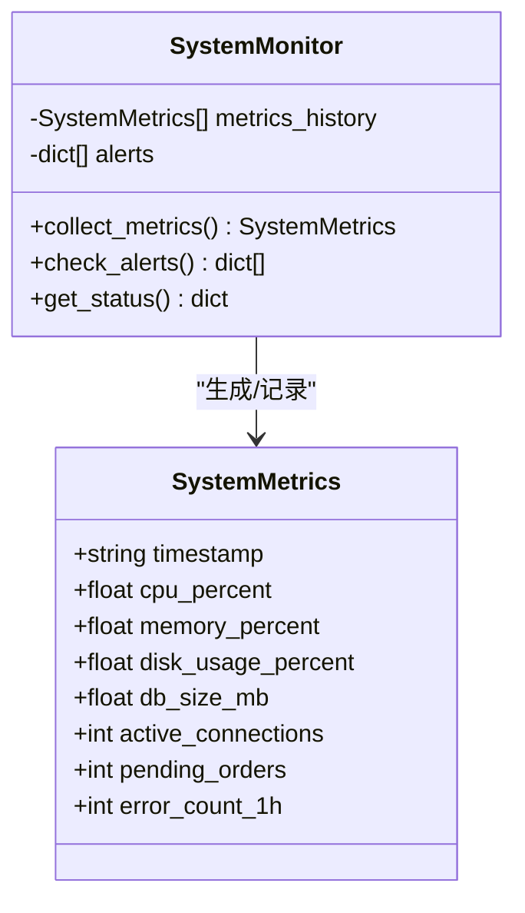
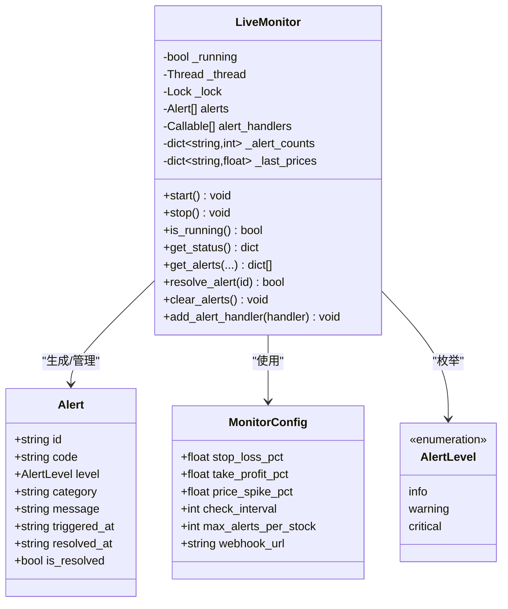
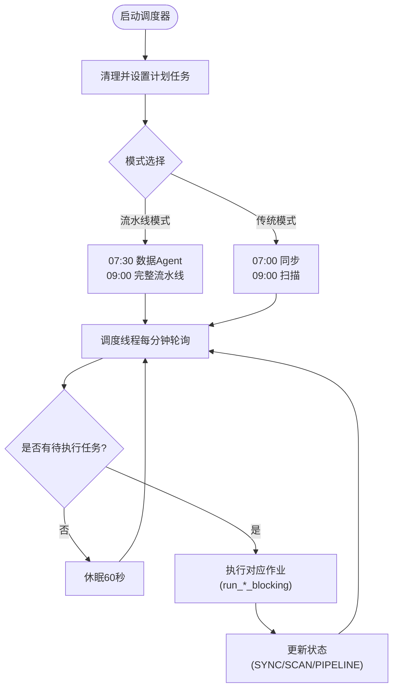
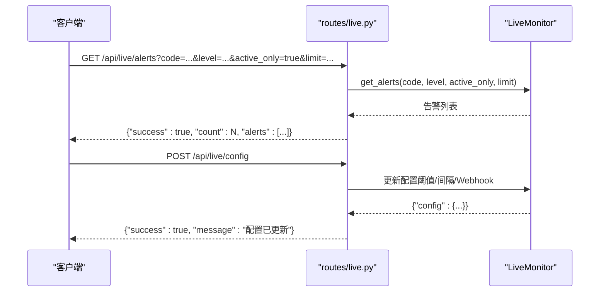
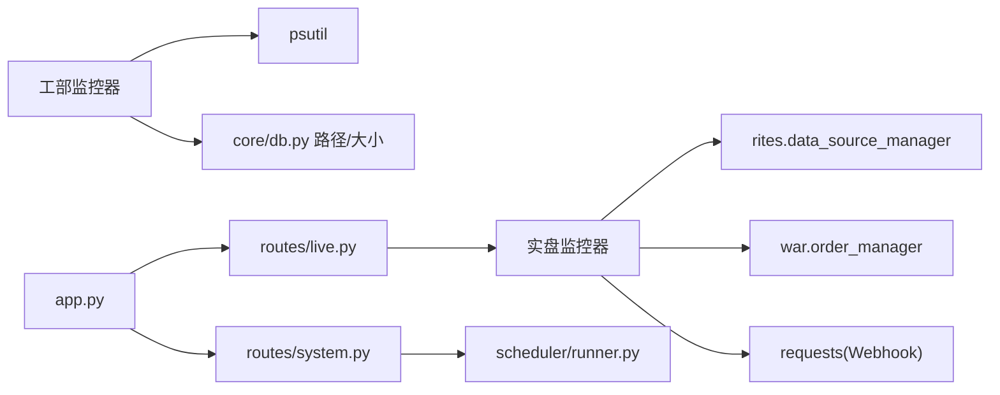

# 工部（基础设施）

<cite>
**本文引用的文件**
- [ministries/works/__init__.py](file://ministries/works/__init__.py)
- [ministries/works/monitor.py](file://ministries/works/monitor.py)
- [live/monitor.py](file://live/monitor.py)
- [routes/system.py](file://routes/system.py)
- [routes/live.py](file://routes/live.py)
- [app.py](file://app.py)
- [scheduler/state.py](file://scheduler/state.py)
- [scheduler/runner.py](file://scheduler/runner.py)
- [config/settings.py](file://config/settings.py)
- [config/llm_config.yaml](file://config/llm_config.yaml)
- [config/risk_config.yaml](file://config/risk_config.yaml)
- [core/db.py](file://core/db.py)
</cite>

## 目录
1. [简介](#简介)
2. [项目结构](#项目结构)
3. [核心组件](#核心组件)
4. [架构总览](#架构总览)
5. [详细组件分析](#详细组件分析)
6. [依赖分析](#依赖分析)
7. [性能考量](#性能考量)
8. [故障排查指南](#故障排查指南)
9. [结论](#结论)
10. [附录](#附录)

## 简介
本文件面向AIQuant系统的“工部（基础设施）”模块，系统化阐述其在量化交易体系中的基础设施职责与能力边界，包括系统配置管理、监控告警、日志收集、任务调度等。重点覆盖：
- 系统监控与健康检查、性能指标采集、告警机制
- 配置中心与配置热更新
- 与各业务模块的基础设施支撑关系
- 监控API接口、告警配置示例与运维管理策略
- 系统健康检查、资源监控、性能分析与故障诊断

## 项目结构
工部模块位于ministries/works，主要提供系统级监控与健康检查能力，并与调度、路由、数据库、实盘监控等模块协同工作。

图表来源
- [ministries/works/__init__.py:1-10](file://ministries/works/__init__.py#L1-L10)
- [ministries/works/monitor.py:1-114](file://ministries/works/monitor.py#L1-L114)
- [live/monitor.py:1-286](file://live/monitor.py#L1-L286)
- [routes/system.py:1-152](file://routes/system.py#L1-L152)
- [routes/live.py:1-126](file://routes/live.py#L1-L126)
- [app.py:148-164](file://app.py#L148-L164)
- [scheduler/state.py:1-45](file://scheduler/state.py#L1-L45)
- [scheduler/runner.py:1-212](file://scheduler/runner.py#L1-L212)
- [config/settings.py:1-25](file://config/settings.py#L1-L25)
- [config/llm_config.yaml:1-23](file://config/llm_config.yaml#L1-L23)
- [config/risk_config.yaml:1-170](file://config/risk_config.yaml#L1-L170)
- [core/db.py:19-40](file://core/db.py#L19-L40)

章节来源
- [ministries/works/__init__.py:1-10](file://ministries/works/__init__.py#L1-L10)
- [app.py:148-164](file://app.py#L148-L164)

## 核心组件
- 工部监控器（SystemMonitor）：负责系统健康检查、性能指标采集、告警触发与历史记录维护。
- 实盘监控器（LiveMonitor）：负责持仓扫描、止损止盈风控、价格异动告警、Webhook推送与告警生命周期管理。
- 调度与状态（scheduler/state.py, scheduler/runner.py）：提供系统级任务调度、状态管理与流水线模式支持。
- 路由与API（routes/system.py, routes/live.py）：对外暴露系统状态、同步、扫描、调度与实盘监控的REST接口。
- 配置中心（config/settings.py, config/llm_config.yaml, config/risk_config.yaml）：提供基础配置、LLM配置与风控规则配置。
- 应用入口（app.py）：注册蓝图、启动行情与实盘监控、提供健康检查接口。

章节来源
- [ministries/works/monitor.py:29-114](file://ministries/works/monitor.py#L29-L114)
- [live/monitor.py:55-286](file://live/monitor.py#L55-L286)
- [scheduler/state.py:5-45](file://scheduler/state.py#L5-L45)
- [scheduler/runner.py:25-212](file://scheduler/runner.py#L25-L212)
- [routes/system.py:12-152](file://routes/system.py#L12-L152)
- [routes/live.py:14-126](file://routes/live.py#L14-L126)
- [config/settings.py:1-25](file://config/settings.py#L1-L25)
- [config/llm_config.yaml:1-23](file://config/llm_config.yaml#L1-L23)
- [config/risk_config.yaml:1-170](file://config/risk_config.yaml#L1-L170)
- [app.py:148-164](file://app.py#L148-L164)

## 架构总览
工部模块通过“监控-告警-调度-配置-路由”的闭环，为系统提供基础设施保障。系统启动时自动初始化行情监控与实盘监控；通过路由接口对外提供系统状态、同步、扫描、调度与实盘监控能力；调度器按计划执行数据同步与策略扫描；监控器持续采集系统指标并触发告警；配置中心提供运行期可热加载的参数。

图表来源
- [app.py:131-133](file://app.py#L131-L133)
- [routes/system.py:12-83](file://routes/system.py#L12-L83)
- [routes/live.py:31-91](file://routes/live.py#L31-L91)
- [live/monitor.py:70-87](file://live/monitor.py#L70-L87)
- [scheduler/runner.py:29-101](file://scheduler/runner.py#L29-L101)
- [scheduler/state.py:5-11](file://scheduler/state.py#L5-L11)

## 详细组件分析

### 工部监控器（SystemMonitor）
- 职责
  - 系统健康检查：聚合CPU、内存、磁盘、数据库大小等指标，计算健康状态。
  - 性能指标采集：周期性采集系统资源与数据库状态，形成时间序列历史。
  - 告警触发：基于阈值规则触发告警并记录历史。
- 关键数据结构
  - SystemMetrics：包含时间戳与各类指标字段。
- 关键方法
  - collect_metrics：采集指标并写入历史队列。
  - check_alerts：基于最新指标检查并返回告警列表。
  - get_status：返回系统状态摘要（健康/警告）与关键指标。
- 设计要点
  - 历史容量限制（默认保留约1440条，对应24小时每分钟一条）。
  - 数据库大小通过路径拼接与文件大小计算，异常时静默忽略以保证稳定性。

图表来源
- [ministries/works/monitor.py:16-114](file://ministries/works/monitor.py#L16-L114)

章节来源
- [ministries/works/monitor.py:29-114](file://ministries/works/monitor.py#L29-L114)

### 实盘监控器（LiveMonitor）
- 职责
  - 定时扫描持仓，检查止损/止盈/风控线。
  - 价格异动告警（暴涨暴跌）。
  - 推送通知（Webhook/日志/回调）。
  - 监控任务调度与状态查询。
- 关键数据结构
  - AlertLevel：告警等级（info/warning/critical）。
  - Alert：告警记录（含唯一ID、股票代码、级别、类别、消息、触发/解决时间等）。
  - MonitorConfig：监控配置（止损/止盈阈值、价格异动阈值、检查间隔、最大告警数、Webhook地址等）。
- 关键方法
  - start/stop/is_running：生命周期管理。
  - _monitor_loop：主循环，按间隔扫描持仓并触发告警。
  - _trigger_alert：触发告警并执行回调。
  - resolve_alert：解决告警并更新统计。
  - add_alert_handler：注册告警处理器（如Webhook）。
  - get_status/get_alerts/clear_alerts：状态查询与告警管理。
- 设计要点
  - 使用线程锁保护告警列表与计数，避免并发问题。
  - 单股告警频率限制，防止刷屏。
  - 支持回调链式处理，便于扩展通知渠道。

图表来源
- [live/monitor.py:24-286](file://live/monitor.py#L24-L286)

章节来源
- [live/monitor.py:55-286](file://live/monitor.py#L55-L286)

### 调度与状态（scheduler/state.py, scheduler/runner.py）
- 调度状态
  - SYNC_STATUS/SCAN_STATUS：传统模式的同步/扫描状态。
  - SCHEDULER_RUNNING/SCHEDULER_THREAD：调度器开关与线程句柄。
  - PIPELINE_STATUS：多Agent流水线状态（运行中、最后流水线ID、时间、结果、各Agent状态）。
- 调度器
  - 支持两种模式：传统模式（07:00同步，09:00扫描）与多Agent流水线模式（07:30数据Agent，09:00完整流水线）。
  - 提供run_sync_blocking/run_scan_blocking/run_pipeline_blocking等后台任务。
  - start_scheduler：启动调度线程，按分钟轮询schedule.pending()。
- 作业封装
  - _job_sync/_job_scan/_job_data_agent/_job_pipeline：封装调度作业，避免重复执行。

图表来源
- [scheduler/runner.py:158-182](file://scheduler/runner.py#L158-L182)
- [scheduler/runner.py:186-212](file://scheduler/runner.py#L186-L212)
- [scheduler/state.py:5-45](file://scheduler/state.py#L5-L45)

章节来源
- [scheduler/state.py:5-45](file://scheduler/state.py#L5-L45)
- [scheduler/runner.py:25-212](file://scheduler/runner.py#L25-L212)

### 路由与API（routes/system.py, routes/live.py）
- 系统路由（routes/system.py）
  - POST /api/system/sync：触发数据同步（异步后台执行）。
  - POST /api/system/scan：触发策略扫描（支持force_recalc/use_v4参数）。
  - GET /api/system/status：获取同步/扫描/调度状态。
  - POST /api/system/scheduler：开启/关闭定时任务调度。
  - GET /api/system/auto_check：自动检查是否需要执行策略扫描。
- 实盘路由（routes/live.py）
  - GET /api/live/status：获取监控状态。
  - POST /api/live/start：启动监控。
  - POST /api/live/stop：停止监控。
  - GET /api/live/alerts：获取告警列表（支持按股票、级别、活跃状态、限制条数过滤）。
  - POST /api/live/alerts/<id>/resolve：解决告警。
  - POST /api/live/alerts/clear：清空告警。
  - POST /api/live/config：更新监控配置（支持止损/止盈/异动阈值、检查间隔、Webhook地址）。

图表来源
- [routes/live.py:53-126](file://routes/live.py#L53-L126)
- [live/monitor.py:218-251](file://live/monitor.py#L218-L251)

章节来源
- [routes/system.py:12-152](file://routes/system.py#L12-L152)
- [routes/live.py:14-126](file://routes/live.py#L14-L126)

### 配置中心（config/settings.py, config/llm_config.yaml, config/risk_config.yaml）
- 基础配置（config/settings.py）
  - 数据库路径、API主机/端口、调试模式、定时任务时间、同步批次大小、日志级别等。
- LLM配置（config/llm_config.yaml）
  - 模型、API Key、Base URL、默认参数、功能开关（增强意图解析、自动交易理由、市场分析等）。
- 风控规则配置（config/risk_config.yaml）
  - 版本与修改时间、多条风控规则（最大回撤、单股集中度、大盘择时、连续亏损、日交易频率、波动率、行业集中度、总仓位、节假日提醒）、黑名单与豁免设置。
- 设计要点
  - 配置文件支持环境变量覆盖（如LLM API Key），避免硬编码泄露。
  - 风控规则配置支持热加载，无需重启服务即可生效。

章节来源
- [config/settings.py:1-25](file://config/settings.py#L1-L25)
- [config/llm_config.yaml:1-23](file://config/llm_config.yaml#L1-L23)
- [config/risk_config.yaml:1-170](file://config/risk_config.yaml#L1-L170)

### 应用入口（app.py）
- 注册所有蓝图，提供统一仪表板与静态资源服务。
- 提供健康检查接口 /api/health。
- 启动时自动启动行情监控与实盘监控。

章节来源
- [app.py:148-164](file://app.py#L148-L164)

## 依赖分析
- 组件耦合
  - 工部监控器依赖操作系统与psutil进行指标采集，并通过core/db.py路径定位数据库文件以计算DB大小。
  - 实盘监控器依赖ministries.rites.data_source_manager与ministries.war.order_manager获取数据源与订单管理能力。
  - 路由层依赖调度器与监控器，实现系统状态与实盘监控的对外接口。
- 外部依赖
  - psutil：系统资源采集。
  - requests：Webhook推送。
  - schedule：定时任务调度。
  - Flask/Flask-Sock：HTTP与WebSocket服务。
- 循环依赖
  - 通过模块导入与延迟初始化避免循环依赖（如全局单例的惰性创建）。

图表来源
- [ministries/works/monitor.py:36-54](file://ministries/works/monitor.py#L36-L54)
- [live/monitor.py:20-21](file://live/monitor.py#L20-L21)
- [routes/system.py:8-9](file://routes/system.py#L8-L9)
- [routes/live.py:16](file://routes/live.py#L16)
- [app.py:148-164](file://app.py#L148-L164)

章节来源
- [ministries/works/monitor.py:36-54](file://ministries/works/monitor.py#L36-L54)
- [live/monitor.py:20-21](file://live/monitor.py#L20-L21)
- [routes/system.py:8-9](file://routes/system.py#L8-L9)
- [routes/live.py:16](file://routes/live.py#L16)
- [app.py:148-164](file://app.py#L148-L164)

## 性能考量
- 系统监控器
  - 指标采集采用短间隔（CPU采样间隔0.1秒），避免阻塞主线程。
  - 历史队列长度限制为约1440条，折合24小时，占用内存可控。
- 实盘监控器
  - 主循环按配置间隔sleep，避免忙等。
  - 单股告警频率限制与线程锁保护，降低高并发场景下的竞争与抖动。
- 调度器
  - 调度线程每分钟轮询，负载极低。
  - 传统与流水线双模式，可根据业务需求切换。
- 路由与API
  - 异步触发同步/扫描任务，避免阻塞请求线程。
- 数据库
  - SQLite连接使用WAL模式与NORMAL同步策略，兼顾并发与可靠性。

章节来源
- [ministries/works/monitor.py:36-60](file://ministries/works/monitor.py#L36-L60)
- [live/monitor.py:91-98](file://live/monitor.py#L91-L98)
- [scheduler/runner.py:158-182](file://scheduler/runner.py#L158-L182)
- [routes/system.py:12-43](file://routes/system.py#L12-L43)
- [core/db.py:26-40](file://core/db.py#L26-L40)

## 故障排查指南
- 健康检查
  - 访问 /api/health 确认服务可用。
- 系统状态
  - 通过 /api/system/status 查看同步/扫描/调度状态，判断是否卡住或异常。
- 实盘监控
  - 使用 /api/live/status 查看监控运行状态与阈值配置。
  - 使用 /api/live/alerts 获取告警列表，结合 /api/live/alerts/<id>/resolve 解决告警。
  - 使用 /api/live/config 更新阈值与Webhook地址，验证告警推送。
- 调度问题
  - 检查调度器开关与计划任务是否正确设置；必要时重新启用调度。
- 数据库
  - 若系统监控器无法读取数据库大小，检查DB路径与权限；确认core/db.py中DB_PATH配置正确。
- 日志与回调
  - 实盘监控器打印异常信息；Webhook推送失败会输出错误日志，检查网络与URL。

章节来源
- [app.py:131-133](file://app.py#L131-L133)
- [routes/system.py:46-63](file://routes/system.py#L46-L63)
- [routes/live.py:22-91](file://routes/live.py#L22-L91)
- [live/monitor.py:158-196](file://live/monitor.py#L158-L196)
- [ministries/works/monitor.py:48-54](file://ministries/works/monitor.py#L48-L54)
- [core/db.py:19](file://core/db.py#L19)

## 结论
工部（基础设施）模块通过系统监控、实盘监控、调度与配置中心四大支柱，为AIQuant系统提供了稳定可靠的基础设施能力。其设计强调：
- 可观测性：系统健康检查与性能指标采集，支持快速定位资源瓶颈。
- 可靠性：告警机制与限流策略，避免异常放大；线程锁与状态机设计，保证并发安全。
- 可运维性：REST API与配置热更新，支持在线运维与快速响应。
- 可扩展性：回调链与Webhook机制，便于接入多种通知渠道与第三方系统。

## 附录

### 监控API接口清单
- 系统
  - POST /api/system/sync：触发数据同步
  - POST /api/system/scan：触发策略扫描（支持参数：force_recalc, use_v4）
  - GET /api/system/status：获取系统状态
  - POST /api/system/scheduler：开启/关闭定时任务调度
  - GET /api/system/auto_check：自动检查是否需要扫描
- 实盘
  - GET /api/live/status：获取监控状态
  - POST /api/live/start：启动监控
  - POST /api/live/stop：停止监控
  - GET /api/live/alerts：获取告警列表（支持过滤与限制）
  - POST /api/live/alerts/<id>/resolve：解决告警
  - POST /api/live/alerts/clear：清空告警
  - POST /api/live/config：更新监控配置

章节来源
- [routes/system.py:12-152](file://routes/system.py#L12-L152)
- [routes/live.py:14-126](file://routes/live.py#L14-L126)

### 告警配置示例（实盘监控）
- 常用阈值
  - 止损阈值：例如 -6%（表示浮亏达到该比例触发告警）
  - 止盈阈值：例如 +15%（表示浮盈达到该比例触发告警）
  - 价格异动阈值：例如 ±7%（当日涨跌幅达到该幅度触发异动告警）
  - 检查间隔：例如 30 秒
  - 单股最大告警数：例如 5
  - Webhook地址：可选，用于推送告警到外部系统
- 更新方式
  - 通过 /api/live/config 接口提交JSON参数，支持动态更新上述阈值与Webhook地址。

章节来源
- [live/monitor.py:44-53](file://live/monitor.py#L44-L53)
- [routes/live.py:94-125](file://routes/live.py#L94-L125)

### 运维管理策略
- 健康检查
  - 定期访问 /api/health 与 /api/system/status，确保服务与调度正常。
- 监控告警
  - 启用Webhook推送，将关键告警（critical/warning）转发至值班群或监控平台。
  - 对高频告警（如价格异动）设置限流与去重策略。
- 配置管理
  - 使用环境变量覆盖敏感配置（如LLM API Key），避免明文存储。
  - 风控规则配置变更后，通过热加载生效，建议在非交易时段进行。
- 资源监控
  - 关注系统监控器输出的CPU/内存/磁盘使用率与数据库大小变化趋势，提前扩容或优化。
- 故障恢复
  - 当扫描/同步卡住时，通过 /api/system/status 检查状态，必要时重启调度器或手动触发一次任务。
  - 实盘监控异常时，检查Webhook网络与目标服务可用性，必要时临时关闭推送以排除干扰。

章节来源
- [app.py:131-133](file://app.py#L131-L133)
- [routes/system.py:46-63](file://routes/system.py#L46-L63)
- [routes/live.py:22-91](file://routes/live.py#L22-L91)
- [config/llm_config.yaml:7-8](file://config/llm_config.yaml#L7-L8)
- [config/risk_config.yaml:1-6](file://config/risk_config.yaml#L1-L6)