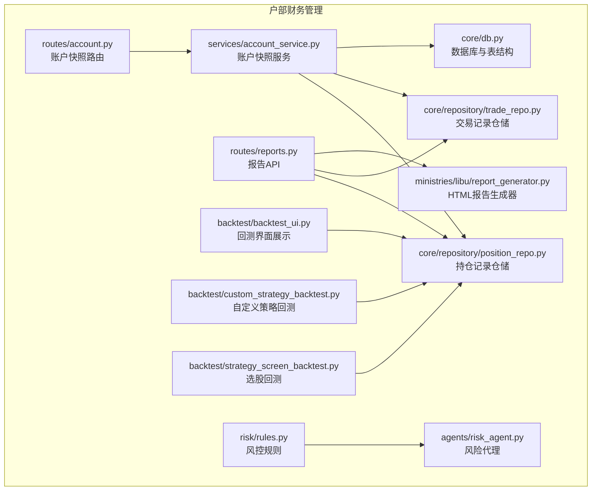
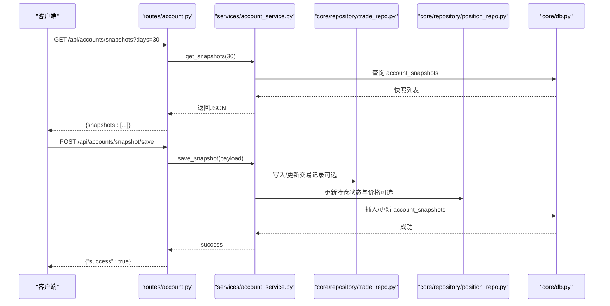
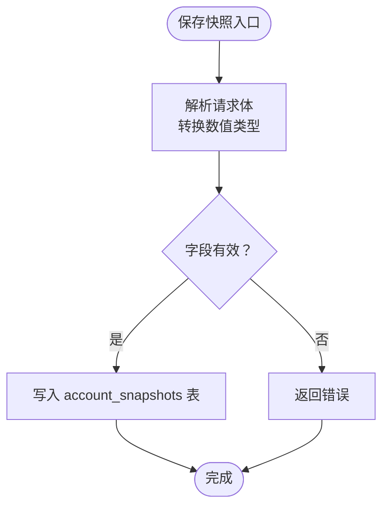
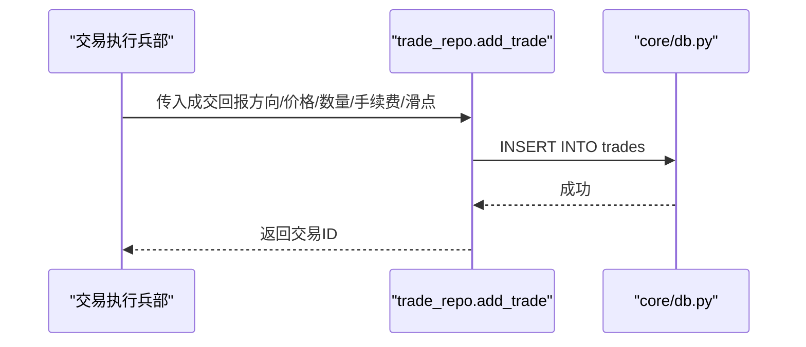
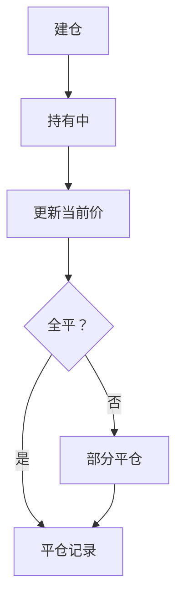
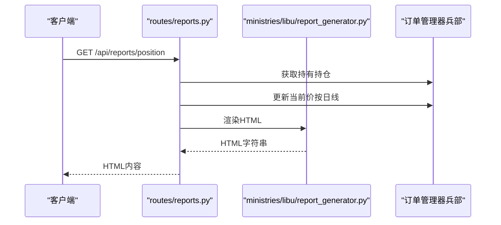
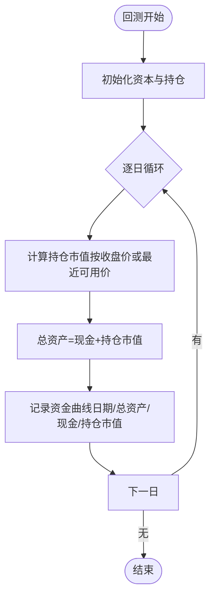
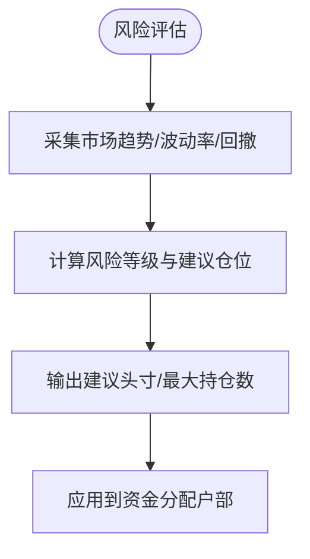
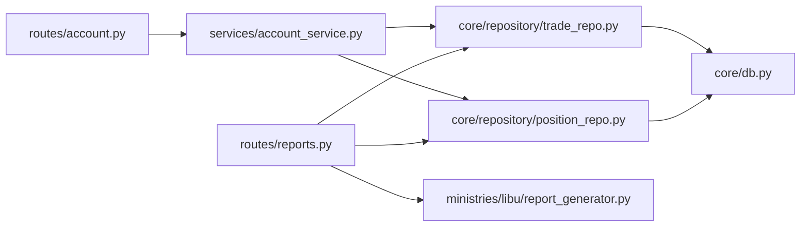

# 户部（财务管理）

<cite>
**本文引用的文件**
- [ministries/__init__.py](file://ministries/__init__.py)
- [routes/account.py](file://routes/account.py)
- [services/account_service.py](file://services/account_service.py)
- [core/db.py](file://core/db.py)
- [core/repository/position_repo.py](file://core/repository/position_repo.py)
- [core/repository/trade_repo.py](file://core/repository/trade_repo.py)
- [ministries/libu/report_generator.py](file://ministries/libu/report_generator.py)
- [routes/reports.py](file://routes/reports.py)
- [backtest/backtest_ui.py](file://backtest/backtest_ui.py)
- [backtest/custom_strategy_backtest.py](file://backtest/custom_strategy_backtest.py)
- [backtest/strategy_screen_backtest.py](file://backtest/strategy_screen_backtest.py)
- [risk/rules.py](file://risk/rules.py)
- [agents/risk_agent.py](file://agents/risk_agent.py)
</cite>

## 目录
1. [简介](#简介)
2. [项目结构](#项目结构)
3. [核心组件](#核心组件)
4. [架构总览](#架构总览)
5. [详细组件分析](#详细组件分析)
6. [依赖分析](#依赖分析)
7. [性能考虑](#性能考虑)
8. [故障排查指南](#故障排查指南)
9. [结论](#结论)
10. [附录](#附录)

## 简介
户部（财务管理）模块是AIQuant量化系统中的资金管理中心，负责账户余额与资金流水的记录、投资组合的实时估值与收益统计、账户快照的生成与查询，并与交易执行、风险控制、报表生成等模块协同工作，支撑回测与实盘的资金流闭环。户部以本地SQLite数据库为核心存储，围绕“账户快照”“交易流水”“持仓记录”三大数据域构建资金管理能力，同时提供API接口与报表生成能力，满足多账户管理、资金冻结/解冻、税务与合规报告的扩展需求。

## 项目结构
户部相关代码主要分布在以下位置：
- 路由层：提供账户快照查询与保存的HTTP接口
- 服务层：封装对数据库的访问与参数校验
- 数据访问层：对trades、positions、account_snapshots等表进行CRUD
- 数据库层：定义并初始化表结构，提供连接与迁移能力
- 报表与回测：结合持仓与资金曲线，输出HTML报告与可视化展示

图表来源
- [routes/account.py:1-38](file://routes/account.py#L1-L38)
- [services/account_service.py:1-31](file://services/account_service.py#L1-L31)
- [core/db.py:190-223](file://core/db.py#L190-L223)
- [core/repository/trade_repo.py:1-40](file://core/repository/trade_repo.py#L1-L40)
- [core/repository/position_repo.py:1-138](file://core/repository/position_repo.py#L1-L138)
- [routes/reports.py:1-45](file://routes/reports.py#L1-L45)
- [ministries/libu/report_generator.py:1-51](file://ministries/libu/report_generator.py#L1-L51)
- [backtest/backtest_ui.py:828-855](file://backtest/backtest_ui.py#L828-L855)
- [backtest/custom_strategy_backtest.py:570-596](file://backtest/custom_strategy_backtest.py#L570-L596)
- [backtest/strategy_screen_backtest.py:590-672](file://backtest/strategy_screen_backtest.py#L590-L672)
- [risk/rules.py:257-274](file://risk/rules.py#L257-L274)
- [agents/risk_agent.py:234-261](file://agents/risk_agent.py#L234-L261)

章节来源
- [ministries/__init__.py:1-11](file://ministries/__init__.py#L1-L11)
- [routes/account.py:1-38](file://routes/account.py#L1-L38)
- [services/account_service.py:1-31](file://services/account_service.py#L1-L31)
- [core/db.py:190-223](file://core/db.py#L190-L223)
- [core/repository/trade_repo.py:1-40](file://core/repository/trade_repo.py#L1-L40)
- [core/repository/position_repo.py:1-138](file://core/repository/position_repo.py#L1-L138)
- [routes/reports.py:1-45](file://routes/reports.py#L1-L45)
- [ministries/libu/report_generator.py:1-51](file://ministries/libu/report_generator.py#L1-L51)
- [backtest/backtest_ui.py:828-855](file://backtest/backtest_ui.py#L828-L855)
- [backtest/custom_strategy_backtest.py:570-596](file://backtest/custom_strategy_backtest.py#L570-L596)
- [backtest/strategy_screen_backtest.py:590-672](file://backtest/strategy_screen_backtest.py#L590-L672)
- [risk/rules.py:257-274](file://risk/rules.py#L257-L274)
- [agents/risk_agent.py:234-261](file://agents/risk_agent.py#L234-L261)

## 核心组件
- 账户快照（Account Snapshot）
  - 作用：记录每日总资产、现金、持仓市值、总成本、总盈亏、盈亏比例等关键财务指标，用于收益统计与报表生成。
  - 存储：account_snapshots表，包含日期索引，便于快速查询。
- 交易流水（Trade Records）
  - 作用：记录每笔成交的方向、价格、数量、金额、手续费、滑点、原因与备注，支撑资金变动追踪与回测复盘。
  - 存储：trades表，包含按代码与日期的索引，支持快速检索。
- 持仓记录（Positions）
  - 作用：记录每只股票的建仓日期、均价、股数、当前价、止盈止损、策略来源、状态等，用于实时估值与风控。
  - 存储：positions表，包含状态索引，支持按持有状态查询。
- 财务服务与路由
  - 路由：提供获取历史快照、获取最新快照、保存快照的REST接口。
  - 服务：对请求参数进行类型转换与校验，调用数据库层写入或读取。
- 报表与回测
  - 报表：基于持仓与价格更新，生成HTML格式的持仓报告、交易报告、风控报告与综合日报。
  - 回测：在回测引擎中计算每日资金曲线、持仓市值与现金余额，用于可视化展示与收益分析。

章节来源
- [core/db.py:190-223](file://core/db.py#L190-L223)
- [core/repository/trade_repo.py:12-37](file://core/repository/trade_repo.py#L12-L37)
- [core/repository/position_repo.py:12-138](file://core/repository/position_repo.py#L12-L138)
- [routes/account.py:11-38](file://routes/account.py#L11-L38)
- [services/account_service.py:10-31](file://services/account_service.py#L10-L31)
- [ministries/libu/report_generator.py:27-51](file://ministries/libu/report_generator.py#L27-L51)
- [backtest/backtest_ui.py:828-855](file://backtest/backtest_ui.py#L828-L855)

## 架构总览
户部模块采用“路由-服务-仓储-数据库”的分层设计，围绕账户快照、交易流水、持仓记录三类核心数据，形成资金管理闭环。与交易执行（兵部）、风险控制（刑部）、数据服务（礼部）协同，实现从下单到结算、从风控到报表的全链路贯通。

图表来源
- [routes/account.py:11-38](file://routes/account.py#L11-L38)
- [services/account_service.py:10-31](file://services/account_service.py#L10-L31)
- [core/repository/trade_repo.py:12-37](file://core/repository/trade_repo.py#L12-L37)
- [core/repository/position_repo.py:12-138](file://core/repository/position_repo.py#L12-L138)
- [core/db.py:210-223](file://core/db.py#L210-L223)

## 详细组件分析

### 账户快照（Account Snapshot）
- 数据模型
  - 字段：快照日期、总资产、现金、持仓市值、持仓数量、总成本、总盈亏、盈亏比例、创建时间。
  - 索引：按快照日期建立索引，支持按天查询。
- 业务流程
  - 保存：服务层接收前端传入的数值型字段，转换为浮点/整型后写入数据库。
  - 查询：按天数范围查询历史快照，或查询最新快照。
- 关键接口
  - GET /api/accounts/snapshots?days=30
  - GET /api/accounts/snapshot/latest
  - POST /api/accounts/snapshot/save

图表来源
- [services/account_service.py:20-31](file://services/account_service.py#L20-L31)
- [core/db.py:210-223](file://core/db.py#L210-L223)

章节来源
- [routes/account.py:11-38](file://routes/account.py#L11-L38)
- [services/account_service.py:10-31](file://services/account_service.py#L10-L31)
- [core/db.py:210-223](file://core/db.py#L210-L223)

### 交易流水（Trades）
- 数据模型
  - 字段：交易方向、成交价、股数、金额、手续费、滑点、原因、备注、创建时间等。
  - 索引：按代码与日期建立索引，支持快速检索。
- 业务流程
  - 新增：在交易执行后，按成交回报写入交易记录，计算金额并记录手续费与滑点。
  - 查询：支持按股票代码与时间窗口查询交易明细。
- 与资金管理的关系
  - 交易流水是资金变动的直接依据，用于核对账户快照与收益统计。

图表来源
- [core/repository/trade_repo.py:12-24](file://core/repository/trade_repo.py#L12-L24)
- [core/db.py:190-208](file://core/db.py#L190-L208)

章节来源
- [core/repository/trade_repo.py:12-37](file://core/repository/trade_repo.py#L12-L37)
- [core/db.py:190-208](file://core/db.py#L190-L208)

### 持仓记录（Positions）
- 数据模型
  - 字段：建仓日期、均价、股数、当前价、止盈止损、策略来源、状态、备注、创建/更新时间等。
  - 索引：按状态与代码建立索引，支持按持有状态查询。
- 业务流程
  - 建仓：新增持仓记录，状态为“持有”。
  - 更新：按交易回报更新当前价，用于浮动盈亏计算。
  - 平仓：全平或部分平仓，维护原仓与新仓记录。
  - 汇总：计算总市值、总成本、总盈亏与盈亏比例。
- 与资金管理的关系
  - 持仓是资产估值的核心，直接影响账户快照中的“持仓市值”“总成本”“总盈亏”。

图表来源
- [core/repository/position_repo.py:12-74](file://core/repository/position_repo.py#L12-L74)
- [core/repository/position_repo.py:120-138](file://core/repository/position_repo.py#L120-L138)

章节来源
- [core/repository/position_repo.py:12-138](file://core/repository/position_repo.py#L12-L138)

### 报表生成（HTML）
- 报表类型
  - 持仓报告：显示每只持仓的代码、名称、数量、建仓价、当前价、市值、浮动盈亏与盈亏比例。
  - 交易报告、风控报告、综合日报：由报告生成器统一渲染。
- 数据来源
  - 持仓报告：从订单管理器获取“持有”状态的持仓，必要时更新当前价，再渲染HTML。
  - 报告API：提供多种报告的下载与在线查看接口。

图表来源
- [routes/reports.py:29-45](file://routes/reports.py#L29-L45)
- [ministries/libu/report_generator.py:27-51](file://ministries/libu/report_generator.py#L27-L51)

章节来源
- [routes/reports.py:1-45](file://routes/reports.py#L1-L45)
- [ministries/libu/report_generator.py:1-51](file://ministries/libu/report_generator.py#L1-L51)

### 收益统计与资金曲线（回测）
- 资金曲线计算
  - 每日总权益 = 现金 + 持仓市值（按当日收盘价或最近可用收盘价延续估值）。
  - 现金与持仓市值分别记录，便于可视化展示。
- 数据来源与展示
  - 回测界面：展示最后一天的总资产、现金与持仓市值。
  - 自定义策略回测与选股回测：在回测过程中累积交易、更新资金曲线。

图表来源
- [backtest/backtest_ui.py:828-855](file://backtest/backtest_ui.py#L828-L855)
- [backtest/custom_strategy_backtest.py:570-596](file://backtest/custom_strategy_backtest.py#L570-L596)
- [backtest/strategy_screen_backtest.py:590-672](file://backtest/strategy_screen_backtest.py#L590-L672)

章节来源
- [backtest/backtest_ui.py:828-855](file://backtest/backtest_ui.py#L828-L855)
- [backtest/custom_strategy_backtest.py:570-596](file://backtest/custom_strategy_backtest.py#L570-L596)
- [backtest/strategy_screen_backtest.py:590-672](file://backtest/strategy_screen_backtest.py#L590-L672)

### 风控与资金约束
- 风控规则
  - 行业集中度、总仓位限制等规则用于评估风险等级与建议头寸。
- 风险代理
  - 根据市场趋势、波动率与回撤调整建议仓位，指导资金分配。

图表来源
- [risk/rules.py:257-274](file://risk/rules.py#L257-L274)
- [agents/risk_agent.py:234-261](file://agents/risk_agent.py#L234-L261)

章节来源
- [risk/rules.py:257-274](file://risk/rules.py#L257-L274)
- [agents/risk_agent.py:234-261](file://agents/risk_agent.py#L234-L261)

## 依赖分析
- 组件耦合
  - 路由层仅负责参数解析与异常处理，服务层封装业务逻辑，仓储层隔离数据库细节，降低耦合度。
- 外部依赖
  - 数据库：SQLite（本地文件），提供事务与索引优化。
  - 报表：HTML模板渲染，依赖订单管理器提供的持仓与价格数据。
- 潜在循环依赖
  - 仓储层通过导入core.db获取连接，避免了循环导入问题。

图表来源
- [routes/account.py:7-8](file://routes/account.py#L7-L8)
- [services/account_service.py:7](file://services/account_service.py#L7)]
- [core/repository/trade_repo.py:7-9](file://core/repository/trade_repo.py#L7-L9)
- [core/repository/position_repo.py:7-9](file://core/repository/position_repo.py#L7-L9)
- [routes/reports.py:17-23](file://routes/reports.py#L17-L23)

章节来源
- [routes/account.py:1-38](file://routes/account.py#L1-L38)
- [services/account_service.py:1-31](file://services/account_service.py#L1-L31)
- [core/repository/trade_repo.py:1-40](file://core/repository/trade_repo.py#L1-L40)
- [core/repository/position_repo.py:1-138](file://core/repository/position_repo.py#L1-L138)
- [routes/reports.py:1-45](file://routes/reports.py#L1-L45)

## 性能考虑
- 索引优化
  - 对trades与positions表建立常用查询索引，减少大表扫描开销。
- 批量写入
  - 使用批量插入/更新接口（如批量行情写入、策略评分更新）降低事务次数。
- WAL模式与同步级别
  - 采用WAL模式与NORMAL同步级别，在并发与可靠性之间取得平衡。
- 数据一致性
  - 交易流水与账户快照的写入采用事务封装，确保原子性。

## 故障排查指南
- 接口返回错误
  - 检查请求参数类型（如总资产、现金、持仓市值等）是否为数值型。
  - 查看服务层异常捕获与日志输出，定位数据库写入失败原因。
- 快照查询为空
  - 确认是否已保存快照，或查询天数是否过大导致无数据。
- 持仓未更新当前价
  - 检查数据源是否成功拉取日线价格，确认订单管理器的价格更新逻辑。
- 报表渲染异常
  - 确认持有持仓列表非空，且每只持仓具备当前价与市值字段。

章节来源
- [routes/account.py:14-18](file://routes/account.py#L14-L18)
- [services/account_service.py:20-31](file://services/account_service.py#L20-L31)
- [routes/reports.py:32-45](file://routes/reports.py#L32-L45)

## 结论
户部（财务管理）模块通过账户快照、交易流水与持仓记录三大核心数据域，实现了资金管理、资产核算与收益统计的基础能力，并与交易执行、风险控制、报表生成形成高效协作。模块采用清晰的分层设计与索引优化，具备良好的扩展性与可维护性。未来可在多账户管理、资金冻结/解冻、税务与合规报告等方面进一步增强，以满足更复杂的资金管理场景。

## 附录
- API接口清单（节选）
  - GET /api/accounts/snapshots?days=30 → 获取账户快照历史
  - GET /api/accounts/snapshot/latest → 获取最新账户快照
  - POST /api/accounts/snapshot/save → 保存账户快照
  - GET /api/reports/position → 持仓报告（HTML）
  - GET /api/reports/trade → 交易报告（HTML）
  - GET /api/reports/risk → 风控报告（HTML）
  - GET /api/reports/daily → 综合日报（HTML）
  - GET /api/reports/download/<type> → 下载报告文件

章节来源
- [routes/account.py:11-38](file://routes/account.py#L11-L38)
- [routes/reports.py:1-45](file://routes/reports.py#L1-L45)