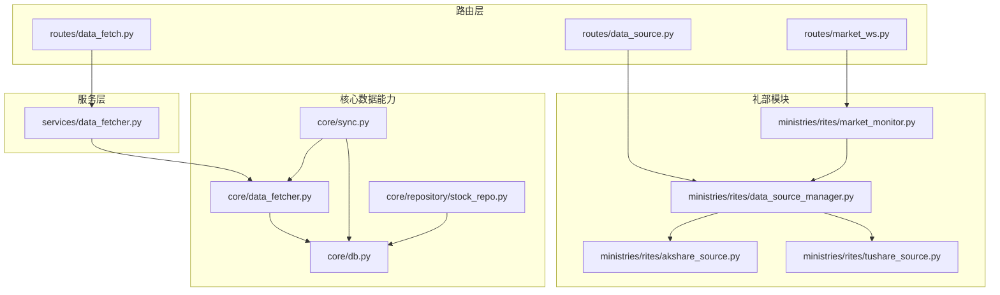
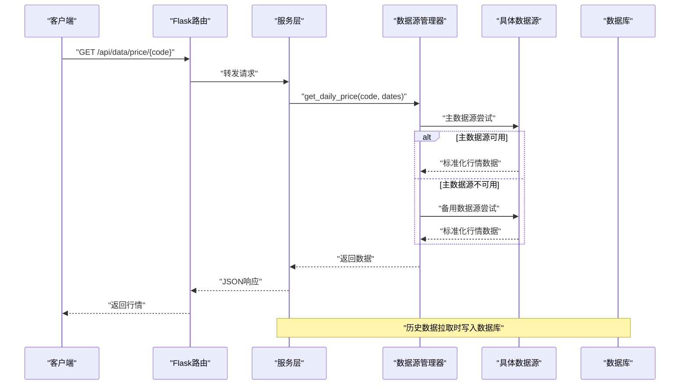
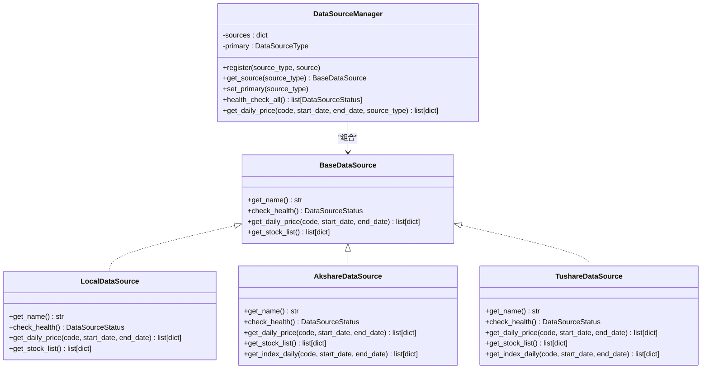
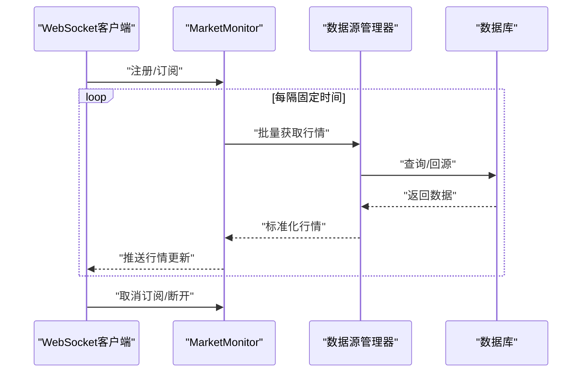
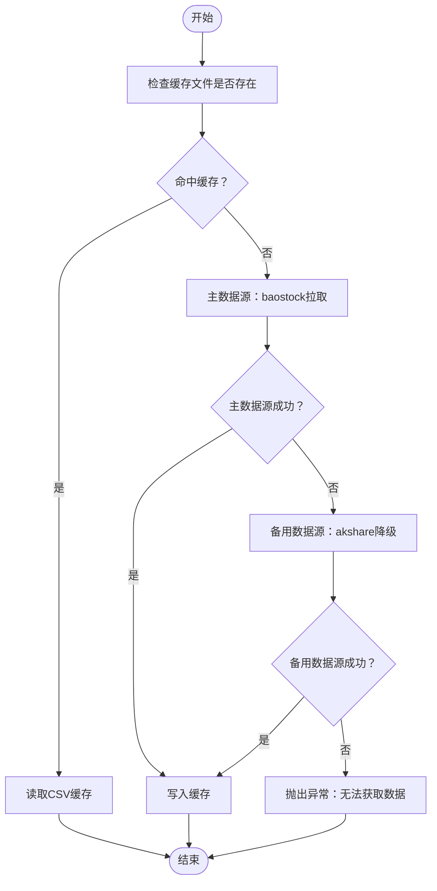
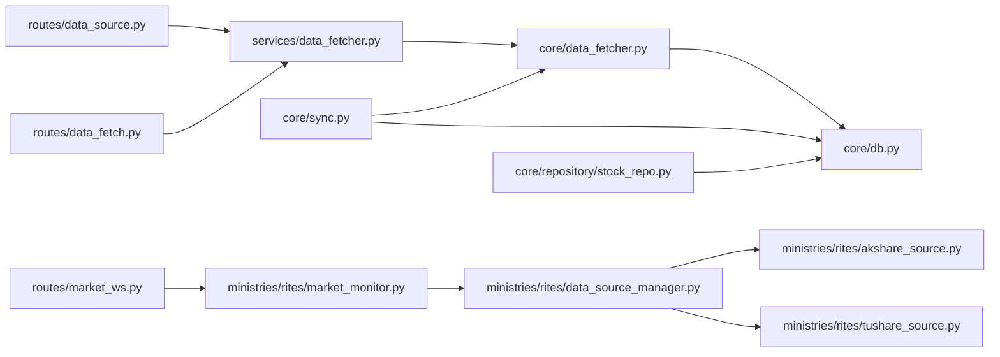

# 礼部（数据服务）

<cite>
**本文引用的文件**
- [ministries/rites/__init__.py](file://ministries/rites/__init__.py)
- [ministries/rites/data_source_manager.py](file://ministries/rites/data_source_manager.py)
- [ministries/rites/akshare_source.py](file://ministries/rites/akshare_source.py)
- [ministries/rites/tushare_source.py](file://ministries/rites/tushare_source.py)
- [ministries/rites/market_monitor.py](file://ministries/rites/market_monitor.py)
- [routes/data_source.py](file://routes/data_source.py)
- [routes/data_fetch.py](file://routes/data_fetch.py)
- [routes/market_ws.py](file://routes/market_ws.py)
- [services/data_fetcher.py](file://services/data_fetcher.py)
- [core/data_fetcher.py](file://core/data_fetcher.py)
- [core/db.py](file://core/db.py)
- [core/sync.py](file://core/sync.py)
- [core/repository/stock_repo.py](file://core/repository/stock_repo.py)
</cite>

## 目录
1. [简介](#简介)
2. [项目结构](#项目结构)
3. [核心组件](#核心组件)
4. [架构总览](#架构总览)
5. [详细组件分析](#详细组件分析)
6. [依赖分析](#依赖分析)
7. [性能考量](#性能考量)
8. [故障排查指南](#故障排查指南)
9. [结论](#结论)
10. [附录](#附录)

## 简介
本文件面向AIQuant系统的“礼部（数据服务）”模块，系统化阐述其在量化交易体系中的定位与职责：多数据源接入与管理、数据清洗与标准化、数据质量监控、数据缓存与分发、实时行情推送、以及与采集、存储、分析环节的数据流关系。同时提供API接口说明、数据源配置示例、数据治理策略、缓存机制、批量处理、增量更新与数据版本管理建议。

## 项目结构
礼部模块位于ministries/rites目录，围绕数据源抽象、具体数据源适配器、数据源管理器、实时行情监控、以及与Flask路由的集成展开；核心数据能力由core子模块提供，包括历史数据获取、数据库持久化、同步与策略评分写入、缓存与指数数据等；服务层提供对外API路由，统一暴露数据服务能力。

图示来源
- [routes/data_source.py](file://routes/data_source.py)
- [routes/data_fetch.py](file://routes/data_fetch.py)
- [routes/market_ws.py](file://routes/market_ws.py)
- [services/data_fetcher.py](file://services/data_fetcher.py)
- [ministries/rites/data_source_manager.py](file://ministries/rites/data_source_manager.py)
- [ministries/rites/akshare_source.py](file://ministries/rites/akshare_source.py)
- [ministries/rites/tushare_source.py](file://ministries/rites/tushare_source.py)
- [ministries/rites/market_monitor.py](file://ministries/rites/market_monitor.py)
- [core/data_fetcher.py](file://core/data_fetcher.py)
- [core/db.py](file://core/db.py)
- [core/sync.py](file://core/sync.py)
- [core/repository/stock_repo.py](file://core/repository/stock_repo.py)

章节来源
- [ministries/rites/__init__.py](file://ministries/rites/__init__.py)
- [routes/data_source.py](file://routes/data_source.py)
- [routes/data_fetch.py](file://routes/data_fetch.py)
- [routes/market_ws.py](file://routes/market_ws.py)
- [services/data_fetcher.py](file://services/data_fetcher.py)
- [core/data_fetcher.py](file://core/data_fetcher.py)
- [core/db.py](file://core/db.py)
- [core/sync.py](file://core/sync.py)
- [core/repository/stock_repo.py](file://core/repository/stock_repo.py)

## 核心组件
- 数据源抽象与管理
  - 抽象基类定义统一接口，便于扩展新数据源。
  - 管理器负责注册、主备切换、健康检查、统一数据获取。
- 多数据源适配器
  - Akshare与Tushare适配器，负责标准化字段与格式。
  - 本地数据库适配器，提供离线与高可用能力。
- 实时行情监控
  - WebSocket客户端管理、订阅维护、定时批量拉取与推送。
- 数据服务API
  - 数据源管理、健康检查、主数据源切换、行情查询。
  - 数据拉取与批量拉取、状态查询。
  - WebSocket行情连接、状态查询、启停控制。
- 核心数据能力
  - 历史数据获取（主/备数据源）、缓存、指数数据、市值数据、策略评分写入。
  - 数据库Schema、Upsert、索引、统计查询。
  - 同步模块：初始化历史、增量同步、策略评分计算、指数同步、断点续传与缓存。

章节来源
- [ministries/rites/data_source_manager.py](file://ministries/rites/data_source_manager.py)
- [ministries/rites/akshare_source.py](file://ministries/rites/akshare_source.py)
- [ministries/rites/tushare_source.py](file://ministries/rites/tushare_source.py)
- [ministries/rites/market_monitor.py](file://ministries/rites/market_monitor.py)
- [routes/data_source.py](file://routes/data_source.py)
- [routes/data_fetch.py](file://routes/data_fetch.py)
- [routes/market_ws.py](file://routes/market_ws.py)
- [services/data_fetcher.py](file://services/data_fetcher.py)
- [core/data_fetcher.py](file://core/data_fetcher.py)
- [core/db.py](file://core/db.py)
- [core/sync.py](file://core/sync.py)

## 架构总览
数据服务采用“路由层-服务层-礼部模块-核心数据能力”的分层设计，通过抽象数据源与管理器实现多数据源统一接入与降级切换；服务层封装历史数据拉取与批量处理；核心模块提供数据库持久化、缓存、同步与策略评分；实时监控通过WebSocket向订阅者推送最新行情。

图示来源
- [routes/data_source.py](file://routes/data_source.py)
- [services/data_fetcher.py](file://services/data_fetcher.py)
- [ministries/rites/data_source_manager.py](file://ministries/rites/data_source_manager.py)
- [ministries/rites/akshare_source.py](file://ministries/rites/akshare_source.py)
- [ministries/rites/tushare_source.py](file://ministries/rites/tushare_source.py)
- [core/db.py](file://core/db.py)

## 详细组件分析

### 数据源管理器与适配器
- 抽象基类BaseDataSource定义统一接口：名称、健康检查、日线行情、股票列表。
- 管理器DataSourceManager负责注册与主备切换、健康检查、统一数据获取。
- 本地数据库适配器LocalDataSource基于核心数据库接口实现。
- Akshare与Tushare适配器分别处理字段标准化、日期格式化、错误处理。
- 数据质量等级与状态对象用于健康检查与监控。

图示来源
- [ministries/rites/data_source_manager.py](file://ministries/rites/data_source_manager.py)
- [ministries/rites/akshare_source.py](file://ministries/rites/akshare_source.py)
- [ministries/rites/tushare_source.py](file://ministries/rites/tushare_source.py)

章节来源
- [ministries/rites/data_source_manager.py](file://ministries/rites/data_source_manager.py)
- [ministries/rites/akshare_source.py](file://ministries/rites/akshare_source.py)
- [ministries/rites/tushare_source.py](file://ministries/rites/tushare_source.py)

### 实时行情监控（MarketMonitor）
- 管理WebSocket连接、订阅列表、客户端生命周期。
- 定时批量拉取行情（分批避免过载），推送至订阅者。
- 提供状态查询、启停控制、系统事件广播。

图示来源
- [ministries/rites/market_monitor.py](file://ministries/rites/market_monitor.py)
- [routes/market_ws.py](file://routes/market_ws.py)
- [ministries/rites/data_source_manager.py](file://ministries/rites/data_source_manager.py)
- [core/db.py](file://core/db.py)

章节来源
- [ministries/rites/market_monitor.py](file://ministries/rites/market_monitor.py)
- [routes/market_ws.py](file://routes/market_ws.py)

### 数据服务API
- 数据源管理API
  - GET /api/data/sources：列出数据源及健康状态
  - GET /api/data/health：全量健康检查
  - POST /api/data/switch：切换主数据源
  - GET /api/data/price/<code>：按参数自动选择数据源获取行情
- 数据拉取API
  - POST /api/data/fetch：单只股票拉取
  - POST /api/data/fetch_batch：批量拉取或按数据库现有股票列表更新
  - GET /api/data/fetch/status：查询数据库数据概况
- 实时行情API
  - WS /ws/market：行情WebSocket
  - GET /api/market/status：监控状态
  - GET /api/market/clients：客户端列表
  - POST /api/market/start/stop：启停推送

章节来源
- [routes/data_source.py](file://routes/data_source.py)
- [routes/data_fetch.py](file://routes/data_fetch.py)
- [routes/market_ws.py](file://routes/market_ws.py)

### 核心数据能力（历史/指数/市值/同步）
- 历史数据获取
  - 主数据源：baostock（免费、稳定、无频率限制）
  - 备用数据源：akshare（多接口降级）
  - 缓存：按日期区间生成缓存文件，命中则直接读取
- 指数数据与市值数据
  - 指数：支持沪深300/中证500/中证1000等
  - 市值：通过换手率反推流通股本
- 数据库与Upsert
  - daily_price、index_daily、stock_info等表
  - Upsert策略评分与行情数据分离写入
- 同步模块
  - 初始化历史：断点续传、过滤ST/退市/北交所
  - 增量同步：单线程（baostock登录限制），支持覆盖率阈值与缓存
  - 策略评分：融合5策略评分并批量写入
  - 指数同步：每日同步主要指数

图示来源
- [core/data_fetcher.py](file://core/data_fetcher.py)

章节来源
- [core/data_fetcher.py](file://core/data_fetcher.py)
- [core/db.py](file://core/db.py)
- [core/sync.py](file://core/sync.py)
- [core/repository/stock_repo.py](file://core/repository/stock_repo.py)

## 依赖分析
- 路由层依赖服务层与礼部模块，提供统一HTTP接口。
- 服务层依赖核心数据能力，封装批量与单次拉取逻辑。
- 礼部模块依赖核心数据能力以实现数据库读写与历史数据获取。
- 核心模块内部自洽，通过db与data_fetcher协作，同步模块贯穿历史与增量流程。

图示来源
- [routes/data_source.py](file://routes/data_source.py)
- [routes/data_fetch.py](file://routes/data_fetch.py)
- [routes/market_ws.py](file://routes/market_ws.py)
- [services/data_fetcher.py](file://services/data_fetcher.py)
- [ministries/rites/data_source_manager.py](file://ministries/rites/data_source_manager.py)
- [ministries/rites/akshare_source.py](file://ministries/rites/akshare_source.py)
- [ministries/rites/tushare_source.py](file://ministries/rites/tushare_source.py)
- [ministries/rites/market_monitor.py](file://ministries/rites/market_monitor.py)
- [core/data_fetcher.py](file://core/data_fetcher.py)
- [core/db.py](file://core/db.py)
- [core/sync.py](file://core/sync.py)
- [core/repository/stock_repo.py](file://core/repository/stock_repo.py)

章节来源
- [routes/data_source.py](file://routes/data_source.py)
- [routes/data_fetch.py](file://routes/data_fetch.py)
- [routes/market_ws.py](file://routes/market_ws.py)
- [services/data_fetcher.py](file://services/data_fetcher.py)
- [ministries/rites/data_source_manager.py](file://ministries/rites/data_source_manager.py)
- [ministries/rites/akshare_source.py](file://ministries/rites/akshare_source.py)
- [ministries/rites/tushare_source.py](file://ministries/rites/tushare_source.py)
- [ministries/rites/market_monitor.py](file://ministries/rites/market_monitor.py)
- [core/data_fetcher.py](file://core/data_fetcher.py)
- [core/db.py](file://core/db.py)
- [core/sync.py](file://core/sync.py)
- [core/repository/stock_repo.py](file://core/repository/stock_repo.py)

## 性能考量
- 主数据源优先：baostock无频率限制，适合全量与增量同步。
- 备用降级：akshare多接口降级，提升可用性。
- 缓存策略：按日期区间生成CSV缓存，减少重复拉取。
- 批量推送：行情监控按批拉取，避免瞬时过载。
- 数据库优化：索引覆盖常用查询，Upsert减少重复写入。
- 同步策略：断点续传与缓存文件，避免重跑；覆盖率阈值控制增量范围。

## 故障排查指南
- 数据源健康检查
  - 使用健康检查接口查看可用性与质量等级。
  - 若全部不可用，检查网络与凭证（如Tushare Token）。
- 行情推送异常
  - 检查WebSocket连接状态与订阅列表。
  - 查看推送线程状态与异常日志。
- 数据拉取失败
  - 确认股票代码格式与日期范围。
  - 检查缓存文件是否损坏，删除后重试。
  - 核对数据库连接与权限。
- 同步中断
  - 断点续传缓存文件存在时，清理后重新同步。
  - 检查交易日判断与覆盖率阈值设置。

章节来源
- [routes/data_source.py](file://routes/data_source.py)
- [routes/market_ws.py](file://routes/market_ws.py)
- [ministries/rites/market_monitor.py](file://ministries/rites/market_monitor.py)
- [core/data_fetcher.py](file://core/data_fetcher.py)
- [core/db.py](file://core/db.py)
- [core/sync.py](file://core/sync.py)

## 结论
礼部模块通过抽象数据源与管理器实现了多数据源统一接入与降级切换，结合核心数据能力与服务层API，提供了从采集、存储到分析的闭环数据服务能力。实时行情监控进一步增强了系统的交互性与可观测性。建议在生产环境强化数据质量校验、完善告警与审计，并持续优化缓存与同步策略以提升整体性能与稳定性。

## 附录

### 数据服务API一览
- 数据源管理
  - GET /api/data/sources：数据源列表与健康状态
  - GET /api/data/health：全量健康检查
  - POST /api/data/switch：切换主数据源（local/akshare/tushare）
  - GET /api/data/price/<code>：获取行情（支持start_date/end_date/source参数）
- 数据拉取
  - POST /api/data/fetch：单只股票拉取（code/days）
  - POST /api/data/fetch_batch：批量拉取（codes/days，留空则按数据库现有股票列表更新）
  - GET /api/data/fetch/status：数据库数据概况
- 实时行情
  - WS /ws/market：订阅/取消订阅/心跳/状态查询
  - GET /api/market/status：监控状态
  - GET /api/market/clients：客户端列表
  - POST /api/market/start：启动推送
  - POST /api/market/stop：停止推送

章节来源
- [routes/data_source.py](file://routes/data_source.py)
- [routes/data_fetch.py](file://routes/data_fetch.py)
- [routes/market_ws.py](file://routes/market_ws.py)

### 数据源配置示例
- 环境变量
  - TUSHARE_TOKEN：Tushare API Token（启用Tushare适配器）
- 数据源类型
  - local：本地数据库
  - akshare：Akshare
  - tushare：Tushare
- 主数据源切换
  - 通过切换接口将主数据源设为local/akshare/tushare之一

章节来源
- [ministries/rites/tushare_source.py](file://ministries/rites/tushare_source.py)
- [routes/data_source.py](file://routes/data_source.py)

### 数据治理策略
- 数据质量
  - 健康检查与质量等级评估
  - 字段标准化与缺失值处理
- 数据一致性
  - Upsert策略评分与行情分离写入
  - 唯一索引约束（code, trade_date）
- 数据版本与演进
  - 表结构迁移与列新增（安全添加）
  - 同步日志记录与统计
- 审计与追踪
  - 审计日志表记录关键操作
  - 风控事件与状态快照

章节来源
- [core/db.py](file://core/db.py)
- [core/sync.py](file://core/sync.py)

### 数据缓存机制
- 历史数据缓存
  - 缓存目录：data_cache
  - 文件命名：{code}_{adjust}_{start_date}_{end_date}.csv
  - 命中条件：文件存在且行数大于阈值
- 同步缓存
  - 断点续传：.sync_cache目录下JSON缓存
  - 清理策略：全部完成后清除，部分完成后保留

章节来源
- [core/data_fetcher.py](file://core/data_fetcher.py)
- [core/sync.py](file://core/sync.py)

### 批量处理与增量更新
- 批量处理
  - 服务层批量拉取与进度回调
  - 分批推送实时行情
- 增量更新
  - 同步模块单线程登录，按覆盖率阈值确定增量范围
  - 断点续传与缓存文件配合

章节来源
- [services/data_fetcher.py](file://services/data_fetcher.py)
- [ministries/rites/market_monitor.py](file://ministries/rites/market_monitor.py)
- [core/sync.py](file://core/sync.py)

### 数据标准化与清洗
- 字段标准化
  - 日线：trade_date/open/high/low/close/volume/amount/pct_change/turnover
  - 指数：同上
- 数据清洗
  - 缺失值处理与数值类型转换
  - 过滤无效数据（如close<=0）

章节来源
- [ministries/rites/akshare_source.py](file://ministries/rites/akshare_source.py)
- [ministries/rites/tushare_source.py](file://ministries/rites/tushare_source.py)
- [core/data_fetcher.py](file://core/data_fetcher.py)