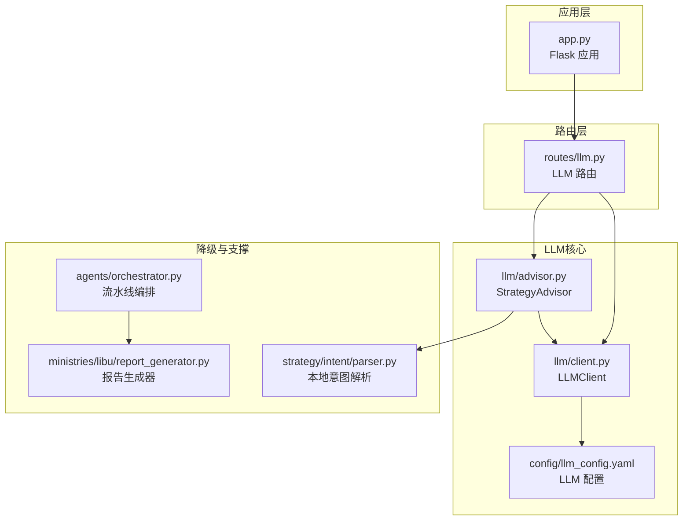
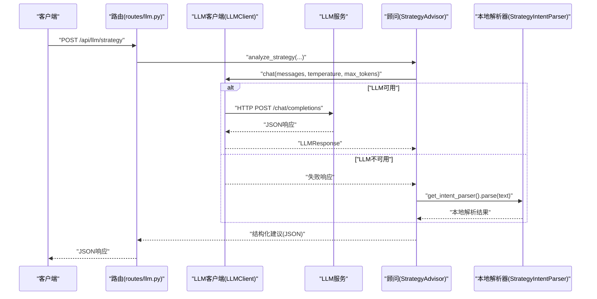
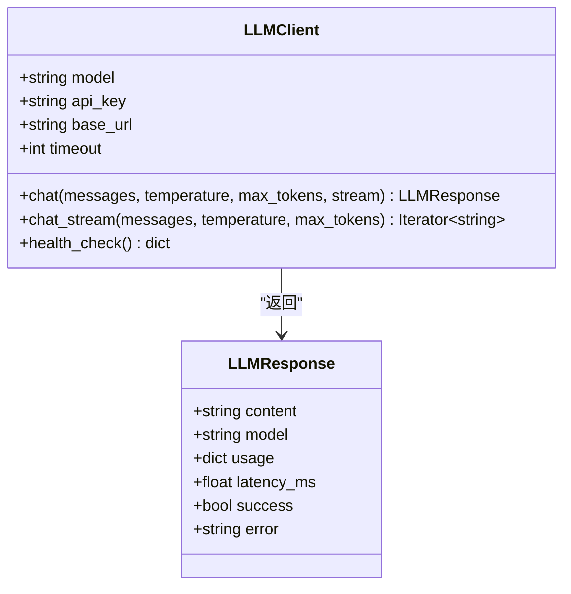
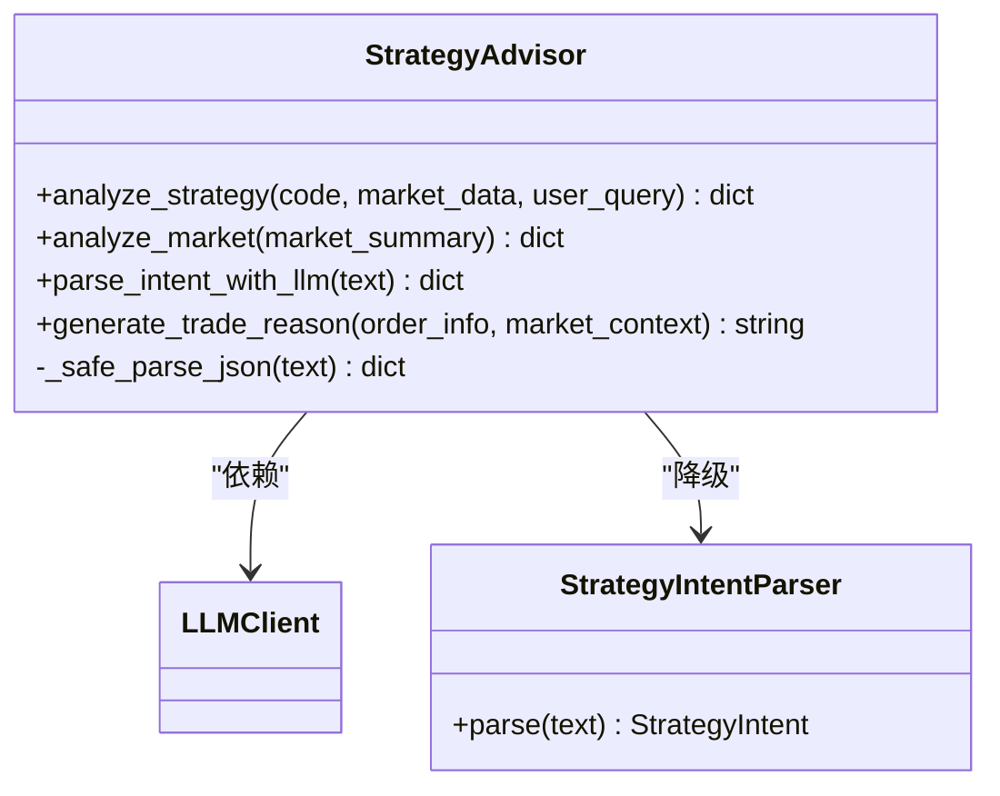
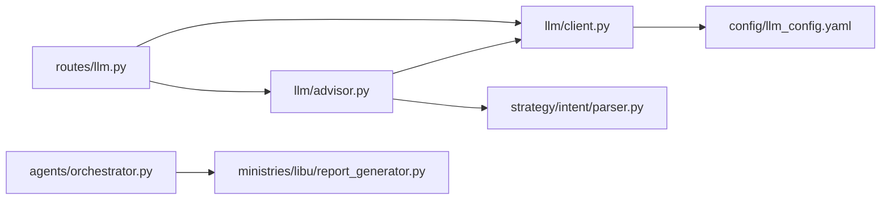

# 大语言模型集成

<cite>
**本文引用的文件列表**
- [llm/__init__.py](file://llm/__init__.py)
- [llm/client.py](file://llm/client.py)
- [llm/advisor.py](file://llm/advisor.py)
- [config/llm_config.yaml](file://config/llm_config.yaml)
- [routes/llm.py](file://routes/llm.py)
- [strategy/intent/parser.py](file://strategy/intent/parser.py)
- [ministries/libu/report_generator.py](file://ministries/libu/report_generator.py)
- [agents/orchestrator.py](file://agents/orchestrator.py)
- [app.py](file://app.py)
</cite>

## 目录
1. [简介](#简介)
2. [项目结构](#项目结构)
3. [核心组件](#核心组件)
4. [架构总览](#架构总览)
5. [组件详解](#组件详解)
6. [依赖关系分析](#依赖关系分析)
7. [性能与成本优化](#性能与成本优化)
8. [安全与合规](#安全与合规)
9. [扩展与新模型接入](#扩展与新模型接入)
10. [交互式问答与对话管理](#交互式问答与对话管理)
11. [报告生成功能](#报告生成功能)
12. [故障排查指南](#故障排查指南)
13. [结论](#结论)

## 简介
本文件面向AIQuant项目的大语言模型（LLM）集成，系统性阐述LLM配置与使用、智能决策支持（策略建议、风险评估、投资咨询）、报告生成、交互式问答与对话管理、性能优化与成本控制、错误处理、扩展与新模型接入、以及数据隐私与合规要求，并提供最佳实践与故障排查指导。目标是帮助开发者与使用者快速理解并正确使用LLM能力，同时保障系统稳定性与安全性。

## 项目结构
LLM相关能力主要分布在以下模块：
- llm：统一LLM客户端与策略顾问
- config：LLM配置文件（模型、API Key、Base URL、默认参数、功能开关）
- routes：LLM对外HTTP接口（聊天、流式对话、策略分析、市场分析、意图解析、健康检查、模型列表）
- strategy/intent：本地策略意图解析（作为LLM降级路径）
- ministries/libu：报告生成器（HTML）
- agents：多Agent流水线编排（与LLM结合的策略执行链路）
- app：Flask应用入口，注册LLM蓝图

图表来源
- [app.py:35](file://app.py#L35)
- [routes/llm.py:21](file://routes/llm.py#L21)
- [llm/client.py:70](file://llm/client.py#L70)
- [llm/advisor.py:79](file://llm/advisor.py#L79)
- [config/llm_config.yaml:5](file://config/llm_config.yaml#L5)
- [strategy/intent/parser.py:34](file://strategy/intent/parser.py#L34)
- [ministries/libu/report_generator.py:13](file://ministries/libu/report_generator.py#L13)
- [agents/orchestrator.py:36](file://agents/orchestrator.py#L36)

章节来源
- [app.py:35](file://app.py#L35)
- [routes/llm.py:21](file://routes/llm.py#L21)
- [llm/client.py:70](file://llm/client.py#L70)
- [llm/advisor.py:79](file://llm/advisor.py#L79)
- [config/llm_config.yaml:5](file://config/llm_config.yaml#L5)
- [strategy/intent/parser.py:34](file://strategy/intent/parser.py#L34)
- [ministries/libu/report_generator.py:13](file://ministries/libu/report_generator.py#L13)
- [agents/orchestrator.py:36](file://agents/orchestrator.py#L36)

## 核心组件
- LLMClient：统一封装OpenAI兼容API，支持多模型切换、流式输出、健康检查、异常降级与统计。
- StrategyAdvisor：策略顾问，提供策略建议、市场分析、意图解析增强、交易理由生成，并在LLM不可用时回退到本地解析器。
- 配置中心：config/llm_config.yaml，集中管理模型、API Key、Base URL、默认参数与功能开关。
- 路由接口：routes/llm.py，提供通用对话、流式对话、策略分析、市场分析、意图解析、健康检查、模型列表等REST接口。
- 本地降级：strategy/intent/parser.py，当LLM失败时提供稳定的本地解析能力。
- 报告生成：ministries/libu/report_generator.py，生成HTML格式的持仓、交易、风控与综合日报。
- 流水线编排：agents/orchestrator.py，将LLM能力融入策略执行链路（数据采集、信号生成、回测与风控、报表生成）。

章节来源
- [llm/client.py:39](file://llm/client.py#L39)
- [llm/advisor.py:21](file://llm/advisor.py#L21)
- [config/llm_config.yaml:1](file://config/llm_config.yaml#L1)
- [routes/llm.py:1](file://routes/llm.py#L1)
- [strategy/intent/parser.py:34](file://strategy/intent/parser.py#L34)
- [ministries/libu/report_generator.py:13](file://ministries/libu/report_generator.py#L13)
- [agents/orchestrator.py:36](file://agents/orchestrator.py#L36)

## 架构总览
LLM集成采用“路由-客户端-顾问-降级”的分层设计：
- 路由层接收请求，构造消息与参数，调用LLM客户端或顾问。
- 客户端负责与第三方LLM服务通信，处理异常与统计。
- 顾问负责业务语义化处理（策略建议、市场分析、意图解析），并在必要时回退到本地解析器。
- 本地解析器保证在LLM不可用时仍能提供基本能力。
- 报告生成器与流水线编排器将LLM输出整合进系统工作流。

图表来源
- [routes/llm.py:72](file://routes/llm.py#L72)
- [llm/advisor.py:82](file://llm/advisor.py#L82)
- [llm/client.py:97](file://llm/client.py#L97)
- [strategy/intent/parser.py:80](file://strategy/intent/parser.py#L80)

## 组件详解

### LLM客户端（LLMClient）
- 职责
  - 封装OpenAI兼容API，支持自定义base_url与api_key。
  - 内置多模型预设（gpt-4o、deepseek-chat、moonshot-v1、qwen-plus等），可通过模型别名自动填充base_url。
  - 支持非流式与流式对话，返回统一的LLMResponse对象，包含content、usage、latency_ms、success、error。
  - 健康检查：简单测试以验证连接与可用性。
  - 异常降级：当未配置或调用异常时返回友好错误信息。
- 关键特性
  - 配置优先级：环境变量 > config/llm_config.yaml > 代码默认值。
  - 请求超时控制与统计。
  - Session复用减少连接开销。

图表来源
- [llm/client.py:28](file://llm/client.py#L28)
- [llm/client.py:39](file://llm/client.py#L39)

章节来源
- [llm/client.py:70](file://llm/client.py#L70)
- [llm/client.py:97](file://llm/client.py#L97)
- [llm/client.py:160](file://llm/client.py#L160)
- [llm/client.py:212](file://llm/client.py#L212)

### 策略顾问（StrategyAdvisor）
- 职责
  - 策略建议：基于个股数据与用户查询，输出结构化建议（推荐方向、置信度、理由、风险因子、建议仓位、时间周期）。
  - 市场分析：基于市场摘要输出情绪、热点板块、冷门板块、关键事件与操作建议。
  - 意图解析增强：将自然语言策略描述解析为结构化条件，失败时回退到本地解析器。
  - 交易理由生成：为订单生成简洁理由说明。
- 降级机制
  - 当LLM调用失败时，自动使用本地解析器（StrategyIntentParser）进行解析，并标记fallback字段与原因。

图表来源
- [llm/advisor.py:21](file://llm/advisor.py#L21)
- [strategy/intent/parser.py:34](file://strategy/intent/parser.py#L34)

章节来源
- [llm/advisor.py:82](file://llm/advisor.py#L82)
- [llm/advisor.py:113](file://llm/advisor.py#L113)
- [llm/advisor.py:139](file://llm/advisor.py#L139)
- [llm/advisor.py:168](file://llm/advisor.py#L168)
- [llm/advisor.py:189](file://llm/advisor.py#L189)
- [strategy/intent/parser.py:80](file://strategy/intent/parser.py#L80)

### 配置中心（config/llm_config.yaml）
- 模型与凭据
  - model：默认模型（支持预设别名）。
  - api_key：API Key（建议通过环境变量注入，避免硬编码）。
  - base_url：服务地址；若使用预设模型可留空，自动填充。
- 默认参数
  - default_temperature、default_max_tokens、timeout。
- 功能开关
  - enabled、enhanced_intent_parsing、auto_trade_reason、market_analysis。

章节来源
- [config/llm_config.yaml:1](file://config/llm_config.yaml#L1)
- [config/llm_config.yaml:5](file://config/llm_config.yaml#L5)
- [config/llm_config.yaml:14](file://config/llm_config.yaml#L14)
- [config/llm_config.yaml:19](file://config/llm_config.yaml#L19)

### 路由接口（routes/llm.py）
- 端点
  - POST /api/llm/chat：通用对话。
  - POST /api/llm/stream：流式对话（SSE）。
  - POST /api/llm/strategy：策略分析。
  - POST /api/llm/market：市场情绪分析。
  - POST /api/llm/intent：LLM增强意图解析。
  - GET /api/llm/health：健康检查。
  - GET /api/llm/models：列出支持的模型。
- 特性
  - 支持动态指定model覆盖默认配置。
  - 返回统一结构，包含success、content、model、usage、latency_ms、error等。

章节来源
- [routes/llm.py:24](file://routes/llm.py#L24)
- [routes/llm.py:49](file://routes/llm.py#L49)
- [routes/llm.py:72](file://routes/llm.py#L72)
- [routes/llm.py:88](file://routes/llm.py#L88)
- [routes/llm.py:99](file://routes/llm.py#L99)
- [routes/llm.py:113](file://routes/llm.py#L113)
- [routes/llm.py:121](file://routes/llm.py#L121)

### 本地意图解析（strategy/intent/parser.py）
- 职责
  - 将自然语言策略描述解析为结构化条件配置，支持常见策略模式（超跌反弹、放量突破、趋势跟踪、均值回归、动量）。
  - 提取参数（天数、幅度、量比、RSI阈值等），构建可执行的策略条件。
  - 生成解释文本与置信度。
- 降级路径
  - 当LLM解析失败时，StrategyAdvisor自动回退到此解析器，保证系统可用性。

章节来源
- [strategy/intent/parser.py:80](file://strategy/intent/parser.py#L80)
- [strategy/intent/parser.py:152](file://strategy/intent/parser.py#L152)
- [strategy/intent/parser.py:267](file://strategy/intent/parser.py#L267)

### 报告生成器（ministries/libu/report_generator.py）
- 职责
  - 生成HTML格式的报告：持仓报告、交易报告、风控报告、综合日报。
  - 主题化样式，支持打印与移动端适配。
- 与LLM的关系
  - 可将LLM生成的分析结果（如策略建议、市场分析、交易理由）整合进报告内容。

章节来源
- [ministries/libu/report_generator.py:27](file://ministries/libu/report_generator.py#L27)
- [ministries/libu/report_generator.py:174](file://ministries/libu/report_generator.py#L174)

### 流水线编排（agents/orchestrator.py）
- 职责
  - 管理三省六部制流水线：数据官→策略官→回测官/风控官→报表官。
  - 支持串行与并行执行，错误处理与重试，状态持久化。
  - 门下省风控拦截：若风控结果为BLOCK，则跳过报表官。
- 与LLM的关系
  - 可在策略官阶段调用LLM进行策略增强解析或生成理由，再进入回测与风控阶段。

章节来源
- [agents/orchestrator.py:81](file://agents/orchestrator.py#L81)
- [agents/orchestrator.py:140](file://agents/orchestrator.py#L140)

## 依赖关系分析
- 模块耦合
  - routes依赖llm.client与llm.advisor。
  - llm.advisor依赖llm.client与strategy.intent.parser。
  - llm.client依赖config/llm_config.yaml。
  - 报告生成器与流水线编排器独立存在，可与LLM输出集成。
- 外部依赖
  - requests（HTTP客户端）、yaml（配置解析）、Flask（路由）、SSE（流式输出）。
- 循环依赖
  - 未发现循环依赖；各模块职责清晰，通过单例与函数接口解耦。

图表来源
- [routes/llm.py:18](file://routes/llm.py#L18)
- [llm/client.py:70](file://llm/client.py#L70)
- [llm/advisor.py:79](file://llm/advisor.py#L79)
- [strategy/intent/parser.py:34](file://strategy/intent/parser.py#L34)
- [agents/orchestrator.py:36](file://agents/orchestrator.py#L36)
- [ministries/libu/report_generator.py:13](file://ministries/libu/report_generator.py#L13)

## 性能与成本优化
- 模型与参数
  - 使用合适的模型别名与base_url，避免重复配置。
  - 控制temperature与max_tokens，降低Token消耗与延迟。
- 超时与重试
  - 合理设置timeout，避免长时间阻塞；在上层逻辑中实现有限重试。
- 流式输出
  - 在需要实时反馈的场景使用流式对话，提升用户体验。
- 会话复用
  - LLMClient内部使用requests.Session，减少TCP握手开销。
- 降级策略
  - LLM失败时回退本地解析器，保障系统可用性与性能稳定。
- 成本控制
  - 通过配置文件集中管理API Key与模型，避免硬编码导致的泄露与误用。
  - 在生产环境使用环境变量注入敏感信息。

章节来源
- [llm/client.py:70](file://llm/client.py#L70)
- [llm/client.py:97](file://llm/client.py#L97)
- [llm/client.py:160](file://llm/client.py#L160)
- [llm/client.py:212](file://llm/client.py#L212)
- [config/llm_config.yaml:7](file://config/llm_config.yaml#L7)
- [config/llm_config.yaml:14](file://config/llm_config.yaml#L14)

## 安全与合规
- 数据隐私
  - 配置文件中避免存储真实API Key；优先通过环境变量注入。
  - 对外接口返回内容需遵循最小披露原则，避免泄露内部细节。
- 访问控制
  - 在网关或反向代理层添加鉴权与限流策略。
- 日志与审计
  - 记录关键调用（模型、耗时、错误码），但避免记录敏感参数。
- 合规要求
  - 明确提示报告仅供参考，不构成投资建议。
  - 对涉及个人数据的处理遵循相关法规。

章节来源
- [config/llm_config.yaml:7](file://config/llm_config.yaml#L7)
- [ministries/libu/report_generator.py:213](file://ministries/libu/report_generator.py#L213)

## 扩展与新模型接入
- 新增模型
  - 在LLMClient.PRESET_MODELS中新增模型别名与base_url映射。
  - 在路由/models接口中同步更新模型列表。
- 自定义base_url与api_key
  - 通过LLMClient构造参数或动态传入model覆盖默认配置。
- 本地降级
  - 保持StrategyAdvisor的降级逻辑不变，确保新模型不可用时仍可工作。

章节来源
- [llm/client.py:42](file://llm/client.py#L42)
- [llm/client.py:70](file://llm/client.py#L70)
- [routes/llm.py:121](file://routes/llm.py#L121)

## 交互式问答与对话管理
- 通用对话
  - 使用POST /api/llm/chat发送messages数组，支持动态温度与Token上限。
- 流式对话
  - 使用POST /api/llm/stream，基于SSE逐字返回增量内容。
- 健康检查
  - 使用GET /api/llm/health检查LLM连接状态与延迟。
- 对话管理
  - 建议在上层应用维护会话上下文（如用户ID、历史消息、当前策略/市场场景），以便顾问生成更贴切的建议。

章节来源
- [routes/llm.py:24](file://routes/llm.py#L24)
- [routes/llm.py:49](file://routes/llm.py#L49)
- [routes/llm.py:113](file://routes/llm.py#L113)

## 报告生成功能
- 报告类型
  - 持仓报告、交易报告、风控报告、综合日报。
- 内容整合
  - 可将LLM生成的策略建议、市场分析、交易理由嵌入报告正文，形成“AI驱动”的综合视图。
- 输出格式
  - HTML模板，主题化样式，支持打印与移动端展示。

章节来源
- [ministries/libu/report_generator.py:27](file://ministries/libu/report_generator.py#L27)
- [ministries/libu/report_generator.py:174](file://ministries/libu/report_generator.py#L174)

## 故障排查指南
- 常见问题
  - 未配置API Key或Base URL：检查config/llm_config.yaml与环境变量。
  - 请求超时：调整timeout或检查网络连通性。
  - HTTP错误：查看错误码与响应体片段，定位上游问题。
  - JSON解析失败：LLM可能返回非标准格式，使用_safe_parse_json容错处理。
- 诊断步骤
  - 使用GET /api/llm/health进行健康检查。
  - 查看LLMResponse.error与latency_ms。
  - 在本地解析器回退路径验证基础功能是否正常。
- 建议
  - 在生产环境启用日志与监控，记录关键指标（成功率、延迟、Token用量）。

章节来源
- [llm/client.py:104](file://llm/client.py#L104)
- [llm/client.py:130](file://llm/client.py#L130)
- [llm/client.py:151](file://llm/client.py#L151)
- [llm/client.py:212](file://llm/client.py#L212)
- [llm/advisor.py:189](file://llm/advisor.py#L189)

## 结论
AIQuant的LLM集成以“统一客户端+策略顾问+本地降级”为核心，既提供了强大的智能决策支持与交互体验，又通过完善的错误处理与配置体系保障了稳定性与安全性。配合报告生成与流水线编排，LLM能力可无缝融入策略研发与运营流程。建议在生产环境中严格管理凭据、合理配置参数、持续监控性能与成本，并在合规前提下提供透明的用户提示。