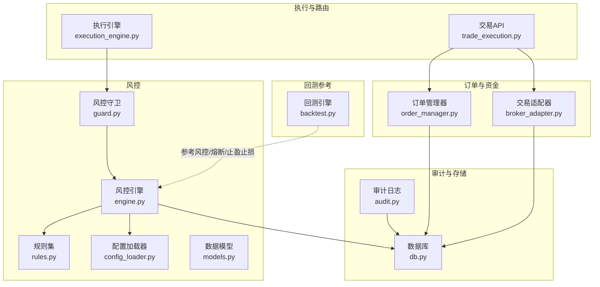
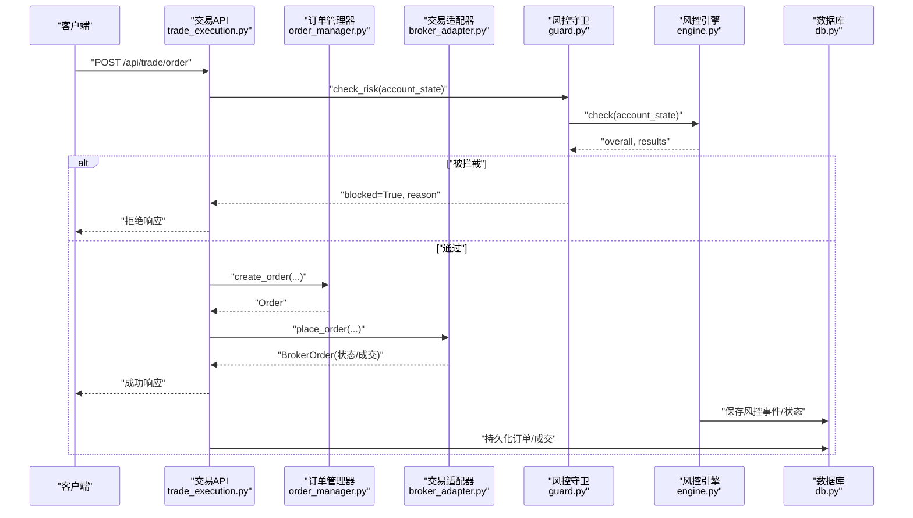
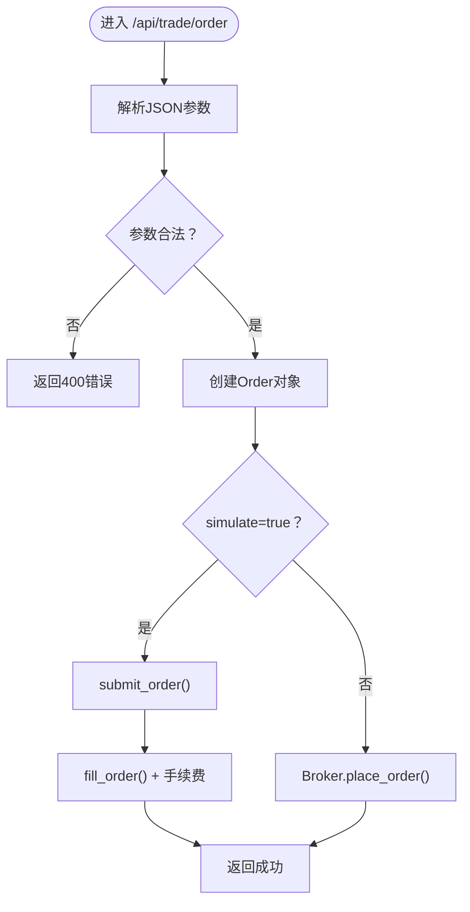
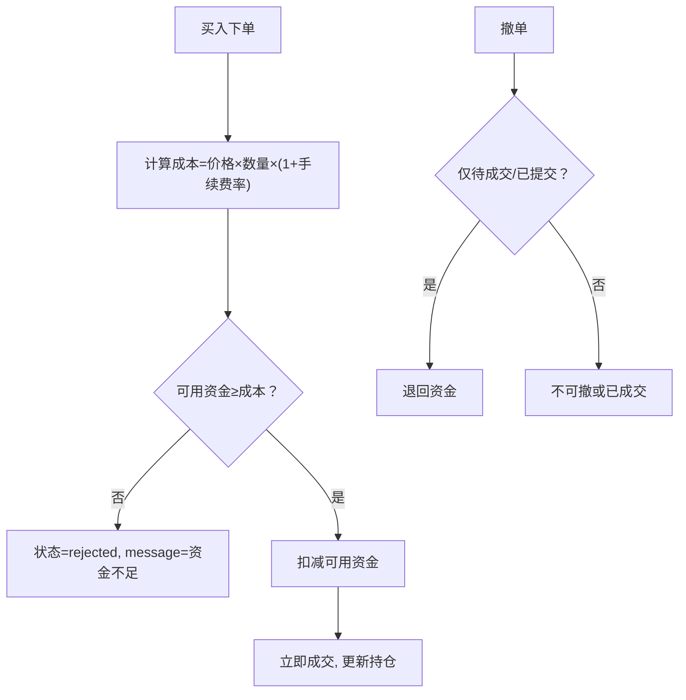
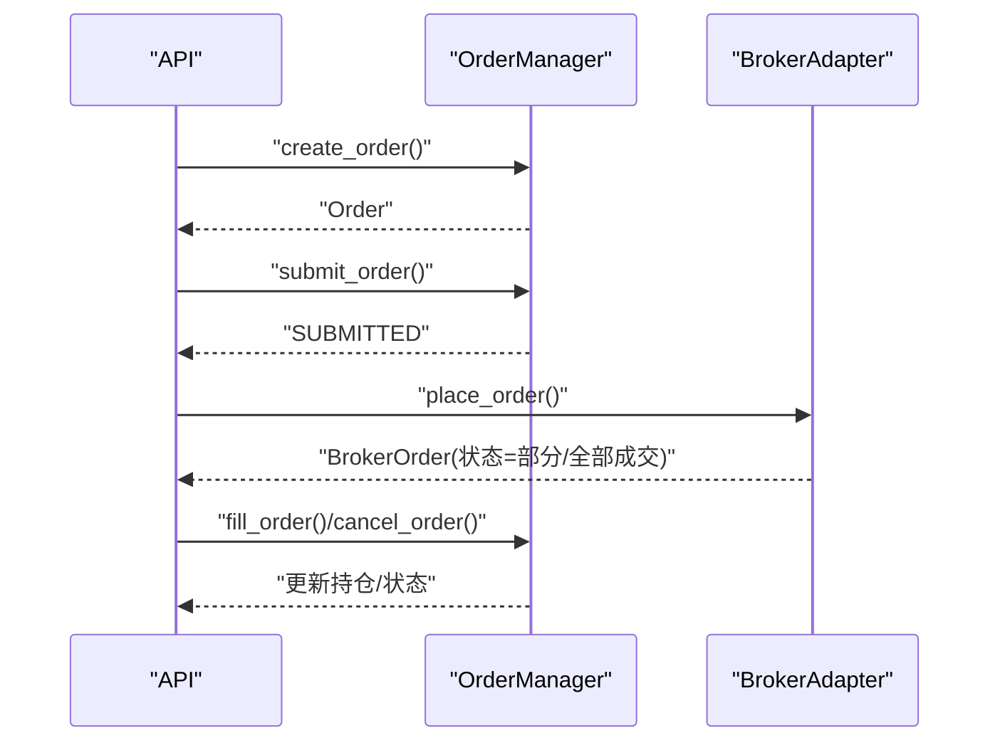
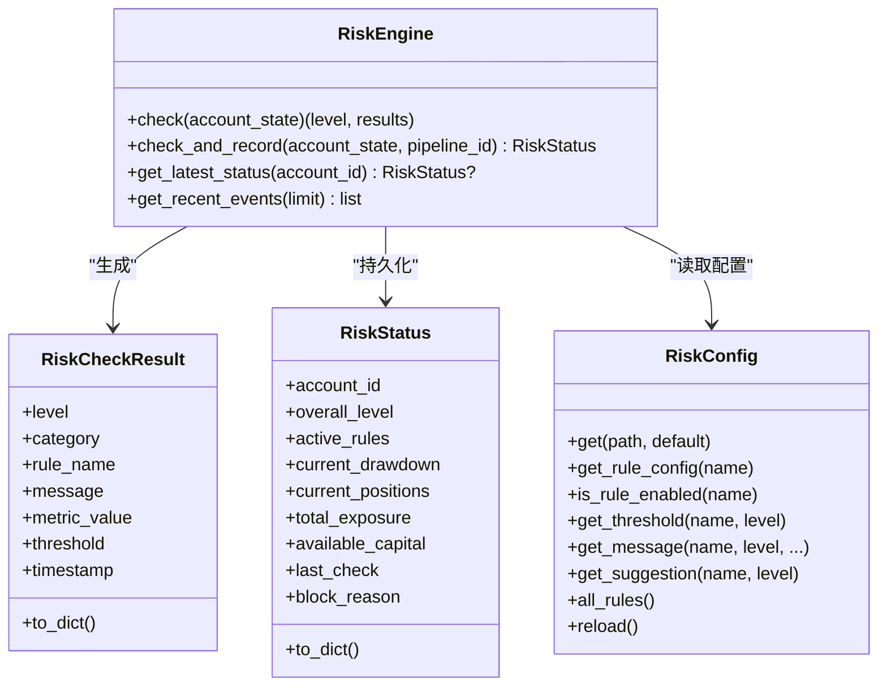
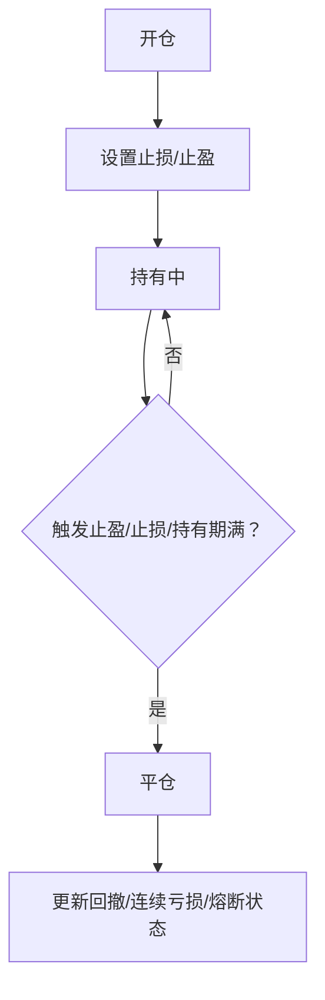
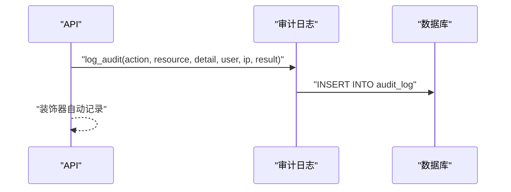
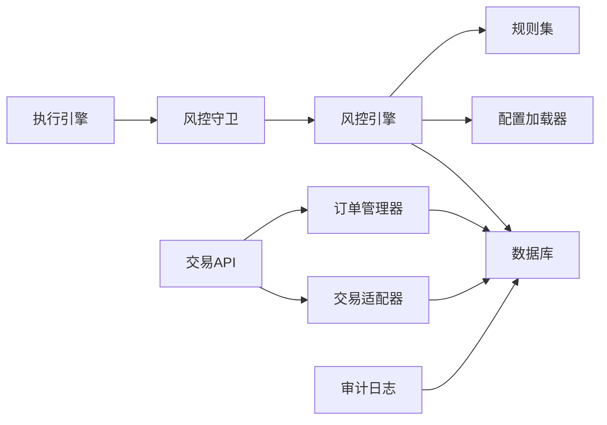

# 交易安全

<cite>
**本文引用的文件**   
- [execution_engine.py](file://governance/secretariat/execution_engine.py)
- [order_manager.py](file://ministries/war/order_manager.py)
- [broker_adapter.py](file://ministries/war/broker_adapter.py)
- [trade_execution.py](file://routes/trade_execution.py)
- [guard.py](file://risk/guard.py)
- [engine.py](file://risk/engine.py)
- [models.py](file://risk/models.py)
- [rules.py](file://risk/rules.py)
- [config_loader.py](file://risk/config_loader.py)
- [audit.py](file://core/audit.py)
- [db.py](file://core/db.py)
- [backtest.py](file://backtest/backtest.py)
</cite>

## 目录
1. [简介](#简介)
2. [项目结构](#项目结构)
3. [核心组件](#核心组件)
4. [架构总览](#架构总览)
5. [详细组件分析](#详细组件分析)
6. [依赖关系分析](#依赖关系分析)
7. [性能考量](#性能考量)
8. [故障排查指南](#故障排查指南)
9. [结论](#结论)
10. [附录](#附录)

## 简介
本文件面向AIQuant系统的交易安全策略，围绕订单验证、资金保障、交易执行、风控集成、审计监控与容错恢复等方面，给出系统化文档。内容覆盖：
- 订单格式检查、价格与数量限制
- 可用余额检查、冻结资金管理与资金流向追踪
- 订单路由安全、执行确认与异常处理
- 风控规则执行、止损止盈保护与仓位管理
- 交易审计与监控、异常交易检测与实时告警
- 容错机制与故障恢复策略
- 安全配置示例与操作规范

## 项目结构
AIQuant采用模块化分层设计，交易安全相关的关键模块分布如下：
- 执行与路由：governance/secretariat（执行引擎）、routes（API路由）
- 订单与资金：ministries/war（订单管理器、交易适配器）
- 风控：risk（规则引擎、守卫、规则集、配置）
- 审计与存储：core（审计日志、数据库）

图表来源
- [execution_engine.py:57-101](file://governance/secretariat/execution_engine.py#L57-L101)
- [trade_execution.py:23-178](file://routes/trade_execution.py#L23-L178)
- [order_manager.py:69-211](file://ministries/war/order_manager.py#L69-L211)
- [broker_adapter.py:134-250](file://ministries/war/broker_adapter.py#L134-L250)
- [guard.py:36-91](file://risk/guard.py#L36-L91)
- [engine.py:13-168](file://risk/engine.py#L13-L168)
- [rules.py:34-387](file://risk/rules.py#L34-L387)
- [config_loader.py:20-131](file://risk/config_loader.py#L20-L131)
- [models.py:11-78](file://risk/models.py#L11-L78)
- [audit.py:16-147](file://core/audit.py#L16-L147)
- [db.py:358-427](file://core/db.py#L358-L427)
- [backtest.py:207-336](file://backtest/backtest.py#L207-L336)

章节来源
- [execution_engine.py:1-101](file://governance/secretariat/execution_engine.py#L1-L101)
- [order_manager.py:1-211](file://ministries/war/order_manager.py#L1-L211)
- [broker_adapter.py:1-413](file://ministries/war/broker_adapter.py#L1-L413)
- [trade_execution.py:1-217](file://routes/trade_execution.py#L1-L217)
- [guard.py:1-92](file://risk/guard.py#L1-L92)
- [engine.py:1-168](file://risk/engine.py#L1-L168)
- [rules.py:1-388](file://risk/rules.py#L1-L388)
- [config_loader.py:1-131](file://risk/config_loader.py#L1-L131)
- [models.py:1-78](file://risk/models.py#L1-L78)
- [audit.py:1-147](file://core/audit.py#L1-L147)
- [db.py:358-427](file://core/db.py#L358-L427)
- [backtest.py:207-336](file://backtest/backtest.py#L207-L336)

## 核心组件
- 执行引擎：接收交易信号，执行风控检查，生成订单并调度执行。
- 订单管理器：订单生命周期管理、成交与撤单、持仓更新与查询。
- 交易适配器：统一下单/撤单/查询接口，支持模拟与实盘切换。
- 风控守卫与引擎：装饰器式风控检查、规则执行与状态持久化。
- 规则集与配置：集中化阈值与消息模板，支持热加载。
- 审计日志：统一记录操作、结果与异常，支持查询与统计。
- 数据库：风控事件、状态、审计日志等持久化。

章节来源
- [execution_engine.py:57-101](file://governance/secretariat/execution_engine.py#L57-L101)
- [order_manager.py:69-211](file://ministries/war/order_manager.py#L69-L211)
- [broker_adapter.py:134-250](file://ministries/war/broker_adapter.py#L134-L250)
- [guard.py:36-91](file://risk/guard.py#L36-L91)
- [engine.py:13-168](file://risk/engine.py#L13-L168)
- [rules.py:34-387](file://risk/rules.py#L34-L387)
- [config_loader.py:20-131](file://risk/config_loader.py#L20-L131)
- [audit.py:16-147](file://core/audit.py#L16-L147)
- [db.py:358-427](file://core/db.py#L358-L427)

## 架构总览
交易安全贯穿“信号→风控→订单→执行→记录”的闭环，关键流程如下：

图表来源
- [trade_execution.py:23-58](file://routes/trade_execution.py#L23-L58)
- [guard.py:77-91](file://risk/guard.py#L77-L91)
- [engine.py:19-71](file://risk/engine.py#L19-L71)
- [order_manager.py:76-91](file://ministries/war/order_manager.py#L76-L91)
- [broker_adapter.py:158-194](file://ministries/war/broker_adapter.py#L158-L194)
- [db.py:358-427](file://core/db.py#L358-L427)

## 详细组件分析

### 订单验证机制
- 参数校验：API层对必填字段、方向、价格与数量进行基础校验，拒绝非法请求。
- 订单结构：统一订单数据结构，包含状态、时间戳、成交细节等。
- 成交确认：模拟/实盘成交后更新订单状态与持仓，并记录手续费。

图表来源
- [trade_execution.py:23-58](file://routes/trade_execution.py#L23-L58)
- [order_manager.py:76-125](file://ministries/war/order_manager.py#L76-L125)
- [broker_adapter.py:158-194](file://ministries/war/broker_adapter.py#L158-L194)

章节来源
- [trade_execution.py:23-58](file://routes/trade_execution.py#L23-L58)
- [order_manager.py:32-125](file://ministries/war/order_manager.py#L32-L125)
- [broker_adapter.py:158-194](file://ministries/war/broker_adapter.py#L158-L194)

### 资金安全保障
- 可用余额检查：模拟交易适配器在买入时计算含手续费成本并与可用资金比较，不足则拒绝。
- 冻结资金管理：模拟适配器在撤单时退回已占用资金；实盘适配器由券商接口负责。
- 资金流向追踪：成交记录包含手续费，账户概览聚合计算总资金、市值与收益。

图表来源
- [broker_adapter.py:175-205](file://ministries/war/broker_adapter.py#L175-L205)
- [trade_execution.py:128-160](file://routes/trade_execution.py#L128-L160)

章节来源
- [broker_adapter.py:134-250](file://ministries/war/broker_adapter.py#L134-L250)
- [trade_execution.py:128-160](file://routes/trade_execution.py#L128-L160)

### 交易执行安全
- 订单路由安全：API层统一入口，参数校验前置，避免脏数据进入后续流程。
- 执行确认：模拟模式自动提交并成交；实盘模式通过适配器对接券商，状态回写。
- 异常处理：风控拦截直接返回；订单状态变更严格遵循生命周期约束。

图表来源
- [trade_execution.py:23-81](file://routes/trade_execution.py#L23-L81)
- [order_manager.py:93-133](file://ministries/war/order_manager.py#L93-L133)
- [broker_adapter.py:284-320](file://ministries/war/broker_adapter.py#L284-L320)

章节来源
- [trade_execution.py:23-81](file://routes/trade_execution.py#L23-L81)
- [order_manager.py:69-133](file://ministries/war/order_manager.py#L69-L133)
- [broker_adapter.py:252-320](file://ministries/war/broker_adapter.py#L252-L320)

### 风险控制集成
- 风控守卫：装饰器自动注入风控检查，若整体级别为“阻断”直接拦截。
- 风控引擎：遍历规则集，取最严格级别，记录事件与状态至数据库。
- 规则集：集中化阈值与消息模板，支持热加载；包含最大回撤、集中度、择时、连续亏损、日频限制、波动率、行业集中度、总仓位、节假日提醒、黑名单等。
- 配置加载：YAML热加载，支持运行时调整规则开关与阈值。

图表来源
- [engine.py:13-168](file://risk/engine.py#L13-L168)
- [models.py:28-78](file://risk/models.py#L28-L78)
- [config_loader.py:20-131](file://risk/config_loader.py#L20-L131)

章节来源
- [guard.py:36-91](file://risk/guard.py#L36-L91)
- [engine.py:13-168](file://risk/engine.py#L13-L168)
- [rules.py:34-387](file://risk/rules.py#L34-L387)
- [config_loader.py:20-131](file://risk/config_loader.py#L20-L131)
- [models.py:11-78](file://risk/models.py#L11-L78)

### 止损止盈与仓位管理
- 回撤熔断：回测模块在策略层面实现回撤熔断与连续亏损计数，作为风控理念参考。
- 止损止盈：订单管理器的持仓结构包含止损/止盈字段，便于策略侧设定与监控。
- 仓位管理：风控规则包含单股集中度、行业集中度、总仓位上限等，防止过度暴露。

图表来源
- [order_manager.py:52-66](file://ministries/war/order_manager.py#L52-L66)
- [backtest.py:207-336](file://backtest/backtest.py#L207-L336)

章节来源
- [order_manager.py:52-66](file://ministries/war/order_manager.py#L52-L66)
- [backtest.py:207-336](file://backtest/backtest.py#L207-L336)

### 交易审计与监控
- 审计日志：统一记录操作、用户、IP、结果与耗时；支持按动作与用户查询。
- 监控指标：可基于审计日志统计当日操作量、动作分布与趋势。
- 风控事件：风控引擎将规则检查结果与状态写入数据库，便于审计与复盘。

图表来源
- [audit.py:16-92](file://core/audit.py#L16-L92)
- [db.py:416-427](file://core/db.py#L416-L427)

章节来源
- [audit.py:16-147](file://core/audit.py#L16-L147)
- [db.py:358-427](file://core/db.py#L358-L427)

### 容错机制与故障恢复
- 数据库事务：上下文管理器封装连接、提交与回滚，保证一致性。
- 风控热加载：配置文件变更自动检测与热加载，无需重启。
- 接口适配：模拟/实盘双通道，便于隔离测试与快速切换。
- 状态持久化：风控状态与事件入库，支持查询与恢复。

章节来源
- [db.py:26-40](file://core/db.py#L26-L40)
- [config_loader.py:58-72](file://risk/config_loader.py#L58-L72)
- [broker_adapter.py:371-413](file://ministries/war/broker_adapter.py#L371-L413)
- [engine.py:51-71](file://risk/engine.py#L51-L71)

## 依赖关系分析
- 执行引擎依赖风控守卫与引擎；API路由依赖订单管理器与交易适配器；风控引擎依赖规则集与配置加载器；审计与风控结果持久化至数据库。

图表来源
- [execution_engine.py:72-80](file://governance/secretariat/execution_engine.py#L72-L80)
- [guard.py:47-48](file://risk/guard.py#L47-L48)
- [engine.py:19-49](file://risk/engine.py#L19-L49)
- [rules.py:376-387](file://risk/rules.py#L376-L387)
- [config_loader.py:73-86](file://risk/config_loader.py#L73-L86)
- [trade_execution.py:23-58](file://routes/trade_execution.py#L23-L58)
- [order_manager.py:76-91](file://ministries/war/order_manager.py#L76-L91)
- [broker_adapter.py:158-194](file://ministries/war/broker_adapter.py#L158-L194)
- [db.py:358-427](file://core/db.py#L358-L427)
- [audit.py:16-39](file://core/audit.py#L16-L39)

章节来源
- [execution_engine.py:57-101](file://governance/secretariat/execution_engine.py#L57-L101)
- [guard.py:36-91](file://risk/guard.py#L36-L91)
- [engine.py:13-168](file://risk/engine.py#L13-L168)
- [rules.py:376-387](file://risk/rules.py#L376-L387)
- [config_loader.py:20-131](file://risk/config_loader.py#L20-L131)
- [trade_execution.py:14-21](file://routes/trade_execution.py#L14-L21)
- [order_manager.py:69-211](file://ministries/war/order_manager.py#L69-L211)
- [broker_adapter.py:134-250](file://ministries/war/broker_adapter.py#L134-L250)
- [audit.py:16-147](file://core/audit.py#L16-L147)
- [db.py:358-427](file://core/db.py#L358-L427)

## 性能考量
- 数据库并发：WAL模式与常规同步策略在性能与可靠性间取得平衡。
- 风控热加载：自动检测文件变更，避免频繁重启带来的业务中断。
- 日志与事件：审计日志与风控事件均建立索引，支持高效查询与统计。

章节来源
- [db.py:26-40](file://core/db.py#L26-L40)
- [config_loader.py:63-72](file://risk/config_loader.py#L63-L72)
- [db.py:371-372](file://core/db.py#L371-L372)

## 故障排查指南
- 订单状态异常：检查订单生命周期方法调用顺序与状态转换条件。
- 资金不足：确认买入成本计算与手续费率，核对可用资金与冻结资金。
- 风控拦截：查看风控结果详情与阻断原因，必要时临时调整阈值或豁免。
- 审计缺失：确认审计装饰器使用与数据库连接状态。
- 配置不生效：确认配置文件路径与权限，触发热加载或重启服务。

章节来源
- [order_manager.py:93-133](file://ministries/war/order_manager.py#L93-L133)
- [broker_adapter.py:175-205](file://ministries/war/broker_adapter.py#L175-L205)
- [guard.py:50-59](file://risk/guard.py#L50-L59)
- [audit.py:50-92](file://core/audit.py#L50-L92)
- [config_loader.py:58-72](file://risk/config_loader.py#L58-L72)

## 结论
AIQuant在交易安全方面形成了“参数校验—风控拦截—订单执行—资金保障—审计追踪—配置热加载”的闭环体系。通过规则集与配置的集中化管理，结合模拟/实盘双通道与完善的审计能力，系统在保障交易安全的同时，具备良好的可运维性与扩展性。

## 附录

### 交易安全配置示例与操作规范
- 风控规则配置（YAML）：建议在配置文件中为每个规则设置启用开关、阈值与提示信息，便于热加载生效。
- 操作规范：
  - 所有外部请求必须经API路由与参数校验。
  - 风控拦截即刻拒绝，不得绕过。
  - 模拟交易用于测试，实盘交易需确认券商适配器状态。
  - 审计日志保留至少90天，定期归档与备份。
  - 配置变更需经审批与验证，优先在测试环境验证。

章节来源
- [config_loader.py:73-126](file://risk/config_loader.py#L73-L126)
- [guard.py:36-74](file://risk/guard.py#L36-L74)
- [audit.py:16-92](file://core/audit.py#L16-L92)
- [broker_adapter.py:371-413](file://ministries/war/broker_adapter.py#L371-L413)