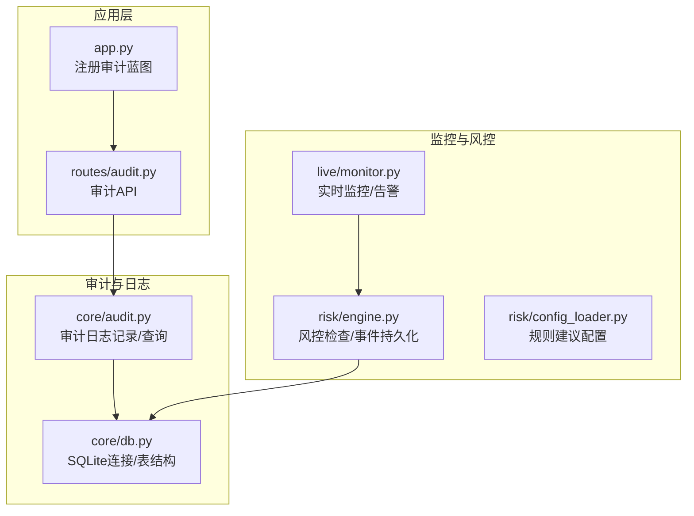
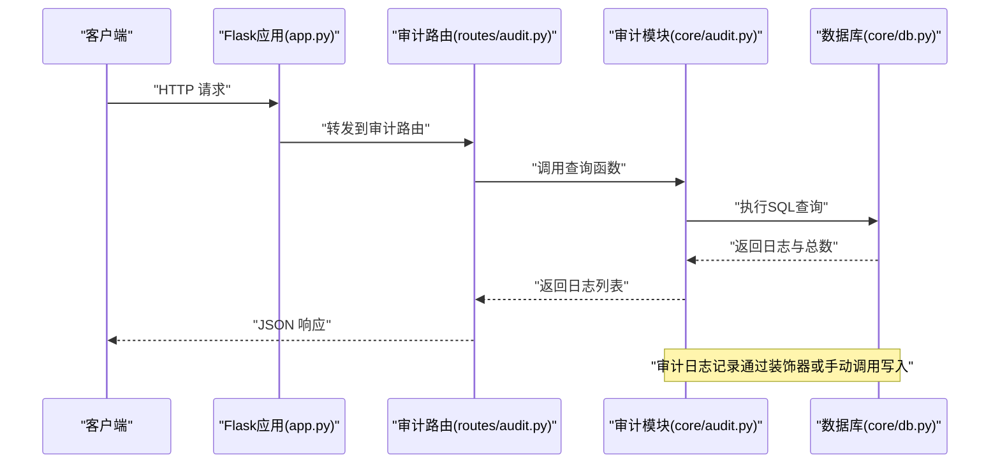
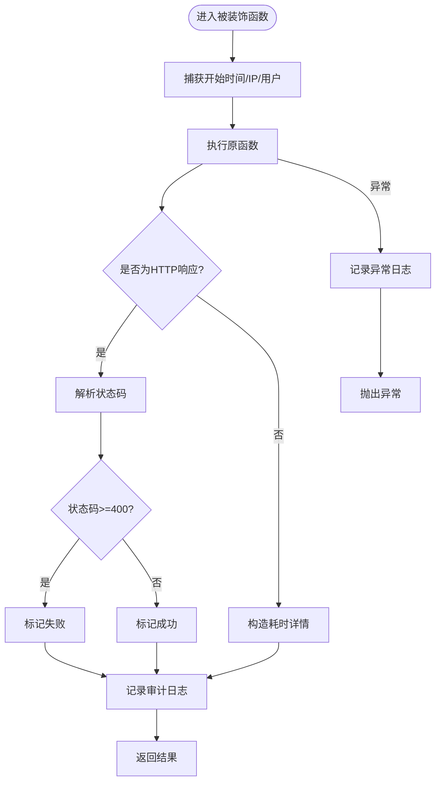
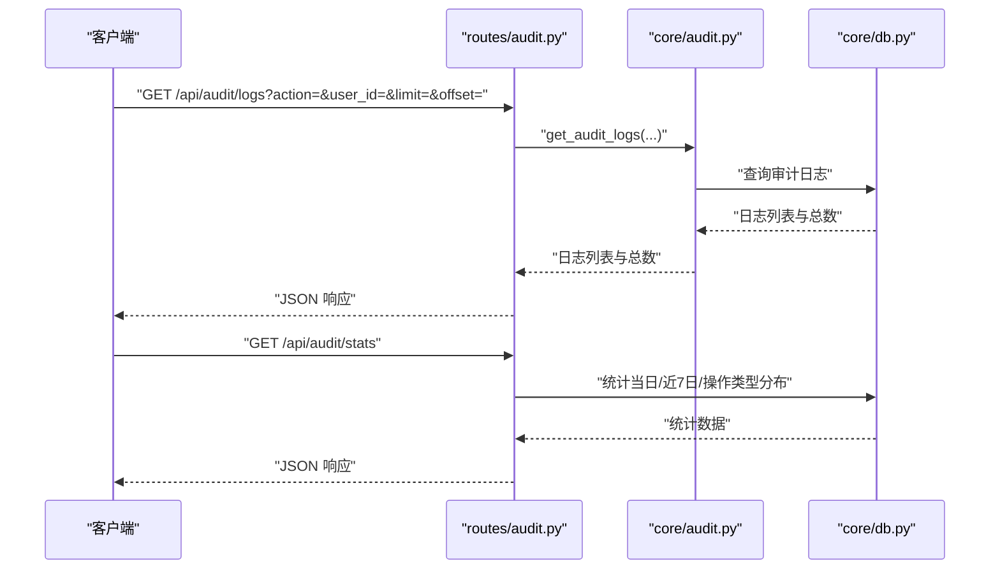
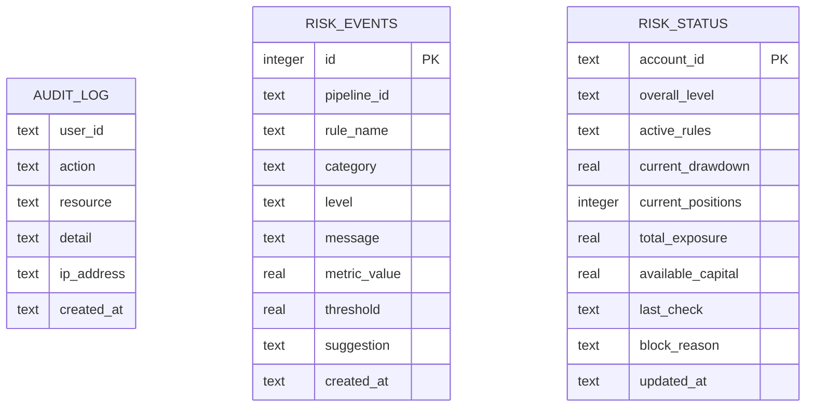
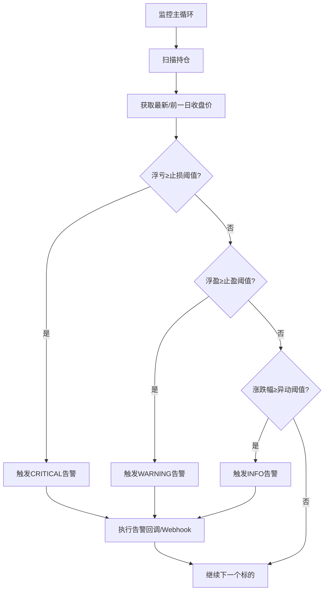
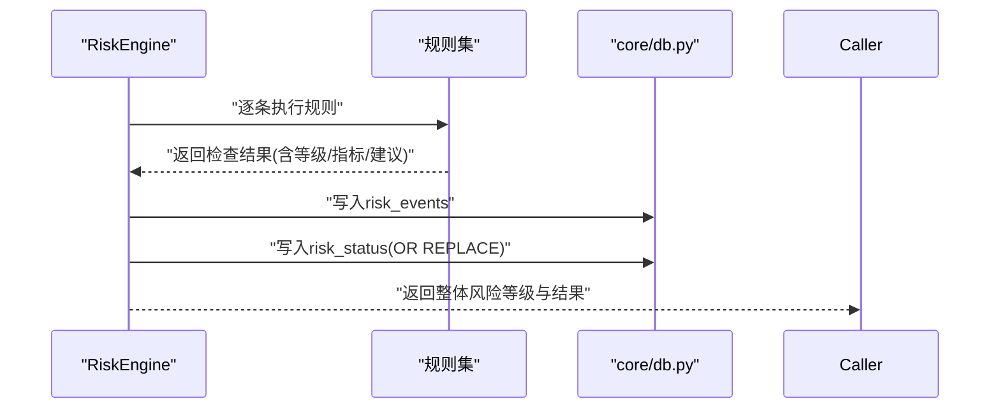
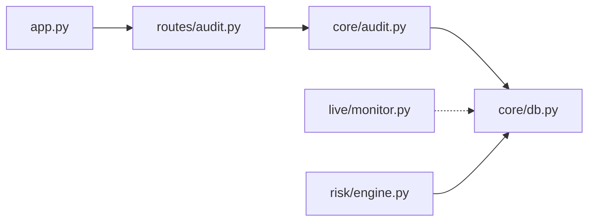

# 安全审计

<cite>
**本文引用的文件**
- [core/audit.py](file://core/audit.py)
- [routes/audit.py](file://routes/audit.py)
- [core/db.py](file://core/db.py)
- [app.py](file://app.py)
- [live/monitor.py](file://live/monitor.py)
- [risk/engine.py](file://risk/engine.py)
- [risk/config_loader.py](file://risk/config_loader.py)
</cite>

## 目录
1. [简介](#简介)
2. [项目结构](#项目结构)
3. [核心组件](#核心组件)
4. [架构总览](#架构总览)
5. [详细组件分析](#详细组件分析)
6. [依赖分析](#依赖分析)
7. [性能考虑](#性能考虑)
8. [故障排查指南](#故障排查指南)
9. [结论](#结论)
10. [附录](#附录)

## 简介
本文件面向AIQuant系统的安全审计与日志记录机制，系统化阐述审计日志、系统日志、安全事件日志的设计与实现；明确日志级别、字段定义与存储格式；给出安全事件检测与响应流程（异常行为识别、实时监控、自动告警）；提供审计追踪能力（用户操作追踪、数据变更记录、权限使用统计）；说明日志分析与报表生成（安全分析仪表板与合规报告）；并覆盖日志安全管理（加密、访问控制、保留策略），最后提供审计配置示例与合规性指导。

## 项目结构
围绕安全审计与日志记录的关键文件与职责如下：
- 核心审计模块：负责统一的审计日志记录、装饰器式自动记录、日志查询与统计。
- 路由层：提供审计日志查询与统计的API接口。
- 数据库层：提供SQLite连接管理与表结构（含审计日志表、风控事件表等）。
- 实时监控：提供价格异动、止损止盈等告警能力，作为安全事件的前置监测。
- 风控引擎：将风控检查结果持久化为风险事件，形成安全事件日志。
- 应用入口：注册审计蓝图，暴露REST接口。

图表来源
- [app.py:1-76](file://app.py#L1-L76)
- [routes/audit.py:1-79](file://routes/audit.py#L1-L79)
- [core/audit.py:1-147](file://core/audit.py#L1-L147)
- [core/db.py:200-400](file://core/db.py#L200-L400)
- [live/monitor.py:1-200](file://live/monitor.py#L1-L200)
- [risk/engine.py:1-168](file://risk/engine.py#L1-L168)
- [risk/config_loader.py:113-130](file://risk/config_loader.py#L113-L130)

章节来源
- [app.py:1-76](file://app.py#L1-L76)
- [routes/audit.py:1-79](file://routes/audit.py#L1-L79)
- [core/audit.py:1-147](file://core/audit.py#L1-L147)
- [core/db.py:200-400](file://core/db.py#L200-L400)
- [live/monitor.py:1-200](file://live/monitor.py#L1-L200)
- [risk/engine.py:1-168](file://risk/engine.py#L1-L168)
- [risk/config_loader.py:113-130](file://risk/config_loader.py#L113-L130)

## 核心组件
- 审计日志记录与查询
  - 提供手动记录函数与装饰器，自动采集用户、IP、结果状态、耗时等上下文，并写入审计日志表。
  - 支持按操作类型与用户ID过滤、分页查询与总数统计。
- 审计API
  - 提供审计日志查询与统计接口，支持当日操作数、操作类型TOP统计、近7日趋势。
- 数据库与表结构
  - 提供SQLite连接管理与WAL模式、同步策略优化；包含审计日志表、风控事件表等。
- 实时监控与告警
  - 提供价格异动、止损、止盈等告警，支持回调处理与Webhook推送。
- 风控事件持久化
  - 将风控检查结果写入风险事件表，形成安全事件日志，便于审计与追溯。

章节来源
- [core/audit.py:16-147](file://core/audit.py#L16-L147)
- [routes/audit.py:16-79](file://routes/audit.py#L16-L79)
- [core/db.py:26-40](file://core/db.py#L26-L40)
- [core/db.py:358-386](file://core/db.py#L358-L386)
- [live/monitor.py:24-200](file://live/monitor.py#L24-L200)
- [risk/engine.py:73-127](file://risk/engine.py#L73-L127)

## 架构总览
下图展示从API请求到审计日志记录、再到查询统计的整体流程，以及与实时监控、风控事件的关系。

图表来源
- [app.py:43-72](file://app.py#L43-L72)
- [routes/audit.py:16-39](file://routes/audit.py#L16-L39)
- [core/audit.py:107-147](file://core/audit.py#L107-L147)
- [core/db.py:26-40](file://core/db.py#L26-L40)

## 详细组件分析

### 审计日志模块（core/audit.py）
- 设计要点
  - 统一记录字段：用户ID、操作类型、资源标识、详情、客户端IP、时间戳、结果状态。
  - 装饰器自动记录：在函数执行前后自动采集上下文，解析响应状态码或异常，决定成功/失败/错误。
  - 资源提取：尝试从响应JSON中提取资源标识，增强可追踪性。
  - 查询接口：支持按操作类型与用户过滤、分页、总数统计。
- 关键路径
  - 记录函数：[log_audit:16-39](file://core/audit.py#L16-L39)
  - 装饰器：[audit_log:41-92](file://core/audit.py#L41-L92)
  - 资源提取：[_extract_resource:95-104](file://core/audit.py#L95-L104)
  - 查询函数：[get_audit_logs:107-147](file://core/audit.py#L107-L147)

图表来源
- [core/audit.py:50-92](file://core/audit.py#L50-L92)

章节来源
- [core/audit.py:16-147](file://core/audit.py#L16-L147)

### 审计API（routes/audit.py）
- 能力
  - 审计日志查询：支持action、user_id过滤，分页limit与offset。
  - 审计统计：当日操作数、操作类型TOP统计、近7日趋势。
- 关键路径
  - 日志查询：[get_logs:16-39](file://routes/audit.py#L16-L39)
  - 统计查询：[get_stats:41-79](file://routes/audit.py#L41-L79)

图表来源
- [routes/audit.py:16-79](file://routes/audit.py#L16-L79)
- [core/audit.py:107-147](file://core/audit.py#L107-L147)
- [core/db.py:26-40](file://core/db.py#L26-L40)

章节来源
- [routes/audit.py:16-79](file://routes/audit.py#L16-L79)

### 数据库与表结构（core/db.py）
- 连接管理
  - 使用上下文管理器，启用WAL模式与NORMAL同步策略以平衡性能与可靠性。
- 审计日志表
  - 存储审计事件，支持按时间倒序查询与过滤。
- 风控事件表
  - 存储风控检查结果与建议，支持按等级与时间索引。
- 关键路径
  - 连接管理：[get_conn:26-40](file://core/db.py#L26-L40)
  - 建表脚本（含审计与风控表）：[init_db:57-400](file://core/db.py#L57-L400)

图表来源
- [core/db.py:358-386](file://core/db.py#L358-L386)
- [core/db.py:57-400](file://core/db.py#L57-L400)

章节来源
- [core/db.py:26-40](file://core/db.py#L26-L40)
- [core/db.py:358-386](file://core/db.py#L358-L386)
- [core/db.py:57-400](file://core/db.py#L57-L400)

### 实时监控与告警（live/monitor.py）
- 功能
  - 定时扫描持仓，检查止损、止盈与价格异动阈值，触发告警并支持回调与Webhook。
  - 告警等级：INFO、WARNING、CRITICAL。
- 关键路径
  - 告警等级枚举：[AlertLevel:24-29](file://live/monitor.py#L24-L29)
  - 告警数据类：[Alert:31-42](file://live/monitor.py#L31-L42)
  - 监控配置：[MonitorConfig:44-53](file://live/monitor.py#L44-L53)
  - 主循环与扫描逻辑：[start/stop/_monitor_loop/_scan_positions:70-155](file://live/monitor.py#L70-L155)
  - 触发与解决告警：[resolve_alert:187-196](file://live/monitor.py#L187-L196)

图表来源
- [live/monitor.py:91-155](file://live/monitor.py#L91-L155)
- [live/monitor.py:158-196](file://live/monitor.py#L158-L196)

章节来源
- [live/monitor.py:24-200](file://live/monitor.py#L24-L200)

### 风控事件持久化（risk/engine.py）
- 能力
  - 执行风控检查，聚合结果并持久化为风险事件，同时写入风控状态快照。
  - 提供查询最近风险事件与最新风控状态的能力。
- 关键路径
  - 检查与记录：[check_and_record:51-71](file://risk/engine.py#L51-L71)
  - 事件持久化：[_save_results:73-99](file://risk/engine.py#L73-L99)
  - 状态持久化：[_save_status:101-127](file://risk/engine.py#L101-L127)
  - 查询最近事件：[get_recent_events:155-168](file://risk/engine.py#L155-L168)

图表来源
- [risk/engine.py:19-71](file://risk/engine.py#L19-L71)
- [risk/engine.py:73-127](file://risk/engine.py#L73-L127)

章节来源
- [risk/engine.py:19-168](file://risk/engine.py#L19-L168)

### 审计追踪与权限使用统计
- 用户操作追踪
  - 通过审计装饰器自动记录API调用，包含用户ID、IP、操作类型、资源标识、耗时与结果状态。
- 数据变更记录
  - 风控事件表记录规则触发、指标值、阈值与建议，形成安全事件变更轨迹。
- 权限使用统计
  - 通过审计日志中的用户ID与操作类型进行聚合统计，识别高频操作与异常行为。

章节来源
- [core/audit.py:41-92](file://core/audit.py#L41-L92)
- [routes/audit.py:41-79](file://routes/audit.py#L41-L79)
- [risk/engine.py:73-127](file://risk/engine.py#L73-L127)

### 日志分析与报表生成
- 审计统计接口
  - 当日操作数、操作类型TOP统计、近7日趋势，便于生成安全分析仪表板。
- 风控事件报表
  - 基于风险事件表可生成事件趋势、等级分布、规则命中统计等报表。
- 合规报告
  - 结合审计日志与风控事件，形成合规性报告模板（如操作轨迹、异常事件、处置记录）。

章节来源
- [routes/audit.py:41-79](file://routes/audit.py#L41-L79)
- [risk/engine.py:155-168](file://risk/engine.py#L155-L168)

### 日志安全管理
- 日志加密
  - 建议对审计日志与风险事件表中的敏感字段（如用户ID、IP）在传输与存储层面采用加密或脱敏策略。
- 访问控制
  - 审计API需结合认证与授权中间件，限制仅授权人员可查询与统计。
- 保留策略
  - 建议设置审计日志与风险事件的保留周期（如1年），到期归档或删除，满足合规要求。

## 依赖分析
- 组件耦合
  - 审计API依赖审计模块；审计模块依赖数据库连接；实时监控与风控引擎独立但均可产生安全事件。
- 外部依赖
  - Flask蓝图注册于应用入口，统一对外提供REST接口。
- 循环依赖
  - 未发现直接循环依赖；各模块职责清晰，通过数据库作为共享存储。

图表来源
- [app.py:43-72](file://app.py#L43-L72)
- [routes/audit.py:11](file://routes/audit.py#L11)
- [core/audit.py:13](file://core/audit.py#L13)
- [core/db.py:26-40](file://core/db.py#L26-L40)
- [live/monitor.py:20-22](file://live/monitor.py#L20-L22)
- [risk/engine.py:76-77](file://risk/engine.py#L76-L77)

章节来源
- [app.py:43-72](file://app.py#L43-L72)
- [routes/audit.py:11](file://routes/audit.py#L11)
- [core/audit.py:13](file://core/audit.py#L13)
- [core/db.py:26-40](file://core/db.py#L26-L40)
- [live/monitor.py:20-22](file://live/monitor.py#L20-L22)
- [risk/engine.py:76-77](file://risk/engine.py#L76-L77)

## 性能考虑
- 数据库连接
  - 使用上下文管理器确保事务一致性与连接释放；WAL模式提升并发写入性能。
- 查询优化
  - 审计日志与风控事件均建立时间与等级索引，减少排序与过滤成本。
- 分页与限额
  - 审计查询限制最大返回条数，避免超大数据集查询影响性能。
- 实时监控
  - 告警频率限制与去重，防止重复告警风暴。

章节来源
- [core/db.py:26-40](file://core/db.py#L26-L40)
- [core/db.py:371-372](file://core/db.py#L371-L372)
- [routes/audit.py:27](file://routes/audit.py#L27)
- [live/monitor.py:160-163](file://live/monitor.py#L160-L163)

## 故障排查指南
- 审计日志记录失败
  - 现象：记录函数内部打印失败信息。
  - 排查：检查数据库连接、表是否存在、权限是否足够。
- 审计查询失败
  - 现象：查询函数返回空列表与总数0。
  - 排查：确认WHERE条件拼接与参数绑定，检查表结构与索引。
- 实时监控异常
  - 现象：扫描异常日志或告警未触发。
  - 排查：检查配置阈值、数据源可用性、回调函数异常。
- 风控事件持久化失败
  - 现象：风控检查结果未入库。
  - 排查：检查数据库连接、SQL参数绑定、表结构。

章节来源
- [core/audit.py:37-39](file://core/audit.py#L37-L39)
- [core/audit.py:144-146](file://core/audit.py#L144-L146)
- [live/monitor.py:96-98](file://live/monitor.py#L96-L98)
- [risk/engine.py:98-99](file://risk/engine.py#L98-L99)

## 结论
AIQuant的安全审计与日志记录体系以统一的审计日志为核心，配合实时监控与风控事件持久化，实现了从操作审计到安全事件的全链路追踪。通过REST接口与统计分析，可快速生成安全仪表板与合规报告。建议进一步完善日志加密、访问控制与保留策略，确保满足生产环境的安全与合规要求。

## 附录

### 日志级别与字段定义
- 日志级别
  - 成功：操作成功完成
  - 失败：HTTP状态码≥400
  - 错误：函数抛出异常
- 字段定义
  - 用户ID、操作类型、资源标识、详情、客户端IP、时间戳、结果状态

章节来源
- [core/audit.py:16-27](file://core/audit.py#L16-L27)
- [core/audit.py:62-69](file://core/audit.py#L62-L69)

### 存储格式与表结构
- 审计日志表
  - 字段：用户ID、操作类型、资源、详情、IP、时间戳
- 风控事件表
  - 字段：流水线ID、规则名、类别、等级、消息、指标值、阈值、建议、时间戳
- 风控状态表
  - 字段：账户ID、整体等级、活跃规则、回撤、持仓数、总敞口、可用资金、最后检查时间、阻断原因

章节来源
- [core/db.py:358-386](file://core/db.py#L358-L386)

### 安全事件检测与响应机制
- 异常行为识别
  - 通过实时监控阈值与风控规则识别异常行为。
- 实时监控
  - 定时扫描、止损止盈触发、价格异动告警。
- 自动告警
  - 告警等级划分、回调处理、Webhook推送。

章节来源
- [live/monitor.py:121-148](file://live/monitor.py#L121-L148)
- [live/monitor.py:158-196](file://live/monitor.py#L158-L196)

### 审计配置示例与合规性指导
- 审计API配置
  - 在应用入口注册审计蓝图，确保路由生效。
- 合规性指导
  - 明确审计范围（API调用、关键业务操作）、保留期限、访问权限与脱敏策略。

章节来源
- [app.py:57](file://app.py#L57)
- [routes/audit.py:16-39](file://routes/audit.py#L16-L39)