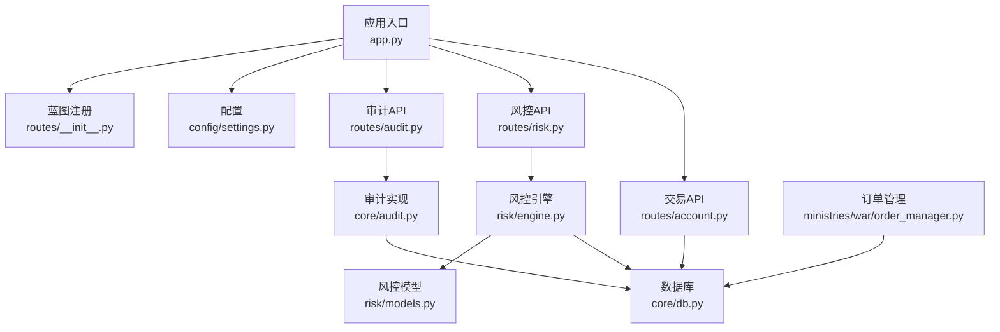
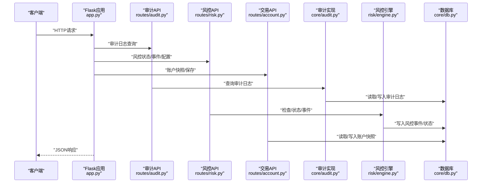
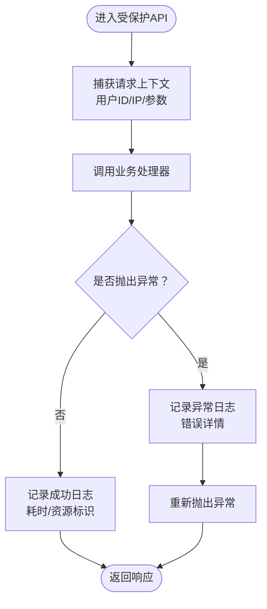
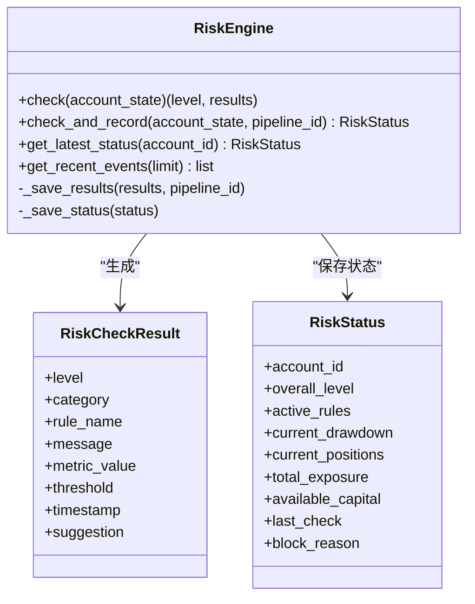
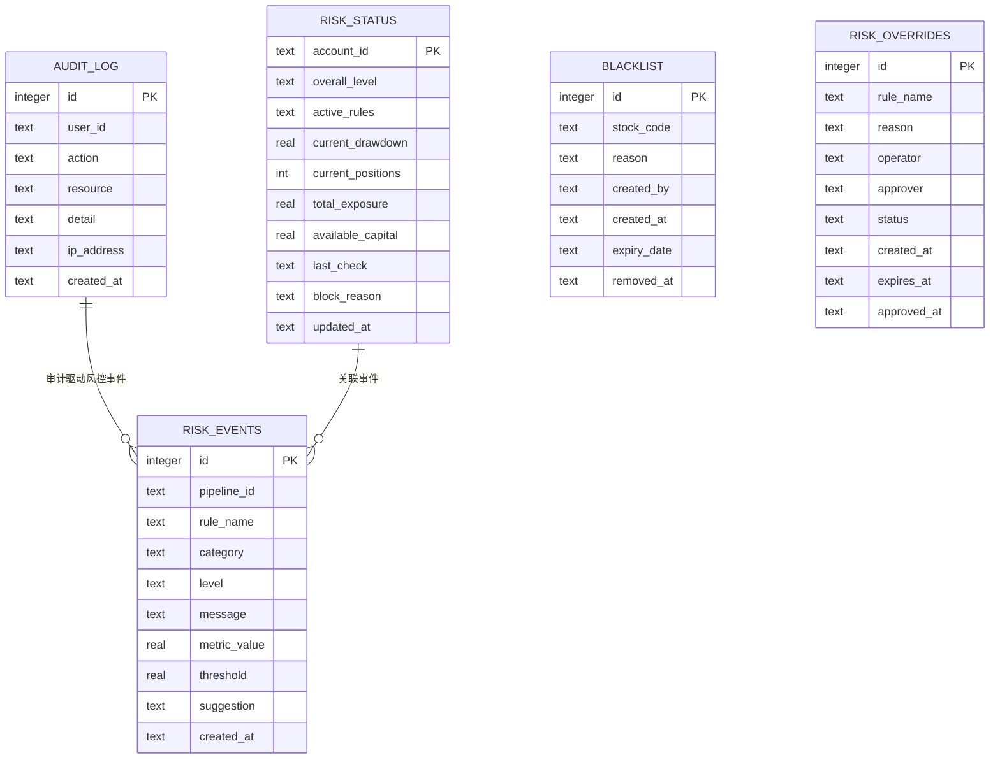
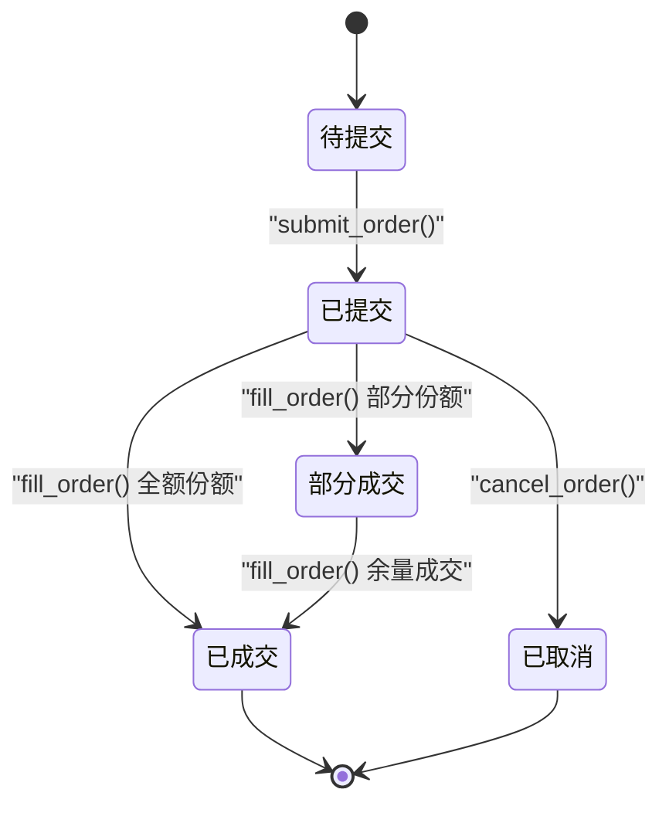
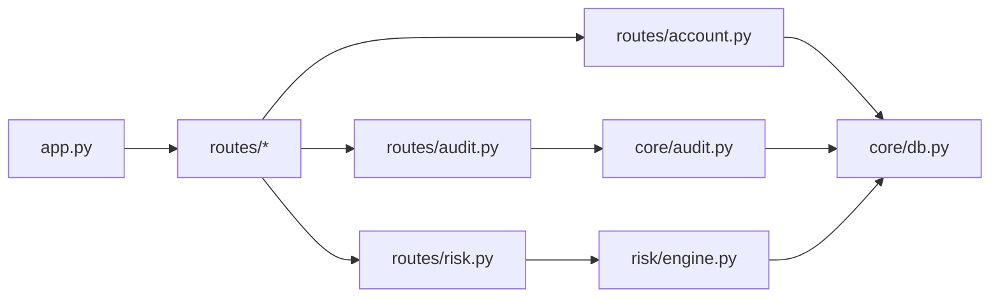

# 安全考虑

<cite>
**本文引用的文件**
- [app.py](file://app.py)
- [settings.py](file://config/settings.py)
- [audit.py](file://core/audit.py)
- [routes/__init__.py](file://routes/__init__.py)
- [routes/audit.py](file://routes/audit.py)
- [routes/risk.py](file://routes/risk.py)
- [risk/engine.py](file://risk/engine.py)
- [risk/models.py](file://risk/models.py)
- [core/db.py](file://core/db.py)
- [routes/account.py](file://routes/account.py)
- [ministries/war/order_manager.py](file://ministries/war/order_manager.py)
- [routes/common.py](file://routes/common.py)
- [start.bat](file://start.bat)
</cite>

## 目录
1. [简介](#简介)
2. [项目结构](#项目结构)
3. [核心组件](#核心组件)
4. [架构总览](#架构总览)
5. [详细组件分析](#详细组件分析)
6. [依赖关系分析](#依赖关系分析)
7. [性能与安全权衡](#性能与安全权衡)
8. [故障排查指南](#故障排查指南)
9. [结论](#结论)
10. [附录](#附录)

## 简介
本文件面向AIQuant系统，提供全面的安全考虑与实施建议，覆盖访问控制、数据安全、交易安全、安全审计与日志、威胁建模与漏洞评估、合规与监管遵循、网络安全与DDoS防护、安全事件响应与应急流程、安全配置检查清单与最佳实践。内容结合现有代码实现与可扩展设计，帮助安全管理员与开发者建立稳健的安全体系。

## 项目结构
AIQuant采用Flask后端与蓝图路由组织，核心安全相关模块集中在以下位置：
- 应用入口与路由注册：app.py
- 配置与部署：config/settings.py、start.bat
- 审计日志：core/audit.py、routes/audit.py
- 风控与黑/白名单：risk/engine.py、risk/models.py、routes/risk.py
- 数据库与表结构：core/db.py
- 交易与订单：ministries/war/order_manager.py
- 账户与资产：routes/account.py
- 路由层通用工具：routes/common.py

**图表来源**
- [app.py:1-164](file://app.py#L1-L164)
- [routes/__init__.py:1-16](file://routes/__init__.py#L1-L16)
- [routes/audit.py:1-78](file://routes/audit.py#L1-L78)
- [routes/risk.py:1-298](file://routes/risk.py#L1-L298)
- [risk/engine.py:1-168](file://risk/engine.py#L1-L168)
- [risk/models.py:1-78](file://risk/models.py#L1-L78)
- [core/db.py:1-467](file://core/db.py#L1-L467)
- [routes/account.py:1-38](file://routes/account.py#L1-L38)
- [ministries/war/order_manager.py:1-211](file://ministries/war/order_manager.py#L1-L211)

**章节来源**
- [app.py:1-164](file://app.py#L1-L164)
- [routes/__init__.py:1-16](file://routes/__init__.py#L1-L16)

## 核心组件
- 审计日志系统：统一记录用户行为、操作结果与异常，支持查询与统计。
- 风控引擎：集中式风控检查、状态快照、事件记录与黑名单/豁免管理。
- 数据库：本地SQLite，内置审计、风控状态与事件等表，提供连接上下文与迁移能力。
- 交易与订单：订单生命周期管理、持仓更新与状态机，支撑交易安全。
- 账户与资产：账户快照与查询接口，便于资金与头寸核对。
- 路由层工具：安全的数值转换与JSON序列化辅助，降低异常风险。

**章节来源**
- [core/audit.py:1-147](file://core/audit.py#L1-L147)
- [routes/audit.py:1-78](file://routes/audit.py#L1-L78)
- [risk/engine.py:1-168](file://risk/engine.py#L1-L168)
- [risk/models.py:1-78](file://risk/models.py#L1-L78)
- [core/db.py:1-467](file://core/db.py#L1-L467)
- [ministries/war/order_manager.py:1-211](file://ministries/war/order_manager.py#L1-L211)
- [routes/account.py:1-38](file://routes/account.py#L1-L38)
- [routes/common.py:1-32](file://routes/common.py#L1-L32)

## 架构总览
下图展示安全相关模块之间的交互关系与数据流向：

**图表来源**
- [app.py:1-164](file://app.py#L1-L164)
- [routes/audit.py:1-78](file://routes/audit.py#L1-L78)
- [routes/risk.py:1-298](file://routes/risk.py#L1-L298)
- [routes/account.py:1-38](file://routes/account.py#L1-L38)
- [core/audit.py:1-147](file://core/audit.py#L1-L147)
- [risk/engine.py:1-168](file://risk/engine.py#L1-L168)
- [core/db.py:1-467](file://core/db.py#L1-L467)

## 详细组件分析

### 审计日志系统
- 统一记录：操作类型、资源、详情、用户ID、客户端IP、时间戳与结果（成功/失败/错误）。
- 装饰器：自动包装API，采集请求上下文、耗时与响应状态，异常时记录错误详情。
- 查询与统计：支持按动作与用户过滤、分页；提供今日操作数、动作分布与7日趋势统计。
- 存储：审计日志表，带时间索引，便于快速检索。

**图表来源**
- [core/audit.py:41-92](file://core/audit.py#L41-L92)
- [routes/audit.py:16-38](file://routes/audit.py#L16-L38)

**章节来源**
- [core/audit.py:16-92](file://core/audit.py#L16-L92)
- [routes/audit.py:16-78](file://routes/audit.py#L16-L78)

### 风控引擎与安全控制
- 风控检查：聚合多规则，输出整体风险等级与明细；异常规则执行以警告级别记录。
- 状态与事件：持久化风控状态与事件，支持查询最近事件与账户回撤曲线。
- 黑名单与豁免：黑名单管理（有效期）、豁免申请与审批（可选审批流），保障例外场景可控。
- 风控配置：支持热加载，便于动态调整阈值与策略。

**图表来源**
- [risk/engine.py:13-168](file://risk/engine.py#L13-L168)
- [risk/models.py:28-78](file://risk/models.py#L28-L78)

**章节来源**
- [risk/engine.py:19-168](file://risk/engine.py#L19-L168)
- [risk/models.py:11-78](file://risk/models.py#L11-L78)
- [routes/risk.py:31-298](file://routes/risk.py#L31-L298)

### 数据库与数据安全
- 本地SQLite：默认使用WAL模式与NORMAL同步，兼顾并发与可靠性。
- 表结构：内置审计日志、风控事件与状态、黑名单、豁免等安全相关表。
- 迁移与补丁：安全地为表添加列，避免重复定义导致的错误。
- 连接管理：上下文管理器确保事务一致性与连接回收。

**图表来源**
- [core/db.py:417-427](file://core/db.py#L417-L427)
- [risk/engine.py:73-127](file://risk/engine.py#L73-L127)
- [routes/risk.py:112-225](file://routes/risk.py#L112-L225)

**章节来源**
- [core/db.py:26-40](file://core/db.py#L26-L40)
- [core/db.py:57-467](file://core/db.py#L57-L467)

### 交易与订单安全
- 订单状态机：PENDING/SUBMITTED/PARTIAL/FILLED/CANCELLED/REJECTED，严格的状态流转。
- 成交与持仓：按成交价与成交量更新持仓，支持加仓与减仓，计算未实现盈亏。
- 订单生命周期：创建、提交、成交、撤销，记录时间戳与佣金等关键字段。
- 与风控联动：风控状态影响交易决策，黑名单与豁免直接影响下单行为。

**图表来源**
- [ministries/war/order_manager.py:69-211](file://ministries/war/order_manager.py#L69-L211)

**章节来源**
- [ministries/war/order_manager.py:69-211](file://ministries/war/order_manager.py#L69-L211)

### 账户与资金安全
- 账户快照：保存总资产、现金、持仓价值、总成本、盈亏与百分比等关键指标。
- 接口：支持获取最近N日快照与保存快照，便于对账与回溯。
- 与风控联动：风控状态与可用资金、总敞口等指标共同决定交易许可。

**章节来源**
- [routes/account.py:11-38](file://routes/account.py#L11-L38)
- [risk/engine.py:51-72](file://risk/engine.py#L51-L72)

### 路由层安全与输入校验
- 安全转换：将数值转换为浮点并处理NaN/Inf，避免异常传播至下游。
- JSON安全：将DataFrame安全转为JSON，保留日期与数值精度。

**章节来源**
- [routes/common.py:9-32](file://routes/common.py#L9-L32)

## 依赖关系分析
- app.py注册多个蓝图，形成清晰的路由边界；审计与风控API直接依赖核心模块。
- 审计与风控均依赖数据库连接上下文，保证事务一致性。
- 交易API依赖数据库进行账户与交易记录的读写。

**图表来源**
- [app.py:44-72](file://app.py#L44-L72)
- [routes/audit.py:11](file://routes/audit.py#L11)
- [routes/risk.py:21-24](file://routes/risk.py#L21-L24)
- [routes/account.py:8](file://routes/account.py#L8)
- [core/audit.py:13](file://core/audit.py#L13)
- [risk/engine.py:76-127](file://risk/engine.py#L76-L127)
- [core/db.py:26-40](file://core/db.py#L26-L40)

**章节来源**
- [app.py:44-72](file://app.py#L44-L72)
- [routes/audit.py:11](file://routes/audit.py#L11)
- [routes/risk.py:21-24](file://routes/risk.py#L21-L24)
- [routes/account.py:8](file://routes/account.py#L8)
- [core/audit.py:13](file://core/audit.py#L13)
- [risk/engine.py:76-127](file://risk/engine.py#L76-L127)
- [core/db.py:26-40](file://core/db.py#L26-L40)

## 性能与安全权衡
- 数据库：WAL模式提升并发写入，NORMAL同步在性能与可靠性间取得平衡；建议在生产环境启用只读副本与备份策略。
- 审计与风控：批量写入与索引优化（如审计时间索引）有助于查询效率；注意控制审计日志上限与清理策略。
- 交易：订单与持仓更新频繁，建议在风控检查与数据库写入之间引入轻量级缓存或队列，降低阻塞。

[本节为通用建议，无需特定文件引用]

## 故障排查指南
- 审计日志查询失败：检查数据库连接、表是否存在与权限；确认审计装饰器是否正确包裹。
- 风控状态为空：确认风控引擎是否成功写入状态表；检查账户状态构建是否完整。
- 交易无法成交：检查订单状态是否为SUBMITTED或PARTIAL；核对黑名单与豁免状态。
- 账户快照异常：确认保存接口传参与数据库写入路径；核对字段映射与类型转换。

**章节来源**
- [core/audit.py:107-147](file://core/audit.py#L107-L147)
- [risk/engine.py:129-154](file://risk/engine.py#L129-L154)
- [routes/risk.py:112-225](file://routes/risk.py#L112-L225)
- [routes/account.py:30-38](file://routes/account.py#L30-L38)

## 结论
AIQuant在审计、风控、数据库与交易层面具备基础安全能力。建议在现有基础上完善身份认证与授权、传输加密、访问控制策略、合规与监管遵循、网络安全与DDoS防护、安全事件响应流程，并持续进行安全测试与渗透评估，以满足生产环境的安全要求。

[本节为总结性内容，无需特定文件引用]

## 附录

### 访问控制与身份认证
- 建议：引入统一的身份认证（如JWT或OAuth2）与细粒度授权（RBAC），在路由层增加鉴权中间件。
- 实施要点：令牌签发与刷新、用户角色与权限矩阵、敏感API白名单与速率限制。

[本节为概念性建议，无需特定文件引用]

### 数据安全与隐私
- 存储保护：对敏感字段（如用户ID、账户信息）在数据库层进行最小化暴露；使用参数化查询防止注入。
- 传输安全：在生产环境启用HTTPS与TLS，强制重定向至安全通道。
- 日志脱敏：审计日志中避免记录明文敏感信息；对IP与用户ID进行必要脱敏。

[本节为通用建议，无需特定文件引用]

### 交易安全策略
- 订单验证：在提交前校验价格、数量、方向与资金限额；与风控状态联动。
- 资金安全：使用原子性事务写入交易与账户快照；对异常交易进行阻断与告警。
- 风险控制：黑名单拦截、集中度限制、最大回撤与总敞口控制；支持人工豁免审批。

**章节来源**
- [ministries/war/order_manager.py:76-134](file://ministries/war/order_manager.py#L76-L134)
- [routes/risk.py:129-204](file://routes/risk.py#L129-L204)

### 安全审计与日志
- 审计范围：覆盖所有敏感API与交易相关操作；记录用户、资源、结果与耗时。
- 存储与保留：设置日志保留周期与归档策略；定期清理过期日志。
- 分析与告警：基于审计统计与趋势分析，识别异常行为并触发告警。

**章节来源**
- [core/audit.py:16-92](file://core/audit.py#L16-L92)
- [routes/audit.py:41-78](file://routes/audit.py#L41-L78)

### 威胁建模与漏洞评估
- 威胁建模：识别外部攻击面（API、WebSocket、静态资源）、内部威胁（越权、滥用）与供应链风险。
- 漏洞评估：定期进行OWASP Top 10扫描、SQL注入、XSS、CSRF与不安全依赖检测。
- 安全测试：单元测试中加入安全断言；集成测试覆盖关键业务链路。

[本节为通用建议，无需特定文件引用]

### 合规与监管遵循
- 数据最小化与用户同意：明确数据收集目的与期限；提供删除与导出请求通道。
- 审计留痕：确保所有敏感操作可追溯；满足监管检查要求。
- 披露与通知：发生数据泄露时按法规时限上报并通知受影响方。

[本节为通用建议，无需特定文件引用]

### 网络安全与DDoS防护
- 边界防护：部署防火墙与WAF，限制不必要的端口与协议；对API与WebSocket设置访问白名单。
- DDoS缓解：启用限速与熔断；使用CDN与云防护服务；对高频接口增加配额控制。
- 内网隔离：数据库与应用分离，最小权限访问；对运维通道加密与审计。

[本节为通用建议，无需特定文件引用]

### 安全事件响应与应急处理
- 响应流程：发现事件→分级→遏制→调查→恢复→复盘；明确责任人与沟通渠道。
- 工具与证据：保留日志副本、网络抓包与系统快照；对恶意IP与设备封禁。
- 复盘与改进：完善策略、加固系统、加强培训与演练。

[本节为通用建议，无需特定文件引用]

### 安全配置检查清单
- 身份与访问
  - 是否启用强密码与多因子认证？
  - 是否实施最小权限与职责分离？
  - 是否有统一的鉴权与授权策略？
- 网络与传输
  - 是否强制HTTPS与TLS 1.3+？
  - 是否限制源IP与端口？
  - 是否启用WAF与DDoS防护？
- 数据与日志
  - 是否对敏感字段脱敏与最小化存储？
  - 是否开启审计并设置保留策略？
  - 是否定期备份与验证恢复？
- 运行与监控
  - 是否有异常检测与告警？
  - 是否进行定期漏洞扫描与渗透测试？
  - 是否有事件响应预案与演练？

[本节为通用建议，无需特定文件引用]

### 最佳实践建议
- 代码与配置
  - 使用参数化查询与输入校验；避免硬编码敏感信息。
  - 对配置文件与密钥进行权限控制与加密存储。
- 部署与运维
  - 生产环境关闭调试模式；最小化安装包与依赖。
  - 使用容器与编排平台，配合健康检查与自动重启。
- 安全运营
  - 建立安全运营中心（SOC），集中处理告警与事件。
  - 定期开展安全意识培训与攻防演练。

[本节为通用建议，无需特定文件引用]