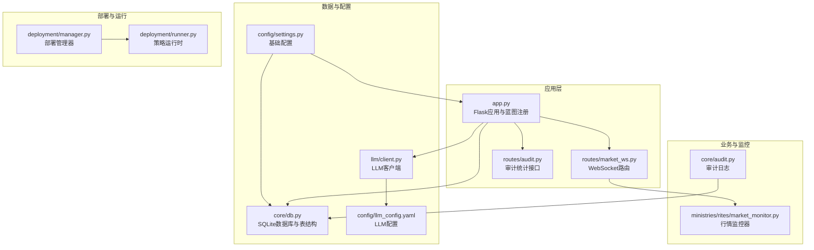
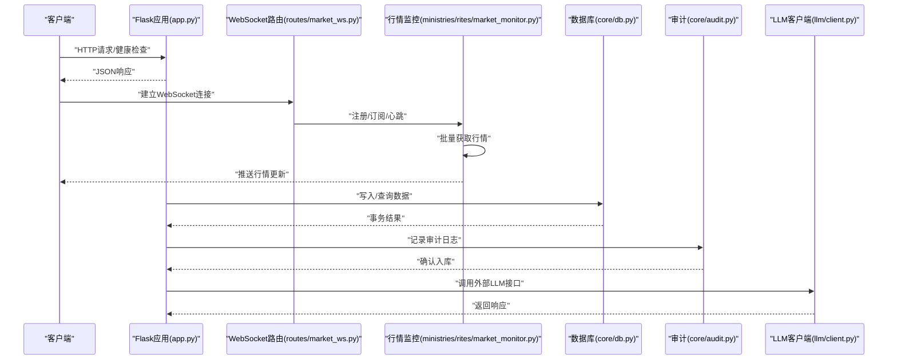
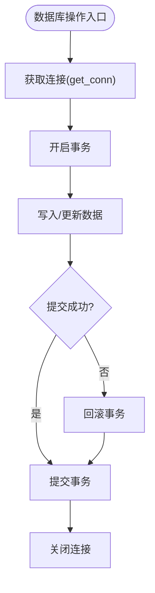
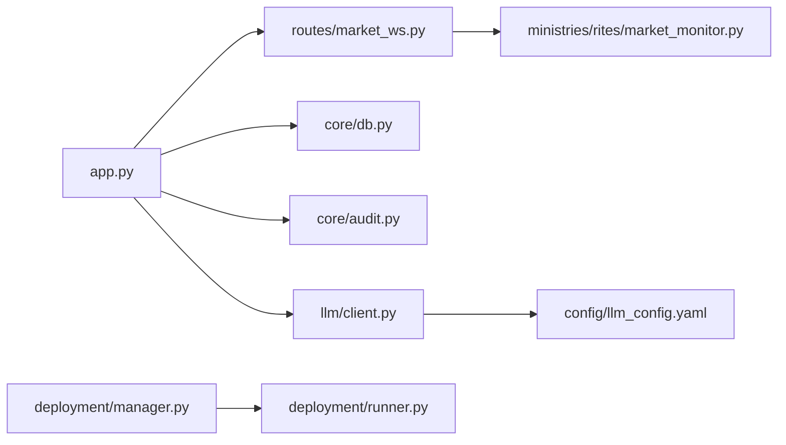

# 数据安全

<cite>
**本文引用的文件**
- [app.py](file://app.py)
- [settings.py](file://config/settings.py)
- [db.py](file://core/db.py)
- [market_ws.py](file://routes/market_ws.py)
- [market_monitor.py](file://ministries/rites/market_monitor.py)
- [audit.py](file://core/audit.py)
- [llm_config.yaml](file://config/llm_config.yaml)
- [manager.py](file://deployment/manager.py)
- [runner.py](file://deployment/runner.py)
- [llm_client.py](file://llm/client.py)
</cite>

## 目录
1. [简介](#简介)
2. [项目结构](#项目结构)
3. [核心组件](#核心组件)
4. [架构总览](#架构总览)
5. [详细组件分析](#详细组件分析)
6. [依赖分析](#依赖分析)
7. [性能考虑](#性能考虑)
8. [故障排查指南](#故障排查指南)
9. [结论](#结论)
10. [附录](#附录)

## 简介
本文件面向AIQuant系统的数据安全，围绕静态数据加密、传输数据加密、敏感信息保护、数据库安全配置、数据传输安全、数据完整性保护、数据生命周期管理、数据泄露防护与异常检测、安全配置检查清单与合规性要求进行系统化梳理与落地建议。文档以仓库现有实现为基础，结合可扩展的最佳实践，帮助团队建立可审计、可追溯、可恢复的数据安全体系。

## 项目结构
AIQuant采用“路由层-服务层-数据访问层-基础设施”的分层组织，数据安全贯穿于应用启动、API路由、WebSocket推送、数据库持久化、审计日志、部署运行等环节。关键安全相关模块分布如下：
- 应用入口与全局安全：app.py（CORS、蓝图注册、全局错误处理）、config/settings.py（基础配置）
- 数据存储与安全：core/db.py（SQLite本地库、连接管理、建表与索引、事务控制）
- 实时行情传输：routes/market_ws.py（WebSocket路由）、ministries/rites/market_monitor.py（行情监控与推送）
- 审计与合规：core/audit.py（审计日志记录与查询）
- 外部接口与密钥：config/llm_config.yaml（LLM配置与密钥）、llm/client.py（对外调用）
- 部署与运行：deployment/manager.py（策略部署管理）、deployment/runner.py（策略运行时）

图表来源
- [app.py:1-164](file://app.py#L1-L164)
- [market_ws.py:1-142](file://routes/market_ws.py#L1-L142)
- [market_monitor.py:1-244](file://ministries/rites/market_monitor.py#L1-L244)
- [audit.py:1-147](file://core/audit.py#L1-L147)
- [db.py:1-1213](file://core/db.py#L1-L1213)
- [settings.py:1-25](file://config/settings.py#L1-L25)
- [llm_config.yaml:1-23](file://config/llm_config.yaml#L1-L23)
- [llm_client.py](file://llm/client.py)
- [manager.py:1-216](file://deployment/manager.py#L1-L216)
- [runner.py:1-182](file://deployment/runner.py#L1-L182)

章节来源
- [app.py:1-164](file://app.py#L1-L164)
- [settings.py:1-25](file://config/settings.py#L1-L25)

## 核心组件
- 数据库与连接安全
  - 使用SQLite本地库，通过上下文管理器确保事务提交/回滚与连接关闭，减少资源泄漏风险。
  - WAL模式与同步级别设置在性能与可靠性之间取得平衡。
- 实时行情传输
  - WebSocket路由与行情监控器分离，便于接入鉴权与限流。
- 审计日志
  - 提供统一的审计日志记录与查询接口，支持按动作与用户过滤。
- 外部接口与密钥
  - LLM配置文件中包含API Key，建议通过环境变量覆盖，避免硬编码。
- 部署与运行
  - 策略运行时具备状态管理与错误日志，便于问题定位与恢复。

章节来源
- [db.py:26-40](file://core/db.py#L26-L40)
- [market_ws.py:67-123](file://routes/market_ws.py#L67-L123)
- [audit.py:16-92](file://core/audit.py#L16-L92)
- [llm_config.yaml:7-8](file://config/llm_config.yaml#L7-L8)
- [runner.py:69-131](file://deployment/runner.py#L69-L131)

## 架构总览
下图展示数据安全相关的端到端流程：应用启动与路由注册、WebSocket行情推送、数据库持久化、审计日志记录、外部LLM调用、部署运行与状态管理。

图表来源
- [app.py:148-163](file://app.py#L148-L163)
- [market_ws.py:72-123](file://routes/market_ws.py#L72-L123)
- [market_monitor.py:124-152](file://ministries/rites/market_monitor.py#L124-L152)
- [db.py:567-578](file://core/db.py#L567-L578)
- [audit.py:28-38](file://core/audit.py#L28-L38)
- [llm_client.py](file://llm/client.py)

## 详细组件分析

### 数据库安全与静态数据加密
- 连接与事务
  - 通过上下文管理器确保事务提交/回滚与连接关闭，降低异常导致的数据不一致风险。
- 存储与索引
  - 建表脚本集中定义，包含唯一索引与复合索引，提升查询效率与数据一致性。
- 静态数据加密现状
  - 当前未见内置加密实现。建议在生产环境中启用SQLite加密扩展（如SQLCipher），并在应用层对敏感字段进行加密存储与解密使用。

图表来源
- [db.py:26-40](file://core/db.py#L26-L40)

章节来源
- [db.py:26-40](file://core/db.py#L26-L40)
- [db.py:57-466](file://core/db.py#L57-L466)

### 传输数据加密与HTTPS配置
- 当前实现
  - 应用未启用TLS/SSL，WebSocket为ws://而非wss://，HTTP未强制HTTPS。
- 建议
  - 生产环境必须启用HTTPS与WSS，使用反向代理（Nginx/Traefik）终止TLS，并在应用侧强制重定向与安全头。
  - WebSocket应使用wss://，并配合证书验证与客户端身份校验。

章节来源
- [app.py:148-163](file://app.py#L148-L163)
- [market_ws.py:72-123](file://routes/market_ws.py#L72-L123)

### 敏感信息保护与密钥管理
- LLM密钥
  - 配置文件中包含API Key，建议通过环境变量覆盖，避免硬编码与版本库泄露。
- 审计日志
  - 审计记录包含用户ID、IP地址、操作详情等，需遵循最小披露原则与脱敏策略。

章节来源
- [llm_config.yaml:7-8](file://config/llm_config.yaml#L7-L8)
- [audit.py:16-39](file://core/audit.py#L16-L39)

### 数据传输安全：WebSocket与API通信
- WebSocket
  - 路由层提供连接、订阅、取消订阅、心跳与状态查询接口，建议在此层增加鉴权、速率限制与消息校验。
- API通信
  - 路由层统一返回JSON，建议在中间件层增加请求签名/时间戳校验与防重放机制。

章节来源
- [market_ws.py:26-64](file://routes/market_ws.py#L26-L64)
- [market_ws.py:72-123](file://routes/market_ws.py#L72-L123)

### 数据完整性保护：校验与审计
- 审计日志
  - 提供统一的审计记录接口与查询接口，支持按动作与用户过滤，便于事后审计与追踪。
- 建议
  - 引入消息摘要（如SHA-256）与数字签名，对关键数据变更进行完整性校验与溯源。

章节来源
- [audit.py:16-92](file://core/audit.py#L16-L92)
- [audit.py:107-146](file://core/audit.py#L107-L146)

### 数据生命周期管理：保留、清理与销毁
- 现状
  - 代码未体现明确的数据保留策略与自动清理/销毁机制。
- 建议
  - 设定数据保留期限（如行情数据1年、审计日志90天），定期归档与删除；删除操作需可审计、可恢复窗口。

章节来源
- [db.py:57-466](file://core/db.py#L57-L466)

### 泄露防护与异常检测
- 异常捕获
  - 应用层全局错误处理器统一返回JSON，有助于快速定位问题。
- 建议
  - 引入异常指标（错误率、延迟、超时）与告警；对异常频繁的IP或接口进行临时封禁与限速。

章节来源
- [app.py:136-144](file://app.py#L136-L144)

### 部署与运行安全
- 策略运行时
  - 提供启动/停止/暂停/恢复状态管理与错误日志，便于问题定位与恢复。
- 部署管理
  - 部署记录落盘，建议对记录文件进行权限控制与定期备份。

章节来源
- [runner.py:69-131](file://deployment/runner.py#L69-L131)
- [manager.py:186-193](file://deployment/manager.py#L186-L193)

## 依赖分析
- 组件耦合
  - WebSocket路由依赖行情监控器；行情监控器依赖数据源管理器；应用层依赖数据库与审计模块。
- 外部依赖
  - LLM客户端依赖配置文件中的模型与密钥；部署管理器依赖运行时状态与记录文件。

图表来源
- [app.py:1-164](file://app.py#L1-L164)
- [market_ws.py:1-142](file://routes/market_ws.py#L1-L142)
- [market_monitor.py:1-244](file://ministries/rites/market_monitor.py#L1-L244)
- [audit.py:1-147](file://core/audit.py#L1-L147)
- [db.py:1-1213](file://core/db.py#L1-L1213)
- [llm_client.py](file://llm/client.py)
- [llm_config.yaml:1-23](file://config/llm_config.yaml#L1-L23)
- [manager.py:1-216](file://deployment/manager.py#L1-L216)
- [runner.py:1-182](file://deployment/runner.py#L1-L182)

章节来源
- [app.py:1-164](file://app.py#L1-L164)
- [market_ws.py:1-142](file://routes/market_ws.py#L1-L142)
- [market_monitor.py:1-244](file://ministries/rites/market_monitor.py#L1-L244)
- [audit.py:1-147](file://core/audit.py#L1-L147)
- [db.py:1-1213](file://core/db.py#L1-L1213)
- [llm_client.py](file://llm/client.py)
- [llm_config.yaml:1-23](file://config/llm_config.yaml#L1-L23)
- [manager.py:1-216](file://deployment/manager.py#L1-L216)
- [runner.py:1-182](file://deployment/runner.py#L1-L182)

## 性能考虑
- 数据库
  - WAL模式与适度同步级别有助于提升并发写入性能；批量写入与索引设计影响查询效率。
- WebSocket
  - 批量推送与订阅去重可降低网络压力；建议引入背压与心跳保活。
- 审计日志
  - 分页查询与索引优化可降低审计查询开销。

章节来源
- [db.py:28-30](file://core/db.py#L28-L30)
- [market_monitor.py:141-152](file://ministries/rites/market_monitor.py#L141-L152)
- [audit.py:107-146](file://core/audit.py#L107-L146)

## 故障排查指南
- 健康检查
  - 通过健康接口确认服务可用性与基本连通性。
- 错误处理
  - 全局错误处理器统一返回JSON，便于前端与自动化监控识别。
- 审计追踪
  - 使用审计查询接口定位操作人、资源与时间范围，辅助问题复盘。

章节来源
- [app.py:131-133](file://app.py#L131-L133)
- [app.py:136-144](file://app.py#L136-L144)
- [audit.py:107-146](file://core/audit.py#L107-L146)

## 结论
AIQuant当前在数据库事务管理、审计日志与WebSocket推送方面具备良好基础，但在静态数据加密、传输加密（HTTPS/WSS）、敏感信息保护（密钥管理）与数据生命周期策略方面尚需完善。建议尽快引入TLS/SSL、WSS、SQLite加密扩展、密钥外置与脱敏策略、数据保留与销毁机制以及异常检测与告警体系，以满足生产级数据安全要求。

## 附录

### 数据安全配置检查清单
- 基础设施
  - 是否启用HTTPS与WSS？（参考：应用启动与WebSocket路由）
  - 反向代理是否配置安全头与证书校验？
- 数据库
  - 是否启用SQLite加密扩展（如SQLCipher）？
  - 是否对敏感字段进行加密存储与解密使用？
  - 是否配置只读账户与最小权限访问？
- 传输与会话
  - 是否对WebSocket消息进行鉴权与速率限制？
  - 是否对API请求进行签名/时间戳校验与防重放？
- 敏感信息
  - 是否通过环境变量覆盖密钥（如LLM API Key）？
  - 是否对审计日志中的敏感字段进行脱敏？
- 审计与合规
  - 是否提供审计查询接口与导出能力？
  - 是否设定数据保留期限与自动清理策略？
- 部署与运行
  - 部署记录文件是否具备访问控制与备份？
  - 策略运行时是否具备错误日志与状态监控？

章节来源
- [app.py:148-163](file://app.py#L148-L163)
- [market_ws.py:72-123](file://routes/market_ws.py#L72-L123)
- [llm_config.yaml:7-8](file://config/llm_config.yaml#L7-L8)
- [audit.py:107-146](file://core/audit.py#L107-L146)
- [manager.py:186-193](file://deployment/manager.py#L186-L193)
- [runner.py:69-131](file://deployment/runner.py#L69-L131)