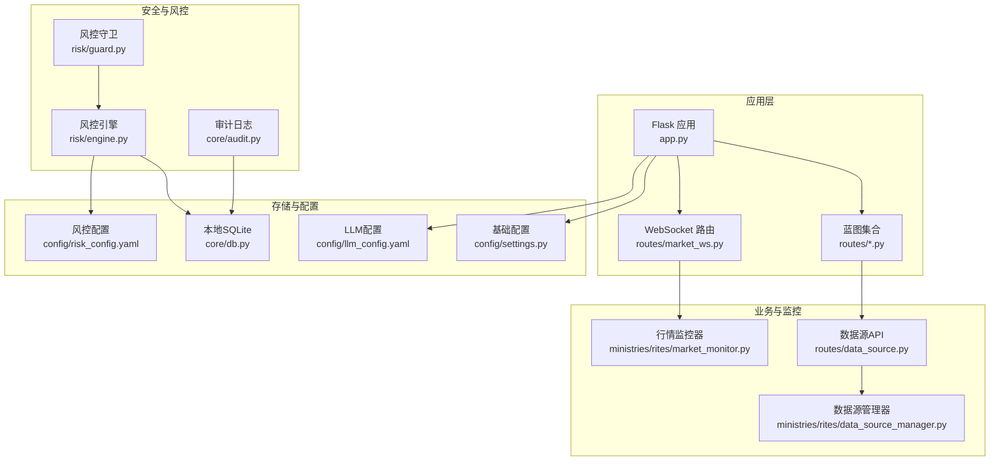
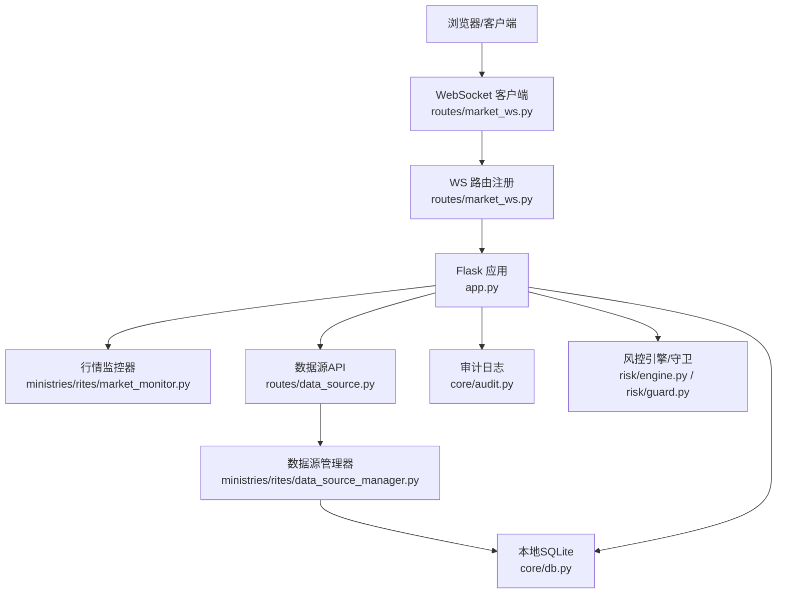
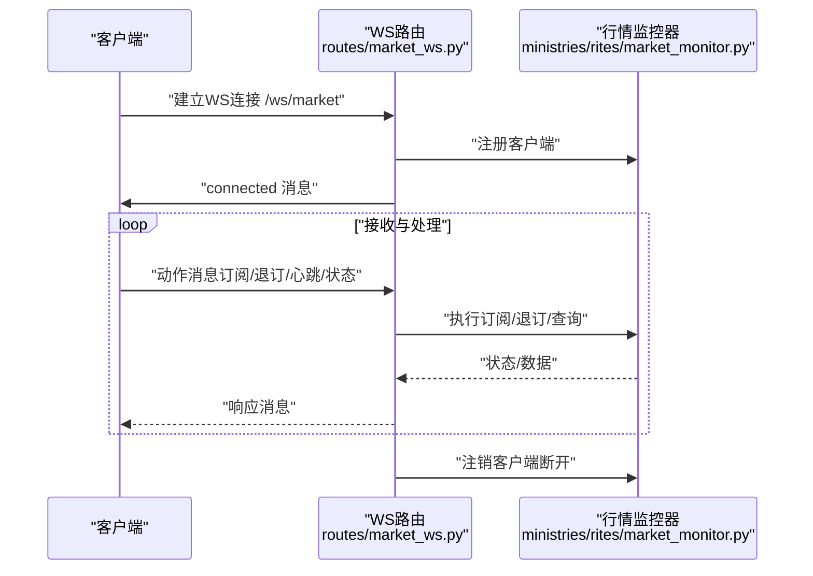
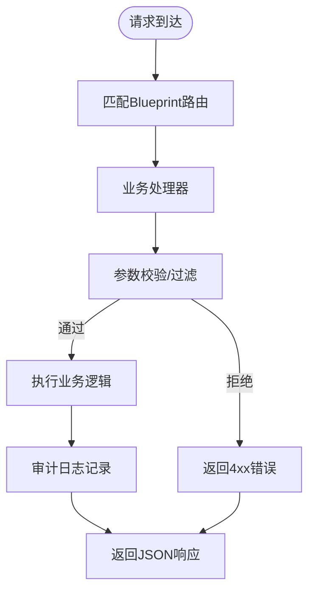
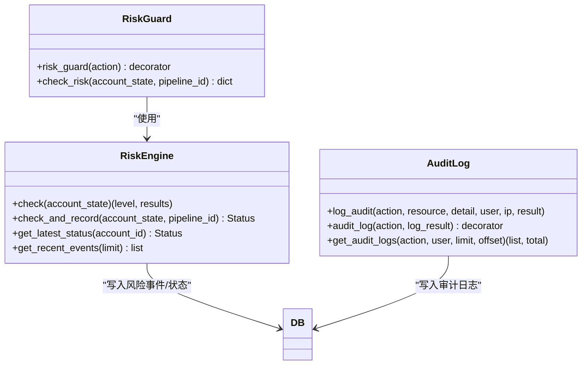
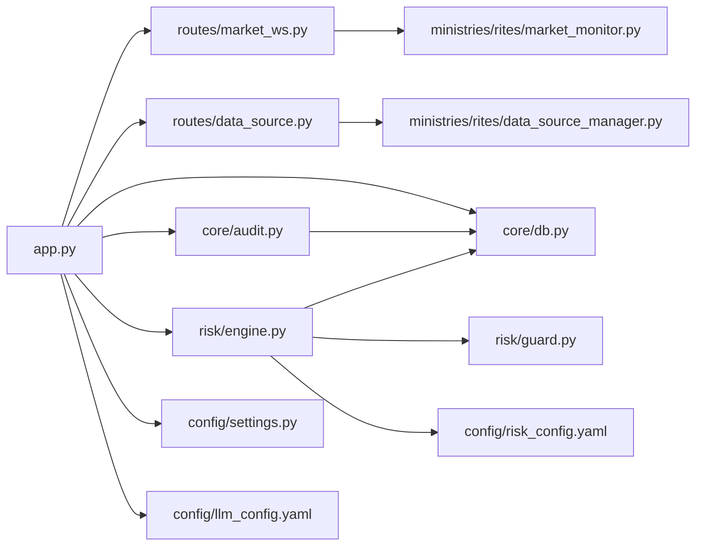

# 网络安全

<cite>
**本文引用的文件**
- [app.py](file://app.py)
- [routes/market_ws.py](file://routes/market_ws.py)
- [ministries/rites/market_monitor.py](file://ministries/rites/market_monitor.py)
- [config/settings.py](file://config/settings.py)
- [core/db.py](file://core/db.py)
- [routes/data_source.py](file://routes/data_source.py)
- [ministries/rites/data_source_manager.py](file://ministries/rites/data_source_manager.py)
- [risk/engine.py](file://risk/engine.py)
- [risk/guard.py](file://risk/guard.py)
- [config/risk_config.yaml](file://config/risk_config.yaml)
- [core/audit.py](file://core/audit.py)
- [config/llm_config.yaml](file://config/llm_config.yaml)
</cite>

## 目录
1. [简介](#简介)
2. [项目结构](#项目结构)
3. [核心组件](#核心组件)
4. [架构总览](#架构总览)
5. [详细组件分析](#详细组件分析)
6. [依赖分析](#依赖分析)
7. [性能考量](#性能考量)
8. [故障排查指南](#故障排查指南)
9. [结论](#结论)
10. [附录](#附录)

## 简介
本文件面向AIQuant系统的网络安全防护，聚焦于网络通信安全（WebSocket连接安全、API接口保护、数据传输加密）、防火墙与网络隔离策略（端口管理、访问控制、VLAN划分）、DDoS防护与流量控制（请求限流、IP封禁、负载均衡）、Web应用防火墙（WAF）配置（SQL注入、XSS、文件上传检查）、内部网络架构安全（微服务间通信与数据库连接安全）、网络安全监控与入侵检测，以及网络安全配置模板与安全基线标准。文档以仓库现有代码为依据，结合概念性设计，提供可落地的安全实践。

## 项目结构
AIQuant后端基于Flask应用，通过Blueprint组织路由；实时行情通过flask-sock提供的WebSocket推送；数据源采用多数据源管理器进行统一接入与健康检查；风控引擎与守卫负责运行时风控决策；审计日志模块提供统一审计能力；配置文件集中管理基础参数与风控规则。

**图示来源**
- [app.py:1-164](file://app.py#L1-L164)
- [routes/market_ws.py:1-142](file://routes/market_ws.py#L1-L142)
- [ministries/rites/market_monitor.py:1-244](file://ministries/rites/market_monitor.py#L1-L244)
- [routes/data_source.py:1-112](file://routes/data_source.py#L1-L112)
- [ministries/rites/data_source_manager.py:1-190](file://ministries/rites/data_source_manager.py#L1-L190)
- [risk/engine.py:1-168](file://risk/engine.py#L1-L168)
- [risk/guard.py:1-92](file://risk/guard.py#L1-L92)
- [core/audit.py:1-147](file://core/audit.py#L1-L147)
- [core/db.py:1-1213](file://core/db.py#L1-L1213)
- [config/settings.py:1-25](file://config/settings.py#L1-L25)
- [config/risk_config.yaml:1-170](file://config/risk_config.yaml#L1-L170)
- [config/llm_config.yaml:1-23](file://config/llm_config.yaml#L1-L23)

**章节来源**
- [app.py:1-164](file://app.py#L1-L164)
- [config/settings.py:1-25](file://config/settings.py#L1-L25)

## 核心组件
- WebSocket行情推送：提供实时行情订阅与推送，支持客户端注册、订阅/退订、心跳与状态查询。
- 数据源管理与API：统一接入本地数据库与第三方数据源，提供健康检查与主备切换。
- 风控引擎与守卫：对账户状态进行风控检查，支持装饰器式拦截与记录。
- 审计日志：统一记录API调用与关键操作，便于追踪与合规。
- 本地SQLite存储：承载风控事件、状态、审计日志等数据。

**章节来源**
- [routes/market_ws.py:1-142](file://routes/market_ws.py#L1-L142)
- [ministries/rites/market_monitor.py:1-244](file://ministries/rites/market_monitor.py#L1-L244)
- [routes/data_source.py:1-112](file://routes/data_source.py#L1-L112)
- [ministries/rites/data_source_manager.py:1-190](file://ministries/rites/data_source_manager.py#L1-L190)
- [risk/engine.py:1-168](file://risk/engine.py#L1-L168)
- [risk/guard.py:1-92](file://risk/guard.py#L1-L92)
- [core/audit.py:1-147](file://core/audit.py#L1-L147)
- [core/db.py:1-1213](file://core/db.py#L1-L1213)

## 架构总览
下图展示从客户端到应用、监控、数据源与存储的整体交互路径，并标注安全关注点（认证授权、传输加密、访问控制、审计）。

**图示来源**
- [app.py:1-164](file://app.py#L1-L164)
- [routes/market_ws.py:1-142](file://routes/market_ws.py#L1-L142)
- [ministries/rites/market_monitor.py:1-244](file://ministries/rites/market_monitor.py#L1-L244)
- [routes/data_source.py:1-112](file://routes/data_source.py#L1-L112)
- [ministries/rites/data_source_manager.py:1-190](file://ministries/rites/data_source_manager.py#L1-L190)
- [core/db.py:1-1213](file://core/db.py#L1-L1213)
- [core/audit.py:1-147](file://core/audit.py#L1-L147)
- [risk/engine.py:1-168](file://risk/engine.py#L1-L168)
- [risk/guard.py:1-92](file://risk/guard.py#L1-L92)

## 详细组件分析

### WebSocket连接安全
- 连接建立与消息协议：客户端通过WS连接订阅行情，服务端解析动作（订阅/退订/心跳/状态），并以JSON消息格式推送。
- 客户端生命周期管理：注册、心跳、异常断开清理，避免僵尸连接。
- 安全建议（概念性）：启用TLS（wss://）、鉴权令牌、消息长度限制、速率限制、心跳保活与超时、异常消息丢弃与告警。

**图示来源**
- [routes/market_ws.py:67-142](file://routes/market_ws.py#L67-L142)
- [ministries/rites/market_monitor.py:39-231](file://ministries/rites/market_monitor.py#L39-L231)

**章节来源**
- [routes/market_ws.py:1-142](file://routes/market_ws.py#L1-L142)
- [ministries/rites/market_monitor.py:1-244](file://ministries/rites/market_monitor.py#L1-L244)

### API接口保护
- 路由组织：通过Blueprint组织各模块API，统一入口与中间件。
- 健康检查：提供健康与调试路由，便于运维与监控。
- 安全建议（概念性）：启用HTTPS、CORS白名单、CSRF防护、输入校验与参数过滤、速率限制、IP黑白名单、审计日志、最小权限原则。

**图示来源**
- [app.py:124-134](file://app.py#L124-L134)
- [routes/data_source.py:1-112](file://routes/data_source.py#L1-L112)
- [core/audit.py:16-92](file://core/audit.py#L16-L92)

**章节来源**
- [app.py:1-164](file://app.py#L1-L164)
- [routes/data_source.py:1-112](file://routes/data_source.py#L1-L112)
- [core/audit.py:1-147](file://core/audit.py#L1-L147)

### 数据传输加密
- 当前实现：HTTP明文（基于Flask默认）。建议在生产环境启用TLS终止（Nginx/Traefik）或在应用层启用SSL。
- 加密范围：WebSocket（wss://）、REST API（HTTPS）、数据库连接（如需远程DB，建议VPN/隧道）。

**章节来源**
- [app.py:148-164](file://app.py#L148-L164)

### 防火墙与网络隔离
- 端口管理：后端监听5000端口（可配置），仅暴露必要端口。
- 访问控制：建议在反向代理层配置IP白名单、速率限制、请求大小限制。
- VLAN/子网：将应用、数据库、缓存分别置于不同子网，仅开放必要端口互通。

**章节来源**
- [config/settings.py:11-12](file://config/settings.py#L11-L12)

### DDoS防护与流量控制
- 请求限流：在反向代理层按IP限速（如Nginx limit_req），或在应用层使用Flask扩展（概念性）。
- IP封禁：基于访问日志识别异常IP，动态加入防火墙规则。
- 负载均衡：多实例部署，配合健康检查与会话保持策略。

**章节来源**
- [routes/market_ws.py:67-142](file://routes/market_ws.py#L67-L142)
- [ministries/rites/market_monitor.py:108-131](file://ministries/rites/market_monitor.py#L108-L131)

### Web应用防火墙（WAF）
- SQL注入防护：参数化查询（已由SQLAlchemy/原生SQL实现）、ORM白名单、输入长度与字符集限制。
- XSS防护：输出编码、Content-Security-Policy、HttpOnly/Secure Cookie。
- 文件上传检查：白名单扩展名、MIME类型校验、病毒扫描、上传目录权限限制。

**章节来源**
- [core/db.py:26-40](file://core/db.py#L26-L40)

### 内部网络架构安全
- 微服务间通信：建议服务网格（Istio）或API网关，启用mTLS、细粒度RBAC、超时与重试策略。
- 数据库连接：本地SQLite无需公网暴露；远程数据库需VPN/专线+最小权限账号。

**章节来源**
- [core/db.py:19-40](file://core/db.py#L19-L40)

### 网络安全监控与入侵检测
- 审计日志：统一记录操作、用户、IP、结果、耗时，支持查询与导出。
- 风控事件：记录风控触发详情、级别、建议，支持查询与统计。
- 告警联动：结合日志系统与SIEM，设置阈值告警与自动化处置。

**图示来源**
- [risk/engine.py:13-168](file://risk/engine.py#L13-L168)
- [risk/guard.py:36-92](file://risk/guard.py#L36-L92)
- [core/audit.py:16-147](file://core/audit.py#L16-L147)
- [core/db.py:417-427](file://core/db.py#L417-L427)

**章节来源**
- [risk/engine.py:1-168](file://risk/engine.py#L1-L168)
- [risk/guard.py:1-92](file://risk/guard.py#L1-L92)
- [core/audit.py:1-147](file://core/audit.py#L1-L147)
- [core/db.py:1-1213](file://core/db.py#L1-L1213)

## 依赖分析
- 应用依赖：蓝图注册、WebSocket路由、全局错误处理。
- 业务依赖：行情监控器依赖数据源管理器；数据源API依赖数据源管理器；风控依赖数据库；审计依赖数据库。
- 配置依赖：基础配置影响监听地址与端口；风控配置影响风控行为；LLM配置影响外部调用。

**图示来源**
- [app.py:1-164](file://app.py#L1-L164)
- [routes/market_ws.py:1-142](file://routes/market_ws.py#L1-L142)
- [ministries/rites/market_monitor.py:1-244](file://ministries/rites/market_monitor.py#L1-L244)
- [routes/data_source.py:1-112](file://routes/data_source.py#L1-L112)
- [ministries/rites/data_source_manager.py:1-190](file://ministries/rites/data_source_manager.py#L1-L190)
- [risk/engine.py:1-168](file://risk/engine.py#L1-L168)
- [risk/guard.py:1-92](file://risk/guard.py#L1-L92)
- [core/audit.py:1-147](file://core/audit.py#L1-L147)
- [core/db.py:1-1213](file://core/db.py#L1-L1213)
- [config/settings.py:1-25](file://config/settings.py#L1-L25)
- [config/risk_config.yaml:1-170](file://config/risk_config.yaml#L1-L170)
- [config/llm_config.yaml:1-23](file://config/llm_config.yaml#L1-L23)

**章节来源**
- [app.py:1-164](file://app.py#L1-L164)
- [core/db.py:1-1213](file://core/db.py#L1-L1213)

## 性能考量
- WebSocket推送：批量拉取、分批推送、锁保护、异常隔离，避免阻塞主线程。
- 数据源访问：主备切换、健康检查、降级策略，保障可用性。
- 数据库：WAL模式、PRAGMA配置、索引与唯一约束优化、事务封装。

**章节来源**
- [ministries/rites/market_monitor.py:124-174](file://ministries/rites/market_monitor.py#L124-L174)
- [ministries/rites/data_source_manager.py:136-177](file://ministries/rites/data_source_manager.py#L136-L177)
- [core/db.py:26-40](file://core/db.py#L26-L40)

## 故障排查指南
- WebSocket异常：检查连接注册、消息解析、推送异常与客户端注销流程。
- API错误：查看全局错误处理器返回的JSON错误信息，结合审计日志定位问题。
- 风控拦截：通过风控守卫返回的blocked与reason字段快速定位触发规则。
- 审计日志：按action与user聚合查询，定位异常操作与时间窗口。

**章节来源**
- [routes/market_ws.py:116-123](file://routes/market_ws.py#L116-L123)
- [app.py:137-144](file://app.py#L137-L144)
- [risk/guard.py:50-59](file://risk/guard.py#L50-L59)
- [core/audit.py:107-147](file://core/audit.py#L107-L147)

## 结论
AIQuant当前以本地SQLite与Flask为基础，具备WebSocket实时推送、多数据源接入、风控与审计能力。为满足生产级网络安全要求，建议在反向代理层完善TLS、CORS、WAF、DDoS与流量控制，在应用层强化鉴权与审计，在网络层实施防火墙与VLAN隔离，并建立完善的监控与应急响应机制。

## 附录

### 网络安全配置模板（概念性）
- 反向代理（Nginx/Traefik）：启用HTTPS、CORS白名单、限速、IP白名单、请求体大小限制。
- 应用（Flask）：启用生产模式、严格Cookie属性、CSRF保护、输入校验、审计日志。
- 数据库：本地SQLite无需公网暴露；远程DB启用VPN/专线+最小权限账号。
- 防火墙：仅开放5000端口，内网服务间通过ACL限制互通。
- WAF：启用SQL注入/XSS防护、文件上传检查、异常行为告警。

### 安全基线标准（概念性）
- 身份与访问管理：最小权限、定期轮换、审计追踪。
- 数据保护：静态数据加密、传输加密、备份加密。
- 网络安全：分段隔离、零信任、入侵检测与响应。
- 运维安全：变更管理、补丁管理、日志留存与合规。