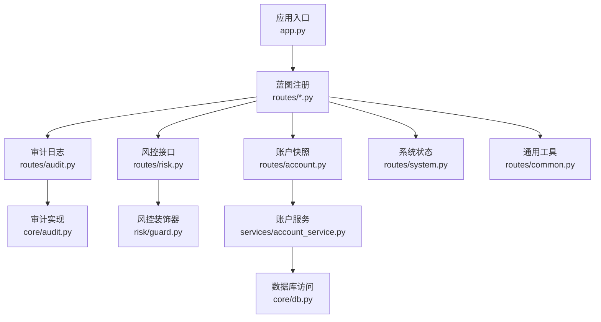
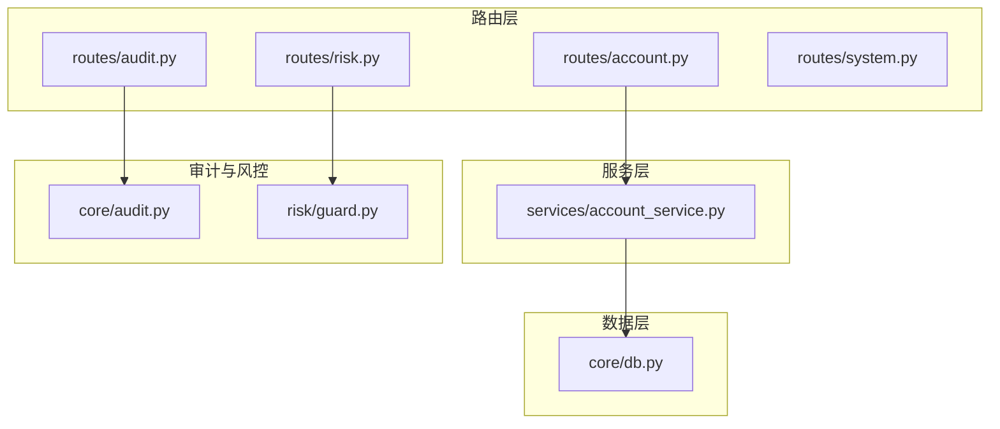
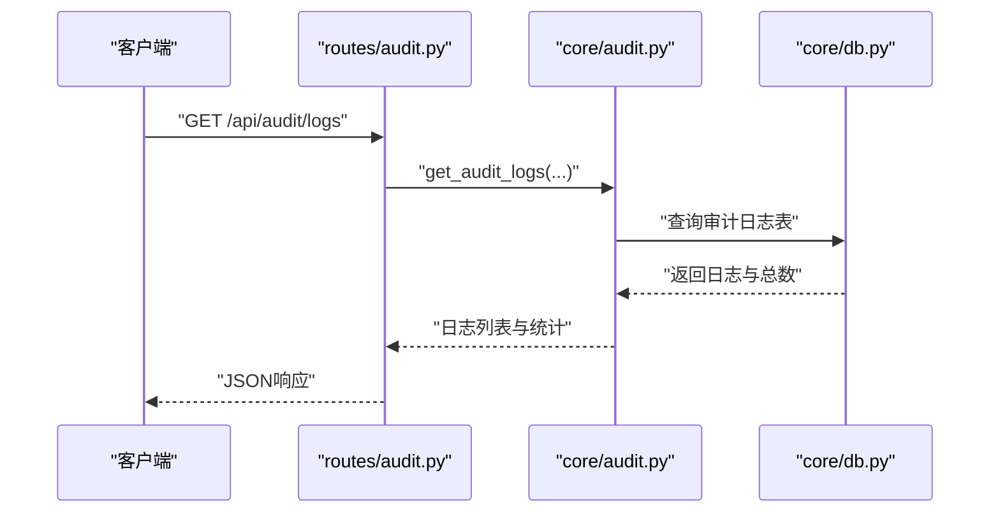
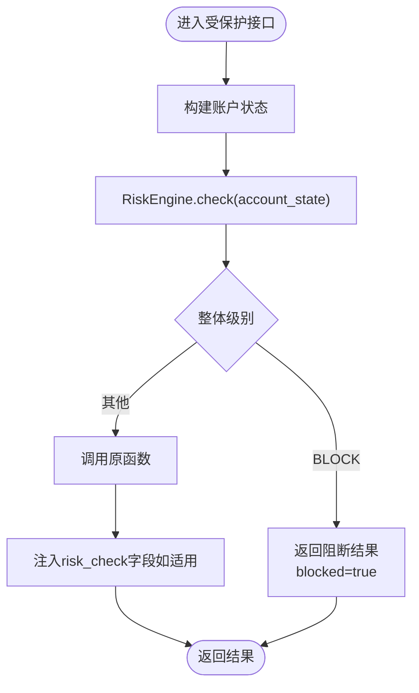
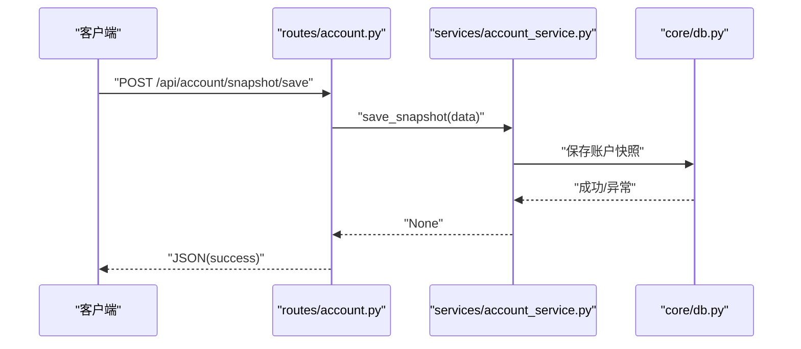
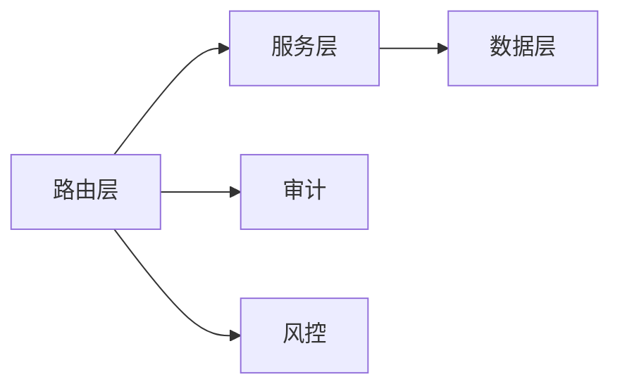

# 访问控制

<cite>
**本文引用的文件**
- [app.py](file://app.py)
- [routes/account.py](file://routes/account.py)
- [services/account_service.py](file://services/account_service.py)
- [core/db.py](file://core/db.py)
- [routes/audit.py](file://routes/audit.py)
- [core/audit.py](file://core/audit.py)
- [routes/risk.py](file://routes/risk.py)
- [risk/guard.py](file://risk/guard.py)
- [routes/system.py](file://routes/system.py)
- [routes/common.py](file://routes/common.py)
</cite>

## 目录
1. [简介](#简介)
2. [项目结构](#项目结构)
3. [核心组件](#核心组件)
4. [架构总览](#架构总览)
5. [详细组件分析](#详细组件分析)
6. [依赖关系分析](#依赖关系分析)
7. [性能考量](#性能考量)
8. [故障排查指南](#故障排查指南)
9. [结论](#结论)
10. [附录](#附录)

## 简介
本文件面向AIQuant系统的访问控制机制，围绕身份认证、授权管理、会话管理、安全输入校验、常见攻击防护（CSRF、XSS、注入）、多因素认证与账户锁定、以及配置与最佳实践进行系统化说明。当前代码库未实现传统意义上的“用户登录/会话令牌/API密钥”等访问控制组件，但提供了审计日志、风控拦截、数据库与服务层隔离等基础能力，可作为构建访问控制体系的支撑。

## 项目结构
AIQuant采用Flask应用，按蓝图组织路由，服务层负责业务逻辑，数据层封装SQLite访问。与访问控制直接相关的模块包括：
- 应用入口与全局路由注册：app.py
- 审计日志：core/audit.py、routes/audit.py
- 风控拦截：routes/risk.py、risk/guard.py
- 账户快照：routes/account.py、services/account_service.py、core/db.py
- 系统状态与通用工具：routes/system.py、routes/common.py

图表来源
- [app.py:39-75](file://app.py#L39-L75)
- [routes/audit.py:13-78](file://routes/audit.py#L13-L78)
- [core/audit.py:16-43](file://core/audit.py#L16-L43)
- [routes/risk.py:26-110](file://routes/risk.py#L26-L110)
- [risk/guard.py:36-62](file://risk/guard.py#L36-L62)
- [routes/account.py:11-37](file://routes/account.py#L11-L37)
- [services/account_service.py:10-31](file://services/account_service.py#L10-L31)
- [core/db.py:26-40](file://core/db.py#L26-L40)
- [routes/system.py:12-152](file://routes/system.py#L12-L152)
- [routes/common.py:9-32](file://routes/common.py#L9-L32)

章节来源
- [app.py:39-75](file://app.py#L39-L75)
- [routes/account.py:11-37](file://routes/account.py#L11-L37)
- [services/account_service.py:10-31](file://services/account_service.py#L10-L31)
- [core/db.py:26-40](file://core/db.py#L26-L40)
- [routes/audit.py:13-78](file://routes/audit.py#L13-L78)
- [core/audit.py:16-43](file://core/audit.py#L16-L43)
- [routes/risk.py:26-110](file://routes/risk.py#L26-L110)
- [risk/guard.py:36-62](file://risk/guard.py#L36-L62)
- [routes/system.py:12-152](file://routes/system.py#L12-L152)
- [routes/common.py:9-32](file://routes/common.py#L9-L32)

## 核心组件
- 审计日志：统一记录用户行为、资源与结果，支持查询与统计，便于事后追踪与合规检查。
- 风控拦截：对关键业务执行风控检查，必要时阻断请求并返回风险详情。
- 账户快照：提供账户资产快照的查询与保存，数据持久化至SQLite。
- 系统状态：提供系统运行状态、调度器开关等接口，用于运维与自动化。
- 输入安全工具：提供安全数值转换与JSON序列化辅助，降低异常输入导致的错误。

章节来源
- [core/audit.py:16-43](file://core/audit.py#L16-L43)
- [routes/audit.py:16-78](file://routes/audit.py#L16-L78)
- [risk/guard.py:36-62](file://risk/guard.py#L36-L62)
- [routes/risk.py:29-81](file://routes/risk.py#L29-L81)
- [routes/account.py:11-37](file://routes/account.py#L11-L37)
- [services/account_service.py:10-31](file://services/account_service.py#L10-L31)
- [routes/system.py:46-83](file://routes/system.py#L46-L83)
- [routes/common.py:9-32](file://routes/common.py#L9-L32)

## 架构总览
AIQuant的访问控制以“审计+风控”为核心，辅以服务层与数据层的边界划分，形成“路由层-服务层-数据层”的三层结构。当前未发现专门的身份认证、会话令牌或API密钥管理模块，建议在此基础上扩展统一认证与授权框架。

图表来源
- [routes/audit.py:13-78](file://routes/audit.py#L13-L78)
- [core/audit.py:16-43](file://core/audit.py#L16-L43)
- [routes/risk.py:26-110](file://routes/risk.py#L26-L110)
- [risk/guard.py:36-62](file://risk/guard.py#L36-L62)
- [routes/account.py:11-37](file://routes/account.py#L11-L37)
- [services/account_service.py:10-31](file://services/account_service.py#L10-L31)
- [core/db.py:26-40](file://core/db.py#L26-L40)

## 详细组件分析

### 审计日志系统
- 统一记录：log_audit函数接收操作类型、资源、详情、用户ID、客户端IP与结果，写入审计日志表。
- 装饰器：audit_log装饰器可自动记录API调用，便于批量审计。
- 查询与统计：提供日志查询与统计接口，支持分页、过滤与趋势分析。

图表来源
- [routes/audit.py:16-38](file://routes/audit.py#L16-L38)
- [core/audit.py:16-43](file://core/audit.py#L16-L43)
- [core/db.py:417-427](file://core/db.py#L417-L427)

章节来源
- [core/audit.py:16-43](file://core/audit.py#L16-L43)
- [routes/audit.py:16-78](file://routes/audit.py#L16-L78)
- [core/db.py:417-427](file://core/db.py#L417-L427)

### 风控拦截机制
- 装饰器模式：risk_guard对被装饰函数进行风控前置检查，若整体级别为BLOCK，则直接返回阻断结果。
- 账户状态：通过build_account_state构建风控所需上下文，引擎执行检查并返回结果列表。
- 接口：提供风控状态查询、配置热加载、黑名单与豁免管理等API。

图表来源
- [risk/guard.py:36-62](file://risk/guard.py#L36-L62)
- [routes/risk.py:29-81](file://routes/risk.py#L29-L81)

章节来源
- [risk/guard.py:36-62](file://risk/guard.py#L36-L62)
- [routes/risk.py:29-110](file://routes/risk.py#L29-L110)

### 账户快照服务
- 路由：提供历史快照查询、最新快照查询与保存接口。
- 服务：将请求体解析为数值并调用数据库写入，保证字段类型安全。
- 数据库：使用上下文管理连接，自动提交或回滚，避免资源泄漏。

图表来源
- [routes/account.py:30-37](file://routes/account.py#L30-L37)
- [services/account_service.py:20-31](file://services/account_service.py#L20-L31)
- [core/db.py:26-40](file://core/db.py#L26-L40)

章节来源
- [routes/account.py:11-37](file://routes/account.py#L11-L37)
- [services/account_service.py:10-31](file://services/account_service.py#L10-L31)
- [core/db.py:26-40](file://core/db.py#L26-L40)

### 系统状态与通用工具
- 系统状态：提供同步、扫描、调度器开关等接口，内部使用状态字典与线程控制。
- 通用工具：提供安全数值转换与DataFrame转JSON的安全方法，减少异常输入带来的问题。

章节来源
- [routes/system.py:12-152](file://routes/system.py#L12-L152)
- [routes/common.py:9-32](file://routes/common.py#L9-L32)

## 依赖关系分析
- 路由层依赖服务层，服务层依赖数据层，形成清晰的分层。
- 审计与风控分别独立于业务路由，通过装饰器与中间件方式复用。
- 未发现直接的认证、会话或API密钥管理模块，访问控制能力主要体现在审计与风控层面。

图表来源
- [app.py:39-75](file://app.py#L39-L75)
- [routes/account.py:11-37](file://routes/account.py#L11-L37)
- [services/account_service.py:10-31](file://services/account_service.py#L10-L31)
- [core/db.py:26-40](file://core/db.py#L26-L40)
- [routes/audit.py:16-78](file://routes/audit.py#L16-L78)
- [core/audit.py:16-43](file://core/audit.py#L16-L43)
- [routes/risk.py:29-110](file://routes/risk.py#L29-L110)
- [risk/guard.py:36-62](file://risk/guard.py#L36-L62)

章节来源
- [app.py:39-75](file://app.py#L39-L75)
- [routes/account.py:11-37](file://routes/account.py#L11-L37)
- [services/account_service.py:10-31](file://services/account_service.py#L10-L31)
- [core/db.py:26-40](file://core/db.py#L26-L40)
- [routes/audit.py:16-78](file://routes/audit.py#L16-L78)
- [core/audit.py:16-43](file://core/audit.py#L16-L43)
- [routes/risk.py:29-110](file://routes/risk.py#L29-L110)
- [risk/guard.py:36-62](file://risk/guard.py#L36-L62)

## 性能考量
- 数据库连接：使用上下文管理器确保事务一致性与资源释放，避免长事务占用。
- 索引与查询：审计日志与风控相关表均建立时间/状态索引，有助于查询性能。
- 风控检查：装饰器在函数入口处执行，避免重复计算；建议缓存账户状态以降低开销。
- 线程与并发：系统状态接口使用线程异步执行耗时任务，避免阻塞主线程。

章节来源
- [core/db.py:26-40](file://core/db.py#L26-L40)
- [core/db.py:417-427](file://core/db.py#L417-L427)
- [routes/system.py:12-43](file://routes/system.py#L12-L43)

## 故障排查指南
- 审计日志写入失败：log_audit内部捕获异常并打印，检查数据库连接与表结构。
- 风控阻断：当risk_guard返回blocked=true时，查看block原因与风险详情，确认是否需要豁免或调整阈值。
- 账户快照保存异常：检查请求体字段类型与范围，确保数值转换安全。
- 系统状态接口冲突：若提示同步/扫描已在运行，等待任务结束或清理状态标志。

章节来源
- [core/audit.py:28-39](file://core/audit.py#L28-L39)
- [risk/guard.py:50-62](file://risk/guard.py#L50-L62)
- [services/account_service.py:20-31](file://services/account_service.py#L20-L31)
- [routes/system.py:15-21](file://routes/system.py#L15-L21)

## 结论
AIQuant当前的访问控制以审计与风控为核心，具备良好的可追溯性与风险拦截能力。若需实现完整的身份认证、授权与会话管理，建议在现有架构上引入统一认证与授权框架，并结合现有审计与风控模块形成闭环。

## 附录
- 常见访问控制漏洞防护要点
  - CSRF：建议引入CSRF令牌与同源策略，限制跨站请求。
  - XSS：对输出内容进行HTML转义，严格白名单过滤。
  - 注入攻击：对SQL与命令行输入进行参数化与白名单校验。
- 多因素认证与账户锁定
  - 建议引入TOTP/短信验证码等MFA，结合失败次数阈值与临时封禁。
- 配置与最佳实践
  - 强制HTTPS与安全头；最小权限原则；定期轮换密钥；审计日志保留与备份；风控规则定期评审与热加载。