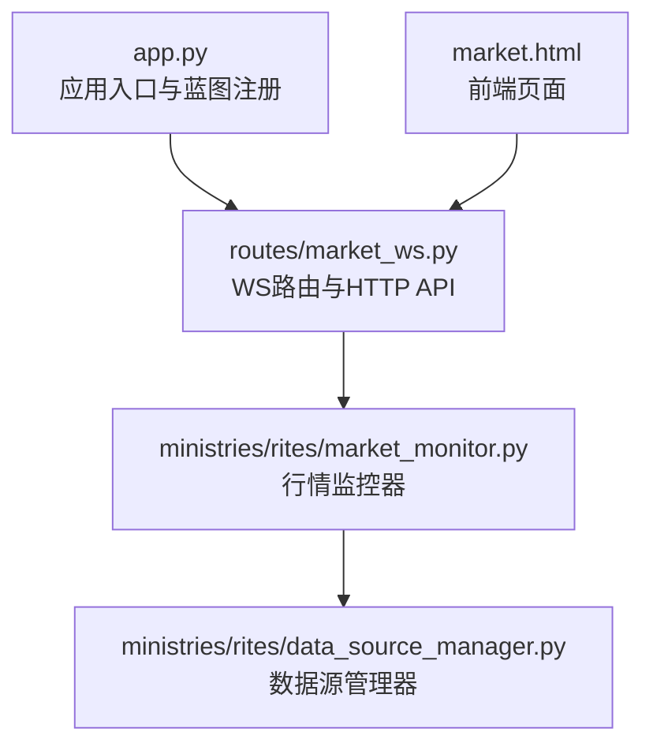
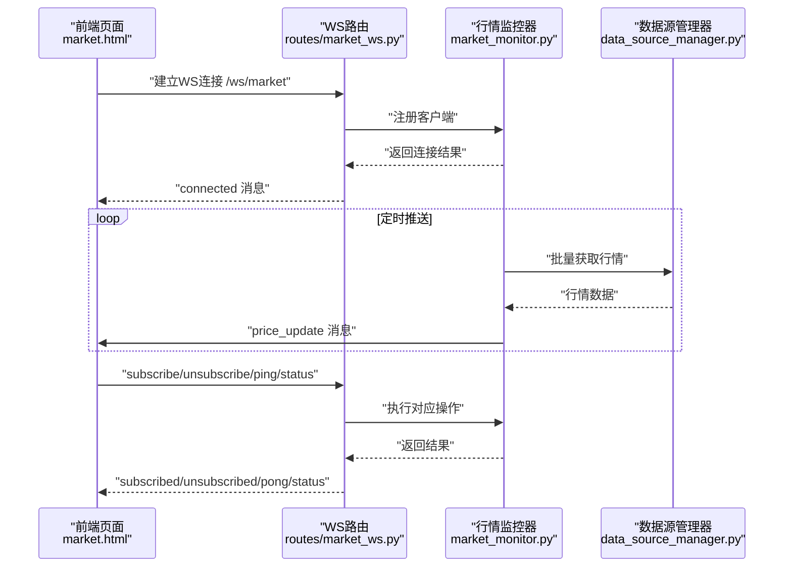
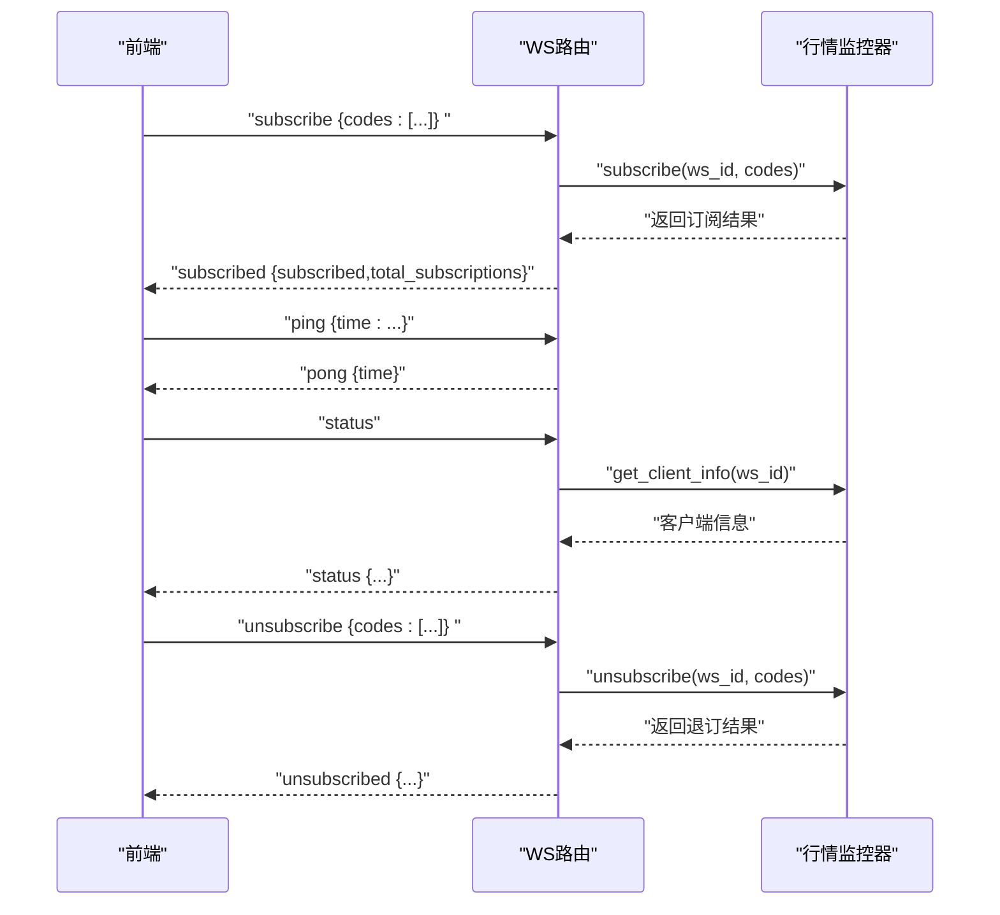
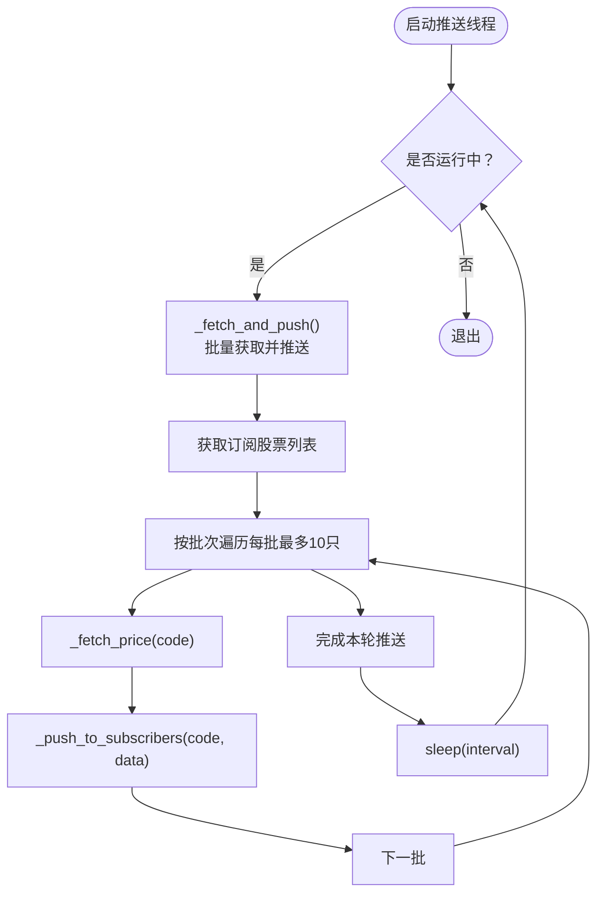
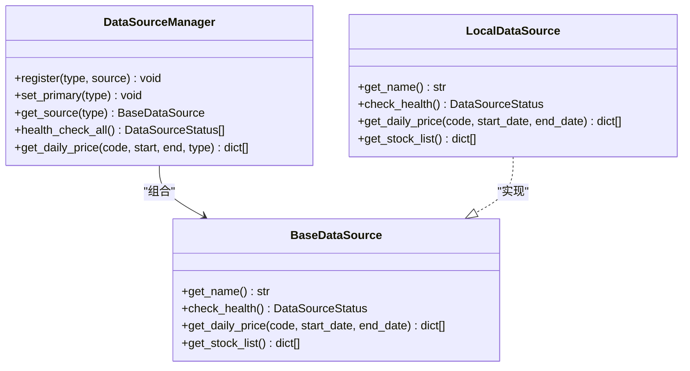
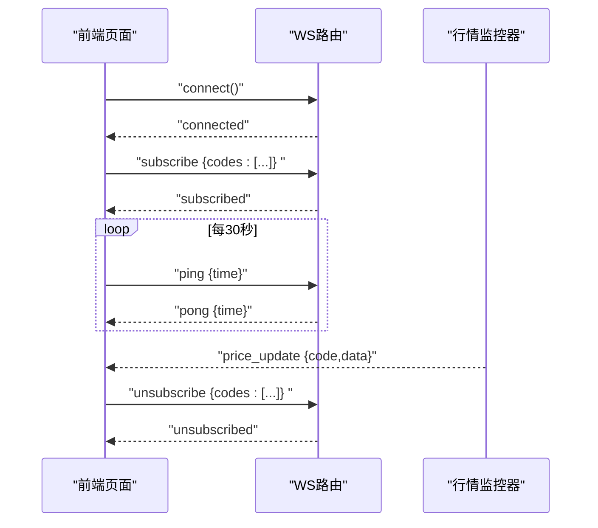
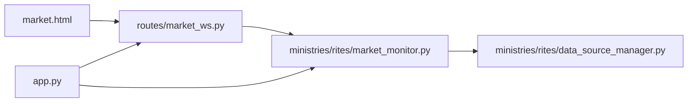

# WebSocket行情推送

<cite>
**本文引用的文件**
- [app.py](file://app.py)
- [routes/market_ws.py](file://routes/market_ws.py)
- [ministries/rites/market_monitor.py](file://ministries/rites/market_monitor.py)
- [ministries/rites/data_source_manager.py](file://ministries/rites/data_source_manager.py)
- [market.html](file://market.html)
- [requirements.txt](file://requirements.txt)
</cite>

## 目录
1. [简介](#简介)
2. [项目结构](#项目结构)
3. [核心组件](#核心组件)
4. [架构总览](#架构总览)
5. [详细组件分析](#详细组件分析)
6. [依赖关系分析](#依赖关系分析)
7. [性能考量](#性能考量)
8. [故障排查指南](#故障排查指南)
9. [结论](#结论)
10. [附录](#附录)

## 简介
本文件面向AIQuant的WebSocket行情推送系统，围绕以下目标展开：连接建立与维护、心跳与断线重连、消息协议与事件类型、实时订阅与推送优化、路由与安全、客户端示例与错误处理、实时性与延迟控制、性能优化与资源管理。内容以仓库现有实现为依据，结合前后端交互与监控器逻辑进行系统化梳理。

## 项目结构
WebSocket行情推送涉及如下关键模块：
- 应用入口与蓝图注册：负责启动Flask应用、注册WebSocket路由与HTTP API蓝图
- WebSocket路由：处理/ws/market连接、消息解析与应答
- 行情监控器：管理客户端连接、订阅关系、定时拉取与批量推送
- 数据源管理器：提供统一数据接口与主备切换
- 前端页面：演示连接、订阅、心跳与断线重连

图表来源
- [app.py:74-75](file://app.py#L74-L75)
- [routes/market_ws.py:67-72](file://routes/market_ws.py#L67-L72)
- [ministries/rites/market_monitor.py:21-36](file://ministries/rites/market_monitor.py#L21-L36)
- [ministries/rites/data_source_manager.py:111-122](file://ministries/rites/data_source_manager.py#L111-L122)
- [market.html:147-188](file://market.html#L147-L188)

章节来源
- [app.py:61-75](file://app.py#L61-L75)
- [routes/market_ws.py:17-23](file://routes/market_ws.py#L17-L23)
- [ministries/rites/market_monitor.py:21-36](file://ministries/rites/market_monitor.py#L21-L36)
- [ministries/rites/data_source_manager.py:111-122](file://ministries/rites/data_source_manager.py#L111-L122)
- [market.html:147-188](file://market.html#L147-L188)

## 核心组件
- 应用入口与蓝图注册
  - 初始化Flask、Sock、CORS，注册各蓝图，最后调用register_ws_routes(sock)完成WS路由绑定
  - 启动时自动启动行情监控器与实盘监控器
- WebSocket路由
  - /ws/market：连接处理、消息解析、订阅/退订、心跳、状态查询
  - /api/market/*：状态查询、客户端列表、手动启停推送
- 行情监控器
  - 客户端注册/注销、订阅管理、定时推送、系统事件广播
  - 批量拉取与推送，带锁保护与异常打印
- 数据源管理器
  - 抽象数据源接口、主备切换、健康检查、统一数据接口
- 前端页面
  - 建立WS连接、订阅管理、心跳发送、断线重连、消息渲染

章节来源
- [app.py:39-75](file://app.py#L39-L75)
- [routes/market_ws.py:67-123](file://routes/market_ws.py#L67-L123)
- [ministries/rites/market_monitor.py:21-244](file://ministries/rites/market_monitor.py#L21-L244)
- [ministries/rites/data_source_manager.py:111-177](file://ministries/rites/data_source_manager.py#L111-L177)
- [market.html:147-300](file://market.html#L147-L300)

## 架构总览
WebSocket行情推送采用“前端WS客户端 ↔ Flask-Sock路由 ↔ 行情监控器”的三层结构。行情监控器通过数据源管理器获取行情，按订阅关系批量推送至各客户端；同时提供HTTP API用于状态查询与手动启停。

图表来源
- [routes/market_ws.py:72-123](file://routes/market_ws.py#L72-L123)
- [ministries/rites/market_monitor.py:108-152](file://ministries/rites/market_monitor.py#L108-L152)
- [ministries/rites/data_source_manager.py:153-177](file://ministries/rites/data_source_manager.py#L153-L177)
- [market.html:161-188](file://market.html#L161-L188)

## 详细组件分析

### WebSocket路由与消息协议
- 路由与连接
  - /ws/market：建立连接后向客户端发送“connected”消息，携带ws_id与提示
  - 客户端断开或异常时，最终会注销客户端
- 消息协议
  - 统一为JSON对象，包含type、data、timestamp字段
  - 客户端请求动作：subscribe、unsubscribe、ping、status
  - 服务端应答类型：subscribed、unsubscribed、pong、status、error、price_update、system
- 心跳与断线重连
  - 服务端支持ping/pong；前端每30秒发送一次心跳
  - 前端在onclose时5秒后自动重连

图表来源
- [routes/market_ws.py:96-114](file://routes/market_ws.py#L96-L114)
- [routes/market_ws.py:125-141](file://routes/market_ws.py#L125-L141)
- [ministries/rites/market_monitor.py:59-93](file://ministries/rites/market_monitor.py#L59-L93)

章节来源
- [routes/market_ws.py:72-123](file://routes/market_ws.py#L72-L123)
- [routes/market_ws.py:125-141](file://routes/market_ws.py#L125-L141)
- [market.html:161-188](file://market.html#L161-L188)

### 行情监控器与推送机制
- 客户端管理
  - register/unregister：登记/移除客户端，维护订阅集合
  - 订阅管理：subscribe/unsubscribe，支持去重与大小写规范化
- 推送流程
  - start/stop：启动/停止推送线程
  - _push_loop：按间隔循环调用_fetch_and_push
  - _fetch_and_push：遍历订阅股票，批量获取行情并推送
  - _push_to_subscribers：逐客户端发送price_update消息
  - _broadcast_system：广播系统事件（如客户端上下线）
- 数据获取
  - 通过数据源管理器统一接口获取日线数据，取最新一条作为最新行情
- 并发与锁
  - 使用threading.Lock保护共享状态
  - 发送异常仅打印，避免影响主线程

图表来源
- [ministries/rites/market_monitor.py:108-152](file://ministries/rites/market_monitor.py#L108-L152)
- [ministries/rites/market_monitor.py:153-173](file://ministries/rites/market_monitor.py#L153-L173)
- [ministries/rites/market_monitor.py:175-192](file://ministries/rites/market_monitor.py#L175-L192)

章节来源
- [ministries/rites/market_monitor.py:39-93](file://ministries/rites/market_monitor.py#L39-L93)
- [ministries/rites/market_monitor.py:108-152](file://ministries/rites/market_monitor.py#L108-L152)
- [ministries/rites/market_monitor.py:153-173](file://ministries/rites/market_monitor.py#L153-L173)
- [ministries/rites/market_monitor.py:175-192](file://ministries/rites/market_monitor.py#L175-L192)

### 数据源管理器与主备切换
- 抽象接口：BaseDataSource定义健康检查、日线获取、股票列表等方法
- 默认实现：LocalDataSource对接本地数据库
- 管理器：DataSourceManager负责注册、主备切换与统一接口调用
- 切换策略：优先主数据源，失败则遍历备用数据源直至成功或耗尽

图表来源
- [ministries/rites/data_source_manager.py:48-69](file://ministries/rites/data_source_manager.py#L48-L69)
- [ministries/rites/data_source_manager.py:72-108](file://ministries/rites/data_source_manager.py#L72-L108)
- [ministries/rites/data_source_manager.py:111-177](file://ministries/rites/data_source_manager.py#L111-L177)

章节来源
- [ministries/rites/data_source_manager.py:111-177](file://ministries/rites/data_source_manager.py#L111-L177)

### 前端连接示例与消息处理
- 连接建立：使用ws://${host}/ws/market，连接成功后可重新订阅
- 心跳：每30秒发送ping消息
- 断线重连：onclose后5秒重试
- 消息处理：connected、subscribed、price_update、system、pong等类型分别处理
- 订阅管理：输入框输入股票代码，点击订阅或删除，自动发送subscribe/unsubscribe

图表来源
- [market.html:161-188](file://market.html#L161-L188)
- [market.html:196-214](file://market.html#L196-L214)
- [routes/market_ws.py:96-114](file://routes/market_ws.py#L96-L114)

章节来源
- [market.html:147-300](file://market.html#L147-L300)
- [routes/market_ws.py:72-123](file://routes/market_ws.py#L72-L123)

### WebSocket路由配置、认证与安全
- 路由配置
  - WS路由：/ws/market
  - HTTP API：/api/market/status、/api/market/clients、/api/market/start、/api/market/stop
- 认证与鉴权
  - 当前实现未见专门的认证/鉴权逻辑，建议在WS路由层增加鉴权中间件或在上游网关/代理层实现
- 安全考虑
  - 建议启用WSS（WebSocket Secure），限制来源域名（CORS），对消息长度与频率做限制，防止DoS
  - 对敏感操作（如批量退订）增加速率限制与白名单校验

章节来源
- [routes/market_ws.py:17-64](file://routes/market_ws.py#L17-L64)
- [app.py:39-41](file://app.py#L39-L41)

## 依赖关系分析
- 组件耦合
  - routes/market_ws.py依赖ministries.rites.market_monitor获取监控器实例
  - market_monitor依赖data_source_manager进行数据获取
  - market.html依赖routes/market_ws.py提供的WS端点
- 外部依赖
  - Flask、Flask-Sock、simple-websocket、CORS

图表来源
- [app.py:25-26](file://app.py#L25-L26)
- [routes/market_ws.py:15](file://routes/market_ws.py#L15)
- [ministries/rites/market_monitor.py:18](file://ministries/rites/market_monitor.py#L18)

章节来源
- [app.py:25-26](file://app.py#L25-L26)
- [routes/market_ws.py:15](file://routes/market_ws.py#L15)
- [ministries/rites/market_monitor.py:18](file://ministries/rites/market_monitor.py#L18)

## 性能考量
- 推送频率与批处理
  - 默认5秒一次，每批最多10只股票，避免一次性拉取过多导致阻塞
- 并发与锁
  - 使用threading.Lock保护clients与subscriptions，避免竞态
  - 发送失败仅打印，不影响主线程；建议引入队列与重试机制
- 内存与资源
  - 客户端断开后及时注销，释放订阅关系
  - 停止推送时等待线程退出，避免资源泄漏
- 前端优化
  - 心跳周期30秒，减少不必要的网络开销
  - 断线重连指数退避可选，避免雪崩式重连

章节来源
- [ministries/rites/market_monitor.py:108-152](file://ministries/rites/market_monitor.py#L108-L152)
- [ministries/rites/market_monitor.py:175-192](file://ministries/rites/market_monitor.py#L175-L192)
- [market.html:297-300](file://market.html#L297-L300)

## 故障排查指南
- 常见问题
  - 连接失败：检查WS端点、CORS配置、防火墙
  - 无行情更新：确认监控器已启动、订阅有效、数据源可用
  - 心跳异常：检查前端定时器、服务端ping处理
  - 断线频繁：检查网络稳定性、断线重连策略
- 排查步骤
  - 通过HTTP API查询状态与客户端列表
  - 查看服务端日志中的异常打印
  - 在前端控制台观察连接状态与消息日志
- 建议改进
  - 增加更详细的错误码与错误信息
  - 对推送失败进行统计与告警
  - 增加限流与熔断机制

章节来源
- [routes/market_ws.py:26-64](file://routes/market_ws.py#L26-L64)
- [routes/market_ws.py:119-122](file://routes/market_ws.py#L119-L122)
- [ministries/rites/market_monitor.py:129-131](file://ministries/rites/market_monitor.py#L129-L131)
- [ministries/rites/market_monitor.py:191-192](file://ministries/rites/market_monitor.py#L191-L192)

## 结论
AIQuant的WebSocket行情推送系统以Flask-Sock为基础，结合自研行情监控器与数据源管理器，实现了从连接、订阅、心跳到批量推送的完整闭环。系统具备基础的心跳与断线重连能力，消息协议清晰，前端示例完备。为进一步提升可靠性与安全性，建议补充认证鉴权、WSS、速率限制、队列与重试、以及更完善的错误处理与可观测性。

## 附录
- 启动与访问
  - 后端启动后打印WS端点：ws://localhost:5000/ws/market
  - 健康检查端点：/api/health
- 依赖安装
  - 使用requirements.txt中的依赖（含flask-sock、simple-websocket）

章节来源
- [app.py:150-151](file://app.py#L150-L151)
- [requirements.txt:1-9](file://requirements.txt#L1-9)