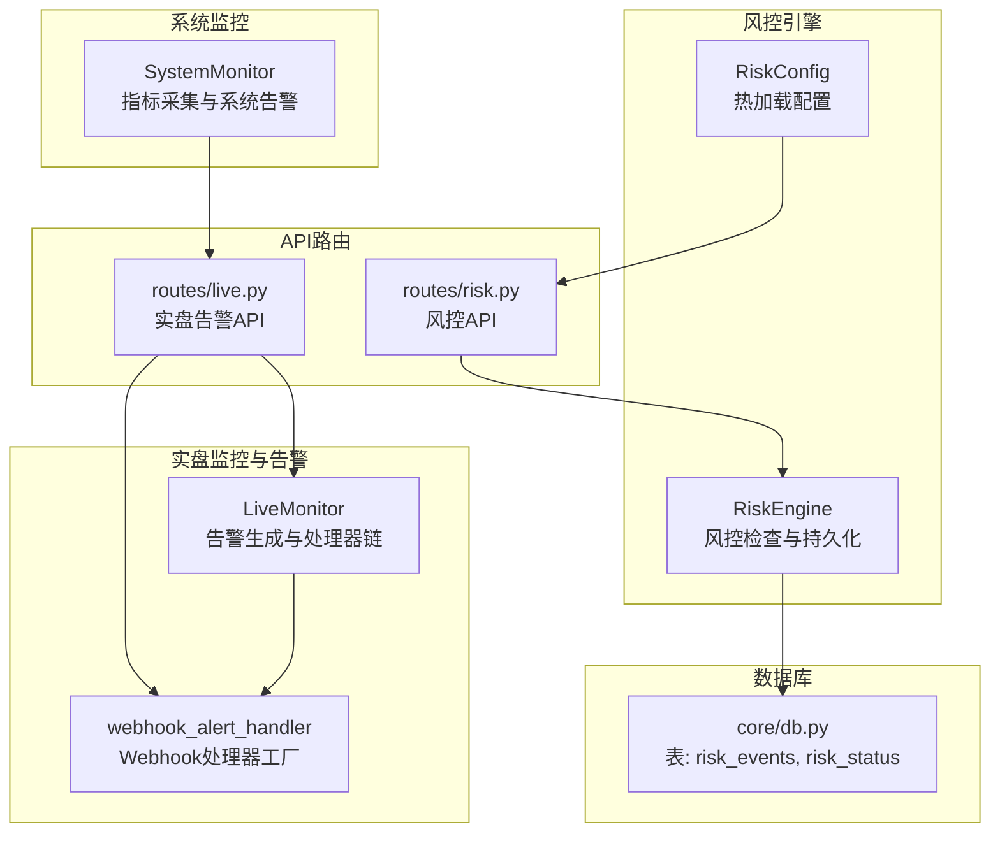
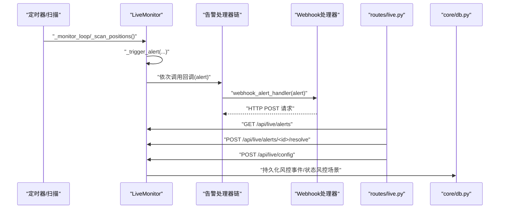
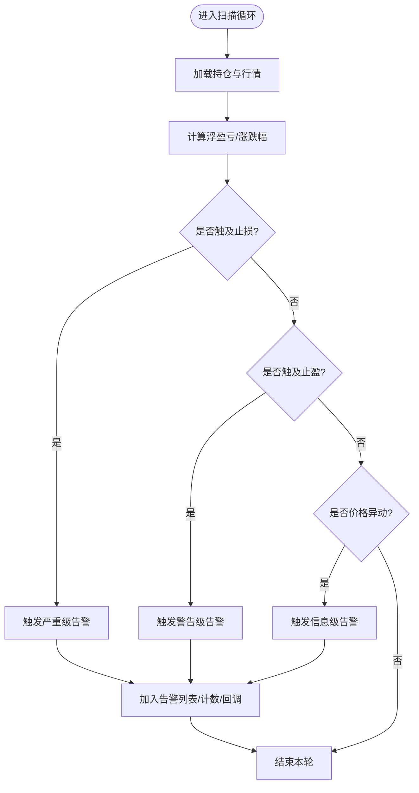
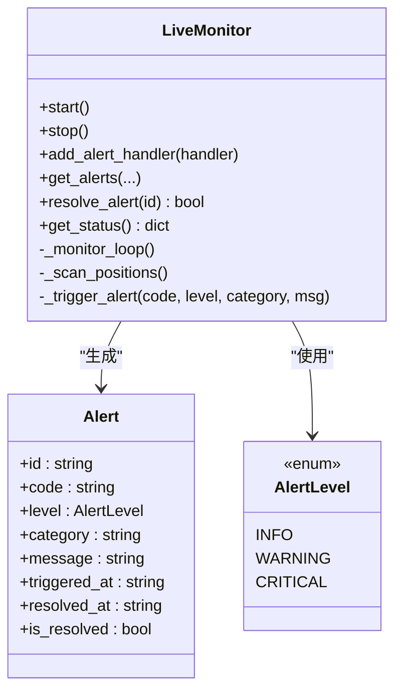
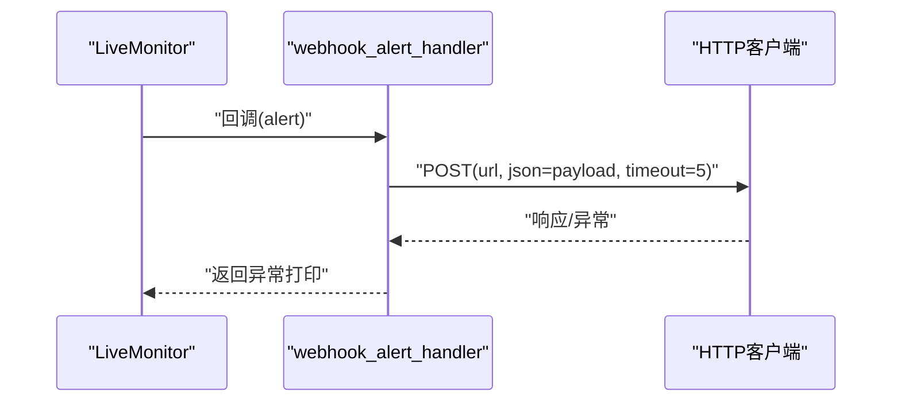
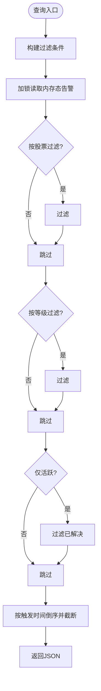
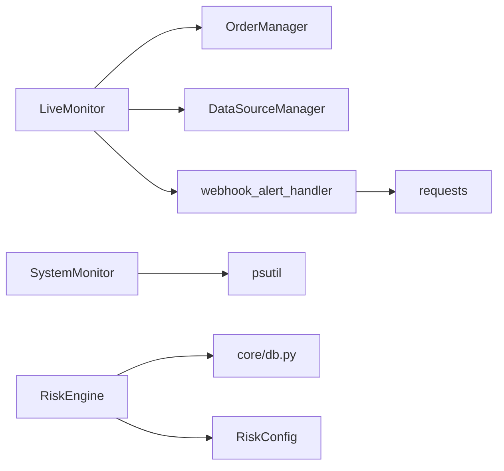

# 告警通知系统

<cite>
**本文引用的文件**
- [live/monitor.py](file://live/monitor.py)
- [routes/live.py](file://routes/live.py)
- [ministries/works/monitor.py](file://ministries/works/monitor.py)
- [risk/engine.py](file://risk/engine.py)
- [risk/models.py](file://risk/models.py)
- [risk/config_loader.py](file://risk/config_loader.py)
- [routes/risk.py](file://routes/risk.py)
- [core/db.py](file://core/db.py)
</cite>

## 目录
1. [简介](#简介)
2. [项目结构](#项目结构)
3. [核心组件](#核心组件)
4. [架构总览](#架构总览)
5. [详细组件分析](#详细组件分析)
6. [依赖分析](#依赖分析)
7. [性能考虑](#性能考虑)
8. [故障排查指南](#故障排查指南)
9. [结论](#结论)
10. [附录](#附录)

## 简介
本文件面向AIQuant项目的告警通知系统，系统覆盖以下能力：
- 告警等级分类：信息级、警告级、严重级（对应实盘监控）；风控等级：通过、警告、限制、阻断（对应风控引擎）
- 告警触发机制：定时扫描持仓、止盈止损、价格异动等条件触发
- 告警处理器架构：回调注册、处理器链管理、异步处理
- Webhook推送：HTTP请求构建、超时控制与错误处理
- 告警存储与查询：内存态告警列表、状态跟踪、历史查询接口
- 频率控制与去重：按股票的最大告警数限制
- 告警恢复处理：手动解决告警、状态更新
- 统计分析与趋势：系统监控模块的指标采集与状态摘要
- 扩展性与自定义：可插拔处理器、可配置阈值、可热加载的风控配置

## 项目结构
告警通知系统主要由以下模块构成：
- 实盘监控与告警：负责定时扫描、触发条件判断、告警生成与处理器链执行
- WebAPI路由：提供告警查询、解决、清理、配置更新等REST接口
- 系统监控：采集CPU/内存/磁盘/数据库大小等指标，触发系统级告警
- 风控引擎：执行风控检查，产生风控事件与状态，并持久化到数据库
- 数据库：提供风险事件与状态的存储、查询接口

图表来源
- [live/monitor.py:55-285](file://live/monitor.py#L55-L285)
- [routes/live.py:1-125](file://routes/live.py#L1-L125)
- [ministries/works/monitor.py:29-114](file://ministries/works/monitor.py#L29-L114)
- [risk/engine.py:13-168](file://risk/engine.py#L13-L168)
- [risk/config_loader.py:20-131](file://risk/config_loader.py#L20-L131)
- [core/db.py:358-414](file://core/db.py#L358-L414)

章节来源
- [live/monitor.py:1-286](file://live/monitor.py#L1-L286)
- [routes/live.py:1-125](file://routes/live.py#L1-L125)
- [ministries/works/monitor.py:1-114](file://ministries/works/monitor.py#L1-L114)
- [risk/engine.py:1-168](file://risk/engine.py#L1-L168)
- [risk/config_loader.py:1-131](file://risk/config_loader.py#L1-L131)
- [core/db.py:358-414](file://core/db.py#L358-L414)

## 核心组件
- 实盘监控器（LiveMonitor）
  - 定时扫描持仓，计算浮盈亏百分比、涨跌幅，触发止损、止盈、价格异动告警
  - 提供告警处理器注册、回调链执行、告警查询、解决、清理、状态查询
  - 支持Webhook处理器工厂，基于配置URL进行HTTP推送
- WebAPI路由（routes/live.py）
  - 提供启动/停止监控、获取状态、列出告警、解决告警、清空告警、更新配置等接口
- 系统监控器（SystemMonitor）
  - 采集CPU/内存/磁盘/数据库大小等指标，触发系统级告警（警告/严重）
- 风控引擎（RiskEngine）
  - 执行风控规则检查，聚合最严格等级，持久化风控事件与状态
- 风控配置（RiskConfig）
  - YAML配置热加载，提供规则开关、阈值、消息模板、建议文本等
- 数据库（core/db.py）
  - 提供风险事件与状态的建表、插入、查询接口

章节来源
- [live/monitor.py:55-285](file://live/monitor.py#L55-L285)
- [routes/live.py:1-125](file://routes/live.py#L1-L125)
- [ministries/works/monitor.py:29-114](file://ministries/works/monitor.py#L29-L114)
- [risk/engine.py:13-168](file://risk/engine.py#L13-L168)
- [risk/config_loader.py:20-131](file://risk/config_loader.py#L20-L131)
- [core/db.py:358-414](file://core/db.py#L358-L414)

## 架构总览
告警系统采用“监控-触发-处理-存储-查询”的闭环架构：
- 监控层：实盘监控器与系统监控器分别负责业务与系统层面的监控
- 触发层：条件满足时生成告警对象（包含等级、类别、消息、时间戳等）
- 处理层：回调链顺序执行，内置Webhook处理器可将告警推送到外部系统
- 存储层：风控事件与状态持久化至SQLite数据库
- 查询层：提供REST接口用于查询状态、告警列表、风控事件与状态

图表来源
- [live/monitor.py:91-186](file://live/monitor.py#L91-L186)
- [routes/live.py:53-125](file://routes/live.py#L53-L125)
- [core/db.py:358-414](file://core/db.py#L358-L414)

## 详细组件分析

### 告警等级分类体系
- 实盘监控告警等级
  - 信息级（INFO）：如价格异动
  - 警告级（WARNING）：如止盈触发
  - 严重级（CRITICAL）：如止损触发
- 风控等级（风控引擎）
  - 通过（PASS）、警告（WARNING）、限制（RESTRICT）、阻断（BLOCK）
  - 等级优先级：阻断 > 限制 > 警告 > 通过，最终等级取最严格者

章节来源
- [live/monitor.py:24-42](file://live/monitor.py#L24-L42)
- [risk/engine.py:41-49](file://risk/engine.py#L41-L49)
- [risk/models.py:11-25](file://risk/models.py#L11-L25)

### 告警触发机制
- 触发条件
  - 止损：浮亏达到或超过预设阈值
  - 止盈：浮盈达到或超过预设阈值
  - 价格异动：当日涨跌幅达到或超过预设阈值
- 触发时机
  - 定时轮询：按配置的检查间隔执行扫描
  - 异常保护：扫描过程中异常被捕获并记录，不影响主循环
- 告警生成流程
  - 计算指标 → 判断阈值 → 生成告警对象 → 增加计数 → 打印日志 → 依次调用处理器回调

图表来源
- [live/monitor.py:102-155](file://live/monitor.py#L102-L155)

章节来源
- [live/monitor.py:102-155](file://live/monitor.py#L102-L155)

### 告警处理器架构
- 回调函数注册
  - 通过添加处理器接口注册任意回调函数
  - Webhook处理器可通过配置URL动态注册
- 处理器链管理
  - 以列表形式维护处理器，按注册顺序依次执行
  - 单个处理器异常不会影响其他处理器
- 异步处理机制
  - Webhook请求在回调内部发起，属于同步调用
  - 实盘监控主循环为独立线程，避免阻塞主线程

图表来源
- [live/monitor.py:55-186](file://live/monitor.py#L55-L186)

章节来源
- [live/monitor.py:187-201](file://live/monitor.py#L187-L201)
- [routes/live.py:94-125](file://routes/live.py#L94-L125)

### Webhook推送实现
- HTTP请求构建
  - 使用HTTP客户端发送POST请求，JSON负载包含告警关键字段
- 超时处理
  - 设置短超时，避免阻塞告警回调
- 错误重试策略
  - 当前实现未内置重试逻辑，出现异常会打印错误日志

图表来源
- [live/monitor.py:256-273](file://live/monitor.py#L256-L273)

章节来源
- [live/monitor.py:256-273](file://live/monitor.py#L256-L273)

### 告警存储与查询
- 告警记录管理
  - 内存态存储：告警列表、按股票的告警计数、锁保护
  - 提供查询、过滤、排序、限制数量的接口
- 状态跟踪
  - 告警状态包含触发时间、解决时间、是否已解决
- 历史查询接口
  - 实盘告警：支持按股票、等级、仅活跃、限制数量查询
  - 风控事件：支持按等级过滤、限制数量查询
  - 风控状态：查询最新风控状态快照

图表来源
- [live/monitor.py:218-245](file://live/monitor.py#L218-L245)

章节来源
- [live/monitor.py:218-251](file://live/monitor.py#L218-L251)
- [routes/live.py:53-91](file://routes/live.py#L53-L91)
- [routes/risk.py:52-64](file://routes/risk.py#L52-L64)
- [risk/engine.py:129-167](file://risk/engine.py#L129-L167)

### 告警频率控制、去重与恢复
- 频率控制与去重
  - 按股票设置最大告警数阈值，超过阈值的同类型告警会被丢弃
- 告警恢复
  - 支持按ID解决告警，更新解决时间与状态，并减少该股票的告警计数

章节来源
- [live/monitor.py:160-162](file://live/monitor.py#L160-L162)
- [live/monitor.py:187-196](file://live/monitor.py#L187-L196)

### 风控事件与状态持久化
- 风控事件（risk_events）
  - 记录规则名、类别、等级、消息、指标值、阈值、建议、时间戳
- 风控状态（risk_status）
  - 记录账户ID、整体等级、活跃规则、当前回撤、持仓数、总敞口、可用资金、最后检查时间、阻断原因
- 查询接口
  - 最新状态查询、最近事件查询

章节来源
- [risk/engine.py:73-127](file://risk/engine.py#L73-L127)
- [core/db.py:358-414](file://core/db.py#L358-L414)
- [routes/risk.py:31-64](file://routes/risk.py#L31-L64)

### 系统监控与系统级告警
- 指标采集
  - CPU使用率、内存使用率、磁盘使用率、数据库大小
- 告警触发
  - CPU>80%触发警告
  - 内存>85%触发警告
  - 磁盘>90%触发严重告警
- 状态摘要
  - 健康状态、指标数值、告警总数

章节来源
- [ministries/works/monitor.py:36-101](file://ministries/works/monitor.py#L36-L101)

## 依赖分析
- 组件耦合
  - 实盘监控器依赖订单与数据源管理器获取持仓与行情
  - Webhook处理器依赖HTTP客户端
  - 风控引擎依赖数据库连接与配置加载器
- 外部依赖
  - requests（Webhook）
  - psutil（系统监控）
  - SQLite（本地存储）

图表来源
- [live/monitor.py:104-105](file://live/monitor.py#L104-L105)
- [ministries/works/monitor.py:38-54](file://ministries/works/monitor.py#L38-L54)
- [risk/engine.py:76-125](file://risk/engine.py#L76-L125)
- [risk/config_loader.py:45-71](file://risk/config_loader.py#L45-L71)

章节来源
- [live/monitor.py:104-105](file://live/monitor.py#L104-L105)
- [ministries/works/monitor.py:38-54](file://ministries/works/monitor.py#L38-L54)
- [risk/engine.py:76-125](file://risk/engine.py#L76-L125)
- [risk/config_loader.py:45-71](file://risk/config_loader.py#L45-L71)

## 性能考虑
- 实盘监控
  - 主循环使用守护线程，避免阻塞主线程
  - 扫描异常捕获，保证稳定性
- Webhook
  - 短超时避免阻塞回调链
  - 可扩展为异步队列+重试策略
- 数据库
  - WAL模式与常规同步参数提升并发与可靠性
  - 风控事件与状态表建立索引，优化查询

## 故障排查指南
- Webhook推送失败
  - 检查URL配置是否正确
  - 查看回调异常日志
  - 调整超时或增加重试
- 告警未触发
  - 检查监控是否启动、检查间隔是否合理
  - 核对阈值配置（止损、止盈、价格异动）
- 告警被限流
  - 检查单股最大告警数配置
  - 关注告警计数与状态
- 风控事件未入库
  - 检查数据库连接与建表
  - 查看引擎保存异常日志

章节来源
- [routes/live.py:94-125](file://routes/live.py#L94-L125)
- [live/monitor.py:160-162](file://live/monitor.py#L160-L162)
- [risk/engine.py:73-127](file://risk/engine.py#L73-L127)

## 结论
AIQuant的告警通知系统以实盘监控与系统监控为核心，结合可插拔的处理器链与Webhook推送，实现了从触发、处理到存储与查询的完整闭环。系统具备良好的扩展性：可新增处理器、调整阈值、热加载风控配置，并通过数据库持久化风控事件与状态，便于后续统计分析与审计。

## 附录

### API一览（实盘告警）
- GET /api/live/status：获取监控状态
- POST /api/live/start：启动监控
- POST /api/live/stop：停止监控
- GET /api/live/alerts：获取告警列表（支持按股票、等级、仅活跃、限制数量）
- POST /api/live/alerts/<id>/resolve：解决告警
- POST /api/live/alerts/clear：清空告警
- POST /api/live/config：更新配置（含Webhook URL注册）

章节来源
- [routes/live.py:22-125](file://routes/live.py#L22-L125)

### API一览（风控）
- GET /api/risk/status：获取当前风控状态
- GET /api/risk/events：获取最近风控事件（支持按等级、限制数量）
- POST /api/risk/check：手动触发风控检查
- GET /api/risk/config：获取风控配置
- POST /api/risk/config/reload：热加载风控配置
- GET/POST/DELETE 黑名单管理与风控豁免接口

章节来源
- [routes/risk.py:31-244](file://routes/risk.py#L31-L244)