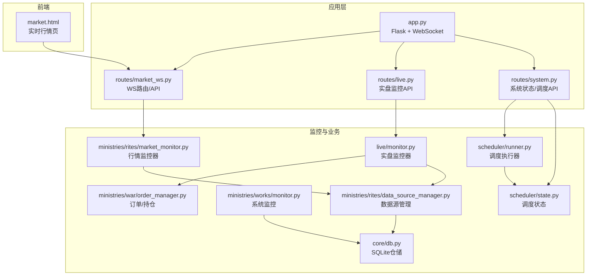
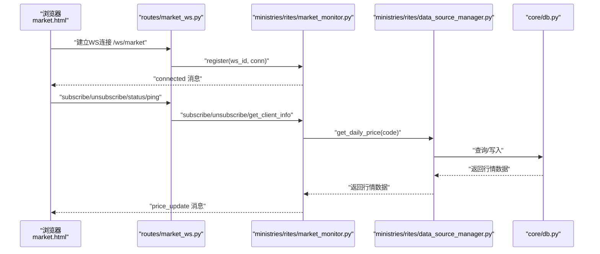
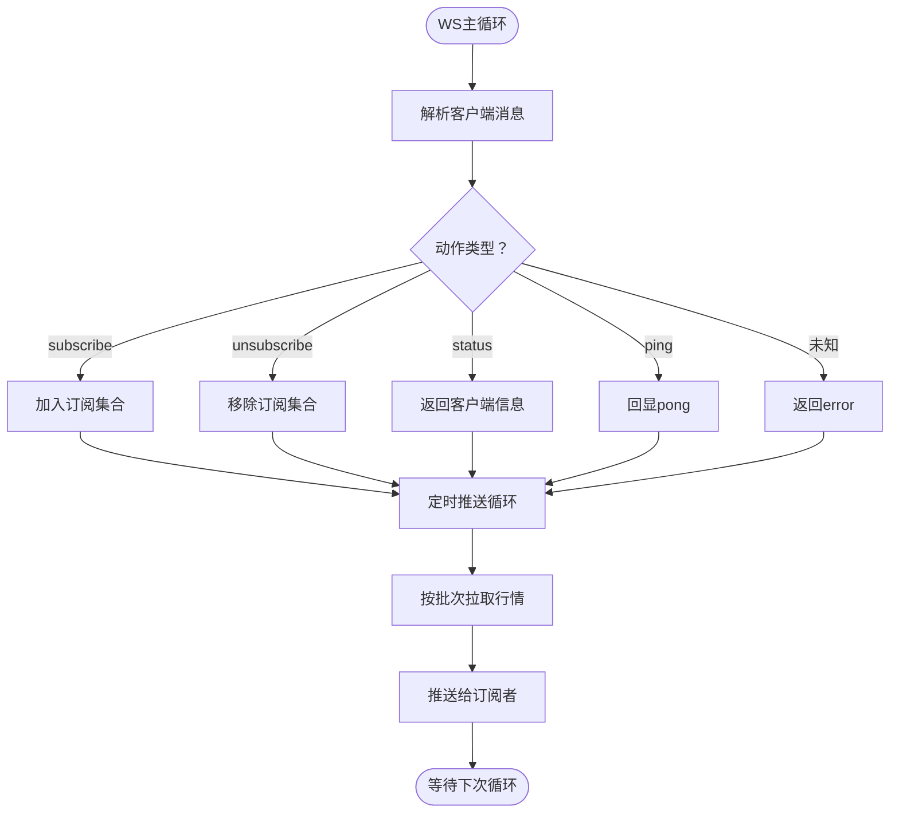
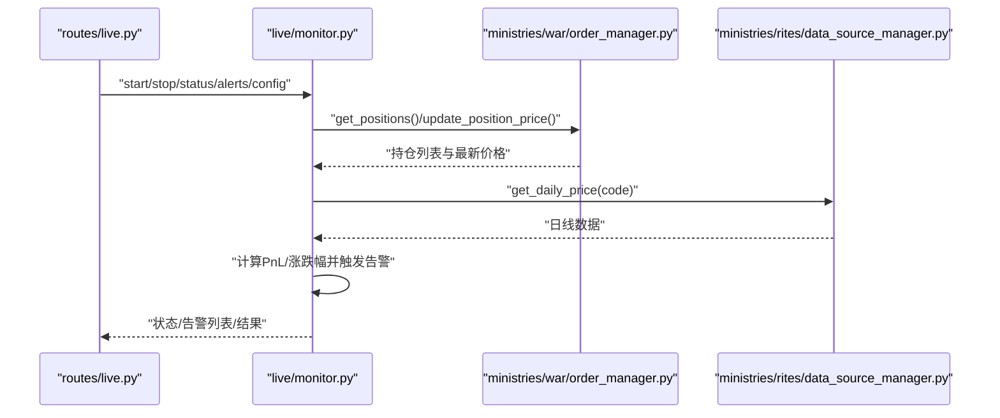
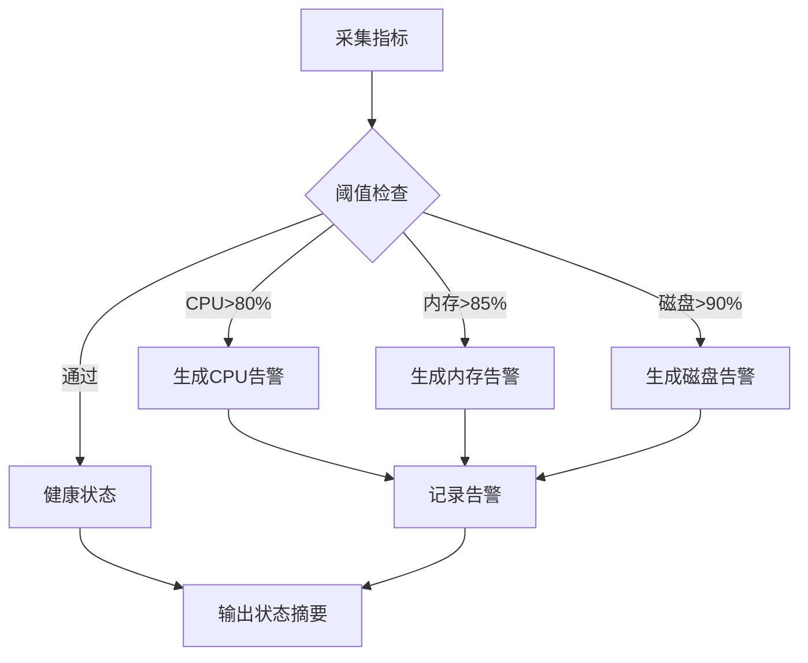
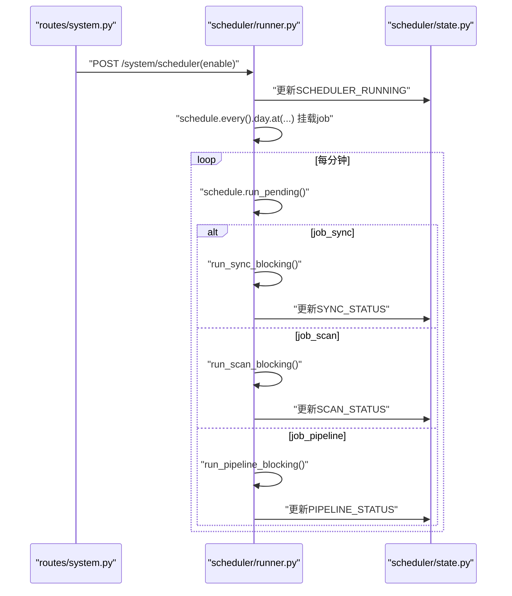
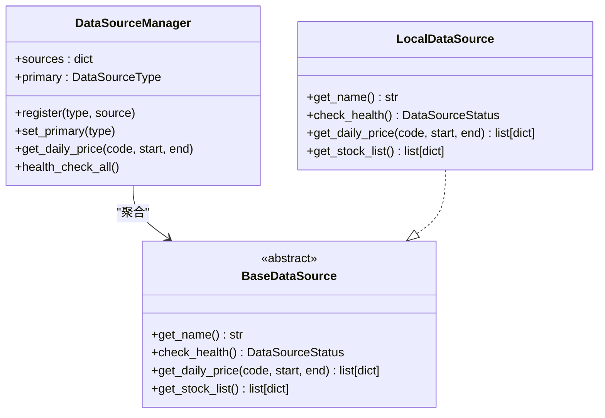
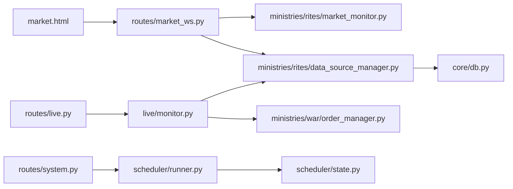

# 实时监控

<cite>
**本文引用的文件**
- [app.py](file://app.py)
- [routes/market_ws.py](file://routes/market_ws.py)
- [routes/live.py](file://routes/live.py)
- [routes/system.py](file://routes/system.py)
- [ministries/rites/market_monitor.py](file://ministries/rites/market_monitor.py)
- [ministries/rites/data_source_manager.py](file://ministries/rites/data_source_manager.py)
- [ministries/war/order_manager.py](file://ministries/war/order_manager.py)
- [live/monitor.py](file://live/monitor.py)
- [ministries/works/monitor.py](file://ministries/works/monitor.py)
- [scheduler/runner.py](file://scheduler/runner.py)
- [scheduler/state.py](file://scheduler/state.py)
- [core/db.py](file://core/db.py)
- [market.html](file://market.html)
</cite>

## 更新摘要
**变更内容**
- 新增LiveMonitor实盘监控器，实现持仓监控、告警通知、Webhook推送
- 新增MarketMonitor行情监控器，提供WebSocket行情推送功能
- 完善监控告警机制，支持多种告警等级和阈值配置
- 增强数据源管理，支持多数据源主备切换
- 扩展系统健康检查，包含更多性能指标

## 目录
1. [简介](#简介)
2. [项目结构](#项目结构)
3. [核心组件](#核心组件)
4. [架构总览](#架构总览)
5. [详细组件分析](#详细组件分析)
6. [依赖关系分析](#依赖关系分析)
7. [性能考量](#性能考量)
8. [故障排查指南](#故障排查指南)
9. [结论](#结论)
10. [附录](#附录)

## 简介
本文件面向运维与开发人员，系统化阐述AIQuant的实时监控体系，覆盖以下方面：
- WebSocket行情推送：连接处理、消息格式、事件类型与订阅管理
- 实时数据更新策略、数据缓存与状态同步
- 实盘监控与告警：异常检测、阈值规则、Webhook推送与状态查询
- 系统健康检查、性能指标与健康状态
- 监控仪表板设计与配置要点
- 调度器工作原理与任务管理
- 并发控制与性能优化建议
- 扩展与自定义告警规则
- 运维配置与故障排查

## 项目结构
围绕"实时监控"主题，相关模块分布如下：
- WebSocket行情：routes/market_ws.py + ministries/rites/market_monitor.py
- 实盘监控与告警：live/monitor.py + routes/live.py
- 系统健康与指标：ministries/works/monitor.py
- 数据源与仓储：ministries/rites/data_source_manager.py + core/db.py
- 订单与持仓：ministries/war/order_manager.py
- 调度与状态：scheduler/runner.py + scheduler/state.py
- 应用入口与路由：app.py
- 前端仪表板：market.html

**图表来源**
- [app.py:1-164](file://app.py#L1-L164)
- [routes/market_ws.py:1-142](file://routes/market_ws.py#L1-L142)
- [routes/live.py:1-126](file://routes/live.py#L1-L126)
- [routes/system.py:1-152](file://routes/system.py#L1-L152)
- [ministries/rites/market_monitor.py:1-244](file://ministries/rites/market_monitor.py#L1-L244)
- [live/monitor.py:1-286](file://live/monitor.py#L1-L286)
- [ministries/war/order_manager.py:1-211](file://ministries/war/order_manager.py#L1-L211)
- [ministries/works/monitor.py:1-114](file://ministries/works/monitor.py#L1-L114)
- [ministries/rites/data_source_manager.py:1-190](file://ministries/rites/data_source_manager.py#L1-L190)
- [core/db.py:1-800](file://core/db.py#L1-L800)
- [scheduler/runner.py:1-212](file://scheduler/runner.py#L1-L212)
- [scheduler/state.py:1-45](file://scheduler/state.py#L1-L45)
- [market.html:1-200](file://market.html#L1-L200)

## 核心组件
- **WebSocket行情监控器**：负责客户端连接、订阅管理、定时批量拉取与推送
- **实盘监控器**：基于订单与数据源，周期扫描持仓并触发告警
- **系统监控器**：采集CPU/内存/磁盘/数据库大小等指标并生成健康状态
- **数据源管理器**：统一多数据源接入、健康检查与主备切换
- **订单管理器**：维护持仓、计算浮动盈亏并驱动实盘监控
- **调度器**：按计划执行数据同步、策略扫描与多Agent流水线
- **前端仪表板**：实时行情页，展示连接状态、订阅列表与报价

**章节来源**
- [ministries/rites/market_monitor.py:21-244](file://ministries/rites/market_monitor.py#L21-L244)
- [live/monitor.py:55-286](file://live/monitor.py#L55-L286)
- [ministries/works/monitor.py:29-114](file://ministries/works/monitor.py#L29-L114)
- [ministries/rites/data_source_manager.py:111-190](file://ministries/rites/data_source_manager.py#L111-L190)
- [ministries/war/order_manager.py:69-211](file://ministries/war/order_manager.py#L69-L211)
- [scheduler/runner.py:158-212](file://scheduler/runner.py#L158-L212)
- [market.html:147-200](file://market.html#L147-L200)

## 架构总览
下图展示从浏览器到后端、再到数据源与数据库的完整链路。

**图表来源**
- [routes/market_ws.py:72-123](file://routes/market_ws.py#L72-L123)
- [ministries/rites/market_monitor.py:39-211](file://ministries/rites/market_monitor.py#L39-L211)
- [ministries/rites/data_source_manager.py:153-177](file://ministries/rites/data_source_manager.py#L153-L177)
- [core/db.py:631-665](file://core/db.py#L631-L665)

## 详细组件分析

### WebSocket行情推送机制
- **连接处理**
  - 蓝图注册与WS路由：routes/market_ws.py注册/ws/market，并在app.py中注入Sock实例
  - 客户端连接：分配ws_id，注册到监控器，发送connected确认
  - 断线重连：前端监听onclose后5秒重连
- **消息格式与事件类型**
  - 统一JSON结构：type、data、timestamp
  - 事件类型：connected、subscribed、unsubscribed、price_update、system、error、pong
  - 控制动作：subscribe、unsubscribe、status、ping
- **实时数据更新策略**
  - 定时拉取：监控器按固定间隔遍历订阅列表，批量获取行情（每次最多10只，避免过载）
  - 数据缓存：行情数据来自数据源管理器，底层使用SQLite仓储
  - 状态同步：推送前构建标准化报价对象（开盘/最高/最低/收盘/成交量/涨跌幅等）

**图表来源**
- [routes/market_ws.py:96-117](file://routes/market_ws.py#L96-L117)
- [ministries/rites/market_monitor.py:124-193](file://ministries/rites/market_monitor.py#L124-L193)

**章节来源**
- [routes/market_ws.py:72-142](file://routes/market_ws.py#L72-L142)
- [ministries/rites/market_monitor.py:21-244](file://ministries/rites/market_monitor.py#L21-L244)
- [ministries/rites/data_source_manager.py:153-177](file://ministries/rites/data_source_manager.py#L153-L177)
- [core/db.py:631-665](file://core/db.py#L631-L665)

### 实盘监控与告警
- **监控范围**
  - 止损/止盈：基于持仓浮动盈亏百分比
  - 价格异动：基于昨收涨跌幅
  - 告警等级：info/warning/critical
- **告警处理**
  - 触发：限制单股告警频率，记录告警并执行回调
  - 解决：标记告警为已解决并更新计数
  - Webhook：可配置URL，推送告警至外部系统
- **配置与API**
  - 支持动态调整阈值、检查间隔、最大告警数、Webhook地址
  - 提供启动/停止、状态查询、告警列表、解决与清空等REST接口

**图表来源**
- [routes/live.py:22-126](file://routes/live.py#L22-L126)
- [live/monitor.py:102-155](file://live/monitor.py#L102-L155)
- [ministries/war/order_manager.py:142-154](file://ministries/war/order_manager.py#L142-L154)
- [ministries/rites/data_source_manager.py:153-177](file://ministries/rites/data_source_manager.py#L153-L177)

**章节来源**
- [live/monitor.py:55-286](file://live/monitor.py#L55-L286)
- [routes/live.py:1-126](file://routes/live.py#L1-L126)
- [ministries/war/order_manager.py:69-211](file://ministries/war/order_manager.py#L69-L211)

### 系统健康检查与性能指标
- **指标采集**
  - CPU/内存/磁盘使用率
  - 数据库大小（MB）
  - 活跃连接数、待处理订单数、1小时内错误计数
- **告警规则**
  - CPU>80%、内存>85%、磁盘>90%触发告警
- **状态摘要**
  - 健康/警告状态与最近指标快照

**图表来源**
- [ministries/works/monitor.py:36-101](file://ministries/works/monitor.py#L36-L101)

**章节来源**
- [ministries/works/monitor.py:16-114](file://ministries/works/monitor.py#L16-L114)

### 调度器与任务管理
- **模式**
  - 传统模式：每日07:00同步、09:00扫描
  - 多Agent流水线模式：07:30 DataAgent预同步，09:00完整流水线
- **任务执行**
  - run_sync_blocking：初始化数据库、判断交易日、收盘后全量同步、盘中增量同步
  - run_scan_blocking：执行策略扫描（可选重算+扫描）
  - run_pipeline_blocking：执行多Agent流水线，更新流水线状态
- **状态管理**
  - 使用全局状态字典记录运行状态、最后执行时间与结果
  - 支持启用/禁用调度器

**图表来源**
- [routes/system.py:66-83](file://routes/system.py#L66-L83)
- [scheduler/runner.py:158-212](file://scheduler/runner.py#L158-L212)
- [scheduler/state.py:5-45](file://scheduler/state.py#L5-L45)

**章节来源**
- [routes/system.py:12-152](file://routes/system.py#L12-L152)
- [scheduler/runner.py:29-212](file://scheduler/runner.py#L29-L212)
- [scheduler/state.py:1-45](file://scheduler/state.py#L1-L45)

### 数据源管理与仓储
- **数据源抽象与主备切换**
  - DataSourceManager统一管理多数据源，优先主数据源，失败自动切换备用
  - DataSourceStatus封装可用性、延迟、错误计数与质量等级
- **仓储与查询**
  - core/db.py提供SQLite连接上下文、建表与索引、批量写入与查询
  - get_daily_price等接口返回DataFrame并支持索引优化

**图表来源**
- [ministries/rites/data_source_manager.py:111-190](file://ministries/rites/data_source_manager.py#L111-L190)
- [core/db.py:26-40](file://core/db.py#L26-L40)

**章节来源**
- [ministries/rites/data_source_manager.py:1-190](file://ministries/rites/data_source_manager.py#L1-L190)
- [core/db.py:1-800](file://core/db.py#L1-L800)

### 监控仪表板设计与配置
- **页面功能**
  - 连接状态指示、订阅管理、报价展示、连接日志
  - 支持订阅/退订、心跳ping、断线自动重连
- **前端交互**
  - 通过WebSocket与后端通信，接收price_update并渲染报价
  - 通过REST API获取监控状态与客户端列表

**章节来源**
- [market.html:147-200](file://market.html#L147-L200)
- [routes/market_ws.py:26-64](file://routes/market_ws.py#L26-L64)

## 依赖关系分析
- **组件耦合**
  - routes/market_ws.py依赖ministries/rites/market_monitor.py进行连接与推送
  - live/monitor.py依赖ministries/war/order_manager.py与ministries/rites/data_source_manager.py
  - routes/system.py依赖scheduler/runner.py与scheduler/state.py
  - 前端market.html依赖routes/market_ws.py提供的WS与REST接口
- **外部依赖**
  - Flask、Flask-Sock、schedule、psutil、requests等

**图表来源**
- [routes/market_ws.py:17-23](file://routes/market_ws.py#L17-L23)
- [ministries/rites/market_monitor.py:34-35](file://ministries/rites/market_monitor.py#L34-L35)
- [ministries/rites/data_source_manager.py:180-189](file://ministries/rites/data_source_manager.py#L180-L189)
- [routes/live.py:16-19](file://routes/live.py#L16-L19)
- [live/monitor.py:20-21](file://live/monitor.py#L20-L21)
- [routes/system.py:8-9](file://routes/system.py#L8-L9)
- [scheduler/runner.py:17-20](file://scheduler/runner.py#L17-L20)
- [market.html:147-188](file://market.html#L147-L188)

**章节来源**
- [routes/market_ws.py:17-23](file://routes/market_ws.py#L17-L23)
- [ministries/rites/market_monitor.py:34-35](file://ministries/rites/market_monitor.py#L34-L35)
- [ministries/rites/data_source_manager.py:180-189](file://ministries/rites/data_source_manager.py#L180-L189)
- [routes/live.py:16-19](file://routes/live.py#L16-L19)
- [live/monitor.py:20-21](file://live/monitor.py#L20-L21)
- [routes/system.py:8-9](file://routes/system.py#L8-L9)
- [scheduler/runner.py:17-20](file://scheduler/runner.py#L17-L20)
- [market.html:147-188](file://market.html#L147-L188)

## 性能考量
- **并发与锁**
  - 各监控器使用threading.Lock保护共享状态（客户端集合、订阅映射、告警列表）
- **批量与限流**
  - 行情推送按批次（每次最多10只）拉取，避免瞬时压力
  - 实盘监控限制单股告警频率，防止风暴
- **I/O与数据库**
  - SQLite WAL模式与PRAGMA配置提升并发写入性能
  - 建立关键索引（如idx_daily_code_date、idx_position_status）降低查询成本
- **网络与序列化**
  - WebSocket消息统一JSON格式，减少解析开销
  - ping/pong保持连接活性，快速发现断线

**章节来源**
- [ministries/rites/market_monitor.py:141-151](file://ministries/rites/market_monitor.py#L141-L151)
- [live/monitor.py:160-162](file://live/monitor.py#L160-L162)
- [core/db.py:26-40](file://core/db.py#L26-L40)
- [routes/market_ws.py:133-141](file://routes/market_ws.py#L133-L141)

## 故障排查指南
- **WebSocket连接问题**
  - 检查后端是否正确注册Sock与蓝图
  - 查看routes/market_ws.py中的连接日志与异常捕获
  - 前端market.html中确认重连逻辑与日志输出
- **行情推送异常**
  - 确认监控器是否启动（/api/market/start）
  - 检查数据源健康状态与主备切换逻辑
  - 关注推送循环中的异常打印
- **实盘监控告警**
  - 通过/routes/live/status与/routes/live/alerts查询状态与告警
  - 检查阈值配置是否合理，Webhook是否可达
- **系统健康**
  - 通过/ministries/works/monitor.py的采集与告警规则定位资源瓶颈
- **调度任务**
  - 检查/routes/system/status与调度器状态字典，确认任务是否被挂载与执行

**章节来源**
- [routes/market_ws.py:119-123](file://routes/market_ws.py#L119-L123)
- [ministries/rites/market_monitor.py:124-131](file://ministries/rites/market_monitor.py#L124-L131)
- [routes/live.py:22-126](file://routes/live.py#L22-L126)
- [ministries/works/monitor.py:62-84](file://ministries/works/monitor.py#L62-L84)
- [routes/system.py:46-83](file://routes/system.py#L46-L83)

## 结论
AIQuant的实时监控体系以"行情推送+实盘监控+系统健康+调度执行"为核心，采用轻量级WebSocket与REST结合的方式，配合线程安全与批处理策略，在保证低延迟的同时兼顾稳定性。通过可配置的阈值与Webhook，系统可灵活对接外部告警平台；通过仪表板与API，便于运维与业务人员实时掌握系统状态。

## 附录
- **常用API速览**
  - WebSocket：/ws/market（订阅/退订/状态/心跳）
  - 行情监控：/api/market/status、/api/market/clients、/api/market/start、/api/market/stop
  - 实盘监控：/api/live/status、/api/live/start、/api/live/stop、/api/live/alerts、/api/live/config
  - 系统状态/调度：/api/system/status、/api/system/scheduler、/api/system/sync、/api/system/scan、/api/system/auto_check
- **前端仪表板**
  - market.html提供实时行情页，支持订阅管理与连接日志

**章节来源**
- [routes/market_ws.py:26-64](file://routes/market_ws.py#L26-L64)
- [routes/live.py:22-126](file://routes/live.py#L22-L126)
- [routes/system.py:46-152](file://routes/system.py#L46-L152)
- [market.html:147-200](file://market.html#L147-L200)