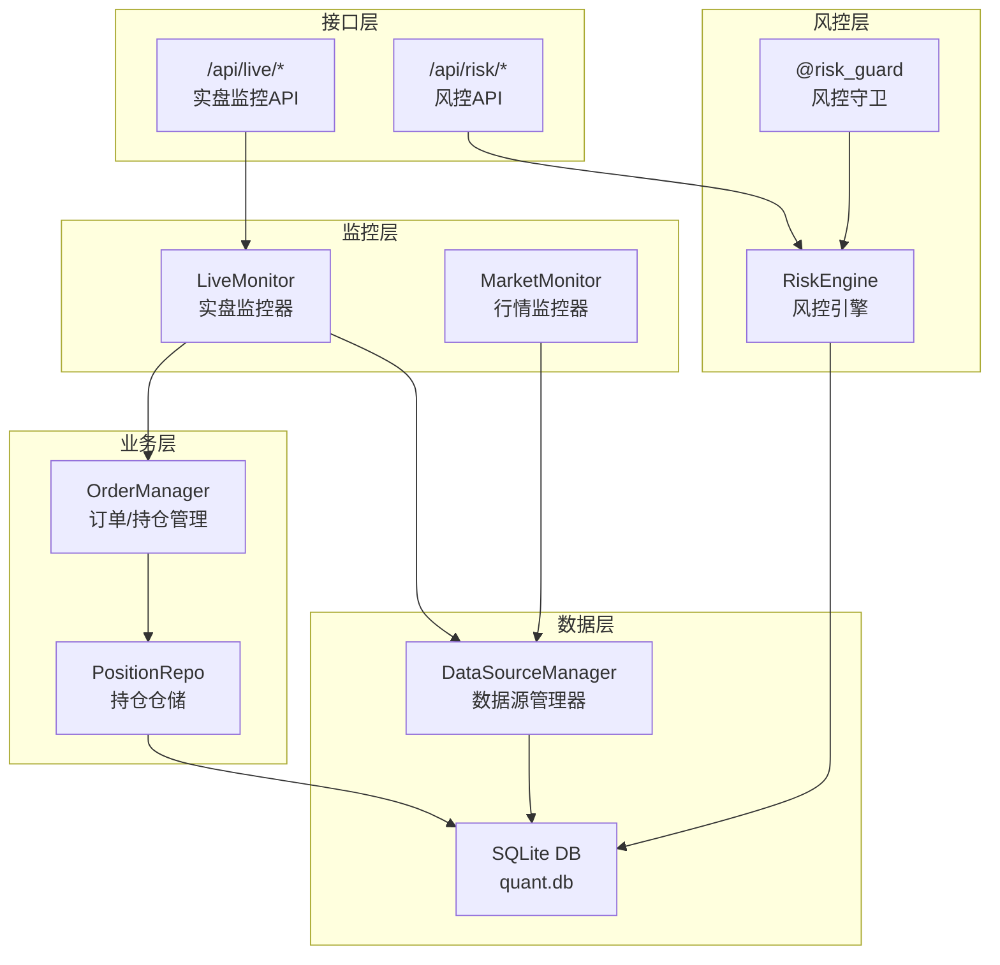
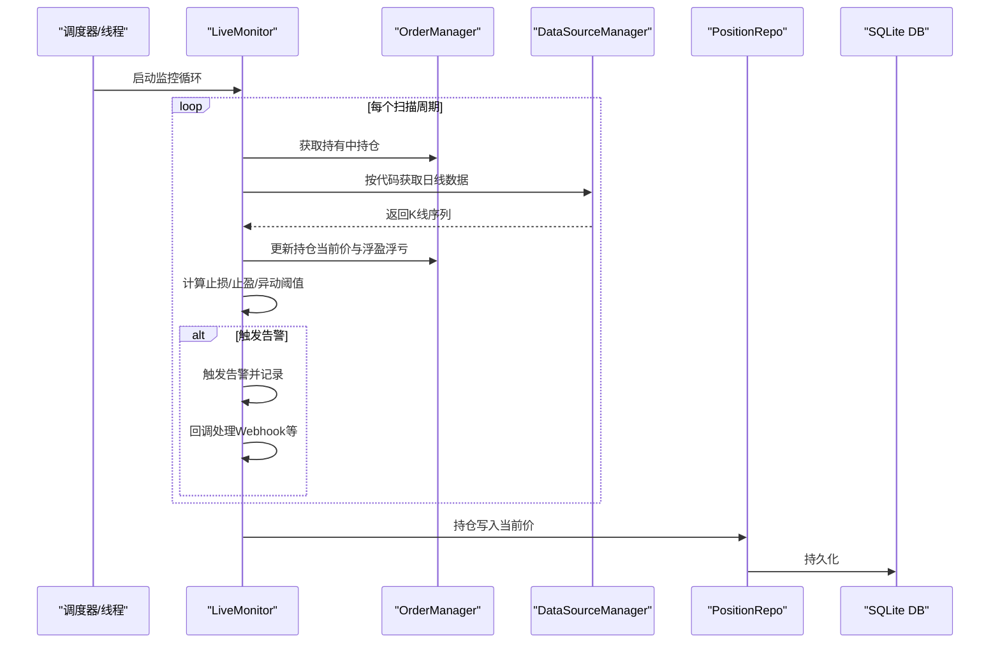
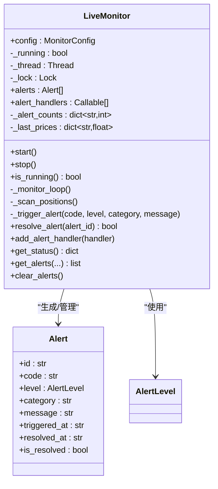
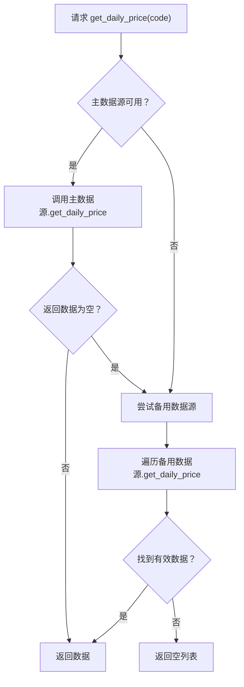
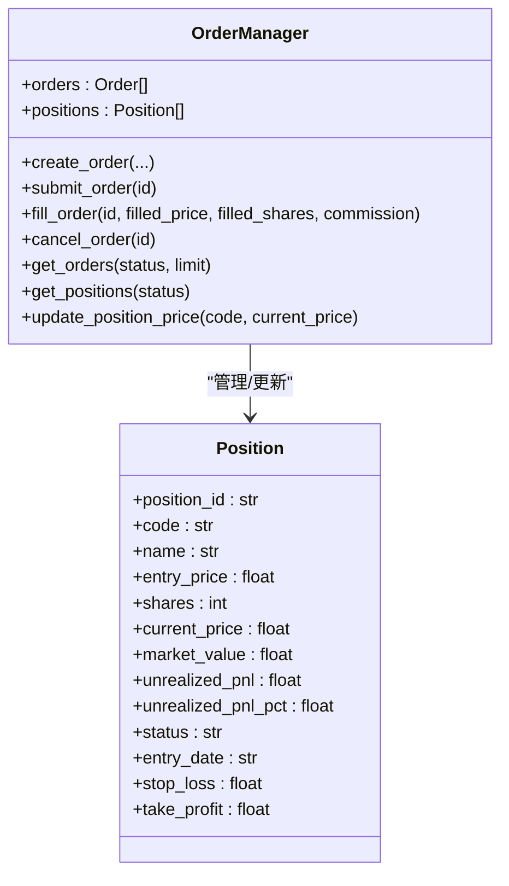
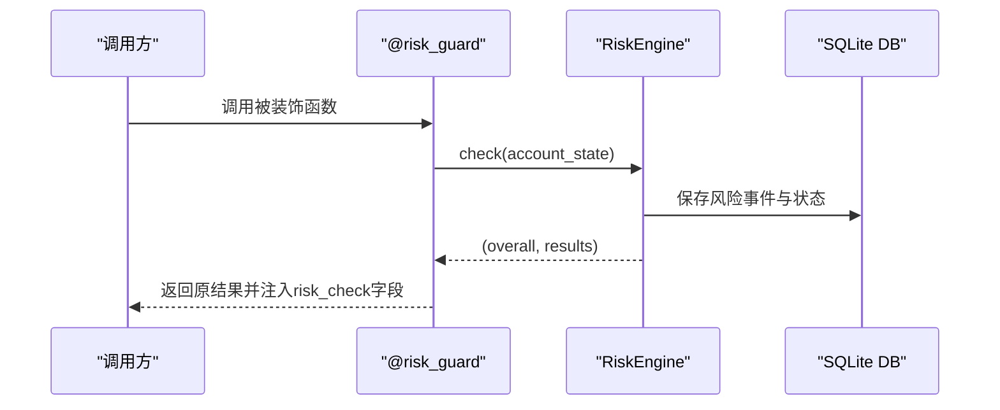
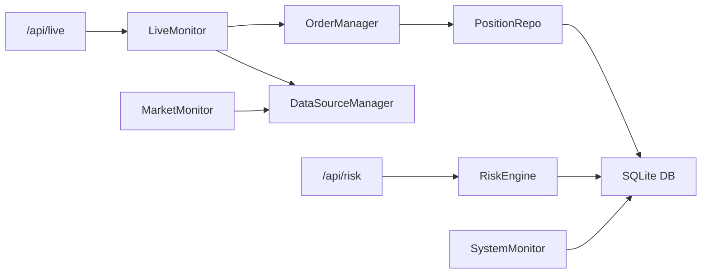

# 实盘持仓监控

<cite>
**本文引用的文件**
- [live/monitor.py](file://live/monitor.py)
- [routes/live.py](file://routes/live.py)
- [ministries/rites/data_source_manager.py](file://ministries/rites/data_source_manager.py)
- [ministries/war/order_manager.py](file://ministries/war/order_manager.py)
- [core/repository/position_repo.py](file://core/repository/position_repo.py)
- [ministries/rites/market_monitor.py](file://ministries/rites/market_monitor.py)
- [ministries/works/monitor.py](file://ministries/works/monitor.py)
- [risk/engine.py](file://risk/engine.py)
- [risk/guard.py](file://risk/guard.py)
- [risk/models.py](file://risk/models.py)
- [risk/rules.py](file://risk/rules.py)
- [routes/risk.py](file://routes/risk.py)
- [core/db.py](file://core/db.py)
- [config/risk_config.yaml](file://config/risk_config.yaml)
- [config/settings.py](file://config/settings.py)
</cite>

## 目录
1. [简介](#简介)
2. [项目结构](#项目结构)
3. [核心组件](#核心组件)
4. [架构总览](#架构总览)
5. [详细组件分析](#详细组件分析)
6. [依赖关系分析](#依赖关系分析)
7. [性能考量](#性能考量)
8. [故障排查指南](#故障排查指南)
9. [结论](#结论)
10. [附录](#附录)

## 简介
本文件面向AIQuant实盘持仓监控系统，围绕“实时持仓扫描、止损/止盈监控、价格异动检测、告警分级与推送、配置与性能优化、告警频率控制与状态管理、监控器生命周期与线程安全”等方面进行系统化说明。文档以代码为依据，结合架构图与流程图，帮助技术与非技术读者快速理解并正确使用该监控体系。

## 项目结构
实盘监控由“监控器 + 数据源 + 订单/持仓 + API路由 + 风控引擎”协同构成，采用模块化分层设计，职责清晰、边界明确。

图表来源
- [live/monitor.py:55-286](file://live/monitor.py#L55-L286)
- [routes/live.py:14-126](file://routes/live.py#L14-L126)
- [ministries/rites/data_source_manager.py:111-190](file://ministries/rites/data_source_manager.py#L111-L190)
- [ministries/war/order_manager.py:69-211](file://ministries/war/order_manager.py#L69-L211)
- [core/repository/position_repo.py:76-92](file://core/repository/position_repo.py#L76-L92)
- [ministries/rites/market_monitor.py:21-244](file://ministries/rites/market_monitor.py#L21-L244)
- [risk/engine.py:13-168](file://risk/engine.py#L13-L168)
- [risk/guard.py:36-92](file://risk/guard.py#L36-L92)

章节来源
- [live/monitor.py:1-286](file://live/monitor.py#L1-L286)
- [routes/live.py:1-126](file://routes/live.py#L1-L126)

## 核心组件
- 实盘监控器（LiveMonitor）
  - 职责：定时扫描持仓、检查止损/止盈/异动、触发告警、回调处理、状态查询、清理告警
  - 关键点：线程守护、锁保护、告警计数、价格缓存、Webhook推送
- 数据源管理器（DataSourceManager）
  - 职责：统一数据接口、主备切换、健康检查、日线数据获取
- 订单/持仓管理（OrderManager）
  - 职责：订单生命周期、持仓增减与均价更新、实时价格与浮盈浮亏计算
- 风控引擎（RiskEngine）
  - 职责：规则集检查、风险等级聚合、状态与事件入库、查询接口
- 风控守卫（@risk_guard）
  - 职责：装饰器式风控拦截与结果注入
- API路由（/api/live、/api/risk）
  - 职责：启动/停止监控、配置更新、告警查询/解决/清空；风控状态/事件/配置管理

章节来源
- [live/monitor.py:44-286](file://live/monitor.py#L44-L286)
- [ministries/rites/data_source_manager.py:111-190](file://ministries/rites/data_source_manager.py#L111-L190)
- [ministries/war/order_manager.py:69-211](file://ministries/war/order_manager.py#L69-L211)
- [risk/engine.py:13-168](file://risk/engine.py#L13-L168)
- [risk/guard.py:36-92](file://risk/guard.py#L36-L92)
- [routes/live.py:14-126](file://routes/live.py#L14-L126)
- [routes/risk.py:19-298](file://routes/risk.py#L19-L298)

## 架构总览
实盘监控以“LiveMonitor”为核心，周期性拉取持仓并联动数据源获取价格，计算浮盈浮亏与涨跌幅，触发不同级别的告警并通过回调（如Webhook）推送。风控引擎独立于监控器，提供规则化、可热加载的风控能力，并可通过装饰器在关键路径上进行拦截与注入。

图表来源
- [live/monitor.py:91-155](file://live/monitor.py#L91-L155)
- [ministries/war/order_manager.py:142-154](file://ministries/war/order_manager.py#L142-L154)
- [ministries/rites/data_source_manager.py:153-177](file://ministries/rites/data_source_manager.py#L153-L177)
- [core/repository/position_repo.py:76-82](file://core/repository/position_repo.py#L76-L82)

## 详细组件分析

### 实盘监控器（LiveMonitor）
- 生命周期管理
  - start/stop：守护线程启动/停止，避免重复启动
  - is_running：线程安全的状态查询
- 主循环与扫描
  - _monitor_loop：按配置间隔休眠并执行扫描
  - _scan_positions：获取持有中持仓，拉取日线，更新当前价，计算浮盈浮亏与涨跌幅，触发告警
- 告警机制
  - AlertLevel：告警等级（info/warning/critical）
  - _trigger_alert：频率限制（单股最大告警数）、线程安全追加、回调执行
  - resolve_alert：解决告警并更新计数
  - add_alert_handler：注册回调（如Webhook）
- 状态与查询
  - get_status/get_alerts/clear_alerts：线程安全查询与清理
- Webhook推送
  - webhook_alert_handler：HTTP POST推送告警内容

图表来源
- [live/monitor.py:44-286](file://live/monitor.py#L44-L286)

章节来源
- [live/monitor.py:55-286](file://live/monitor.py#L55-L286)

### 数据源管理器（DataSourceManager）
- 统一接口：get_daily_price(code, start, end)
- 主备切换：优先主数据源，失败则轮询备用
- 健康检查：各数据源check_health，返回可用性与质量等级
- 支持类型：本地数据库、AkShare、Tushare、Baostock、YFinance等

图表来源
- [ministries/rites/data_source_manager.py:153-177](file://ministries/rites/data_source_manager.py#L153-L177)

章节来源
- [ministries/rites/data_source_manager.py:111-190](file://ministries/rites/data_source_manager.py#L111-L190)

### 订单/持仓管理（OrderManager）
- 持仓结构：Position含入场价、当前价、市价、未实现盈亏与百分比
- 价格更新：update_position_price即时刷新，联动计算未实现盈亏与百分比
- 持仓列表：get_positions(status="holding")

图表来源
- [ministries/war/order_manager.py:69-211](file://ministries/war/order_manager.py#L69-L211)

章节来源
- [ministries/war/order_manager.py:69-211](file://ministries/war/order_manager.py#L69-L211)
- [core/repository/position_repo.py:76-92](file://core/repository/position_repo.py#L76-L92)

### 风控引擎（RiskEngine）与风控守卫（@risk_guard）
- 风控引擎
  - 规则集合：DEFAULT_RULES，逐条执行并聚合最严格等级
  - 结果持久化：risk_events、risk_status两张表
  - 查询接口：最新状态、最近事件
- 风控守卫
  - 装饰器：对被装饰函数自动注入风控检查与结果
  - 直接调用：check_risk(account_state)返回整体级别与详情

图表来源
- [risk/guard.py:36-92](file://risk/guard.py#L36-L92)
- [risk/engine.py:19-71](file://risk/engine.py#L19-L71)

章节来源
- [risk/engine.py:13-168](file://risk/engine.py#L13-L168)
- [risk/guard.py:36-92](file://risk/guard.py#L36-L92)
- [routes/risk.py:31-81](file://routes/risk.py#L31-L81)

### 实时行情监控（MarketMonitor）
- WebSocket客户端管理：注册/注销、订阅/退订
- 定时批量拉取：按订阅列表分批获取日线数据并推送
- 广播系统事件：连接/断开通知

章节来源
- [ministries/rites/market_monitor.py:21-244](file://ministries/rites/market_monitor.py#L21-L244)

### 系统监控（SystemMonitor）
- CPU/内存/磁盘使用率采集
- 告警阈值：CPU>80%、内存>85%、磁盘>90%
- 历史指标保留：最近24小时

章节来源
- [ministries/works/monitor.py:29-114](file://ministries/works/monitor.py#L29-L114)

## 依赖关系分析
- 组件耦合
  - LiveMonitor依赖OrderManager与DataSourceManager；通过全局单例获取，降低显式依赖
  - 风控引擎独立于监控器，仅通过数据库交互
- 外部依赖
  - requests（Webhook推送）
  - psutil（系统监控）
  - SQLite（本地存储）
- 循环依赖
  - 未发现循环导入；模块间通过接口与单例解耦

图表来源
- [live/monitor.py:20-21](file://live/monitor.py#L20-L21)
- [routes/live.py:16-19](file://routes/live.py#L16-L19)
- [routes/risk.py:21-24](file://routes/risk.py#L21-L24)
- [ministries/rites/market_monitor.py:34-35](file://ministries/rites/market_monitor.py#L34-L35)

章节来源
- [live/monitor.py:20-21](file://live/monitor.py#L20-L21)
- [routes/live.py:16-19](file://routes/live.py#L16-L19)
- [routes/risk.py:21-24](file://routes/risk.py#L21-L24)

## 性能考量
- 扫描间隔与批处理
  - 扫描间隔：默认30秒，可在配置中调整
  - 行情推送：批量拉取（每次最多10只），避免抖动与超载
- 线程与锁
  - 所有共享状态（告警列表、计数、最后价格）均使用threading.Lock保护
  - 守护线程，避免主线程阻塞
- 数据库与I/O
  - WAL模式与NORMAL同步，提升并发写入稳定性
  - 日线数据按需拉取，避免重复请求
- 建议
  - 将扫描间隔与异动阈值根据市场波动率动态调整
  - 对高频股票可考虑分片扫描或限流

章节来源
- [live/monitor.py:47-51](file://live/monitor.py#L47-L51)
- [ministries/rites/market_monitor.py:141-144](file://ministries/rites/market_monitor.py#L141-L144)
- [core/db.py:26-40](file://core/db.py#L26-L40)

## 故障排查指南
- 常见问题
  - 无法获取价格：检查数据源健康状态与主备切换逻辑
  - 告警未推送：确认Webhook URL已配置且网络可达
  - 告警风暴：提高max_alerts_per_stock或延长check_interval
  - 浮盈浮亏不更新：确认OrderManager.update_position_price被调用
- 排查步骤
  - 通过API查询监控状态与告警列表
  - 检查数据库中positions与risk_events/risk_status表
  - 使用系统监控接口观察资源占用
- 相关接口
  - /api/live/status、/api/live/alerts、/api/live/config
  - /api/risk/status、/api/risk/events、/api/risk/config

章节来源
- [routes/live.py:22-126](file://routes/live.py#L22-L126)
- [routes/risk.py:31-298](file://routes/risk.py#L31-L298)
- [ministries/works/monitor.py:86-114](file://ministries/works/monitor.py#L86-L114)

## 结论
实盘持仓监控系统以轻量、可扩展为目标，通过“监控器+数据源+风控引擎”的协作，实现了对止损、止盈与价格异动的自动化监控与告警。配合灵活的配置与回调机制，既满足日常监控需求，又便于扩展与集成。

## 附录

### 实时持仓扫描机制
- 流程要点
  - 获取持有中持仓
  - 拉取日线数据，取最新与前一日收盘价
  - 更新当前价并计算浮盈浮亏
  - 按阈值触发止损/止盈/异动告警
  - 通过回调推送（如Webhook）

章节来源
- [live/monitor.py:102-155](file://live/monitor.py#L102-L155)

### 止损监控实现
- 浮亏计算：基于当前价与入场价计算未实现盈亏百分比
- 阈值判断：低于默认-6%触发“critical”告警
- 自动止损触发：当前实现为告警触发，自动执行策略需在回调中扩展

章节来源
- [live/monitor.py:121-129](file://live/monitor.py#L121-L129)
- [ministries/war/order_manager.py:146-154](file://ministries/war/order_manager.py#L146-L154)

### 止盈监控实现
- 浮盈计算：同上
- 阈值判断：高于默认+15%触发“warning”告警
- 盈利了结策略：当前实现为告警提示，具体平仓策略需在回调中实现

章节来源
- [live/monitor.py:131-138](file://live/monitor.py#L131-L138)
- [ministries/war/order_manager.py:146-154](file://ministries/war/order_manager.py#L146-L154)

### 价格异动检测算法
- 涨跌幅计算：(当日收盘-前一日收盘)/前一日收盘*100
- 异动阈值：默认±7%
- 异常提醒：触发“info”级告警

章节来源
- [live/monitor.py:140-148](file://live/monitor.py#L140-L148)

### 告警等级分类与处理流程
- 等级：info（异动）、warning（止盈）、critical（止损）
- 处理：频率限制、线程安全、回调执行、状态查询与解决
- 推送：Webhook（HTTP POST）

章节来源
- [live/monitor.py:24-42](file://live/monitor.py#L24-L42)
- [live/monitor.py:158-196](file://live/monitor.py#L158-L196)
- [live/monitor.py:256-273](file://live/monitor.py#L256-L273)

### 监控配置参数与扫描间隔
- 配置项
  - stop_loss_pct：默认-6%
  - take_profit_pct：默认+15%
  - price_spike_pct：默认±7%
  - check_interval：默认30秒
  - max_alerts_per_stock：默认5
  - webhook_url：Webhook地址
- 更新方式：/api/live/config（支持热更新）

章节来源
- [live/monitor.py:44-53](file://live/monitor.py#L44-L53)
- [routes/live.py:94-125](file://routes/live.py#L94-L125)

### 告警频率控制与状态管理
- 单股告警频率：按代码计数，超过阈值则抑制
- 告警状态：未解决（active）与已解决（resolved）
- 查询与清理：支持按代码/级别/时间过滤与清空

章节来源
- [live/monitor.py:160-162](file://live/monitor.py#L160-L162)
- [live/monitor.py:187-196](file://live/monitor.py#L187-L196)
- [live/monitor.py:218-245](file://live/monitor.py#L218-L245)

### 监控器生命周期管理、线程安全与异常处理
- 生命周期：start/stop/running，守护线程，避免重复启动
- 线程安全：锁保护共享状态（告警列表、计数、最后价格）
- 异常处理：监控循环与回调内捕获异常并打印日志

章节来源
- [live/monitor.py:70-87](file://live/monitor.py#L70-L87)
- [live/monitor.py:91-98](file://live/monitor.py#L91-L98)
- [live/monitor.py:181-185](file://live/monitor.py#L181-L185)

### 风控模块与实盘监控的关系
- 风控规则：最大回撤、单股集中度、波动率、择时、行业/总仓位、节假日提醒、黑名单等
- 执行方式：RiskEngine规则集执行，@risk_guard装饰器注入
- 存储：risk_events、risk_status表

章节来源
- [risk/engine.py:19-71](file://risk/engine.py#L19-L71)
- [risk/guard.py:36-92](file://risk/guard.py#L36-L92)
- [config/risk_config.yaml:1-170](file://config/risk_config.yaml#L1-L170)

### 数据库与表结构要点
- positions：持仓记录，含入场价、当前价、止盈止损、状态
- risk_events、risk_status：风控事件与状态
- daily_price：日线行情（OHLCV等）

章节来源
- [core/db.py:168-186](file://core/db.py#L168-L186)
- [core/db.py:108-110](file://core/db.py#L108-L110)
- [core/db.py:61-94](file://core/db.py#L61-L94)

### API参考
- 实盘监控API
  - GET /api/live/status：监控状态
  - POST /api/live/start：启动监控
  - POST /api/live/stop：停止监控
  - GET /api/live/alerts：告警列表
  - POST /api/live/alerts/<id>/resolve：解决告警
  - POST /api/live/alerts/clear：清空告警
  - POST /api/live/config：更新配置
- 风控API
  - GET /api/risk/status：风控状态
  - GET /api/risk/events：最近事件
  - POST /api/risk/check：手动风控检查
  - GET /api/risk/config：风控配置
  - POST /api/risk/config/reload：热加载配置

章节来源
- [routes/live.py:22-126](file://routes/live.py#L22-L126)
- [routes/risk.py:31-298](file://routes/risk.py#L31-L298)