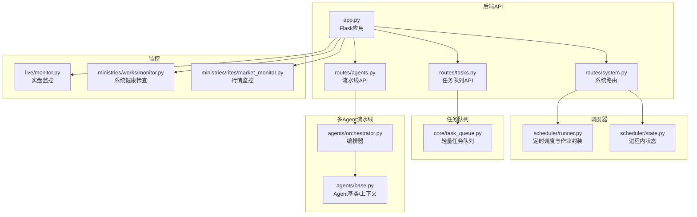
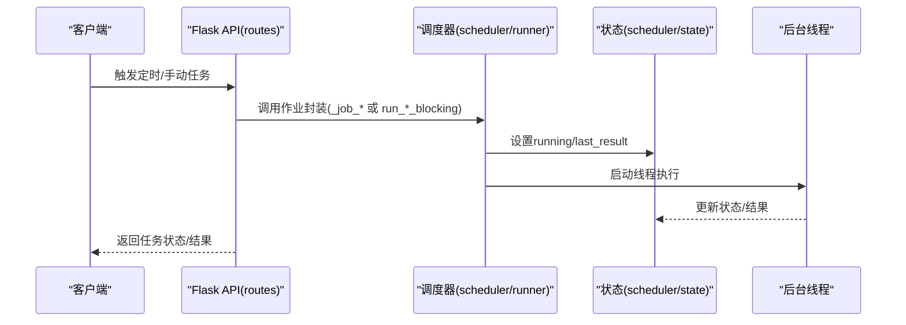
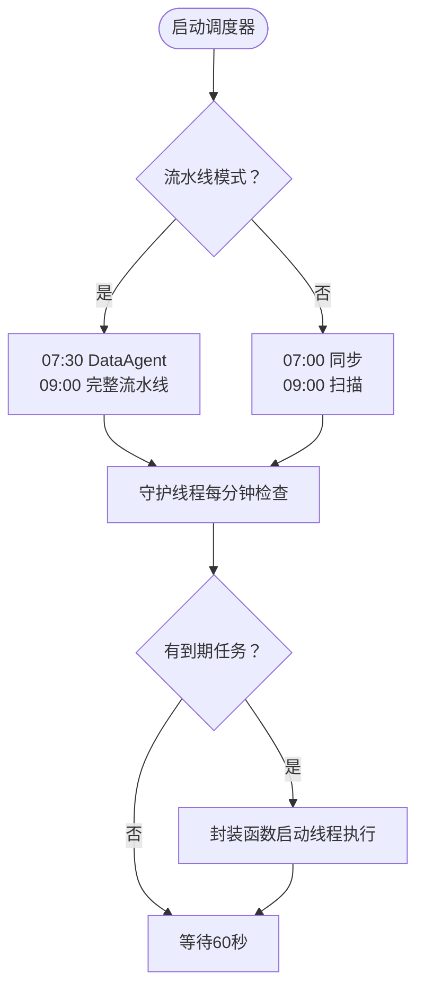
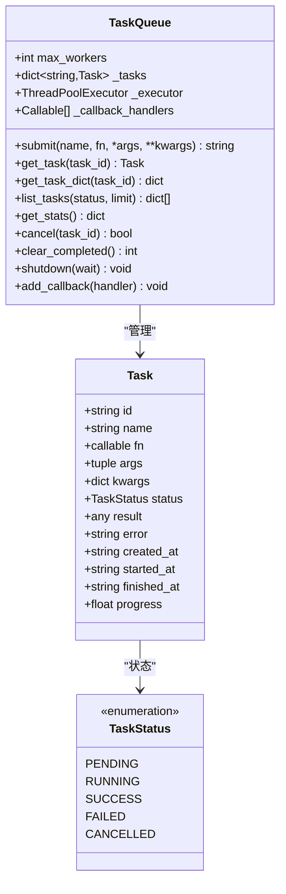
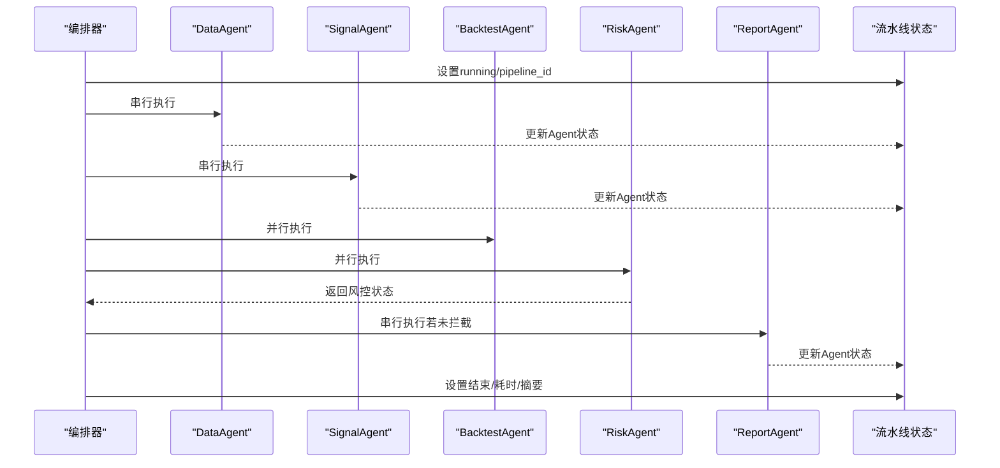
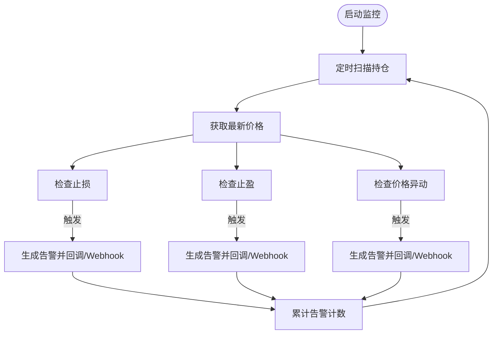
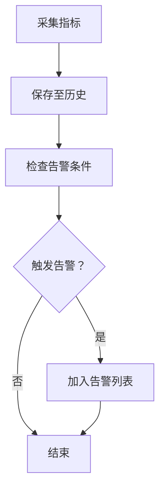
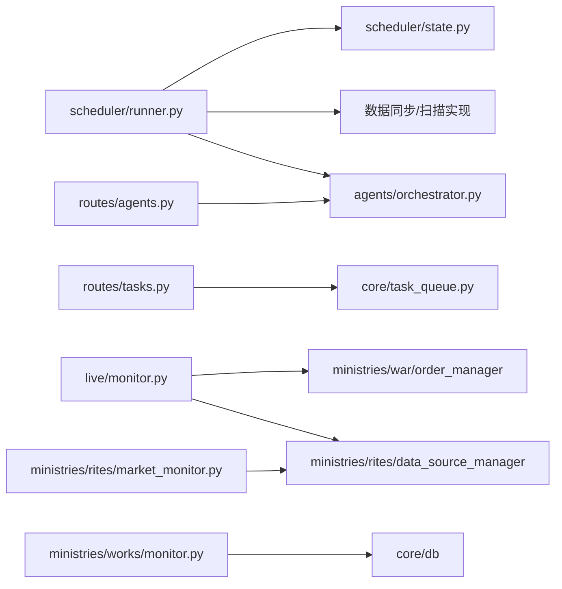

# 系统调度监控

<cite>
**本文引用的文件**
- [scheduler/__init__.py](file://scheduler/__init__.py)
- [scheduler/runner.py](file://scheduler/runner.py)
- [scheduler/state.py](file://scheduler/state.py)
- [core/task_queue.py](file://core/task_queue.py)
- [routes/tasks.py](file://routes/tasks.py)
- [routes/system.py](file://routes/system.py)
- [routes/agents.py](file://routes/agents.py)
- [agents/orchestrator.py](file://agents/orchestrator.py)
- [agents/base.py](file://agents/base.py)
- [live/monitor.py](file://live/monitor.py)
- [ministries/works/monitor.py](file://ministries/works/monitor.py)
- [ministries/rites/market_monitor.py](file://ministries/rites/market_monitor.py)
- [app.py](file://app.py)
- [config/settings.py](file://config/settings.py)
</cite>

## 目录
1. [简介](#简介)
2. [项目结构](#项目结构)
3. [核心组件](#核心组件)
4. [架构总览](#架构总览)
5. [详细组件分析](#详细组件分析)
6. [依赖分析](#依赖分析)
7. [性能考量](#性能考量)
8. [故障排查指南](#故障排查指南)
9. [结论](#结论)
10. [附录](#附录)

## 简介
本文件面向AIQuant系统的“系统调度监控”主题，围绕调度器架构设计、任务队列管理、执行状态跟踪、调度策略实现、任务执行监控、调度器状态管理、定时任务配置、健康检查、扩展性与容错、日志与调试、以及与监控系统的集成进行系统化说明。内容以仓库现有代码为依据，结合可视化图表帮助读者快速理解。

## 项目结构
AIQuant采用“后端API + 调度器 + 多Agent流水线 + 监控模块”的分层组织方式：
- 后端API：提供REST接口与WebSocket，承载系统状态查询、任务提交、流水线控制、健康检查等能力
- 调度器：负责定时任务与后台线程的调度与状态管理
- 任务队列：轻量级内存任务队列，支持异步提交、状态跟踪、统计与回调
- 多Agent流水线：三省六部制编排器，串行/并行组合，带状态持久化与历史记录
- 监控模块：系统健康检查、实盘监控、行情监控，提供指标采集与告警

**图表来源**
- [app.py:1-164](file://app.py#L1-L164)
- [routes/system.py:1-152](file://routes/system.py#L1-L152)
- [routes/tasks.py:1-178](file://routes/tasks.py#L1-L178)
- [routes/agents.py:1-128](file://routes/agents.py#L1-L128)
- [scheduler/runner.py:1-212](file://scheduler/runner.py#L1-L212)
- [scheduler/state.py:1-45](file://scheduler/state.py#L1-L45)
- [core/task_queue.py:1-222](file://core/task_queue.py#L1-L222)
- [agents/orchestrator.py:1-263](file://agents/orchestrator.py#L1-L263)
- [agents/base.py:1-120](file://agents/base.py#L1-L120)
- [live/monitor.py:1-286](file://live/monitor.py#L1-L286)
- [ministries/works/monitor.py:1-114](file://ministries/works/monitor.py#L1-L114)
- [ministries/rites/market_monitor.py:1-244](file://ministries/rites/market_monitor.py#L1-L244)

**章节来源**
- [app.py:1-164](file://app.py#L1-L164)
- [scheduler/__init__.py:1-4](file://scheduler/__init__.py#L1-L4)

## 核心组件
- 调度器与状态管理：提供定时任务调度、作业封装、状态标志位与线程句柄管理
- 任务队列：支持异步任务提交、状态跟踪、统计查询、回调通知与清理
- 多Agent流水线：三省六部制编排，串行/并行组合，状态持久化与历史记录
- 实盘监控：止损/止盈/异动告警，回调与Webhook推送
- 系统健康检查：CPU/内存/磁盘/数据库大小等指标采集与告警
- 行情监控：WebSocket客户端连接、订阅管理、定时推送

**章节来源**
- [scheduler/runner.py:158-212](file://scheduler/runner.py#L158-L212)
- [scheduler/state.py:5-45](file://scheduler/state.py#L5-L45)
- [core/task_queue.py:51-222](file://core/task_queue.py#L51-L222)
- [agents/orchestrator.py:36-263](file://agents/orchestrator.py#L36-L263)
- [live/monitor.py:55-286](file://live/monitor.py#L55-L286)
- [ministries/works/monitor.py:29-114](file://ministries/works/monitor.py#L29-L114)
- [ministries/rites/market_monitor.py:21-244](file://ministries/rites/market_monitor.py#L21-L244)

## 架构总览
调度器与监控体系围绕“定时任务 + 异步任务 + 实时监控 + 健康检查”展开，通过API统一入口对外提供能力，内部通过状态共享与回调机制实现可观测与可控制。

**图表来源**
- [routes/system.py:12-83](file://routes/system.py#L12-L83)
- [scheduler/runner.py:186-212](file://scheduler/runner.py#L186-L212)
- [scheduler/state.py:5-21](file://scheduler/state.py#L5-L21)

## 详细组件分析

### 调度器架构与调度策略
- 两种模式：
  - 传统模式：每日固定时间触发数据同步与策略扫描
  - 多Agent流水线模式：早间预同步+完整流水线，通过环境变量切换
- 调度循环：守护线程持续运行，每分钟检查一次待执行任务
- 作业封装：每个定时任务对应一个封装函数，负责状态标记与线程启动
- 状态管理：进程内共享状态字典，包含运行标志、最后时间、最后结果等

**图表来源**
- [scheduler/runner.py:158-182](file://scheduler/runner.py#L158-L182)
- [scheduler/runner.py:167-176](file://scheduler/runner.py#L167-L176)
- [scheduler/runner.py:186-212](file://scheduler/runner.py#L186-L212)

**章节来源**
- [scheduler/runner.py:158-212](file://scheduler/runner.py#L158-L212)
- [scheduler/state.py:5-21](file://scheduler/state.py#L5-L21)
- [config/settings.py:15-17](file://config/settings.py#L15-L17)

### 任务队列管理与执行监控
- 任务模型：包含唯一ID、名称、函数、参数、状态、结果、错误、时间戳、进度等
- 状态枚举：PENDING/RUNNING/SUCCESS/FAILED/CANCELLED
- 执行器：线程池执行器，支持并发度配置
- 回调机制：任务完成后通知回调处理器
- 统计与查询：支持按状态筛选、排序、导出字典视图
- 清理策略：清理已完成/失败/取消任务，释放内存

**图表来源**
- [core/task_queue.py:25-100](file://core/task_queue.py#L25-L100)
- [core/task_queue.py:51-166](file://core/task_queue.py#L51-L166)

**章节来源**
- [core/task_queue.py:51-222](file://core/task_queue.py#L51-L222)
- [routes/tasks.py:93-178](file://routes/tasks.py#L93-L178)

### 多Agent流水线与状态跟踪
- 编排器：三省六部制执行图，串行/并行组合，支持风控拦截
- 上下文：跨Agent共享数据区，结果持久化，历史记录
- 状态更新：流水线启动/结束、Agent开始/完成均更新状态
- 历史保留：最近N条执行摘要，便于审计与回溯

**图表来源**
- [agents/orchestrator.py:81-175](file://agents/orchestrator.py#L81-L175)
- [agents/orchestrator.py:181-238](file://agents/orchestrator.py#L181-L238)
- [agents/base.py:39-86](file://agents/base.py#L39-L86)
- [scheduler/state.py:24-45](file://scheduler/state.py#L24-L45)

**章节来源**
- [agents/orchestrator.py:36-263](file://agents/orchestrator.py#L36-L263)
- [agents/base.py:20-120](file://agents/base.py#L20-L120)
- [routes/agents.py:22-78](file://routes/agents.py#L22-L78)

### 实盘监控与告警
- 监控维度：止损、止盈、价格异动
- 配置项：阈值、检查间隔、最大告警数量、Webhook地址
- 告警处理：回调链与Webhook推送，支持解决告警
- 状态查询：活跃告警数、阈值、间隔等

**图表来源**
- [live/monitor.py:91-155](file://live/monitor.py#L91-L155)
- [live/monitor.py:158-201](file://live/monitor.py#L158-L201)
- [live/monitor.py:256-273](file://live/monitor.py#L256-L273)

**章节来源**
- [live/monitor.py:55-286](file://live/monitor.py#L55-L286)

### 系统健康检查与指标
- 指标采集：CPU、内存、磁盘、数据库大小、错误计数等
- 告警规则：CPU>80%、内存>85%、磁盘>90%
- 历史保留：最近24小时每分钟一条
- 状态摘要：健康/警告状态与关键指标

**图表来源**
- [ministries/works/monitor.py:36-84](file://ministries/works/monitor.py#L36-L84)
- [ministries/works/monitor.py:86-101](file://ministries/works/monitor.py#L86-L101)

**章节来源**
- [ministries/works/monitor.py:29-114](file://ministries/works/monitor.py#L29-L114)

### 定时任务配置与优先级
- 配置来源：环境变量决定流水线模式；配置文件定义API主机/端口与默认调度时间
- 调度时间：传统模式固定时间；流水线模式分阶段执行
- 优先级与资源：通过线程池并发度与任务队列并发度控制资源占用

**章节来源**
- [scheduler/runner.py:22](file://scheduler/runner.py#L22)
- [config/settings.py:15-17](file://config/settings.py#L15-L17)
- [core/task_queue.py:54-56](file://core/task_queue.py#L54-L56)

### 调度器状态管理与健康检查
- 运行状态：启用/禁用标志、线程句柄、状态字典
- 健康检查：/api/health接口返回服务可用状态
- 故障恢复：异常捕获与状态回写，避免重复执行

**章节来源**
- [scheduler/state.py:9-11](file://scheduler/state.py#L9-L11)
- [routes/system.py:131-133](file://routes/system.py#L131-L133)
- [scheduler/runner.py:29-87](file://scheduler/runner.py#L29-L87)

### 与监控系统的集成
- 实时行情：行情监控器维护订阅列表并通过WebSocket推送
- 实盘告警：实盘监控器与系统健康检查共同构成运行态监控
- API集成：监控状态可通过API查询，便于前端展示与告警联动

**章节来源**
- [ministries/rites/market_monitor.py:108-132](file://ministries/rites/market_monitor.py#L108-L132)
- [ministries/rites/market_monitor.py:214-231](file://ministries/rites/market_monitor.py#L214-L231)
- [live/monitor.py:204-245](file://live/monitor.py#L204-L245)
- [ministries/works/monitor.py:86-101](file://ministries/works/monitor.py#L86-L101)

## 依赖分析
- 调度器依赖状态模块与具体业务函数（数据同步、策略扫描、流水线）
- 任务队列独立于调度器，通过API暴露能力
- 多Agent流水线依赖Agent基类与上下文，编排器负责执行顺序与并行
- 监控模块相互独立，通过API统一接入

**图表来源**
- [scheduler/runner.py:17-20](file://scheduler/runner.py#L17-L20)
- [routes/tasks.py:15](file://routes/tasks.py#L15)
- [routes/agents.py:14-16](file://routes/agents.py#L14-L16)
- [live/monitor.py:20-21](file://live/monitor.py#L20-L21)
- [ministries/works/monitor.py:48-54](file://ministries/works/monitor.py#L48-L54)
- [ministries/rites/market_monitor.py:34](file://ministries/rites/market_monitor.py#L34)

**章节来源**
- [scheduler/runner.py:17-20](file://scheduler/runner.py#L17-L20)
- [routes/tasks.py:15](file://routes/tasks.py#L15)
- [routes/agents.py:14-16](file://routes/agents.py#L14-L16)
- [live/monitor.py:20-21](file://live/monitor.py#L20-L21)
- [ministries/works/monitor.py:48-54](file://ministries/works/monitor.py#L48-L54)
- [ministries/rites/market_monitor.py:34](file://ministries/rites/market_monitor.py#L34)

## 性能考量
- 线程池与并发度：任务队列与流水线均使用线程池，应根据CPU核数与I/O特性调整并发度
- 内存占用：任务队列在长时间运行后建议定期清理已完成任务，避免内存膨胀
- I/O密集：数据同步与行情拉取存在网络/数据源延迟，建议批量化与限流
- 监控开销：健康检查与行情推送间隔需平衡实时性与系统负载

## 故障排查指南
- 调度器无法启动：检查启用/禁用标志与守护线程状态
- 重复执行：确认状态字典中的running标志，避免并发重复触发
- 任务卡住：检查任务队列统计与回调是否正常触发
- 实盘告警无效：确认阈值配置、回调链与Webhook地址
- 健康检查异常：确认psutil可用与路径正确

**章节来源**
- [scheduler/state.py:5-21](file://scheduler/state.py#L5-L21)
- [scheduler/runner.py:186-212](file://scheduler/runner.py#L186-L212)
- [core/task_queue.py:169-180](file://core/task_queue.py#L169-L180)
- [live/monitor.py:158-186](file://live/monitor.py#L158-L186)
- [ministries/works/monitor.py:36-60](file://ministries/works/monitor.py#L36-L60)

## 结论
AIQuant的调度监控体系以“定时调度 + 异步任务 + 多Agent流水线 + 实时监控 + 健康检查”为核心，通过API统一入口提供可观测与可控的能力。调度器采用轻量状态管理与线程封装，任务队列提供基础的异步执行与统计能力，流水线编排器实现复杂的串并行组合与状态持久化，监控模块覆盖实盘与系统层面的关键指标。整体设计简洁清晰，具备良好的扩展性与容错能力。

## 附录
- API参考
  - 系统状态与调度：/api/system/status、/api/system/scheduler
  - 数据同步与扫描：/api/system/sync、/api/system/scan
  - 任务队列：/api/tasks/submit、/api/tasks、/api/tasks/<id>、/api/tasks/<id>/cancel、/api/tasks/clear、/api/tasks/stats、/api/tasks/types
  - 流水线：/api/agents/status、/api/agents/run、/api/agents/run/<name>、/api/agents/history、/api/agents/report、/api/agents/governance
  - 健康检查：/api/health

**章节来源**
- [routes/system.py:12-83](file://routes/system.py#L12-L83)
- [routes/tasks.py:93-178](file://routes/tasks.py#L93-L178)
- [routes/agents.py:22-98](file://routes/agents.py#L22-L98)
- [app.py:131-133](file://app.py#L131-L133)