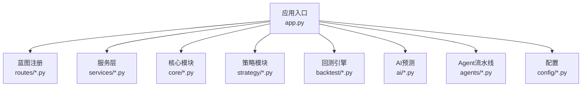
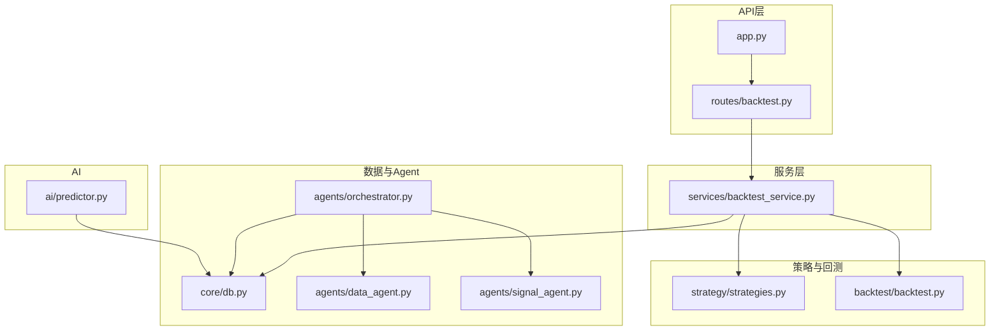
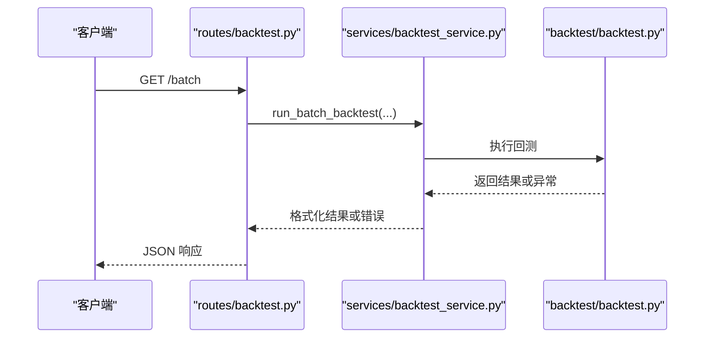
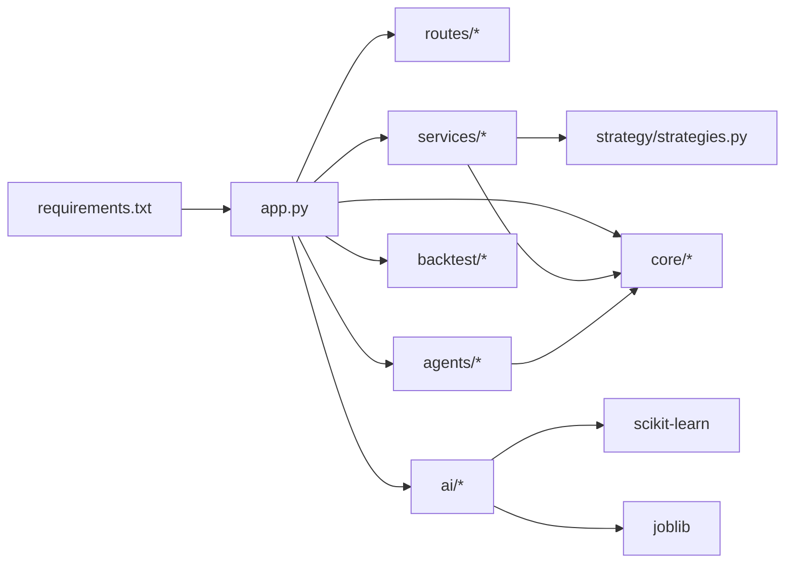

# 代码规范

<cite>
**本文引用的文件**
- [README.md](file://README.md)
- [requirements.txt](file://requirements.txt)
- [app.py](file://app.py)
- [quant.py](file://quant.py)
- [agents/base.py](file://agents/base.py)
- [agents/orchestrator.py](file://agents/orchestrator.py)
- [agents/data_agent.py](file://agents/data_agent.py)
- [agents/signal_agent.py](file://agents/signal_agent.py)
- [core/db.py](file://core/db.py)
- [strategy/strategies.py](file://strategy/strategies.py)
- [backtest/backtest.py](file://backtest/backtest.py)
- [routes/backtest.py](file://routes/backtest.py)
- [services/backtest_service.py](file://services/backtest_service.py)
- [ai/predictor.py](file://ai/predictor.py)
- [config/settings.py](file://config/settings.py)
- [tests/test_backtest_engine.py](file://tests/test_backtest_engine.py)
</cite>

## 目录
1. [简介](#简介)
2. [项目结构](#项目结构)
3. [核心组件](#核心组件)
4. [架构总览](#架构总览)
5. [详细组件分析](#详细组件分析)
6. [依赖分析](#依赖分析)
7. [性能考虑](#性能考虑)
8. [故障排查指南](#故障排查指南)
9. [结论](#结论)
10. [附录](#附录)

## 简介
本文件为 AIQuant 项目的代码规范文档，旨在统一团队开发风格、提升代码可读性与可维护性，并建立一致的注释、导入、错误处理与质量检查标准。内容覆盖 Python 代码风格、命名约定、模块导入顺序、注释与文档字符串、变量与函数设计原则、错误处理与异常抛出模式、代码审查清单以及 Git 提交与分支命名建议。

## 项目结构
AIQuant 采用“功能域+层次”混合组织方式：
- 层次：app.py 作为入口，routes 定义 API，services 提供业务服务，backtest 提供回测引擎，core 提供基础设施（数据库、同步等），ai 提供 AI 预测能力，agents 提供多 Agent 流水线编排。
- 功能域：modules/ministries/governance 等体现治理与职能划分。

图表来源
- [app.py:1-164](file://app.py#L1-L164)
- [routes/backtest.py:1-45](file://routes/backtest.py#L1-L45)
- [services/backtest_service.py:1-135](file://services/backtest_service.py#L1-L135)
- [core/db.py:1-800](file://core/db.py#L1-L800)
- [strategy/strategies.py:1-431](file://strategy/strategies.py#L1-L431)
- [backtest/backtest.py:1-517](file://backtest/backtest.py#L1-L517)
- [ai/predictor.py:1-241](file://ai/predictor.py#L1-L241)
- [agents/orchestrator.py:1-263](file://agents/orchestrator.py#L1-L263)
- [config/settings.py:1-25](file://config/settings.py#L1-L25)

章节来源
- [README.md:1-3](file://README.md#L1-L3)
- [requirements.txt:1-9](file://requirements.txt#L1-L9)
- [app.py:1-164](file://app.py#L1-L164)

## 核心组件
- 应用入口与路由：app.py 注册蓝图与 WebSocket，提供健康检查与静态资源服务。
- 策略与扫描：quant.py 提供扫描与同步任务；strategy/strategies.py 提供多策略与融合。
- 回测引擎：backtest/backtest.py 提供回测类与指标计算。
- 服务与路由：services/backtest_service.py 与 routes/backtest.py 提供批量回测 API。
- 数据与持久化：core/db.py 提供 SQLite 管理、建表与查询。
- Agent 流水线：agents/orchestrator.py 编排数据、信号、风控、回测、报表 Agent。
- AI 预测：ai/predictor.py 提供模型训练与预测。
- 配置：config/settings.py 提供基础配置。

章节来源
- [quant.py:1-631](file://quant.py#L1-L631)
- [strategy/strategies.py:1-431](file://strategy/strategies.py#L1-L431)
- [backtest/backtest.py:1-517](file://backtest/backtest.py#L1-L517)
- [services/backtest_service.py:1-135](file://services/backtest_service.py#L1-L135)
- [routes/backtest.py:1-45](file://routes/backtest.py#L1-L45)
- [core/db.py:1-800](file://core/db.py#L1-L800)
- [agents/orchestrator.py:1-263](file://agents/orchestrator.py#L1-L263)
- [ai/predictor.py:1-241](file://ai/predictor.py#L1-L241)
- [config/settings.py:1-25](file://config/settings.py#L1-L25)

## 架构总览
AIQuant 采用“后端 API + 多 Agent 流水线 + 回测引擎 + AI 预测”的分层架构。API 路由调用服务层，服务层协调策略、数据与回测；Agent 流水线串联数据、信号、风控、回测与报表；AI 预测模块提供模型训练与预测能力。

图表来源
- [app.py:1-164](file://app.py#L1-L164)
- [routes/backtest.py:1-45](file://routes/backtest.py#L1-L45)
- [services/backtest_service.py:1-135](file://services/backtest_service.py#L1-L135)
- [strategy/strategies.py:1-431](file://strategy/strategies.py#L1-L431)
- [backtest/backtest.py:1-517](file://backtest/backtest.py#L1-L517)
- [core/db.py:1-800](file://core/db.py#L1-L800)
- [agents/orchestrator.py:1-263](file://agents/orchestrator.py#L1-L263)
- [agents/data_agent.py:1-167](file://agents/data_agent.py#L1-L167)
- [agents/signal_agent.py:1-213](file://agents/signal_agent.py#L1-L213)
- [ai/predictor.py:1-241](file://ai/predictor.py#L1-L241)

## 详细组件分析

### Python 代码风格与 PEP8 遵循
- 缩进与空行
  - 使用 4 空格缩进，函数/类之间保留两个空行，方法之间保留一个空行。
  - 逻辑块之间适当使用空行分隔，增强可读性。
- 行宽与换行
  - 单行不超过 100 字符；长表达式分行书写，对齐操作符。
- 空格与逗号
  - 逗号后保留一个空格；括号内外不加空格。
- 导入顺序
  - 标准库 → 第三方库 → 项目内部模块；同一组内按字母排序。
- 命名约定
  - 类名：大驼峰（如 BacktestResult、AIPredictor）
  - 函数/方法/变量：小写下划线（如 run_pipeline、get_daily_price）
  - 常量：全大写+下划线（如 START_CAPITAL、V4_SCORE_THRESHOLD）
  - 模块与包：小写、简短、语义明确（如 routes、services、backtest）

章节来源
- [quant.py:1-631](file://quant.py#L1-L631)
- [strategy/strategies.py:1-431](file://strategy/strategies.py#L1-L431)
- [backtest/backtest.py:1-517](file://backtest/backtest.py#L1-L517)
- [ai/predictor.py:1-241](file://ai/predictor.py#L1-L241)
- [agents/base.py:1-120](file://agents/base.py#L1-L120)
- [agents/orchestrator.py:1-263](file://agents/orchestrator.py#L1-L263)

### 模块导入顺序与组织
- 标准库：import os、import sqlite3、import json 等
- 第三方库：import pandas、numpy、sklearn、joblib、schedule 等
- 项目内部模块：from core.db import …、from strategy.strategies import …、from agents.base import …
- 导入分组：标准库、第三方、内部模块，组内按字母排序；组间以空行分隔。
- 避免相对导入，使用绝对导入路径。

章节来源
- [app.py:1-164](file://app.py#L1-L164)
- [quant.py:1-631](file://quant.py#L1-L631)
- [core/db.py:1-800](file://core/db.py#L1-L800)
- [strategy/strategies.py:1-431](file://strategy/strategies.py#L1-L431)
- [agents/orchestrator.py:1-263](file://agents/orchestrator.py#L1-L263)
- [ai/predictor.py:1-241](file://ai/predictor.py#L1-L241)

### 注释与文档字符串规范
- 模块级文档字符串：位于文件顶部，描述模块职责与用途（如“AI预测引擎”、“回测引擎”）。
- 类与函数文档字符串：使用三引号，说明用途、参数、返回值与异常。
- 行内注释：简洁明了，解释复杂逻辑或边界条件。
- TODO/NOTE 注释：使用 TODO/NOTE 标记待办事项与注意事项，便于追踪。

章节来源
- [ai/predictor.py:1-241](file://ai/predictor.py#L1-L241)
- [backtest/backtest.py:1-517](file://backtest/backtest.py#L1-L517)
- [strategy/strategies.py:1-431](file://strategy/strategies.py#L1-L431)
- [agents/base.py:1-120](file://agents/base.py#L1-L120)
- [agents/orchestrator.py:1-263](file://agents/orchestrator.py#L1-L263)

### 变量与函数设计原则
- 单一职责：每个函数/类聚焦单一职责，避免“上帝函数”。
- 函数长度：尽量控制在 50 行以内；超过时拆分为子函数。
- 参数数量：控制在 5 个以内；过多时使用数据类或关键字参数。
- 命名清晰：函数名使用动词短语，变量名使用名词短语，布尔变量使用 is_/has_/can_ 前缀。
- 返回值一致性：明确返回类型与结构，必要时使用数据类封装。

章节来源
- [quant.py:1-631](file://quant.py#L1-L631)
- [strategy/strategies.py:1-431](file://strategy/strategies.py#L1-L431)
- [backtest/backtest.py:1-517](file://backtest/backtest.py#L1-L517)
- [agents/base.py:1-120](file://agents/base.py#L1-L120)

### 错误处理与异常抛出模式
- 统一异常捕获：在 Agent 基类中自动捕获异常并记录堆栈，避免异常穿透。
- 路由层错误处理：API 路由捕获异常并返回 JSON 错误响应。
- 数据访问层：数据库连接使用上下文管理器，异常时回滚并抛出。
- 回测引擎：对 NaN、空数据与边界条件进行显式判断，避免隐式转换错误。
- 断言与防御式编程：对输入参数进行校验，必要时抛出 ValueError。

图表来源
- [routes/backtest.py:1-45](file://routes/backtest.py#L1-L45)
- [services/backtest_service.py:1-135](file://services/backtest_service.py#L1-L135)
- [backtest/backtest.py:1-517](file://backtest/backtest.py#L1-L517)

章节来源
- [agents/base.py:1-120](file://agents/base.py#L1-L120)
- [routes/backtest.py:1-45](file://routes/backtest.py#L1-L45)
- [services/backtest_service.py:1-135](file://services/backtest_service.py#L1-L135)
- [core/db.py:1-800](file://core/db.py#L1-L800)
- [tests/test_backtest_engine.py:1-130](file://tests/test_backtest_engine.py#L1-L130)

### 代码审查清单与质量检查要点
- 代码风格：PEP8 遵循、导入顺序、命名一致性、注释完整性。
- 可读性：函数长度、参数数量、嵌套层级、变量命名。
- 错误处理：异常捕获、错误码与消息、日志输出。
- 性能：避免重复计算、合理使用索引、批量操作。
- 安全：输入校验、SQL 注入防护（已使用参数化）、敏感信息脱敏。
- 可测试性：函数可测试、依赖注入、Mock 数据。
- 文档：模块/类/函数文档字符串、变更说明、API 文档。

章节来源
- [tests/test_backtest_engine.py:1-130](file://tests/test_backtest_engine.py#L1-L130)
- [quant.py:1-631](file://quant.py#L1-L631)
- [strategy/strategies.py:1-431](file://strategy/strategies.py#L1-L431)

### Git 提交消息规范与分支命名约定
- 提交消息
  - 格式：类型(范围): 概述；正文说明变更动机与影响；关联 Issue。
  - 类型：feat、fix、docs、style、refactor、perf、test、chore、revert。
  - 示例：feat(core): 添加 SQLite 迁移工具；修复建表失败问题；#123
- 分支命名
  - feat/功能名：新增功能
  - fix/问题描述：修复缺陷
  - docs/修改内容：文档更新
  - refactor/重构点：代码重构
  - hotfix/紧急修复：紧急修复
  - release/x.y.z：发布版本

## 依赖分析
- 外部依赖：requests、pandas、plotly、flask-sock、simple-websocket、scikit-learn、joblib、schedule 等。
- 内部依赖：app.py 依赖 routes、services、agents、backtest、ai、core；services 依赖 strategy、backtest、core；agents 依赖 core、strategy；AI 依赖 sklearn、joblib。

图表来源
- [requirements.txt:1-9](file://requirements.txt#L1-L9)
- [app.py:1-164](file://app.py#L1-L164)
- [services/backtest_service.py:1-135](file://services/backtest_service.py#L1-L135)
- [strategy/strategies.py:1-431](file://strategy/strategies.py#L1-L431)
- [agents/orchestrator.py:1-263](file://agents/orchestrator.py#L1-L263)
- [ai/predictor.py:1-241](file://ai/predictor.py#L1-L241)
- [core/db.py:1-800](file://core/db.py#L1-L800)

章节来源
- [requirements.txt:1-9](file://requirements.txt#L1-L9)
- [app.py:1-164](file://app.py#L1-L164)

## 性能考虑
- 数据库：使用 WAL 模式与索引；批量写入与事务合并；避免 N+1 查询。
- Pandas：向量化操作优先；使用 query/eval；合理设置 dtype。
- 机器学习：特征工程与标签构建分离；模型持久化；并行与批处理。
- 回测：T+1 执行规则；滑点与手续费成本；动态仓位与风控熔断。
- Agent 流水线：并行执行门下省与尚书省阶段；串行依赖严格控制。

章节来源
- [core/db.py:1-800](file://core/db.py#L1-L800)
- [ai/predictor.py:1-241](file://ai/predictor.py#L1-L241)
- [backtest/backtest.py:1-517](file://backtest/backtest.py#L1-L517)
- [agents/orchestrator.py:1-263](file://agents/orchestrator.py#L1-L263)

## 故障排查指南
- API 500 错误：检查路由层异常捕获与日志；定位具体服务层调用。
- 数据库异常：确认连接上下文、事务回滚与建表迁移；检查索引与唯一约束。
- 回测 NaN 与空数据：使用 pd.isna() 判断；补齐缺失值或跳过无效行。
- Agent 失败：查看 AgentResult.error 与堆栈；检查上下文传递与依赖模块。
- 性能瓶颈：分析慢查询与重复计算；启用缓存与批处理。

章节来源
- [routes/backtest.py:1-45](file://routes/backtest.py#L1-L45)
- [services/backtest_service.py:1-135](file://services/backtest_service.py#L1-L135)
- [core/db.py:1-800](file://core/db.py#L1-L800)
- [agents/base.py:1-120](file://agents/base.py#L1-L120)
- [tests/test_backtest_engine.py:1-130](file://tests/test_backtest_engine.py#L1-L130)

## 结论
本规范以现有代码为依据，总结了 AIQuant 项目的风格与实践，涵盖导入、命名、注释、错误处理、性能与质量检查等方面。建议在团队内推广并持续演进，结合自动化工具（如 flake8、black、isort、mypy）与 CI 流水线，确保代码质量与一致性。

## 附录
- 常用配置：config/settings.py 提供数据库路径、API 端口、定时任务时间等。
- 关键常量：START_CAPITAL、POSITION_NUM、STOP_LOSS、TAKE_PROFIT、V4_SCORE_THRESHOLD、FUSION_THRESHOLD 等集中定义，便于统一调整。

章节来源
- [config/settings.py:1-25](file://config/settings.py#L1-L25)
- [quant.py:1-631](file://quant.py#L1-L631)
- [strategy/strategies.py:1-431](file://strategy/strategies.py#L1-L431)