# Agent开发流程

<cite>
**本文档引用的文件**
- [agents/base.py](file://agents/base.py)
- [agents/orchestrator.py](file://agents/orchestrator.py)
- [agents/data_agent.py](file://agents/data_agent.py)
- [agents/signal_agent.py](file://agents/signal_agent.py)
- [agents/backtest_agent.py](file://agents/backtest_agent.py)
- [agents/risk_agent.py](file://agents/risk_agent.py)
- [agents/report_agent.py](file://agents/report_agent.py)
- [routes/agents.py](file://routes/agents.py)
- [quant.py](file://quant.py)
- [governance/chancellery/strategy_engine.py](file://governance/chancellery/strategy_engine.py)
- [governance/crown_prince/decision_engine.py](file://governance/crown_prince/decision_engine.py)
- [governance/secretariat/execution_engine.py](file://governance/secretariat/execution_engine.py)
- [config/settings.py](file://config/settings.py)
</cite>

## 目录
1. [引言](#引言)
2. [项目结构](#项目结构)
3. [核心组件](#核心组件)
4. [架构总览](#架构总览)
5. [详细组件分析](#详细组件分析)
6. [依赖关系分析](#依赖关系分析)
7. [性能考虑](#性能考虑)
8. [故障排查指南](#故障排查指南)
9. [结论](#结论)
10. [附录](#附录)

## 引言
本指南面向AIQuant项目的Agent开发者，系统阐述多Agent编排系统的设计理念、Agent类型分类、职责分工与协作机制，并深入解析Agent基类设计模式（生命周期管理、状态同步、错误处理）。文档还提供各类Agent的开发指导（数据Agent、信号Agent、回测Agent、风险Agent、报告Agent），Agent通信协议（消息格式、事件传递、状态共享），配置管理（参数设置、优先级排序、资源分配），以及测试与调试方法（单元测试、集成测试、性能测试）与部署监控最佳实践。

## 项目结构
AIQuant采用“三省六部制”组织架构，将策略意图、信号生成、风控审核与执行调度分层解耦，配合多Agent流水线实现端到端自动化。Agent位于agents/目录，编排器负责控制流与并行执行，API路由提供状态查询与触发入口，策略与风控模块分别位于governance/与risk/目录。

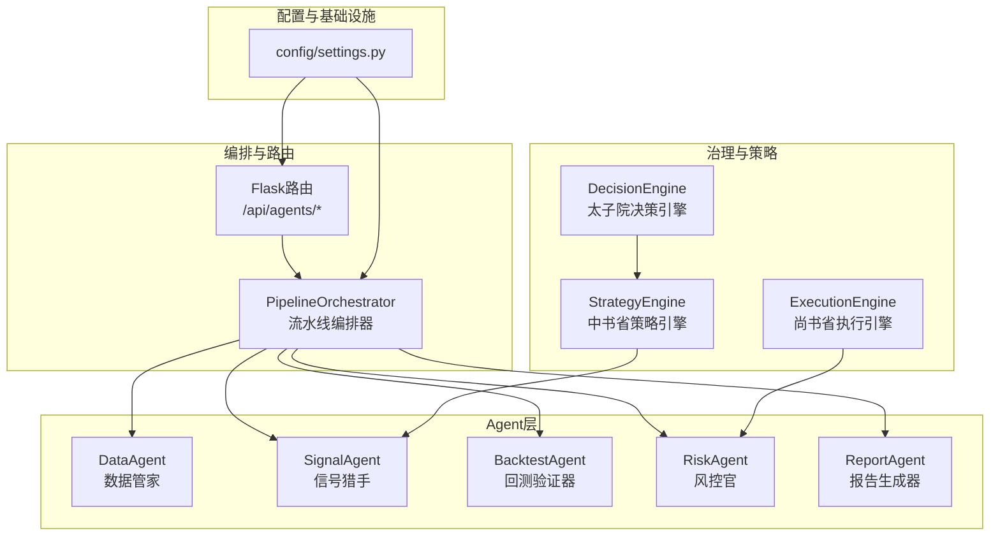

图表来源
- [agents/orchestrator.py:36-175](file://agents/orchestrator.py#L36-L175)
- [routes/agents.py:22-127](file://routes/agents.py#L22-L127)
- [governance/crown_prince/decision_engine.py:61-144](file://governance/crown_prince/decision_engine.py#L61-L144)
- [governance/chancellery/strategy_engine.py:32-102](file://governance/chancellery/strategy_engine.py#L32-L102)
- [governance/secretariat/execution_engine.py:57-182](file://governance/secretariat/execution_engine.py#L57-L182)
- [config/settings.py:1-25](file://config/settings.py#L1-L25)

章节来源
- [agents/orchestrator.py:1-263](file://agents/orchestrator.py#L1-L263)
- [routes/agents.py:1-128](file://routes/agents.py#L1-L128)
- [config/settings.py:1-25](file://config/settings.py#L1-L25)

## 核心组件
- Agent基类与上下文
  - BaseAgent：统一run生命周期，自动计时、异常捕获与结果记录。
  - AgentContext：流水线共享上下文，支持键值存储、结果汇总与状态查询。
  - AgentResult：标准化结果载体，包含执行状态、数据、错误与耗时。
- 编排器
  - PipelineOrchestrator：串行/并行执行、依赖控制、状态持久化、历史记录与并发安全。
- Agent类型与职责
  - DataAgent：交易日判断、全市场/增量同步、质量检查、缓存清理。
  - SignalAgent：多策略融合扫描、候选生成、评分排序、保存至面板。
  - BacktestAgent：快速历史回测、参数敏感度分析、统计指标聚合。
  - RiskAgent：大盘趋势/波动率/个股筛查/仓位建议/系统化风控检查。
  - ReportAgent：整合上游输出、生成HTML与JSON报告、微信推送文本。

章节来源
- [agents/base.py:20-120](file://agents/base.py#L20-L120)
- [agents/orchestrator.py:36-263](file://agents/orchestrator.py#L36-L263)
- [agents/data_agent.py:25-167](file://agents/data_agent.py#L25-L167)
- [agents/signal_agent.py:41-213](file://agents/signal_agent.py#L41-L213)
- [agents/backtest_agent.py:31-181](file://agents/backtest_agent.py#L31-L181)
- [agents/risk_agent.py:25-262](file://agents/risk_agent.py#L25-L262)
- [agents/report_agent.py:20-393](file://agents/report_agent.py#L20-L393)

## 架构总览
三省六部制流水线执行图如下：

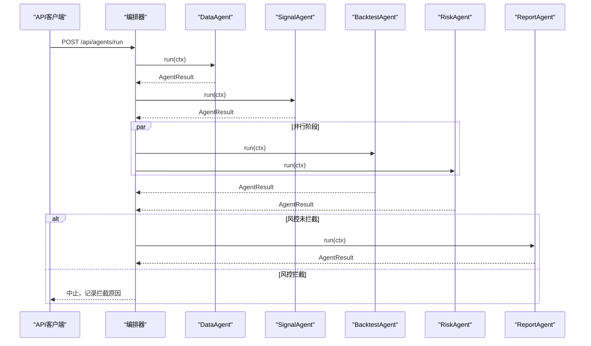

图表来源
- [agents/orchestrator.py:81-175](file://agents/orchestrator.py#L81-L175)
- [agents/data_agent.py:31-86](file://agents/data_agent.py#L31-L86)
- [agents/signal_agent.py:47-108](file://agents/signal_agent.py#L47-L108)
- [agents/backtest_agent.py:37-68](file://agents/backtest_agent.py#L37-L68)
- [agents/risk_agent.py:31-96](file://agents/risk_agent.py#L31-L96)
- [agents/report_agent.py:63-90](file://agents/report_agent.py#L63-L90)

## 详细组件分析

### Agent基类与上下文设计
- 生命周期管理
  - run(ctx)自动记录开始/结束时间、异常栈、耗时，并将AgentResult写入上下文。
  - 子类只需实现_execute(ctx)，专注业务逻辑。
- 状态同步
  - AgentContext提供set/get与set_result/get_result，支持跨Agent共享中间结果。
  - all_success可批量校验前置Agent是否全部成功。
- 错误处理
  - 统一捕获异常，记录类型、消息与堆栈，确保流水线可观测性。
- 结果与上下文
  - AgentResult包含agent_name、success、data、error、started_at、finished_at、elapsed_sec。
  - 上下文summary输出流水线整体摘要，便于API查询。

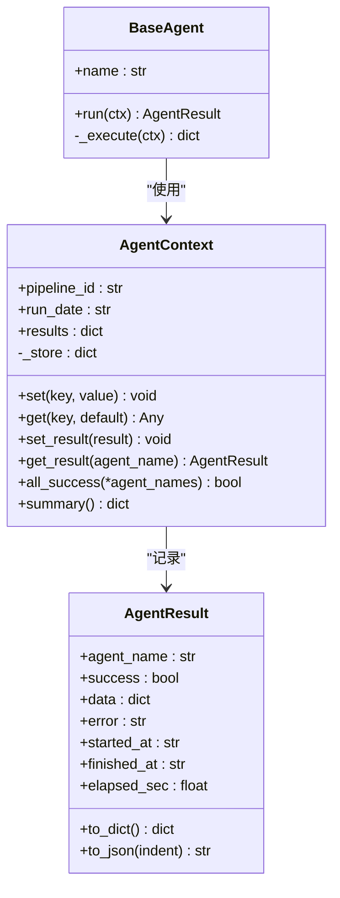

图表来源
- [agents/base.py:88-120](file://agents/base.py#L88-L120)

章节来源
- [agents/base.py:20-120](file://agents/base.py#L20-L120)

### 数据Agent（DataAgent）
- 职责
  - 交易日判断与跳过逻辑。
  - 全市场行情同步（收盘后全量/盘中增量）。
  - 指数数据同步与策略评分同步。
  - 数据质量检查（抽样缺失率、停复牌检测）。
  - 旧缓存清理。
- 关键流程

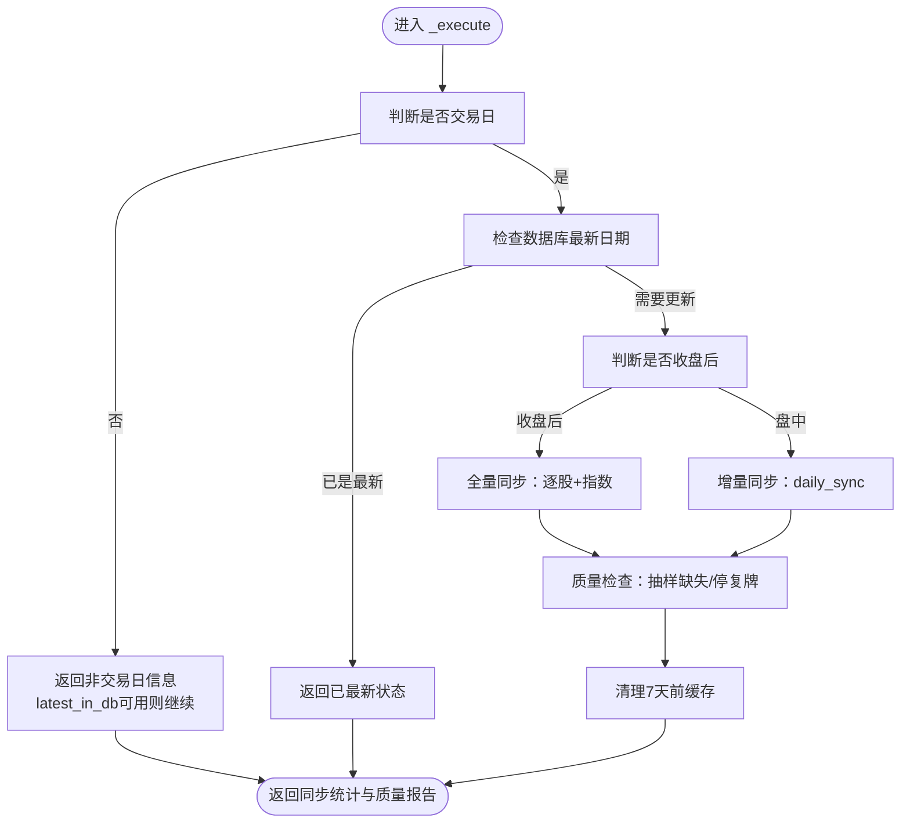

图表来源
- [agents/data_agent.py:31-86](file://agents/data_agent.py#L31-L86)

章节来源
- [agents/data_agent.py:25-167](file://agents/data_agent.py#L25-L167)

### 信号Agent（SignalAgent）
- 职责
  - 运行5策略融合与v4超跌反弹扫描。
  - 生成候选列表（按评分排序），保存至stock_signal供面板展示。
- 关键流程

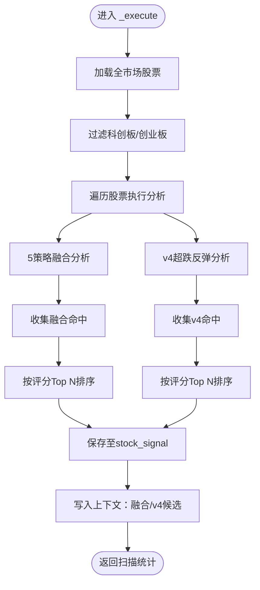

图表来源
- [agents/signal_agent.py:47-108](file://agents/signal_agent.py#L47-L108)

章节来源
- [agents/signal_agent.py:41-213](file://agents/signal_agent.py#L41-L213)

### 回测Agent（BacktestAgent）
- 职责
  - 对候选股做快速历史回测（近90天）。
  - 统计胜率、平均收益、最大回撤等指标。
  - 融合策略与v4策略分别处理。
- 关键流程

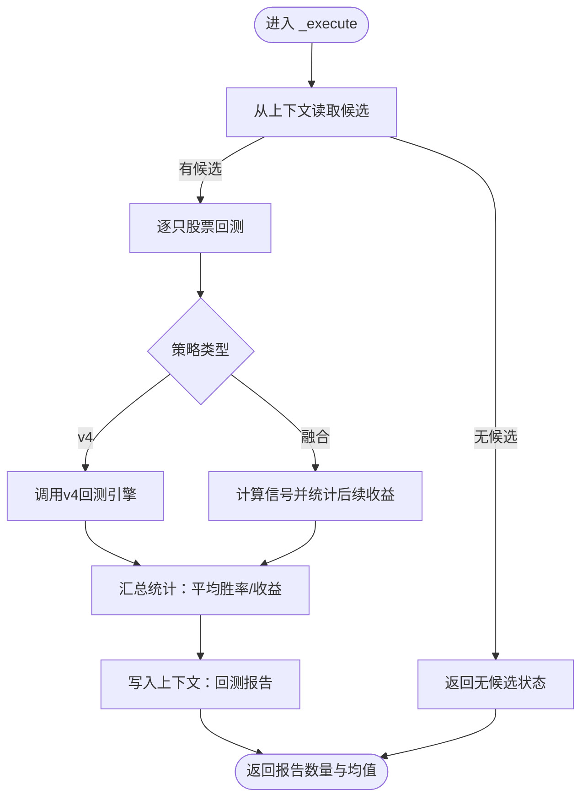

图表来源
- [agents/backtest_agent.py:37-68](file://agents/backtest_agent.py#L37-L68)

章节来源
- [agents/backtest_agent.py:31-181](file://agents/backtest_agent.py#L31-L181)

### 风控Agent（RiskAgent）
- 职责
  - 大盘趋势（MA5/MA20/MA60）、波动率（VIX近似）评估。
  - 个股风险筛查（ST/退市/停牌、连续涨停、放量大跌、接近20日低点、RSI超买）。
  - 仓位建议（基于趋势、波动率、回撤）。
  - 系统化风控检查（接入risk/模块），支持BLOCK拦截。
- 关键流程

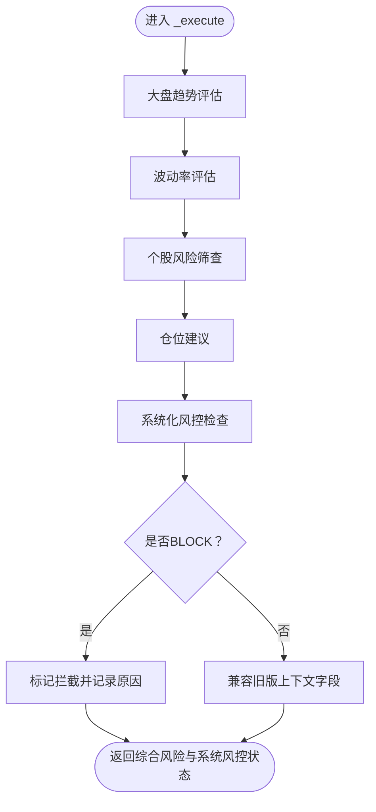

图表来源
- [agents/risk_agent.py:31-96](file://agents/risk_agent.py#L31-L96)

章节来源
- [agents/risk_agent.py:25-262](file://agents/risk_agent.py#L25-L262)

### 报告Agent（ReportAgent）
- 职责
  - 整合Data/Signal/Backtest/Risk输出，生成HTML与JSON报告。
  - 生成微信推送文本，支持非交易日数据日期标注。
- 关键流程

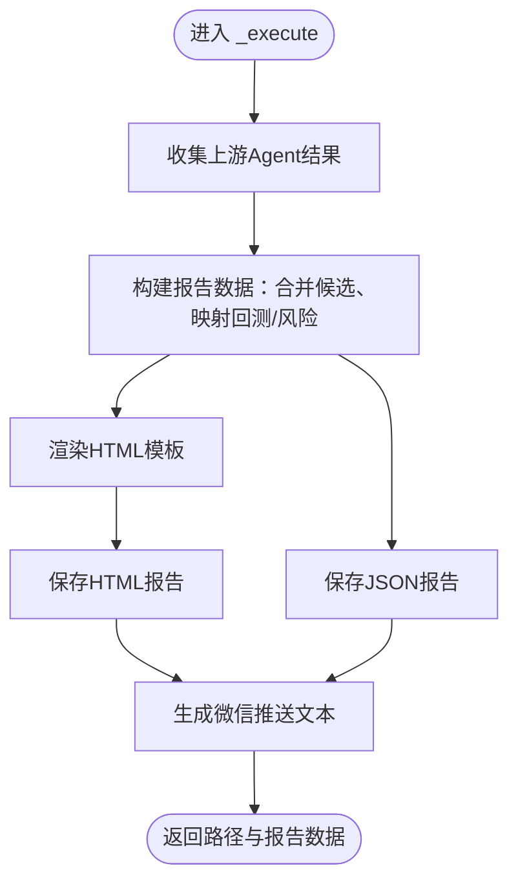

图表来源
- [agents/report_agent.py:63-90](file://agents/report_agent.py#L63-L90)

章节来源
- [agents/report_agent.py:20-393](file://agents/report_agent.py#L20-L393)

### 编排器（PipelineOrchestrator）
- 设计要点
  - 串行阶段：DataAgent → SignalAgent。
  - 并行阶段：BacktestAgent 与 RiskAgent。
  - 门下省一票否决：若RiskAgent返回BLOCK，跳过ReportAgent。
  - 状态持久化：历史记录与当前上下文摘要。
  - 并发安全：锁保护、线程池并行执行。
- 关键流程

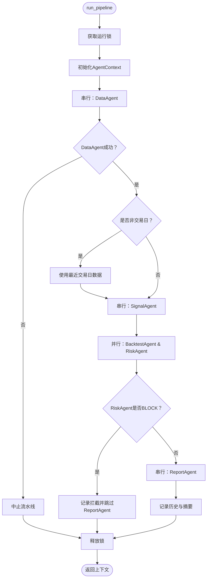

图表来源
- [agents/orchestrator.py:81-175](file://agents/orchestrator.py#L81-L175)

章节来源
- [agents/orchestrator.py:36-263](file://agents/orchestrator.py#L36-L263)

### 治理与策略引擎（可选扩展）
- 太子院决策引擎（DecisionEngine）：接收策略意图，动态生成执行计划（权重、阈值、止盈止损、最大交易数等）。
- 中书省策略引擎（StrategyEngine）：加载计划，执行多因子融合评分，输出信号。
- 尚书省执行引擎（ExecutionEngine）：接收信号，风控检查，生成订单并执行（模拟/实盘）。

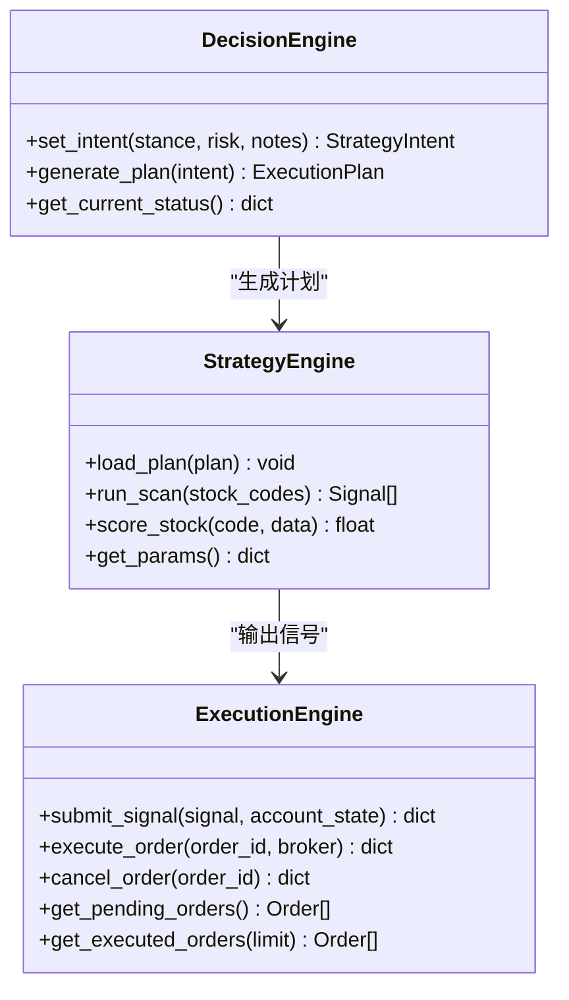

图表来源
- [governance/crown_prince/decision_engine.py:61-144](file://governance/crown_prince/decision_engine.py#L61-L144)
- [governance/chancellery/strategy_engine.py:32-102](file://governance/chancellery/strategy_engine.py#L32-L102)
- [governance/secretariat/execution_engine.py:57-182](file://governance/secretariat/execution_engine.py#L57-L182)

章节来源
- [governance/crown_prince/decision_engine.py:1-157](file://governance/crown_prince/decision_engine.py#L1-L157)
- [governance/chancellery/strategy_engine.py:1-103](file://governance/chancellery/strategy_engine.py#L1-L103)
- [governance/secretariat/execution_engine.py:1-183](file://governance/secretariat/execution_engine.py#L1-L183)

## 依赖关系分析
- 组件耦合
  - 编排器通过字符串注册表延迟导入各Agent类，降低启动期对外部依赖的敏感性。
  - Agent之间通过AgentContext弱耦合，仅依赖键名约定共享数据。
- 外部依赖
  - 数据访问：core/db、core/sync、strategy/strategies。
  - 回测：backtest/backtest_v4、backtest/strategy_screen_backtest。
  - 风控：risk/engine、risk/models。
  - API：routes/agents.py。
- 潜在环路
  - 无直接循环导入；编排器通过模块名解析避免环路。

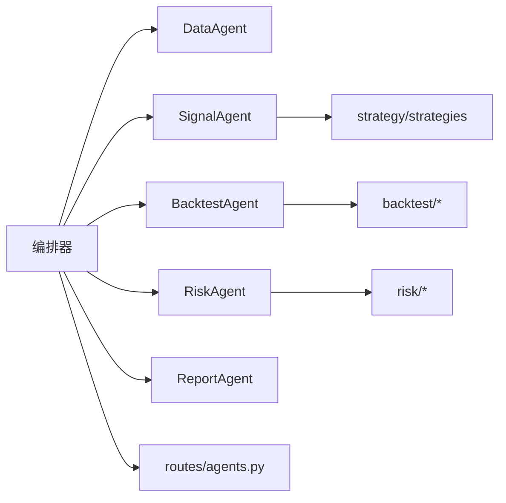

图表来源
- [agents/orchestrator.py:46-52](file://agents/orchestrator.py#L46-L52)
- [agents/signal_agent.py:18-27](file://agents/signal_agent.py#L18-L27)
- [agents/backtest_agent.py:19-27](file://agents/backtest_agent.py#L19-L27)
- [agents/risk_agent.py:21-22](file://agents/risk_agent.py#L21-L22)
- [routes/agents.py:14-15](file://routes/agents.py#L14-L15)

章节来源
- [agents/orchestrator.py:46-52](file://agents/orchestrator.py#L46-L52)
- [agents/signal_agent.py:18-27](file://agents/signal_agent.py#L18-L27)
- [agents/backtest_agent.py:19-27](file://agents/backtest_agent.py#L19-L27)
- [agents/risk_agent.py:21-22](file://agents/risk_agent.py#L21-L22)
- [routes/agents.py:14-15](file://routes/agents.py#L14-L15)

## 性能考虑
- 并行执行
  - 并行阶段（BacktestAgent与RiskAgent）显著缩短总耗时，注意线程池与资源竞争。
- I/O与数据库
  - DataAgent的全量同步与SignalAgent的逐股分析可能产生大量I/O，建议批处理与索引优化。
- 缓存与质量检查
  - DataAgent的缓存清理与SignalAgent的面板写入应避免重复操作。
- 回测效率
  - BacktestAgent对候选进行快速回测，建议限制样本长度与并行度，避免内存峰值过高。
- API与日志
  - API路由采用异步线程启动流水线，避免阻塞请求；合理设置日志级别。

## 故障排查指南
- 常见问题
  - 数据库连接异常：检查DB_PATH与init_db初始化。
  - 交易日判断错误：确认is_trading_day与is_after_market_close逻辑。
  - 策略扫描无命中：核对阈值（FUSION_THRESHOLD、V4_SCORE_THRESHOLD）与参数。
  - 风控拦截：查看risk_status与block_reason，必要时降低风险阈值。
- 调试方法
  - 单Agent调试：使用run_single触发特定Agent，观察AgentResult与上下文。
  - 状态查询：/api/agents/status查看当前流水线状态与摘要。
  - 历史记录：/api/agents/history获取最近执行历史。
  - 报告查看：/api/agents/report获取最新生成的JSON报告。
- 日志与错误
  - BaseAgent统一捕获异常并记录堆栈，结合AgentResult.error定位问题。
  - 编排器打印详细阶段信息，便于定位失败环节。

章节来源
- [routes/agents.py:22-127](file://routes/agents.py#L22-L127)
- [agents/base.py:101-114](file://agents/base.py#L101-L114)
- [agents/orchestrator.py:155-173](file://agents/orchestrator.py#L155-L173)

## 结论
AIQuant的多Agent编排系统以“三省六部制”为组织骨架，通过Agent基类与上下文实现统一抽象与状态共享，编排器负责严格的串并行控制与风控拦截。数据、信号、回测、风控与报告五大Agent各司其职，形成闭环。建议在开发新Agent时遵循基类规范、最小化副作用、明确上下文键名、做好异常与性能控制，并通过API与历史记录持续监控。

## 附录

### Agent类型分类与职责分工
- 数据类：负责数据采集、同步与质量检查（DataAgent）。
- 信号类：负责策略扫描与候选生成（SignalAgent）。
- 回测类：负责历史回测与统计分析（BacktestAgent）。
- 风控类：负责市场与个股风险评估及系统化风控（RiskAgent）。
- 报告类：负责整合输出与可视化（ReportAgent）。

### Agent通信协议
- 消息格式
  - AgentResult：标准化结果载体，包含success、data、error、耗时等。
  - AgentContext：键值存储与结果汇总，支持跨Agent共享。
- 事件传递
  - 编排器在每个Agent前后触发on_agent_start/on_agent_finish回调，便于外部观测。
- 状态共享
  - 通过ctx.set/get与ctx.set_result/get_result实现，键名需在团队内约定。

章节来源
- [agents/base.py:20-86](file://agents/base.py#L20-L86)
- [agents/orchestrator.py:181-238](file://agents/orchestrator.py#L181-L238)

### 配置管理
- 参数设置
  - START_CAPITAL、POSITION_PER_STOCK、STOP_LOSS、TAKE_PROFIT、阈值等集中于quant.py策略参数。
  - API主机、端口、定时任务时间等基础配置位于config/settings.py。
- 优先级排序
  - SignalAgent按评分排序，BacktestAgent按胜率/收益排序，ReportAgent按策略优先级与评分二次排序。
- 资源分配
  - 并行阶段由编排器线程池执行；数据同步批大小与日志级别可在settings.py中调整。

章节来源
- [quant.py:43-51](file://quant.py#L43-L51)
- [config/settings.py:15-25](file://config/settings.py#L15-L25)

### 测试与调试
- 单元测试
  - 针对Agent的_execute(ctx)进行隔离测试，构造最小AgentContext与Mock依赖。
- 集成测试
  - 使用编排器run_pipeline或run_single进行端到端验证，覆盖正常与异常分支。
- 性能测试
  - 对SignalAgent与BacktestAgent进行压力测试，评估批处理与并行度对吞吐的影响。

### 部署与监控最佳实践
- 部署
  - API服务监听0.0.0.0，端口可配置；定时任务与流水线异步执行，避免阻塞。
- 监控
  - 通过/API/agents/status与/API/agents/history实时观测流水线健康状况。
  - 建议增加外部监控（如Prometheus/Grafana）采集Agent耗时与成功率。