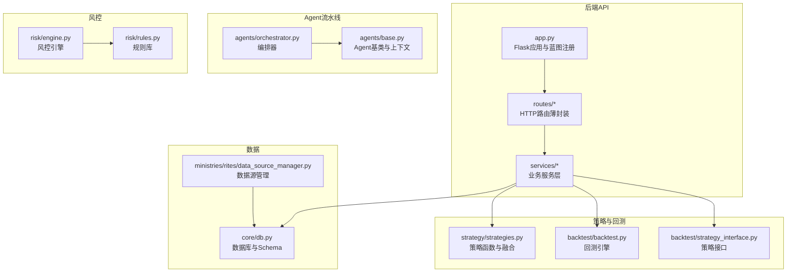
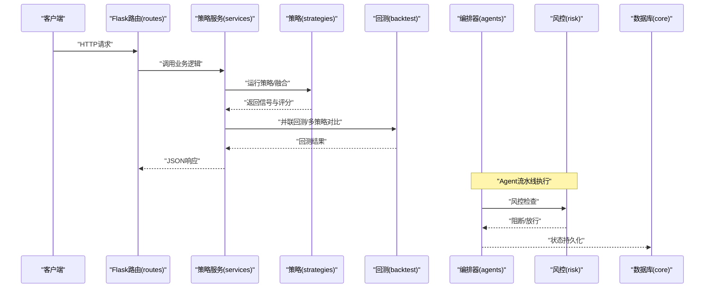
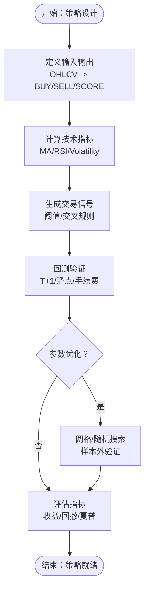
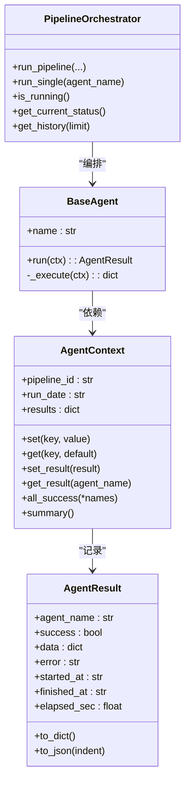
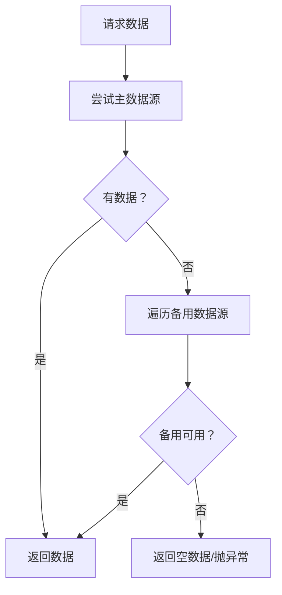
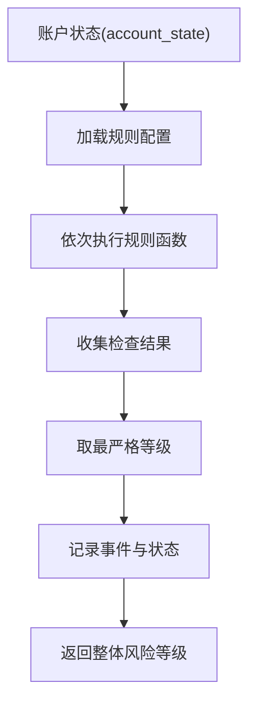
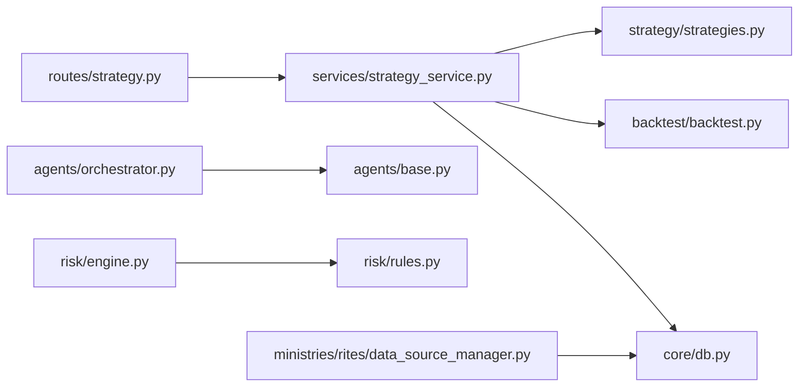

# 功能开发流程

<cite>
**本文引用的文件**
- [README.md](file://README.md)
- [app.py](file://app.py)
- [quant.py](file://quant.py)
- [strategy/strategies.py](file://strategy/strategies.py)
- [backtest/backtest.py](file://backtest/backtest.py)
- [backtest/strategy_interface.py](file://backtest/strategy_interface.py)
- [services/strategy_service.py](file://services/strategy_service.py)
- [routes/strategy.py](file://routes/strategy.py)
- [agents/base.py](file://agents/base.py)
- [agents/orchestrator.py](file://agents/orchestrator.py)
- [risk/engine.py](file://risk/engine.py)
- [risk/rules.py](file://risk/rules.py)
- [ministries/rites/data_source_manager.py](file://ministries/rites/data_source_manager.py)
- [core/db.py](file://core/db.py)
- [config/settings.py](file://config/settings.py)
</cite>

## 目录
1. [简介](#简介)
2. [项目结构](#项目结构)
3. [核心组件](#核心组件)
4. [架构总览](#架构总览)
5. [详细组件分析](#详细组件分析)
6. [依赖分析](#依赖分析)
7. [性能考虑](#性能考虑)
8. [故障排查指南](#故障排查指南)
9. [结论](#结论)
10. [附录](#附录)

## 简介
本指南面向AIQuant项目的功能开发流程，覆盖从需求分析到功能上线的完整路径，包括需求收集、技术方案设计、原型开发与正式实现；新策略开发的标准流程（策略设计、指标计算、信号生成、回测验证、参数优化）；新Agent开发的指导（Agent类型选择、状态管理、错误处理、生命周期管理）；新数据源接入流程（数据格式转换、数据质量检查、缓存策略）；风险规则开发方法（规则设计、阈值设定、监控配置）；功能模块集成的最佳实践（接口设计、依赖管理、版本兼容）；以及代码重构与性能优化指导、功能测试与验收标准制定。

## 项目结构
AIQuant采用后端API + 前端静态页面的架构，核心模块包括：
- 后端API：Flask蓝图组织，路由层薄封装，服务层调用策略与回测引擎，Agent流水线编排，风控引擎，数据源管理与数据库。
- 策略与回测：策略函数式实现，统一返回BUY/SELL信号与评分；回测引擎支持T+1执行、止损止盈、滑点、手续费、动态仓位、大盘择时等。
- Agent流水线：三省六部制编排，支持串行与并行，带状态持久化与中断控制。
- 风控：规则库配置化，支持热加载，分级阻断。
- 数据：SQLite本地数据库，统一Schema，支持批量写入与策略评分更新。

图表来源
- [app.py:1-164](file://app.py#L1-L164)
- [routes/strategy.py:1-87](file://routes/strategy.py#L1-L87)
- [services/strategy_service.py:1-325](file://services/strategy_service.py#L1-L325)
- [strategy/strategies.py:1-431](file://strategy/strategies.py#L1-L431)
- [backtest/backtest.py:1-517](file://backtest/backtest.py#L1-L517)
- [backtest/strategy_interface.py:1-86](file://backtest/strategy_interface.py#L1-L86)
- [agents/base.py:1-120](file://agents/base.py#L1-L120)
- [agents/orchestrator.py:1-263](file://agents/orchestrator.py#L1-L263)
- [risk/engine.py:1-168](file://risk/engine.py#L1-L168)
- [risk/rules.py:1-388](file://risk/rules.py#L1-L388)
- [ministries/rites/data_source_manager.py:1-190](file://ministries/rites/data_source_manager.py#L1-L190)
- [core/db.py:1-800](file://core/db.py#L1-L800)

章节来源
- [README.md:1-3](file://README.md#L1-L3)
- [app.py:1-164](file://app.py#L1-L164)
- [config/settings.py:1-25](file://config/settings.py#L1-L25)

## 核心组件
- 策略框架：提供五类基础策略与融合策略，统一输出BUY/SELL信号与评分列，便于回测与展示。
- 回测引擎：支持T+1执行、滑点、手续费、止损止盈、动态仓位、大盘择时、回撤熔断等，输出全面的绩效指标。
- Agent流水线：三省六部制编排，串行依赖与并行执行结合，支持风控拦截与状态持久化。
- 风控引擎：规则库配置化，分级阻断，支持热加载与事件记录。
- 数据源管理：抽象数据源接口，支持主备切换与健康检查，统一数据格式。
- 数据库：SQLite本地库，Schema完备，支持批量写入与策略评分更新。

章节来源
- [strategy/strategies.py:1-431](file://strategy/strategies.py#L1-L431)
- [backtest/backtest.py:1-517](file://backtest/backtest.py#L1-L517)
- [agents/orchestrator.py:1-263](file://agents/orchestrator.py#L1-L263)
- [risk/engine.py:1-168](file://risk/engine.py#L1-L168)
- [risk/rules.py:1-388](file://risk/rules.py#L1-L388)
- [ministries/rites/data_source_manager.py:1-190](file://ministries/rites/data_source_manager.py#L1-L190)
- [core/db.py:1-800](file://core/db.py#L1-L800)

## 架构总览
AIQuant后端以Flask为核心，通过蓝图组织各模块路由，服务层负责调用策略、回测、Agent与风控，数据通过统一的数据源管理与数据库模块访问。Agent流水线采用三省六部制，门下省风控一票否决，尚书省报表官在风控通过后生成报告。

图表来源
- [routes/strategy.py:1-87](file://routes/strategy.py#L1-L87)
- [services/strategy_service.py:1-325](file://services/strategy_service.py#L1-L325)
- [strategy/strategies.py:1-431](file://strategy/strategies.py#L1-L431)
- [backtest/backtest.py:1-517](file://backtest/backtest.py#L1-L517)
- [agents/orchestrator.py:1-263](file://agents/orchestrator.py#L1-L263)
- [risk/engine.py:1-168](file://risk/engine.py#L1-L168)
- [core/db.py:1-800](file://core/db.py#L1-L800)

## 详细组件分析

### 新策略开发流程
- 策略设计：明确输入OHLCV数据，输出BUY/SELL信号与SCORE列；可选附加metadata列。
- 指标计算：使用pandas/numpy进行滚动窗口、移动平均、RSI等指标计算。
- 信号生成：基于阈值或交叉规则生成布尔信号列。
- 回测验证：将策略结果注入回测引擎，执行T+1回测，评估收益、回撤、夏普比率等指标。
- 参数优化：通过参数扫描或优化器寻找最优参数组合，注意过拟合与样本外验证。

图表来源
- [strategy/strategies.py:1-431](file://strategy/strategies.py#L1-L431)
- [backtest/backtest.py:1-517](file://backtest/backtest.py#L1-L517)
- [backtest/strategy_interface.py:1-86](file://backtest/strategy_interface.py#L1-L86)

章节来源
- [strategy/strategies.py:1-431](file://strategy/strategies.py#L1-L431)
- [backtest/backtest.py:1-517](file://backtest/backtest.py#L1-L517)
- [backtest/strategy_interface.py:1-86](file://backtest/strategy_interface.py#L1-L86)

### 新Agent开发指导
- Agent类型选择：根据职责选择数据采集、信号生成、回测、风控、报表等Agent。
- 状态管理：使用AgentContext共享数据，通过set/get读写，通过set_result记录结果。
- 生命周期：实现run(ctx)自动计时与异常捕获，_execute(ctx)实现具体逻辑。
- 错误处理：异常被捕获并记录到AgentResult.error，便于编排器与监控。
- 编排集成：在orchestrator中注册Agent模块，定义串行/并行依赖与拦截点。

图表来源
- [agents/base.py:1-120](file://agents/base.py#L1-L120)
- [agents/orchestrator.py:1-263](file://agents/orchestrator.py#L1-L263)

章节来源
- [agents/base.py:1-120](file://agents/base.py#L1-L120)
- [agents/orchestrator.py:1-263](file://agents/orchestrator.py#L1-L263)

### 新数据源接入流程
- 数据格式转换：统一返回list[dict]，包含必要字段（如日期、开盘/最高/最低/收盘、成交量/成交额等）。
- 数据质量检查：实现check_health返回DataSourceStatus，包含可用性、延迟、错误计数、质量等级。
- 主备切换：get_daily_price优先主数据源，失败则遍历备用数据源尝试。
- 缓存策略：结合业务场景使用内存缓存或数据库缓存，避免重复抓取；提供清理策略。

图表来源
- [ministries/rites/data_source_manager.py:1-190](file://ministries/rites/data_source_manager.py#L1-L190)

章节来源
- [ministries/rites/data_source_manager.py:1-190](file://ministries/rites/data_source_manager.py#L1-L190)

### 风险规则开发方法
- 规则设计：每个规则函数接收account_state，返回RiskCheckResult，包含等级、类别、消息、指标值、阈值、建议。
- 阈值设定：从配置文件加载，支持热加载与分级阻断（BLOCK/RESTRICT/WARNING/PASS）。
- 监控配置：规则注册表DEFAULT_RULES统一管理；引擎执行全量检查并记录事件与状态。

图表来源
- [risk/rules.py:1-388](file://risk/rules.py#L1-L388)
- [risk/engine.py:1-168](file://risk/engine.py#L1-L168)

章节来源
- [risk/rules.py:1-388](file://risk/rules.py#L1-L388)
- [risk/engine.py:1-168](file://risk/engine.py#L1-L168)

### 功能模块集成最佳实践
- 接口设计：路由层薄封装，服务层统一调用策略/回测/Agent/风控；保持输入输出清晰与版本兼容。
- 依赖管理：通过蓝图与服务模块解耦，避免循环依赖；Agent延迟导入避免外部依赖影响。
- 版本兼容：数据库Schema迁移与列扩展使用安全方式；API参数向前兼容，新增参数提供默认值。

章节来源
- [routes/strategy.py:1-87](file://routes/strategy.py#L1-L87)
- [services/strategy_service.py:1-325](file://services/strategy_service.py#L1-L325)
- [agents/orchestrator.py:1-263](file://agents/orchestrator.py#L1-L263)
- [core/db.py:1-800](file://core/db.py#L1-L800)

### 代码重构与性能优化指导
- 策略与回测：统一信号列命名与评分范围；减少不必要的列与冗余计算；利用pandas向量化与滚动窗口。
- Agent流水线：串行依赖最小化，合理并行；异常快速失败与重试策略；状态持久化减少重复计算。
- 数据访问：批量写入与更新；索引与查询优化；缓存热点数据；定期清理旧缓存。
- 风控：规则函数幂等、快速返回；配置热加载；事件与状态入库异步化。

章节来源
- [strategy/strategies.py:1-431](file://strategy/strategies.py#L1-L431)
- [backtest/backtest.py:1-517](file://backtest/backtest.py#L1-L517)
- [agents/orchestrator.py:1-263](file://agents/orchestrator.py#L1-L263)
- [core/db.py:1-800](file://core/db.py#L1-L800)

### 功能测试与验收标准
- 单元测试：策略函数返回列一致性、边界条件、异常输入；回测引擎输入输出稳定性。
- 集成测试：路由到服务到策略/回测/Agent/风控端到端；数据源切换与错误恢复。
- 验收标准：收益/回撤/夏普比率在历史样本上达标；风控规则按阈值正确拦截；Agent流水线状态可追踪；数据库Schema与数据完整性。

章节来源
- [services/strategy_service.py:1-325](file://services/strategy_service.py#L1-L325)
- [backtest/backtest.py:1-517](file://backtest/backtest.py#L1-L517)
- [agents/orchestrator.py:1-263](file://agents/orchestrator.py#L1-L263)
- [risk/engine.py:1-168](file://risk/engine.py#L1-L168)

## 依赖分析
- 路由依赖服务层：routes/strategy.py依赖services.strategy_service.py。
- 服务层依赖策略与回测：services.strategy_service.py依赖strategy.strategies与backtest.backtest。
- Agent依赖上下文与编排：agents.base与agents/orchestrator。
- 风控依赖规则与配置：risk/engine依赖risk/rules与risk/config_loader。
- 数据访问依赖数据库：core/db提供统一接口。

图表来源
- [routes/strategy.py:1-87](file://routes/strategy.py#L1-L87)
- [services/strategy_service.py:1-325](file://services/strategy_service.py#L1-L325)
- [strategy/strategies.py:1-431](file://strategy/strategies.py#L1-L431)
- [backtest/backtest.py:1-517](file://backtest/backtest.py#L1-L517)
- [agents/orchestrator.py:1-263](file://agents/orchestrator.py#L1-L263)
- [agents/base.py:1-120](file://agents/base.py#L1-L120)
- [risk/engine.py:1-168](file://risk/engine.py#L1-L168)
- [risk/rules.py:1-388](file://risk/rules.py#L1-L388)
- [ministries/rites/data_source_manager.py:1-190](file://ministries/rites/data_source_manager.py#L1-L190)
- [core/db.py:1-800](file://core/db.py#L1-L800)

章节来源
- [routes/strategy.py:1-87](file://routes/strategy.py#L1-L87)
- [services/strategy_service.py:1-325](file://services/strategy_service.py#L1-L325)
- [strategy/strategies.py:1-431](file://strategy/strategies.py#L1-L431)
- [backtest/backtest.py:1-517](file://backtest/backtest.py#L1-L517)
- [agents/orchestrator.py:1-263](file://agents/orchestrator.py#L1-L263)
- [agents/base.py:1-120](file://agents/base.py#L1-L120)
- [risk/engine.py:1-168](file://risk/engine.py#L1-L168)
- [risk/rules.py:1-388](file://risk/rules.py#L1-L388)
- [ministries/rites/data_source_manager.py:1-190](file://ministries/rites/data_source_manager.py#L1-L190)
- [core/db.py:1-800](file://core/db.py#L1-L800)

## 性能考虑
- 策略与回测：尽量使用向量化与内置函数，避免逐行迭代；合理设置滚动窗口长度与数据范围。
- 数据库：批量写入与更新，建立必要索引；避免全表扫描；定期维护与清理。
- Agent流水线：并行执行时控制线程池大小；异常快速失败，避免阻塞；状态持久化异步化。
- API：路由层轻量封装，避免在路由中执行复杂逻辑；使用SSE或分页返回大数据集。

## 故障排查指南
- 路由与服务：检查路由参数与默认值，捕获并记录异常；查看全局错误处理器返回的JSON。
- 策略与回测：确认输入数据长度与列名；检查信号生成逻辑与边界条件；核对回测参数与滑点/手续费设置。
- Agent流水线：查看编排器历史记录与当前状态；关注风控拦截原因；检查Agent异常堆栈。
- 风控：核对规则配置与阈值；查看风险事件与状态表；确认热加载是否生效。
- 数据源：检查主备数据源健康状态；确认网络与认证；查看缓存清理策略。

章节来源
- [app.py:136-145](file://app.py#L136-L145)
- [services/strategy_service.py:1-325](file://services/strategy_service.py#L1-L325)
- [agents/orchestrator.py:1-263](file://agents/orchestrator.py#L1-L263)
- [risk/engine.py:1-168](file://risk/engine.py#L1-L168)
- [ministries/rites/data_source_manager.py:1-190](file://ministries/rites/data_source_manager.py#L1-L190)

## 结论
本指南提供了从需求到上线的全流程方法论与工程实践，涵盖策略开发、Agent流水线、数据源接入、风控规则、模块集成、性能优化与测试验收。遵循这些流程与最佳实践，可确保功能高质量、可维护、可扩展地交付与演进。

## 附录
- 配置与调度：API主机端口、定时任务时间、日志级别等基础配置位于config/settings.py。
- 核心调度与扫描：quant.py提供每日数据同步与策略扫描任务，支持强制重算与v4策略切换。

章节来源
- [config/settings.py:1-25](file://config/settings.py#L1-L25)
- [quant.py:1-631](file://quant.py#L1-L631)