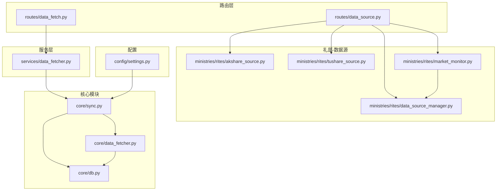
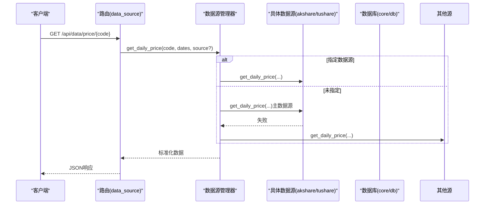
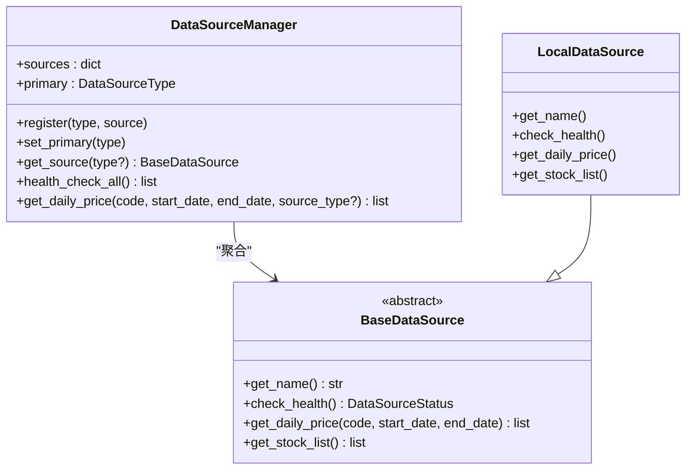
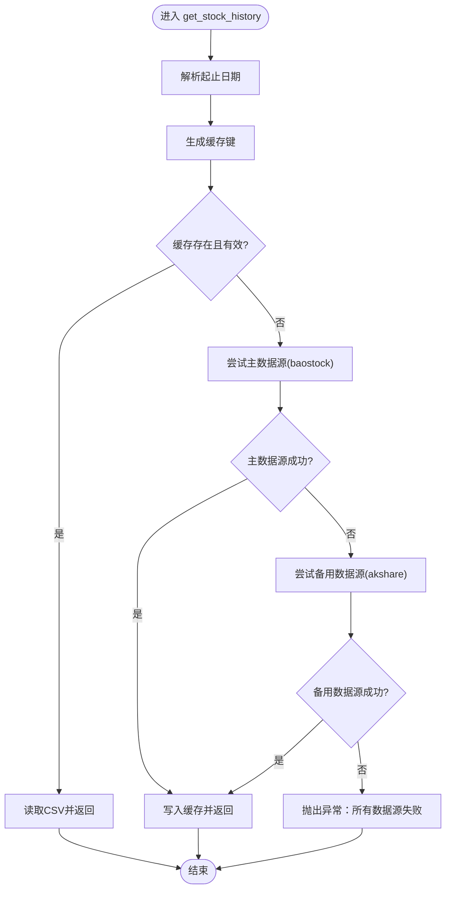
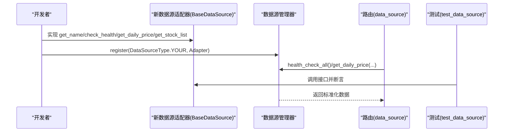
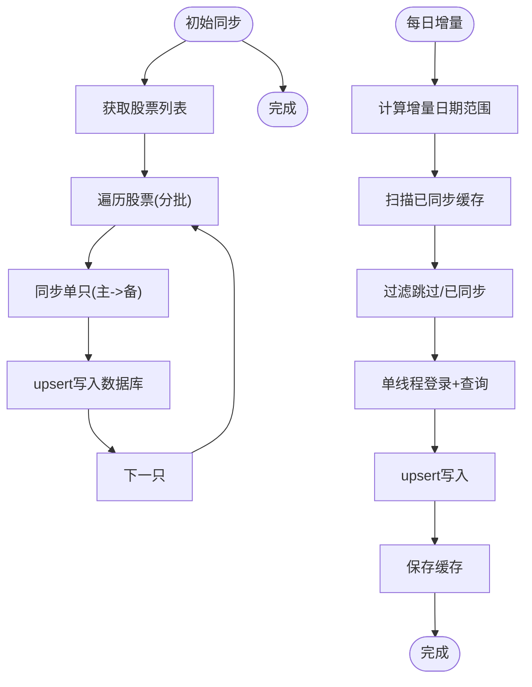
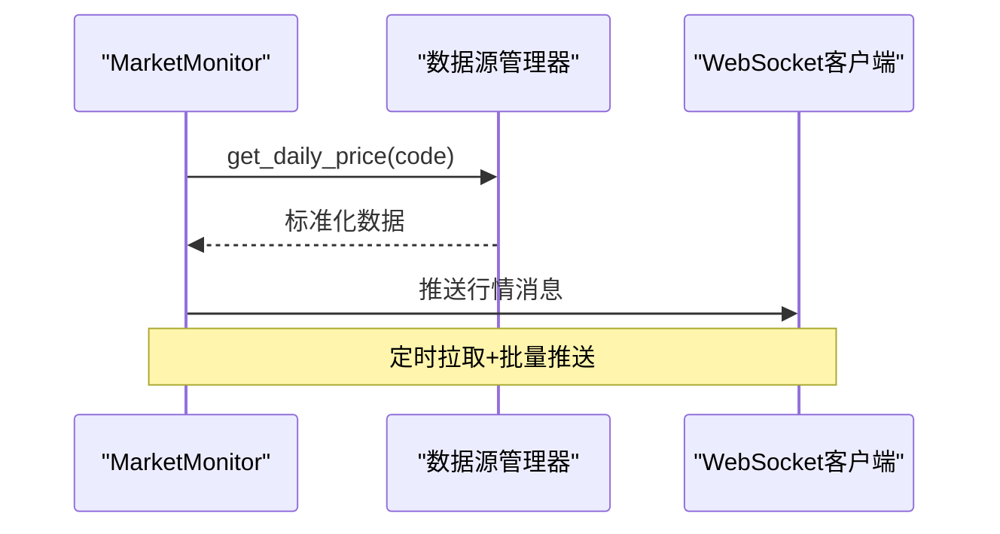
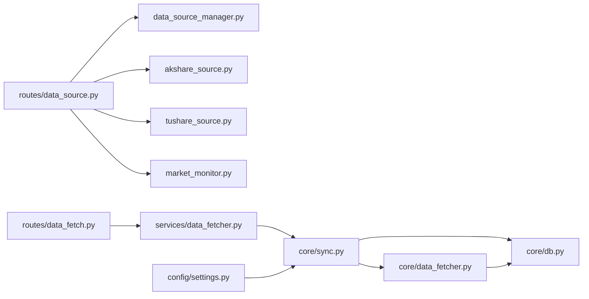

# 数据源接入流程

<cite>
**本文引用的文件**
- [routes/data_source.py](file://routes/data_source.py)
- [ministries/rites/data_source_manager.py](file://ministries/rites/data_source_manager.py)
- [ministries/rites/akshare_source.py](file://ministries/rites/akshare_source.py)
- [ministries/rites/tushare_source.py](file://ministries/rites/tushare_source.py)
- [ministries/rites/market_monitor.py](file://ministries/rites/market_monitor.py)
- [core/data_fetcher.py](file://core/data_fetcher.py)
- [core/sync.py](file://core/sync.py)
- [core/db.py](file://core/db.py)
- [routes/data_fetch.py](file://routes/data_fetch.py)
- [services/data_fetcher.py](file://services/data_fetcher.py)
- [config/settings.py](file://config/settings.py)
- [tests/test_data_source.py](file://tests/test_data_source.py)
</cite>

## 目录
1. [简介](#简介)
2. [项目结构](#项目结构)
3. [核心组件](#核心组件)
4. [架构总览](#架构总览)
5. [详细组件分析](#详细组件分析)
6. [依赖分析](#依赖分析)
7. [性能考虑](#性能考虑)
8. [故障排查指南](#故障排查指南)
9. [结论](#结论)
10. [附录](#附录)

## 简介
本指南面向AIQuant项目的“数据源接入流程”，围绕数据源管理器设计、数据获取器工作机制、新数据源接入标准流程、数据同步机制、数据质量保障、性能优化、监控与故障恢复以及配置管理最佳实践展开。文档基于仓库中的实际代码进行分析，并提供可视化图示帮助理解。

## 项目结构
AIQuant采用模块化分层组织，数据相关能力集中在以下模块：
- 路由层：对外提供HTTP接口，统一入口管理数据源与数据拉取
- 礼部（ministries/rites）：数据源适配与管理，包含数据源抽象、具体实现与监控器
- 核心模块（core）：数据抓取、同步、数据库访问与策略评分
- 服务层（services）：封装业务逻辑，供路由层调用
- 配置（config）：基础配置项，如数据库路径、定时任务时间等

**图表来源**
- [routes/data_source.py:1-112](file://routes/data_source.py#L1-L112)
- [ministries/rites/data_source_manager.py:1-190](file://ministries/rites/data_source_manager.py#L1-L190)
- [ministries/rites/akshare_source.py:1-135](file://ministries/rites/akshare_source.py#L1-L135)
- [ministries/rites/tushare_source.py:1-167](file://ministries/rites/tushare_source.py#L1-L167)
- [ministries/rites/market_monitor.py:1-244](file://ministries/rites/market_monitor.py#L1-L244)
- [core/data_fetcher.py:1-578](file://core/data_fetcher.py#L1-L578)
- [core/sync.py:1-760](file://core/sync.py#L1-L760)
- [core/db.py:1-800](file://core/db.py#L1-L800)
- [routes/data_fetch.py:1-82](file://routes/data_fetch.py#L1-L82)
- [services/data_fetcher.py:1-106](file://services/data_fetcher.py#L1-L106)
- [config/settings.py:1-25](file://config/settings.py#L1-L25)

**章节来源**
- [routes/data_source.py:1-112](file://routes/data_source.py#L1-L112)
- [ministries/rites/data_source_manager.py:1-190](file://ministries/rites/data_source_manager.py#L1-L190)
- [core/sync.py:1-760](file://core/sync.py#L1-L760)
- [core/db.py:1-800](file://core/db.py#L1-L800)

## 核心组件
- 数据源管理器：负责注册、主备切换、健康检查与统一数据接口
- 数据源适配器：对不同外部数据源（如akshare、tushare）进行标准化封装
- 数据获取器：负责抓取、格式转换与质量检查
- 数据同步引擎：负责全量/增量同步、断点续传与缓存策略
- 数据库层：提供upsert、查询、索引与统计功能
- 实时监控器：基于WebSocket推送行情，支持订阅与批量拉取
- 路由与服务：对外暴露REST接口，协调数据源与同步流程

**章节来源**
- [ministries/rites/data_source_manager.py:111-178](file://ministries/rites/data_source_manager.py#L111-L178)
- [ministries/rites/akshare_source.py:15-100](file://ministries/rites/akshare_source.py#L15-L100)
- [ministries/rites/tushare_source.py:16-127](file://ministries/rites/tushare_source.py#L16-L127)
- [core/data_fetcher.py:173-223](file://core/data_fetcher.py#L173-L223)
- [core/sync.py:319-390](file://core/sync.py#L319-L390)
- [core/db.py:543-665](file://core/db.py#L543-L665)
- [ministries/rites/market_monitor.py:21-174](file://ministries/rites/market_monitor.py#L21-L174)
- [routes/data_source.py:25-112](file://routes/data_source.py#L25-L112)

## 架构总览
AIQuant的数据流自上而下分为三层：
- 控制层：Flask蓝图提供API，路由到服务层或直接调用数据源管理器
- 适配层：数据源管理器统一调度，适配器负责具体抓取与标准化
- 存储层：SQLite数据库持久化，提供upsert、查询与索引加速

**图表来源**
- [routes/data_source.py:89-112](file://routes/data_source.py#L89-L112)
- [ministries/rites/data_source_manager.py:153-178](file://ministries/rites/data_source_manager.py#L153-L178)
- [ministries/rites/akshare_source.py:45-82](file://ministries/rites/akshare_source.py#L45-L82)
- [ministries/rites/tushare_source.py:65-103](file://ministries/rites/tushare_source.py#L65-L103)

## 详细组件分析

### 数据源管理器设计与负载均衡
- 注册机制：支持动态注册多种数据源类型（本地、akshare、tushare等）
- 主备切换：优先使用主数据源；主数据源失败时自动尝试其他可用数据源
- 健康检查：统一收集各数据源可用性、质量等级与延迟
- 统一接口：屏蔽底层差异，向上提供一致的get_daily_price/get_stock_list

**图表来源**
- [ministries/rites/data_source_manager.py:111-178](file://ministries/rites/data_source_manager.py#L111-L178)
- [ministries/rites/data_source_manager.py:72-109](file://ministries/rites/data_source_manager.py#L72-L109)

**章节来源**
- [ministries/rites/data_source_manager.py:111-178](file://ministries/rites/data_source_manager.py#L111-L178)

### 数据获取器工作原理
- 抓取策略：优先主数据源（如baostock），失败自动降级到备用数据源（如akshare）
- 格式转换：统一列名、日期格式、数值类型与索引；缺失列通过计算补全
- 质量检查：空数据返回、异常捕获、缓存命中与回退
- 缓存策略：按日期区间生成缓存文件，命中则直接读取CSV

**图表来源**
- [core/data_fetcher.py:173-223](file://core/data_fetcher.py#L173-L223)

**章节来源**
- [core/data_fetcher.py:173-223](file://core/data_fetcher.py#L173-L223)

### 新数据源接入标准流程
- 评估与选型：确认数据源稳定性、接口可用性、数据质量与频率限制
- 接口适配：实现BaseDataSource抽象方法（名称、健康检查、日线/列表获取）
- 数据映射：统一列名与格式，确保日期、数值、索引一致性
- 缓存策略：按日期区间生成缓存文件，提升重试与回放效率
- 注册与测试：在路由层注册并编写单元测试，验证健康检查与数据获取

**图表来源**
- [ministries/rites/data_source_manager.py:123-126](file://ministries/rites/data_source_manager.py#L123-L126)
- [routes/data_source.py:19-22](file://routes/data_source.py#L19-L22)
- [tests/test_data_source.py:1-35](file://tests/test_data_source.py#L1-L35)

**章节来源**
- [ministries/rites/data_source_manager.py:123-126](file://ministries/rites/data_source_manager.py#L123-L126)
- [routes/data_source.py:19-22](file://routes/data_source.py#L19-L22)
- [tests/test_data_source.py:1-35](file://tests/test_data_source.py#L1-L35)

### 数据同步机制（全量/增量/冲突处理）
- 全量同步：首次初始化，遍历股票列表，按批次写入，支持断点续传
- 增量同步：每日扫描数据库最新日期，按覆盖率阈值确定同步区间，单线程登录以规避并发问题
- 冲突处理：upsert策略，按(code, trade_date)去重，避免重复写入
- 指数同步：单独同步主要指数，确保择时策略所需数据

**图表来源**
- [core/sync.py:319-390](file://core/sync.py#L319-L390)
- [core/sync.py:462-668](file://core/sync.py#L462-L668)
- [core/db.py:543-578](file://core/db.py#L543-L578)

**章节来源**
- [core/sync.py:319-390](file://core/sync.py#L319-L390)
- [core/sync.py:462-668](file://core/sync.py#L462-L668)
- [core/db.py:543-578](file://core/db.py#L543-L578)

### 数据质量保证（验证、异常检测与修复）
- 健康检查：各数据源定期检查可用性与质量等级
- 异常检测：捕获网络/接口异常，记录错误并回退到备用数据源
- 数据验证：列完整性校验、数值类型转换、索引排序与空值过滤
- 修复机制：缓存失效重试、备用接口降级、断点续传

**章节来源**
- [ministries/rites/data_source_manager.py:136-151](file://ministries/rites/data_source_manager.py#L136-L151)
- [core/data_fetcher.py:210-222](file://core/data_fetcher.py#L210-L222)

### 数据源性能优化（并发、批量、内存）
- 并发处理：多线程池用于批量任务（如批量市值同步），但数据库写入需串行化
- 批量操作：分批处理股票，设置批次间隔与基础延迟，避免触发限流
- 内存管理：pandas按需读取与类型转换，及时释放中间对象，使用索引加速查询
- 缓存策略：本地CSV缓存减少重复抓取，断点续传避免全量重跑

**章节来源**
- [core/sync.py:319-390](file://core/sync.py#L319-L390)
- [core/sync.py:462-668](file://core/sync.py#L462-L668)
- [core/data_fetcher.py:194-202](file://core/data_fetcher.py#L194-L202)

### 监控与故障恢复（健康检查、降级、告警）
- 健康检查：统一收集各数据源状态，暴露健康检查接口
- 降级处理：主数据源失败自动切换到备用数据源
- 故障恢复：断点续传缓存、重试机制、日志记录与统计
- 实时监控：WebSocket推送最新行情，支持订阅与批量拉取

**图表来源**
- [ministries/rites/market_monitor.py:124-174](file://ministries/rites/market_monitor.py#L124-L174)
- [ministries/rites/data_source_manager.py:153-178](file://ministries/rites/data_source_manager.py#L153-L178)

**章节来源**
- [ministries/rites/market_monitor.py:21-174](file://ministries/rites/market_monitor.py#L21-L174)

### 配置与管理最佳实践
- 配置集中：数据库路径、API主机端口、定时任务时间、同步批次大小等集中于配置文件
- 环境变量：敏感配置（如tushare token）通过环境变量注入
- 日志级别：统一日志级别，便于生产环境排障
- 数据库优化：WAL模式、索引、唯一约束，确保高并发下的数据一致性

**章节来源**
- [config/settings.py:1-25](file://config/settings.py#L1-L25)
- [core/db.py:26-40](file://core/db.py#L26-L40)

## 依赖分析
- 路由层依赖数据源管理器与具体适配器，提供统一API
- 服务层封装业务逻辑，协调同步与数据库写入
- 核心模块提供数据抓取、同步与数据库访问能力
- 配置模块提供全局参数，影响定时任务与性能参数

**图表来源**
- [routes/data_source.py:1-112](file://routes/data_source.py#L1-L112)
- [routes/data_fetch.py:1-82](file://routes/data_fetch.py#L1-L82)
- [services/data_fetcher.py:1-106](file://services/data_fetcher.py#L1-L106)
- [core/sync.py:1-760](file://core/sync.py#L1-L760)
- [core/data_fetcher.py:1-578](file://core/data_fetcher.py#L1-L578)
- [core/db.py:1-800](file://core/db.py#L1-L800)
- [config/settings.py:1-25](file://config/settings.py#L1-L25)

**章节来源**
- [routes/data_source.py:1-112](file://routes/data_source.py#L1-L112)
- [routes/data_fetch.py:1-82](file://routes/data_fetch.py#L1-L82)
- [services/data_fetcher.py:1-106](file://services/data_fetcher.py#L1-L106)
- [core/sync.py:1-760](file://core/sync.py#L1-L760)
- [core/data_fetcher.py:1-578](file://core/data_fetcher.py#L1-L578)
- [core/db.py:1-800](file://core/db.py#L1-L800)
- [config/settings.py:1-25](file://config/settings.py#L1-L25)

## 性能考虑
- 同步性能：baostock无频率限制，适合全量初始化；akshare作为备用，注意限流
- 批处理：合理设置批次大小与批次间隔，避免触发外部接口限流
- 数据库写入：使用upsert与唯一索引，减少重复写入；批量插入提升吞吐
- 内存占用：pandas按需转换类型，及时清理中间变量，避免大表全量加载

## 故障排查指南
- 数据源不可用：检查健康检查接口，确认主数据源是否可用；查看备用数据源是否生效
- 同步中断：检查断点续传缓存文件是否存在；核对日期范围与覆盖率阈值
- 数据库异常：查看唯一索引冲突、类型转换错误；确认WAL模式与事务提交
- 接口超时：调整批次间隔与基础延迟；必要时增加重试次数与退避策略

**章节来源**
- [ministries/rites/data_source_manager.py:136-151](file://ministries/rites/data_source_manager.py#L136-L151)
- [core/sync.py:422-460](file://core/sync.py#L422-L460)
- [core/db.py:543-578](file://core/db.py#L543-L578)

## 结论
AIQuant通过“数据源管理器+适配器+统一接口”的架构实现了多数据源的统一接入与负载均衡；结合全量/增量同步、断点续传与缓存策略，兼顾了性能与可靠性；配合健康检查、降级与实时监控，构建了完整的数据质量保障体系。遵循本文流程与最佳实践，可高效接入新数据源并稳定运行。

## 附录
- 常用接口参考
  - 获取数据源列表与健康状态：GET /api/data/sources, GET /api/data/health
  - 切换主数据源：POST /api/data/switch
  - 获取行情：GET /api/data/price/{code}?start_date=&end_date=&source=
  - 拉取单只/批量数据：POST /api/data/fetch, POST /api/data/fetch_batch
  - 数据库状态：GET /api/data/fetch/status

**章节来源**
- [routes/data_source.py:25-112](file://routes/data_source.py#L25-L112)
- [routes/data_fetch.py:17-82](file://routes/data_fetch.py#L17-L82)