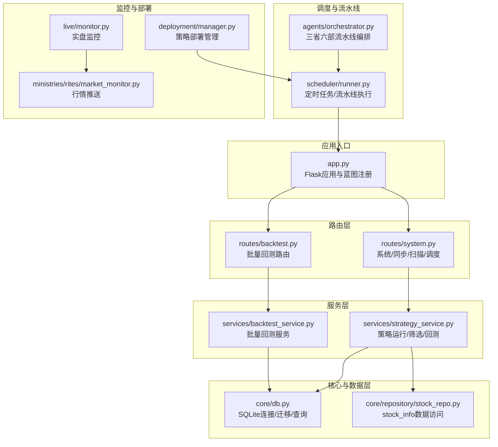
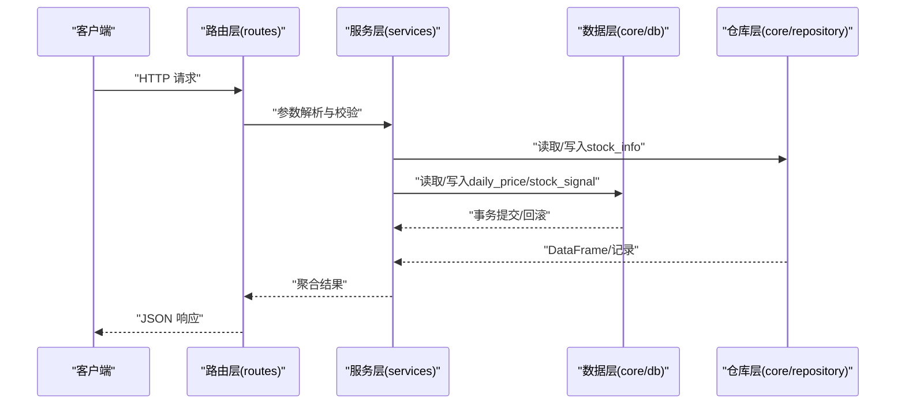
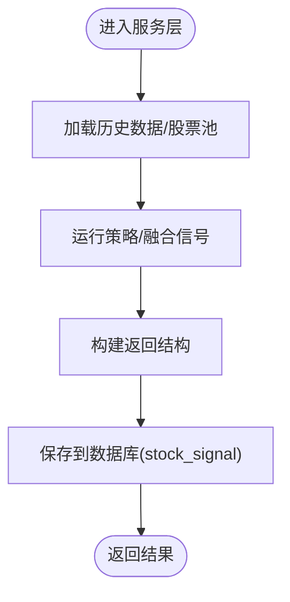
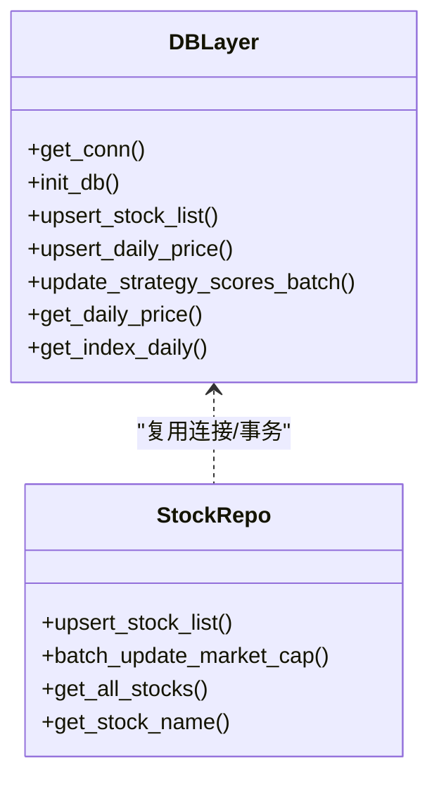
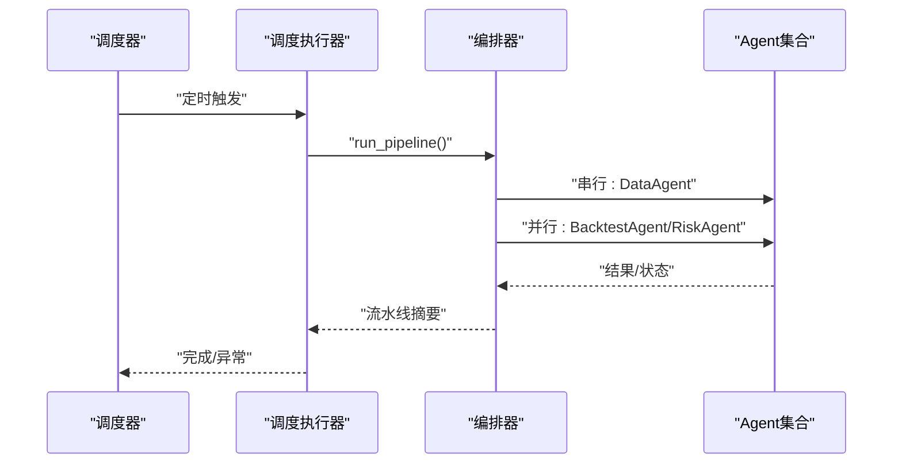
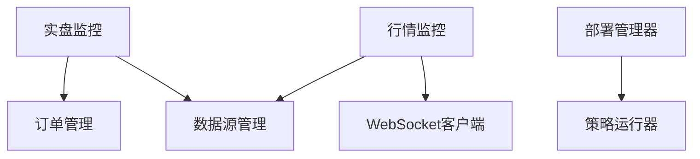
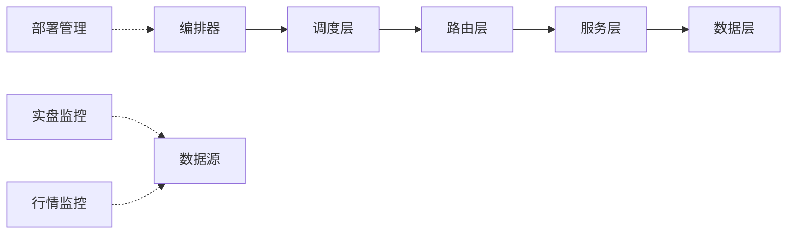

# 模块集成流程

<cite>
**本文引用的文件**
- [app.py](file://app.py)
- [quant.py](file://quant.py)
- [routes/__init__.py](file://routes/__init__.py)
- [routes/system.py](file://routes/system.py)
- [routes/backtest.py](file://routes/backtest.py)
- [services/strategy_service.py](file://services/strategy_service.py)
- [services/backtest_service.py](file://services/backtest_service.py)
- [core/db.py](file://core/db.py)
- [core/repository/stock_repo.py](file://core/repository/stock_repo.py)
- [scheduler/runner.py](file://scheduler/runner.py)
- [agents/orchestrator.py](file://agents/orchestrator.py)
- [deployment/manager.py](file://deployment/manager.py)
- [live/monitor.py](file://live/monitor.py)
- [ministries/rites/market_monitor.py](file://ministries/rites/market_monitor.py)
</cite>

## 目录
1. [简介](#简介)
2. [项目结构](#项目结构)
3. [核心组件](#核心组件)
4. [架构总览](#架构总览)
5. [详细组件分析](#详细组件分析)
6. [依赖分析](#依赖分析)
7. [性能考虑](#性能考虑)
8. [故障排查指南](#故障排查指南)
9. [结论](#结论)
10. [附录](#附录)

## 简介
本指南面向AIQuant项目的模块集成与运维，系统阐述服务层、路由层与数据层的协作关系，给出接口设计原则、标准集成流程、服务开发方法、路由实现技巧、数据库集成最佳实践、部署发布流程、监控与维护方法以及重构升级指导。目标是帮助开发者在保持高内聚、低耦合的前提下，快速、稳定地扩展与迭代系统。

## 项目结构
AIQuant采用“蓝图路由 + 服务层 + 数据层”的分层架构：
- 路由层：以Blueprint组织API，负责HTTP协议转换与请求校验。
- 服务层：封装业务逻辑，协调数据访问与策略计算。
- 数据层：统一SQLite访问与表结构管理，提供事务与索引优化。
- 调度与流水线：支持传统定时任务与多Agent流水线模式。
- 实时监控：行情推送与实盘监控。
- 部署管理：策略注册、启动、暂停、恢复与状态持久化。

图表来源
- [app.py:1-164](file://app.py#L1-L164)
- [routes/system.py:1-152](file://routes/system.py#L1-L152)
- [routes/backtest.py:1-45](file://routes/backtest.py#L1-L45)
- [services/strategy_service.py:1-325](file://services/strategy_service.py#L1-L325)
- [services/backtest_service.py:1-135](file://services/backtest_service.py#L1-L135)
- [core/db.py:1-800](file://core/db.py#L1-L800)
- [core/repository/stock_repo.py:1-80](file://core/repository/stock_repo.py#L1-L80)
- [scheduler/runner.py:1-212](file://scheduler/runner.py#L1-L212)
- [agents/orchestrator.py:1-263](file://agents/orchestrator.py#L1-L263)
- [live/monitor.py:1-286](file://live/monitor.py#L1-L286)
- [ministries/rites/market_monitor.py:1-244](file://ministries/rites/market_monitor.py#L1-L244)
- [deployment/manager.py:1-216](file://deployment/manager.py#L1-L216)

章节来源
- [app.py:1-164](file://app.py#L1-L164)
- [routes/__init__.py:1-16](file://routes/__init__.py#L1-L16)

## 核心组件
- 应用入口与蓝图注册：集中注册系统、股票、回测、信号、交易、账户、风控、治理、数据源等蓝图，统一健康检查与错误处理。
- 路由层：提供系统状态、同步、扫描、调度开关、批量回测等API，负责参数解析与错误返回。
- 服务层：封装策略运行、批量筛选、多策略并联回测、批量回测服务等业务逻辑。
- 数据层：统一SQLite连接、建表/迁移、索引、查询与事务控制，提供策略评分批量更新与行情读取。
- 调度与流水线：支持传统定时任务与多Agent流水线模式，流水线包含数据、信号、风控、回测、报表等阶段。
- 实时监控：行情推送与实盘监控，支持Webhook告警。
- 部署管理：策略注册、启动、暂停、恢复、配置热更新与状态持久化。

章节来源
- [app.py:1-164](file://app.py#L1-L164)
- [routes/system.py:1-152](file://routes/system.py#L1-L152)
- [routes/backtest.py:1-45](file://routes/backtest.py#L1-L45)
- [services/strategy_service.py:1-325](file://services/strategy_service.py#L1-L325)
- [services/backtest_service.py:1-135](file://services/backtest_service.py#L1-L135)
- [core/db.py:1-800](file://core/db.py#L1-L800)
- [scheduler/runner.py:1-212](file://scheduler/runner.py#L1-L212)
- [agents/orchestrator.py:1-263](file://agents/orchestrator.py#L1-L263)
- [live/monitor.py:1-286](file://live/monitor.py#L1-L286)
- [ministries/rites/market_monitor.py:1-244](file://ministries/rites/market_monitor.py#L1-L244)
- [deployment/manager.py:1-216](file://deployment/manager.py#L1-L216)

## 架构总览
系统采用“路由层薄、服务层厚、数据层稳”的设计，路由层仅做协议转换与参数校验，业务逻辑下沉至服务层；数据层通过上下文管理连接、事务与索引，保障一致性与性能；调度与流水线解耦任务执行与触发时机；监控与部署贯穿运行期生命周期。

图表来源
- [routes/system.py:12-43](file://routes/system.py#L12-L43)
- [services/strategy_service.py:46-107](file://services/strategy_service.py#L46-L107)
- [core/db.py:26-39](file://core/db.py#L26-L39)
- [core/repository/stock_repo.py:13-28](file://core/repository/stock_repo.py#L13-L28)

## 详细组件分析

### 路由层：请求处理与响应规范
- 设计原则
  - 蓝图前缀统一，路径清晰，便于前端对接与文档生成。
  - 统一错误处理：404/500返回JSON，包含错误信息与HTTP状态码。
  - 参数校验：对必填参数进行类型与范围检查，错误返回400。
  - 异步触发：系统同步/扫描通过线程异步执行，避免阻塞请求。
- 关键接口
  - POST /api/system/sync：触发数据同步，返回启动状态。
  - POST /api/system/scan：触发策略扫描，支持force_recalc与use_v4参数。
  - GET /api/system/status：查询同步/扫描/调度状态。
  - GET /api/backtest/batch：批量回测，支持权重、资金、风控等参数。
- 响应格式
  - 成功：{"status": "...", "message": "...", ...}
  - 失败：{"error": "..."}, 状态码400/409/500

章节来源
- [routes/system.py:12-152](file://routes/system.py#L12-L152)
- [routes/backtest.py:12-45](file://routes/backtest.py#L12-L45)
- [app.py:136-145](file://app.py#L136-L145)

### 服务层：业务逻辑封装与事务管理
- 设计原则
  - 业务逻辑集中在服务层，路由层仅做薄转换。
  - 对外暴露清晰的函数签名与返回结构，便于单元测试与集成。
  - 使用上下文管理器确保数据库事务正确提交/回滚。
- 关键能力
  - 策略运行：运行5策略或v4策略，返回融合信号与强度。
  - 批量筛选：支持SSE流式输出，逐步返回命中股票清单。
  - 多策略并联回测：对单一标的并行运行5策略与融合策略，输出指标。
  - 批量回测服务：封装回测结果统计与配对交易，输出关键指标。
- 事务与异常
  - 通过上下文管理器包裹数据库操作，异常自动回滚，确保一致性。
  - 对外部依赖（如数据源）异常进行捕获与降级提示。

图表来源
- [services/strategy_service.py:46-107](file://services/strategy_service.py#L46-L107)
- [services/strategy_service.py:110-214](file://services/strategy_service.py#L110-L214)
- [services/backtest_service.py:10-74](file://services/backtest_service.py#L10-L74)

章节来源
- [services/strategy_service.py:1-325](file://services/strategy_service.py#L1-L325)
- [services/backtest_service.py:1-135](file://services/backtest_service.py#L1-L135)
- [quant.py:433-546](file://quant.py#L433-L546)

### 数据层：连接池、事务与查询优化
- 连接管理
  - 使用上下文管理器统一获取/释放连接，设置WAL与同步模式以提升并发与可靠性。
  - 提供建表/迁移脚本，自动补齐新增列与索引。
- 查询与写入
  - 批量写入/更新：使用ON CONFLICT或UPSERT语句，避免重复插入。
  - 策略评分批量更新：按日期逐条更新，减少锁竞争。
  - 行情读取：支持时间范围过滤与索引加速。
- 索引与性能
  - 为高频查询建立复合索引与唯一索引，降低扫描成本。
  - 对大数据量表（如daily_price、stock_signal）进行分区/范围查询优化。

图表来源
- [core/db.py:26-39](file://core/db.py#L26-L39)
- [core/db.py:57-467](file://core/db.py#L57-L467)
- [core/repository/stock_repo.py:13-80](file://core/repository/stock_repo.py#L13-L80)

章节来源
- [core/db.py:1-800](file://core/db.py#L1-L800)
- [core/repository/stock_repo.py:1-80](file://core/repository/stock_repo.py#L1-L80)

### 调度与流水线：任务编排与状态管理
- 传统模式
  - 07:00 同步，09:00 扫描；支持开启/关闭调度器。
- 多Agent流水线模式
  - 07:30 DataAgent，09:00 完整流水线（数据→信号→风控/回测并行→报表）。
  - 门下省一票否决：风控拦截则跳过报表生成。
- 状态持久化
  - 使用共享状态字典与文件记录，支持查询流水线历史与当前状态。

图表来源
- [scheduler/runner.py:158-182](file://scheduler/runner.py#L158-L182)
- [scheduler/runner.py:108-137](file://scheduler/runner.py#L108-L137)
- [agents/orchestrator.py:81-175](file://agents/orchestrator.py#L81-L175)

章节来源
- [scheduler/runner.py:1-212](file://scheduler/runner.py#L1-L212)
- [agents/orchestrator.py:1-263](file://agents/orchestrator.py#L1-L263)

### 实时监控与部署：运行期可观测性
- 实盘监控
  - 定时扫描持仓，检查止损/止盈/价格异动，支持Webhook回调。
- 行情推送
  - WebSocket客户端连接管理、订阅/退订、批量拉取与推送。
- 策略部署
  - 注册/部署/启动/暂停/恢复/注销策略，支持配置热更新与状态持久化。

图表来源
- [live/monitor.py:55-155](file://live/monitor.py#L55-L155)
- [ministries/rites/market_monitor.py:21-132](file://ministries/rites/market_monitor.py#L21-L132)
- [deployment/manager.py:24-129](file://deployment/manager.py#L24-L129)

章节来源
- [live/monitor.py:1-286](file://live/monitor.py#L1-L286)
- [ministries/rites/market_monitor.py:1-244](file://ministries/rites/market_monitor.py#L1-L244)
- [deployment/manager.py:1-216](file://deployment/manager.py#L1-L216)

## 依赖分析
- 路由层依赖服务层：路由层仅负责参数与状态，业务逻辑在服务层。
- 服务层依赖数据层：通过仓库层与直接DB访问实现数据读写。
- 调度层依赖应用入口：通过线程触发系统同步/扫描与流水线。
- 监控与部署独立于业务：通过单例与回调注入到业务流程。

图表来源
- [routes/system.py:12-43](file://routes/system.py#L12-L43)
- [services/strategy_service.py:46-107](file://services/strategy_service.py#L46-L107)
- [core/db.py:26-39](file://core/db.py#L26-L39)
- [scheduler/runner.py:158-182](file://scheduler/runner.py#L158-L182)
- [agents/orchestrator.py:81-175](file://agents/orchestrator.py#L81-L175)
- [live/monitor.py:104-155](file://live/monitor.py#L104-L155)
- [ministries/rites/market_monitor.py:134-152](file://ministries/rites/market_monitor.py#L134-L152)
- [deployment/manager.py:24-129](file://deployment/manager.py#L24-L129)

章节来源
- [routes/system.py:1-152](file://routes/system.py#L1-L152)
- [services/strategy_service.py:1-325](file://services/strategy_service.py#L1-L325)
- [core/db.py:1-800](file://core/db.py#L1-L800)
- [scheduler/runner.py:1-212](file://scheduler/runner.py#L1-L212)
- [agents/orchestrator.py:1-263](file://agents/orchestrator.py#L1-L263)
- [live/monitor.py:1-286](file://live/monitor.py#L1-L286)
- [ministries/rites/market_monitor.py:1-244](file://ministries/rites/market_monitor.py#L1-L244)
- [deployment/manager.py:1-216](file://deployment/manager.py#L1-L216)

## 性能考虑
- 数据库
  - WAL模式与NORMAL同步平衡性能与可靠性；为高频查询建立索引。
  - 批量写入使用UPSERT/ON CONFLICT，减少往返；批量评分更新逐条写入，避免大事务锁。
- 服务层
  - SSE流式输出，边计算边返回，降低内存峰值。
  - 对外部数据源调用增加超时与重试策略。
- 路由层
  - 异步触发系统任务，避免阻塞请求；对参数进行快速校验。
- 监控
  - 行情推送分批拉取，避免瞬时压力；实盘监控间隔可配置。

[本节为通用建议，无需特定文件引用]

## 故障排查指南
- 健康检查
  - GET /api/health：确认服务可用。
- 路由错误
  - 404：检查URL前缀与蓝图注册；统一错误返回JSON。
  - 500：查看服务端异常栈，定位具体服务层或数据层问题。
- 系统状态
  - GET /api/system/status：查看同步/扫描/调度状态，判断是否卡住。
  - POST /api/system/sync：若返回“正在运行”，等待完成后再试。
- 数据库
  - init_db失败：检查DB路径与权限；确认迁移脚本执行。
  - 查询为空：确认数据是否已同步至最新交易日。
- 实时监控
  - 行情无推送：检查订阅列表与客户端连接状态。
  - 实盘告警未触发：核对阈值配置与价格更新。
- 部署管理
  - 策略无法启动：检查运行器状态与内容；查看部署记录文件。

章节来源
- [app.py:124-145](file://app.py#L124-L145)
- [routes/system.py:46-152](file://routes/system.py#L46-L152)
- [core/db.py:57-467](file://core/db.py#L57-L467)
- [ministries/rites/market_monitor.py:108-132](file://ministries/rites/market_monitor.py#L108-L132)
- [live/monitor.py:70-99](file://live/monitor.py#L70-L99)
- [deployment/manager.py:67-129](file://deployment/manager.py#L67-L129)

## 结论
AIQuant通过清晰的三层架构与完善的调度/监控/部署机制，实现了从数据采集、策略筛选、回测评估到实盘监控的闭环。遵循本文的接口设计原则与集成流程，可在保证稳定性的同时高效扩展模块能力。

[本节为总结，无需特定文件引用]

## 附录

### 模块接口设计原则
- API规范
  - 统一前缀与命名：/api/{module}/{action}
  - 方法与路径：GET/POST/DELETE等与资源对应
  - 参数：路径参数用于资源定位，查询参数用于过滤，请求体用于复杂对象
- 数据格式
  - 成功：{"status": "...", "message": "...", ...}
  - 失败：{"error": "..."}, 状态码400/409/500
- 错误处理
  - 400：参数错误/格式错误
  - 409：资源冲突（如任务已在运行）
  - 500：服务器内部错误，包含错误摘要

章节来源
- [routes/system.py:12-43](file://routes/system.py#L12-L43)
- [routes/backtest.py:12-45](file://routes/backtest.py#L12-L45)
- [app.py:136-145](file://app.py#L136-L145)

### 模块集成标准流程
- 依赖分析
  - 明确模块边界与输入输出，识别对数据层与外部服务的依赖
- 接口定义
  - 路由层：定义URL、方法、参数与响应结构
  - 服务层：定义函数签名、返回结构与异常约定
- 实现开发
  - 先实现服务层，再接入路由层；使用上下文管理器处理事务
- 集成测试
  - 单元测试覆盖关键分支；集成测试验证端到端流程

[本节为通用流程，无需特定文件引用]

### 服务层开发方法
- 业务封装
  - 将策略运行、筛选、回测等逻辑封装为可复用的服务函数
- 事务管理
  - 使用上下文管理器确保数据库操作原子性
- 异常处理
  - 对外部依赖异常进行捕获与降级，避免影响整体流程

章节来源
- [services/strategy_service.py:1-325](file://services/strategy_service.py#L1-L325)
- [services/backtest_service.py:1-135](file://services/backtest_service.py#L1-L135)
- [core/db.py:26-39](file://core/db.py#L26-L39)

### 路由层实现技巧
- 请求处理
  - 参数解析与快速校验，必要时转交服务层
- 响应格式
  - 统一JSON结构，错误码与消息明确
- 中间件
  - CORS与WS路由注册在应用入口集中处理

章节来源
- [routes/system.py:12-152](file://routes/system.py#L12-L152)
- [routes/backtest.py:12-45](file://routes/backtest.py#L12-L45)
- [app.py:39-75](file://app.py#L39-L75)

### 数据库集成最佳实践
- 连接池管理
  - 使用上下文管理器统一连接生命周期
- 事务控制
  - 通过try/except/finally确保commit/rollback
- 查询优化
  - 建立索引、使用批量写入、避免全表扫描

章节来源
- [core/db.py:26-39](file://core/db.py#L26-L39)
- [core/db.py:57-467](file://core/db.py#L57-L467)

### 模块部署与发布
- 版本管理
  - 通过部署记录文件持久化策略状态与配置
- 依赖检查
  - 启动时初始化数据库与索引
- 回滚策略
  - 配置热更新与状态持久化，便于快速回滚

章节来源
- [deployment/manager.py:186-204](file://deployment/manager.py#L186-L204)
- [core/db.py:57-467](file://core/db.py#L57-L467)

### 模块监控与维护
- 性能监控
  - 通过服务层返回的关键指标与数据库统计信息
- 日志记录
  - 统一异常打印与状态更新
- 故障排查
  - 健康检查、状态查询、告警回调

章节来源
- [app.py:124-145](file://app.py#L124-L145)
- [routes/system.py:46-152](file://routes/system.py#L46-L152)
- [live/monitor.py:158-186](file://live/monitor.py#L158-L186)

### 模块重构与升级指导
- 保持路由薄层与服务厚层的边界
- 数据层变更需配套迁移脚本与索引重建
- 流水线阶段可插拔，新增Agent需遵循统一上下文与结果格式
- 部署管理器支持热更新与状态持久化，便于灰度与回滚

章节来源
- [agents/orchestrator.py:181-238](file://agents/orchestrator.py#L181-L238)
- [deployment/manager.py:154-172](file://deployment/manager.py#L154-L172)
- [core/db.py:429-467](file://core/db.py#L429-L467)