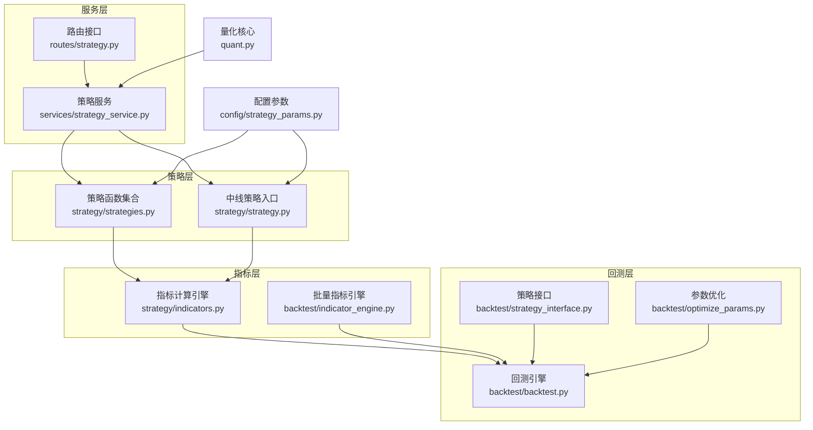
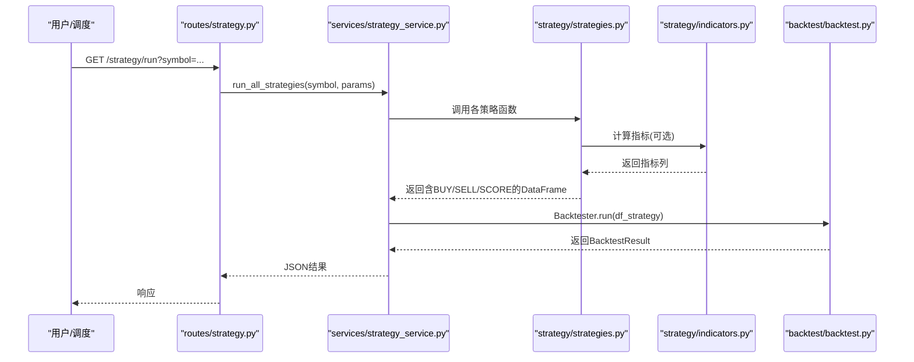
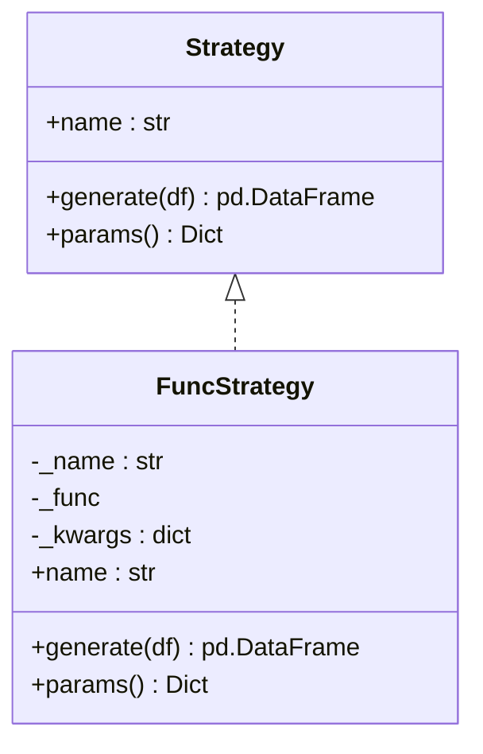
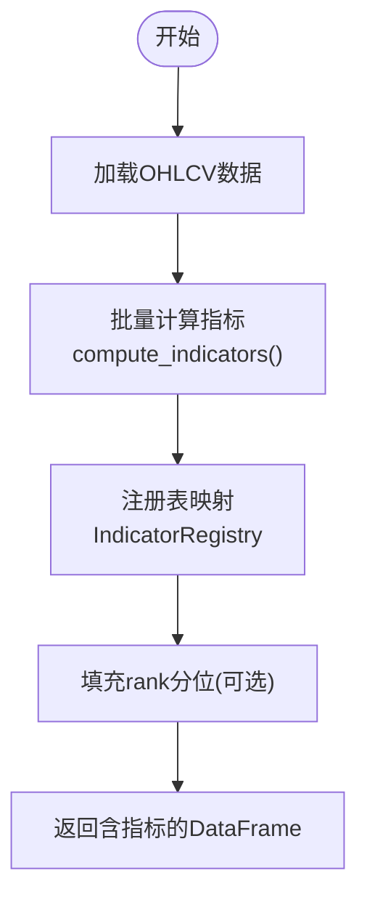
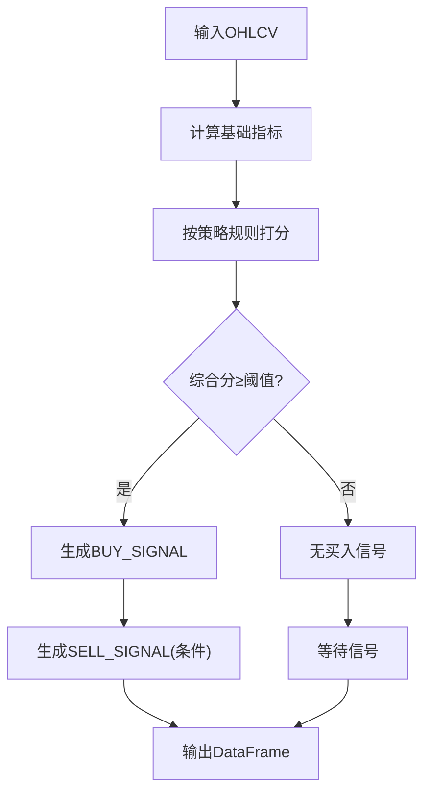
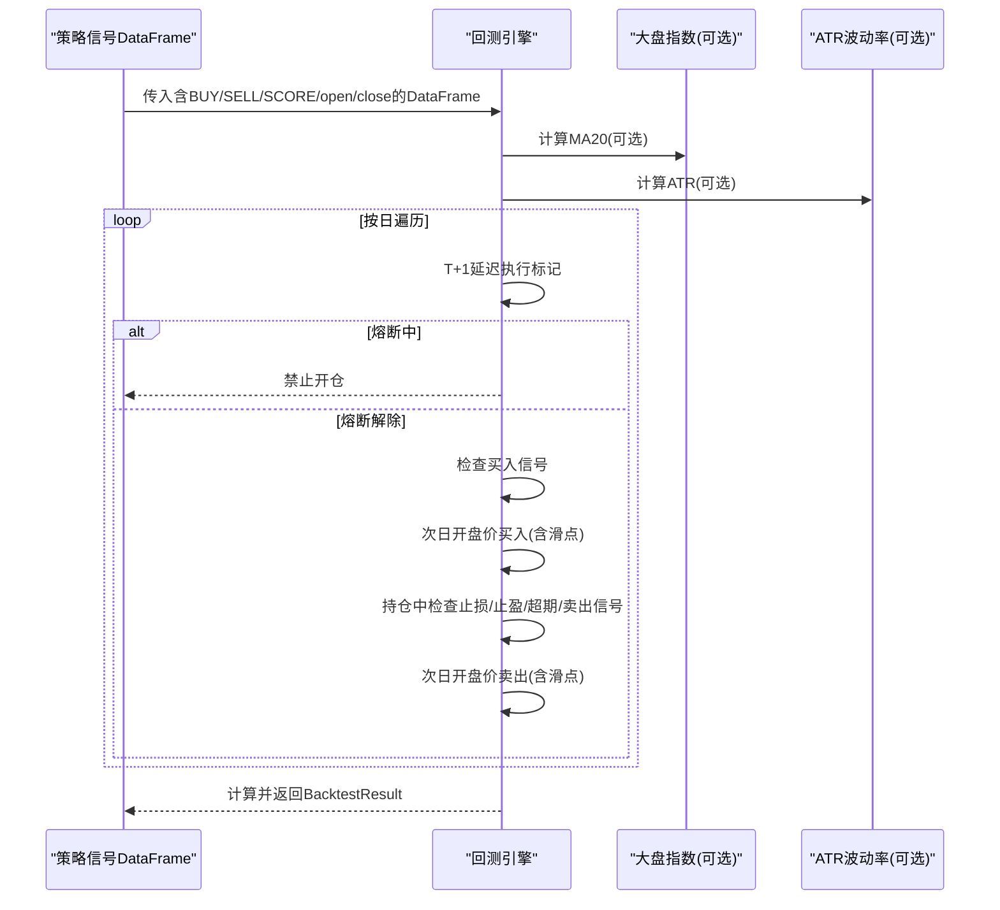
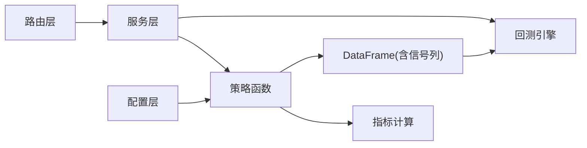

# 策略开发流程

<cite>
**本文档引用的文件**
- [strategy/strategies.py](file://strategy/strategies.py)
- [strategy/strategy.py](file://strategy/strategy.py)
- [strategy/indicators.py](file://strategy/indicators.py)
- [backtest/backtest.py](file://backtest/backtest.py)
- [backtest/strategy_interface.py](file://backtest/strategy_interface.py)
- [backtest/indicator_engine.py](file://backtest/indicator_engine.py)
- [backtest/optimize_params.py](file://backtest/optimize_params.py)
- [config/strategy_params.py](file://config/strategy_params.py)
- [services/strategy_service.py](file://services/strategy_service.py)
- [routes/strategy.py](file://routes/strategy.py)
- [quant.py](file://quant.py)
- [tests/test_backtest_engine.py](file://tests/test_backtest_engine.py)
</cite>

## 目录
1. [引言](#引言)
2. [项目结构](#项目结构)
3. [核心组件](#核心组件)
4. [架构总览](#架构总览)
5. [详细组件分析](#详细组件分析)
6. [依赖分析](#依赖分析)
7. [性能考量](#性能考量)
8. [故障排查指南](#故障排查指南)
9. [结论](#结论)
10. [附录](#附录)

## 引言
本指南面向AIQuant项目的策略开发者，系统阐述策略框架的设计原理、现有策略实现模式、指标计算方法、参数调优流程、测试验证实践以及部署与监控要点。文档以“策略即函数”的思想为核心，强调可复用的指标计算、可插拔的策略接口、可扩展的回测与优化流程，并提供从需求到上线的完整开发闭环。

## 项目结构
AIQuant采用“策略函数 + 指标引擎 + 回测框架 + 服务路由”的分层组织：
- 策略层：提供多种独立策略函数，统一返回BUY_SIGNAL/SELL_SIGNAL/SCORE等列
- 指标层：集中计算常用技术指标，支持批量与单指标注册
- 回测层：统一T+1执行、手续费/滑点/止损止盈、风控熔断与大盘择时
- 服务层：对外提供HTTP接口，封装策略运行、批量筛选、多策略回测
- 配置层：策略默认参数与权重管理

图表来源
- [strategy/strategies.py:1-431](file://strategy/strategies.py#L1-L431)
- [strategy/strategy.py:1-349](file://strategy/strategy.py#L1-L349)
- [strategy/indicators.py:1-244](file://strategy/indicators.py#L1-L244)
- [backtest/indicator_engine.py:1-433](file://backtest/indicator_engine.py#L1-L433)
- [backtest/backtest.py:1-517](file://backtest/backtest.py#L1-L517)
- [backtest/strategy_interface.py:1-86](file://backtest/strategy_interface.py#L1-L86)
- [backtest/optimize_params.py:1-462](file://backtest/optimize_params.py#L1-L462)
- [services/strategy_service.py:1-325](file://services/strategy_service.py#L1-L325)
- [routes/strategy.py:1-87](file://routes/strategy.py#L1-L87)
- [config/strategy_params.py:1-76](file://config/strategy_params.py#L1-L76)
- [quant.py:1-631](file://quant.py#L1-L631)

章节来源
- [strategy/strategies.py:1-431](file://strategy/strategies.py#L1-L431)
- [strategy/strategy.py:1-349](file://strategy/strategy.py#L1-L349)
- [strategy/indicators.py:1-244](file://strategy/indicators.py#L1-L244)
- [backtest/indicator_engine.py:1-433](file://backtest/indicator_engine.py#L1-L433)
- [backtest/backtest.py:1-517](file://backtest/backtest.py#L1-L517)
- [backtest/strategy_interface.py:1-86](file://backtest/strategy_interface.py#L1-L86)
- [backtest/optimize_params.py:1-462](file://backtest/optimize_params.py#L1-L462)
- [services/strategy_service.py:1-325](file://services/strategy_service.py#L1-L325)
- [routes/strategy.py:1-87](file://routes/strategy.py#L1-L87)
- [config/strategy_params.py:1-76](file://config/strategy_params.py#L1-L76)
- [quant.py:1-631](file://quant.py#L1-L631)

## 核心组件
- 策略接口与适配器
  - Strategy抽象类定义策略命名与generate接口，FuncStrategy将函数式策略包装为Strategy实例，便于统一接入回测引擎
- 指标计算引擎
  - strategy/indicators.py提供常用指标（MA/EMA/MACD/RSI/KDJ/BOLL/ATR/OBV等）的批量计算
  - backtest/indicator_engine.py提供注册表与批量计算能力，支持条件表达式与排名分位
- 策略实现
  - strategy/strategies.py包含5种独立策略函数，统一返回BUY_SIGNAL/SELL_SIGNAL/SCORE列
  - strategy/strategy.py提供中线综合策略与统一入口run_strategy
- 回测与优化
  - backtest/backtest.py实现T+1执行、风控熔断、动态仓位、止损止盈等
  - backtest/optimize_params.py提供参数网格搜索与约束过滤
- 服务与路由
  - services/strategy_service.py封装策略运行、批量筛选、多策略回测
  - routes/strategy.py提供HTTP接口，连接服务层
- 配置与量化核心
  - config/strategy_params.py管理策略默认参数与权重
  - quant.py负责扫描任务、阈值与消息构建

章节来源
- [backtest/strategy_interface.py:23-86](file://backtest/strategy_interface.py#L23-L86)
- [strategy/indicators.py:192-236](file://strategy/indicators.py#L192-L236)
- [backtest/indicator_engine.py:140-273](file://backtest/indicator_engine.py#L140-L273)
- [strategy/strategies.py:36-431](file://strategy/strategies.py#L36-L431)
- [strategy/strategy.py:271-349](file://strategy/strategy.py#L271-L349)
- [backtest/backtest.py:56-472](file://backtest/backtest.py#L56-L472)
- [backtest/optimize_params.py:94-177](file://backtest/optimize_params.py#L94-L177)
- [services/strategy_service.py:46-108](file://services/strategy_service.py#L46-L108)
- [routes/strategy.py:14-87](file://routes/strategy.py#L14-L87)
- [config/strategy_params.py:65-76](file://config/strategy_params.py#L65-L76)
- [quant.py:71-143](file://quant.py#L71-L143)

## 架构总览
策略开发遵循“函数式策略 + 指标复用 + 统一回测”的模式。策略函数输入OHLCV，输出含信号与评分的DataFrame；指标引擎负责一次性计算所有常用指标；回测引擎统一执行T+1交易、风控与绩效评估；服务层提供HTTP接口与批量筛选；配置层管理参数与权重。

图表来源
- [routes/strategy.py:14-32](file://routes/strategy.py#L14-L32)
- [services/strategy_service.py:46-108](file://services/strategy_service.py#L46-L108)
- [strategy/strategies.py:36-91](file://strategy/strategies.py#L36-L91)
- [strategy/indicators.py:192-236](file://strategy/indicators.py#L192-L236)
- [backtest/backtest.py:121-409](file://backtest/backtest.py#L121-L409)

## 详细组件分析

### 策略接口与适配器
- Strategy接口
  - name属性：策略唯一标识
  - generate(df)：输入OHLCV，输出含BUY_SIGNAL/SELL_SIGNAL/SCORE的DataFrame
  - params()：返回策略参数字典
- FuncStrategy适配器
  - 将现有函数式策略包装为Strategy实例，自动映射BUY_SCORE到SCORE，兼容不同策略输出习惯

图表来源
- [backtest/strategy_interface.py:23-86](file://backtest/strategy_interface.py#L23-L86)

章节来源
- [backtest/strategy_interface.py:23-86](file://backtest/strategy_interface.py#L23-L86)

### 指标计算引擎
- strategy/indicators.py
  - 提供MA/EMA/MACD/RSI/KDJ/BOLL/ATR/OBV/VWAP/CCI/DMI/WR/VOL_RATIO等指标
  - calc_all_indicators一次性计算所有指标，返回完整DataFrame
- backtest/indicator_engine.py
  - IndicatorRegistry注册指标键值、标签与计算函数
  - compute_indicators批量计算并填充rank分位等列
  - 提供eval_condition条件表达式工具（point/all_n/any_n/stat_n）

图表来源
- [backtest/indicator_engine.py:287-358](file://backtest/indicator_engine.py#L287-L358)
- [strategy/indicators.py:192-236](file://strategy/indicators.py#L192-L236)

章节来源
- [strategy/indicators.py:13-236](file://strategy/indicators.py#L13-L236)
- [backtest/indicator_engine.py:140-358](file://backtest/indicator_engine.py#L140-L358)

### 策略实现模式（5种策略）
- 放量突破
  - 核心：量比、多头排列、3日涨幅连续打分
  - 买入：综合分≥阈值且索引≥20；卖出：跌破MA5或死叉
- 均线粘合
  - 核心：均线粘合度、向上发散强度、量能稳定度
  - 买入：粘合后向上发散且综合分≥1.0；卖出：死叉或跌破MA20
- 量价背离
  - 核心：底背离强度、反弹强度、趋势逆转确认
  - 买入：综合分≥1.0；卖出：跌破MA5×0.95
- 抄底
  - 核心：前期大幅下跌、反弹强度、放量强度
  - 买入：综合分≥1.0；卖出：跌破MA5或量能持续萎缩
- 主力建仓
  - 核心：低位程度、放量程度、涨幅受控
  - 买入：综合分≥1.0；卖出：站上MA20×1.1
- 超跌反弹v3
  - 核心：20日跌幅≥12%、站上MA5、温和放量、RSI(14) 35~50、不创N日新低、20日均成交额门槛
  - 买入：综合分≥1.8；卖出：跌破MA5

图表来源
- [strategy/strategies.py:36-91](file://strategy/strategies.py#L36-L91)
- [strategy/strategies.py:98-134](file://strategy/strategies.py#L98-L134)
- [strategy/strategies.py:141-178](file://strategy/strategies.py#L141-L178)
- [strategy/strategies.py:185-217](file://strategy/strategies.py#L185-L217)
- [strategy/strategies.py:224-255](file://strategy/strategies.py#L224-L255)
- [strategy/strategies.py:281-360](file://strategy/strategies.py#L281-L360)

章节来源
- [strategy/strategies.py:36-360](file://strategy/strategies.py#L36-L360)

### 中线策略与统一入口
- 中线策略模块提供MA趋势、MACD、布林带突破与综合评分策略
- run_strategy统一调用calc_all_indicators与各策略函数，附加动态止损止盈

章节来源
- [strategy/strategy.py:34-290](file://strategy/strategy.py#L34-L290)
- [strategy/strategy.py:293-349](file://strategy/strategy.py#L293-L349)

### 回测引擎与风控
- T+1执行：买入信号当日不成交，次日开盘价执行；卖出信号当日收盘价判断，次日开盘价执行
- 手续费与滑点：双向万3，卖出千1印花税；滑点千分之一
- 风控熔断：最大回撤≥10%或连续亏损≥3次暂停开仓
- 大盘择时：可选启用，要求大盘MA20过滤
- 动态仓位：基于ATR波动率调整有效仓位比例
- 绩效指标：总收益、年化收益、最大回撤、夏普比率、胜率、盈亏比、平均持仓天数等

图表来源
- [backtest/backtest.py:121-409](file://backtest/backtest.py#L121-L409)

章节来源
- [backtest/backtest.py:56-472](file://backtest/backtest.py#L56-L472)

### 参数优化与约束
- 搜索空间：融合分门槛、止损倍数、止盈倍数、最大持仓天数、仓位比例
- 约束条件：至少5笔交易、最大回撤<25%、夏普比率>0
- 目标函数：最大化SQN（综合质量）

章节来源
- [backtest/optimize_params.py:63-86](file://backtest/optimize_params.py#L63-L86)
- [backtest/optimize_params.py:120-177](file://backtest/optimize_params.py#L120-L177)
- [backtest/optimize_params.py:179-241](file://backtest/optimize_params.py#L179-L241)

### 服务与路由
- 路由接口：/strategy/run（运行所有策略）、/strategy/screen（批量筛选）、/strategy/backtest（多策略回测）、/strategy/compare（策略对比）
- 服务层：封装策略运行、筛选生成器、多策略回测与对比

章节来源
- [routes/strategy.py:14-87](file://routes/strategy.py#L14-L87)
- [services/strategy_service.py:46-325](file://services/strategy_service.py#L46-L325)

### 量化核心与扫描任务
- analyze_stock_from_db：基于数据库数据运行5策略融合，返回信号与触发策略列表
- analyze_stock_v4：基于超跌反弹v4策略分析，支持大盘择时过滤
- scan_job：每日扫描任务，支持强制重算与回填stock_signal

章节来源
- [quant.py:71-143](file://quant.py#L71-L143)
- [quant.py:177-283](file://quant.py#L177-L283)
- [quant.py:433-546](file://quant.py#L433-L546)

## 依赖分析
- 策略函数依赖指标计算模块，通过calc_all_indicators或各自策略内的滚动计算
- 回测引擎依赖统一的信号列（BUY_SIGNAL/SELL_SIGNAL/SCORE/open/close），并可选STOP_LOSS/TAKE_PROFIT
- 服务层与路由层解耦策略实现，便于扩展与替换
- 配置层集中管理策略参数与权重，支持默认值与按策略查询

图表来源
- [strategy/strategies.py:36-431](file://strategy/strategies.py#L36-L431)
- [strategy/indicators.py:192-236](file://strategy/indicators.py#L192-L236)
- [backtest/backtest.py:121-409](file://backtest/backtest.py#L121-L409)
- [services/strategy_service.py:46-108](file://services/strategy_service.py#L46-L108)
- [routes/strategy.py:14-32](file://routes/strategy.py#L14-L32)
- [config/strategy_params.py:65-76](file://config/strategy_params.py#L65-L76)

章节来源
- [strategy/strategies.py:36-431](file://strategy/strategies.py#L36-L431)
- [backtest/backtest.py:121-409](file://backtest/backtest.py#L121-L409)
- [services/strategy_service.py:46-108](file://services/strategy_service.py#L46-L108)
- [routes/strategy.py:14-32](file://routes/strategy.py#L14-L32)
- [config/strategy_params.py:65-76](file://config/strategy_params.py#L65-L76)

## 性能考量
- 指标计算
  - 使用rolling/ewm等向量化操作，避免显式循环
  - 批量计算策略（calc_all_indicators）减少重复计算
- 回测执行
  - T+1延迟执行队列减少逐日状态判断复杂度
  - 动态仓位基于ATR，降低极端波动带来的风险
- 参数优化
  - 网格搜索结合约束过滤，避免过拟合
  - 优先选择SQN作为目标函数平衡收益与稳定性

[本节为通用指导，无需特定文件引用]

## 故障排查指南
- T+1执行验证
  - 信号日当天不应成交，次日开盘价成交；滑点应用于次日开盘价
- 资金曲线连续性
  - 缺数据日使用最近可用收盘价延续估值，避免pos_value虚假归零
- 手续费与印花税
  - 买入+卖出双向费用与卖出单向印花税计算正确
- 统一引擎框架
  - FuncStrategy适配器能正确包装现有函数并生成SCORE列

章节来源
- [tests/test_backtest_engine.py:19-127](file://tests/test_backtest_engine.py#L19-L127)

## 结论
AIQuant策略开发流程以“函数式策略 + 指标复用 + 统一回测”为核心，具备良好的可扩展性与可维护性。通过标准化的接口、完善的指标引擎、严格的回测与风控机制，以及清晰的服务与路由层，开发者可以高效地设计、验证与部署新的策略。

[本节为总结性内容，无需特定文件引用]

## 附录

### 新策略开发标准流程
- 需求分析
  - 明确交易目标（趋势跟踪/反转/震荡/均值回归等）
  - 界定输入输出（OHLCV、信号列、评分列）
- 技术指标设计
  - 优先复用现有指标（strategy/indicators.py或indicator_engine注册表）
  - 自定义指标时遵循向量化与可复用原则
- 信号生成算法实现
  - 设计连续打分机制（0~1或0~N），合成最终评分
  - 明确买入/卖出条件与阈值
- 策略参数配置
  - 在config/strategy_params.py中添加默认参数
  - 通过服务层路由参数传递
- 回测验证
  - 使用backtest/backtest.py进行T+1回测
  - 设置合理风控参数（熔断、大盘择时、动态仓位）
  - 通过backtest/optimize_params.py进行参数网格搜索与约束过滤

章节来源
- [strategy/indicators.py:13-236](file://strategy/indicators.py#L13-L236)
- [backtest/indicator_engine.py:140-273](file://backtest/indicator_engine.py#L140-L273)
- [backtest/backtest.py:56-472](file://backtest/backtest.py#L56-L472)
- [backtest/optimize_params.py:94-177](file://backtest/optimize_params.py#L94-L177)
- [config/strategy_params.py:65-76](file://config/strategy_params.py#L65-L76)
- [routes/strategy.py:20-27](file://routes/strategy.py#L20-L27)

### 策略指标计算方法与性能优化
- 指标计算
  - 使用rolling/ewm等Pandas/Numpy原语，避免Python循环
  - 对高频指标（RSI/KDJ/MACD）采用一次性批量计算
- 性能优化
  - 避免重复计算，优先使用calc_all_indicators
  - 使用clip/where等向量化条件赋值替代if-else分支
  - 控制窗口大小，平衡灵敏度与稳定性

章节来源
- [strategy/indicators.py:13-236](file://strategy/indicators.py#L13-L236)
- [backtest/indicator_engine.py:287-358](file://backtest/indicator_engine.py#L287-L358)

### 策略参数调优流程
- 参数范围设定
  - 基于历史回测与经验设定合理边界
- 回测结果分析
  - 关注总收益、最大回撤、夏普比率、胜率、盈亏比
- 最优参数选择
  - 以SQN为目标函数，结合约束条件（最小交易数、最大回撤、最小夏普）

章节来源
- [backtest/optimize_params.py:63-86](file://backtest/optimize_params.py#L63-L86)
- [backtest/optimize_params.py:120-177](file://backtest/optimize_params.py#L120-L177)
- [backtest/optimize_params.py:179-241](file://backtest/optimize_params.py#L179-L241)

### 策略测试与验证最佳实践
- 单元测试
  - 验证T+1执行、资金曲线连续性、手续费与滑点、统一引擎框架
- 集成测试
  - 路由层到服务层到策略层的端到端流程
- 压力测试
  - 大数据量与长时间序列下的回测稳定性

章节来源
- [tests/test_backtest_engine.py:19-127](file://tests/test_backtest_engine.py#L19-L127)

### 策略部署与监控指导
- 部署
  - 通过routes/strategy.py提供的HTTP接口进行在线运行与筛选
  - 使用services/strategy_service.py进行批量回测与对比
- 监控
  - 量化核心quant.py中的扫描任务与消息构建，支持阈值与触发策略列表
  - stock_signal回填用于历史推荐面板对比

章节来源
- [routes/strategy.py:14-87](file://routes/strategy.py#L14-L87)
- [services/strategy_service.py:216-325](file://services/strategy_service.py#L216-L325)
- [quant.py:344-431](file://quant.py#L344-L431)