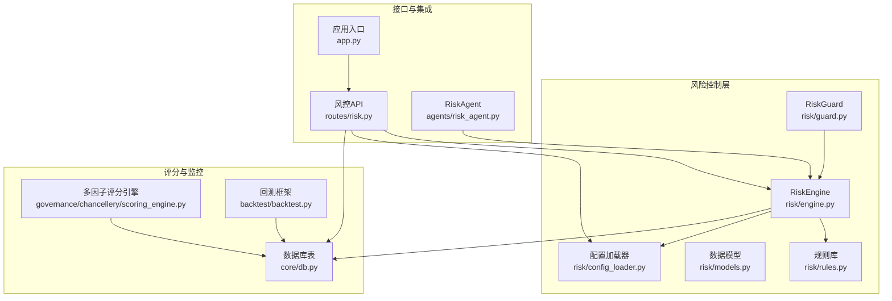
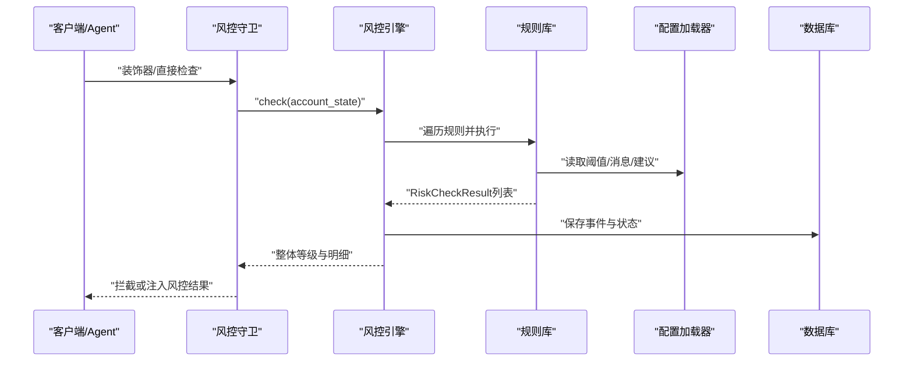
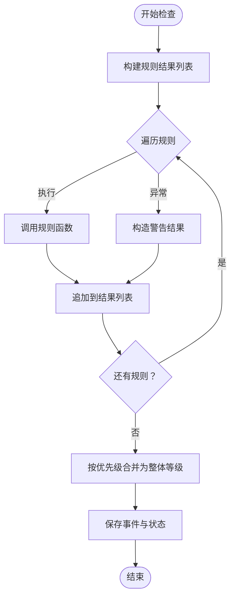
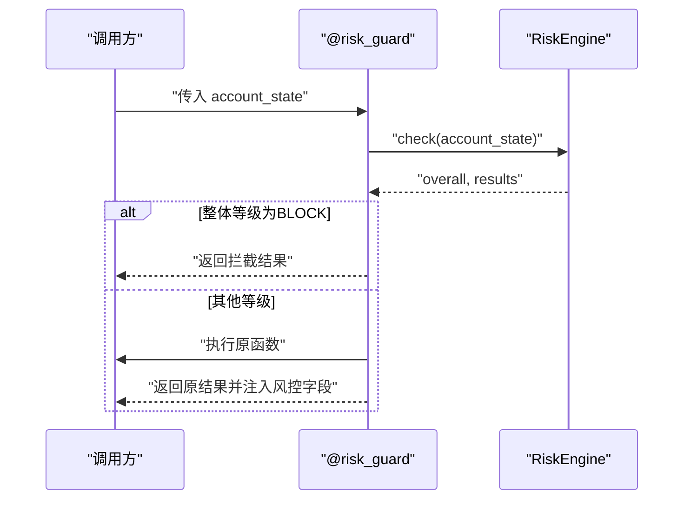
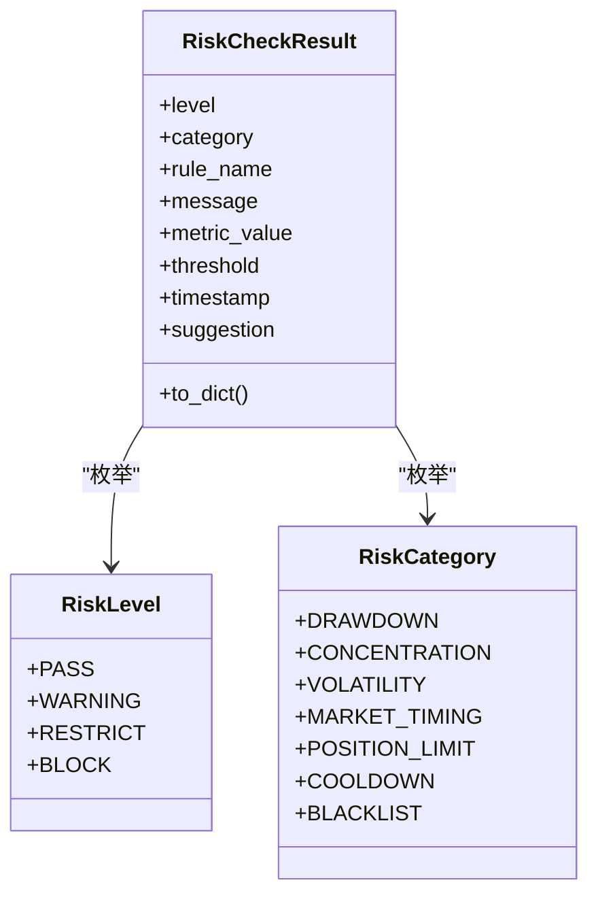
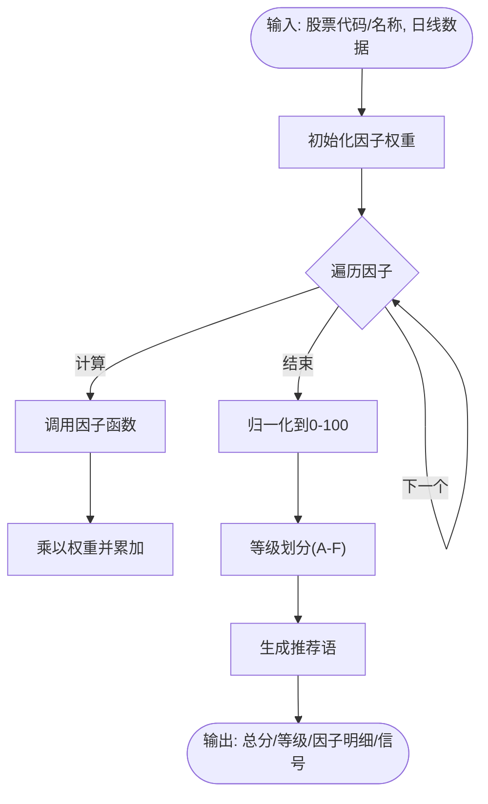
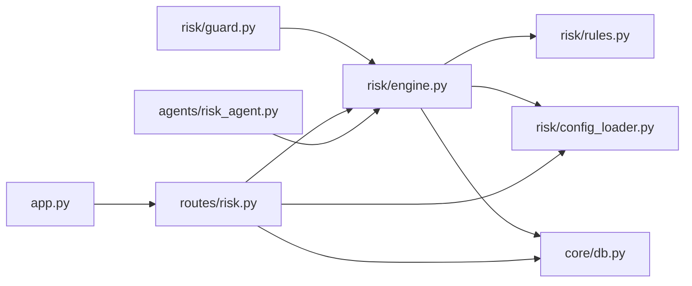

# 风险规则开发流程

<cite>
**本文引用的文件**
- [risk/engine.py](file://risk/engine.py)
- [risk/guard.py](file://risk/guard.py)
- [risk/rules.py](file://risk/rules.py)
- [risk/models.py](file://risk/models.py)
- [risk/config_loader.py](file://risk/config_loader.py)
- [routes/risk.py](file://routes/risk.py)
- [agents/risk_agent.py](file://agents/risk_agent.py)
- [governance/chancellery/scoring_engine.py](file://governance/chancellery/scoring_engine.py)
- [config/risk_config.yaml](file://config/risk_config.yaml)
- [core/db.py](file://core/db.py)
- [app.py](file://app.py)
- [backtest/backtest.py](file://backtest/backtest.py)
</cite>

## 目录
1. [简介](#简介)
2. [项目结构](#项目结构)
3. [核心组件](#核心组件)
4. [架构总览](#架构总览)
5. [详细组件分析](#详细组件分析)
6. [依赖分析](#依赖分析)
7. [性能考量](#性能考量)
8. [故障排查指南](#故障排查指南)
9. [结论](#结论)
10. [附录](#附录)

## 简介
本指南面向AIQuant项目的风险规则开发与运维团队，系统阐述风险控制系统的设计架构与实施流程。内容覆盖风险引擎、风控守卫与规则管理器的协作关系，风险规则的类型与分类，风险评分引擎的评分算法与权重分配，风险监控模型的构建方法，以及规则测试、验证与配置管理的最佳实践。同时提供风险事件处理与应急响应流程，帮助读者快速上手并安全落地。

## 项目结构
风险相关能力主要分布在以下模块：
- 风控引擎与规则：risk/engine.py、risk/rules.py、risk/models.py、risk/config_loader.py
- 风控守卫：risk/guard.py
- 风控API：routes/risk.py
- 风控Agent：agents/risk_agent.py
- 评分引擎：governance/chancellery/scoring_engine.py
- 配置文件：config/risk_config.yaml
- 数据库表：core/db.py
- 应用入口：app.py
- 回测框架：backtest/backtest.py

图表来源
- [risk/engine.py:1-168](file://risk/engine.py#L1-L168)
- [risk/guard.py:1-92](file://risk/guard.py#L1-L92)
- [risk/rules.py:1-388](file://risk/rules.py#L1-L388)
- [risk/models.py:1-78](file://risk/models.py#L1-L78)
- [risk/config_loader.py:1-131](file://risk/config_loader.py#L1-L131)
- [routes/risk.py:1-298](file://routes/risk.py#L1-L298)
- [agents/risk_agent.py:1-262](file://agents/risk_agent.py#L1-L262)
- [governance/chancellery/scoring_engine.py:1-370](file://governance/chancellery/scoring_engine.py#L1-L370)
- [core/db.py:358-414](file://core/db.py#L358-L414)
- [app.py:1-164](file://app.py#L1-L164)
- [backtest/backtest.py:1-200](file://backtest/backtest.py#L1-L200)

章节来源
- [app.py:1-164](file://app.py#L1-L164)
- [routes/risk.py:1-298](file://routes/risk.py#L1-L298)

## 核心组件
- 风控引擎（RiskEngine）：负责执行规则集合、聚合结果、持久化状态与事件，并提供查询接口。
- 风控守卫（RiskGuard）：提供装饰器与直接检查两种方式，对业务流程进行风控拦截与结果注入。
- 规则库（Rules）：内置多条规则函数，按配置驱动阈值与消息，统一输出检查结果。
- 配置加载器（RiskConfig）：支持YAML热加载，提供规则开关、阈值、消息与建议的统一访问。
- 数据模型（Models）：定义风险等级、类别、检查结果与状态快照的数据结构。
- 风控API（routes/risk.py）：对外暴露风控状态、事件、配置、黑名单与豁免管理接口。
- 风控Agent（agents/risk_agent.py）：在多Agent编排中执行系统化风控检查，并将结果写入上下文。
- 评分引擎（governance/chancellery/scoring_engine.py）：多因子评分，用于策略筛选与风险评估的输入。
- 数据库（core/db.py）：存储风控事件、状态、黑名单与豁免记录。

章节来源
- [risk/engine.py:13-168](file://risk/engine.py#L13-L168)
- [risk/guard.py:36-92](file://risk/guard.py#L36-L92)
- [risk/rules.py:14-388](file://risk/rules.py#L14-L388)
- [risk/config_loader.py:20-131](file://risk/config_loader.py#L20-L131)
- [risk/models.py:11-78](file://risk/models.py#L11-L78)
- [routes/risk.py:29-298](file://routes/risk.py#L29-L298)
- [agents/risk_agent.py:25-262](file://agents/risk_agent.py#L25-L262)
- [governance/chancellery/scoring_engine.py:246-370](file://governance/chancellery/scoring_engine.py#L246-L370)
- [core/db.py:358-414](file://core/db.py#L358-L414)

## 架构总览
风险控制系统采用“规则配置驱动 + 引擎执行 + 守卫拦截 + API与Agent集成”的分层架构。配置文件决定规则开关与阈值，引擎按序执行规则并合并结果，守卫在业务流程中自动拦截高风险场景，API与Agent提供查询、管理与编排能力，数据库持久化状态与事件。

图表来源
- [risk/guard.py:36-92](file://risk/guard.py#L36-L92)
- [risk/engine.py:19-71](file://risk/engine.py#L19-L71)
- [risk/rules.py:34-61](file://risk/rules.py#L34-L61)
- [risk/config_loader.py:88-116](file://risk/config_loader.py#L88-L116)
- [core/db.py:358-414](file://core/db.py#L358-L414)

## 详细组件分析

### 风控引擎（RiskEngine）
- 职责
  - 执行规则集合，聚合为整体风险等级
  - 将检查结果与状态写入数据库
  - 提供查询最新状态与最近事件的能力
- 关键逻辑
  - 规则执行与异常兜底：捕获规则执行异常并以警告级别记录
  - 等级合并：按阻断>限制>预警>通过的优先级取最严格等级
  - 持久化：事件表与状态表分别记录明细与快照
- 复杂度
  - 规则执行为O(N)，N为规则数量；数据库写入为批量插入，受事务与索引影响

图表来源
- [risk/engine.py:19-71](file://risk/engine.py#L19-L71)
- [risk/engine.py:73-168](file://risk/engine.py#L73-L168)

章节来源
- [risk/engine.py:13-168](file://risk/engine.py#L13-L168)

### 风控守卫（RiskGuard）
- 职责
  - 装饰器形式：在被装饰函数前后注入风控检查与结果
  - 直接检查：返回风控总体等级与活动规则摘要
- 行为
  - 若整体等级为阻断，直接返回拦截结果
  - 否则执行原函数并将风控结果注入返回字典

图表来源
- [risk/guard.py:36-92](file://risk/guard.py#L36-L92)
- [risk/engine.py:19-71](file://risk/engine.py#L19-L71)

章节来源
- [risk/guard.py:36-92](file://risk/guard.py#L36-L92)

### 规则库（Rules）
- 类型与分类
  - 市场风险：大盘择时（MA5/MA20）、节假日/周末持仓提醒
  - 信用风险：黑名单检查
  - 流动性风险：日交易频率限制、总仓位限制、单股/行业集中度限制
  - 操作风险：连续亏损冷却期、个股波动率限制、最大回撤限制
- 设计要点
  - 规则函数签名统一，返回标准化检查结果
  - 阈值与消息从配置加载器读取，支持热加载
  - 黑名单规则动态查询数据库，支持有效期

图表来源
- [risk/models.py:11-78](file://risk/models.py#L11-L78)
- [risk/rules.py:34-388](file://risk/rules.py#L34-L388)

章节来源
- [risk/rules.py:14-388](file://risk/rules.py#L14-L388)
- [risk/models.py:11-78](file://risk/models.py#L11-L78)

### 配置加载器（RiskConfig）
- 能力
  - YAML热加载：文件修改自动检测并重载
  - 属性访问：支持点号路径读取嵌套配置
  - 规则开关、阈值、消息与建议的统一接口
- 使用场景
  - 规则启用/禁用
  - 阈值动态调整
  - 消息模板与建议文本格式化

章节来源
- [risk/config_loader.py:20-131](file://risk/config_loader.py#L20-L131)
- [config/risk_config.yaml:1-170](file://config/risk_config.yaml#L1-L170)

### 风控API（routes/risk.py）
- 接口清单
  - 获取风控状态、最近事件
  - 手动触发风控检查
  - 获取/热加载风控配置
  - 黑名单增删改查
  - 风控豁免申请、审批与查询
  - 资产回撤曲线查询
- 交互
  - 与RiskEngine、RiskConfig、数据库协同
  - 返回JSON结构，便于前端与自动化工具消费

章节来源
- [routes/risk.py:29-298](file://routes/risk.py#L29-L298)
- [app.py:19-72](file://app.py#L19-L72)

### 风控Agent（agents/risk_agent.py）
- 职责
  - 大盘趋势、波动率与个股风险筛查
  - 仓位建议与综合风险等级
  - 系统化风控检查并写入上下文
- 集成
  - 构建账户状态并调用RiskEngine
  - 将风控状态写入Agent上下文，供Orchestrator拦截

章节来源
- [agents/risk_agent.py:25-262](file://agents/risk_agent.py#L25-L262)

### 风险评分引擎（多因子评分）
- 职责
  - 计算单只股票的多维度因子得分
  - 支持权重配置与自定义因子
  - 输出标准化评分（0-100）与等级划分
- 因子体系
  - 趋势、动量、波动率、成交量、质量
- 评分流程
  - 逐因子计算，加权求和，映射等级与推荐语

图表来源
- [governance/chancellery/scoring_engine.py:246-370](file://governance/chancellery/scoring_engine.py#L246-L370)

章节来源
- [governance/chancellery/scoring_engine.py:246-370](file://governance/chancellery/scoring_engine.py#L246-L370)

## 依赖分析
- 组件耦合
  - RiskEngine依赖Rules与Config，持久化依赖DB
  - RiskGuard依赖RiskEngine
  - routes/risk.py依赖RiskEngine、RiskConfig与DB
  - agents/risk_agent.py依赖RiskEngine与数据库接口
- 外部依赖
  - Flask蓝图注册于app.py
  - 数据库表定义位于core/db.py

图表来源
- [risk/guard.py:1-92](file://risk/guard.py#L1-L92)
- [risk/engine.py:1-168](file://risk/engine.py#L1-L168)
- [risk/rules.py:1-388](file://risk/rules.py#L1-L388)
- [risk/config_loader.py:1-131](file://risk/config_loader.py#L1-L131)
- [routes/risk.py:1-298](file://routes/risk.py#L1-L298)
- [agents/risk_agent.py:1-262](file://agents/risk_agent.py#L1-L262)
- [app.py:1-164](file://app.py#L1-L164)
- [core/db.py:358-414](file://core/db.py#L358-L414)

章节来源
- [app.py:1-164](file://app.py#L1-L164)
- [routes/risk.py:1-298](file://routes/risk.py#L1-L298)

## 性能考量
- 规则执行
  - 规则数量有限且均为纯函数，执行时间短；异常捕获保证鲁棒性
- 数据库
  - 事件与状态写入使用批量插入，建议合理设置索引（已建索引）
- 配置热加载
  - 文件修改检测与重载在读取时触发，避免频繁IO
- 评分引擎
  - 因子计算基于pandas/numpy，注意数据长度与内存占用

[本节为通用指导，无需特定文件来源]

## 故障排查指南
- 常见问题
  - 配置未生效：确认risk_config.yaml路径与权限，调用热加载接口或等待自动检测
  - 规则异常：检查规则函数内部异常处理，关注引擎对异常的警告兜底
  - 黑名单不生效：核对黑名单表结构与有效期，确认规则函数正确查询
  - API返回错误：检查routes/risk.py中数据库操作与异常处理
- 排查步骤
  - 通过“最近事件”接口定位具体规则与阈值
  - 使用“手动检查”接口快速验证规则
  - 查看“风控状态”确认整体等级与活动规则
  - 核对数据库表结构与索引

章节来源
- [routes/risk.py:52-82](file://routes/risk.py#L52-L82)
- [risk/engine.py:129-168](file://risk/engine.py#L129-L168)
- [core/db.py:358-414](file://core/db.py#L358-L414)

## 结论
AIQuant的风险控制系统以配置驱动为核心，通过风控引擎、风控守卫与规则库形成闭环，结合API与Agent实现编排与可视化。评分引擎为策略筛选提供多维输入，数据库保障审计与追溯。遵循本文流程与最佳实践，可在保证安全的前提下高效迭代风险规则。

[本节为总结，无需特定文件来源]

## 附录

### 风险规则类型与分类
- 市场风险
  - 大盘择时（MA5/MA20）、节假日/周末持仓提醒
- 信用风险
  - 黑名单检查
- 流动性风险
  - 日交易频率限制、总仓位限制、单股/行业集中度限制
- 操作风险
  - 连续亏损冷却期、个股波动率限制、最大回撤限制

章节来源
- [risk/rules.py:34-388](file://risk/rules.py#L34-L388)

### 风险规则开发标准流程
- 风险识别
  - 明确业务场景与潜在损失点，选择对应规则类型
- 规则设计
  - 设定指标与阈值，编写规则函数并返回标准化结果
- 阈值设定
  - 在risk_config.yaml中配置阈值、消息与建议
- 效果评估
  - 通过API查询事件与状态，结合回测框架评估影响

章节来源
- [routes/risk.py:67-82](file://routes/risk.py#L67-L82)
- [config/risk_config.yaml:1-170](file://config/risk_config.yaml#L1-L170)

### 风险评分引擎工作原理
- 评分算法
  - 因子加权平均，映射到0-100区间
- 权重分配
  - 默认权重可调，支持按策略目标调整
- 等级划分
  - A-F等级与推荐语，便于策略决策

章节来源
- [governance/chancellery/scoring_engine.py:246-370](file://governance/chancellery/scoring_engine.py#L246-L370)

### 风险监控模型构建方法
- 统计模型
  - 基于回撤、波动率、集中度等统计指标
- 机器学习模型
  - 可扩展至预测类模型（本仓库未内置）
- 专家系统
  - 基于规则与经验的组合策略

章节来源
- [backtest/backtest.py:56-200](file://backtest/backtest.py#L56-L200)

### 风险规则测试与验证
- 历史回测
  - 使用回测框架评估规则对策略收益与风险的影响
- 压力测试
  - 构造极端行情场景，验证规则触发与拦截效果
- 敏感性分析
  - 调整阈值观察规则分布变化

章节来源
- [backtest/backtest.py:56-200](file://backtest/backtest.py#L56-L200)

### 风险规则配置与管理最佳实践
- 动态调整
  - 通过API热加载配置，无需重启服务
- 实时监控
  - 使用“最近事件”与“风控状态”接口实时掌握风险状况
- 自动触发
  - 风控守卫自动拦截阻断级风险，保障系统安全

章节来源
- [routes/risk.py:96-108](file://routes/risk.py#L96-L108)
- [risk/guard.py:36-92](file://risk/guard.py#L36-L92)

### 风险事件处理与应急响应流程
- 应急响应
  - 黑名单增删、豁免申请与审批、阻断拦截
- 审计与追溯
  - 事件与状态持久化，支持查询与报表

章节来源
- [routes/risk.py:112-244](file://routes/risk.py#L112-L244)
- [core/db.py:358-414](file://core/db.py#L358-L414)