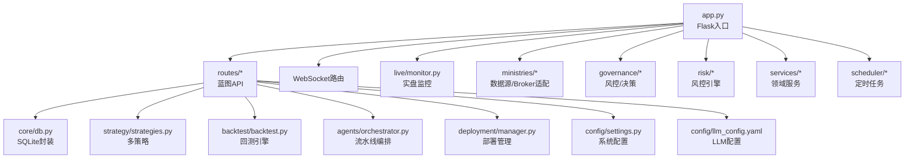
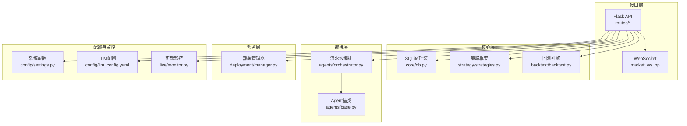
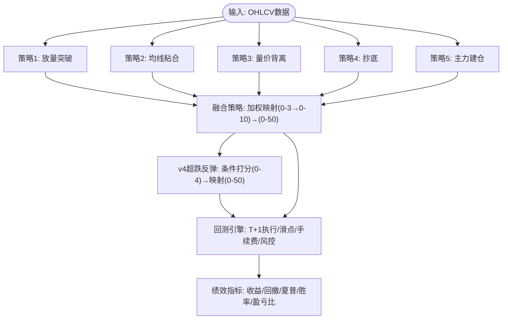
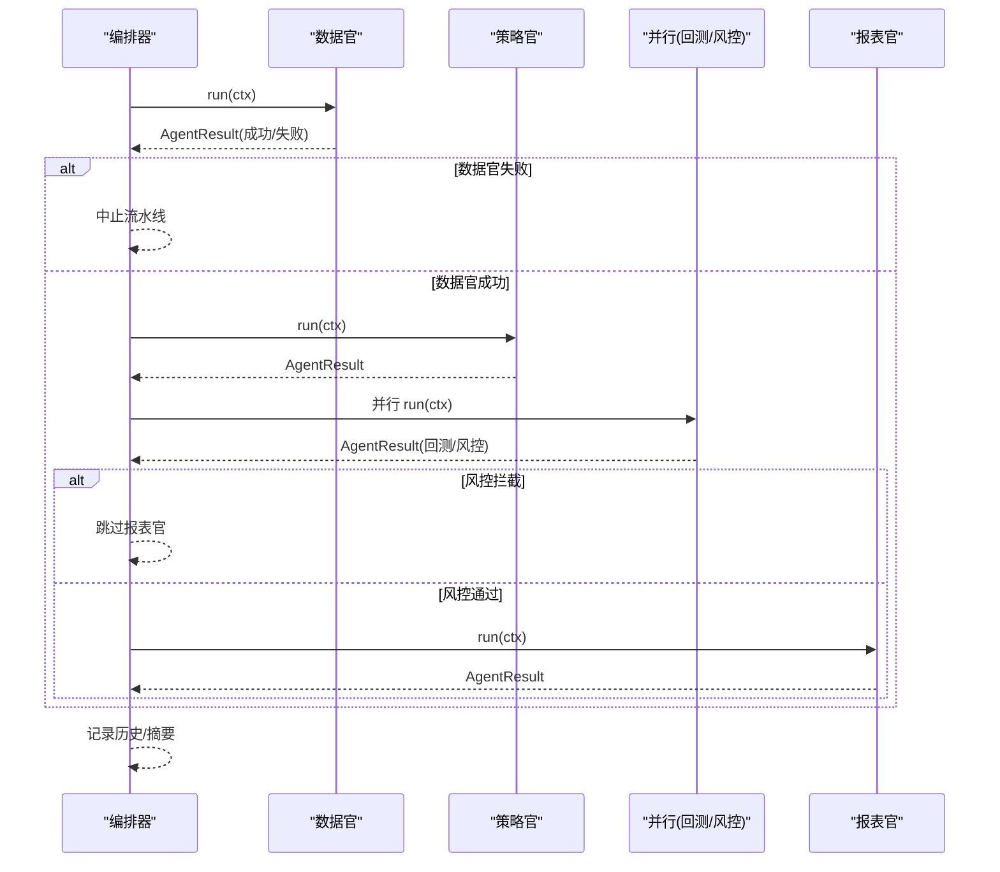
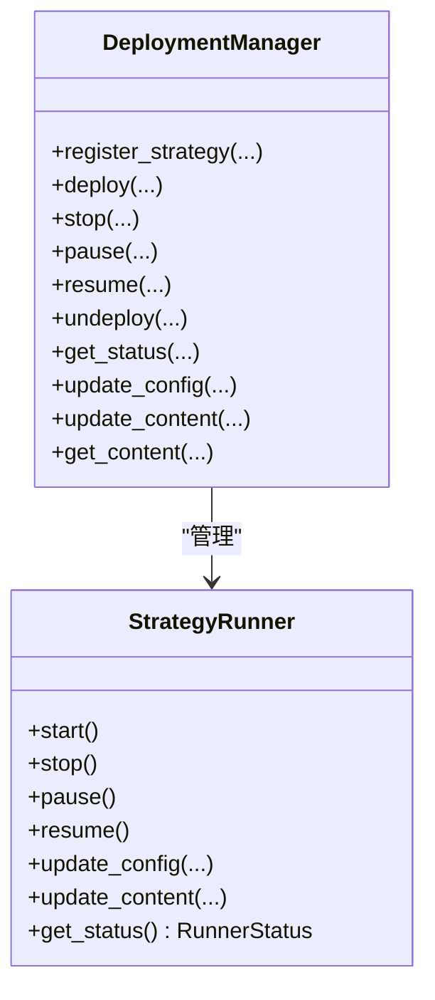
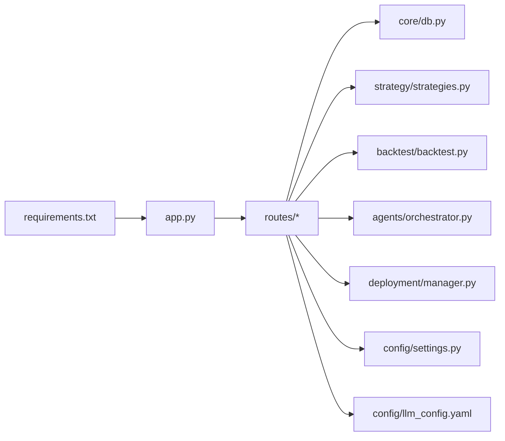

# 开发指南

<cite>
**本文引用的文件**
- [README.md](file://README.md)
- [app.py](file://app.py)
- [quant.py](file://quant.py)
- [requirements.txt](file://requirements.txt)
- [config/settings.py](file://config/settings.py)
- [strategy/strategies.py](file://strategy/strategies.py)
- [backtest/backtest.py](file://backtest/backtest.py)
- [routes/__init__.py](file://routes/__init__.py)
- [core/db.py](file://core/db.py)
- [agents/base.py](file://agents/base.py)
- [agents/orchestrator.py](file://agents/orchestrator.py)
- [deployment/manager.py](file://deployment/manager.py)
- [config/llm_config.yaml](file://config/llm_config.yaml)
- [tests/test_backtest_engine.py](file://tests/test_backtest_engine.py)
</cite>

## 目录
1. [简介](#简介)
2. [项目结构](#项目结构)
3. [核心组件](#核心组件)
4. [架构总览](#架构总览)
5. [详细组件分析](#详细组件分析)
6. [依赖分析](#依赖分析)
7. [性能考虑](#性能考虑)
8. [故障排查指南](#故障排查指南)
9. [结论](#结论)
10. [附录](#附录)

## 简介
本指南面向AIQuant项目的开发者，提供从环境搭建、代码规范、架构原则、新功能开发流程、测试策略、贡献流程、调试与性能分析，到扩展机制与部署的完整开发手册。项目采用Flask后端、SQLite本地数据库、Pandas/NumPy进行数据处理，并内置多策略选股与回测引擎，支持Agent流水线与策略部署管理。

## 项目结构
项目采用按功能域划分的模块化组织方式，主要目录与职责如下：
- app.py：Flask应用入口，注册蓝图与WebSocket路由，提供健康检查与静态资源服务
- routes/：按业务域划分的蓝图集合，统一对外API前缀
- core/：核心基础设施，数据库连接、迁移、数据同步与任务队列
- strategy/：多策略选股框架与融合策略
- backtest/：回测引擎与历史回测工具
- agents/：多Agent流水线编排与基础Agent抽象
- deployment/：策略部署管理器，支持注册、启动、暂停、恢复、注销与状态查询
- config/：配置管理（数据库路径、定时任务、LLM配置等）
- tests/：单元测试与回测引擎验证
- live/、ministries/、governance/、risk/、services/、utils/、scheduler/、tools/：业务与治理相关模块



图表来源
- [app.py:1-164](file://app.py#L1-L164)
- [routes/__init__.py:1-16](file://routes/__init__.py#L1-L16)
- [core/db.py:1-1213](file://core/db.py#L1-L1213)
- [strategy/strategies.py:1-431](file://strategy/strategies.py#L1-L431)
- [backtest/backtest.py:1-517](file://backtest/backtest.py#L1-L517)
- [agents/orchestrator.py:1-263](file://agents/orchestrator.py#L1-L263)
- [deployment/manager.py:1-216](file://deployment/manager.py#L1-L216)
- [config/settings.py:1-25](file://config/settings.py#L1-L25)
- [config/llm_config.yaml:1-23](file://config/llm_config.yaml#L1-L23)

章节来源
- [README.md:1-3](file://README.md#L1-L3)
- [app.py:1-164](file://app.py#L1-L164)
- [routes/__init__.py:1-16](file://routes/__init__.py#L1-L16)

## 核心组件
- Flask后端与API蓝图：集中注册系统、股票、回测、策略、信号、交易、账户、同步、代理、风控、策略配置、审计、治理、数据源、市场WS、评分、交易执行、报表、实盘、意图、任务、AI、Broker、LLM、部署等蓝图
- 数据库层：SQLite封装、建表/迁移、批量写入、查询与索引、策略评分更新、指数行情、风控事件与状态、黑名单、审计日志等
- 策略框架：五类技术策略（放量突破、均线粘合、量价背离、抄底、主力建仓）与融合策略，支持v4超跌反弹策略
- 回测引擎：T+1执行、止损止盈、滑点、手续费、动态仓位、大盘择时、回撤熔断、绩效指标计算
- Agent流水线：三省六部制编排（数据官→策略官→并行回测/风控→报表官），支持串行/并行、错误处理、状态持久化
- 部署管理：策略注册、部署、启停、暂停/恢复、状态查询、热更新配置与内容
- 配置中心：数据库路径、API主机端口、定时任务时间、同步批次、日志级别、LLM模型与参数

章节来源
- [app.py:9-72](file://app.py#L9-L72)
- [core/db.py:57-467](file://core/db.py#L57-L467)
- [strategy/strategies.py:36-431](file://strategy/strategies.py#L36-L431)
- [backtest/backtest.py:56-472](file://backtest/backtest.py#L56-L472)
- [agents/orchestrator.py:36-175](file://agents/orchestrator.py#L36-L175)
- [deployment/manager.py:24-152](file://deployment/manager.py#L24-L152)
- [config/settings.py:6-25](file://config/settings.py#L6-L25)
- [config/llm_config.yaml:1-23](file://config/llm_config.yaml#L1-L23)

## 架构总览
系统采用“后端API + 本地数据库 + 策略与回测 + Agent流水线 + 部署管理”的分层架构。API层负责请求接入与路由分发；核心层负责数据持久化与策略计算；流水线层负责跨Agent的编排与治理；部署层负责策略生命周期管理。



图表来源
- [app.py:9-72](file://app.py#L9-L72)
- [core/db.py:57-467](file://core/db.py#L57-L467)
- [strategy/strategies.py:36-431](file://strategy/strategies.py#L36-L431)
- [backtest/backtest.py:56-472](file://backtest/backtest.py#L56-L472)
- [agents/orchestrator.py:36-175](file://agents/orchestrator.py#L36-L175)
- [deployment/manager.py:24-152](file://deployment/manager.py#L24-L152)
- [config/settings.py:6-25](file://config/settings.py#L6-L25)
- [config/llm_config.yaml:1-23](file://config/llm_config.yaml#L1-L23)

## 详细组件分析

### 组件A：策略与回测（多策略与融合、T+1回测）
- 多策略：放量突破、均线粘合、量价背离、抄底、主力建仓，均输出BUY_SIGNAL/SELL_SIGNAL与BUY_SCORE列，便于回测引擎使用
- 融合策略：将各策略原始分映射到0-10后按权重加权，得到0-50融合分，作为综合评分
- v4超跌反弹：基于20日跌幅、站上MA5、温和放量、RSI区间、底部平台等条件，输出连续打分（0-4）并映射到0-50
- 回测引擎：支持T+1执行、滑点、手续费、止损止盈、动态仓位、大盘择时、回撤熔断、绩效指标计算



图表来源
- [strategy/strategies.py:36-431](file://strategy/strategies.py#L36-L431)
- [backtest/backtest.py:121-472](file://backtest/backtest.py#L121-L472)

章节来源
- [strategy/strategies.py:36-431](file://strategy/strategies.py#L36-L431)
- [backtest/backtest.py:56-472](file://backtest/backtest.py#L56-L472)

### 组件B：Agent流水线编排（三省六部制）
- 设计：数据官→策略官→并行回测/风控→报表官；门下省一票否决（风控拦截）
- 并行执行：门下省与尚书省并行，提高吞吐
- 上下文：AgentContext统一传递pipeline_id、run_date、共享数据与结果
- 状态持久化：执行摘要与历史记录，支持查询



图表来源
- [agents/orchestrator.py:81-175](file://agents/orchestrator.py#L81-L175)
- [agents/base.py:88-120](file://agents/base.py#L88-L120)

章节来源
- [agents/orchestrator.py:36-175](file://agents/orchestrator.py#L36-L175)
- [agents/base.py:20-120](file://agents/base.py#L20-L120)

### 组件C：策略部署管理器
- 能力：注册/部署/启停/暂停/恢复/注销、状态查询、热更新配置与内容、持久化部署记录
- Runner状态：registered/running/stopped/paused
- 与流水线解耦：支持独立运行策略与监控



图表来源
- [deployment/manager.py:24-152](file://deployment/manager.py#L24-L152)

章节来源
- [deployment/manager.py:24-216](file://deployment/manager.py#L24-L216)

### 组件D：数据库与数据访问
- 建表/迁移：stock_info、daily_price、index_daily、stock_signal、positions、trades、account_snapshots、风控与审计表等
- 批量写入：upsert_daily_price、upsert_index_daily、批量更新策略评分
- 查询：按日期范围查询、最新日期、股票数量、指数行情
- 索引：为高频查询建立索引，提升扫描与回测效率

```mermaid
erDiagram
STOCK_INFO {
text code PK
text name
text market
integer is_active
text updated_at
}
DAILY_PRICE {
integer id PK
text code
text trade_date
real open
real high
real low
real close
real volume
real amount
real pct_change
real turnover
real vol_score
real ma_score
real diverge_score
real bottom_score
real whale_score
real fusion_score
unique code trade_date
}
INDEX_DAILY {
integer id PK
text code
text trade_date
real open
real high
real low
real close
real volume
real amount
real pct_change
unique code trade_date
}
STOCK_SIGNAL {
integer id PK
text scan_date
text trade_date
text code
text name
real price
real fusion_score
real vol_score
real ma_score
real diverge_score
real bottom_score
real whale_score
text trigger_list
real buy_price
real stop_loss
real take_profit
integer buy_volume
real buy_money
integer sent_wechat
text created_at
}
POSITIONS {
integer id PK
text code
text name
text entry_date
real entry_price
integer shares
real current_price
real stop_loss
real take_profit
text position_type
text status
text strategy
text note
text created_at
text updated_at
real commission
}
TRADES {
integer id PK
integer position_id
text code
text name
text trade_date
text direction
real price
integer shares
real amount
real commission
real slippage
text reason
text note
text created_at
}
ACCOUNT_SNAPSHOTS {
integer id PK
text snapshot_date
real total_assets
real cash
real position_value
integer positions_count
real total_cost
real total_pnl
real pnl_pct
text created_at
}
STOCK_INFO ||--o{ DAILY_PRICE : "拥有"
DAILY_PRICE ||--o{ STOCK_SIGNAL : "产生信号"
POSITIONS ||--o{ TRADES : "产生交易"
```

图表来源
- [core/db.py:57-467](file://core/db.py#L57-L467)

章节来源
- [core/db.py:57-800](file://core/db.py#L57-L800)

### 组件E：API蓝图与路由组织
- 蓝图：system、stock、backtest、strategy、position、signal、trade、account、optimizer、sync、data_source、market_ws、governance、risk、strategy_config、audit、agents、reports、live、intent、tasks、ai、broker、llm、deployment等
- 统一前缀：/api/{domain}，便于扩展与维护

章节来源
- [routes/__init__.py:6-16](file://routes/__init__.py#L6-L16)
- [app.py:9-72](file://app.py#L9-L72)

## 依赖分析
- 运行时依赖：Flask、Flask-CORS、Flask-Sock、pandas、numpy、scikit-learn、joblib、requests、simple-websocket
- 项目内依赖：routes依赖core/db、strategy、backtest、agents、deployment等模块；agents依赖base抽象；deployment依赖runner；config提供设置与LLM配置



图表来源
- [requirements.txt:1-9](file://requirements.txt#L1-L9)
- [app.py:9-72](file://app.py#L9-L72)

章节来源
- [requirements.txt:1-9](file://requirements.txt#L1-L9)
- [app.py:9-72](file://app.py#L9-L72)

## 性能考虑
- 数据库：WAL模式、NORMAL同步、批量写入、索引优化（按code+date、date等），减少锁竞争
- 策略计算：Pandas向量化运算，避免Python循环；策略评分映射与融合在内存中完成
- 回测：T+1执行避免未来数据泄露；滑点与手续费按金额计算，最低收费约束；动态仓位基于ATR波动率
- Agent流水线：并行执行门下省与尚书省，缩短总耗时；串行阶段严格依赖，保证正确性
- 部署管理：Runner状态机与持久化记录，避免重复启动与丢失状态

[本节为通用性能建议，无需特定文件引用]

## 故障排查指南
- API健康检查：访问 /api/health 确认服务运行
- 路由调试：/api/debug/routes 查看已注册路由
- 数据库一致性：检查建表/迁移脚本与索引是否存在
- 回测异常：关注T+1执行、NaN处理、滑点与手续费计算
- Agent流水线：查看编排器历史记录与摘要，定位失败Agent
- 部署问题：确认策略ID唯一、Runner状态、部署记录文件存在

章节来源
- [app.py:124-145](file://app.py#L124-L145)
- [core/db.py:57-467](file://core/db.py#L57-L467)
- [tests/test_backtest_engine.py:19-130](file://tests/test_backtest_engine.py#L19-L130)
- [agents/orchestrator.py:67-76](file://agents/orchestrator.py#L67-L76)
- [deployment/manager.py:186-204](file://deployment/manager.py#L186-L204)

## 结论
AIQuant项目通过清晰的模块化架构、完善的策略与回测框架、可扩展的Agent流水线与部署管理，提供了从数据采集、策略计算、回测验证到实盘执行的全链路能力。遵循本文档的开发规范与流程，可高效推进新功能开发与迭代。

[本节为总结性内容，无需特定文件引用]

## 附录

### A. 开发环境搭建
- 安装依赖：pip install -r requirements.txt
- 初始化数据库：首次运行会自动建表与迁移
- 启动后端：python app.py 或使用 start.bat/start-bg.bat
- 访问健康检查：/api/health
- 访问仪表板：/dashboard 或 /
- 实时行情：WebSocket ws://localhost:5000/ws/market

章节来源
- [requirements.txt:1-9](file://requirements.txt#L1-L9)
- [app.py:148-164](file://app.py#L148-L164)

### B. 代码规范与最佳实践
- 命名约定
  - 模块：小写与下划线（如 strategy/strategies.py）
  - 类：大驼峰（如 Backtester、PipelineOrchestrator）
  - 函数/变量：小驼峰或下划线（如 get_daily_price、update_strategy_scores_batch）
  - 常量：全大写（如 SYNC_BATCH_SIZE）
- 代码风格
  - 使用类型注解（如 def func(df: pd.DataFrame) -> pd.DataFrame）
  - 避免魔法数字，使用常量或配置
  - 策略函数返回统一列集（close、volume、BUY_SIGNAL、SELL_SIGNAL、BUY_SCORE、STRATEGY）
  - 数据库操作使用上下文管理器与事务
- 架构原则
  - 单一职责：每个模块专注一个领域
  - 依赖倒置：蓝图依赖接口（如Strategy接口）、不依赖具体实现
  - 可测试性：策略与回测可独立单元测试
  - 可观测性：AgentResult记录耗时与错误，编排器记录摘要

章节来源
- [strategy/strategies.py:17-27](file://strategy/strategies.py#L17-L27)
- [core/db.py:26-40](file://core/db.py#L26-L40)
- [agents/base.py:20-36](file://agents/base.py#L20-L36)

### C. 新功能开发流程
- 需求分析：明确业务目标、数据来源、性能与风控要求
- 设计评审：策略设计（输入/输出列、阈值、边界）、回测指标、Agent编排、部署策略
- 编码实现：在对应模块新增策略/服务/Agent/路由，保持接口一致
- 测试验证：单元测试（策略/回测）、集成测试（API/Agent流水线）、端到端（仪表板/WS）
- 文档与发布：更新文档、提交PR、Code Review、合并与部署

[本节为流程性内容，无需特定文件引用]

### D. 测试策略与框架
- 单元测试：策略函数与回测核心逻辑（见 tests/test_backtest_engine.py）
- 集成测试：API路由、Agent流水线状态、部署管理器
- 端到端测试：仪表板页面、WebSocket行情、策略扫描与回测结果
- 关键验证点：T+1执行、NaN处理、手续费与滑点、信号溯源、风控拦截

章节来源
- [tests/test_backtest_engine.py:19-130](file://tests/test_backtest_engine.py#L19-L130)

### E. 贡献指南
- Git工作流：分支命名（feature/fix/docs）、提交信息（类型: 概述）
- Pull Request：关联Issue、描述变更、添加测试、Code Review
- 代码审查标准：可读性、性能、安全性、可维护性、测试覆盖率

[本节为通用流程，无需特定文件引用]

### F. 调试技巧与性能分析
- 调试技巧
  - 使用 /api/debug/routes 查看路由
  - 在Agent中打印耗时与错误堆栈
  - 回测中启用详细日志，核对T+1执行与信号溯源
- 性能分析
  - 使用pandas性能分析工具（如eval/numexpr）
  - 回测中关注滑点与手续费占比
  - 数据库批量写入与索引优化

[本节为通用技巧，无需特定文件引用]

### G. 扩展机制与插件开发
- 策略扩展：新增策略函数，遵循统一返回列；在融合策略中增加权重
- Agent扩展：继承BaseAgent，实现_run_execute，使用AgentContext共享数据
- 蓝图扩展：在routes/__init__.py注册蓝图，编写路由处理函数
- 部署扩展：通过DeploymentManager注册与部署新策略Runner

章节来源
- [agents/base.py:88-120](file://agents/base.py#L88-L120)
- [routes/__init__.py:6-16](file://routes/__init__.py#L6-L16)
- [deployment/manager.py:32-66](file://deployment/manager.py#L32-L66)

### H. 持续集成、自动化测试与部署
- CI建议：安装依赖、运行单元测试、静态检查（如pylint/autoflake）、覆盖率收集
- 自动化测试：pytest或unittest，覆盖策略、回测、Agent、API
- 部署：Docker镜像（基于requirements.txt）、环境变量（LLM配置）、持久化卷（数据库与部署记录）

[本节为通用流程建议，无需特定文件引用]

### I. 常见问题与解决方案
- 数据库锁与性能：使用WAL模式与批量写入；合理索引
- 回测未来数据泄露：严格T+1执行；检查OPEN列
- Agent失败：查看AgentResult.error与编排器摘要
- 部署失败：确认Runner状态与部署记录文件

章节来源
- [core/db.py:26-40](file://core/db.py#L26-L40)
- [backtest/backtest.py:121-131](file://backtest/backtest.py#L121-L131)
- [agents/orchestrator.py:67-76](file://agents/orchestrator.py#L67-L76)
- [deployment/manager.py:186-204](file://deployment/manager.py#L186-L204)

### J. 快速上手
- 克隆仓库，安装依赖，启动后端
- 访问 /api/health 确认服务
- 访问 /dashboard 查看仪表板
- 查看 /api/debug/routes 了解API
- 修改策略/Agent/路由后重启服务生效

章节来源
- [requirements.txt:1-9](file://requirements.txt#L1-L9)
- [app.py:148-164](file://app.py#L148-L164)
- [app.py:124-128](file://app.py#L124-L128)