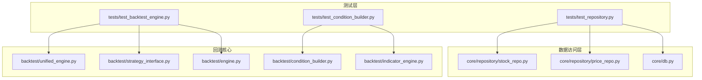
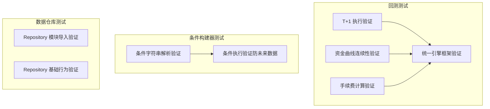
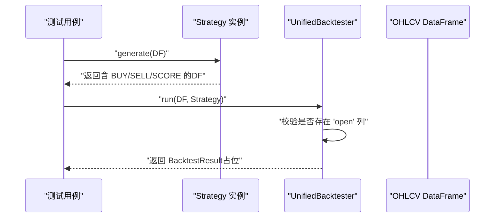
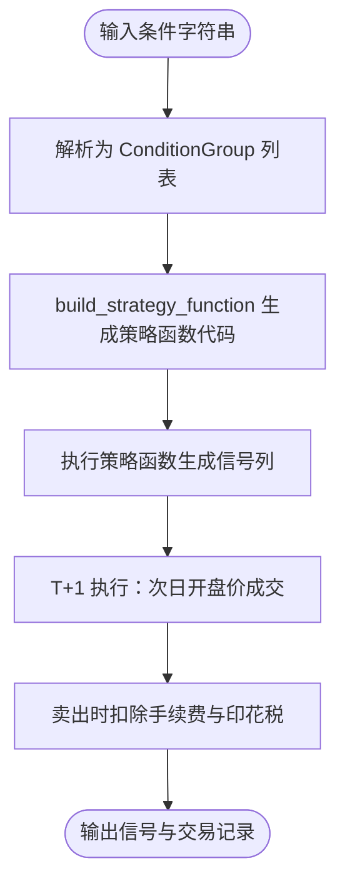
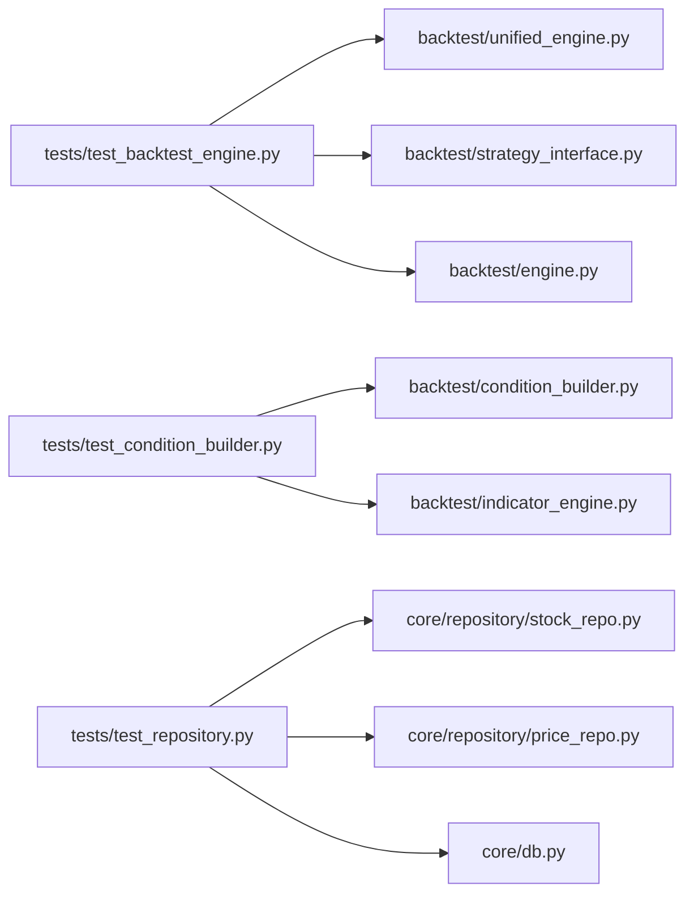

# 单元测试

<cite>
**本文档引用的文件**
- [tests/test_backtest_engine.py](file://tests/test_backtest_engine.py)
- [tests/test_condition_builder.py](file://tests/test_condition_builder.py)
- [tests/test_repository.py](file://tests/test_repository.py)
- [backtest/unified_engine.py](file://backtest/unified_engine.py)
- [backtest/strategy_interface.py](file://backtest/strategy_interface.py)
- [backtest/condition_builder.py](file://backtest/condition_builder.py)
- [backtest/indicator_engine.py](file://backtest/indicator_engine.py)
- [core/repository/stock_repo.py](file://core/repository/stock_repo.py)
- [core/repository/price_repo.py](file://core/repository/price_repo.py)
- [core/db.py](file://core/db.py)
- [backtest/engine.py](file://backtest/engine.py)
- [backtest/archive/test_backtest_bt.py](file://backtest/archive/test_backtest_bt.py)
</cite>

## 目录
1. [简介](#简介)
2. [项目结构](#项目结构)
3. [核心组件](#核心组件)
4. [架构总览](#架构总览)
5. [详细组件分析](#详细组件分析)
6. [依赖分析](#依赖分析)
7. [性能考虑](#性能考虑)
8. [故障排查指南](#故障排查指南)
9. [结论](#结论)
10. [附录](#附录)

## 简介
本文件面向AIQuant项目的单元测试实践，聚焦三大核心模块的测试设计与实施：
- 回测引擎测试：验证T+1执行、资金曲线连续性、手续费与滑点、统一引擎框架等关键逻辑。
- 条件构建器测试：验证条件字符串解析、条件执行（防未来数据泄露）、卖出扣费等。
- 数据仓库测试：验证Repository模块的可导入性、函数签名与基础行为。

测试设计遵循“边界值+异常+正常流程”的三段式原则，结合unittest断言与Mock策略，确保测试独立性与可重复性，并给出测试覆盖率与质量指标建议。

## 项目结构
围绕测试目标，涉及的主要目录与文件如下：
- tests：单元测试入口与用例
- backtest：回测与条件构建相关模块
- core/repository：数据访问层（按表拆分）
- core/db：SQLite数据库兼容层

图表来源
- [tests/test_backtest_engine.py:1-130](file://tests/test_backtest_engine.py#L1-L130)
- [tests/test_condition_builder.py:1-68](file://tests/test_condition_builder.py#L1-L68)
- [tests/test_repository.py:1-86](file://tests/test_repository.py#L1-L86)
- [backtest/unified_engine.py:1-143](file://backtest/unified_engine.py#L1-L143)
- [backtest/strategy_interface.py:1-86](file://backtest/strategy_interface.py#L1-L86)
- [backtest/condition_builder.py:1-717](file://backtest/condition_builder.py#L1-L717)
- [backtest/indicator_engine.py:1-433](file://backtest/indicator_engine.py#L1-L433)
- [backtest/engine.py:1-174](file://backtest/engine.py#L1-L174)
- [core/repository/stock_repo.py:1-80](file://core/repository/stock_repo.py#L1-L80)
- [core/repository/price_repo.py:1-237](file://core/repository/price_repo.py#L1-L237)
- [core/db.py:1-1213](file://core/db.py#L1-L1213)

章节来源
- [tests/test_backtest_engine.py:1-130](file://tests/test_backtest_engine.py#L1-L130)
- [tests/test_condition_builder.py:1-68](file://tests/test_condition_builder.py#L1-L68)
- [tests/test_repository.py:1-86](file://tests/test_repository.py#L1-L86)

## 核心组件
- 回测引擎（UnifiedBacktester）：统一资金曲线、手续费、滑点、止损止盈、回撤熔断等逻辑的插件化引擎，负责对单/多策略运行回测。
- 条件构建器（ConditionBuilder）：将用户构建的条件字符串解析为可执行的过滤函数，支持ALL_N/ANY_N/STAT_N/POINT等条件类型与AND/OR组合。
- 数据仓库（Repository）：按表拆分的数据访问层，提供stock_info/daily_price等表的CRUD能力，兼容core.db的函数签名。

章节来源
- [backtest/unified_engine.py:59-143](file://backtest/unified_engine.py#L59-L143)
- [backtest/condition_builder.py:690-717](file://backtest/condition_builder.py#L690-L717)
- [core/repository/stock_repo.py:13-80](file://core/repository/stock_repo.py#L13-L80)
- [core/repository/price_repo.py:13-237](file://core/repository/price_repo.py#L13-L237)

## 架构总览
回测与条件构建的测试关注点如下：
- 回测引擎：T+1执行、资金曲线延续估值、手续费与滑点、统一引擎框架导入与适配器包装。
- 条件构建器：条件字符串解析、执行日与信号日分离、卖出扣费。
- 数据仓库：模块可导入性、函数签名、基础行为（如get_stock_name回退逻辑）。

图表来源
- [tests/test_backtest_engine.py:19-126](file://tests/test_backtest_engine.py#L19-L126)
- [tests/test_condition_builder.py:16-64](file://tests/test_condition_builder.py#L16-L64)
- [tests/test_repository.py:11-82](file://tests/test_repository.py#L11-L82)

## 详细组件分析

### 回测引擎测试
- T+1执行验证：断言买入信号触发日次日开盘价成交，而非当日收盘价；滑点应用于次日开盘价。
- 资金曲线连续性验证：无数据日使用最近可用收盘价延续估值；NaN与0的判定使用pd.isna()。
- 手续费计算验证：双向万3、卖出单向千1印花税的合计费用断言。
- 统一引擎框架验证：确认UnifiedBacktester与Strategy接口可导入；FuncStrategy适配器能包装现有函数并生成SCORE列。

图表来源
- [tests/test_backtest_engine.py:94-126](file://tests/test_backtest_engine.py#L94-L126)
- [backtest/unified_engine.py:108-132](file://backtest/unified_engine.py#L108-L132)
- [backtest/strategy_interface.py:23-57](file://backtest/strategy_interface.py#L23-L57)

章节来源
- [tests/test_backtest_engine.py:19-126](file://tests/test_backtest_engine.py#L19-L126)
- [backtest/unified_engine.py:59-143](file://backtest/unified_engine.py#L59-L143)
- [backtest/strategy_interface.py:60-86](file://backtest/strategy_interface.py#L60-L86)

### 条件构建器测试
- 条件字符串解析：parse_condition_str函数可导入；对“近X日跌幅>Y%”等模式进行解析，无法解析时降级验证函数存在。
- 条件执行：信号日与执行日分离（T+1），卖出时扣除手续费与印花税。

图表来源
- [tests/test_condition_builder.py:16-64](file://tests/test_condition_builder.py#L16-L64)
- [backtest/condition_builder.py:690-717](file://backtest/condition_builder.py#L690-L717)
- [backtest/condition_builder.py:167-217](file://backtest/condition_builder.py#L167-L217)

章节来源
- [tests/test_condition_builder.py:16-64](file://tests/test_condition_builder.py#L16-L64)
- [backtest/condition_builder.py:1-717](file://backtest/condition_builder.py#L1-L717)

### 数据仓库测试
- 模块导入验证：覆盖stock_repo、price_repo、signal_repo、position_repo、trade_repo、sync_repo及core.db兼容层。
- 基础行为验证：get_stock_name对不存在代码回退为代码本身；has_today_data参数签名正确。

章节来源
- [tests/test_repository.py:11-82](file://tests/test_repository.py#L11-L82)
- [core/repository/stock_repo.py:73-80](file://core/repository/stock_repo.py#L73-L80)
- [core/repository/price_repo.py:220-227](file://core/repository/price_repo.py#L220-L227)

## 依赖分析
- 回测引擎依赖IndicatorRegistry与策略接口，条件构建器依赖IndicatorRegistry与eval_condition，数据仓库依赖core.db连接管理。
- 测试文件通过相对导入路径访问被测模块，确保与生产代码一致的调用方式。

图表来源
- [tests/test_backtest_engine.py:10-16](file://tests/test_backtest_engine.py#L10-L16)
- [tests/test_condition_builder.py:8-13](file://tests/test_condition_builder.py#L8-L13)
- [tests/test_repository.py:4-8](file://tests/test_repository.py#L4-L8)

章节来源
- [tests/test_backtest_engine.py:10-16](file://tests/test_backtest_engine.py#L10-L16)
- [tests/test_condition_builder.py:8-13](file://tests/test_condition_builder.py#L8-L13)
- [tests/test_repository.py:4-8](file://tests/test_repository.py#L4-L8)

## 性能考虑
- 测试数据规模控制：使用短周期OHLCV数据（如5日）验证T+1与滑点逻辑，避免长序列带来的计算开销。
- 断言粒度：优先使用精确断言（如金额、比例）与边界断言（NaN/0判定），减少模糊断言导致的误判。
- Mock策略：对复杂策略生成函数（如策略评分融合）使用轻量Mock，仅保证返回含必要列的DataFrame，避免真实计算。

## 故障排查指南
- T+1执行异常：检查信号日与执行日索引偏移，确保使用次日开盘价而非当日收盘价。
- NaN处理错误：使用pd.isna()替代布尔判断，避免np.nan被视为truthy。
- 手续费与滑点：核对买入/卖出双向手续费与卖出印花税设置，确保合计费用断言通过。
- 条件解析失败：当解析器不支持特定格式时，降级验证parse_condition_str函数存在；检查条件字符串格式与别名映射。
- 数据仓库断言：若get_stock_name未返回预期回退值，检查函数签名与参数列表。

章节来源
- [tests/test_backtest_engine.py:64-73](file://tests/test_backtest_engine.py#L64-L73)
- [tests/test_condition_builder.py:24-35](file://tests/test_condition_builder.py#L24-L35)
- [tests/test_repository.py:66-82](file://tests/test_repository.py#L66-L82)

## 结论
通过对回测引擎、条件构建器与数据仓库的系统化测试，能够有效保障核心逻辑的正确性与稳定性。建议在CI中引入覆盖率统计与质量门禁，确保新增功能与重构不会破坏既有断言。

## 附录

### 测试用例设计原则
- 边界值测试：如NaN与0的处理、T+1执行日切换、滑点极小值。
- 异常情况测试：条件字符串解析失败、数据库连接异常、策略函数返回列缺失。
- 正常流程测试：信号生成、T+1执行、手续费与滑点、统一引擎框架导入与适配器包装。

### Mock对象使用场景与实现
- 场景一：策略函数式包装（FuncStrategy）仅需返回含BUY/SELL/SCORE列的DataFrame，Mock策略函数以最小代价验证适配器行为。
- 场景二：数据库连接（core.db.get_conn）在测试中可Mock为内存连接或上下文管理器，避免真实SQLite写入。
- 场景三：外部数据源（如akshare）在条件构建器解析阶段可Mock为静态返回值，验证解析逻辑与执行分支。

### 测试数据准备与清理策略
- 准备：使用pandas构造短期OHLCV数据，确保open/high/low/close/volume列齐全；为信号列与SCORE列赋值。
- 清理：测试结束后不依赖持久化数据；如需临时文件（如对比结果），在测试目录下生成并在完成后删除。

### 测试覆盖率与质量指标
- 覆盖率计算：使用覆盖率工具（如pytest-cov）统计行/分支/函数/类覆盖率，目标行覆盖率≥80%、函数覆盖率≥90%。
- 质量指标：断言通过率、回归用例占比、冒烟测试失败次数、关键路径断言命中率。