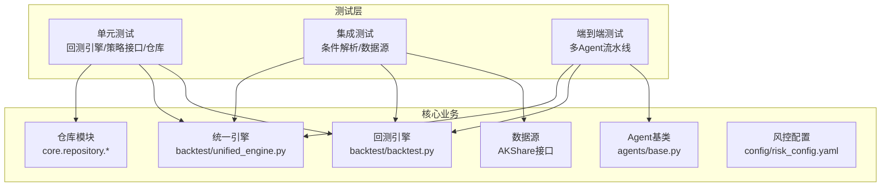
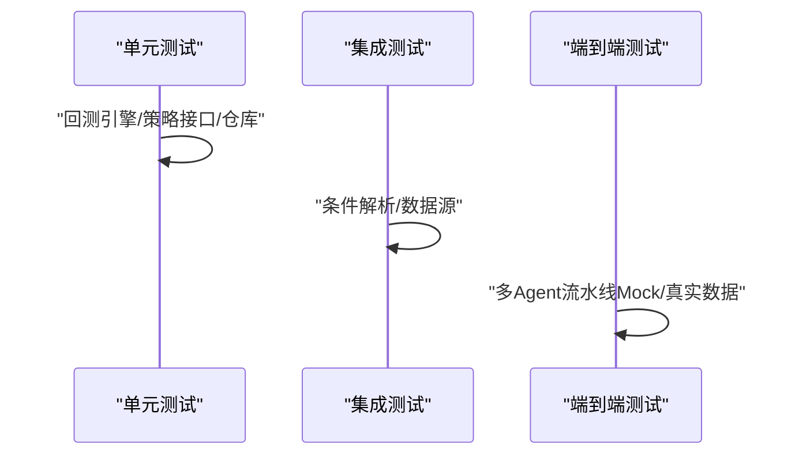
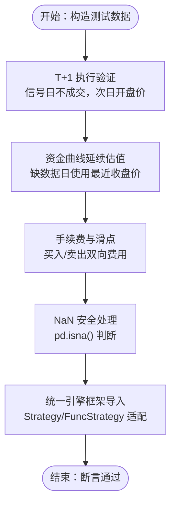
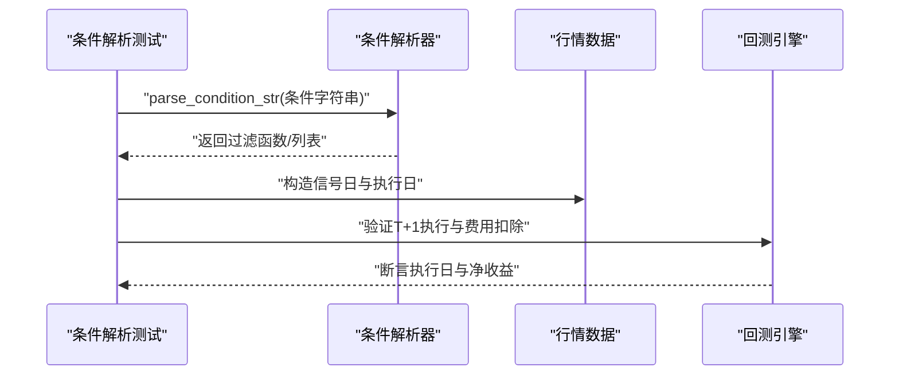
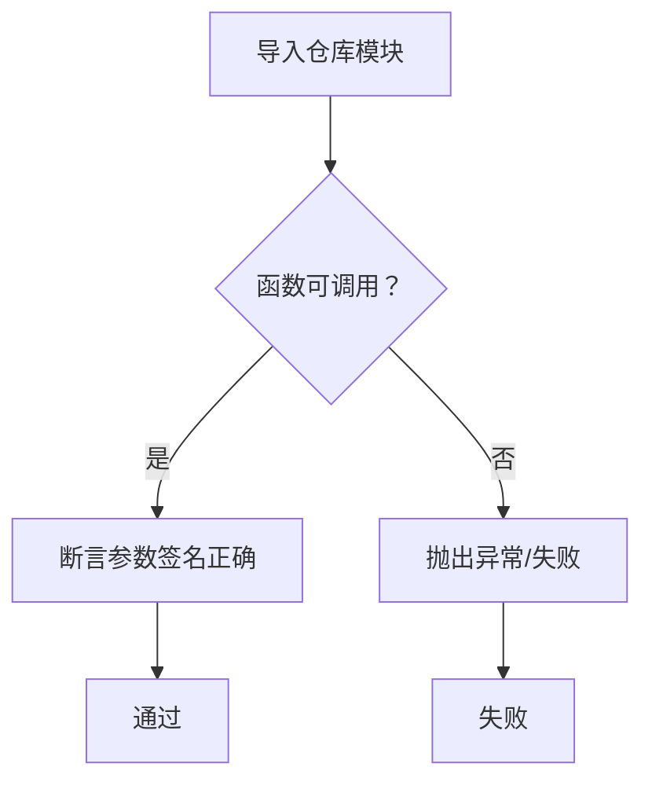
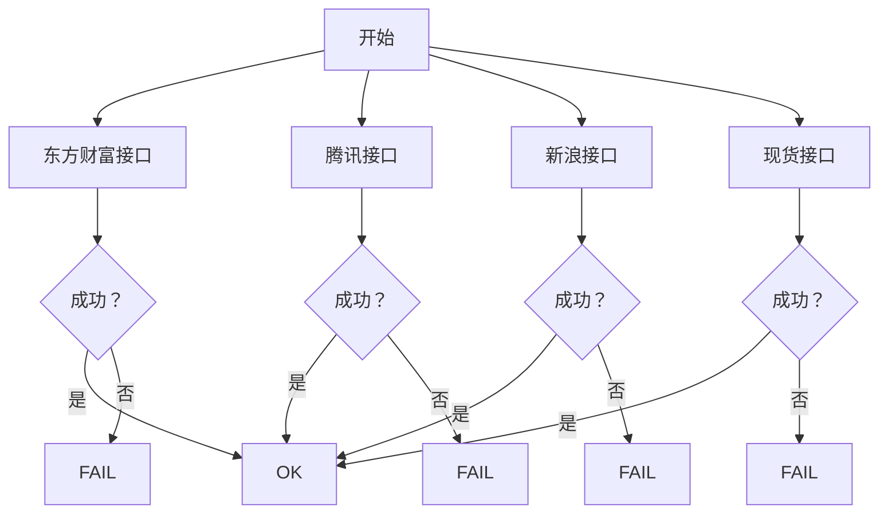
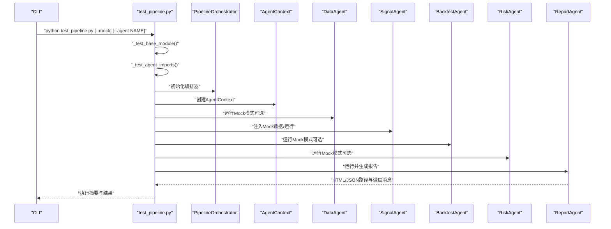
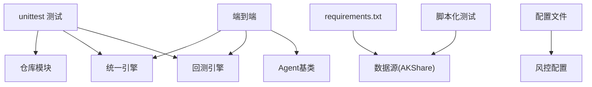

# 测试策略

<cite>
**本文引用的文件**
- [tests/test_backtest_engine.py](file://tests/test_backtest_engine.py)
- [tests/test_condition_builder.py](file://tests/test_condition_builder.py)
- [tests/test_repository.py](file://tests/test_repository.py)
- [tests/test_data_source.py](file://tests/test_data_source.py)
- [tests/test_alt_sources.py](file://tests/test_alt_sources.py)
- [tests/debug_sources.py](file://tests/debug_sources.py)
- [test_pipeline.py](file://test_pipeline.py)
- [backtest/backtest.py](file://backtest/backtest.py)
- [backtest/unified_engine.py](file://backtest/unified_engine.py)
- [agents/base.py](file://agents/base.py)
- [config/risk_config.yaml](file://config/risk_config.yaml)
- [config/llm_config.yaml](file://config/llm_config.yaml)
- [requirements.txt](file://requirements.txt)
</cite>

## 目录
1. [引言](#引言)
2. [项目结构](#项目结构)
3. [核心组件](#核心组件)
4. [架构总览](#架构总览)
5. [详细组件分析](#详细组件分析)
6. [依赖分析](#依赖分析)
7. [性能考量](#性能考量)
8. [故障排查指南](#故障排查指南)
9. [结论](#结论)
10. [附录](#附录)

## 引言
本测试策略文档面向AIQuant项目，围绕测试金字塔（单元测试、集成测试、端到端测试）构建系统化的测试方法论，明确测试框架选择与使用要点，给出量化交易特有的测试方法（回测引擎、策略、风控、数据质量），并提供Mock对象与测试数据准备、覆盖率与质量指标、持续集成自动化、性能与压力测试以及测试环境与数据管理最佳实践。

## 项目结构
AIQuant采用“按领域/功能分层”的组织方式，测试相关主要分布在tests目录与核心业务模块（backtest、agents、core.repository、risk等）。测试文件覆盖：
- 回测引擎与策略接口：验证T+1执行、资金曲线延续估值、手续费与滑点、统一引擎框架导入与适配
- 条件扫描与解析：验证条件字符串解析、T+1执行与费用扣除
- Repository模块：验证导入与基础行为（如参数签名）
- 数据源：验证AKShare接口可用性与替代方案
- 端到端流水线：多Agent协作的Mock与真实数据测试

图表来源
- [tests/test_backtest_engine.py:1-130](file://tests/test_backtest_engine.py#L1-L130)
- [tests/test_condition_builder.py:1-68](file://tests/test_condition_builder.py#L1-L68)
- [tests/test_repository.py:1-86](file://tests/test_repository.py#L1-L86)
- [tests/test_data_source.py:1-35](file://tests/test_data_source.py#L1-L35)
- [backtest/backtest.py:1-517](file://backtest/backtest.py#L1-L517)
- [backtest/unified_engine.py:1-143](file://backtest/unified_engine.py#L1-L143)
- [agents/base.py:1-120](file://agents/base.py#L1-L120)
- [config/risk_config.yaml:1-170](file://config/risk_config.yaml#L1-L170)

章节来源
- [tests/test_backtest_engine.py:1-130](file://tests/test_backtest_engine.py#L1-L130)
- [tests/test_condition_builder.py:1-68](file://tests/test_condition_builder.py#L1-L68)
- [tests/test_repository.py:1-86](file://tests/test_repository.py#L1-L86)
- [tests/test_data_source.py:1-35](file://tests/test_data_source.py#L1-L35)
- [test_pipeline.py:1-392](file://test_pipeline.py#L1-L392)
- [backtest/backtest.py:1-517](file://backtest/backtest.py#L1-L517)
- [backtest/unified_engine.py:1-143](file://backtest/unified_engine.py#L1-L143)
- [agents/base.py:1-120](file://agents/base.py#L1-L120)
- [config/risk_config.yaml:1-170](file://config/risk_config.yaml#L1-L170)

## 核心组件
- 回测引擎：提供T+1执行、滑点、手续费、止损止盈、风控熔断、动态仓位等机制，并计算收益、回撤、夏普比率等指标
- 统一引擎：策略插件化框架，接收Strategy实例，统一处理交易执行与资金曲线
- Agent流水线：以AgentContext为上下文，串联DataAgent、SignalAgent、BacktestAgent、RiskAgent、ReportAgent
- Repository模块：封装数据访问与兼容层，保证导入与基础行为稳定
- 风控配置：集中定义风控阈值与提示信息，支持热加载

章节来源
- [backtest/backtest.py:56-495](file://backtest/backtest.py#L56-L495)
- [backtest/unified_engine.py:59-143](file://backtest/unified_engine.py#L59-L143)
- [agents/base.py:38-120](file://agents/base.py#L38-L120)
- [tests/test_repository.py:11-86](file://tests/test_repository.py#L11-L86)
- [config/risk_config.yaml:1-170](file://config/risk_config.yaml#L1-L170)

## 架构总览
测试金字塔在AIQuant中的应用：
- 单元测试：针对回测引擎、策略接口、仓库模块进行最小粒度验证，确保核心算法与接口契约稳定
- 集成测试：验证条件解析、数据源可用性、统一引擎框架导入与适配
- 端到端测试：多Agent流水线（Mock与真实数据），覆盖从数据采集到报告输出的完整链路

图表来源
- [tests/test_backtest_engine.py:1-130](file://tests/test_backtest_engine.py#L1-L130)
- [tests/test_condition_builder.py:1-68](file://tests/test_condition_builder.py#L1-L68)
- [tests/test_data_source.py:1-35](file://tests/test_data_source.py#L1-L35)
- [test_pipeline.py:1-392](file://test_pipeline.py#L1-L392)

## 详细组件分析

### 回测引擎测试
- 关注点：T+1执行（信号日不成交，次日开盘价）、资金曲线延续估值（缺数据日使用最近收盘价）、手续费与滑点计算、NaN安全处理、统一引擎框架导入与适配
- 测试方法：使用unittest，构造DataFrame模拟行情与信号，断言关键字段与数值精度
- 适用场景：单元测试，验证核心回测逻辑与接口契约

图表来源
- [tests/test_backtest_engine.py:19-126](file://tests/test_backtest_engine.py#L19-L126)
- [backtest/backtest.py:121-409](file://backtest/backtest.py#L121-L409)
- [backtest/unified_engine.py:108-132](file://backtest/unified_engine.py#L108-L132)

章节来源
- [tests/test_backtest_engine.py:1-130](file://tests/test_backtest_engine.py#L1-L130)
- [backtest/backtest.py:56-495](file://backtest/backtest.py#L56-L495)
- [backtest/unified_engine.py:59-143](file://backtest/unified_engine.py#L59-L143)

### 条件扫描与解析测试
- 关注点：条件字符串解析为可执行过滤函数、T+1执行防止未来数据泄露、卖出时扣除手续费与印花税
- 测试方法：unittest，构造DataFrame与条件字符串，断言过滤结果与执行日期一致性

图表来源
- [tests/test_condition_builder.py:16-64](file://tests/test_condition_builder.py#L16-L64)
- [backtest/backtest.py:121-303](file://backtest/backtest.py#L121-L303)

章节来源
- [tests/test_condition_builder.py:1-68](file://tests/test_condition_builder.py#L1-L68)
- [backtest/backtest.py:121-303](file://backtest/backtest.py#L121-L303)

### Repository模块测试
- 关注点：模块可导入性、函数签名正确性（如get_stock_name、has_today_data）
- 测试方法：unittest，导入目标函数并断言可调用与参数签名

图表来源
- [tests/test_repository.py:11-86](file://tests/test_repository.py#L11-L86)

章节来源
- [tests/test_repository.py:1-86](file://tests/test_repository.py#L1-L86)

### 数据源测试
- 关注点：AKShare接口稳定性与替代方案（腾讯、新浪、现货）
- 测试方法：脚本化打印结果，定位网络/接口异常；debug_sources用于单接口快速诊断

图表来源
- [tests/test_data_source.py:1-35](file://tests/test_data_source.py#L1-L35)
- [tests/test_alt_sources.py:1-42](file://tests/test_alt_sources.py#L1-L42)
- [tests/debug_sources.py:1-54](file://tests/debug_sources.py#L1-L54)

章节来源
- [tests/test_data_source.py:1-35](file://tests/test_data_source.py#L1-L35)
- [tests/test_alt_sources.py:1-42](file://tests/test_alt_sources.py#L1-L42)
- [tests/debug_sources.py:1-54](file://tests/debug_sources.py#L1-L54)

### 端到端流水线测试
- 关注点：基础模块导入、Agent导入状态、编排器状态管理、Mock流水线、真实数据流水线
- 测试方法：test_pipeline.py，支持--mock与--agent参数，自动跳过不可用Agent，输出报告路径与微信消息预览

图表来源
- [test_pipeline.py:20-392](file://test_pipeline.py#L20-L392)
- [agents/base.py:38-120](file://agents/base.py#L38-L120)

章节来源
- [test_pipeline.py:1-392](file://test_pipeline.py#L1-L392)
- [agents/base.py:1-120](file://agents/base.py#L1-L120)

## 依赖分析
- 测试框架：unittest为主，部分脚本化测试（如数据源测试）
- 外部依赖：pandas、numpy、AKShare等
- 内部依赖：回测引擎、统一引擎、Agent基类、仓库模块、风控配置

图表来源
- [requirements.txt:1-9](file://requirements.txt#L1-L9)
- [config/risk_config.yaml:1-170](file://config/risk_config.yaml#L1-L170)
- [backtest/backtest.py:1-517](file://backtest/backtest.py#L1-L517)
- [backtest/unified_engine.py:1-143](file://backtest/unified_engine.py#L1-L143)
- [agents/base.py:1-120](file://agents/base.py#L1-L120)
- [tests/test_data_source.py:1-35](file://tests/test_data_source.py#L1-L35)

章节来源
- [requirements.txt:1-9](file://requirements.txt#L1-L9)
- [config/risk_config.yaml:1-170](file://config/risk_config.yaml#L1-L170)
- [backtest/backtest.py:1-517](file://backtest/backtest.py#L1-L517)
- [backtest/unified_engine.py:1-143](file://backtest/unified_engine.py#L1-L143)
- [agents/base.py:1-120](file://agents/base.py#L1-L120)
- [tests/test_data_source.py:1-35](file://tests/test_data_source.py#L1-L35)

## 性能考量
- 单元测试：优先使用小规模DataFrame与精简数据，避免I/O与外部依赖
- 集成测试：对数据源接口进行超时与重试策略验证，避免阻塞
- 端到端测试：通过--mock模式减少真实数据依赖，必要时对Agent执行时间进行断言
- 回测性能：统一引擎与回测引擎应避免不必要的列计算与循环，使用向量化与缓存（如ATR、均线）

## 故障排查指南
- 数据源问题：使用debug_sources.py逐接口验证，关注网络/代理/服务器限速
- Agent导入失败：test_pipeline.py会自动跳过缺失外部依赖的Agent并输出提示
- 回测异常：检查T+1执行、open列是否存在、NaN处理、手续费与滑点参数
- 风控配置：核对risk_config.yaml阈值与提示信息，确保热加载生效

章节来源
- [tests/debug_sources.py:1-54](file://tests/debug_sources.py#L1-L54)
- [test_pipeline.py:44-96](file://test_pipeline.py#L44-L96)
- [backtest/backtest.py:121-131](file://backtest/backtest.py#L121-L131)
- [config/risk_config.yaml:1-170](file://config/risk_config.yaml#L1-L170)

## 结论
AIQuant的测试策略以unittest为核心，结合脚本化与端到端流水线测试，覆盖回测引擎、策略接口、仓库模块、数据源与Agent流水线。通过Mock与真实数据双通道测试，保障量化交易关键逻辑的正确性与鲁棒性。建议在CI中引入覆盖率与性能回归检查，持续完善测试体系。

## 附录

### 测试框架选择与使用
- unittest：适用于单元测试与集成测试，断言清晰、生态成熟
- pytest：可选增强（夹具、参数化、插件），适合复杂场景扩展
- 脚本化测试：用于数据源可用性与替代方案验证

章节来源
- [tests/test_backtest_engine.py:10-15](file://tests/test_backtest_engine.py#L10-L15)
- [tests/test_condition_builder.py:8-13](file://tests/test_condition_builder.py#L8-L13)
- [tests/test_data_source.py:1-5](file://tests/test_data_source.py#L1-L5)

### 测试用例设计原则
- 边界值分析：T+1执行边界（信号日/执行日）、最大回撤阈值、连续亏损次数
- 等价类划分：不同策略评分列、不同市场状态（多头/空头）、不同持仓状态（空仓/持仓）
- 错误推测法：NaN处理、缺失open列、未来数据泄露、风控熔断触发

章节来源
- [tests/test_backtest_engine.py:4-9](file://tests/test_backtest_engine.py#L4-L9)
- [tests/test_condition_builder.py:4-7](file://tests/test_condition_builder.py#L4-L7)
- [backtest/backtest.py:121-131](file://backtest/backtest.py#L121-L131)

### 量化交易特有测试方法
- 回测引擎测试：T+1执行、滑点与手续费、风控熔断、动态仓位、指标计算
- 策略测试：策略接口适配（FuncStrategy）、信号溯源、评分列识别
- 风控测试：阈值断言、提示信息与建议文本、热加载验证
- 数据质量测试：缺失值处理、列存在性校验、数据类型与范围校验

章节来源
- [backtest/backtest.py:56-495](file://backtest/backtest.py#L56-L495)
- [backtest/unified_engine.py:108-132](file://backtest/unified_engine.py#L108-L132)
- [config/risk_config.yaml:1-170](file://config/risk_config.yaml#L1-L170)

### Mock对象与测试数据准备
- Mock对象：test_pipeline.py中通过AgentContext注入Mock候选数据与回测结果
- 测试数据：使用pandas构造小型DataFrame，覆盖信号触发、T+1执行、费用扣除等场景
- 外部依赖：对不可用Agent进行条件跳过，保证流水线测试可运行

章节来源
- [test_pipeline.py:119-246](file://test_pipeline.py#L119-L246)
- [tests/test_backtest_engine.py:22-41](file://tests/test_backtest_engine.py#L22-L41)

### 覆盖率与质量指标
- 覆盖率：建议对回测引擎与策略接口达到较高覆盖率（>80%）
- 质量指标：断言关键字段（open/close/volume/信号列）、数值精度（小数位）、异常路径

章节来源
- [tests/test_backtest_engine.py:78-91](file://tests/test_backtest_engine.py#L78-L91)
- [tests/test_condition_builder.py:57-63](file://tests/test_condition_builder.py#L57-L63)

### 持续集成中的测试自动化
- 建议在CI中执行：
  - 单元测试：回测引擎与策略接口
  - 集成测试：条件解析与数据源可用性
  - 端到端测试：多Agent流水线（Mock模式）
- 可选：对Agent执行耗时进行阈值断言，对报告生成进行存在性与大小检查

章节来源
- [test_pipeline.py:348-392](file://test_pipeline.py#L348-L392)

### 性能测试与压力测试
- 性能测试：对回测引擎进行大数据量（多股票/多策略）运行时间断言
- 压力测试：模拟高并发Agent调用、风控规则热加载、数据源限流场景

章节来源
- [backtest/backtest.py:121-409](file://backtest/backtest.py#L121-L409)
- [config/risk_config.yaml:1-170](file://config/risk_config.yaml#L1-L170)

### 测试环境搭建与数据管理最佳实践
- 环境：隔离测试数据库与真实数据库，使用Mock数据优先
- 数据管理：对关键列（open/close/volume/信号列）进行存在性与完整性校验；对风控配置进行热加载验证

章节来源
- [requirements.txt:1-9](file://requirements.txt#L1-L9)
- [config/risk_config.yaml:1-170](file://config/risk_config.yaml#L1-L170)
- [backtest/backtest.py:122-124](file://backtest/backtest.py#L122-L124)