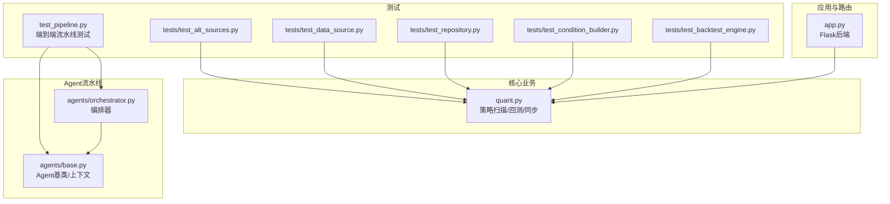
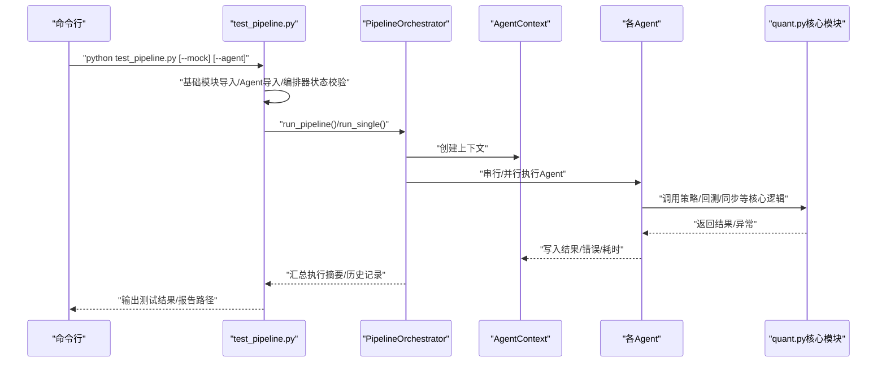
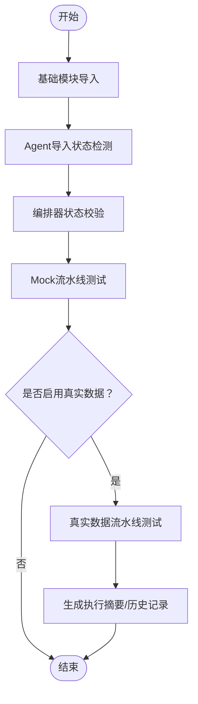
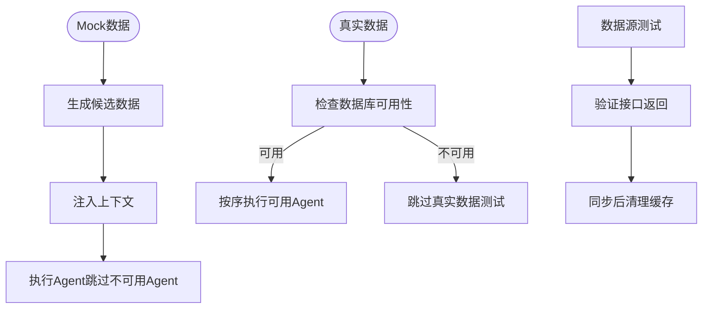
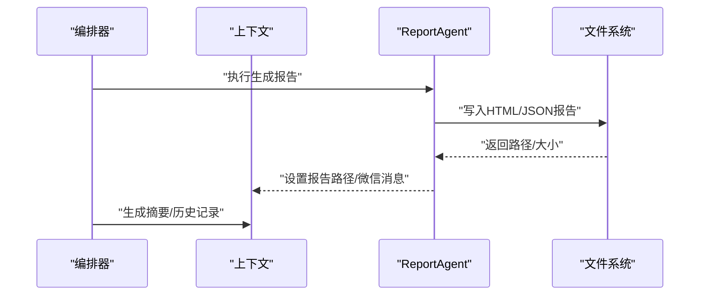
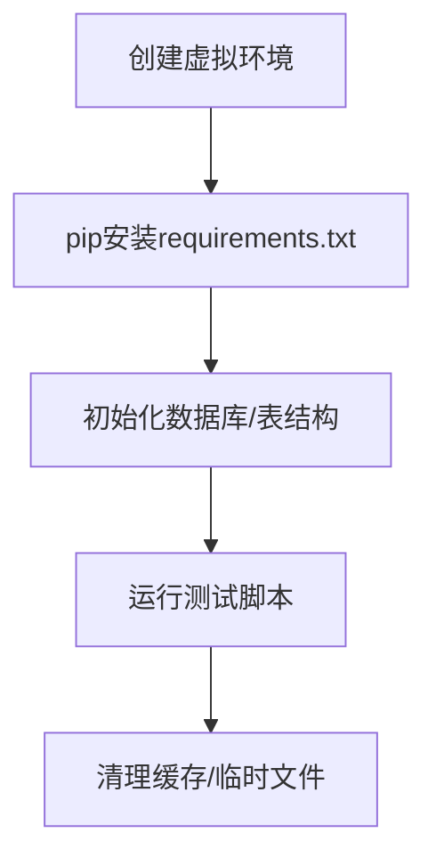
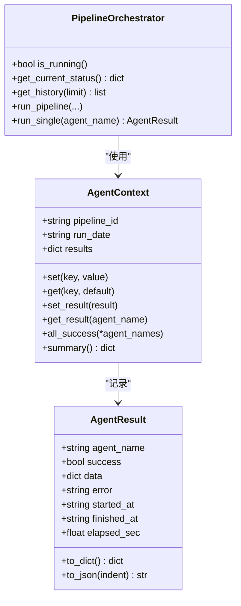
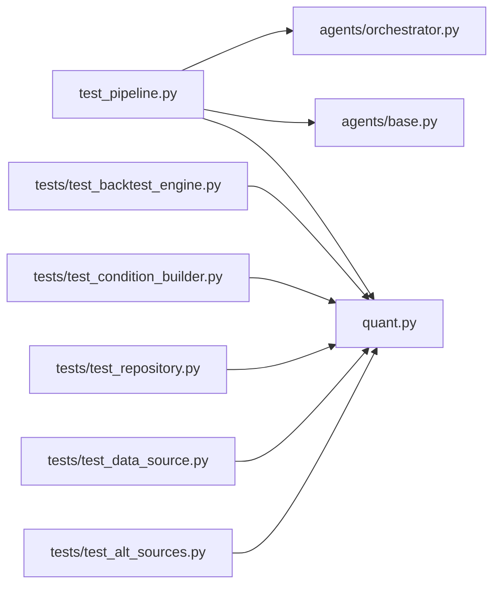

# 测试自动化

<cite>
**本文引用的文件**
- [test_pipeline.py](file://test_pipeline.py)
- [quant.py](file://quant.py)
- [app.py](file://app.py)
- [requirements.txt](file://requirements.txt)
- [tests/test_backtest_engine.py](file://tests/test_backtest_engine.py)
- [tests/test_condition_builder.py](file://tests/test_condition_builder.py)
- [tests/test_repository.py](file://tests/test_repository.py)
- [tests/test_data_source.py](file://tests/test_data_source.py)
- [tests/test_alt_sources.py](file://tests/test_alt_sources.py)
- [agents/base.py](file://agents/base.py)
- [agents/orchestrator.py](file://agents/orchestrator.py)
</cite>

## 目录
1. [引言](#引言)
2. [项目结构](#项目结构)
3. [核心组件](#核心组件)
4. [架构总览](#架构总览)
5. [详细组件分析](#详细组件分析)
6. [依赖分析](#依赖分析)
7. [性能考虑](#性能考虑)
8. [故障排查指南](#故障排查指南)
9. [结论](#结论)
10. [附录](#附录)

## 引言
本指南面向AIQuant项目的测试自动化落地，围绕测试流水线配置与管理、测试数据自动化、测试报告与分析、测试环境自动化部署与配置、测试工具链集成与优化、以及测试记忆与进度跟踪等方面，提供可操作的实施建议与最佳实践。文档结合仓库内现有测试脚本与Agent流水线能力，给出从本地开发到持续集成的完整路径。

## 项目结构
AIQuant采用“模块化+流水线”的组织方式：核心业务逻辑位于quant.py、agents目录下的多Agent流水线、以及routes与services等模块；测试集中在tests目录，并配套独立的端到端流水线测试脚本test_pipeline.py。

图表来源
- [app.py:1-164](file://app.py#L1-L164)
- [quant.py:1-631](file://quant.py#L1-L631)
- [agents/base.py:1-120](file://agents/base.py#L1-L120)
- [agents/orchestrator.py:1-263](file://agents/orchestrator.py#L1-L263)
- [test_pipeline.py:1-392](file://test_pipeline.py#L1-L392)
- [tests/test_backtest_engine.py:1-130](file://tests/test_backtest_engine.py#L1-L130)
- [tests/test_condition_builder.py:1-68](file://tests/test_condition_builder.py#L1-L68)
- [tests/test_repository.py:1-86](file://tests/test_repository.py#L1-L86)
- [tests/test_data_source.py:1-35](file://tests/test_data_source.py#L1-L35)
- [tests/test_alt_sources.py:1-42](file://tests/test_alt_sources.py#L1-L42)

章节来源
- [app.py:1-164](file://app.py#L1-L164)
- [quant.py:1-631](file://quant.py#L1-L631)
- [agents/base.py:1-120](file://agents/base.py#L1-L120)
- [agents/orchestrator.py:1-263](file://agents/orchestrator.py#L1-L263)
- [test_pipeline.py:1-392](file://test_pipeline.py#L1-L392)

## 核心组件
- 测试流水线入口：test_pipeline.py提供多Agent端到端测试，支持Mock模式与真实数据模式，覆盖导入、编排器状态、Mock流水线、真实数据流水线等阶段。
- Agent基类与上下文：agents/base.py定义统一的AgentResult与AgentContext，支撑跨Agent的数据传递、执行时间统计与错误记录。
- 编排器：agents/orchestrator.py负责三省六部制流水线的串行/并行执行、依赖关系、风控拦截、状态持久化与历史记录。
- 核心业务：quant.py包含策略扫描、回测、数据同步等核心功能，为测试提供真实数据场景。
- 测试套件：tests目录包含回测引擎验证、条件构建器验证、Repository导入与行为验证、数据源可用性测试等。

章节来源
- [test_pipeline.py:1-392](file://test_pipeline.py#L1-L392)
- [agents/base.py:1-120](file://agents/base.py#L1-L120)
- [agents/orchestrator.py:1-263](file://agents/orchestrator.py#L1-L263)
- [quant.py:1-631](file://quant.py#L1-L631)
- [tests/test_backtest_engine.py:1-130](file://tests/test_backtest_engine.py#L1-L130)
- [tests/test_condition_builder.py:1-68](file://tests/test_condition_builder.py#L1-L68)
- [tests/test_repository.py:1-86](file://tests/test_repository.py#L1-L86)
- [tests/test_data_source.py:1-35](file://tests/test_data_source.py#L1-L35)
- [tests/test_alt_sources.py:1-42](file://tests/test_alt_sources.py#L1-L42)

## 架构总览
下图展示了测试自动化在AIQuant中的整体交互：测试脚本驱动Agent流水线，Agent通过上下文共享数据，编排器协调执行顺序与并行，核心业务模块提供真实数据与策略逻辑，测试套件覆盖关键路径。

图表来源
- [test_pipeline.py:348-392](file://test_pipeline.py#L348-L392)
- [agents/orchestrator.py:81-175](file://agents/orchestrator.py#L81-L175)
- [agents/base.py:93-119](file://agents/base.py#L93-L119)
- [quant.py:433-546](file://quant.py#L433-L546)

## 详细组件分析

### 测试流水线配置与管理
- 端到端流水线测试：test_pipeline.py提供完整的五阶段测试流程，包括基础模块导入、Agent导入状态、编排器状态、Mock流水线与真实数据流水线。
- 选择性测试：支持--mock仅进行Mock测试，或--agent指定单个Agent进行专项测试。
- 导入与依赖处理：对可能缺失外部依赖的Agent（如DataAgent、BacktestAgent）进行跳过处理，保证测试可运行性。
- 编排器状态与历史：编排器维护执行历史与当前上下文摘要，便于追踪与报告。

图表来源
- [test_pipeline.py:20-392](file://test_pipeline.py#L20-L392)
- [agents/orchestrator.py:64-175](file://agents/orchestrator.py#L64-L175)

章节来源
- [test_pipeline.py:1-392](file://test_pipeline.py#L1-L392)
- [agents/orchestrator.py:1-263](file://agents/orchestrator.py#L1-L263)

### 测试数据管理自动化
- Mock数据：在Mock流水线中构造候选股票数据，注入上下文，绕过数据库依赖，快速验证流水线各环节。
- 真实数据：在真实数据模式下，依赖quant.py的数据库与策略扫描能力，模拟DataAgent成功结果后，按可用Agent顺序执行。
- 数据源可用性：提供数据源测试脚本，验证AKShare不同接口的稳定性与返回格式。
- 数据清理：在数据同步后清理旧CSV缓存，减少磁盘占用。

图表来源
- [test_pipeline.py:119-345](file://test_pipeline.py#L119-L345)
- [tests/test_data_source.py:1-35](file://tests/test_data_source.py#L1-L35)
- [tests/test_alt_sources.py:1-42](file://tests/test_alt_sources.py#L1-L42)
- [quant.py:552-567](file://quant.py#L552-L567)

章节来源
- [test_pipeline.py:119-345](file://test_pipeline.py#L119-L345)
- [tests/test_data_source.py:1-35](file://tests/test_data_source.py#L1-L35)
- [tests/test_alt_sources.py:1-42](file://tests/test_alt_sources.py#L1-L42)
- [quant.py:552-567](file://quant.py#L552-L567)

### 测试报告生成与分析自动化
- 报告产物：ReportAgent生成HTML与JSON报告，test_pipeline.py在Mock模式下输出报告路径与大小，并打印微信推送预览。
- 执行摘要：编排器在流水线结束后生成摘要，包含每个Agent的成功状态、耗时与错误片段，便于快速定位问题。
- 历史记录：编排器维护最近30条执行历史，支持API查询与前端展示。

图表来源
- [agents/orchestrator.py:162-175](file://agents/orchestrator.py#L162-L175)
- [test_pipeline.py:220-246](file://test_pipeline.py#L220-L246)

章节来源
- [agents/orchestrator.py:162-175](file://agents/orchestrator.py#L162-L175)
- [test_pipeline.py:220-246](file://test_pipeline.py#L220-L246)

### 测试环境自动化部署与配置管理
- 依赖安装：requirements.txt声明了项目运行所需的核心依赖，建议在CI环境中使用该清单安装。
- 环境隔离：建议在CI中使用Python虚拟环境与依赖锁定，确保测试一致性。
- 端到端验证：app.py提供健康检查与静态资源服务，可在测试前后验证后端可用性。

图表来源
- [requirements.txt:1-9](file://requirements.txt#L1-L9)
- [app.py:131-134](file://app.py#L131-L134)

章节来源
- [requirements.txt:1-9](file://requirements.txt#L1-L9)
- [app.py:131-134](file://app.py#L131-L134)

### 测试工具链集成与优化
- pytest集成：现有测试主要使用unittest，建议在CI中引入pytest以获得更好的并行与插件生态。
- 覆盖率：建议在CI中集成覆盖率工具，对关键模块（quant.py、agents/*、backtest/*）进行覆盖率统计。
- CI/CD集成：建议在CI中按阶段执行：安装依赖→导入检查→Mock流水线→真实数据流水线→报告与工件归档。
- 日志与Artifacts：将Agent执行摘要、报告路径、错误堆栈作为CI工件保存，便于回溯。

章节来源
- [tests/test_backtest_engine.py:1-130](file://tests/test_backtest_engine.py#L1-L130)
- [tests/test_condition_builder.py:1-68](file://tests/test_condition_builder.py#L1-L68)
- [tests/test_repository.py:1-86](file://tests/test_repository.py#L1-L86)

### 测试记忆与进度跟踪
- 上下文记忆：AgentContext提供set/get/set_result/get_result/all_success/summary等接口，统一记录Agent执行结果与共享数据。
- 编排器历史：PipelineOrchestrator维护最近执行历史，支持查询与持久化，便于前端展示与API回溯。
- 执行摘要：编排器在流水线结束时生成总体成功状态、耗时与错误摘要，便于快速定位问题。

图表来源
- [agents/base.py:20-119](file://agents/base.py#L20-L119)
- [agents/orchestrator.py:36-263](file://agents/orchestrator.py#L36-L263)

章节来源
- [agents/base.py:1-120](file://agents/base.py#L1-L120)
- [agents/orchestrator.py:1-263](file://agents/orchestrator.py#L1-L263)

## 依赖分析
- 测试脚本依赖：test_pipeline.py依赖agents/base.py与agents/orchestrator.py，以及quant.py提供的核心功能。
- 核心模块依赖：quant.py依赖core.db、core.sync、strategy.strategies等模块，提供策略扫描、回测与数据同步。
- 测试套件覆盖：tests目录覆盖回测引擎、条件构建器、Repository导入与行为、数据源可用性等关键路径。

图表来源
- [test_pipeline.py:17-392](file://test_pipeline.py#L17-L392)
- [agents/orchestrator.py:29-263](file://agents/orchestrator.py#L29-L263)
- [agents/base.py:9-119](file://agents/base.py#L9-L119)
- [quant.py:23-35](file://quant.py#L23-L35)
- [tests/test_backtest_engine.py:16-130](file://tests/test_backtest_engine.py#L16-L130)
- [tests/test_condition_builder.py:13-68](file://tests/test_condition_builder.py#L13-L68)
- [tests/test_repository.py:8-86](file://tests/test_repository.py#L8-L86)
- [tests/test_data_source.py:1-35](file://tests/test_data_source.py#L1-L35)
- [tests/test_alt_sources.py:1-42](file://tests/test_alt_sources.py#L1-L42)

章节来源
- [test_pipeline.py:17-392](file://test_pipeline.py#L17-L392)
- [quant.py:23-35](file://quant.py#L23-L35)

## 性能考虑
- 并行执行：编排器支持并行执行BacktestAgent与RiskAgent，缩短流水线总时长。
- 跳过不可用Agent：在导入失败或外部依赖缺失时跳过对应Agent，避免阻塞整体测试。
- 缓存清理：数据同步后清理旧缓存文件，降低IO压力与磁盘占用。
- 选择性测试：通过--agent与--mock参数缩小测试范围，提升CI效率。

章节来源
- [agents/orchestrator.py:213-238](file://agents/orchestrator.py#L213-L238)
- [test_pipeline.py:43-96](file://test_pipeline.py#L43-L96)
- [quant.py:552-567](file://quant.py#L552-L567)

## 故障排查指南
- 健康检查：通过app.py的健康检查端点确认后端可用性。
- Agent执行摘要：查看编排器生成的摘要，定位失败Agent及其错误片段。
- 数据库状态：在真实数据模式下检查数据库统计信息，确认是否有可用数据。
- 数据源问题：使用数据源测试脚本验证AKShare接口可用性与返回格式。
- 缓存清理：若出现磁盘空间不足或IO异常，检查缓存清理逻辑是否生效。

章节来源
- [app.py:131-134](file://app.py#L131-L134)
- [agents/orchestrator.py:162-175](file://agents/orchestrator.py#L162-L175)
- [test_pipeline.py:255-269](file://test_pipeline.py#L255-L269)
- [tests/test_data_source.py:6-34](file://tests/test_data_source.py#L6-L34)
- [quant.py:552-567](file://quant.py#L552-L567)

## 结论
通过test_pipeline.py与agents流水线的协同，AIQuant实现了从导入检查、Mock验证到真实数据验证的完整测试闭环。结合编排器的状态与历史记录、Agent上下文的记忆能力，以及数据源与缓存的自动化管理，项目具备了可扩展、可观测、可回溯的测试自动化基础。建议在CI中进一步引入pytest与覆盖率工具，并将报告与工件纳入制品库，形成持续改进的测试文化。

## 附录
- 命令行参数
  - --mock：仅进行Mock测试，跳过真实数据依赖。
  - --agent NAME：仅测试指定Agent（如SignalAgent、RiskAgent等）。
- 关键测试文件
  - test_pipeline.py：端到端流水线测试入口。
  - tests/test_backtest_engine.py：回测引擎核心逻辑验证。
  - tests/test_condition_builder.py：条件解析与T+1执行验证。
  - tests/test_repository.py：Repository模块导入与行为验证。
  - tests/test_data_source.py / tests/test_alt_sources.py：数据源可用性测试。