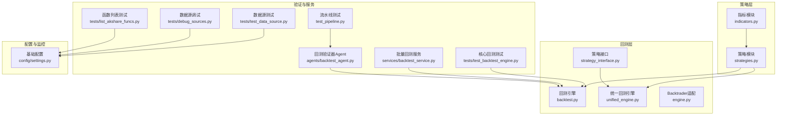
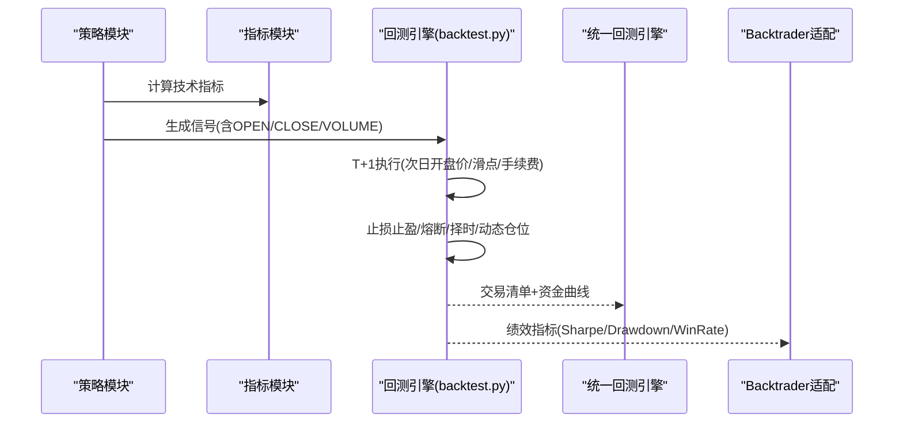
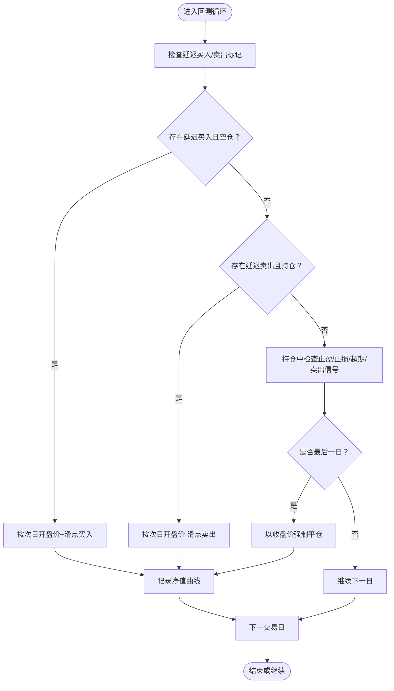
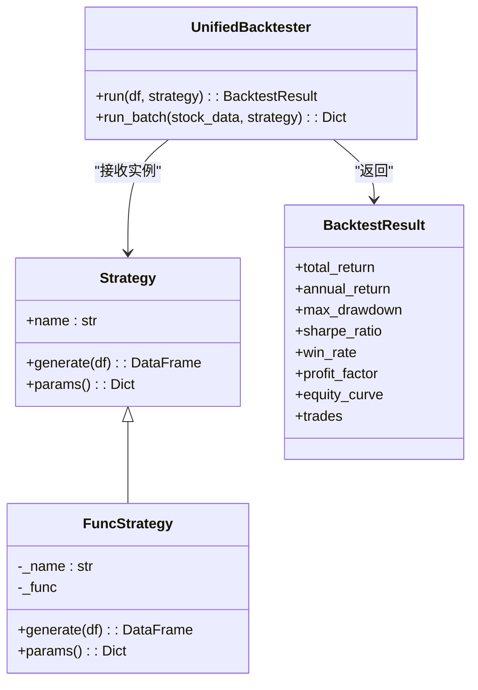
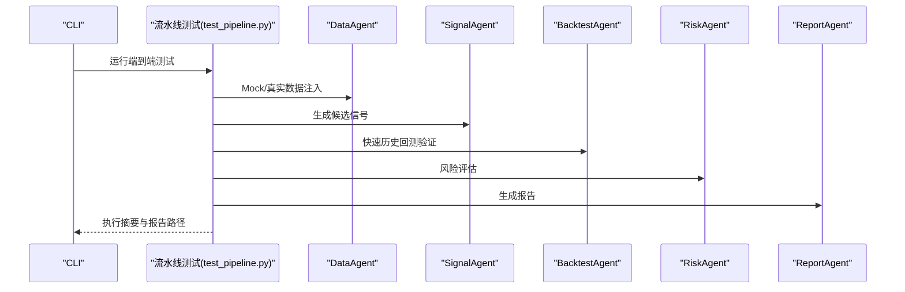
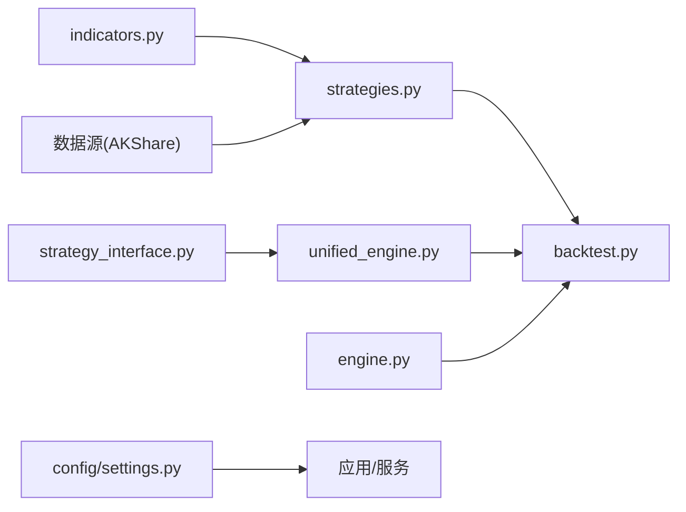

# 量化特性测试

<cite>
**本文引用的文件**
- [tests/test_backtest_engine.py](file://tests/test_backtest_engine.py)
- [backtest/backtest.py](file://backtest/backtest.py)
- [backtest/engine.py](file://backtest/engine.py)
- [backtest/unified_engine.py](file://backtest/unified_engine.py)
- [backtest/strategy_interface.py](file://backtest/strategy_interface.py)
- [agents/backtest_agent.py](file://agents/backtest_agent.py)
- [services/backtest_service.py](file://services/backtest_service.py)
- [strategy/indicators.py](file://strategy/indicators.py)
- [strategy/strategies.py](file://strategy/strategies.py)
- [tests/test_data_source.py](file://tests/test_data_source.py)
- [tests/debug_sources.py](file://tests/debug_sources.py)
- [tests/list_akshare_funcs.py](file://tests/list_akshare_funcs.py)
- [test_pipeline.py](file://test_pipeline.py)
- [config/settings.py](file://config/settings.py)
</cite>

## 目录
1. [引言](#引言)
2. [项目结构](#项目结构)
3. [核心组件](#核心组件)
4. [架构总览](#架构总览)
5. [详细组件分析](#详细组件分析)
6. [依赖分析](#依赖分析)
7. [性能考虑](#性能考虑)
8. [故障排查指南](#故障排查指南)
9. [结论](#结论)
10. [附录](#附录)

## 引言
本文件面向AIQuant项目的量化特性测试，聚焦以下目标：
- T+1交易执行测试：验证信号日不成交、次日以开盘价执行的正确性
- 资金曲线延续估值测试：在缺数据日使用最近收盘价延续估值，避免虚假归零
- 手续费计算测试：买入/卖出双向费用与印花税的正确性
- 量化回测框架与验证标准：策略性能指标、风险指标、收益稳定性
- 调试工具：数据源调试、函数列表测试、流水线端到端测试
- 算法准确性验证：技术指标计算、信号生成、交易决策
- 性能基准与压力测试：参数优化、网格搜索、系统监控

## 项目结构
AIQuant围绕“策略-回测-风控-执行”闭环组织，测试覆盖策略生成、回测引擎、指标计算、数据源与流水线。

图表来源
- [backtest/backtest.py:56-472](file://backtest/backtest.py#L56-L472)
- [backtest/unified_engine.py:59-143](file://backtest/unified_engine.py#L59-L143)
- [backtest/engine.py:72-174](file://backtest/engine.py#L72-L174)
- [backtest/strategy_interface.py:23-86](file://backtest/strategy_interface.py#L23-L86)
- [strategy/strategies.py:1-431](file://strategy/strategies.py#L1-L431)
- [strategy/indicators.py:1-244](file://strategy/indicators.py#L1-L244)
- [tests/test_backtest_engine.py:19-130](file://tests/test_backtest_engine.py#L19-L130)
- [test_pipeline.py:1-392](file://test_pipeline.py#L1-L392)
- [services/backtest_service.py:10-135](file://services/backtest_service.py#L10-L135)
- [agents/backtest_agent.py:31-181](file://agents/backtest_agent.py#L31-L181)
- [config/settings.py:1-25](file://config/settings.py#L1-L25)

章节来源
- [backtest/backtest.py:56-472](file://backtest/backtest.py#L56-L472)
- [backtest/unified_engine.py:59-143](file://backtest/unified_engine.py#L59-L143)
- [backtest/engine.py:72-174](file://backtest/engine.py#L72-L174)
- [backtest/strategy_interface.py:23-86](file://backtest/strategy_interface.py#L23-L86)
- [strategy/strategies.py:1-431](file://strategy/strategies.py#L1-L431)
- [strategy/indicators.py:1-244](file://strategy/indicators.py#L1-L244)
- [tests/test_backtest_engine.py:19-130](file://tests/test_backtest_engine.py#L19-L130)
- [test_pipeline.py:1-392](file://test_pipeline.py#L1-L392)
- [services/backtest_service.py:10-135](file://services/backtest_service.py#L10-L135)
- [agents/backtest_agent.py:31-181](file://agents/backtest_agent.py#L31-L181)
- [config/settings.py:1-25](file://config/settings.py#L1-L25)

## 核心组件
- 回测引擎（backtest.py）：实现T+1执行、滑点、手续费、止损止盈、动态仓位、熔断与择时等，输出交易清单与绩效指标
- 统一回测引擎（unified_engine.py）：策略插件化接口，接收Strategy实例，抽象资金曲线与风控
- 策略接口（strategy_interface.py）：定义Strategy与FuncStrategy，兼容函数式策略
- 指标模块（indicators.py）：提供MA/EMA/MACD/RSI/KDJ/ATR/BOLL/DMI/OBV/VWAP/CCI等
- 策略模块（strategies.py）：实现五类选股策略与信号融合，输出BUY/SELL信号与SCORE
- 验证与服务：核心回测测试、流水线测试、数据源测试/调试、批量回测服务、回测验证器Agent

章节来源
- [backtest/backtest.py:56-472](file://backtest/backtest.py#L56-L472)
- [backtest/unified_engine.py:59-143](file://backtest/unified_engine.py#L59-L143)
- [backtest/strategy_interface.py:23-86](file://backtest/strategy_interface.py#L23-L86)
- [strategy/indicators.py:1-244](file://strategy/indicators.py#L1-L244)
- [strategy/strategies.py:1-431](file://strategy/strategies.py#L1-L431)
- [services/backtest_service.py:10-135](file://services/backtest_service.py#L10-L135)
- [agents/backtest_agent.py:31-181](file://agents/backtest_agent.py#L31-L181)

## 架构总览
回测从策略生成信号开始，经由回测引擎执行T+1交易，计算资金曲线与指标，并通过统一引擎或Backtrader适配器输出结果。

图表来源
- [strategy/strategies.py:1-431](file://strategy/strategies.py#L1-L431)
- [strategy/indicators.py:1-244](file://strategy/indicators.py#L1-L244)
- [backtest/backtest.py:121-409](file://backtest/backtest.py#L121-L409)
- [backtest/unified_engine.py:108-132](file://backtest/unified_engine.py#L108-L132)
- [backtest/engine.py:79-140](file://backtest/engine.py#L79-L140)

## 详细组件分析

### T+1交易执行测试
- 验证要点
  - 信号日不成交，次日以开盘价成交
  - 滑点应用于次日开盘价
  - 最后一日无法次日执行时，以收盘价强制平仓
- 关键实现位置
  - 回测引擎延迟执行队列与次日执行逻辑
  - 滑点与手续费计算
  - 强制平仓处理
- 测试用例路径
  - [tests/test_backtest_engine.py:19-51](file://tests/test_backtest_engine.py#L19-L51)
  - [backtest/backtest.py:190-307](file://backtest/backtest.py#L190-L307)

图表来源
- [backtest/backtest.py:190-307](file://backtest/backtest.py#L190-L307)
- [backtest/backtest.py:384-408](file://backtest/backtest.py#L384-L408)

章节来源
- [tests/test_backtest_engine.py:19-51](file://tests/test_backtest_engine.py#L19-L51)
- [backtest/backtest.py:190-307](file://backtest/backtest.py#L190-L307)
- [backtest/backtest.py:384-408](file://backtest/backtest.py#L384-L408)

### 资金曲线延续估值测试
- 验证要点
  - 持仓股在无数据日使用最近可用收盘价延续估值
  - NaN与0的判别使用安全函数，避免误判
- 关键实现位置
  - 每日净值计算使用收盘价
  - NaN处理逻辑
- 测试用例路径
  - [tests/test_backtest_engine.py:53-73](file://tests/test_backtest_engine.py#L53-L73)
  - [backtest/backtest.py:379-382](file://backtest/backtest.py#L379-L382)

章节来源
- [tests/test_backtest_engine.py:53-73](file://tests/test_backtest_engine.py#L53-L73)
- [backtest/backtest.py:379-382](file://backtest/backtest.py#L379-L382)

### 手续费计算测试
- 验证要点
  - 买入/卖出双向佣金（默认万分之三）
  - 卖出单向印花税（默认千分之一）
  - 佣金最低收费与金额计算
- 关键实现位置
  - 交易成本计算函数
- 测试用例路径
  - [tests/test_backtest_engine.py:75-92](file://tests/test_backtest_engine.py#L75-L92)
  - [backtest/backtest.py:112-119](file://backtest/backtest.py#L112-L119)

章节来源
- [tests/test_backtest_engine.py:75-92](file://tests/test_backtest_engine.py#L75-L92)
- [backtest/backtest.py:112-119](file://backtest/backtest.py#L112-L119)

### 量化回测框架与验证标准
- 框架能力
  - 统一回测引擎：策略插件化、T+1执行、滑点/手续费、风控（熔断/择时/动态仓位）
  - Backtrader适配：Sharpe/最大回撤/交易统计等指标提取
- 验证标准
  - 策略性能：总收益、年化收益、胜率、盈亏比、平均持仓天数
  - 风险指标：最大回撤、夏普比率
  - 收益稳定性：收益序列波动性、卡玛比率等
- 关键实现位置
  - 统一回测引擎与BacktestResult数据结构
  - 指标计算（年化收益、最大回撤、夏普比率、胜率、盈亏比、平均盈亏幅度、Alpha）
  - Backtrader适配器与分析器
- 测试用例路径
  - [backtest/unified_engine.py:59-143](file://backtest/unified_engine.py#L59-L143)
  - [backtest/backtest.py:411-471](file://backtest/backtest.py#L411-L471)
  - [backtest/engine.py:72-174](file://backtest/engine.py#L72-L174)

图表来源
- [backtest/strategy_interface.py:23-86](file://backtest/strategy_interface.py#L23-L86)
- [backtest/unified_engine.py:59-143](file://backtest/unified_engine.py#L59-L143)
- [backtest/backtest.py:34-54](file://backtest/backtest.py#L34-L54)

章节来源
- [backtest/unified_engine.py:59-143](file://backtest/unified_engine.py#L59-L143)
- [backtest/backtest.py:411-471](file://backtest/backtest.py#L411-L471)
- [backtest/engine.py:72-174](file://backtest/engine.py#L72-L174)

### 调试工具与流水线测试
- 数据源调试
  - 单接口连通性测试与函数列表探索
  - 多源对比与失败原因定位
- 流水线端到端测试
  - 模块导入、Agent可用性、Mock数据流水线、真实数据流水线
- 关键实现位置
  - 数据源测试脚本
  - 流水线测试脚本
- 测试用例路径
  - [tests/test_data_source.py:1-35](file://tests/test_data_source.py#L1-L35)
  - [tests/debug_sources.py:1-54](file://tests/debug_sources.py#L1-L54)
  - [tests/list_akshare_funcs.py:1-42](file://tests/list_akshare_funcs.py#L1-L42)
  - [test_pipeline.py:1-392](file://test_pipeline.py#L1-L392)

图表来源
- [test_pipeline.py:119-246](file://test_pipeline.py#L119-L246)
- [agents/backtest_agent.py:31-181](file://agents/backtest_agent.py#L31-L181)

章节来源
- [tests/test_data_source.py:1-35](file://tests/test_data_source.py#L1-L35)
- [tests/debug_sources.py:1-54](file://tests/debug_sources.py#L1-L54)
- [tests/list_akshare_funcs.py:1-42](file://tests/list_akshare_funcs.py#L1-L42)
- [test_pipeline.py:1-392](file://test_pipeline.py#L1-L392)
- [agents/backtest_agent.py:31-181](file://agents/backtest_agent.py#L31-L181)

### 算法准确性验证
- 技术指标计算验证
  - 指标覆盖趋势/震荡/波动/成交量等类别，确保数值与公式一致
- 信号生成测试
  - 各策略在典型K线形态下的BUY/SELL信号与SCORE
  - 信号融合权重与阈值对最终信号的影响
- 交易决策验证
  - 信号→T+1执行→滑点/手续费→止盈止损→熔断/择时的链路一致性
- 关键实现位置
  - 指标计算函数
  - 策略函数与信号融合
  - 回测引擎执行逻辑
- 测试用例路径
  - [strategy/indicators.py:13-244](file://strategy/indicators.py#L13-L244)
  - [strategy/strategies.py:36-431](file://strategy/strategies.py#L36-L431)
  - [backtest/backtest.py:121-409](file://backtest/backtest.py#L121-L409)

章节来源
- [strategy/indicators.py:13-244](file://strategy/indicators.py#L13-L244)
- [strategy/strategies.py:36-431](file://strategy/strategies.py#L36-L431)
- [backtest/backtest.py:121-409](file://backtest/backtest.py#L121-L409)

### 性能基准与压力测试
- 参数优化与网格搜索
  - 以夏普/总收益/胜率/最大回撤等指标评分，遍历参数空间
- 批量回测服务
  - 对多股票/多策略组合进行批量回测，汇总指标与交易清单
- 系统监控
  - CPU/内存/磁盘/数据库大小/错误计数等指标采集
- 关键实现位置
  - 参数优化器（评分与回测）
  - 批量回测服务（配对交易、统计指标）
  - 系统监控器（指标采集）
- 测试用例路径
  - [services/backtest_service.py:10-135](file://services/backtest_service.py#L10-L135)
  - [ministries/works/monitor.py:16-54](file://ministries/works/monitor.py#L16-L54)

章节来源
- [services/backtest_service.py:10-135](file://services/backtest_service.py#L10-L135)
- [ministries/works/monitor.py:16-54](file://ministries/works/monitor.py#L16-L54)

## 依赖分析
- 组件耦合
  - 策略模块依赖指标模块；回测引擎依赖策略输出的信号与OHLCV
  - 统一回测引擎通过策略接口解耦具体策略实现
  - Backtrader适配器封装第三方库调用
- 外部依赖
  - 数据源（如AKShare）影响回测输入质量
  - 配置文件决定API主机/端口、定时任务时间等

图表来源
- [strategy/indicators.py:1-244](file://strategy/indicators.py#L1-L244)
- [strategy/strategies.py:1-431](file://strategy/strategies.py#L1-L431)
- [backtest/backtest.py:56-472](file://backtest/backtest.py#L56-L472)
- [backtest/unified_engine.py:16-17](file://backtest/unified_engine.py#L16-L17)
- [backtest/engine.py:10-14](file://backtest/engine.py#L10-L14)
- [config/settings.py:1-25](file://config/settings.py#L1-L25)

章节来源
- [strategy/indicators.py:1-244](file://strategy/indicators.py#L1-L244)
- [strategy/strategies.py:1-431](file://strategy/strategies.py#L1-L431)
- [backtest/backtest.py:56-472](file://backtest/backtest.py#L56-L472)
- [backtest/unified_engine.py:16-17](file://backtest/unified_engine.py#L16-L17)
- [backtest/engine.py:10-14](file://backtest/engine.py#L10-L14)
- [config/settings.py:1-25](file://config/settings.py#L1-L25)

## 性能考虑
- 指标计算复杂度
  - 移动平均/滚动窗口指标为O(n×k)，其中n为交易日数，k为窗口大小
  - 建议：合理选择窗口长度，避免过大导致计算瓶颈
- 回测执行效率
  - 预取open列、延迟执行队列、ATR/均线预计算减少重复计算
  - 动态仓位基于ATR波动率，需保证ATR计算的稳定性
- 批量回测与参数优化
  - 使用网格搜索或贝叶斯优化降低搜索空间
  - 并行化策略结果与回测，注意资源限制

## 故障排查指南
- 数据源问题
  - 使用数据源测试脚本逐一验证AKShare接口可用性
  - 若全部失败，检查网络/代理/防火墙与股票代码格式
- 回测异常
  - 确认策略返回DataFrame包含open列（T+1执行必需）
  - 检查NaN与0的判别逻辑，避免误判导致估值异常
  - 核对滑点/手续费参数与最低收费规则
- 流水线中断
  - 使用流水线测试脚本定位不可用Agent与错误信息
  - Mock数据先行验证，再切换至真实数据库

章节来源
- [tests/test_data_source.py:1-35](file://tests/test_data_source.py#L1-L35)
- [tests/debug_sources.py:1-54](file://tests/debug_sources.py#L1-L54)
- [tests/list_akshare_funcs.py:1-42](file://tests/list_akshare_funcs.py#L1-L42)
- [test_pipeline.py:1-392](file://test_pipeline.py#L1-L392)
- [backtest/backtest.py:120-125](file://backtest/backtest.py#L120-L125)

## 结论
本测试文档梳理了AIQuant在T+1执行、资金曲线延续估值、手续费计算、回测框架与验证标准、调试工具、算法准确性与性能基准方面的测试方法。建议在持续集成中加入核心回测测试与流水线测试，确保策略与回测引擎的稳定性与可重复性。

## 附录
- 常用测试命令
  - 运行核心回测测试：python tests/test_backtest_engine.py
  - 运行数据源测试：python tests/test_data_source.py
  - 运行流水线测试：python test_pipeline.py
  - 运行数据源调试：python tests/debug_sources.py
  - 运行函数列表测试：python tests/list_akshare_funcs.py
- 配置参考
  - 基础配置文件路径与关键字段见配置模块

章节来源
- [tests/test_backtest_engine.py:128-130](file://tests/test_backtest_engine.py#L128-L130)
- [test_pipeline.py:348-392](file://test_pipeline.py#L348-L392)
- [config/settings.py:1-25](file://config/settings.py#L1-L25)