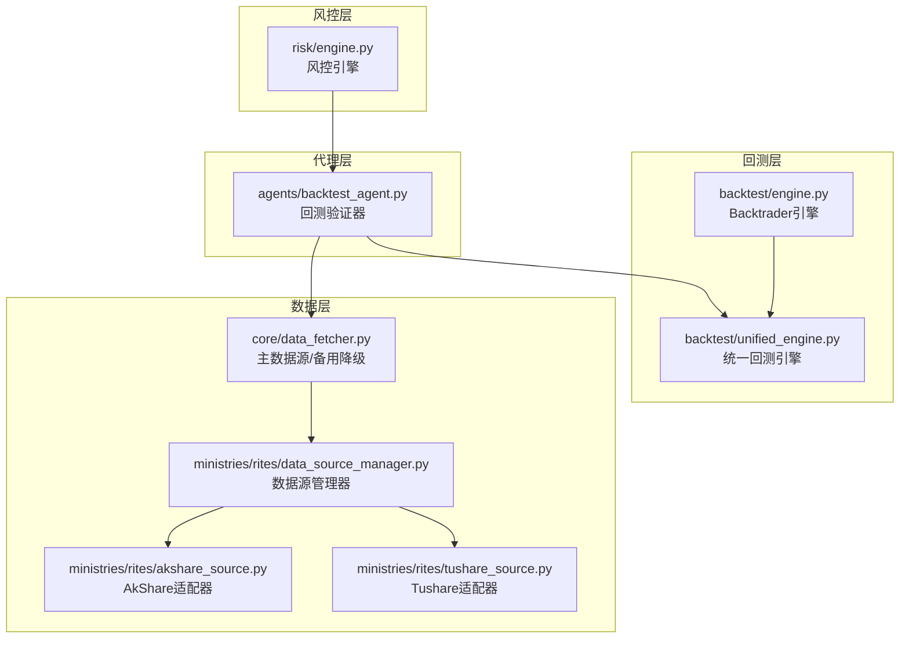
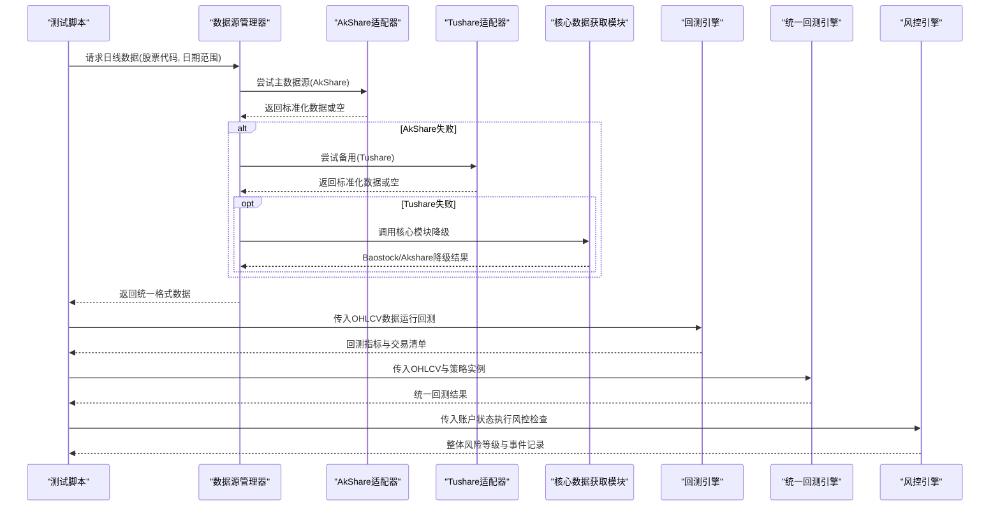
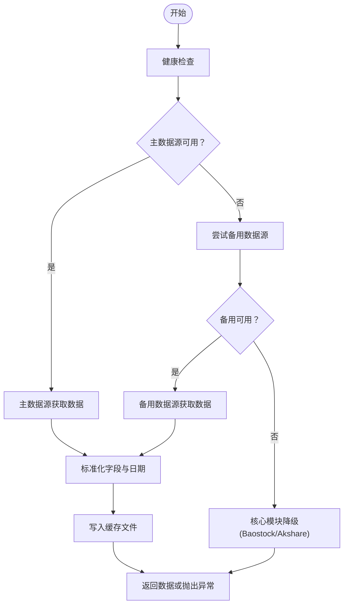
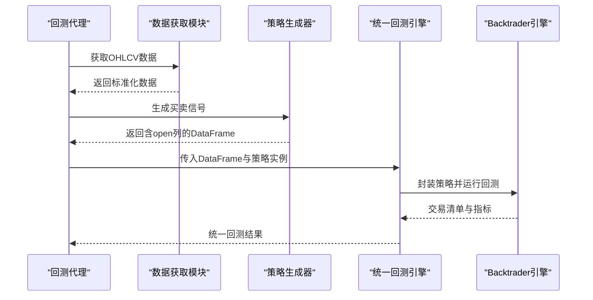
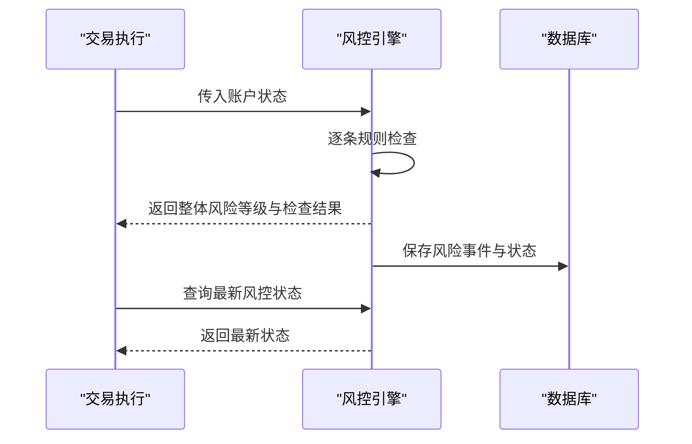
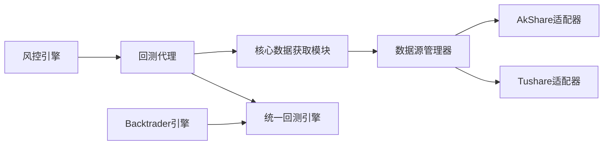

# 集成测试

<cite>
**本文引用的文件**   
- [tests/test_data_source.py](file://tests/test_data_source.py)
- [tests/test_alt_sources.py](file://tests/test_alt_sources.py)
- [ministries/rites/data_source_manager.py](file://ministries/rites/data_source_manager.py)
- [ministries/rites/akshare_source.py](file://ministries/rites/akshare_source.py)
- [ministries/rites/tushare_source.py](file://ministries/rites/tushare_source.py)
- [core/data_fetcher.py](file://core/data_fetcher.py)
- [backtest/engine.py](file://backtest/engine.py)
- [backtest/unified_engine.py](file://backtest/unified_engine.py)
- [risk/engine.py](file://risk/engine.py)
- [agents/backtest_agent.py](file://agents/backtest_agent.py)
- [tests/test_backtest_engine.py](file://tests/test_backtest_engine.py)
- [tests/test_repository.py](file://tests/test_repository.py)
</cite>

## 目录
1. [引言](#引言)
2. [项目结构](#项目结构)
3. [核心组件](#核心组件)
4. [架构总览](#架构总览)
5. [详细组件分析](#详细组件分析)
6. [依赖分析](#依赖分析)
7. [性能考虑](#性能考虑)
8. [故障排查指南](#故障排查指南)
9. [结论](#结论)
10. [附录](#附录)

## 引言
本集成测试文档面向AIQuant项目，聚焦多数据源（AkShare、Tushare、Baostock）的集成测试方法与策略，涵盖数据源切换机制、数据格式标准化、错误处理与降级策略、数据质量验证（完整性、连续性、异常值）、以及跨模块协作（策略引擎与数据源、风控与交易执行）。文档同时提供测试环境搭建、配置与测试数据管理建议，帮助研发与测试团队系统化地验证系统在真实数据流下的稳定性与一致性。

## 项目结构
AIQuant采用“模块化+适配器”的数据访问与回测体系：
- 数据层：核心数据获取模块负责主数据源（Baostock）与备用数据源（AkShare/Tushare）的统一接入与降级。
- 适配层：数据源管理器与具体适配器（Akshare/Tushare）提供统一接口与健康检查。
- 回测层：传统Backtrader引擎与统一回测引擎，分别用于历史回测与策略插件化回测。
- 风控层：风控引擎对账户状态进行规则检查，并持久化结果。
- 代理层：回测代理对接候选池与回测结果汇总。

图表来源
- [core/data_fetcher.py:173-223](file://core/data_fetcher.py#L173-L223)
- [ministries/rites/data_source_manager.py:111-178](file://ministries/rites/data_source_manager.py#L111-L178)
- [ministries/rites/akshare_source.py:45-82](file://ministries/rites/akshare_source.py#L45-L82)
- [ministries/rites/tushare_source.py:65-103](file://ministries/rites/tushare_source.py#L65-L103)
- [backtest/engine.py:72-141](file://backtest/engine.py#L72-L141)
- [backtest/unified_engine.py:59-132](file://backtest/unified_engine.py#L59-L132)
- [risk/engine.py:13-72](file://risk/engine.py#L13-L72)
- [agents/backtest_agent.py:31-68](file://agents/backtest_agent.py#L31-L68)

章节来源
- [core/data_fetcher.py:173-223](file://core/data_fetcher.py#L173-L223)
- [ministries/rites/data_source_manager.py:111-178](file://ministries/rites/data_source_manager.py#L111-L178)
- [ministries/rites/akshare_source.py:45-82](file://ministries/rites/akshare_source.py#L45-L82)
- [ministries/rites/tushare_source.py:65-103](file://ministries/rites/tushare_source.py#L65-L103)
- [backtest/engine.py:72-141](file://backtest/engine.py#L72-L141)
- [backtest/unified_engine.py:59-132](file://backtest/unified_engine.py#L59-L132)
- [risk/engine.py:13-72](file://risk/engine.py#L13-L72)
- [agents/backtest_agent.py:31-68](file://agents/backtest_agent.py#L31-L68)

## 核心组件
- 数据源管理器：统一注册与调度多个数据源，支持主备切换与健康检查。
- AkShare/Tushare适配器：标准化不同数据源的字段与格式，提供一致接口。
- 核心数据获取模块：以Baostock为主、AkShare为备，自动降级与缓存。
- 回测引擎：传统Backtrader引擎与统一回测引擎，支持参数优化与策略插件化。
- 风控引擎：规则驱动的风险检查与状态持久化。
- 回测代理：对候选股票进行快速历史回测与统计汇总。

章节来源
- [ministries/rites/data_source_manager.py:111-178](file://ministries/rites/data_source_manager.py#L111-L178)
- [ministries/rites/akshare_source.py:45-82](file://ministries/rites/akshare_source.py#L45-L82)
- [ministries/rites/tushare_source.py:65-103](file://ministries/rites/tushare_source.py#L65-L103)
- [core/data_fetcher.py:173-223](file://core/data_fetcher.py#L173-L223)
- [backtest/engine.py:72-141](file://backtest/engine.py#L72-L141)
- [backtest/unified_engine.py:59-132](file://backtest/unified_engine.py#L59-L132)
- [risk/engine.py:13-72](file://risk/engine.py#L13-L72)
- [agents/backtest_agent.py:31-68](file://agents/backtest_agent.py#L31-L68)

## 架构总览
下图展示从数据源到回测与风控的整体流程，以及关键的错误处理与降级路径。

图表来源
- [ministries/rites/data_source_manager.py:153-177](file://ministries/rites/data_source_manager.py#L153-L177)
- [ministries/rites/akshare_source.py:45-82](file://ministries/rites/akshare_source.py#L45-L82)
- [ministries/rites/tushare_source.py:65-103](file://ministries/rites/tushare_source.py#L65-L103)
- [core/data_fetcher.py:204-222](file://core/data_fetcher.py#L204-L222)
- [backtest/engine.py:79-141](file://backtest/engine.py#L79-L141)
- [backtest/unified_engine.py:108-132](file://backtest/unified_engine.py#L108-L132)
- [risk/engine.py:19-49](file://risk/engine.py#L19-L49)

## 详细组件分析

### 数据源切换与降级测试
目标：
- 验证主备数据源切换逻辑与错误恢复。
- 验证AkShare/Tushare适配器的数据格式标准化。
- 验证核心模块的自动降级与缓存策略。

测试要点：
- 健康检查：各适配器与数据源管理器的check_health应返回可用状态。
- 数据获取：get_daily_price返回统一字段集，日期格式一致。
- 降级路径：当主数据源失败时，自动切换至备用数据源；若均失败，抛出明确异常。
- 缓存命中：二次请求同一时间段应命中缓存文件。

图表来源
- [ministries/rites/data_source_manager.py:136-177](file://ministries/rites/data_source_manager.py#L136-L177)
- [ministries/rites/akshare_source.py:45-82](file://ministries/rites/akshare_source.py#L45-L82)
- [ministries/rites/tushare_source.py:65-103](file://ministries/rites/tushare_source.py#L65-L103)
- [core/data_fetcher.py:204-222](file://core/data_fetcher.py#L204-L222)

章节来源
- [ministries/rites/data_source_manager.py:136-177](file://ministries/rites/data_source_manager.py#L136-L177)
- [ministries/rites/akshare_source.py:45-82](file://ministries/rites/akshare_source.py#L45-L82)
- [ministries/rites/tushare_source.py:65-103](file://ministries/rites/tushare_source.py#L65-L103)
- [core/data_fetcher.py:204-222](file://core/data_fetcher.py#L204-L222)

### 数据质量验证测试
目标：
- 数据完整性：字段齐全、非空。
- 时间序列连续性：无缺失交易日、索引有序。
- 异常值检测：价格/成交量/换手率等数值合理性。

测试用例建议：
- 字段校验：确保返回数据包含日期、开盘、最高、最低、收盘、成交量、成交额、涨跌幅、换手率等关键字段。
- 连续性校验：按日期升序排列，无重复与跳缺。
- 数值范围：收盘价>0，成交量≥0，涨跌幅合理，换手率>0（交易日）。
- 缺失处理：对NaN或空值进行安全处理，避免误判为0。

章节来源
- [tests/test_data_source.py:6-35](file://tests/test_data_source.py#L6-L35)
- [tests/test_alt_sources.py:9-42](file://tests/test_alt_sources.py#L9-L42)
- [core/data_fetcher.py:123-133](file://core/data_fetcher.py#L123-L133)

### 策略引擎与数据源集成测试
目标：
- 验证策略生成的信号与回测执行的一致性。
- 验证T+1执行、滑点、手续费、资金曲线延续估值等关键逻辑。
- 验证统一回测引擎的参数传递与结果输出。

测试要点：
- T+1执行：买入信号当日不成交，次日开盘价成交。
- 资金曲线延续：无数据日使用最近可用收盘价延续估值。
- 手续费与印花税：双向佣金与卖出印花税计算正确。
- 统一引擎：策略实例传入后能生成交易清单与指标。

图表来源
- [agents/backtest_agent.py:116-126](file://agents/backtest_agent.py#L116-L126)
- [backtest/unified_engine.py:108-132](file://backtest/unified_engine.py#L108-L132)
- [backtest/engine.py:79-141](file://backtest/engine.py#L79-L141)

章节来源
- [agents/backtest_agent.py:116-126](file://agents/backtest_agent.py#L116-L126)
- [backtest/unified_engine.py:108-132](file://backtest/unified_engine.py#L108-L132)
- [backtest/engine.py:79-141](file://backtest/engine.py#L79-L141)
- [tests/test_backtest_engine.py:19-126](file://tests/test_backtest_engine.py#L19-L126)

### 风控与交易执行协同测试
目标：
- 验证风控引擎对账户状态的检查与阻断能力。
- 验证风控事件与状态的持久化与查询。

测试要点：
- 规则执行：逐条规则检查，记录结果与建议。
- 整体等级：根据最严格规则确定整体风险等级。
- 持久化：将检查结果与状态写入数据库，支持查询最新状态与最近事件。

图表来源
- [risk/engine.py:19-72](file://risk/engine.py#L19-L72)
- [risk/engine.py:129-167](file://risk/engine.py#L129-L167)

章节来源
- [risk/engine.py:19-72](file://risk/engine.py#L19-L72)
- [risk/engine.py:129-167](file://risk/engine.py#L129-L167)

## 依赖分析
- 数据源管理器依赖适配器接口，实现多数据源统一调度。
- 核心数据获取模块依赖Baostock与AkShare，提供自动降级与缓存。
- 回测引擎依赖策略接口，支持Backtrader与统一引擎两种模式。
- 风控引擎依赖规则集合与数据库持久化。
- 回测代理依赖数据获取模块与回测引擎，形成端到端验证闭环。

图表来源
- [ministries/rites/data_source_manager.py:111-178](file://ministries/rites/data_source_manager.py#L111-L178)
- [ministries/rites/akshare_source.py:15-82](file://ministries/rites/akshare_source.py#L15-L82)
- [ministries/rites/tushare_source.py:16-103](file://ministries/rites/tushare_source.py#L16-L103)
- [core/data_fetcher.py:173-223](file://core/data_fetcher.py#L173-L223)
- [agents/backtest_agent.py:31-68](file://agents/backtest_agent.py#L31-L68)
- [backtest/unified_engine.py:59-132](file://backtest/unified_engine.py#L59-L132)
- [risk/engine.py:13-72](file://risk/engine.py#L13-L72)
- [backtest/engine.py:72-141](file://backtest/engine.py#L72-L141)

章节来源
- [ministries/rites/data_source_manager.py:111-178](file://ministries/rites/data_source_manager.py#L111-L178)
- [ministries/rites/akshare_source.py:15-82](file://ministries/rites/akshare_source.py#L15-L82)
- [ministries/rites/tushare_source.py:16-103](file://ministries/rites/tushare_source.py#L16-L103)
- [core/data_fetcher.py:173-223](file://core/data_fetcher.py#L173-L223)
- [agents/backtest_agent.py:31-68](file://agents/backtest_agent.py#L31-L68)
- [backtest/unified_engine.py:59-132](file://backtest/unified_engine.py#L59-L132)
- [risk/engine.py:13-72](file://risk/engine.py#L13-L72)
- [backtest/engine.py:72-141](file://backtest/engine.py#L72-L141)

## 性能考虑
- 自动降级与缓存：优先使用Baostock主数据源，失败后快速切换至AkShare备用，减少等待时间；命中缓存文件避免重复拉取。
- 并发与锁：Baostock登录采用线程锁，确保并发安全与登录状态一致性。
- 回测性能：统一回测引擎支持批量回测与参数网格优化，建议结合策略实例化与数据预处理提升吞吐。
- 风控查询：风控状态与事件查询使用数据库索引字段，建议定期清理与归档历史事件。

## 故障排查指南
常见问题与定位：
- 数据源不可用：检查数据源管理器健康检查返回状态，确认主/备数据源可用性。
- 字段不一致：核对适配器标准化逻辑，确保日期与数值字段统一。
- 回测异常：检查策略是否包含open列，确认T+1执行与滑点、手续费参数设置。
- 风控阻断：查看风控事件表与状态表，定位触发规则与阈值。

章节来源
- [ministries/rites/data_source_manager.py:136-177](file://ministries/rites/data_source_manager.py#L136-L177)
- [ministries/rites/akshare_source.py:61-78](file://ministries/rites/akshare_source.py#L61-L78)
- [ministries/rites/tushare_source.py:86-100](file://ministries/rites/tushare_source.py#L86-L100)
- [backtest/unified_engine.py:119-125](file://backtest/unified_engine.py#L119-L125)
- [risk/engine.py:73-127](file://risk/engine.py#L73-L127)

## 结论
通过多数据源适配器与统一管理器，AIQuant实现了高可用的数据接入与自动降级；配合回测引擎与风控引擎，形成了从数据到策略再到风控的完整闭环。建议在持续集成中引入上述集成测试用例，覆盖数据源切换、格式标准化、回测关键逻辑与风控阻断场景，保障系统在真实数据流下的稳定性与一致性。

## 附录

### 测试环境搭建与配置
- Python依赖：确保安装AkShare、Baostock、Tushare、Backtrader、Pandas、Numpy等库。
- 环境变量：Tushare数据源需设置令牌；若未设置，Tushare适配器将不可用。
- 缓存目录：核心数据获取模块会创建缓存目录，确保磁盘空间充足。
- 数据库：风控引擎与仓库模块依赖数据库，需确保连接可用。

章节来源
- [ministries/rites/tushare_source.py:23-29](file://ministries/rites/tushare_source.py#L23-L29)
- [core/data_fetcher.py:22-23](file://core/data_fetcher.py#L22-L23)
- [risk/engine.py:76-127](file://risk/engine.py#L76-L127)

### 测试数据准备与管理
- 历史数据：使用核心数据获取模块或数据源管理器获取指定股票与日期范围的日线数据。
- 替代方案：测试脚本提供了AkShare替代接口的示例，便于在主接口受限时验证数据可用性。
- 仓库兼容性：测试脚本验证了仓库模块的导入与函数签名，确保数据写入与查询接口稳定。

章节来源
- [tests/test_data_source.py:6-35](file://tests/test_data_source.py#L6-L35)
- [tests/test_alt_sources.py:9-42](file://tests/test_alt_sources.py#L9-L42)
- [tests/test_repository.py:14-81](file://tests/test_repository.py#L14-L81)