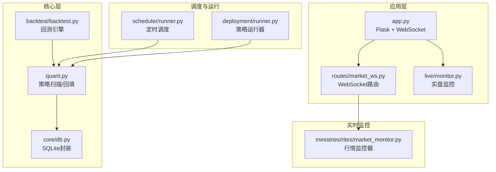
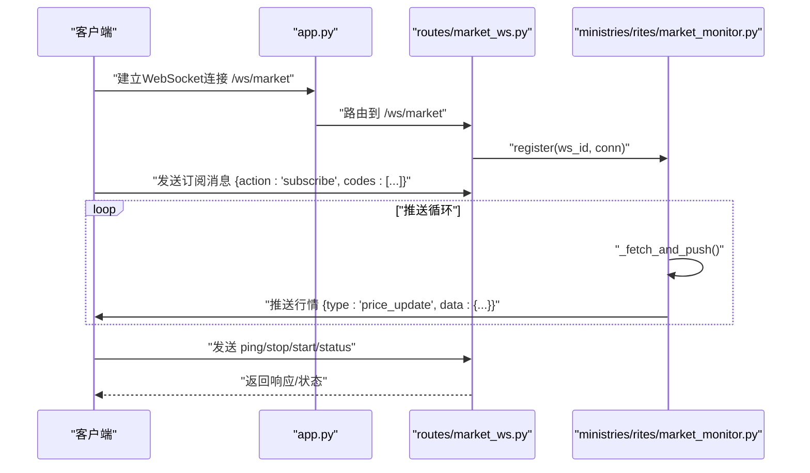
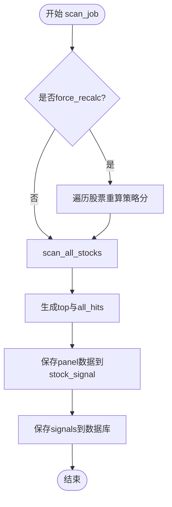
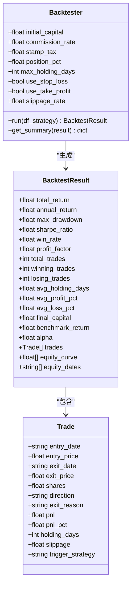
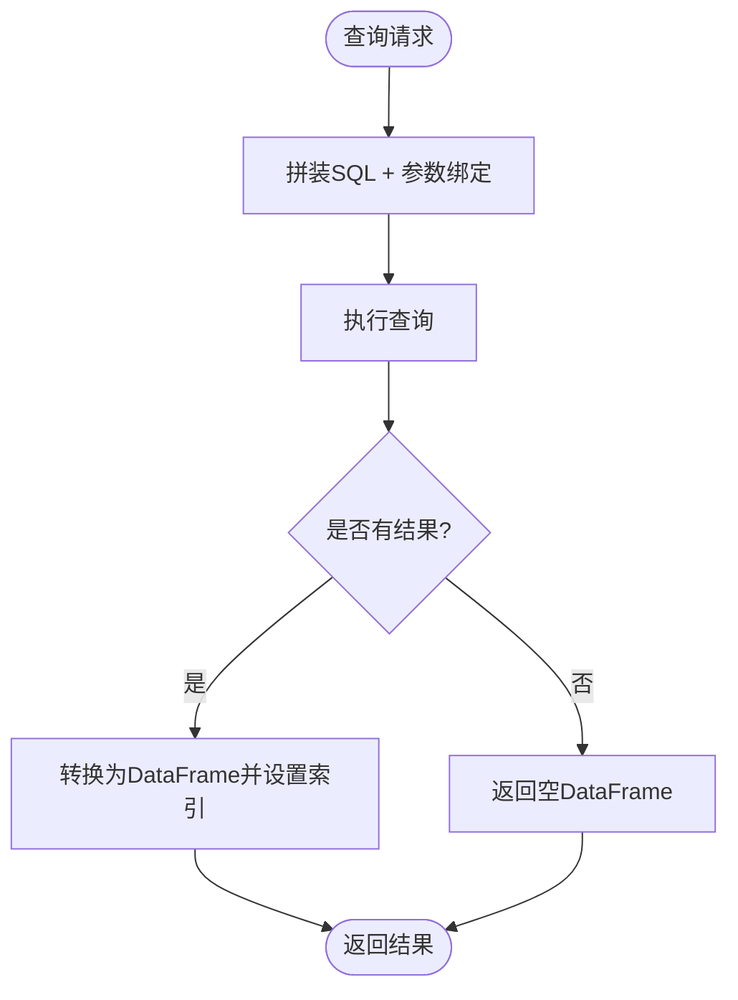
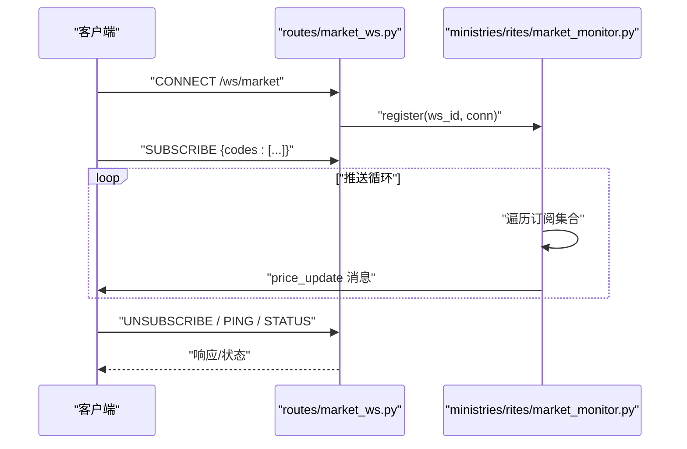
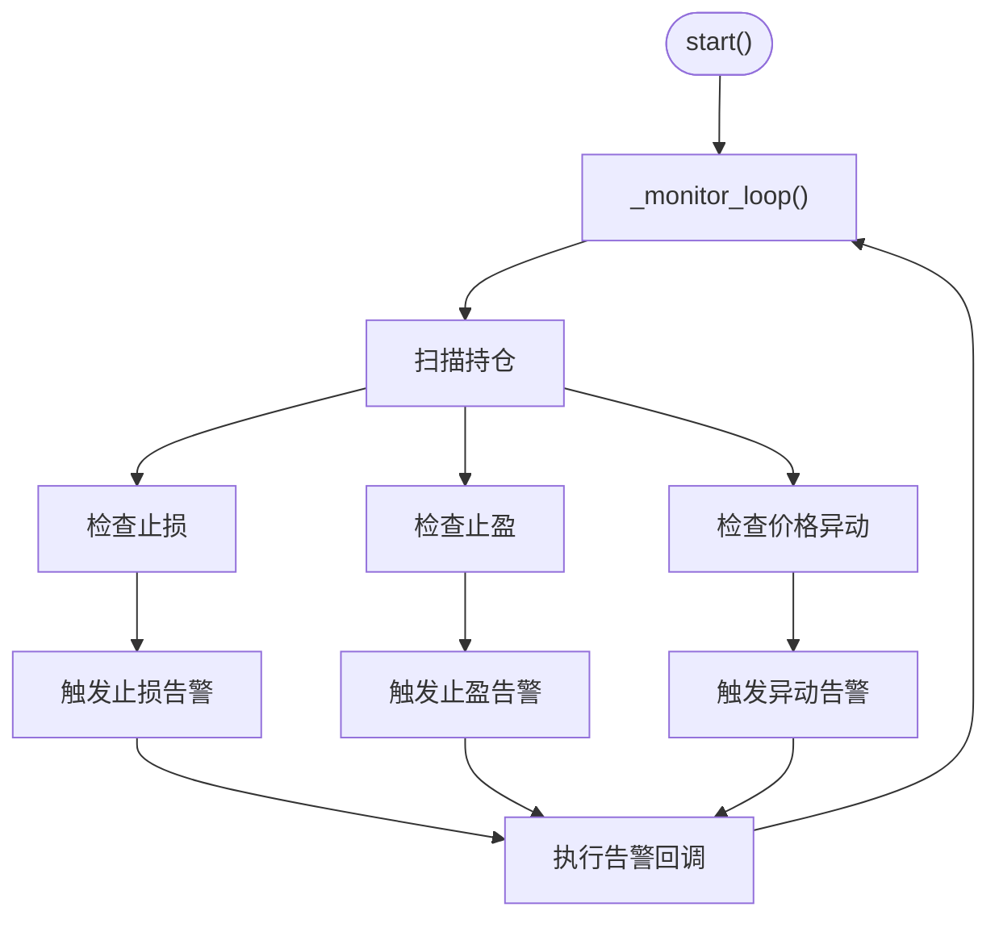
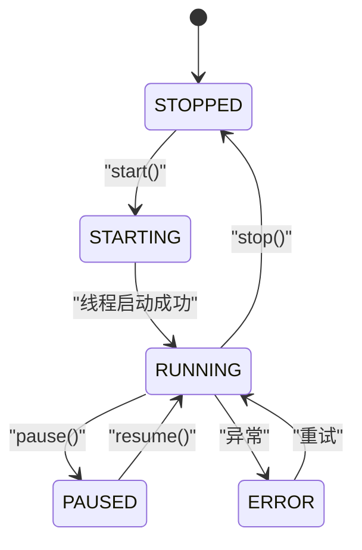
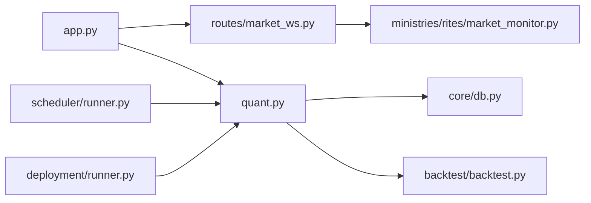

# 调试工具与技巧

<cite>
**本文引用的文件**
- [README.md](file://README.md)
- [quant.py](file://quant.py)
- [app.py](file://app.py)
- [backtest/backtest.py](file://backtest/backtest.py)
- [core/db.py](file://core/db.py)
- [routes/market_ws.py](file://routes/market_ws.py)
- [ministries/rites/market_monitor.py](file://ministries/rites/market_monitor.py)
- [live/monitor.py](file://live/monitor.py)
- [tests/debug_sources.py](file://tests/debug_sources.py)
- [deployment/runner.py](file://deployment/runner.py)
- [scheduler/runner.py](file://scheduler/runner.py)
- [requirements.txt](file://requirements.txt)
</cite>

## 目录
1. [简介](#简介)
2. [项目结构](#项目结构)
3. [核心组件](#核心组件)
4. [架构总览](#架构总览)
5. [详细组件分析](#详细组件分析)
6. [依赖关系分析](#依赖关系分析)
7. [性能考量](#性能考量)
8. [故障排查指南](#故障排查指南)
9. [结论](#结论)
10. [附录](#附录)

## 简介
本指南面向AIQuant量化交易系统，聚焦于调试工具与技巧，覆盖Python调试器、IDE调试、日志调试、回放调试、时间序列调试、数据流跟踪、性能分析（cProfile、memory_profiler、line_profiler）、数据库调试（SQL优化、索引分析、锁竞争）、WebSocket连接与实时数据流分析、内存泄漏与资源管理、异常追踪与错误定位、并发程序调试以及生产环境调试与故障排查。文档结合项目现有代码与模块，提供可操作的调试方法与最佳实践。

## 项目结构
AIQuant采用模块化分层设计：
- 应用层：Flask后端与WebSocket路由，提供REST API与实时行情推送
- 核心层：数据库封装、数据同步、策略扫描与回测引擎
- 实时监控：行情监控器与实盘监控器
- 调度与运行：定时调度器与策略运行器
- 测试与调试：调试脚本与示例

图表来源
- [app.py:1-164](file://app.py#L1-L164)
- [routes/market_ws.py:1-142](file://routes/market_ws.py#L1-L142)
- [ministries/rites/market_monitor.py:1-244](file://ministries/rites/market_monitor.py#L1-L244)
- [quant.py:1-631](file://quant.py#L1-L631)
- [core/db.py:1-800](file://core/db.py#L1-L800)
- [backtest/backtest.py:1-517](file://backtest/backtest.py#L1-L517)
- [scheduler/runner.py:1-212](file://scheduler/runner.py#L1-L212)
- [deployment/runner.py:1-182](file://deployment/runner.py#L1-L182)

章节来源
- [README.md:1-3](file://README.md#L1-L3)
- [app.py:1-164](file://app.py#L1-L164)

## 核心组件
- 策略扫描与回填：提供全市场扫描、v4超跌反弹策略、历史回填stock_signal等能力，便于调试策略逻辑与阈值设置
- 回测引擎：支持T+1执行、止损止盈、滑点、手续费、动态仓位与大盘择时等特性，适合回放调试与参数敏感性分析
- 数据库封装：SQLite WAL模式、索引、批量写入与查询，便于SQL调试与性能优化
- WebSocket行情：行情监控器与WebSocket路由，支持订阅/退订、心跳、系统事件广播
- 实盘监控：实时扫描持仓、价格异动、止损止盈触发与告警
- 调度与运行：定时任务与策略运行器，支持状态、日志与错误统计

章节来源
- [quant.py:285-546](file://quant.py#L285-L546)
- [backtest/backtest.py:56-495](file://backtest/backtest.py#L56-L495)
- [core/db.py:26-428](file://core/db.py#L26-L428)
- [routes/market_ws.py:67-142](file://routes/market_ws.py#L67-L142)
- [ministries/rites/market_monitor.py:21-244](file://ministries/rites/market_monitor.py#L21-L244)
- [live/monitor.py:55-286](file://live/monitor.py#L55-L286)
- [scheduler/runner.py:25-212](file://scheduler/runner.py#L25-L212)
- [deployment/runner.py:44-182](file://deployment/runner.py#L44-L182)

## 架构总览
系统通过Flask提供REST API与WebSocket，核心业务逻辑集中在quant.py与backtest/backtest.py，数据持久化在core/db.py，实时行情由ministries/rites/market_monitor.py驱动，调度与运行分别由scheduler/runner.py与deployment/runner.py负责。

图表来源
- [app.py:147-163](file://app.py#L147-L163)
- [routes/market_ws.py:67-142](file://routes/market_ws.py#L67-L142)
- [ministries/rites/market_monitor.py:108-211](file://ministries/rites/market_monitor.py#L108-L211)

## 详细组件分析

### 组件A：策略扫描与回填（quant.py）
- 关键流程：扫描全市场股票、运行策略、生成推荐、保存到数据库、历史回填stock_signal
- 调试要点：
  - 使用打印与异常捕获定位数据缺失、策略异常
  - 通过参数force_recalc与use_v4切换不同策略路径
  - 利用阈值与触发列表验证策略有效性
- 回放调试建议：
  - 对特定股票构造历史数据DataFrame，调用策略函数进行单元回放
  - 使用历史回填函数验证面板数据一致性

图表来源
- [quant.py:433-546](file://quant.py#L433-L546)
- [quant.py:289-337](file://quant.py#L289-L337)

章节来源
- [quant.py:285-546](file://quant.py#L285-L546)

### 组件B：回测引擎（backtest/backtest.py）
- 关键特性：T+1执行、止损止盈、滑点、手续费、动态仓位、大盘择时、回撤熔断
- 调试建议：
  - 使用历史数据DataFrame运行回测，输出交易清单与指标
  - 逐步调整参数（滑点、手续费、最大持仓天数、动态仓位范围）观察指标变化
  - 对策略评分列进行溯源，确认触发策略标签正确

图表来源
- [backtest/backtest.py:16-54](file://backtest/backtest.py#L16-L54)
- [backtest/backtest.py:56-495](file://backtest/backtest.py#L56-L495)

章节来源
- [backtest/backtest.py:56-495](file://backtest/backtest.py#L56-L495)

### 组件C：数据库调试（core/db.py）
- 关键点：WAL模式、索引、批量写入、查询与迁移
- 调试技巧：
  - 使用PRAGMA查看数据库状态与性能参数
  - 通过唯一索引与冲突更新（ON CONFLICT）验证幂等性
  - 批量写入时关注事务提交与回滚
  - 查询时利用索引列（如code+trade_date）减少全表扫描

图表来源
- [core/db.py:631-665](file://core/db.py#L631-L665)

章节来源
- [core/db.py:26-428](file://core/db.py#L26-L428)
- [core/db.py:543-665](file://core/db.py#L543-L665)

### 组件D：WebSocket行情与实时监控（routes/market_ws.py, ministries/rites/market_monitor.py）
- 关键点：客户端注册/退订、订阅管理、批量拉取与推送、系统事件广播
- 调试建议：
  - 通过/status与/clients接口检查连接状态与订阅列表
  - 使用ping/pong验证连接健康
  - 监控推送异常与客户端断连日志

图表来源
- [routes/market_ws.py:72-123](file://routes/market_ws.py#L72-L123)
- [ministries/rites/market_monitor.py:39-94](file://ministries/rites/market_monitor.py#L39-L94)
- [ministries/rites/market_monitor.py:124-193](file://ministries/rites/market_monitor.py#L124-L193)

章节来源
- [routes/market_ws.py:26-64](file://routes/market_ws.py#L26-L64)
- [routes/market_ws.py:72-142](file://routes/market_ws.py#L72-L142)
- [ministries/rites/market_monitor.py:108-211](file://ministries/rites/market_monitor.py#L108-L211)

### 组件E：实盘监控（live/monitor.py）
- 关键点：持仓扫描、止损止盈检查、价格异动告警、告警频率限制与回调
- 调试建议：
  - 设置合理阈值与检查间隔，避免频繁告警
  - 通过回调将告警接入Webhook或日志系统
  - 记录告警状态与解决状态，便于审计

图表来源
- [live/monitor.py:70-155](file://live/monitor.py#L70-L155)
- [live/monitor.py:158-186](file://live/monitor.py#L158-L186)

章节来源
- [live/monitor.py:55-286](file://live/monitor.py#L55-L286)

### 组件F：调度与策略运行（scheduler/runner.py, deployment/runner.py）
- 关键点：定时任务注册、后台线程执行、状态与日志、策略运行器状态机
- 调试建议：
  - 通过状态接口查看运行状态与最近日志
  - 在异常时记录错误堆栈并进入ERROR状态
  - 使用热更新配置与策略内容，快速迭代

图表来源
- [deployment/runner.py:21-68](file://deployment/runner.py#L21-L68)
- [deployment/runner.py:111-132](file://deployment/runner.py#L111-L132)

章节来源
- [scheduler/runner.py:158-182](file://scheduler/runner.py#L158-L182)
- [deployment/runner.py:44-182](file://deployment/runner.py#L44-L182)

## 依赖关系分析
- Flask与WebSocket：app.py注册蓝图与WebSocket路由，routes/market_ws.py处理连接与消息
- 数据访问：quant.py与backtest/backtest.py依赖core/db.py进行数据读写
- 实时数据：ministries/rites/market_monitor.py通过数据源管理器批量拉取并推送
- 调度与运行：scheduler/runner.py注册定时任务，deployment/runner.py执行策略周期

图表来源
- [app.py:39-76](file://app.py#L39-L76)
- [routes/market_ws.py:67-75](file://routes/market_ws.py#L67-L75)
- [quant.py:23-35](file://quant.py#L23-L35)
- [core/db.py:57-428](file://core/db.py#L57-L428)
- [backtest/backtest.py:9-13](file://backtest/backtest.py#L9-L13)
- [scheduler/runner.py:158-182](file://scheduler/runner.py#L158-L182)
- [deployment/runner.py:111-132](file://deployment/runner.py#L111-L132)

章节来源
- [app.py:1-164](file://app.py#L1-L164)
- [requirements.txt:1-9](file://requirements.txt#L1-L9)

## 性能考量
- Python调试器与IDE调试：
  - 使用pdb在关键路径设置断点，逐步执行并检查中间状态
  - 在IDE中启用断点与变量监视，结合print调试定位问题
- 性能分析工具：
  - cProfile：对策略扫描与回测函数进行CPU热点分析，识别耗时瓶颈
  - memory_profiler：监控内存增长，定位潜在泄漏
  - line_profiler：逐行分析热点代码，优化关键路径
- 数据库性能：
  - 使用索引（如idx_daily_code_date、idx_sig_trade_date）减少查询时间
  - 批量写入时合并事务，减少IO开销
  - PRAGMA参数调优（journal_mode=WAL、synchronous=NORMAL）提升并发写入性能
- WebSocket与实时监控：
  - 控制推送频率与批大小，避免过载
  - 使用心跳与异常处理保障连接稳定性

## 故障排查指南
- 数据源连接调试：
  - 使用tests/debug_sources.py测试多个数据源可用性，定位网络或接口问题
- WebSocket连接：
  - 通过/status与/clients接口检查连接状态与订阅列表
  - 使用ping/pong验证连接健康，出现异常时记录ws_id与错误信息
- 实盘监控：
  - 检查止损/止盈阈值与价格异动阈值是否合理
  - 查看告警列表与解决状态，避免重复告警
- 调度与运行：
  - 查看调度状态与最近日志，确认任务是否重复执行
  - 在策略运行器中检查错误日志与状态机转换
- 回测与策略：
  - 对比不同参数下的指标变化，定位异常波动
  - 使用历史回填函数验证面板数据一致性

章节来源
- [tests/debug_sources.py:1-54](file://tests/debug_sources.py#L1-L54)
- [routes/market_ws.py:26-64](file://routes/market_ws.py#L26-L64)
- [live/monitor.py:204-246](file://live/monitor.py#L204-L246)
- [scheduler/runner.py:158-182](file://scheduler/runner.py#L158-L182)
- [deployment/runner.py:159-176](file://deployment/runner.py#L159-L176)

## 结论
AIQuant提供了完善的量化交易基础设施与调试支持。通过结合Python调试器、日志与性能分析工具、数据库索引与事务优化、WebSocket连接与实时监控机制、以及调度与运行器的状态管理，可以高效定位与解决各类问题。建议在开发与生产环境中持续完善日志与监控，形成闭环的调试与故障排查流程。

## 附录
- 常用调试命令与技巧：
  - pdb：在关键函数入口设置断点，逐步执行并检查变量
  - cProfile：python -m cProfile -o profile.prof script.py
  - memory_profiler：python -m memory_profiler script.py
  - line_profiler：kernprof -l -v script.py
- 生产环境调试建议：
  - 保持日志分级与结构化，便于检索
  - 对关键路径增加采样与埋点
  - 使用健康检查与告警系统联动