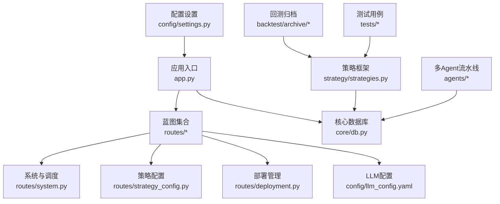
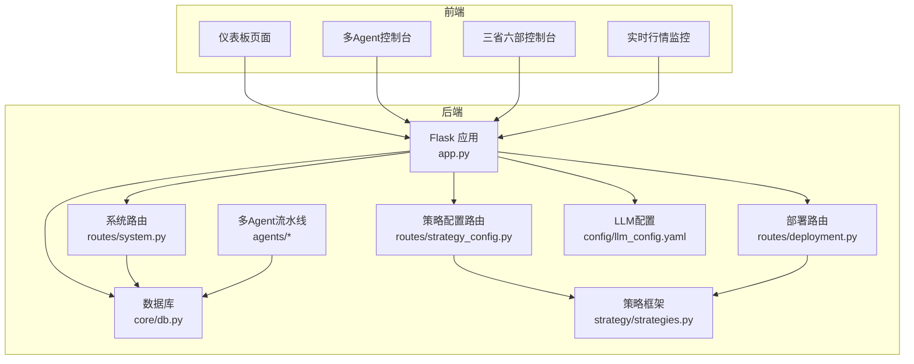
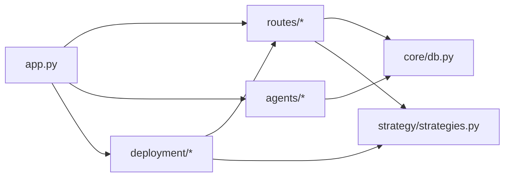

# 贡献指南

<cite>
**本文引用的文件**
- [README.md](file://README.md)
- [requirements.txt](file://requirements.txt)
- [app.py](file://app.py)
- [quant.py](file://quant.py)
- [settings.py](file://config/settings.py)
- [llm_config.yaml](file://config/llm_config.yaml)
- [_任务总结_20260424.md](file://backtest/archive/_任务总结_20260424.md)
- [test_backtest_engine.py](file://tests/test_backtest_engine.py)
- [system.py](file://routes/system.py)
- [db.py](file://core/db.py)
- [strategies.py](file://strategy/strategies.py)
- [manager.py](file://deployment/manager.py)
- [deployment.py](file://routes/deployment.py)
- [strategy_config.py](file://routes/strategy_config.py)
- [governance/__init__.py](file://governance/__init__.py)
- [report_agent.py](file://agents/report_agent.py)
- [test_repository.py](file://tests/test_repository.py)
- [2026-05-02.md](file://.workbuddy/memory/2026-05-02.md)
- [test_pipeline.py](file://test_pipeline.py)
</cite>

## 目录
1. [简介](#简介)
2. [项目结构](#项目结构)
3. [核心组件](#核心组件)
4. [架构总览](#架构总览)
5. [详细组件分析](#详细组件分析)
6. [依赖关系分析](#依赖关系分析)
7. [性能考量](#性能考量)
8. [故障排查指南](#故障排查指南)
9. [结论](#结论)
10. [附录](#附录)

## 简介
本指南面向AIQuant项目的贡献者，提供从代码提交、分支策略、PR流程、代码审查、Issue管理、文档贡献、社区行为到发布与版本管理的全流程规范。目标是帮助新贡献者快速上手，同时确保高质量、可维护、可审计的协作。

## 项目结构
AIQuant是一个A股量化交易系统，采用Python后端（Flask）+ 前端静态页面的架构，核心模块围绕“数据采集与存储”“策略扫描与回测”“多Agent治理”“部署与执行”展开。主要目录与职责概览：
- app.py：后端服务入口，注册所有蓝图与WebSocket路由
- routes/*：API蓝图，提供系统状态、数据同步、策略扫描、部署、LLM等接口
- core/*：核心基础设施，如数据库、同步、任务队列、仓库层
- strategy/*：多策略框架与策略实现
- backtest/*：回测引擎、参数优化、策略拆分分析与归档
- agents/*：多Agent流水线（信号、风控、报告等）
- deployment/*：策略部署与热更新
- config/*：基础配置与LLM配置
- tests/*：单元测试与回归验证
- docs/*：架构文档与方案说明
- .workbuddy/memory/*：迭代记录与变更摘要

图表来源
- [app.py:1-164](file://app.py#L1-L164)
- [routes/system.py:1-152](file://routes/system.py#L1-L152)
- [routes/strategy_config.py:1-38](file://routes/strategy_config.py#L1-L38)
- [routes/deployment.py:132-146](file://routes/deployment.py#L132-L146)
- [config/llm_config.yaml:1-23](file://config/llm_config.yaml#L1-L23)
- [strategy/strategies.py:1-200](file://strategy/strategies.py#L1-L200)
- [core/db.py:1-200](file://core/db.py#L1-L200)
- [tests/test_backtest_engine.py:1-130](file://tests/test_backtest_engine.py#L1-L130)
- [config/settings.py:1-25](file://config/settings.py#L1-L25)

章节来源
- [README.md:1-3](file://README.md#L1-L3)
- [app.py:1-164](file://app.py#L1-L164)
- [config/settings.py:1-25](file://config/settings.py#L1-L25)

## 核心组件
- 后端服务与路由：app.py集中注册蓝图与WebSocket，提供统一仪表板、代理控制台、三省六部控制台、实时行情监控等页面与API。
- 策略扫描与调度：quant.py负责每日定时任务（数据同步、策略扫描），支持v4超跌反弹与5策略融合两种模式。
- 数据与仓储：core/db.py定义SQLite表结构与连接管理，提供建表、索引、事务与迁移辅助。
- 策略框架：strategy/strategies.py提供5类策略的统一输出格式，便于回测与融合。
- 回测与优化：backtest/archive/_任务总结_20260424.md记录了BT引擎、批量验证、参数优化与策略拆分分析成果。
- 多Agent治理：agents/*实现信号、风控、报告等Agent流水线，governance/__init__.py描述三省六部治理架构。
- 部署与热更新：deployment/*与routes/deployment.py提供策略注册、内容更新与配置热加载。
- 测试与验证：tests/*覆盖回测引擎、仓库层导入与行为验证，确保关键逻辑稳定性。

章节来源
- [quant.py:1-631](file://quant.py#L1-L631)
- [core/db.py:1-200](file://core/db.py#L1-L200)
- [strategy/strategies.py:1-200](file://strategy/strategies.py#L1-L200)
- [_任务总结_20260424.md:1-125](file://backtest/archive/_任务总结_20260424.md#L1-L125)
- [governance/__init__.py:1-9](file://governance/__init__.py#L1-L9)
- [deployment/manager.py:154-184](file://deployment/manager.py#L154-L184)
- [routes/deployment.py:132-146](file://routes/deployment.py#L132-L146)
- [tests/test_backtest_engine.py:1-130](file://tests/test_backtest_engine.py#L1-L130)
- [tests/test_repository.py:37-73](file://tests/test_repository.py#L37-L73)

## 架构总览
AIQuant采用“后端API + 前端静态页面 + SQLite本地数据库”的轻量架构。后端通过蓝图模块化组织业务域，核心数据流围绕“数据采集→策略扫描→信号入库→报告生成→部署执行”闭环展开。多Agent流水线在信号生成后进行风控与报告产出，部署模块支持策略内容与配置的热更新。

图表来源
- [app.py:1-164](file://app.py#L1-L164)
- [routes/system.py:1-152](file://routes/system.py#L1-L152)
- [routes/strategy_config.py:1-38](file://routes/strategy_config.py#L1-L38)
- [routes/deployment.py:132-146](file://routes/deployment.py#L132-L146)
- [core/db.py:1-200](file://core/db.py#L1-L200)
- [strategy/strategies.py:1-200](file://strategy/strategies.py#L1-L200)
- [agents/report_agent.py:1-53](file://agents/report_agent.py#L1-L53)
- [config/llm_config.yaml:1-23](file://config/llm_config.yaml#L1-L23)

## 详细组件分析

### Git工作流程与分支策略
- 分支命名规范
  - 主分支：main（受保护，禁止直接推送）
  - 功能分支：feature/xxx（如 feature/new-strategy）
  - 热修复分支：hotfix/xxx（如 hotfix/critical-bug）
  - 文档分支：docs/xxx（如 docs/update-guide）
- 提交信息规范
  - 类型前缀：feat、fix、docs、style、refactor、test、chore、perf、revert
  - 格式：type(scope): subject（subject不超过50字符）
  - 示例：feat(routes): 添加策略配置热加载接口
- 合并请求（PR）流程
  - PR模板：标题、变更摘要、影响范围、测试验证、相关Issue
  - 代码审查：至少一名维护者批准；CI通过；避免大改动无讨论
  - 合并条件：通过审查、测试通过、无冲突、遵循提交规范

### Pull Request标准流程
- PR模板填写
  - 摘要：简述变更目的与范围
  - 影响：涉及模块、API、配置、数据库结构
  - 测试：单元测试、集成测试、手动验证步骤
  - 附件：截图、日志、回测报告链接
- 代码审查要求
  - 代码质量：命名清晰、函数单一职责、注释完整、复杂度可控
  - 安全性：输入校验、敏感信息不硬编码、配置通过环境变量注入
  - 性能：避免N+1查询、批量操作、缓存与索引合理使用
  - 可维护性：可测试性、可扩展性、错误处理与日志
- 测试验证
  - 单元测试：覆盖关键路径与边界条件
  - 集成测试：端到端场景（如扫描、同步、部署）
  - 回归测试：重要缺陷修复后补充用例
- 合并条件
  - 通过审查与CI
  - 无阻塞性问题
  - 更新相关文档与迁移说明

### Issue管理流程
- Bug报告
  - 环境信息：操作系统、Python版本、依赖版本
  - 复现步骤：最小可复现步骤与预期/实际结果
  - 日志与截图：关键错误日志、前后端截图
- 功能请求
  - 场景描述：为什么需要该功能
  - 期望行为：接口设计、数据结构、交互流程
  - 优先级：P0/P1/P2分级
- 问题跟踪
  - 标签：bug、enhancement、help wanted、good first issue
  - 分配：指派给相关模块负责人
  - 关闭：提供解决方案与验证结果

### 文档贡献
- 文档类型
  - 架构与设计：docs/*、backtest/archive/*中的技术总结
  - 使用指南：README扩展、Dashboard说明
  - 示例代码：测试用例、脚本示例
- 贡献方式
  - Markdown格式，保持一致性风格
  - 与代码同步更新，避免文档漂移
  - 提供示例与截图说明关键流程

### 社区行为准则与沟通规范
- 行为准则
  - 尊重与包容：禁止歧视、骚扰与攻击性言论
  - 建设性反馈：聚焦问题与改进建议
  - 透明沟通：公开讨论、记录决策过程
- 沟通渠道
  - Issue/PR评论：技术讨论与决策记录
  - 会议纪要：重要设计评审与版本规划
  - 文档更新：保持知识库一致与可追溯

### 新贡献者快速上手
- 环境准备
  - 安装依赖：requirements.txt
  - 启动后端：python app.py 或使用提供的启动脚本
  - 访问健康检查：GET /api/health
- 常见任务
  - 添加新策略：在strategy/strategies.py中实现并返回统一列
  - 新增API：在routes/新建蓝图并注册到app.py
  - 修复Bug：在hotfix/分支提交修复并通过测试
- 贡献清单
  - 本地运行通过
  - 单元测试通过
  - 文档更新
  - PR模板填写完整

### 发布流程与版本管理
- 版本号策略
  - 语义化版本：主版本.次版本.修订号
  - 变更记录：.workbuddy/memory/*.md记录重大变更
- 发布步骤
  - 合并至main分支（通过审查与测试）
  - 更新版本号与变更日志
  - 打标签并发布Release
  - 通知用户与更新文档

## 依赖关系分析
- 外部依赖
  - requests、pandas、plotly、flask-sock、scikit-learn、joblib等
- 内部模块耦合
  - routes依赖core/db.py与strategy/strategies.py
  - agents依赖core与routes输出
  - deployment依赖routes与core
- 循环依赖
  - 通过蓝图与服务层解耦，避免循环导入

图表来源
- [app.py:1-164](file://app.py#L1-L164)
- [routes/system.py:1-152](file://routes/system.py#L1-L152)
- [routes/strategy_config.py:1-38](file://routes/strategy_config.py#L1-L38)
- [routes/deployment.py:132-146](file://routes/deployment.py#L132-L146)
- [core/db.py:1-200](file://core/db.py#L1-L200)
- [strategy/strategies.py:1-200](file://strategy/strategies.py#L1-L200)
- [deployment/manager.py:154-184](file://deployment/manager.py#L154-L184)

章节来源
- [requirements.txt:1-9](file://requirements.txt#L1-L9)
- [app.py:1-164](file://app.py#L1-L164)
- [core/db.py:1-200](file://core/db.py#L1-L200)
- [strategy/strategies.py:1-200](file://strategy/strategies.py#L1-L200)
- [deployment/manager.py:154-184](file://deployment/manager.py#L154-L184)
- [routes/deployment.py:132-146](file://routes/deployment.py#L132-L146)

## 性能考量
- 数据库性能
  - 使用WAL模式与索引优化高频查询
  - 批量插入与事务封装，减少锁竞争
- 策略扫描
  - 限制扫描数量与并发，避免长时间阻塞
  - 预计算与缓存常用指标，降低重复计算
- 回测与优化
  - 参数搜索空间收敛与早停策略
  - 多线程/并发预测与超时控制
- 部署与热更新
  - 策略内容与配置的增量更新，避免重启

## 故障排查指南
- 健康检查
  - 访问 /api/health 确认服务可用
- 路由调试
  - 访问 /api/debug/routes 查看注册路由与方法
- 数据库问题
  - 检查表结构与索引是否存在
  - 确认连接池与事务提交/回滚
- 策略扫描异常
  - 检查数据同步是否完成与最新日期
  - 确认扫描参数（force_recalc/use_v4）与阈值
- 回测与参数优化
  - 对照历史任务总结，核对信号生成与融合逻辑
- 部署与配置
  - 确认策略内容与配置热加载成功
  - 检查策略注册与内容更新接口返回

章节来源
- [app.py:124-133](file://app.py#L124-L133)
- [routes/system.py:46-152](file://routes/system.py#L46-L152)
- [core/db.py:26-40](file://core/db.py#L26-L40)
- [quant.py:433-546](file://quant.py#L433-L546)
- [_任务总结_20260424.md:1-125](file://backtest/archive/_任务总结_20260424.md#L1-L125)
- [deployment/manager.py:154-184](file://deployment/manager.py#L154-L184)
- [routes/deployment.py:132-146](file://routes/deployment.py#L132-L146)

## 结论
本指南提供了AIQuant项目的完整贡献流程与规范，涵盖Git工作流、PR审查、Issue管理、文档贡献、社区行为与发布流程。建议贡献者在提交前阅读并遵循上述规范，确保代码质量与团队协作效率。

## 附录

### 代码审查检查清单
- 代码质量
  - 命名清晰、函数单一职责、注释完整
  - 复杂度与圈复杂度在可接受范围
- 安全性
  - 输入校验与异常处理
  - 敏感信息不硬编码，通过环境变量注入
- 性能
  - 避免N+1查询与重复计算
  - 批量操作与缓存策略
- 可维护性
  - 可测试性与可扩展性
  - 错误日志与可观测性

### 常见问题解答
- 如何添加新的策略？
  - 在strategy/strategies.py中实现并返回统一列，确保与回测/扫描兼容
- 如何新增API端点？
  - 在routes/新建蓝图并在app.py注册，编写单元测试
- 如何进行参数优化？
  - 参考回测归档中的优化脚本与参数搜索策略
- 如何热更新策略配置？
  - 使用部署管理器与相关路由，确保配置热加载成功