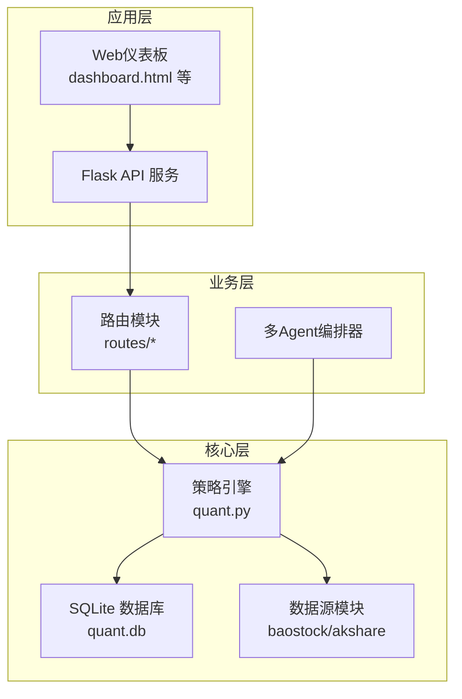
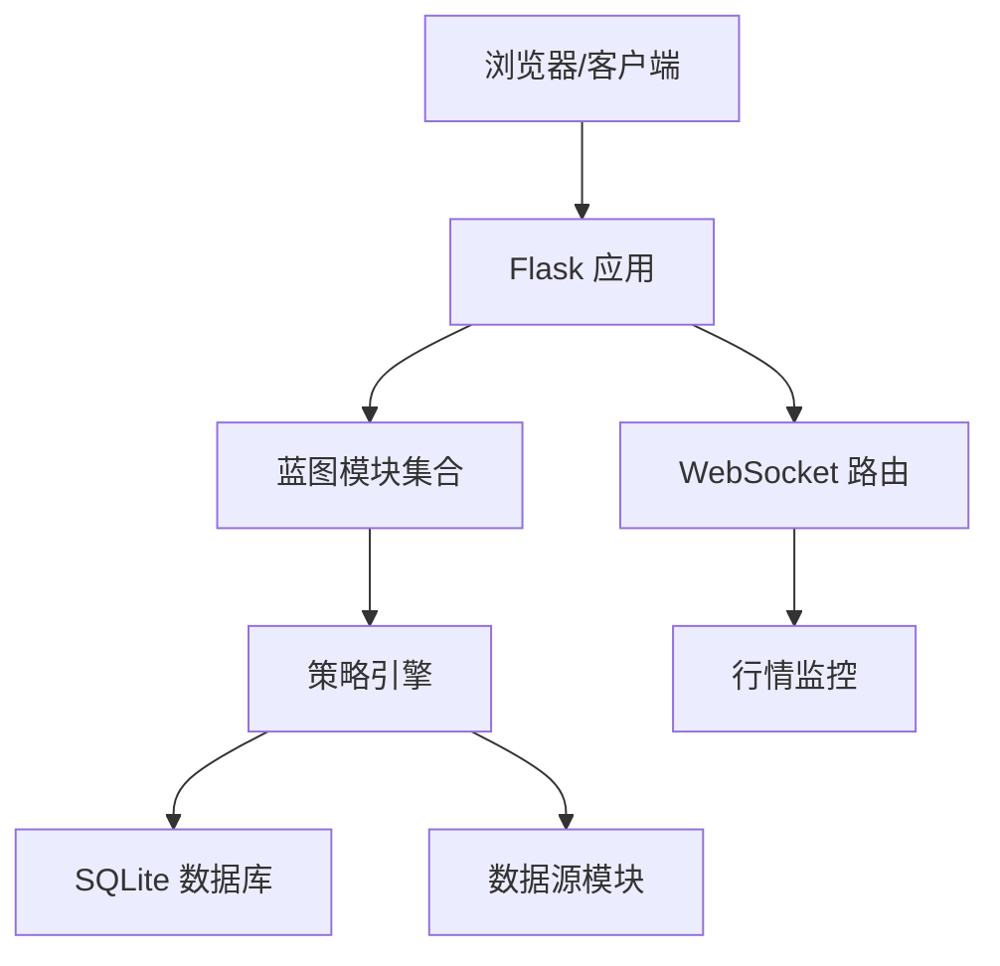
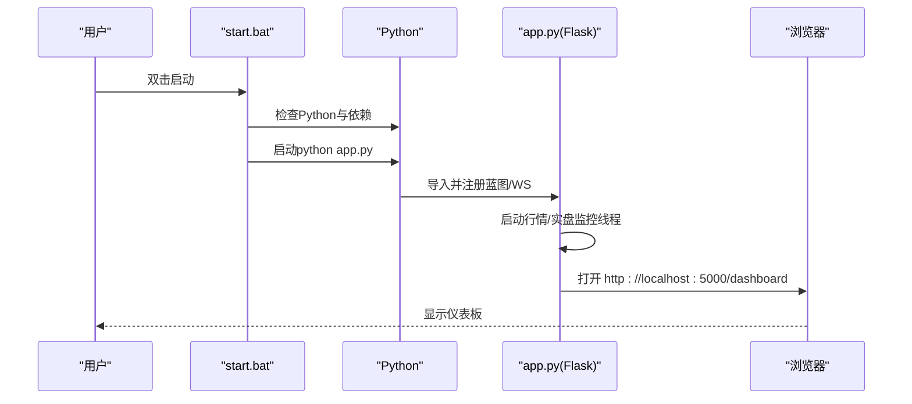
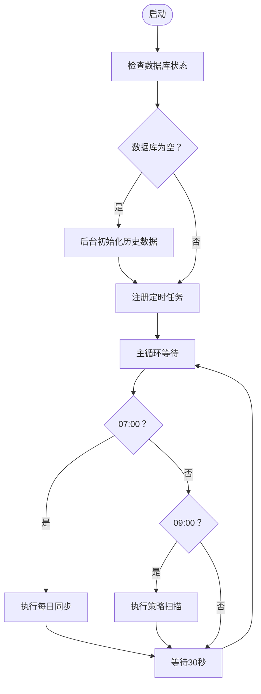
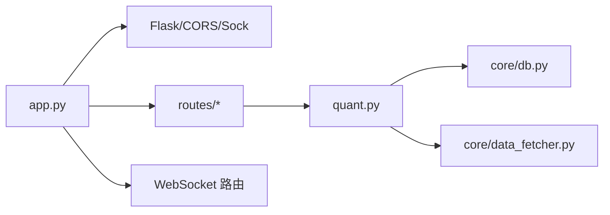

# 快速开始

<cite>
**本文引用的文件**
- [README.md](file://README.md)
- [requirements.txt](file://requirements.txt)
- [install.bat](file://install.bat)
- [start.bat](file://start.bat)
- [start-bg.bat](file://start-bg.bat)
- [app.py](file://app.py)
- [quant.py](file://quant.py)
- [config/settings.py](file://config/settings.py)
- [config/llm_config.yaml](file://config/llm_config.yaml)
- [routes/system.py](file://routes/system.py)
- [core/db.py](file://core/db.py)
- [core/data_fetcher.py](file://core/data_fetcher.py)
- [test_pipeline.py](file://test_pipeline.py)
</cite>

## 目录
1. [简介](#简介)
2. [项目结构](#项目结构)
3. [核心组件](#核心组件)
4. [架构总览](#架构总览)
5. [详细组件分析](#详细组件分析)
6. [依赖关系分析](#依赖关系分析)
7. [性能考虑](#性能考虑)
8. [故障排除指南](#故障排除指南)
9. [结论](#结论)
10. [附录](#附录)

## 简介
本指南面向新手用户，帮助你在30分钟内完成AIQuant量化交易系统的环境搭建、数据库初始化、系统启动与基本验证。系统采用Python开发，提供Web仪表板与多Agent流水线能力，支持A股数据的采集、策略扫描、回测与风控。

## 项目结构
- 后端服务：基于Flask提供REST API与WebSocket，注册多个蓝图模块，统一对外提供接口与页面。
- 数据层：SQLite数据库，自动建表与迁移，提供行情、指数、信号、风控等表结构。
- 数据源：baostock为主，akshare为备，支持历史行情与实时价格获取。
- 策略引擎：内置多策略融合与v4超跌反弹策略，支持扫描与回填历史推荐。
- 启动脚本：Windows批处理脚本，一键安装依赖、检查端口、启动服务并打开浏览器。
- 配置：settings.py集中管理数据库路径、API主机端口、定时任务时间等；llm_config.yaml管理大模型参数与功能开关。

**图表来源**
- [app.py:1-164](file://app.py#L1-L164)
- [routes/system.py:1-152](file://routes/system.py#L1-L152)
- [core/db.py:1-800](file://core/db.py#L1-L800)
- [core/data_fetcher.py:1-578](file://core/data_fetcher.py#L1-L578)
- [quant.py:1-631](file://quant.py#L1-L631)

**章节来源**
- [README.md:1-3](file://README.md#L1-L3)
- [app.py:1-164](file://app.py#L1-L164)
- [config/settings.py:1-25](file://config/settings.py#L1-L25)

## 核心组件
- 后端服务与路由
  - Flask应用注册多个蓝图，提供系统状态、股票、回测、策略、信号、风控、LLM、部署等接口。
  - 提供健康检查、仪表板页面与WebSocket路由注册。
- 数据库与表结构
  - 自动初始化数据库与表，包含stock_info、daily_price、stock_signal、index_daily、positions、trades、account_snapshots、risk_events等。
  - 提供批量写入、查询、索引管理与迁移。
- 数据获取
  - baostock为主数据源，akshare为备选，支持历史行情、指数、股票列表、实时价格与市值估算。
- 策略引擎
  - 支持5策略融合与v4超跌反弹策略，扫描全市场股票并生成推荐，支持历史回填stock_signal。
- 启动与调度
  - start.bat负责依赖检查、端口占用处理、启动Flask并打开浏览器；start-bg.bat支持静默后台启动。
  - 定时任务在app.py中自动注册，每日07:00同步数据，09:00策略扫描。

**章节来源**
- [app.py:1-164](file://app.py#L1-L164)
- [core/db.py:57-467](file://core/db.py#L57-L467)
- [core/data_fetcher.py:1-578](file://core/data_fetcher.py#L1-L578)
- [quant.py:289-546](file://quant.py#L289-L546)
- [start.bat:1-91](file://start.bat#L1-L91)
- [start-bg.bat:1-36](file://start-bg.bat#L1-L36)

## 架构总览
系统采用“前端页面 + Flask后端 + 多Agent流水线 + SQLite数据库”的分层架构。后端通过蓝图模块化组织功能，策略引擎与数据源解耦，便于扩展与维护。

**图表来源**
- [app.py:39-75](file://app.py#L39-L75)
- [app.py:148-164](file://app.py#L148-L164)
- [routes/system.py:12-83](file://routes/system.py#L12-L83)
- [core/db.py:19-40](file://core/db.py#L19-L40)
- [core/data_fetcher.py:12-45](file://core/data_fetcher.py#L12-L45)

## 详细组件分析

### 环境与依赖安装
- Python版本要求
  - 安装脚本会检测Python版本，提示需先安装Python 3.11及以上。
- 依赖安装
  - requirements.txt列出核心依赖：requests、streamlit、pandas、plotly、flask-sock、simple-websocket、scikit-learn、joblib。
  - install.bat会升级pip并安装上述依赖，同时追加安装Flask、CORS、schedule、requests、pandas、plotly。
- 注意事项
  - 若网络受限，建议先配置国内镜像源，或手动下载离线安装包。
  - 如出现权限问题，可在管理员命令行中运行安装脚本。

**章节来源**
- [install.bat:13-31](file://install.bat#L13-L31)
- [requirements.txt:1-9](file://requirements.txt#L1-L9)

### 数据库初始化
- 自动建表
  - 首次运行或手动调用初始化函数会创建所有表与索引，并进行必要的列迁移。
- 表结构概览
  - 股票基本信息、每日行情、指数行情、策略信号、持仓与交易、账户快照、风控事件与状态、黑名单与豁免、审计日志等。
- 数据库路径
  - 默认位于core目录下的quant.db文件。

**章节来源**
- [core/db.py:57-467](file://core/db.py#L57-L467)
- [config/settings.py:7-8](file://config/settings.py#L7-L8)

### 系统启动方式
- 前台启动
  - 运行start.bat：自动检查Python与依赖、关闭占用5000端口的旧进程、启动Flask并在浏览器打开仪表板。
- 后台启动
  - 运行start-bg.bat：若未运行则静默启动pythonw进程并打开仪表板；若已在运行则直接打开浏览器。
- 直接运行后端
  - python app.py：启动Flask服务，自动注册所有蓝图与WebSocket路由，并启动行情与实盘监控线程。

**图表来源**
- [start.bat:14-85](file://start.bat#L14-L85)
- [app.py:148-164](file://app.py#L148-L164)

**章节来源**
- [start.bat:1-91](file://start.bat#L1-L91)
- [start-bg.bat:1-36](file://start-bg.bat#L1-L36)
- [app.py:148-164](file://app.py#L148-L164)

### 基本配置说明
- 基础配置（settings.py）
  - 数据库路径：DB_PATH
  - API监听：API_HOST、API_PORT、API_DEBUG
  - 定时任务：SCHEDULE_SYNC_TIME、SCHEDULE_SCAN_TIME
  - 同步参数：SYNC_BATCH_SIZE、SYNC_VERBOSE
  - 日志级别：LOG_LEVEL
- LLM配置（llm_config.yaml）
  - 模型与Base URL、API Key、温度与最大Token、超时
  - 功能开关：enabled、enhanced_intent_parsing、auto_trade_reason、market_analysis

**章节来源**
- [config/settings.py:1-25](file://config/settings.py#L1-L25)
- [config/llm_config.yaml:1-23](file://config/llm_config.yaml#L1-L23)

### 策略扫描与数据同步
- 策略扫描
  - 支持两种模式：5策略融合与v4超跌反弹；可选择是否强制重算全市场策略分。
  - 扫描完成后将结果保存至stock_signal与signal_records表，并输出微信消息文本。
- 数据同步
  - 每日16:00自动同步收盘数据，清理缓存文件。
- 定时任务
  - app.py中注册07:00同步与09:00扫描；也可通过系统路由手动触发。

**图表来源**
- [quant.py:552-567](file://quant.py#L552-L567)
- [quant.py:433-440](file://quant.py#L433-L440)
- [app.py:154-161](file://app.py#L154-L161)

**章节来源**
- [quant.py:289-546](file://quant.py#L289-L546)
- [routes/system.py:12-83](file://routes/system.py#L12-L83)
- [app.py:154-161](file://app.py#L154-L161)

### 数据获取与缓存
- 数据源
  - baostock为主，akshare为备，支持股票列表、历史行情、指数、实时价格与市值估算。
- 缓存机制
  - 历史数据写入CSV缓存目录，减少重复请求与网络压力。
- 错误处理
  - 主数据源失败时自动降级到备用数据源；若仍失败抛出异常提示。

**章节来源**
- [core/data_fetcher.py:12-45](file://core/data_fetcher.py#L12-L45)
- [core/data_fetcher.py:173-223](file://core/data_fetcher.py#L173-L223)

### 多Agent流水线（可选）
- 组件组成
  - DataAgent、SignalAgent、BacktestAgent、RiskAgent、ReportAgent，通过PipelineOrchestrator编排。
- 测试流程
  - test_pipeline.py提供端到端测试，支持Mock与真实数据两种模式，验证各Agent导入、编排器状态与报告生成。

**章节来源**
- [test_pipeline.py:1-392](file://test_pipeline.py#L1-L392)

## 依赖关系分析
- 后端依赖
  - Flask、CORS、Sock（WebSocket）、蓝图模块、调度器。
- 数据层依赖
  - SQLite、pandas、numpy。
- 数据源依赖
  - baostock、akshare、requests。
- 前端资源
  - 仪表板HTML文件与静态资源。

**图表来源**
- [app.py:39-75](file://app.py#L39-L75)
- [quant.py:23-25](file://quant.py#L23-L25)
- [core/db.py:19-40](file://core/db.py#L19-L40)
- [core/data_fetcher.py:12-45](file://core/data_fetcher.py#L12-L45)

**章节来源**
- [app.py:1-164](file://app.py#L1-L164)
- [quant.py:1-631](file://quant.py#L1-L631)
- [core/db.py:1-800](file://core/db.py#L1-L800)
- [core/data_fetcher.py:1-578](file://core/data_fetcher.py#L1-L578)

## 性能考虑
- 数据库
  - WAL模式与适度同步参数提升并发写入性能；为高频查询建立索引。
- 策略扫描
  - 分批处理与进度打印，避免长时间阻塞；可选择是否强制重算全市场策略分。
- 数据源
  - 缓存历史数据，降低重复请求；主备数据源自动降级，提升稳定性。
- 启动与监控
  - 后台线程初始化数据库与监控，避免阻塞主服务。

[本节为通用指导，无需特定文件引用]

## 故障排除指南
- Python未安装或版本过低
  - 现象：安装脚本报错提示未找到Python。
  - 解决：安装Python 3.11+并确保加入PATH。
- 依赖安装失败
  - 现象：pip安装报错或超时。
  - 解决：配置国内镜像源或离线安装；确认网络可达。
- 端口被占用
  - 现象：启动后提示端口5000被占用。
  - 解决：start.bat会尝试终止占用进程；必要时手动结束相关进程。
- 数据库初始化异常
  - 现象：表未创建或列缺失。
  - 解决：确认DB_PATH有效；删除旧数据库文件后重启服务触发重建。
- 数据源获取失败
  - 现象：历史数据或实时价格为空。
  - 解决：检查网络；切换备用数据源；查看缓存目录是否存在CSV文件。
- 策略扫描无结果
  - 现象：扫描完成后无命中股票。
  - 解决：确认数据库中有行情数据；检查阈值设置；尝试强制重算策略分。

**章节来源**
- [install.bat:13-31](file://install.bat#L13-L31)
- [start.bat:42-65](file://start.bat#L42-L65)
- [core/db.py:57-467](file://core/db.py#L57-L467)
- [core/data_fetcher.py:204-222](file://core/data_fetcher.py#L204-L222)
- [quant.py:446-461](file://quant.py#L446-L461)

## 结论
按照本指南，你可以在30分钟内完成环境准备、数据库初始化、系统启动与基本验证。建议先从前台启动方式熟悉系统，再根据需要配置LLM与后台启动。如需进一步扩展，可参考多Agent流水线与策略模块进行二次开发。

[本节为总结性内容，无需特定文件引用]

## 附录

### 快速验证清单
- 安装Python 3.11+
- 运行install.bat安装依赖
- 运行start.bat启动服务并打开仪表板
- 访问 http://localhost:5000/api/health 检查健康状态
- 访问 http://localhost:5000/dashboard 查看仪表板
- 手动触发同步与扫描：POST /api/system/sync 与 POST /api/system/scan

**章节来源**
- [start.bat:68-76](file://start.bat#L68-L76)
- [app.py:131-133](file://app.py#L131-L133)
- [routes/system.py:12-43](file://routes/system.py#L12-L43)